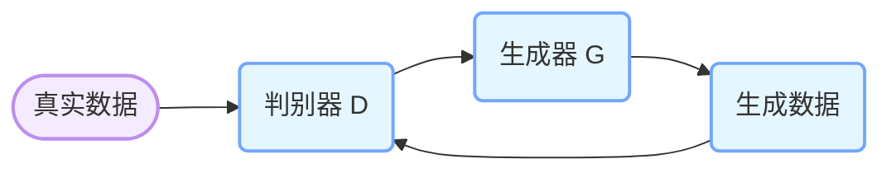

# 模型训练中的对抗学习技术前沿探索

> 关键词：模型训练、对抗学习、生成对抗网络、博弈论、深度神经网络、机器学习、人工智能

> 摘要：本文围绕模型训练中的对抗学习技术展开前沿探索。首先介绍对抗学习的背景知识，包括其目的、适用读者群体、文档结构和相关术语。接着深入阐述对抗学习的核心概念与联系，通过文本示意图和 Mermaid 流程图呈现其原理和架构。详细讲解核心算法原理，结合 Python 源代码进行具体操作步骤的说明。探讨对抗学习背后的数学模型和公式，并举例说明。通过项目实战给出代码实际案例及详细解释。分析对抗学习的实际应用场景，推荐相关的工具和资源。最后总结对抗学习的未来发展趋势与挑战，附录中提供常见问题与解答，并给出扩展阅读和参考资料，旨在为读者全面呈现对抗学习技术在模型训练中的前沿进展和应用。

## 1. 背景介绍 
### 1.1 目的和范围
在当今的机器学习和人工智能领域，模型训练面临着诸多挑战，如数据的多样性、模型的泛化能力、对抗样本的防御等。对抗学习作为一种新兴的技术，为解决这些问题提供了新的思路和方法。本文的目的在于全面深入地探索模型训练中的对抗学习技术，涵盖其基本概念、算法原理、数学模型、实际应用以及未来发展趋势等方面，旨在为读者提供一个系统、全面的对抗学习技术知识体系。

### 1.2 预期读者
本文预期读者包括对机器学习、人工智能领域有一定基础的研究人员、开发者、工程师以及相关专业的学生。对于希望深入了解对抗学习技术在模型训练中的应用和发展的人士，本文将提供有价值的参考。

### 1.3 文档结构概述
本文将按照以下结构展开：首先介绍对抗学习的背景知识，包括目的、读者群体、文档结构和术语表。接着深入探讨对抗学习的核心概念与联系，通过文本示意图和流程图进行清晰呈现。详细讲解核心算法原理，结合 Python 代码说明具体操作步骤。阐述对抗学习的数学模型和公式，并举例说明。通过项目实战给出代码实际案例及详细解释。分析对抗学习的实际应用场景，推荐相关的工具和资源。最后总结对抗学习的未来发展趋势与挑战，附录中提供常见问题与解答，并给出扩展阅读和参考资料。

### 1.4 术语表
#### 1.4.1 核心术语定义
- **对抗学习（Adversarial Learning）**：一种机器学习范式，通过两个或多个模型之间的对抗博弈来提高模型的性能和鲁棒性。
- **生成对抗网络（Generative Adversarial Networks，GANs）**：对抗学习中最具代表性的模型，由生成器和判别器组成，通过对抗训练来生成与真实数据分布相似的样本。
- **生成器（Generator）**：在 GANs 中，负责生成模拟数据的模型。
- **判别器（Discriminator）**：在 GANs 中，负责判断输入数据是真实数据还是生成器生成的模拟数据的模型。
- **对抗样本（Adversarial Examples）**：通过对原始数据进行微小的、精心设计的扰动，使得模型产生错误分类的样本。

#### 1.4.2 相关概念解释
- **博弈论（Game Theory）**：研究决策主体在相互对抗或合作中的策略选择的数学理论，对抗学习的思想源于博弈论中的零和博弈。
- **深度神经网络（Deep Neural Networks）**：由多个神经元层组成的神经网络，在对抗学习中广泛应用于生成器和判别器的构建。
- **梯度下降（Gradient Descent）**：一种优化算法，用于更新模型的参数，使得损失函数最小化。在对抗学习中，生成器和判别器通过梯度下降来进行训练。

#### 1.4.3 缩略词列表
- **GANs**：Generative Adversarial Networks（生成对抗网络）
- **DNN**：Deep Neural Networks（深度神经网络）
- **SGD**：Stochastic Gradient Descent（随机梯度下降）

## 2. 核心概念与联系 
对抗学习的核心思想源于博弈论中的零和博弈。在零和博弈中，两个参与者的利益是完全相反的，一方的收益必然意味着另一方的损失。在对抗学习中，通常有两个模型：生成器和判别器，它们通过对抗博弈来不断提升自己的性能。

### 文本示意图
```plaintext
              ┌─────────────┐
              │  真实数据   │
              └─────────────┘
                    │
                    ▼
           ┌─────────────────┐
           │  判别器 (D)     │
           └─────────────────┘
               │       │
               │       ▼
               │  ┌─────────────┐
               │  │  生成器 (G) │
               │  └─────────────┘
               │       │
               │       ▼
               │  ┌─────────────┐
               └─►│  生成数据   │
                  └─────────────┘
```
### Mermaid 流程图

在这个过程中，生成器的目标是生成尽可能逼真的模拟数据，以欺骗判别器；而判别器的目标是准确地判断输入数据是真实数据还是生成数据。通过不断的对抗训练，生成器和判别器的性能都得到了提升。

## 3. 核心算法原理 & 具体操作步骤 
### 生成对抗网络（GANs）的核心算法原理
GANs 的核心思想是通过生成器和判别器之间的对抗训练来学习数据的分布。生成器从一个随机噪声向量中生成模拟数据，判别器则尝试区分真实数据和生成数据。

### Python 源代码实现
```python
import torch
import torch.nn as nn
import torch.optim as optim
import numpy as np
import matplotlib.pyplot as plt

# 定义生成器
class Generator(nn.Module):
    def __init__(self, input_size, output_size):
        super(Generator, self).__init__()
        self.model = nn.Sequential(
            nn.Linear(input_size, 128),
            nn.LeakyReLU(0.2),
            nn.Linear(128, output_size),
            nn.Tanh()
        )

    def forward(self, x):
        return self.model(x)

# 定义判别器
class Discriminator(nn.Module):
    def __init__(self, input_size):
        super(Discriminator, self).__init__()
        self.model = nn.Sequential(
            nn.Linear(input_size, 128),
            nn.LeakyReLU(0.2),
            nn.Linear(128, 1),
            nn.Sigmoid()
        )

    def forward(self, x):
        return self.model(x)

# 超参数设置
input_size = 100
output_size = 1
batch_size = 32
epochs = 100
lr = 0.0002

# 初始化生成器和判别器
generator = Generator(input_size, output_size)
discriminator = Discriminator(output_size)

# 定义损失函数和优化器
criterion = nn.BCELoss()
g_optimizer = optim.Adam(generator.parameters(), lr=lr)
d_optimizer = optim.Adam(discriminator.parameters(), lr=lr)

# 训练过程
for epoch in range(epochs):
    # 生成随机噪声
    noise = torch.randn(batch_size, input_size)
    # 生成数据
    generated_data = generator(noise)

    # 真实数据（这里简单模拟）
    real_data = torch.FloatTensor(np.random.normal(0, 1, (batch_size, output_size)))

    # 训练判别器
    d_optimizer.zero_grad()
    real_labels = torch.ones(batch_size, 1)
    fake_labels = torch.zeros(batch_size, 1)

    # 计算判别器对真实数据的损失
    real_output = discriminator(real_data)
    d_real_loss = criterion(real_output, real_labels)

    # 计算判别器对生成数据的损失
    fake_output = discriminator(generated_data.detach())
    d_fake_loss = criterion(fake_output, fake_labels)

    # 总判别器损失
    d_loss = d_real_loss + d_fake_loss
    d_loss.backward()
    d_optimizer.step()

    # 训练生成器
    g_optimizer.zero_grad()
    fake_output = discriminator(generated_data)
    g_loss = criterion(fake_output, real_labels)
    g_loss.backward()
    g_optimizer.step()

    if epoch % 10 == 0:
        print(f'Epoch [{epoch}/{epochs}], D_loss: {d_loss.item():.4f}, G_loss: {g_loss.item():.4f}')
```
### 具体操作步骤
1. **初始化模型**：初始化生成器和判别器的网络结构。
2. **定义损失函数和优化器**：使用二元交叉熵损失函数（BCELoss）和 Adam 优化器。
3. **训练判别器**：
    - 生成随机噪声，通过生成器生成模拟数据。
    - 准备真实数据。
    - 计算判别器对真实数据和生成数据的损失，更新判别器的参数。
4. **训练生成器**：
    - 生成随机噪声，通过生成器生成模拟数据。
    - 计算生成器生成的数据被判别器判断为真实数据的损失，更新生成器的参数。
5. **迭代训练**：重复步骤 3 和 4，直到达到指定的训练轮数。

## 4. 数学模型和公式 & 详细讲解 & 举例说明 
### 生成对抗网络（GANs）的数学模型
GANs 的目标是学习数据的真实分布 $p_{data}(x)$。生成器 $G(z; \theta_g)$ 接受一个随机噪声向量 $z$ 作为输入，生成模拟数据 $x = G(z; \theta_g)$，其中 $\theta_g$ 是生成器的参数。判别器 $D(x; \theta_d)$ 接受输入数据 $x$，输出一个概率值，表示 $x$ 是真实数据的概率，其中 $\theta_d$ 是判别器的参数。

GANs 的目标函数可以表示为一个极小极大博弈问题：
$$
\min_G \max_D V(D, G) = \mathbb{E}_{x \sim p_{data}(x)}[\log D(x)] + \mathbb{E}_{z \sim p_z(z)}[\log(1 - D(G(z)))]
$$
### 详细讲解
- **判别器的目标**：判别器的目标是最大化目标函数 $V(D, G)$，即尽可能准确地判断输入数据是真实数据还是生成数据。对于真实数据 $x$，判别器希望 $D(x)$ 尽可能接近 1；对于生成数据 $G(z)$，判别器希望 $D(G(z))$ 尽可能接近 0。
- **生成器的目标**：生成器的目标是最小化目标函数 $V(D, G)$，即尽可能生成逼真的模拟数据，以欺骗判别器。生成器希望 $D(G(z))$ 尽可能接近 1。

### 举例说明
假设我们有一个简单的一维数据集，其真实分布 $p_{data}(x)$ 是一个正态分布 $N(0, 1)$。生成器 $G(z; \theta_g)$ 接受一个随机噪声向量 $z$ 作为输入，生成一个一维的模拟数据 $x = G(z; \theta_g)$。判别器 $D(x; \theta_d)$ 接受输入数据 $x$，输出一个概率值，表示 $x$ 是真实数据的概率。

在训练过程中，判别器会不断学习区分真实数据和生成数据，而生成器会不断学习生成更逼真的模拟数据。最终，生成器生成的数据分布会逐渐接近真实数据的分布。

## 5. 项目实战：代码实际案例和详细解释说明 
### 5.1  开发环境搭建
- **操作系统**：Windows、Linux 或 macOS
- **编程语言**：Python 3.x
- **深度学习框架**：PyTorch
- **开发工具**：Jupyter Notebook 或 PyCharm

### 5.2  源代码详细实现和代码解读
```python
import torch
import torch.nn as nn
import torch.optim as optim
import numpy as np
import matplotlib.pyplot as plt

# 定义生成器
class Generator(nn.Module):
    def __init__(self, input_size, output_size):
        super(Generator, self).__init__()
        self.model = nn.Sequential(
            nn.Linear(input_size, 128),
            nn.LeakyReLU(0.2),
            nn.Linear(128, output_size),
            nn.Tanh()
        )

    def forward(self, x):
        return self.model(x)

# 定义判别器
class Discriminator(nn.Module):
    def __init__(self, input_size):
        super(Discriminator, self).__init__()
        self.model = nn.Sequential(
            nn.Linear(input_size, 128),
            nn.LeakyReLU(0.2),
            nn.Linear(128, 1),
            nn.Sigmoid()
        )

    def forward(self, x):
        return self.model(x)

# 超参数设置
input_size = 100
output_size = 1
batch_size = 32
epochs = 100
lr = 0.0002

# 初始化生成器和判别器
generator = Generator(input_size, output_size)
discriminator = Discriminator(output_size)

# 定义损失函数和优化器
criterion = nn.BCELoss()
g_optimizer = optim.Adam(generator.parameters(), lr=lr)
d_optimizer = optim.Adam(discriminator.parameters(), lr=lr)

# 训练过程
for epoch in range(epochs):
    # 生成随机噪声
    noise = torch.randn(batch_size, input_size)
    # 生成数据
    generated_data = generator(noise)

    # 真实数据（这里简单模拟）
    real_data = torch.FloatTensor(np.random.normal(0, 1, (batch_size, output_size)))

    # 训练判别器
    d_optimizer.zero_grad()
    real_labels = torch.ones(batch_size, 1)
    fake_labels = torch.zeros(batch_size, 1)

    # 计算判别器对真实数据的损失
    real_output = discriminator(real_data)
    d_real_loss = criterion(real_output, real_labels)

    # 计算判别器对生成数据的损失
    fake_output = discriminator(generated_data.detach())
    d_fake_loss = criterion(fake_output, fake_labels)

    # 总判别器损失
    d_loss = d_real_loss + d_fake_loss
    d_loss.backward()
    d_optimizer.step()

    # 训练生成器
    g_optimizer.zero_grad()
    fake_output = discriminator(generated_data)
    g_loss = criterion(fake_output, real_labels)
    g_loss.backward()
    g_optimizer.step()

    if epoch % 10 == 0:
        print(f'Epoch [{epoch}/{epochs}], D_loss: {d_loss.item():.4f}, G_loss: {g_loss.item():.4f}')
```
### 代码解读
1. **生成器和判别器的定义**：
    - `Generator` 类定义了生成器的网络结构，包括两个全连接层和一个 LeakyReLU 激活函数。
    - `Discriminator` 类定义了判别器的网络结构，包括两个全连接层和一个 Sigmoid 激活函数。
2. **超参数设置**：
    - `input_size`：生成器的输入噪声向量的维度。
    - `output_size`：生成器的输出数据的维度。
    - `batch_size`：每次训练的样本数量。
    - `epochs`：训练的轮数。
    - `lr`：学习率。
3. **训练过程**：
    - 生成随机噪声，通过生成器生成模拟数据。
    - 准备真实数据。
    - 训练判别器：计算判别器对真实数据和生成数据的损失，更新判别器的参数。
    - 训练生成器：计算生成器生成的数据被判别器判断为真实数据的损失，更新生成器的参数。

### 5.3  代码解读与分析
- **判别器的训练**：判别器的目标是区分真实数据和生成数据，因此在训练判别器时，需要计算判别器对真实数据和生成数据的损失，并将它们相加作为总损失。在计算生成数据的损失时，需要使用 `detach()` 方法来阻止梯度传播到生成器。
- **生成器的训练**：生成器的目标是生成逼真的模拟数据，以欺骗判别器，因此在训练生成器时，需要计算生成器生成的数据被判别器判断为真实数据的损失。

## 6. 实际应用场景 
### 图像生成
对抗学习在图像生成领域取得了显著的成果。通过训练生成对抗网络，可以生成高质量的图像，如人脸图像、风景图像等。例如，StyleGAN 是一种基于对抗学习的图像生成模型，它可以生成非常逼真的人脸图像。

### 数据增强
在机器学习中，数据的多样性对于模型的性能至关重要。对抗学习可以用于生成新的样本，从而增加数据的多样性，提高模型的泛化能力。例如，在图像分类任务中，可以使用对抗学习生成新的图像样本，用于训练模型。

### 对抗样本防御
对抗样本是指通过对原始数据进行微小的、精心设计的扰动，使得模型产生错误分类的样本。对抗学习可以用于训练防御模型，以提高模型对对抗样本的鲁棒性。例如，通过训练一个生成对抗网络，生成对抗样本，并使用这些对抗样本训练防御模型，可以提高防御模型对对抗样本的识别能力。

### 强化学习
在强化学习中，对抗学习可以用于训练智能体。例如，通过训练一个生成对抗网络，生成不同的环境状态，让智能体在这些环境状态下进行训练，从而提高智能体的泛化能力。

## 7. 工具和资源推荐
### 7.1 学习资源推荐
#### 7.1.1 书籍推荐
- 《深度学习》（Deep Learning）：由 Ian Goodfellow、Yoshua Bengio 和 Aaron Courville 合著，是深度学习领域的经典教材，其中包含了对抗学习的相关内容。
- 《生成对抗网络实战》（GANs in Action）：由 Jakub Langr 和 Vladimir Bok 合著，详细介绍了生成对抗网络的原理和应用。

#### 7.1.2 在线课程
- Coursera 上的“深度学习专项课程”（Deep Learning Specialization）：由 Andrew Ng 教授主讲，包含了对抗学习的相关内容。
- Udemy 上的“生成对抗网络实战”（GANs from Scratch）：详细介绍了生成对抗网络的原理和实现。

#### 7.1.3 技术博客和网站
- arXiv.org：是一个开放的学术预印本平台，包含了大量的对抗学习相关的研究论文。
- Medium 上的 Towards Data Science：是一个数据科学和机器学习领域的技术博客，包含了很多对抗学习的相关文章。

### 7.2 开发工具框架推荐
#### 7.2.1 IDE和编辑器
- PyCharm：是一款专业的 Python 集成开发环境，提供了丰富的代码编辑、调试和部署功能。
- Jupyter Notebook：是一个交互式的开发环境，适合用于快速原型开发和数据可视化。

#### 7.2.2 调试和性能分析工具
- TensorBoard：是 TensorFlow 提供的一个可视化工具，可以用于查看模型的训练过程、损失函数曲线等。
- PyTorch Profiler：是 PyTorch 提供的一个性能分析工具，可以用于分析模型的性能瓶颈。

#### 7.2.3 相关框架和库
- PyTorch：是一个开源的深度学习框架，提供了丰富的深度学习模型和工具，支持对抗学习的实现。
- TensorFlow：是另一个开源的深度学习框架，也支持对抗学习的实现。

### 7.3 相关论文著作推荐
#### 7.3.1 经典论文
- “Generative Adversarial Nets”：由 Ian Goodfellow 等人发表，是对抗学习领域的开山之作，首次提出了生成对抗网络的概念。
- “Unsupervised Representation Learning with Deep Convolutional Generative Adversarial Networks”：由 Alec Radford 等人发表，提出了深度卷积生成对抗网络（DCGAN），为图像生成领域的发展奠定了基础。

#### 7.3.2 最新研究成果
- 关注 arXiv.org 上的最新研究论文，了解对抗学习领域的最新进展。
- 参加相关的学术会议，如 NeurIPS、ICML 等，了解对抗学习领域的最新研究成果。

#### 7.3.3 应用案例分析
- 关注 Kaggle 上的相关竞赛和项目，了解对抗学习在实际应用中的案例。
- 阅读相关的技术博客和文章，了解对抗学习在不同领域的应用案例。

## 8. 总结：未来发展趋势与挑战
### 未来发展趋势
- **多样化的应用场景**：对抗学习将在更多的领域得到应用，如医疗、金融、交通等。例如，在医疗领域，对抗学习可以用于生成医学图像、辅助疾病诊断等。
- **模型的融合与创新**：对抗学习将与其他机器学习技术进行融合，如强化学习、迁移学习等，以提高模型的性能和泛化能力。例如，将对抗学习与强化学习相结合，可以训练出更智能的智能体。
- **理论的深入研究**：对抗学习的理论研究将不断深入，包括对抗学习的收敛性、稳定性、泛化能力等方面的研究。这将为对抗学习的实际应用提供更坚实的理论基础。

### 挑战
- **训练的稳定性**：对抗学习的训练过程往往不稳定，容易出现梯度消失、梯度爆炸等问题。如何提高对抗学习的训练稳定性是一个亟待解决的问题。
- **可解释性**：对抗学习的模型往往是黑盒模型，难以解释其决策过程。如何提高对抗学习模型的可解释性是一个重要的研究方向。
- **安全性**：对抗学习生成的对抗样本可能会被用于恶意攻击，如图像篡改、语音欺骗等。如何保障对抗学习的安全性是一个需要关注的问题。

## 9. 附录：常见问题与解答
### 问题 1：对抗学习和传统机器学习有什么区别？
对抗学习通过两个或多个模型之间的对抗博弈来提高模型的性能，而传统机器学习通常是通过优化一个目标函数来训练模型。对抗学习可以学习到数据的复杂分布，而传统机器学习可能在处理复杂数据分布时存在局限性。

### 问题 2：对抗学习的训练过程为什么不稳定？
对抗学习的训练过程不稳定主要是由于生成器和判别器之间的相互作用。当判别器过于强大时，生成器可能无法学习到有效的数据分布；当生成器过于强大时，判别器可能无法准确地区分真实数据和生成数据。此外，对抗学习的目标函数是非凸的，也增加了训练的难度。

### 问题 3：如何提高对抗学习的训练稳定性？
可以采用以下方法提高对抗学习的训练稳定性：
- **优化算法**：选择合适的优化算法，如 Adam 优化器。
- **正则化**：使用正则化方法，如 L1、L2 正则化，来防止模型过拟合。
- **模型架构设计**：设计合理的模型架构，如使用卷积神经网络（CNN）来处理图像数据。
- **训练技巧**：采用一些训练技巧，如梯度裁剪、批量归一化等。

### 问题 4：对抗学习有哪些应用前景？
对抗学习的应用前景非常广泛，包括图像生成、数据增强、对抗样本防御、强化学习等领域。在未来，对抗学习还将在更多的领域得到应用，如医疗、金融、交通等。

## 10. 扩展阅读 & 参考资料
- Goodfellow, I. J., et al. "Generative adversarial nets." Advances in neural information processing systems. 2014.
- Radford, A., Metz, L., & Chintala, S. "Unsupervised representation learning with deep convolutional generative adversarial networks." arXiv preprint arXiv:1511.06434 (2015).
- 《深度学习》（Deep Learning），Ian Goodfellow、Yoshua Bengio 和 Aaron Courville 合著。
- 《生成对抗网络实战》（GANs in Action），Jakub Langr 和 Vladimir Bok 合著。
- arXiv.org 上的相关研究论文。
- Medium 上的 Towards Data Science 技术博客。
- Kaggle 上的相关竞赛和项目。