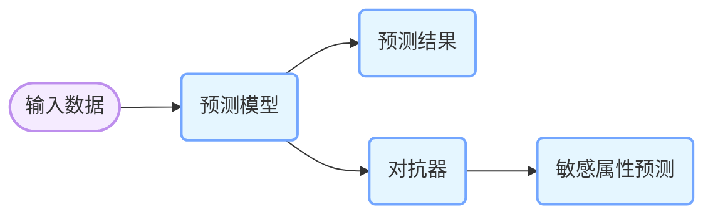

# 模型训练中的对抗训练在提高AI系统公平性方面的创新应用

> 关键词：模型训练、对抗训练、AI系统公平性、创新应用、公平性度量、偏差消除

> 摘要：随着人工智能技术的广泛应用，AI系统的公平性问题日益受到关注。模型训练中的对抗训练作为一种独特的技术手段，为提高AI系统公平性提供了新的思路和方法。本文深入探讨了对抗训练的核心概念、算法原理，详细阐述了其在数学模型上的表达和计算方式。通过项目实战展示了对抗训练在实际代码中的实现过程和效果分析，介绍了其在不同场景下的应用案例。同时，推荐了相关的学习资源、开发工具和研究论文，最后对对抗训练在提高AI系统公平性方面的未来发展趋势与挑战进行了总结和展望。

## 1. 背景介绍 
### 1.1 目的和范围
AI系统在诸多领域如金融、医疗、司法等发挥着关键作用，然而其公平性问题逐渐凸显。例如，在招聘筛选系统中可能因性别、种族等因素产生偏差，导致不公平的结果。本文章的目的在于深入研究模型训练中的对抗训练技术如何有效提高AI系统的公平性，探讨其原理、实现方法以及应用场景。范围涵盖对抗训练的基本概念、核心算法、数学模型，通过实际项目案例展示其在不同领域的应用，并对相关的工具、资源和研究成果进行梳理。

### 1.2 预期读者
本文预期读者包括人工智能领域的研究人员、开发者、数据科学家，以及对AI系统公平性问题感兴趣的学者和从业者。对于想要深入了解对抗训练技术及其在提高AI系统公平性方面应用的人员具有参考价值。

### 1.3 文档结构概述
本文首先介绍背景信息，包括目的、预期读者和文档结构。接着阐述对抗训练的核心概念及其与AI系统公平性的联系，详细讲解核心算法原理和具体操作步骤，通过数学模型和公式进行理论支撑。然后通过项目实战展示对抗训练的实际应用和代码实现，介绍其在不同场景下的应用案例。随后推荐相关的学习资源、开发工具和研究论文。最后总结对抗训练在提高AI系统公平性方面的未来发展趋势与挑战，并提供常见问题解答和扩展阅读参考资料。

### 1.4 术语表
#### 1.4.1 核心术语定义
- **对抗训练（Adversarial Training）**：在模型训练过程中引入对抗机制，通过两个或多个模型相互博弈来提高模型性能的训练方法。
- **AI系统公平性（AI System Fairness）**：指AI系统在决策过程中不受到无关因素（如性别、种族、年龄等）的影响，对不同群体能够做出公平、无偏的决策。
- **偏差（Bias）**：指AI系统在决策过程中对某些群体存在不公平的倾向或偏好。
- **公平性度量（Fairness Metrics）**：用于衡量AI系统公平性的量化指标，如平均绝对差、差异影响指数等。

#### 1.4.2 相关概念解释
- **生成对抗网络（GAN）**：一种特殊的对抗训练模型，由生成器和判别器组成，通过两者的对抗训练来生成逼真的数据。
- **对抗样本（Adversarial Examples）**：通过对原始输入数据进行微小扰动而生成的样本，用于测试模型的鲁棒性。

#### 1.4.3 缩略词列表
- **GAN**：Generative Adversarial Network（生成对抗网络）
- **ML**：Machine Learning（机器学习）
- **DL**：Deep Learning（深度学习）

## 2. 核心概念与联系 
### 2.1 对抗训练的原理
对抗训练的基本思想是通过两个或多个模型之间的对抗来提高模型的性能。在典型的生成对抗网络（GAN）中，有一个生成器（Generator）和一个判别器（Discriminator）。生成器的目标是生成与真实数据相似的样本，而判别器的目标是区分生成的样本和真实样本。两者通过不断的博弈来提高各自的性能。

生成器接收随机噪声作为输入，尝试生成与真实数据分布相似的样本。判别器接收生成的样本和真实样本，输出一个概率值，表示输入样本是真实样本的概率。在训练过程中，生成器和判别器的参数不断更新，生成器试图欺骗判别器，而判别器试图正确区分生成的样本和真实样本。

### 2.2 对抗训练与AI系统公平性的联系
在AI系统中，偏差可能会导致不公平的决策。对抗训练可以通过引入一个对抗网络来检测和消除模型中的偏差。具体来说，我们可以在原有的预测模型（如分类器）的基础上，添加一个对抗器（Adversary）。对抗器的目标是根据预测模型的输出和输入特征来预测敏感属性（如性别、种族等），而预测模型的目标是在完成自身任务的同时，尽量让对抗器无法准确预测敏感属性。

通过这种对抗训练的方式，预测模型可以学会在做出决策时不依赖于敏感属性，从而提高AI系统的公平性。例如，在一个招聘筛选系统中，预测模型的任务是根据求职者的简历信息预测其是否适合该岗位，对抗器的任务是根据预测结果和简历信息预测求职者的性别。通过对抗训练，预测模型可以学会只关注与岗位相关的信息，而不受到性别因素的影响。

### 2.3 核心概念的文本示意图
```plaintext
输入数据 -> 预测模型 -> 预测结果
               |
               v
            对抗器 -> 敏感属性预测
```

### 2.4 Mermaid流程图


## 3. 核心算法原理 & 具体操作步骤 
### 3.1 核心算法原理
对抗训练在提高AI系统公平性方面的核心算法基于生成对抗网络的思想。我们有一个预测模型 $f$ 和一个对抗器 $a$。预测模型的目标是最小化任务损失 $L_{task}$，同时最大化对抗器的损失 $L_{adv}$，以防止对抗器根据预测结果和输入特征准确预测敏感属性。对抗器的目标是最小化自身的损失 $L_{adv}$。

预测模型的目标函数可以表示为：
$$\min_{\theta_f} L_{task}(f(x), y) - \lambda L_{adv}(a(f(x), x), s)$$
其中，$\theta_f$ 是预测模型的参数，$x$ 是输入数据，$y$ 是真实标签，$s$ 是敏感属性，$\lambda$ 是一个超参数，用于平衡任务损失和对抗损失。

对抗器的目标函数可以表示为：
$$\min_{\theta_a} L_{adv}(a(f(x), x), s)$$
其中，$\theta_a$ 是对抗器的参数。

### 3.2 具体操作步骤
#### 步骤1：初始化模型参数
初始化预测模型 $f$ 和对抗器 $a$ 的参数 $\theta_f$ 和 $\theta_a$。

#### 步骤2：前向传播
- 输入数据 $x$ 经过预测模型 $f$ 得到预测结果 $f(x)$。
- 预测结果 $f(x)$ 和输入数据 $x$ 作为对抗器 $a$ 的输入，得到敏感属性预测 $a(f(x), x)$。

#### 步骤3：计算损失
- 计算预测模型的任务损失 $L_{task}(f(x), y)$。
- 计算对抗器的损失 $L_{adv}(a(f(x), x), s)$。

#### 步骤4：更新参数
- 根据预测模型的目标函数，使用梯度下降法更新预测模型的参数 $\theta_f$。
- 根据对抗器的目标函数，使用梯度下降法更新对抗器的参数 $\theta_a$。

#### 步骤5：重复步骤2 - 4
重复步骤2 - 4，直到模型收敛。

### 3.3 Python源代码实现
```python
import torch
import torch.nn as nn
import torch.optim as optim

# 定义预测模型
class Predictor(nn.Module):
    def __init__(self, input_size, output_size):
        super(Predictor, self).__init__()
        self.fc = nn.Linear(input_size, output_size)

    def forward(self, x):
        return self.fc(x)

# 定义对抗器
class Adversary(nn.Module):
    def __init__(self, input_size, output_size):
        super(Adversary, self).__init__()
        self.fc = nn.Linear(input_size, output_size)

    def forward(self, x):
        return self.fc(x)

# 超参数设置
input_size = 10
output_size = 2
sensitive_size = 2
lambda_adv = 0.1
learning_rate = 0.001
num_epochs = 100

# 初始化模型
predictor = Predictor(input_size, output_size)
adversary = Adversary(output_size + input_size, sensitive_size)

# 定义损失函数和优化器
criterion_task = nn.CrossEntropyLoss()
criterion_adv = nn.CrossEntropyLoss()
optimizer_predictor = optim.Adam(predictor.parameters(), lr=learning_rate)
optimizer_adversary = optim.Adam(adversary.parameters(), lr=learning_rate)

# 模拟数据
x = torch.randn(100, input_size)
y = torch.randint(0, output_size, (100,))
s = torch.randint(0, sensitive_size, (100,))

# 训练过程
for epoch in range(num_epochs):
    # 前向传播
    outputs_predictor = predictor(x)
    inputs_adversary = torch.cat((outputs_predictor, x), dim=1)
    outputs_adversary = adversary(inputs_adversary)

    # 计算损失
    loss_task = criterion_task(outputs_predictor, y)
    loss_adv = criterion_adv(outputs_adversary, s)

    # 更新预测模型参数
    optimizer_predictor.zero_grad()
    loss_predictor = loss_task - lambda_adv * loss_adv
    loss_predictor.backward(retain_graph=True)
    optimizer_predictor.step()

    # 更新对抗器参数
    optimizer_adversary.zero_grad()
    loss_adv.backward()
    optimizer_adversary.step()

    if (epoch + 1) % 10 == 0:
        print(f'Epoch [{epoch + 1}/{num_epochs}], Loss Task: {loss_task.item():.4f}, Loss Adv: {loss_adv.item():.4f}')
```

## 4. 数学模型和公式 & 详细讲解 & 举例说明 
### 4.1 数学模型和公式
#### 4.1.1 任务损失
任务损失 $L_{task}$ 用于衡量预测模型的预测结果与真实标签之间的差异。对于分类任务，常用的损失函数是交叉熵损失函数：
$$L_{task}(f(x), y) = -\sum_{i=1}^{N} \sum_{j=1}^{C} y_{ij} \log(f(x)_j)$$
其中，$N$ 是样本数量，$C$ 是类别数量，$y_{ij}$ 是第 $i$ 个样本的真实标签的第 $j$ 个分量，$f(x)_j$ 是预测模型对第 $i$ 个样本的第 $j$ 个类别的预测概率。

#### 4.1.2 对抗损失
对抗损失 $L_{adv}$ 用于衡量对抗器的预测结果与真实敏感属性之间的差异。同样，对于分类任务，常用的损失函数是交叉熵损失函数：
$$L_{adv}(a(f(x), x), s) = -\sum_{i=1}^{N} \sum_{k=1}^{S} s_{ik} \log(a(f(x), x)_k)$$
其中，$S$ 是敏感属性的类别数量，$s_{ik}$ 是第 $i$ 个样本的真实敏感属性的第 $k$ 个分量，$a(f(x), x)_k$ 是对抗器对第 $i$ 个样本的第 $k$ 个敏感属性类别的预测概率。

#### 4.1.3 预测模型的目标函数
预测模型的目标函数是最小化任务损失并最大化对抗损失：
$$\min_{\theta_f} L_{task}(f(x), y) - \lambda L_{adv}(a(f(x), x), s)$$
其中，$\lambda$ 是一个超参数，用于平衡任务损失和对抗损失。$\lambda$ 越大，预测模型越注重消除偏差，提高公平性，但可能会牺牲一定的任务性能。

#### 4.1.4 对抗器的目标函数
对抗器的目标函数是最小化对抗损失：
$$\min_{\theta_a} L_{adv}(a(f(x), x), s)$$

### 4.2 详细讲解
- **任务损失**：任务损失的作用是让预测模型尽可能准确地完成自身的任务，如分类、回归等。通过最小化任务损失，预测模型可以学习到输入数据和真实标签之间的关系。
- **对抗损失**：对抗损失的作用是让对抗器尽可能准确地预测敏感属性。预测模型的目标是让对抗器无法准确预测敏感属性，从而消除模型中的偏差。
- **超参数 $\lambda$**：超参数 $\lambda$ 控制着任务损失和对抗损失的相对重要性。如果 $\lambda$ 太小，预测模型可能会忽略公平性问题，仍然存在偏差；如果 $\lambda$ 太大，预测模型可能会过度关注公平性，导致任务性能下降。

### 4.3 举例说明
假设我们有一个简单的二分类任务，输入数据 $x$ 是一个10维向量，真实标签 $y$ 是0或1，敏感属性 $s$ 是性别（0表示男性，1表示女性）。预测模型的输出是一个2维向量，表示样本属于两个类别的概率。对抗器的输入是预测模型的输出和输入数据的拼接，输出是一个2维向量，表示样本的性别概率。

在训练过程中，预测模型会尝试最小化任务损失，同时最大化对抗损失，以防止对抗器根据预测结果和输入特征准确预测性别。对抗器会尝试最小化对抗损失，以准确预测性别。通过不断的对抗训练，预测模型可以学会在做出决策时不依赖于性别因素，从而提高公平性。

## 5. 项目实战：代码实际案例和详细解释说明 
### 5.1  开发环境搭建
#### 5.1.1 安装Python
首先，确保你已经安装了Python 3.x版本。可以从Python官方网站（https://www.python.org/downloads/） 下载并安装。

#### 5.1.2 安装深度学习框架
本项目使用PyTorch作为深度学习框架。可以使用以下命令安装PyTorch：
```bash
pip install torch torchvision
```

#### 5.1.3 安装其他依赖库
还需要安装一些其他的依赖库，如`numpy`、`matplotlib`等。可以使用以下命令安装：
```bash
pip install numpy matplotlib
```

### 5.2  源代码详细实现和代码解读
```python
import torch
import torch.nn as nn
import torch.optim as optim
import numpy as np
import matplotlib.pyplot as plt

# 定义预测模型
class Predictor(nn.Module):
    def __init__(self, input_size, output_size):
        super(Predictor, self).__init__()
        self.fc1 = nn.Linear(input_size, 20)
        self.relu = nn.ReLU()
        self.fc2 = nn.Linear(20, output_size)

    def forward(self, x):
        out = self.fc1(x)
        out = self.relu(out)
        out = self.fc2(out)
        return out

# 定义对抗器
class Adversary(nn.Module):
    def __init__(self, input_size, output_size):
        super(Adversary, self).__init__()
        self.fc1 = nn.Linear(input_size, 10)
        self.relu = nn.ReLU()
        self.fc2 = nn.Linear(10, output_size)

    def forward(self, x):
        out = self.fc1(x)
        out = self.relu(out)
        out = self.fc2(out)
        return out

# 超参数设置
input_size = 10
output_size = 2
sensitive_size = 2
lambda_adv = 0.1
learning_rate = 0.001
num_epochs = 200

# 初始化模型
predictor = Predictor(input_size, output_size)
adversary = Adversary(output_size + input_size, sensitive_size)

# 定义损失函数和优化器
criterion_task = nn.CrossEntropyLoss()
criterion_adv = nn.CrossEntropyLoss()
optimizer_predictor = optim.Adam(predictor.parameters(), lr=learning_rate)
optimizer_adversary = optim.Adam(adversary.parameters(), lr=learning_rate)

# 模拟数据
x = torch.randn(100, input_size)
y = torch.randint(0, output_size, (100,))
s = torch.randint(0, sensitive_size, (100,))

# 训练过程
loss_task_history = []
loss_adv_history = []

for epoch in range(num_epochs):
    # 前向传播
    outputs_predictor = predictor(x)
    inputs_adversary = torch.cat((outputs_predictor, x), dim=1)
    outputs_adversary = adversary(inputs_adversary)

    # 计算损失
    loss_task = criterion_task(outputs_predictor, y)
    loss_adv = criterion_adv(outputs_adversary, s)

    # 更新预测模型参数
    optimizer_predictor.zero_grad()
    loss_predictor = loss_task - lambda_adv * loss_adv
    loss_predictor.backward(retain_graph=True)
    optimizer_predictor.step()

    # 更新对抗器参数
    optimizer_adversary.zero_grad()
    loss_adv.backward()
    optimizer_adversary.step()

    loss_task_history.append(loss_task.item())
    loss_adv_history.append(loss_adv.item())

    if (epoch + 1) % 10 == 0:
        print(f'Epoch [{epoch + 1}/{num_epochs}], Loss Task: {loss_task.item():.4f}, Loss Adv: {loss_adv.item():.4f}')

# 绘制损失曲线
plt.plot(loss_task_history, label='Task Loss')
plt.plot(loss_adv_history, label='Adversary Loss')
plt.xlabel('Epoch')
plt.ylabel('Loss')
plt.legend()
plt.show()
```

### 5.3  代码解读与分析
#### 5.3.1 模型定义
- **预测模型（Predictor）**：定义了一个简单的两层全连接神经网络，包含一个隐藏层和一个输出层。输入层的大小为`input_size`，输出层的大小为`output_size`。
- **对抗器（Adversary）**：同样定义了一个简单的两层全连接神经网络，输入层的大小为`output_size + input_size`，输出层的大小为`sensitive_size`。

#### 5.3.2 损失函数和优化器
- **损失函数**：使用交叉熵损失函数`nn.CrossEntropyLoss()`来计算任务损失和对抗损失。
- **优化器**：使用Adam优化器`optim.Adam()`来更新预测模型和对抗器的参数。

#### 5.3.3 训练过程
- **前向传播**：输入数据经过预测模型得到预测结果，预测结果和输入数据拼接后作为对抗器的输入，得到敏感属性预测。
- **损失计算**：计算任务损失和对抗损失。
- **参数更新**：根据预测模型和对抗器的目标函数，使用梯度下降法更新模型参数。

#### 5.3.4 损失曲线绘制
使用`matplotlib`库绘制任务损失和对抗损失的曲线，以便观察训练过程中损失的变化情况。

## 6. 实际应用场景 
### 6.1 招聘筛选系统
在招聘筛选系统中，对抗训练可以帮助消除性别、种族等敏感因素的影响，提高招聘的公平性。预测模型根据求职者的简历信息预测其是否适合该岗位，对抗器根据预测结果和简历信息预测求职者的敏感属性。通过对抗训练，预测模型可以学会只关注与岗位相关的信息，而不受到敏感因素的影响。

### 6.2 金融信贷审批系统
在金融信贷审批系统中，对抗训练可以防止模型因客户的种族、性别、年龄等因素产生偏差。预测模型根据客户的信用信息、收入等因素预测是否给予贷款，对抗器根据预测结果和客户信息预测敏感属性。通过对抗训练，预测模型可以做出更加公平的信贷决策。

### 6.3 司法量刑预测系统
在司法量刑预测系统中，对抗训练可以确保模型不受到被告人的种族、性别等因素的影响，提高量刑的公平性。预测模型根据案件的相关信息预测量刑结果，对抗器根据预测结果和案件信息预测被告人的敏感属性。通过对抗训练，预测模型可以更加客观地做出量刑预测。

## 7. 工具和资源推荐
### 7.1 学习资源推荐
#### 7.1.1 书籍推荐
- 《深度学习》（Deep Learning）：由Ian Goodfellow、Yoshua Bengio和Aaron Courville所著，是深度学习领域的经典教材，涵盖了深度学习的基本原理、算法和应用。
- 《Python深度学习》（Deep Learning with Python）：由Francois Chollet所著，以Python和Keras为工具，介绍了深度学习的实践方法和应用案例。

#### 7.1.2 在线课程
- Coursera上的“深度学习专项课程”（Deep Learning Specialization）：由Andrew Ng教授授课，系统地介绍了深度学习的基础知识和应用。
- edX上的“人工智能基础”（Fundamentals of Artificial Intelligence）：涵盖了人工智能的基本概念、算法和应用，对对抗训练和AI系统公平性有一定的介绍。

#### 7.1.3 技术博客和网站
- Medium：有很多关于人工智能和深度学习的技术博客，其中不乏关于对抗训练和AI系统公平性的文章。
- arXiv：是一个预印本服务器，提供了大量的人工智能研究论文，包括对抗训练和AI系统公平性的最新研究成果。

### 7.2 开发工具框架推荐
#### 7.2.1 IDE和编辑器
- PyCharm：是一款专业的Python集成开发环境，提供了丰富的代码编辑、调试和分析功能。
- Jupyter Notebook：是一个交互式的开发环境，适合进行数据探索、模型训练和可视化。

#### 7.2.2 调试和性能分析工具
- TensorBoard：是TensorFlow的可视化工具，可以用于可视化训练过程中的损失曲线、准确率等指标。
- PyTorch Profiler：是PyTorch的性能分析工具，可以帮助分析模型的性能瓶颈，优化模型的训练和推理速度。

#### 7.2.3 相关框架和库
- PyTorch：是一个开源的深度学习框架，提供了丰富的神经网络层和优化算法，方便进行对抗训练的实现。
- Fairlearn：是一个开源的Python库，提供了一系列的公平性度量和算法，用于评估和提高AI系统的公平性。

### 7.3 相关论文著作推荐
#### 7.3.1 经典论文
- “Generative Adversarial Nets”：由Ian Goodfellow等人发表，首次提出了生成对抗网络（GAN）的概念。
- “Mitigating Unwanted Biases with Adversarial Learning”：介绍了使用对抗训练来消除模型中不必要偏差的方法。

#### 7.3.2 最新研究成果
- 关注arXiv上关于对抗训练和AI系统公平性的最新研究论文，了解该领域的最新发展动态。

#### 7.3.3 应用案例分析
- 一些顶级学术会议（如NeurIPS、ICML等）上的论文会介绍对抗训练在不同领域的应用案例，可以从中学习到实际应用中的经验和技巧。

## 8. 总结：未来发展趋势与挑战
### 8.1 未来发展趋势
- **多模态对抗训练**：随着多模态数据（如图像、文本、音频等）的广泛应用，未来可能会出现多模态对抗训练的方法，以提高AI系统在多模态数据上的公平性。
- **自适应对抗训练**：开发自适应的对抗训练算法，能够根据不同的数据集和任务自动调整对抗训练的参数，提高训练效率和公平性。
- **与其他技术的融合**：将对抗训练与强化学习、迁移学习等技术相结合，进一步提高AI系统的性能和公平性。

### 8.2 挑战
- **计算资源需求**：对抗训练通常需要大量的计算资源，特别是在处理大规模数据集和复杂模型时。如何降低计算成本，提高训练效率是一个挑战。
- **公平性度量的准确性**：目前的公平性度量指标还存在一定的局限性，如何设计更加准确、全面的公平性度量指标是一个亟待解决的问题。
- **对抗训练的稳定性**：对抗训练过程中可能会出现不稳定的情况，如梯度消失、梯度爆炸等。如何提高对抗训练的稳定性，确保模型的收敛性是一个挑战。

## 9. 附录：常见问题与解答
### 9.1 对抗训练一定会提高AI系统的公平性吗？
不一定。对抗训练的效果取决于多个因素，如超参数的选择、模型的结构、数据集的质量等。如果超参数选择不当，可能会导致模型过度关注公平性而牺牲任务性能，或者无法有效消除偏差。

### 9.2 如何选择合适的超参数 $\lambda$？
超参数 $\lambda$ 的选择需要根据具体的任务和数据集进行调整。可以通过交叉验证的方法，在不同的 $\lambda$ 值下训练模型，选择在任务性能和公平性之间取得较好平衡的 $\lambda$ 值。

### 9.3 对抗训练对模型的性能有什么影响？
对抗训练可能会对模型的性能产生一定的影响。一方面，通过消除偏差，模型可以在不同群体上表现更加公平，提高整体的性能；另一方面，对抗训练可能会增加模型的训练难度，导致训练时间变长，任务性能可能会有一定的下降。需要在公平性和任务性能之间进行权衡。

## 10. 扩展阅读 & 参考资料
- Goodfellow, I. J., Bengio, Y., & Courville, A. (2016). Deep Learning. MIT Press.
- Chollet, F. (2018). Deep Learning with Python. Manning Publications.
- Goodfellow, I. J., et al. (2014). Generative Adversarial Nets. Advances in Neural Information Processing Systems.
- Zhang, B., et al. (2018). Mitigating Unwanted Biases with Adversarial Learning. Proceedings of the 2018 AAAI/ACM Conference on AI, Ethics, and Society.
- https://pytorch.org/
- https://fairlearn.org/