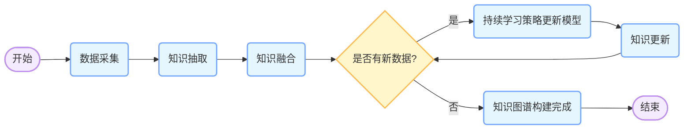

# 模型训练中的持续学习策略在动态知识图谱构建中的应用

> 关键词：模型训练、持续学习策略、动态知识图谱、知识更新、机器学习

> 摘要：本文聚焦于模型训练中的持续学习策略在动态知识图谱构建中的应用。首先介绍了相关背景，包括目的、预期读者等内容。接着阐述了核心概念，明确了持续学习策略和动态知识图谱的原理及联系。详细讲解了核心算法原理，并给出 Python 源代码示例。通过数学模型和公式进一步剖析其内在机制。以项目实战展示了具体的代码实现和解读。探讨了实际应用场景，推荐了相关工具和资源。最后总结未来发展趋势与挑战，还给出了常见问题解答及参考资料。旨在全面深入地探讨持续学习策略在动态知识图谱构建中的关键作用和应用方法。

## 1. 背景介绍 
### 1.1 目的和范围
在当今信息爆炸的时代，知识处于不断的更新和变化之中。传统的知识图谱构建往往是静态的，难以适应知识的动态演化。本研究的目的在于探索如何利用模型训练中的持续学习策略来构建动态知识图谱，以实现对知识的实时更新和准确表示。研究范围涵盖了持续学习策略的多种算法、动态知识图谱的构建流程以及两者结合的具体应用场景。

### 1.2 预期读者
本文预期读者包括从事人工智能、机器学习、自然语言处理等领域的研究人员和开发者，以及对知识图谱技术感兴趣的学者和从业者。希望通过本文的介绍，能够为他们在相关领域的研究和实践提供有价值的参考。

### 1.3 文档结构概述
本文首先介绍相关背景知识，让读者对研究的目的和范围有清晰的认识。接着阐述核心概念，包括持续学习策略和动态知识图谱的原理及联系。然后详细讲解核心算法原理，并给出 Python 源代码示例。通过数学模型和公式进一步剖析其内在机制。以项目实战展示具体的代码实现和解读。探讨实际应用场景，推荐相关工具和资源。最后总结未来发展趋势与挑战，给出常见问题解答及参考资料。

### 1.4 术语表
#### 1.4.1 核心术语定义
- **持续学习策略**：指模型在不断接收新数据的过程中，能够持续学习并更新自身知识，同时避免遗忘之前所学知识的学习策略。
- **动态知识图谱**：是一种能够实时反映知识变化的知识图谱，它可以随着时间的推移不断更新和扩展。
- **知识图谱**：是一种用图模型来描述知识和建模世界万物之间关联关系的技术方法。

#### 1.4.2 相关概念解释
- **增量学习**：是持续学习的一种常见方式，模型在新数据到来时，通过增量更新的方式学习新知识。
- **灾难性遗忘**：指模型在学习新任务时，忘记了之前学习的旧任务的现象，这是持续学习中需要解决的关键问题。

#### 1.4.3 缩略词列表
- **ML**：Machine Learning，机器学习
- **DL**：Deep Learning，深度学习
- **KG**：Knowledge Graph，知识图谱

## 2. 核心概念与联系 
### 2.1 持续学习策略原理
持续学习策略旨在解决模型在面对不断变化的数据时的学习问题。传统的机器学习模型通常是在固定的数据集上进行训练，一旦训练完成，模型的参数就固定下来，难以适应新的数据。而持续学习策略允许模型在不断接收新数据的过程中持续更新，以适应数据的动态变化。

其核心思想是在学习新任务的同时，保留对旧任务的记忆。为了实现这一目标，研究者们提出了多种方法，如基于正则化的方法、基于回放的方法和基于架构的方法等。

基于正则化的方法通过在损失函数中添加正则项，限制模型参数的变化，从而防止模型遗忘旧任务。例如，弹性权重巩固（Elastic Weight Consolidation，EWC）方法通过计算每个参数对旧任务的重要性，在学习新任务时对重要参数进行保护。

基于回放的方法通过在学习新任务时回放旧数据，让模型重新学习旧任务，从而巩固旧任务的记忆。例如，经验回放（Experience Replay）方法在训练过程中随机采样旧数据和新数据进行联合训练。

基于架构的方法通过设计特殊的模型架构，将不同任务的知识分离存储，避免任务之间的干扰。例如，渐进神经网络（Progressive Neural Networks）方法通过为每个新任务添加新的网络层，同时保留旧任务的网络层，实现知识的隔离和复用。

### 2.2 动态知识图谱原理
动态知识图谱是对传统知识图谱的扩展，它能够实时反映知识的变化。传统知识图谱通常是基于静态数据构建的，一旦构建完成，其内容就相对固定，难以适应知识的动态更新。而动态知识图谱通过引入时间维度，记录知识的变化历史，实现对知识的动态管理。

动态知识图谱的构建过程包括数据采集、知识抽取、知识融合和知识更新等环节。在数据采集阶段，需要从各种数据源中收集与知识相关的信息。知识抽取环节从采集到的数据中提取实体、关系和属性等知识元素。知识融合将不同来源的知识进行整合，消除冲突和冗余。知识更新则根据新的数据和信息，对知识图谱进行实时更新。

### 2.3 持续学习策略与动态知识图谱的联系
持续学习策略为动态知识图谱的构建提供了有效的技术手段。在动态知识图谱的构建过程中，知识是不断更新和变化的，需要模型能够实时学习新的知识，同时保留对旧知识的记忆。持续学习策略正好满足了这一需求，通过持续学习，模型可以不断适应知识的变化，保证知识图谱的准确性和完整性。

另一方面，动态知识图谱为持续学习策略提供了丰富的应用场景。动态知识图谱中的知识更新可以作为持续学习的新任务，让模型在不断更新知识图谱的过程中进行持续学习，提高模型的学习能力和适应性。

### 2.4 文本示意图
持续学习策略和动态知识图谱的关系可以用以下文本描述：持续学习策略作为一种技术手段，贯穿于动态知识图谱构建的各个环节。在知识更新阶段，持续学习策略帮助模型学习新的知识，同时保留旧知识的记忆，确保知识图谱的动态性和准确性。动态知识图谱则为持续学习策略提供了应用场景和数据支持，两者相互促进，共同发展。

### 2.5 Mermaid 流程图


## 3. 核心算法原理 & 具体操作步骤 
### 3.1 基于弹性权重巩固（EWC）的持续学习算法原理
弹性权重巩固（EWC）是一种基于正则化的持续学习算法，其核心思想是通过计算每个参数对旧任务的重要性，在学习新任务时对重要参数进行保护，从而防止模型遗忘旧任务。

#### 3.1.1 算法原理
设模型的参数为 $\theta$，旧任务的损失函数为 $L_{old}(\theta)$，新任务的损失函数为 $L_{new}(\theta)$。EWC 算法通过在新任务的损失函数中添加一个正则项，来限制模型参数的变化，使得模型在学习新任务时尽量保持对旧任务的记忆。

正则项的形式为：
$$
\mathcal{F}(\theta) = \sum_{i} \frac{\lambda}{2} F_{i} (\theta_{i} - \theta_{i}^{*})^2
$$
其中，$F_{i}$ 是参数 $\theta_{i}$ 的 Fisher 信息矩阵的对角元素，$\theta_{i}^{*}$ 是旧任务训练完成后的参数值，$\lambda$ 是正则化系数。

新任务的总损失函数为：
$$
L(\theta) = L_{new}(\theta) + \mathcal{F}(\theta)
$$

#### 3.1.2 具体操作步骤
1. **训练旧任务**：使用传统的机器学习方法训练旧任务，得到旧任务训练完成后的参数 $\theta^{*}$。
2. **计算 Fisher 信息矩阵**：在旧任务的训练数据上，计算每个参数的 Fisher 信息矩阵的对角元素 $F_{i}$。
3. **训练新任务**：在新任务的训练数据上，使用总损失函数 $L(\theta)$ 进行训练，通过优化总损失函数来更新模型参数 $\theta$。

### 3.2 Python 源代码实现
```python
import torch
import torch.nn as nn
import torch.optim as optim

# 定义一个简单的神经网络模型
class SimpleNet(nn.Module):
    def __init__(self, input_size, hidden_size, output_size):
        super(SimpleNet, self).__init__()
        self.fc1 = nn.Linear(input_size, hidden_size)
        self.relu = nn.ReLU()
        self.fc2 = nn.Linear(hidden_size, output_size)

    def forward(self, x):
        out = self.fc1(x)
        out = self.relu(out)
        out = self.fc2(out)
        return out

# 计算 Fisher 信息矩阵的对角元素
def compute_fisher(model, dataloader, criterion):
    fisher = {}
    for n, p in model.named_parameters():
        fisher[n] = torch.zeros_like(p.data)

    model.eval()
    for inputs, labels in dataloader:
        model.zero_grad()
        outputs = model(inputs)
        loss = criterion(outputs, labels)
        loss.backward()

        for n, p in model.named_parameters():
            if p.grad is not None:
                fisher[n] += p.grad.data ** 2

    for n, p in fisher.items():
        fisher[n] /= len(dataloader)

    return fisher

# 弹性权重巩固（EWC）训练
def ewc_train(model, dataloader_new, dataloader_old, criterion, optimizer, lambda_ewc, num_epochs):
    # 训练旧任务，得到旧任务的参数
    theta_star = {}
    for n, p in model.named_parameters():
        theta_star[n] = p.data.clone()

    # 计算 Fisher 信息矩阵
    fisher = compute_fisher(model, dataloader_old, criterion)

    for epoch in range(num_epochs):
        model.train()
        running_loss = 0.0
        for inputs, labels in dataloader_new:
            optimizer.zero_grad()
            outputs = model(inputs)
            loss_new = criterion(outputs, labels)

            # 计算 EWC 正则项
            loss_ewc = 0.0
            for n, p in model.named_parameters():
                loss_ewc += (lambda_ewc / 2) * fisher[n] * (p - theta_star[n]) ** 2

            loss = loss_new + loss_ewc.sum()
            loss.backward()
            optimizer.step()

            running_loss += loss.item()

        print(f'Epoch {epoch + 1}/{num_epochs}, Loss: {running_loss / len(dataloader_new)}')

    return model
```

### 3.3 代码解释
- `SimpleNet` 类定义了一个简单的神经网络模型，包含一个输入层、一个隐藏层和一个输出层。
- `compute_fisher` 函数用于计算 Fisher 信息矩阵的对角元素，通过在旧任务的训练数据上计算每个参数的梯度平方的平均值得到。
- `ewc_train` 函数实现了 EWC 算法的训练过程，包括训练旧任务、计算 Fisher 信息矩阵和训练新任务。在训练新任务时，通过添加 EWC 正则项来限制模型参数的变化，防止模型遗忘旧任务。

## 4. 数学模型和公式 & 详细讲解 & 举例说明 
### 4.1 Fisher 信息矩阵的数学定义
Fisher 信息矩阵是一种用于衡量模型参数对数据的敏感性的矩阵。对于一个概率模型 $p(y|x,\theta)$，其中 $x$ 是输入数据，$y$ 是输出数据，$\theta$ 是模型参数，Fisher 信息矩阵 $F$ 的定义为：
$$
F_{ij} = \mathbb{E}_{p(y|x,\theta)} \left[ \frac{\partial \log p(y|x,\theta)}{\partial \theta_{i}} \frac{\partial \log p(y|x,\theta)}{\partial \theta_{j}} \right]
$$
其中，$\mathbb{E}_{p(y|x,\theta)}$ 表示对概率分布 $p(y|x,\theta)$ 求期望。

在实际应用中，通常使用 Fisher 信息矩阵的对角元素 $F_{ii}$ 来衡量每个参数对数据的敏感性。

### 4.2 EWC 算法的数学模型
EWC 算法的核心是在新任务的损失函数中添加一个正则项，来限制模型参数的变化。正则项的形式为：
$$
\mathcal{F}(\theta) = \sum_{i} \frac{\lambda}{2} F_{i} (\theta_{i} - \theta_{i}^{*})^2
$$
其中，$F_{i}$ 是参数 $\theta_{i}$ 的 Fisher 信息矩阵的对角元素，$\theta_{i}^{*}$ 是旧任务训练完成后的参数值，$\lambda$ 是正则化系数。

新任务的总损失函数为：
$$
L(\theta) = L_{new}(\theta) + \mathcal{F}(\theta)
$$
通过优化总损失函数 $L(\theta)$ 来更新模型参数 $\theta$，使得模型在学习新任务时尽量保持对旧任务的记忆。

### 4.3 举例说明
假设我们有一个简单的分类任务，输入数据是二维向量，输出是两类标签。我们使用一个简单的神经网络模型进行训练，模型包含一个输入层（2 个神经元）、一个隐藏层（10 个神经元）和一个输出层（2 个神经元）。

我们首先使用一组旧数据训练模型，得到旧任务训练完成后的参数 $\theta^{*}$。然后，我们计算每个参数的 Fisher 信息矩阵的对角元素 $F_{i}$。

接下来，我们有一组新数据，我们使用 EWC 算法在新数据上训练模型。在训练过程中，我们在新任务的损失函数中添加 EWC 正则项，通过优化总损失函数来更新模型参数。

通过这种方式，模型在学习新任务的同时，能够保留对旧任务的记忆，避免了灾难性遗忘的问题。

## 5. 项目实战：代码实际案例和详细解释说明 
### 5.1 开发环境搭建
#### 5.1.1 安装 Python
首先，确保你已经安装了 Python 3.x 版本。可以从 Python 官方网站（https://www.python.org/downloads/） 下载并安装适合你操作系统的 Python 版本。

#### 5.1.2 安装 PyTorch
PyTorch 是一个深度学习框架，我们将使用它来实现 EWC 算法。可以根据你的操作系统和 CUDA 版本，从 PyTorch 官方网站（https://pytorch.org/get-started/locally/） 选择合适的安装命令进行安装。例如，如果你使用的是 CPU 版本的 PyTorch，可以使用以下命令进行安装：
```sh
pip install torch torchvision
```

#### 5.1.3 安装其他依赖库
还需要安装一些其他的依赖库，如 `numpy`、`matplotlib` 等。可以使用以下命令进行安装：
```sh
pip install numpy matplotlib
```

### 5.2 源代码详细实现和代码解读
#### 5.2.1 数据准备
我们使用一个简单的合成数据集来演示 EWC 算法的应用。首先，生成旧任务和新任务的数据集。
```python
import numpy as np
import torch
from torch.utils.data import DataLoader, TensorDataset

# 生成旧任务数据集
np.random.seed(42)
x_old = np.random.randn(100, 2)
y_old = (x_old[:, 0] + x_old[:, 1] > 0).astype(int)

x_old = torch.tensor(x_old, dtype=torch.float32)
y_old = torch.tensor(y_old, dtype=torch.long)

dataset_old = TensorDataset(x_old, y_old)
dataloader_old = DataLoader(dataset_old, batch_size=10, shuffle=True)

# 生成新任务数据集
x_new = np.random.randn(100, 2)
y_new = (x_new[:, 0] - x_new[:, 1] > 0).astype(int)

x_new = torch.tensor(x_new, dtype=torch.float32)
y_new = torch.tensor(y_new, dtype=torch.long)

dataset_new = TensorDataset(x_new, y_new)
dataloader_new = DataLoader(dataset_new, batch_size=10, shuffle=True)
```
这段代码生成了旧任务和新任务的数据集，并使用 `DataLoader` 进行批量加载。

#### 5.2.2 模型定义
使用前面定义的 `SimpleNet` 类来定义模型。
```python
input_size = 2
hidden_size = 10
output_size = 2

model = SimpleNet(input_size, hidden_size, output_size)
```

#### 5.2.3 训练模型
使用 EWC 算法训练模型。
```python
criterion = nn.CrossEntropyLoss()
optimizer = optim.Adam(model.parameters(), lr=0.001)
lambda_ewc = 100
num_epochs = 10

model = ewc_train(model, dataloader_new, dataloader_old, criterion, optimizer, lambda_ewc, num_epochs)
```
这段代码定义了损失函数、优化器、正则化系数和训练轮数，并调用 `ewc_train` 函数进行训练。

### 5.3 代码解读与分析
#### 5.3.1 数据生成
通过 `np.random.randn` 函数生成随机的输入数据，根据不同的条件生成对应的标签，从而得到旧任务和新任务的数据集。

#### 5.3.2 模型定义
使用 `SimpleNet` 类定义一个简单的神经网络模型，包含一个输入层、一个隐藏层和一个输出层。

#### 5.3.3 训练过程
在 `ewc_train` 函数中，首先训练旧任务，得到旧任务的参数 $\theta^{*}$。然后计算 Fisher 信息矩阵的对角元素 $F_{i}$。在训练新任务时，通过添加 EWC 正则项来限制模型参数的变化，防止模型遗忘旧任务。

通过这种方式，模型能够在学习新任务的同时，保留对旧任务的记忆，提高了模型的持续学习能力。

## 6. 实际应用场景 
### 6.1 智能客服系统
在智能客服系统中，知识图谱可以用于存储和管理常见问题和答案。随着业务的发展和客户需求的变化，知识图谱需要不断更新和扩展。使用持续学习策略可以让模型实时学习新的问题和答案，同时保留对旧知识的记忆，提高智能客服系统的准确性和效率。

### 6.2 金融风险评估
在金融领域，知识图谱可以用于构建风险评估模型。金融市场的情况是不断变化的，新的风险因素和事件不断出现。通过持续学习策略，可以让模型实时学习新的风险信息，更新风险评估模型，提高金融风险评估的准确性和及时性。

### 6.3 医疗知识管理
在医疗领域，知识图谱可以用于存储和管理医学知识。医学知识是不断更新和发展的，新的疾病、治疗方法和药物不断涌现。使用持续学习策略可以让模型实时学习新的医学知识，更新医疗知识图谱，为医生提供更准确和全面的医学参考。

## 7. 工具和资源推荐
### 7.1 学习资源推荐
#### 7.1.1 书籍推荐
- 《深度学习》（Deep Learning）：由 Ian Goodfellow、Yoshua Bengio 和 Aaron Courville 合著，是深度学习领域的经典教材，涵盖了深度学习的基本原理、算法和应用。
- 《机器学习》（Machine Learning）：由 Tom M. Mitchell 著，是机器学习领域的经典教材，系统地介绍了机器学习的基本概念、算法和应用。
- 《知识图谱：方法、实践与应用》：由王昊奋、漆桂林、陈华钧等著，全面介绍了知识图谱的相关技术和应用，包括知识图谱的构建、表示、推理和应用等方面。

#### 7.1.2 在线课程
- Coursera 上的 “深度学习专项课程”（Deep Learning Specialization）：由 Andrew Ng 教授主讲，包括深度学习的基础知识、卷积神经网络、循环神经网络等内容。
- edX 上的 “人工智能基础”（Introduction to Artificial Intelligence）：由麻省理工学院（MIT）的 Patrick H. Winston 教授主讲，介绍了人工智能的基本概念、算法和应用。
- 中国大学 MOOC 上的 “知识图谱” 课程：由陈华钧教授主讲，系统地介绍了知识图谱的相关技术和应用。

#### 7.1.3 技术博客和网站
- Medium 上的 “Towards Data Science”：是一个专注于数据科学和机器学习的技术博客，有很多关于深度学习、知识图谱等领域的优秀文章。
- arXiv.org：是一个预印本服务器，提供了大量关于人工智能、机器学习等领域的最新研究论文。
- 开源中国（OSChina）：是一个开源技术社区，有很多关于人工智能、机器学习等领域的技术文章和开源项目。

### 7.2 开发工具框架推荐
#### 7.2.1 IDE和编辑器
- PyCharm：是一个专门为 Python 开发设计的集成开发环境（IDE），提供了丰富的代码编辑、调试和分析功能。
- Jupyter Notebook：是一个交互式的开发环境，适合进行数据探索、模型训练和结果可视化等工作。
- Visual Studio Code：是一个轻量级的代码编辑器，支持多种编程语言，有丰富的插件可以扩展其功能。

#### 7.2.2 调试和性能分析工具
- TensorBoard：是 TensorFlow 提供的一个可视化工具，可以用于查看模型的训练过程、损失函数曲线、模型结构等信息。
- PyTorch Profiler：是 PyTorch 提供的一个性能分析工具，可以用于分析模型的运行时间、内存使用等情况。
- cProfile：是 Python 内置的一个性能分析工具，可以用于分析 Python 代码的运行时间和函数调用情况。

#### 7.2.3 相关框架和库
- PyTorch：是一个开源的深度学习框架，提供了丰富的深度学习模型和工具，支持 GPU 加速。
- TensorFlow：是另一个开源的深度学习框架，被广泛应用于工业界和学术界，提供了丰富的深度学习模型和工具。
- NetworkX：是一个用于复杂网络分析的 Python 库，可以用于知识图谱的构建和分析。

### 7.3 相关论文著作推荐
#### 7.3.1 经典论文
- “Overcoming catastrophic forgetting in neural networks”：由 James Kirkpatrick 等人发表，提出了弹性权重巩固（EWC）算法，是持续学习领域的经典论文。
- “Knowledge Graph Embedding: A Survey of Approaches and Applications”：由 Quan Wang 等人发表，对知识图谱嵌入技术进行了全面的综述，介绍了知识图谱嵌入的基本概念、算法和应用。
- “Dynamic Knowledge Graph Completion: A Survey”：由 Lei Hou 等人发表，对动态知识图谱补全技术进行了全面的综述，介绍了动态知识图谱补全的基本概念、算法和应用。

#### 7.3.2 最新研究成果
- 关注 arXiv.org 上关于持续学习和动态知识图谱的最新研究论文，了解该领域的最新研究进展。
- 参加相关的学术会议，如 NeurIPS、ICML、AAAI 等，了解该领域的最新研究成果。

#### 7.3.3 应用案例分析
- 查看工业界和学术界的相关应用案例，了解持续学习策略和动态知识图谱在实际应用中的效果和经验。
- 分析开源项目中的代码和文档，学习如何将持续学习策略和动态知识图谱应用到实际项目中。

## 8. 总结：未来发展趋势与挑战
### 8.1 未来发展趋势
- **多模态融合**：未来的动态知识图谱将不仅仅局限于文本信息，还将融合图像、音频、视频等多模态信息，实现更加全面和准确的知识表示。
- **强化学习与持续学习的结合**：强化学习可以为持续学习提供更有效的学习策略，通过与环境的交互不断优化模型的性能，提高动态知识图谱的构建效率和质量。
- **联邦学习与动态知识图谱**：联邦学习可以在保护数据隐私的前提下，实现多个节点之间的知识共享和更新，为动态知识图谱的构建提供新的思路和方法。

### 8.2 挑战
- **灾难性遗忘问题**：虽然已经提出了多种持续学习算法来解决灾难性遗忘问题，但目前的算法仍然存在一定的局限性，需要进一步研究和改进。
- **计算资源和时间成本**：动态知识图谱的构建和更新需要大量的计算资源和时间，如何提高计算效率和降低时间成本是一个亟待解决的问题。
- **数据质量和一致性**：动态知识图谱的数据来源广泛，数据质量和一致性难以保证，需要建立有效的数据清洗和融合机制，确保知识图谱的准确性和可靠性。

## 9. 附录：常见问题与解答
### 9.1 什么是持续学习？
持续学习是指模型在不断接收新数据的过程中，能够持续学习并更新自身知识，同时避免遗忘之前所学知识的学习策略。

### 9.2 什么是动态知识图谱？
动态知识图谱是一种能够实时反映知识变化的知识图谱，它可以随着时间的推移不断更新和扩展。

### 9.3 持续学习策略有哪些？
常见的持续学习策略包括基于正则化的方法、基于回放的方法和基于架构的方法等。

### 9.4 如何解决持续学习中的灾难性遗忘问题？
可以使用基于正则化的方法（如 EWC 算法）、基于回放的方法（如经验回放）和基于架构的方法（如渐进神经网络）等技术来解决灾难性遗忘问题。

### 9.5 动态知识图谱的构建流程是什么？
动态知识图谱的构建流程包括数据采集、知识抽取、知识融合和知识更新等环节。

## 10. 扩展阅读 & 参考资料
- Goodfellow, I., Bengio, Y., & Courville, A. (2016). Deep Learning. MIT Press.
- Mitchell, T. M. (1997). Machine Learning. McGraw-Hill.
- 王昊奋, 漆桂林, 陈华钧等. (2020). 知识图谱：方法、实践与应用. 电子工业出版社.
- Kirkpatrick, J., Pascanu, R., Rabinowitz, N., et al. (2017). Overcoming catastrophic forgetting in neural networks. Proceedings of the National Academy of Sciences, 114(13), 3521-3526.
- Wang, Q., Mao, Z., Wang, B., & Guo, L. (2017). Knowledge Graph Embedding: A Survey of Approaches and Applications. IEEE Transactions on Knowledge and Data Engineering, 29(12), 2724-2743.
- Hou, L., Yao, Y., & Huang, L. (2020). Dynamic Knowledge Graph Completion: A Survey. arXiv preprint arXiv:2008.03156.