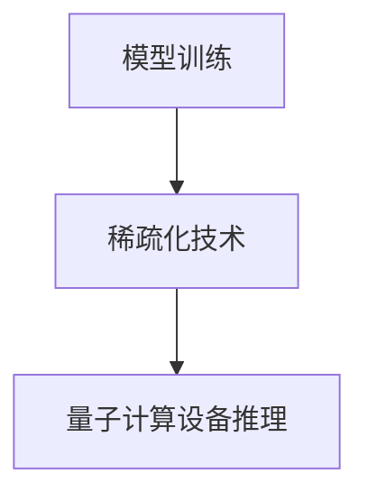

# 模型训练中的稀疏化技术在量子计算设备推理中的优化应用

> 关键词：模型训练、稀疏化技术、量子计算设备、推理优化、量子算法

> 摘要：本文深入探讨了模型训练中的稀疏化技术在量子计算设备推理中的优化应用。首先介绍了相关的背景知识，包括目的范围、预期读者等内容。接着详细阐述了核心概念与联系，包括稀疏化技术和量子计算的原理及架构。通过Python代码展示了核心算法原理与具体操作步骤，同时给出了相应的数学模型和公式并举例说明。在项目实战部分，通过具体的代码案例展示了如何在量子计算设备中应用稀疏化技术进行推理优化。分析了该技术的实际应用场景，推荐了相关的工具和资源。最后总结了未来发展趋势与挑战，解答了常见问题并提供了扩展阅读和参考资料，旨在为相关领域的研究者和开发者提供全面且深入的技术指导。

## 1. 背景介绍 
### 1.1 目的和范围
随着人工智能和量子计算技术的不断发展，模型训练和推理的效率问题日益受到关注。模型训练中的稀疏化技术旨在减少模型的参数数量，从而降低计算复杂度和存储需求。而量子计算设备具有独特的计算能力，能够在某些问题上实现指数级的加速。本文章的目的在于研究如何将稀疏化技术应用于量子计算设备的推理过程中，以进一步提高推理效率，降低资源消耗。范围涵盖了稀疏化技术的原理、量子计算设备的特点、以及两者结合的算法和应用案例等方面。

### 1.2 预期读者
本文预期读者包括从事人工智能、量子计算领域的研究者、开发者，以及对模型优化和量子计算应用感兴趣的技术爱好者。对于有一定编程和数学基础的读者，能够更好地理解文中的技术细节和原理。

### 1.3 文档结构概述
本文首先介绍相关背景知识，包括目的、预期读者和文档结构等。接着阐述核心概念与联系，包括稀疏化技术和量子计算的原理及架构。然后详细讲解核心算法原理和具体操作步骤，给出相应的数学模型和公式。通过项目实战部分展示代码实际案例和详细解释。分析实际应用场景，推荐相关的工具和资源。最后总结未来发展趋势与挑战，解答常见问题并提供扩展阅读和参考资料。

### 1.4 术语表
#### 1.4.1 核心术语定义
- **模型训练**：通过使用训练数据对模型的参数进行调整，使得模型能够学习到数据中的模式和规律，从而实现对未知数据的预测或分类等任务。
- **稀疏化技术**：在模型中，将大量对模型性能影响较小的参数设置为零，从而减少模型的非零参数数量，达到降低计算复杂度和存储需求的目的。
- **量子计算设备**：基于量子力学原理进行计算的设备，利用量子比特（qubit）的特性，如叠加和纠缠，实现比经典计算机更快的计算速度。
- **推理**：在模型训练完成后，使用训练好的模型对新的数据进行预测或分类的过程。

#### 1.4.2 相关概念解释
- **量子比特（qubit）**：量子计算中的基本信息单位，与经典比特不同，量子比特可以处于0和1的叠加态，这使得量子计算机能够同时处理多个计算任务。
- **叠加态**：量子比特可以同时处于0和1的状态的线性组合，即 $|\psi\rangle = \alpha|0\rangle + \beta|1\rangle$，其中 $\alpha$ 和 $\beta$ 是复数，且 $|\alpha|^2 + |\beta|^2 = 1$。
- **纠缠态**：多个量子比特之间存在一种特殊的关联，使得一个量子比特的状态会瞬间影响其他量子比特的状态，即使它们之间的距离很远。

#### 1.4.3 缩略词列表
- **GPU**：Graphics Processing Unit，图形处理器，常用于加速计算密集型任务。
- **CPU**：Central Processing Unit，中央处理器，计算机的核心计算部件。
- **QPU**：Quantum Processing Unit，量子处理器，量子计算设备的核心部件。

## 2. 核心概念与联系 

### 2.1 稀疏化技术原理
稀疏化技术的核心思想是通过对模型的参数进行筛选和压缩，将那些对模型性能影响较小的参数设置为零。这样可以减少模型的非零参数数量，从而降低计算复杂度和存储需求。常见的稀疏化方法包括基于阈值的稀疏化、正则化方法等。

基于阈值的稀疏化是一种简单直观的方法，其基本步骤如下：
1. 计算模型中每个参数的绝对值。
2. 设定一个阈值，将绝对值小于该阈值的参数设置为零。

正则化方法则是在模型训练的目标函数中加入正则化项，如 $L_1$ 正则化，使得模型的参数更倾向于稀疏。$L_1$ 正则化的目标函数可以表示为：
$$J(\theta) = \frac{1}{2m}\sum_{i=1}^{m}(h_{\theta}(x^{(i)}) - y^{(i)})^2 + \lambda\sum_{j=1}^{n}|\theta_j|$$
其中 $J(\theta)$ 是目标函数，$m$ 是训练样本数量，$h_{\theta}(x^{(i)})$ 是模型的预测值，$y^{(i)}$ 是真实值，$\lambda$ 是正则化参数，$\theta_j$ 是模型的参数。

### 2.2 量子计算设备原理
量子计算设备基于量子力学原理进行计算。量子比特（qubit）是量子计算的基本信息单位，与经典比特不同，量子比特可以处于0和1的叠加态。多个量子比特之间可以存在纠缠态，使得量子计算机能够同时处理多个计算任务。

量子计算的基本操作是量子门，量子门可以对量子比特的状态进行变换。常见的量子门包括泡利门（$X$、$Y$、$Z$ 门）、哈达玛门（$H$ 门）等。例如，哈达玛门可以将一个量子比特从 $|0\rangle$ 态变换为 $\frac{1}{\sqrt{2}}(|0\rangle + |1\rangle)$ 态，实现叠加态的创建。

### 2.3 稀疏化技术与量子计算设备的联系
在量子计算设备的推理过程中，模型的参数和计算复杂度会影响推理的效率。稀疏化技术可以减少模型的非零参数数量，从而降低量子计算设备的计算负担。同时，量子计算设备的并行计算能力可以加速稀疏化模型的推理过程。通过将稀疏化技术与量子计算设备相结合，可以实现更高效的推理。

### 2.4 核心概念架构的文本示意图
```plaintext
               模型训练
                   |
                   v
            稀疏化技术
                   |
                   |      结合
                   v
        量子计算设备推理
```

### 2.5 Mermaid 流程图


## 3. 核心算法原理 & 具体操作步骤 

### 3.1 稀疏化算法原理
以下是一个基于阈值的稀疏化算法的Python实现：

```python
import numpy as np

def sparse_threshold(weights, threshold):
    """
    基于阈值的稀疏化函数
    :param weights: 模型的权重参数
    :param threshold: 阈值
    :return: 稀疏化后的权重参数
    """
    mask = np.abs(weights) >= threshold
    sparse_weights = weights * mask
    return sparse_weights

# 示例使用
weights = np.random.randn(10, 10)  # 随机生成权重参数
threshold = 0.1
sparse_weights = sparse_threshold(weights, threshold)
print("稀疏化前非零元素数量:", np.count_nonzero(weights))
print("稀疏化后非零元素数量:", np.count_nonzero(sparse_weights))
```

### 3.2 量子计算设备推理算法原理
在量子计算设备中进行推理，通常需要将经典的模型参数映射到量子态上，然后通过量子门操作进行计算。以下是一个简单的示例，展示如何在量子模拟器中进行推理：

```python
import qiskit
from qiskit import QuantumCircuit, Aer, execute

# 定义一个简单的量子电路
def quantum_inference():
    circuit = QuantumCircuit(2, 2)
    circuit.h(0)  # 应用哈达玛门
    circuit.cx(0, 1)  # 应用受控非门
    circuit.measure([0, 1], [0, 1])  # 测量量子比特

    backend = Aer.get_backend('qasm_simulator')  # 使用量子模拟器
    job = execute(circuit, backend, shots=1000)
    result = job.result()
    counts = result.get_counts(circuit)
    print("测量结果:", counts)

# 调用量子推理函数
quantum_inference()
```

### 3.3 结合稀疏化技术和量子计算设备推理的算法步骤
1. **模型训练**：使用经典的机器学习或深度学习算法对模型进行训练，得到模型的参数。
2. **稀疏化处理**：使用稀疏化技术对模型的参数进行处理，将绝对值小于阈值的参数设置为零。
3. **参数映射**：将稀疏化后的模型参数映射到量子态上。
4. **量子计算推理**：在量子计算设备上执行量子电路，进行推理计算。
5. **结果测量**：对量子态进行测量，得到推理结果。

以下是一个简单的结合示例：

```python
import numpy as np
import qiskit
from qiskit import QuantumCircuit, Aer, execute

# 稀疏化函数
def sparse_threshold(weights, threshold):
    mask = np.abs(weights) >= threshold
    sparse_weights = weights * mask
    return sparse_weights

# 量子推理函数
def quantum_inference(sparse_weights):
    num_qubits = len(sparse_weights)
    circuit = QuantumCircuit(num_qubits, num_qubits)

    # 根据稀疏化参数构建量子电路
    for i in range(num_qubits):
        if sparse_weights[i] != 0:
            circuit.h(i)  # 简单示例，实际应根据具体模型构建

    circuit.measure(range(num_qubits), range(num_qubits))

    backend = Aer.get_backend('qasm_simulator')
    job = execute(circuit, backend, shots=1000)
    result = job.result()
    counts = result.get_counts(circuit)
    print("测量结果:", counts)

# 示例使用
weights = np.random.randn(3)
threshold = 0.1
sparse_weights = sparse_threshold(weights, threshold)
quantum_inference(sparse_weights)
```

## 4. 数学模型和公式 & 详细讲解 & 举例说明 

### 4.1 稀疏化技术的数学模型
#### 4.1.1 基于阈值的稀疏化
设模型的参数向量为 $\mathbf{w} = [w_1, w_2, \cdots, w_n]^T$，阈值为 $\tau$。则稀疏化后的参数向量 $\mathbf{w}'$ 可以表示为：
$$w_i' = \begin{cases}
w_i, & |w_i| \geq \tau \\
0, & |w_i| < \tau
\end{cases}$$

例如，设 $\mathbf{w} = [0.2, -0.05, 0.3, -0.08]^T$，$\tau = 0.1$。则稀疏化后的参数向量为 $\mathbf{w}' = [0.2, 0, 0.3, 0]^T$。

#### 4.1.2 $L_1$ 正则化
在模型训练的目标函数中加入 $L_1$ 正则化项，目标函数可以表示为：
$$J(\theta) = \frac{1}{2m}\sum_{i=1}^{m}(h_{\theta}(x^{(i)}) - y^{(i)})^2 + \lambda\sum_{j=1}^{n}|\theta_j|$$
其中 $J(\theta)$ 是目标函数，$m$ 是训练样本数量，$h_{\theta}(x^{(i)})$ 是模型的预测值，$y^{(i)}$ 是真实值，$\lambda$ 是正则化参数，$\theta_j$ 是模型的参数。

通过最小化目标函数 $J(\theta)$，可以使得模型的参数更倾向于稀疏。

### 4.2 量子计算的数学模型
#### 4.2.1 量子比特的状态表示
量子比特的状态可以用一个二维复向量表示，如 $|\psi\rangle = \alpha|0\rangle + \beta|1\rangle$，其中 $\alpha$ 和 $\beta$ 是复数，且 $|\alpha|^2 + |\beta|^2 = 1$。

例如，当 $\alpha = \frac{1}{\sqrt{2}}$，$\beta = \frac{1}{\sqrt{2}}$ 时，量子比特的状态为 $|\psi\rangle = \frac{1}{\sqrt{2}}(|0\rangle + |1\rangle)$，这是一个叠加态。

#### 4.2.2 量子门的矩阵表示
量子门可以用矩阵表示，例如哈达玛门（$H$ 门）的矩阵表示为：
$$H = \frac{1}{\sqrt{2}}\begin{bmatrix}
1 & 1 \\
1 & -1
\end{bmatrix}$$

当对一个处于 $|0\rangle$ 态的量子比特应用哈达玛门时，计算过程为：
$$H|0\rangle = \frac{1}{\sqrt{2}}\begin{bmatrix}
1 & 1 \\
1 & -1
\end{bmatrix}\begin{bmatrix}
1 \\
0
\end{bmatrix} = \frac{1}{\sqrt{2}}\begin{bmatrix}
1 \\
1
\end{bmatrix} = \frac{1}{\sqrt{2}}(|0\rangle + |1\rangle)$$

### 4.3 结合稀疏化技术和量子计算的数学模型
在结合稀疏化技术和量子计算进行推理时，需要将稀疏化后的模型参数映射到量子态上。设稀疏化后的参数向量为 $\mathbf{w}' = [w_1', w_2', \cdots, w_n']^T$，可以通过某种映射函数将其映射到量子态 $|\psi\rangle$ 上。

例如，一种简单的映射方式是将非零参数对应的量子比特初始化为叠加态，零参数对应的量子比特初始化为 $|0\rangle$ 态。然后通过量子门操作对量子态进行演化，最后对量子态进行测量，得到推理结果。

## 5. 项目实战：代码实际案例和详细解释说明 

### 5.1  开发环境搭建
#### 5.1.1 安装 Python
首先需要安装 Python 环境，建议使用 Python 3.7 及以上版本。可以从 Python 官方网站（https://www.python.org/downloads/） 下载并安装。

#### 5.1.2 安装必要的库
安装以下必要的库：
- **NumPy**：用于数值计算。
- **Qiskit**：用于量子计算模拟和编程。

可以使用以下命令进行安装：
```sh
pip install numpy qiskit
```

### 5.2  源代码详细实现和代码解读
以下是一个完整的项目实战代码示例，展示了如何结合稀疏化技术和量子计算设备进行推理：

```python
import numpy as np
import qiskit
from qiskit import QuantumCircuit, Aer, execute

# 稀疏化函数
def sparse_threshold(weights, threshold):
    """
    基于阈值的稀疏化函数
    :param weights: 模型的权重参数
    :param threshold: 阈值
    :return: 稀疏化后的权重参数
    """
    mask = np.abs(weights) >= threshold
    sparse_weights = weights * mask
    return sparse_weights

# 量子推理函数
def quantum_inference(sparse_weights):
    num_qubits = len(sparse_weights)
    circuit = QuantumCircuit(num_qubits, num_qubits)

    # 根据稀疏化参数构建量子电路
    for i in range(num_qubits):
        if sparse_weights[i] != 0:
            circuit.h(i)  # 简单示例，实际应根据具体模型构建

    circuit.measure(range(num_qubits), range(num_qubits))

    backend = Aer.get_backend('qasm_simulator')
    job = execute(circuit, backend, shots=1000)
    result = job.result()
    counts = result.get_counts(circuit)
    return counts

# 主函数
def main():
    # 生成随机权重参数
    weights = np.random.randn(5)
    threshold = 0.1

    # 稀疏化处理
    sparse_weights = sparse_threshold(weights, threshold)
    print("稀疏化前非零元素数量:", np.count_nonzero(weights))
    print("稀疏化后非零元素数量:", np.count_nonzero(sparse_weights))

    # 量子推理
    counts = quantum_inference(sparse_weights)
    print("测量结果:", counts)

if __name__ == "__main__":
    main()
```

### 5.3  代码解读与分析
#### 5.3.1 稀疏化函数 `sparse_threshold`
该函数接受模型的权重参数 `weights` 和阈值 `threshold` 作为输入，通过计算权重参数的绝对值并与阈值进行比较，将绝对值小于阈值的参数设置为零，返回稀疏化后的权重参数。

#### 5.3.2 量子推理函数 `quantum_inference`
该函数接受稀疏化后的权重参数 `sparse_weights` 作为输入，根据稀疏化参数构建量子电路。对于非零参数对应的量子比特，应用哈达玛门，将其初始化为叠加态。然后对所有量子比特进行测量，返回测量结果。

#### 5.3.3 主函数 `main`
在主函数中，首先生成随机的权重参数，然后调用 `sparse_threshold` 函数进行稀疏化处理，输出稀疏化前后的非零元素数量。最后调用 `quantum_inference` 函数进行量子推理，输出测量结果。

## 6. 实际应用场景 
### 6.1 图像识别
在图像识别任务中，模型通常具有大量的参数。使用稀疏化技术可以减少模型的参数数量，降低计算复杂度。将稀疏化后的模型应用于量子计算设备进行推理，可以利用量子计算的并行计算能力，提高图像识别的速度和效率。例如，在人脸识别系统中，快速准确地识别图像中的人脸是关键。通过稀疏化技术和量子计算设备的结合，可以在短时间内处理大量的人脸图像，提高识别的实时性。

### 6.2 自然语言处理
自然语言处理任务，如文本分类、机器翻译等，也面临着模型参数过多的问题。稀疏化技术可以帮助减少模型的存储需求和计算量。在量子计算设备上进行推理，可以加速自然语言处理的过程。例如，在智能客服系统中，快速理解用户的问题并给出准确的回答是非常重要的。利用稀疏化技术和量子计算设备，可以提高智能客服系统的响应速度和处理能力。

### 6.3 金融风险预测
在金融领域，风险预测模型需要处理大量的数据和复杂的计算。稀疏化技术可以简化模型，减少计算资源的消耗。量子计算设备的强大计算能力可以帮助快速完成风险预测任务。例如，银行在评估贷款风险时，需要考虑多个因素。通过稀疏化技术和量子计算设备的结合，可以更快速准确地评估贷款风险，提高银行的决策效率。

## 7. 工具和资源推荐
### 7.1 学习资源推荐
#### 7.1.1 书籍推荐
- 《量子计算与量子信息》（Quantum Computation and Quantum Information）：由 Michael A. Nielsen 和 Isaac L. Chuang 所著，是量子计算领域的经典教材，详细介绍了量子计算的基本原理和算法。
- 《深度学习》（Deep Learning）：由 Ian Goodfellow、Yoshua Bengio 和 Aaron Courville 所著，全面介绍了深度学习的理论和实践，包括模型训练和优化的相关知识。

#### 7.1.2 在线课程
- Coursera 上的“量子计算基础”（Foundations of Quantum Computing）课程：由知名教授授课，讲解量子计算的基本概念和原理。
- edX 上的“深度学习微硕士项目”（MicroMasters Program in Deep Learning）：提供系统的深度学习课程，包括模型训练和优化的内容。

#### 7.1.3 技术博客和网站
- Qiskit 官方博客（https://qiskit.org/blog/）：提供量子计算领域的最新技术和研究成果。
- Medium 上的“Towards Data Science”：有很多关于深度学习和模型优化的技术文章。

### 7.2 开发工具框架推荐
#### 7.2.1 IDE和编辑器
- PyCharm：一款功能强大的 Python 集成开发环境，提供代码编辑、调试、版本控制等功能。
- Visual Studio Code：轻量级的代码编辑器，支持多种编程语言，有丰富的插件扩展。

#### 7.2.2 调试和性能分析工具
- Qiskit 的调试工具：Qiskit 提供了一些调试工具，帮助开发者调试量子电路。
- NumPy 的性能分析工具：NumPy 提供了一些函数用于分析数组操作的性能。

#### 7.2.3 相关框架和库
- Qiskit：用于量子计算模拟和编程的开源框架。
- TensorFlow：广泛使用的深度学习框架，提供了丰富的模型训练和优化工具。

### 7.3 相关论文著作推荐
#### 7.3.1 经典论文
- "A fast quantum mechanical algorithm for database search" by Lov Grover：介绍了 Grover 搜索算法，是量子计算领域的经典算法之一。
- "Deep Residual Learning for Image Recognition" by Kaiming He et al.：提出了残差网络（ResNet），在图像识别领域取得了很好的效果。

#### 7.3.2 最新研究成果
- 关注 arXiv 上关于量子计算和深度学习的最新论文，了解该领域的前沿研究成果。

#### 7.3.3 应用案例分析
- 阅读相关的会议论文和期刊文章，了解稀疏化技术和量子计算在实际应用中的案例和效果。

## 8. 总结：未来发展趋势与挑战
### 8.1 未来发展趋势
- **更高效的稀疏化算法**：随着研究的深入，将会出现更高效的稀疏化算法，能够在不损失模型性能的前提下，进一步减少模型的参数数量，提高计算效率。
- **量子计算设备的发展**：量子计算设备的性能将不断提升，量子比特的数量和稳定性将得到改善，从而能够处理更复杂的计算任务。
- **跨领域融合**：稀疏化技术和量子计算将与其他领域，如生物信息学、物理学等进行更深入的融合，开拓更多的应用场景。

### 8.2 挑战
- **量子计算设备的稳定性**：目前量子计算设备的稳定性还存在问题，量子比特容易受到外界环境的干扰，导致计算结果出现误差。需要进一步研究和开发量子纠错技术，提高量子计算设备的稳定性。
- **稀疏化技术与量子计算的适配性**：如何更好地将稀疏化技术与量子计算设备进行适配，是一个需要解决的问题。需要研究适合量子计算的稀疏化模型和算法，提高推理效率。
- **人才短缺**：量子计算和稀疏化技术是新兴领域，相关的专业人才短缺。需要加强人才培养，提高相关领域的技术水平。

## 9. 附录：常见问题与解答
### 9.1 稀疏化技术会影响模型的性能吗？
稀疏化技术在一定程度上会影响模型的性能，但通过合理选择稀疏化方法和参数，可以在减少模型参数数量的同时，保持模型的性能。例如，在基于阈值的稀疏化中，选择合适的阈值可以平衡稀疏化程度和模型性能。

### 9.2 量子计算设备的计算结果可靠吗？
由于量子计算设备容易受到外界环境的干扰，其计算结果可能存在一定的误差。但通过量子纠错技术和多次测量取平均值等方法，可以提高计算结果的可靠性。

### 9.3 如何选择合适的稀疏化方法？
选择合适的稀疏化方法需要考虑模型的类型、数据的特点和应用场景等因素。例如，对于大规模的深度学习模型，$L_1$ 正则化可能是一个不错的选择；对于简单的线性模型，基于阈值的稀疏化可能更合适。

## 10. 扩展阅读 & 参考资料
- Nielsen, M. A., & Chuang, I. L. (2000). Quantum Computation and Quantum Information. Cambridge University Press.
- Goodfellow, I., Bengio, Y., & Courville, A. (2016). Deep Learning. MIT Press.
- Qiskit 官方文档（https://qiskit.org/documentation/）
- TensorFlow 官方文档（https://www.tensorflow.org/）
- arXiv 预印本平台（https://arxiv.org/）