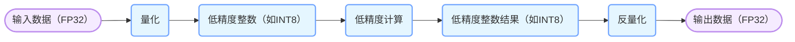

# 模型量化:在资源受限设备上部署AI

> 关键词：模型量化、资源受限设备、AI部署、深度学习、低精度计算、推理加速

> 摘要：本文围绕模型量化在资源受限设备上部署AI这一核心主题展开。首先介绍了背景信息，包括目的范围、预期读者等。接着阐述了模型量化的核心概念与联系，通过文本示意图和Mermaid流程图展示其原理和架构。详细讲解了核心算法原理，结合Python源代码说明具体操作步骤，同时给出相关数学模型和公式并举例说明。通过项目实战，展示了在实际开发环境中如何进行模型量化的代码实现与解读。探讨了模型量化的实际应用场景，推荐了学习资源、开发工具框架以及相关论文著作。最后总结了未来发展趋势与挑战，并提供常见问题解答和扩展阅读参考资料，旨在帮助读者全面深入地了解模型量化在资源受限设备上部署AI的相关知识和技术。

## 1. 背景介绍 
### 1.1 目的和范围
随着人工智能技术的飞速发展，深度学习模型在图像识别、自然语言处理、语音识别等众多领域取得了巨大的成功。然而，这些先进的深度学习模型往往具有庞大的参数量和复杂的计算结构，对计算资源和存储资源的需求极高。在资源受限的设备，如移动终端、嵌入式设备、物联网设备等上部署这些模型面临着巨大的挑战。

模型量化作为一种有效的技术手段，旨在通过降低模型参数和计算的精度，减少模型的存储空间和计算量，从而实现模型在资源受限设备上的高效部署。本文的目的就是深入探讨模型量化的原理、算法、实现步骤以及在实际项目中的应用，为开发者提供全面的技术指导和实践参考。

本文的范围涵盖了模型量化的基本概念、核心算法、数学模型、项目实战、应用场景以及相关的工具和资源推荐等方面，旨在帮助读者全面掌握模型量化技术，能够在实际项目中灵活应用。

### 1.2 预期读者
本文预期读者包括但不限于以下几类人群：
- **人工智能开发者**：希望了解模型量化技术，以便在资源受限设备上优化和部署深度学习模型，提高模型的运行效率和性能。
- **嵌入式系统工程师**：需要在嵌入式设备上集成AI功能，通过模型量化技术解决资源受限的问题，实现高效的AI应用。
- **研究人员**：对模型量化领域的最新研究成果和技术趋势感兴趣，希望深入研究模型量化的理论和算法，推动该领域的发展。
- **学生**：正在学习人工智能、深度学习等相关课程，希望通过本文了解模型量化的基本概念和实践方法，拓宽知识面和实践能力。

### 1.3 文档结构概述
本文将按照以下结构进行组织：
1. **背景介绍**：介绍本文的目的和范围、预期读者、文档结构概述以及相关术语表。
2. **核心概念与联系**：阐述模型量化的核心概念、原理和架构，通过文本示意图和Mermaid流程图展示其内在联系。
3. **核心算法原理 & 具体操作步骤**：详细讲解模型量化的核心算法原理，并结合Python源代码说明具体的操作步骤。
4. **数学模型和公式 & 详细讲解 & 举例说明**：给出模型量化的数学模型和公式，并通过具体的例子进行详细讲解。
5. **项目实战：代码实际案例和详细解释说明**：通过实际项目案例，展示在开发环境中如何进行模型量化的代码实现和解读。
6. **实际应用场景**：探讨模型量化在不同领域的实际应用场景。
7. **工具和资源推荐**：推荐学习资源、开发工具框架以及相关的论文著作。
8. **总结：未来发展趋势与挑战**：总结模型量化技术的未来发展趋势和面临的挑战。
9. **附录：常见问题与解答**：提供常见问题的解答，帮助读者解决在学习和实践过程中遇到的问题。
10. **扩展阅读 & 参考资料**：提供相关的扩展阅读材料和参考资料，方便读者进一步深入学习。

### 1.4 术语表
#### 1.4.1 核心术语定义
- **模型量化**：将深度学习模型中的浮点数参数和计算转换为低精度（如8位整数、4位整数等）表示的过程，以减少模型的存储空间和计算量。
- **资源受限设备**：指计算资源（如CPU、GPU）和存储资源（如内存、硬盘）有限的设备，如移动终端、嵌入式设备、物联网设备等。
- **深度学习模型**：基于人工神经网络的机器学习模型，通过多层神经元的组合和训练来学习数据的特征和模式。
- **低精度计算**：使用比浮点数更低精度的数据类型（如整数）进行计算，以减少计算量和存储需求。
- **推理加速**：通过优化模型和计算过程，提高模型在设备上的推理速度。

#### 1.4.2 相关概念解释
- **量化粒度**：指量化操作所作用的范围，常见的量化粒度包括逐层量化、逐通道量化等。
- **量化误差**：由于量化过程中将浮点数转换为低精度表示而引入的误差，可能会影响模型的性能。
- **校准**：在量化过程中，通过使用一部分数据集来确定量化参数（如缩放因子、零点），以减少量化误差。

#### 1.4.3 缩略词列表
- **AI**：Artificial Intelligence，人工智能
- **DNN**：Deep Neural Network，深度神经网络
- **FP32**：32位浮点数
- **INT8**：8位整数
- **GPU**：Graphics Processing Unit，图形处理单元
- **CPU**：Central Processing Unit，中央处理单元

## 2. 核心概念与联系 

### 2.1 模型量化的基本原理
模型量化的基本思想是将深度学习模型中的浮点数参数和计算转换为低精度表示，通常是整数表示。在深度学习模型中，大部分参数和中间计算结果使用32位浮点数（FP32）表示，这种高精度表示虽然能够保证模型的准确性，但会占用大量的存储空间和计算资源。通过模型量化，可以将这些参数和计算转换为8位整数（INT8）甚至更低精度的表示，从而显著减少模型的存储空间和计算量。

模型量化的过程主要包括两个步骤：量化和反量化。量化是将浮点数转换为低精度整数的过程，反量化是将低精度整数转换回浮点数的过程。在推理过程中，模型使用低精度整数进行计算，最后将结果反量化为浮点数输出。

### 2.2 核心概念的文本示意图
以下是模型量化的核心概念的文本示意图：

```plaintext
输入数据（FP32）
|
| 量化
v
低精度整数（如INT8）
|
| 低精度计算
v
低精度整数结果（如INT8）
|
| 反量化
v
输出数据（FP32）
```

### 2.3 Mermaid流程图


### 2.4 量化方法分类
模型量化方法可以分为两大类：训练后量化（Post-Training Quantization，PTQ）和量化感知训练（Quantization-Aware Training，QAT）。

- **训练后量化（PTQ）**：在模型训练完成后进行量化操作，不需要重新训练模型。这种方法简单快速，但由于没有考虑量化误差对模型性能的影响，可能会导致模型性能下降。
- **量化感知训练（QAT）**：在模型训练过程中引入量化操作，让模型在训练过程中学习如何适应量化误差。这种方法可以有效减少量化误差对模型性能的影响，但需要重新训练模型，计算成本较高。

## 3. 核心算法原理 & 具体操作步骤 

### 3.1 训练后量化（PTQ）算法原理
训练后量化的核心思想是通过统计模型参数和激活值的分布，确定量化参数（如缩放因子、零点），然后将浮点数参数和激活值转换为低精度整数。

常见的训练后量化方法是线性量化，其公式如下：

设 $x$ 为浮点数，$x_q$ 为量化后的整数，$S$ 为缩放因子，$Z$ 为零点，则量化公式为：

$x_q = \text{round}(\frac{x}{S}) + Z$

反量化公式为：

$x = S(x_q - Z)$

### 3.2 训练后量化（PTQ）具体操作步骤
以下是训练后量化（PTQ）的具体操作步骤：

1. **收集统计信息**：使用一部分校准数据集，收集模型参数和激活值的统计信息，如最小值、最大值等。
2. **计算量化参数**：根据统计信息，计算缩放因子 $S$ 和零点 $Z$。
3. **量化模型参数**：将模型的浮点数参数根据量化公式转换为低精度整数。
4. **量化激活值**：在推理过程中，将输入数据和中间激活值根据量化公式转换为低精度整数，进行低精度计算，最后将结果反量化为浮点数输出。

### 3.3 Python源代码实现训练后量化（PTQ）
以下是一个简单的Python代码示例，演示如何使用PyTorch进行训练后量化：

```python
import torch
import torch.nn as nn
import torch.quantization

# 定义一个简单的神经网络模型
class SimpleNet(nn.Module):
    def __init__(self):
        super(SimpleNet, self).__init__()
        self.fc1 = nn.Linear(10, 20)
        self.relu = nn.ReLU()
        self.fc2 = nn.Linear(20, 1)

    def forward(self, x):
        x = self.fc1(x)
        x = self.relu(x)
        x = self.fc2(x)
        return x

# 创建模型实例
model = SimpleNet()

# 定义校准数据集
calibration_data = torch.randn(100, 10)

# 配置量化参数
model.qconfig = torch.quantization.get_default_qconfig('fbgemm')

# 准备模型进行量化
model_prepared = torch.quantization.prepare(model)

# 收集统计信息
with torch.no_grad():
    for data in calibration_data:
        model_prepared(data)

# 量化模型
model_quantized = torch.quantization.convert(model_prepared)

# 测试量化模型
test_data = torch.randn(1, 10)
output = model_quantized(test_data)
print("Quantized model output:", output)
```

### 3.4 量化感知训练（QAT）算法原理
量化感知训练的核心思想是在模型训练过程中引入量化操作，让模型在训练过程中学习如何适应量化误差。具体做法是在模型的前向传播过程中插入量化和反量化操作，模拟量化过程，使得模型能够学习到量化后的参数和激活值的分布。

### 3.5 量化感知训练（QAT）具体操作步骤
以下是量化感知训练（QAT）的具体操作步骤：

1. **定义量化模型**：在模型中插入量化和反量化操作，模拟量化过程。
2. **配置量化参数**：设置量化的位数、量化粒度等参数。
3. **训练模型**：使用训练数据集对量化模型进行训练，让模型学习如何适应量化误差。
4. **量化模型**：在训练完成后，将模型转换为量化模型。

### 3.6 Python源代码实现量化感知训练（QAT）
以下是一个简单的Python代码示例，演示如何使用PyTorch进行量化感知训练：

```python
import torch
import torch.nn as nn
import torch.quantization

# 定义一个简单的神经网络模型
class SimpleNet(nn.Module):
    def __init__(self):
        super(SimpleNet, self).__init__()
        self.quant = torch.quantization.QuantStub()
        self.fc1 = nn.Linear(10, 20)
        self.relu = nn.ReLU()
        self.fc2 = nn.Linear(20, 1)
        self.dequant = torch.quantization.DeQuantStub()

    def forward(self, x):
        x = self.quant(x)
        x = self.fc1(x)
        x = self.relu(x)
        x = self.fc2(x)
        x = self.dequant(x)
        return x

# 创建模型实例
model = SimpleNet()

# 配置量化参数
model.qconfig = torch.quantization.get_default_qat_qconfig('fbgemm')

# 准备模型进行量化感知训练
model_prepared = torch.quantization.prepare_qat(model)

# 定义训练数据集和优化器
train_data = torch.randn(1000, 10)
train_labels = torch.randn(1000, 1)
optimizer = torch.optim.SGD(model_prepared.parameters(), lr=0.01)
criterion = nn.MSELoss()

# 训练模型
for epoch in range(10):
    optimizer.zero_grad()
    output = model_prepared(train_data)
    loss = criterion(output, train_labels)
    loss.backward()
    optimizer.step()

# 量化模型
model_quantized = torch.quantization.convert(model_prepared)

# 测试量化模型
test_data = torch.randn(1, 10)
output = model_quantized(test_data)
print("Quantized model output:", output)
```

## 4. 数学模型和公式 & 详细讲解 & 举例说明 

### 4.1 线性量化的数学模型和公式
线性量化是最常见的量化方法，其数学模型和公式如下：

设 $x$ 为浮点数，$x_q$ 为量化后的整数，$S$ 为缩放因子，$Z$ 为零点，$q_{\text{min}}$ 和 $q_{\text{max}}$ 分别为量化整数的最小值和最大值，则量化公式为：

$x_q = \text{clip}(\text{round}(\frac{x}{S}) + Z, q_{\text{min}}, q_{\text{max}})$

反量化公式为：

$x = S(x_q - Z)$

其中，$\text{clip}(x, a, b)$ 表示将 $x$ 限制在区间 $[a, b]$ 内，$\text{round}(x)$ 表示对 $x$ 进行四舍五入。

### 4.2 缩放因子和零点的计算
缩放因子 $S$ 和零点 $Z$ 的计算方法有多种，常见的方法是根据模型参数和激活值的最小值 $x_{\text{min}}$ 和最大值 $x_{\text{max}}$ 来计算：

$S = \frac{x_{\text{max}} - x_{\text{min}}}{q_{\text{max}} - q_{\text{min}}}$

$Z = q_{\text{min}} - \text{round}(\frac{x_{\text{min}}}{S})$

### 4.3 详细讲解
线性量化的核心思想是将浮点数的取值范围映射到低精度整数的取值范围。缩放因子 $S$ 决定了浮点数和整数之间的比例关系，零点 $Z$ 决定了整数取值范围的偏移量。

在量化过程中，首先将浮点数除以缩放因子 $S$，然后四舍五入得到一个整数，再加上零点 $Z$，最后将结果限制在量化整数的取值范围内。在反量化过程中，将量化后的整数减去零点 $Z$，然后乘以缩放因子 $S$，得到原始的浮点数。

### 4.4 举例说明
假设我们要将一个浮点数 $x = 3.5$ 量化为8位整数（$q_{\text{min}} = -128$，$q_{\text{max}} = 127$），已知 $x_{\text{min}} = 0$，$x_{\text{max}} = 10$。

首先计算缩放因子 $S$ 和零点 $Z$：

$S = \frac{x_{\text{max}} - x_{\text{min}}}{q_{\text{max}} - q_{\text{min}}} = \frac{10 - 0}{127 - (-128)} = \frac{10}{255} \approx 0.0392$

$Z = q_{\text{min}} - \text{round}(\frac{x_{\text{min}}}{S}) = -128 - \text{round}(\frac{0}{0.0392}) = -128$

然后进行量化：

$x_q = \text{clip}(\text{round}(\frac{x}{S}) + Z, q_{\text{min}}, q_{\text{max}}) = \text{clip}(\text{round}(\frac{3.5}{0.0392}) - 128, -128, 127) = \text{clip}(89 - 128, -128, 127) = -39$

最后进行反量化：

$x = S(x_q - Z) = 0.0392(-39 - (-128)) = 0.0392 \times 89 \approx 3.49$

可以看到，由于量化误差的存在，反量化后的结果与原始值略有偏差。

## 5. 项目实战：代码实际案例和详细解释说明 

### 5.1  开发环境搭建
#### 5.1.1 安装Python和相关库
首先，确保你已经安装了Python 3.x版本。然后，使用以下命令安装所需的库：

```bash
pip install torch torchvision
```

#### 5.1.2 配置开发环境
可以使用任何你喜欢的Python开发环境，如PyCharm、Jupyter Notebook等。这里以Jupyter Notebook为例，安装并启动Jupyter Notebook：

```bash
pip install jupyter
jupyter notebook
```

### 5.2  源代码详细实现和代码解读
#### 5.2.1 训练后量化（PTQ）代码实现
以下是一个完整的训练后量化（PTQ）的代码示例：

```python
import torch
import torch.nn as nn
import torch.quantization
import torchvision
import torchvision.transforms as transforms

# 定义一个简单的卷积神经网络模型
class SimpleCNN(nn.Module):
    def __init__(self):
        super(SimpleCNN, self).__init__()
        self.conv1 = nn.Conv2d(3, 16, kernel_size=3, padding=1)
        self.relu1 = nn.ReLU()
        self.pool1 = nn.MaxPool2d(2, 2)
        self.conv2 = nn.Conv2d(16, 32, kernel_size=3, padding=1)
        self.relu2 = nn.ReLU()
        self.pool2 = nn.MaxPool2d(2, 2)
        self.fc1 = nn.Linear(32 * 8 * 8, 128)
        self.relu3 = nn.ReLU()
        self.fc2 = nn.Linear(128, 10)

    def forward(self, x):
        x = self.pool1(self.relu1(self.conv1(x)))
        x = self.pool2(self.relu2(self.conv2(x)))
        x = x.view(-1, 32 * 8 * 8)
        x = self.relu3(self.fc1(x))
        x = self.fc2(x)
        return x

# 加载数据集
transform = transforms.Compose([
    transforms.ToTensor(),
    transforms.Normalize((0.5, 0.5, 0.5), (0.5, 0.5, 0.5))
])

trainset = torchvision.datasets.CIFAR10(root='./data', train=True,
                                        download=True, transform=transform)
trainloader = torch.utils.data.DataLoader(trainset, batch_size=4,
                                          shuffle=True, num_workers=2)

testset = torchvision.datasets.CIFAR10(root='./data', train=False,
                                       download=True, transform=transform)
testloader = torch.utils.data.DataLoader(testset, batch_size=4,
                                         shuffle=False, num_workers=2)

# 创建模型实例
model = SimpleCNN()

# 训练模型
criterion = nn.CrossEntropyLoss()
optimizer = torch.optim.SGD(model.parameters(), lr=0.001, momentum=0.9)

for epoch in range(5):  # 训练5个epoch
    running_loss = 0.0
    for i, data in enumerate(trainloader, 0):
        inputs, labels = data
        optimizer.zero_grad()
        outputs = model(inputs)
        loss = criterion(outputs, labels)
        loss.backward()
        optimizer.step()
        running_loss += loss.item()
    print(f'Epoch {epoch + 1}, Loss: {running_loss / len(trainloader)}')

# 配置量化参数
model.qconfig = torch.quantization.get_default_qconfig('fbgemm')

# 准备模型进行量化
model_prepared = torch.quantization.prepare(model)

# 收集统计信息
with torch.no_grad():
    for data in trainloader:
        inputs, _ = data
        model_prepared(inputs)

# 量化模型
model_quantized = torch.quantization.convert(model_prepared)

# 测试量化模型
correct = 0
total = 0
with torch.no_grad():
    for data in testloader:
        images, labels = data
        outputs = model_quantized(images)
        _, predicted = torch.max(outputs.data, 1)
        total += labels.size(0)
        correct += (predicted == labels).sum().item()

print(f'Accuracy of the quantized network on the 10000 test images: {100 * correct / total}%')
```

#### 5.2.2 代码解读
1. **模型定义**：定义了一个简单的卷积神经网络模型 `SimpleCNN`，包含两个卷积层、两个池化层和两个全连接层。
2. **数据集加载**：使用 `torchvision` 加载CIFAR-10数据集，并进行预处理。
3. **模型训练**：使用交叉熵损失函数和随机梯度下降优化器对模型进行训练。
4. **量化配置**：配置量化参数，使用 `torch.quantization.get_default_qconfig('fbgemm')` 获取默认的量化配置。
5. **模型准备**：使用 `torch.quantization.prepare` 准备模型进行量化，插入量化和反量化操作。
6. **统计信息收集**：使用一部分训练数据集收集模型参数和激活值的统计信息。
7. **模型量化**：使用 `torch.quantization.convert` 将准备好的模型转换为量化模型。
8. **模型测试**：使用测试数据集测试量化模型的准确率。

#### 5.2.3 量化感知训练（QAT）代码实现
以下是一个完整的量化感知训练（QAT）的代码示例：

```python
import torch
import torch.nn as nn
import torch.quantization
import torchvision
import torchvision.transforms as transforms

# 定义一个简单的卷积神经网络模型
class SimpleCNN(nn.Module):
    def __init__(self):
        super(SimpleCNN, self).__init__()
        self.quant = torch.quantization.QuantStub()
        self.conv1 = nn.Conv2d(3, 16, kernel_size=3, padding=1)
        self.relu1 = nn.ReLU()
        self.pool1 = nn.MaxPool2d(2, 2)
        self.conv2 = nn.Conv2d(16, 32, kernel_size=3, padding=1)
        self.relu2 = nn.ReLU()
        self.pool2 = nn.MaxPool2d(2, 2)
        self.fc1 = nn.Linear(32 * 8 * 8, 128)
        self.relu3 = nn.ReLU()
        self.fc2 = nn.Linear(128, 10)
        self.dequant = torch.quantization.DeQuantStub()

    def forward(self, x):
        x = self.quant(x)
        x = self.pool1(self.relu1(self.conv1(x)))
        x = self.pool2(self.relu2(self.conv2(x)))
        x = x.view(-1, 32 * 8 * 8)
        x = self.relu3(self.fc1(x))
        x = self.fc2(x)
        x = self.dequant(x)
        return x

# 加载数据集
transform = transforms.Compose([
    transforms.ToTensor(),
    transforms.Normalize((0.5, 0.5, 0.5), (0.5, 0.5, 0.5))
])

trainset = torchvision.datasets.CIFAR10(root='./data', train=True,
                                        download=True, transform=transform)
trainloader = torch.utils.data.DataLoader(trainset, batch_size=4,
                                          shuffle=True, num_workers=2)

testset = torchvision.datasets.CIFAR10(root='./data', train=False,
                                       download=True, transform=transform)
testloader = torch.utils.data.DataLoader(testset, batch_size=4,
                                         shuffle=False, num_workers=2)

# 创建模型实例
model = SimpleCNN()

# 配置量化参数
model.qconfig = torch.quantization.get_default_qat_qconfig('fbgemm')

# 准备模型进行量化感知训练
model_prepared = torch.quantization.prepare_qat(model)

# 训练模型
criterion = nn.CrossEntropyLoss()
optimizer = torch.optim.SGD(model_prepared.parameters(), lr=0.001, momentum=0.9)

for epoch in range(5):  # 训练5个epoch
    running_loss = 0.0
    for i, data in enumerate(trainloader, 0):
        inputs, labels = data
        optimizer.zero_grad()
        outputs = model_prepared(inputs)
        loss = criterion(outputs, labels)
        loss.backward()
        optimizer.step()
        running_loss += loss.item()
    print(f'Epoch {epoch + 1}, Loss: {running_loss / len(trainloader)}')

# 量化模型
model_quantized = torch.quantization.convert(model_prepared)

# 测试量化模型
correct = 0
total = 0
with torch.no_grad():
    for data in testloader:
        images, labels = data
        outputs = model_quantized(images)
        _, predicted = torch.max(outputs.data, 1)
        total += labels.size(0)
        correct += (predicted == labels).sum().item()

print(f'Accuracy of the quantized network on the 10000 test images: {100 * correct / total}%')
```

#### 5.2.4 代码解读
1. **模型定义**：在模型中插入 `QuantStub` 和 `DeQuantStub` 模块，用于模拟量化和反量化操作。
2. **数据集加载**：使用 `torchvision` 加载CIFAR-10数据集，并进行预处理。
3. **量化配置**：配置量化参数，使用 `torch.quantization.get_default_qat_qconfig('fbgemm')` 获取默认的量化感知训练配置。
4. **模型准备**：使用 `torch.quantization.prepare_qat` 准备模型进行量化感知训练。
5. **模型训练**：使用交叉熵损失函数和随机梯度下降优化器对量化感知训练模型进行训练。
6. **模型量化**：在训练完成后，使用 `torch.quantization.convert` 将模型转换为量化模型。
7. **模型测试**：使用测试数据集测试量化模型的准确率。

### 5.3  代码解读与分析
#### 5.3.1 训练后量化（PTQ）分析
训练后量化的优点是简单快速，不需要重新训练模型。但由于没有考虑量化误差对模型性能的影响，可能会导致模型性能下降。在上述代码中，通过收集统计信息来确定量化参数，然后将模型参数和激活值进行量化。在测试量化模型时，可以看到量化后的模型准确率可能会有所下降。

#### 5.3.2 量化感知训练（QAT）分析
量化感知训练的优点是可以有效减少量化误差对模型性能的影响，因为模型在训练过程中学习了如何适应量化误差。在上述代码中，通过在模型中插入量化和反量化操作，模拟量化过程，然后对模型进行训练。在训练完成后，将模型转换为量化模型，测试量化模型的准确率可以发现，量化感知训练后的模型准确率通常比训练后量化的模型准确率高。

## 6. 实际应用场景 

### 6.1 移动终端应用
在移动终端设备，如智能手机、平板电脑等上，资源受限是一个普遍存在的问题。模型量化技术可以显著减少深度学习模型的存储空间和计算量，使得这些模型能够在移动终端设备上高效运行。例如，在手机拍照应用中，使用量化后的图像识别模型可以实时对拍摄的照片进行分类、识别等操作，提高用户体验。

### 6.2 嵌入式设备应用
嵌入式设备，如智能摄像头、智能手表、智能家居设备等，通常具有有限的计算资源和存储资源。模型量化技术可以将复杂的深度学习模型部署到这些嵌入式设备上，实现智能功能。例如，在智能摄像头中，使用量化后的目标检测模型可以实时检测监控画面中的目标物体，实现智能监控功能。

### 6.3 物联网设备应用
物联网设备通常需要在低功耗、低资源的环境下运行。模型量化技术可以将深度学习模型的计算量和存储需求降低到物联网设备能够承受的范围，使得物联网设备能够实现智能感知和决策功能。例如，在智能农业中，使用量化后的传感器数据处理模型可以实时分析土壤湿度、温度等数据，实现精准灌溉和施肥。

### 6.4 自动驾驶应用
在自动驾驶领域，需要在有限的计算资源下实时处理大量的传感器数据。模型量化技术可以提高深度学习模型的推理速度，减少计算资源的消耗，从而提高自动驾驶系统的实时性和可靠性。例如，在自动驾驶汽车中，使用量化后的目标检测和识别模型可以实时检测道路上的车辆、行人等目标物体，为自动驾驶决策提供支持。

## 7. 工具和资源推荐
### 7.1 学习资源推荐
#### 7.1.1 书籍推荐
- 《深度学习》（Deep Learning）：由Ian Goodfellow、Yoshua Bengio和Aaron Courville合著，是深度学习领域的经典教材，全面介绍了深度学习的基本概念、算法和应用。
- 《动手学深度学习》（Dive into Deep Learning）：由李沐等人编写，是一本开源的深度学习教材，提供了丰富的代码示例和实践项目，适合初学者学习。
- 《神经网络与深度学习》（Neural Networks and Deep Learning）：由Michael Nielsen编写，是一本免费的在线书籍，以通俗易懂的方式介绍了神经网络和深度学习的基本原理和算法。

#### 7.1.2 在线课程
- Coursera上的“深度学习专项课程”（Deep Learning Specialization）：由Andrew Ng教授主讲，是深度学习领域的经典在线课程，包括五门课程，全面介绍了深度学习的基本概念、算法和应用。
- edX上的“强化学习基础”（Foundations of Reinforcement Learning）：由Pieter Abbeel教授主讲，介绍了强化学习的基本概念、算法和应用，适合对强化学习感兴趣的读者学习。
- 哔哩哔哩上的“李宏毅机器学习”：由李宏毅教授主讲，以生动有趣的方式介绍了机器学习和深度学习的基本概念、算法和应用，适合初学者学习。

#### 7.1.3 技术博客和网站
- Medium：是一个技术博客平台，有许多关于深度学习、模型量化等领域的优秀文章，可以关注一些知名作者和技术社区。
- arXiv：是一个预印本论文平台，提供了大量的最新研究成果和技术论文，可以及时了解模型量化领域的最新研究动态。
- TensorFlow官方博客：提供了TensorFlow框架的最新技术和应用案例，包括模型量化相关的内容。

### 7.2 开发工具框架推荐
#### 7.2.1 IDE和编辑器
- PyCharm：是一款专业的Python集成开发环境，提供了丰富的代码编辑、调试、分析等功能，适合开发深度学习项目。
- Jupyter Notebook：是一个交互式的笔记本环境，适合进行数据探索、模型训练和调试等工作。
- Visual Studio Code：是一款轻量级的代码编辑器，支持多种编程语言和插件，适合快速开发和调试深度学习代码。

#### 7.2.2 调试和性能分析工具
- PyTorch Profiler：是PyTorch框架提供的性能分析工具，可以帮助开发者分析模型的计算时间、内存使用等情况，优化模型性能。
- TensorBoard：是TensorFlow框架提供的可视化工具，可以帮助开发者可视化模型的训练过程、性能指标等信息。
- NVIDIA Nsight Compute：是NVIDIA提供的性能分析工具，适合对GPU加速的深度学习模型进行性能分析和优化。

#### 7.2.3 相关框架和库
- PyTorch：是一个开源的深度学习框架，提供了丰富的深度学习模型和工具，支持模型量化功能。
- TensorFlow：是一个开源的深度学习框架，提供了强大的模型训练和部署工具，支持模型量化功能。
- ONNX Runtime：是一个跨平台的深度学习推理引擎，支持多种深度学习框架的模型，提供了模型量化和推理加速功能。

### 7.3 相关论文著作推荐
#### 7.3.1 经典论文
- “Deep Compression: Compressing Deep Neural Networks with Pruning, Trained Quantization and Huffman Coding”：提出了一种将模型剪枝、量化和哈夫曼编码相结合的深度压缩方法，显著减少了深度学习模型的存储空间和计算量。
- “Quantization and Training of Neural Networks for Efficient Integer-Arithmetic-Only Inference”：提出了一种量化感知训练的方法，通过在训练过程中引入量化操作，让模型学习如何适应量化误差，从而减少量化对模型性能的影响。
- “MobileNetV1: Efficient Convolutional Neural Networks for Mobile Vision Applications”：提出了一种轻量级的卷积神经网络架构MobileNetV1，通过深度可分离卷积和模型量化等技术，实现了在移动设备上的高效运行。

#### 7.3.2 最新研究成果
- 关注arXiv上的最新研究论文，了解模型量化领域的最新技术和方法，如混合精度量化、自适应量化等。
- 参加相关的学术会议，如NeurIPS、ICML、CVPR等，了解模型量化领域的最新研究动态和成果。

#### 7.3.3 应用案例分析
- 关注工业界的技术博客和开源项目，了解模型量化技术在实际应用中的案例和经验，如Google的TensorFlow Lite、Facebook的PyTorch Mobile等。
- 分析一些开源的深度学习项目，学习如何在实际项目中应用模型量化技术，提高模型的性能和效率。

## 8. 总结：未来发展趋势与挑战

### 8.1 未来发展趋势
#### 8.1.1 更低精度量化
随着硬件技术的不断发展，未来模型量化可能会朝着更低精度的方向发展，如4位整数、2位整数甚至1位整数量化。更低精度的量化可以进一步减少模型的存储空间和计算量，提高模型在资源受限设备上的运行效率。

#### 8.1.2 混合精度量化
混合精度量化是指在模型中使用不同精度的数据类型进行计算，根据不同层的特点和需求选择合适的精度。混合精度量化可以在减少计算量的同时，保证模型的准确性，是未来模型量化的一个重要发展方向。

#### 8.1.3 自适应量化
自适应量化是指根据模型的输入数据和运行环境，动态调整量化参数和精度，以达到最佳的性能和准确性。自适应量化可以更好地适应不同的应用场景和硬件平台，提高模型的通用性和灵活性。

#### 8.1.4 与硬件的协同设计
未来模型量化技术将与硬件设计更加紧密地结合，通过硬件优化来支持低精度计算，提高模型的推理速度和能效。例如，一些芯片制造商已经开始设计专门支持低精度计算的芯片，以满足模型量化的需求。

### 8.2 挑战
#### 8.2.1 量化误差控制
量化误差是模型量化过程中面临的主要挑战之一。随着量化精度的降低，量化误差会逐渐增大，可能会导致模型性能下降。如何有效地控制量化误差，保证模型的准确性，是未来需要解决的关键问题。

#### 8.2.2 模型兼容性
不同的深度学习框架和硬件平台对模型量化的支持可能存在差异，导致模型在不同环境下的兼容性问题。如何实现模型量化的跨平台兼容，是未来需要解决的另一个重要问题。

#### 8.2.3 量化算法的复杂度
一些先进的量化算法，如自适应量化、混合精度量化等，通常具有较高的复杂度，需要更多的计算资源和时间来实现。如何在保证量化效果的前提下，降低量化算法的复杂度，提高量化效率，是未来需要研究的方向。

#### 8.2.4 数据隐私和安全
在模型量化过程中，可能会涉及到数据的隐私和安全问题。例如，量化后的模型参数和中间结果可能会泄露敏感信息。如何在模型量化过程中保护数据的隐私和安全，是未来需要关注的重要问题。

## 9. 附录：常见问题与解答

### 9.1 模型量化一定会导致模型性能下降吗？
不一定。训练后量化由于没有考虑量化误差对模型性能的影响，可能会导致模型性能下降。但量化感知训练通过在训练过程中引入量化操作，让模型学习如何适应量化误差，可以有效减少量化对模型性能的影响，甚至在某些情况下可以提高模型的性能。

### 9.2 如何选择合适的量化方法？
如果模型已经训练好，且对模型性能下降的容忍度较高，可以选择训练后量化，这种方法简单快速。如果对模型性能要求较高，希望尽可能减少量化对模型性能的影响，可以选择量化感知训练，但这种方法需要重新训练模型，计算成本较高。

### 9.3 模型量化后如何进行推理？
模型量化后，推理过程中使用低精度整数进行计算，最后将结果反量化为浮点数输出。不同的深度学习框架提供了相应的推理接口和工具，如PyTorch的 `torch.quantization` 模块、TensorFlow的TensorFlow Lite等。

### 9.4 模型量化对硬件有什么要求？
模型量化可以减少模型的存储空间和计算量，对硬件的计算资源和存储资源要求相对较低。但为了充分发挥模型量化的优势，建议使用支持低精度计算的硬件，如一些专门设计的AI芯片、GPU等。

### 9.5 如何评估模型量化的效果？
可以从以下几个方面评估模型量化的效果：
- **模型大小**：比较量化前后模型的存储空间大小，评估模型量化对存储空间的压缩效果。
- **推理速度**：比较量化前后模型的推理速度，评估模型量化对推理效率的提升效果。
- **模型性能**：比较量化前后模型在测试数据集上的准确率、召回率等性能指标，评估模型量化对模型性能的影响。

## 10. 扩展阅读 & 参考资料

### 10.1 扩展阅读
- 《深度学习优化算法》：深入介绍了深度学习中的各种优化算法，包括如何优化模型的训练过程，提高模型的性能和效率。
- 《计算机体系结构》：了解计算机的硬件结构和工作原理，有助于更好地理解模型量化与硬件的协同设计。
- 《信息论基础》：学习信息论的基本概念和原理，对于理解模型量化中的量化误差、信息损失等问题有帮助。

### 10.2 参考资料
- PyTorch官方文档：https://pytorch.org/docs/stable/index.html
- TensorFlow官方文档：https://www.tensorflow.org/api_docs
- ONNX Runtime官方文档：https://onnxruntime.ai/docs/
- arXiv预印本平台：https://arxiv.org/
- Medium技术博客平台：https://medium.com/