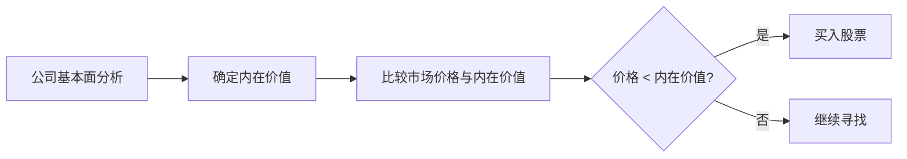
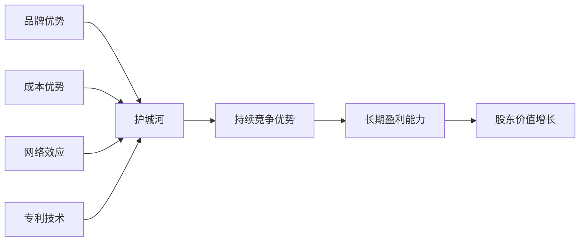
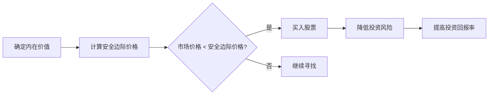

# 沃伦巴菲特的股东信解读

> 关键词：沃伦·巴菲特、股东信、投资理念、价值投资、伯克希尔·哈撒韦、财务分析、商业智慧

> 摘要：沃伦·巴菲特作为全球著名的投资大师，其每年撰写的股东信蕴含着丰富的投资智慧、商业洞察和人生哲学。本文旨在深入解读巴菲特的股东信，全面剖析其中的核心投资理念、财务分析方法、对宏观经济和行业趋势的判断，以及他独特的商业智慧。通过对股东信的详细解读，帮助投资者和商业人士汲取宝贵的经验和启示，提升投资决策能力和商业运营水平。

## 1. 背景介绍 
### 1.1 目的和范围
本文的目的是对沃伦·巴菲特每年发布的股东信进行系统、深入的解读。通过分析股东信中的内容，揭示巴菲特的投资理念、决策过程、对市场和行业的看法，以及他在企业管理和资本配置方面的智慧。范围涵盖了巴菲特自开始撰写股东信以来的重要观点和案例，重点关注其核心投资原则和对长期投资成功的影响。

### 1.2 预期读者
本文预期读者包括投资者、金融从业者、企业管理者、商学院学生以及对投资和商业智慧感兴趣的人士。无论您是初学者还是有一定经验的专业人士，都能从巴菲特的股东信中获得有价值的启示和指导。

### 1.3 文档结构概述
本文将按照以下结构进行组织：首先介绍巴菲特股东信的背景和重要性；接着深入解读股东信中的核心概念和投资理念；然后分析其核心算法原理和具体操作步骤，通过实际案例进行说明；之后探讨其中涉及的数学模型和公式；再通过项目实战，展示如何将巴菲特的投资理念应用到实际投资中；接着介绍股东信对实际应用场景的启示；推荐相关的学习资源、开发工具和论文著作；最后总结未来发展趋势与挑战，并提供常见问题解答和扩展阅读参考资料。

### 1.4 术语表
#### 1.4.1 核心术语定义
- **价值投资**：一种基于公司内在价值进行投资的策略，通过分析公司的财务状况、竞争优势、管理团队等因素，寻找被低估的股票进行长期投资。
- **内在价值**：公司未来现金流的现值，是价值投资的核心概念，反映了公司的真实价值。
- **护城河**：指公司具有的可持续竞争优势，能够保护公司的市场份额和盈利能力，使其在竞争中脱颖而出。
- **安全边际**：指购买股票的价格低于其内在价值的部分，为投资者提供了一定的缓冲，降低了投资风险。

#### 1.4.2 相关概念解释
- **复利**：指在每一个计息期后，将所生利息加入本金再计利息的计算方法，复利的力量是巴菲特长期投资成功的重要因素之一。
- **集中投资**：指将投资组合集中在少数几只具有竞争优势和长期增长潜力的股票上，而不是分散投资于众多股票。
- **长期投资**：指投资者持有股票或其他资产的时间较长，通常为数年甚至数十年，以获得长期的资本增值和股息收益。

#### 1.4.3 缩略词列表
- **BRK**：伯克希尔·哈撒韦公司（Berkshire Hathaway）的股票代码。

## 2. 核心概念与联系 
### 2.1 价值投资理念
价值投资是巴菲特投资理念的核心。他认为，股票不仅仅是一张纸片，而是代表了公司的一部分所有权。投资者应该关注公司的内在价值，而不是市场的短期波动。通过深入研究公司的基本面，包括财务报表、行业竞争格局、管理团队等，寻找那些被市场低估的股票进行投资。

价值投资的核心原理可以用以下示意图表示：



### 2.2 护城河理论
巴菲特非常重视公司的护城河，即公司的可持续竞争优势。他认为，只有具有强大护城河的公司才能在长期竞争中保持领先地位，为股东创造持续的价值。护城河的来源包括品牌优势、成本优势、网络效应、专利技术等。

护城河理论的核心联系可以用以下示意图表示：



### 2.3 安全边际原则
安全边际是价值投资的重要原则之一。巴菲特认为，投资者在购买股票时应该预留一定的安全边际，即购买价格低于股票的内在价值。这样可以降低投资风险，即使公司的未来业绩出现一定的波动，投资者也不会遭受重大损失。

安全边际原则的核心联系可以用以下示意图表示：



## 3. 核心算法原理 & 具体操作步骤 
### 3.1 内在价值计算
巴菲特认为，公司的内在价值是其未来现金流的现值。计算内在价值的基本公式为：

```python
def calculate_intrinsic_value(cash_flows, discount_rate):
    """
    计算公司的内在价值
    :param cash_flows: 未来现金流列表
    :param discount_rate: 折现率
    :return: 内在价值
    """
    intrinsic_value = 0
    for i, cash_flow in enumerate(cash_flows):
        present_value = cash_flow / ((1 + discount_rate) ** (i + 1))
        intrinsic_value += present_value
    return intrinsic_value

# 示例数据
cash_flows = [100, 120, 140, 160, 180]
discount_rate = 0.1

# 计算内在价值
intrinsic_value = calculate_intrinsic_value(cash_flows, discount_rate)
print(f"内在价值: {intrinsic_value}")
```

### 3.2 安全边际计算
安全边际的计算是基于内在价值和市场价格的比较。安全边际率的计算公式为：

```python
def calculate_margin_of_safety(intrinsic_value, market_price):
    """
    计算安全边际率
    :param intrinsic_value: 内在价值
    :param market_price: 市场价格
    :return: 安全边际率
    """
    margin_of_safety = (intrinsic_value - market_price) / intrinsic_value
    return margin_of_safety

# 示例数据
market_price = 150

# 计算安全边际率
margin_of_safety = calculate_margin_of_safety(intrinsic_value, market_price)
print(f"安全边际率: {margin_of_safety * 100}%")
```

### 3.3 具体操作步骤
1. **公司基本面分析**：对公司的财务报表、行业竞争格局、管理团队等进行深入研究，了解公司的业务模式、盈利能力、增长潜力等。
2. **确定内在价值**：根据公司的未来现金流预测和折现率，计算公司的内在价值。
3. **比较市场价格与内在价值**：将市场价格与内在价值进行比较，判断股票是否被低估。
4. **计算安全边际**：如果股票被低估，计算安全边际率，确保投资具有足够的安全边际。
5. **做出投资决策**：根据安全边际率和其他因素，做出是否投资的决策。

## 4. 数学模型和公式 & 详细讲解 & 举例说明 
### 4.1 内在价值公式
公司的内在价值 $V$ 可以用以下公式表示：

$$V = \sum_{t=1}^{n} \frac{CF_t}{(1 + r)^t}$$

其中，$CF_t$ 表示第 $t$ 期的现金流，$r$ 表示折现率，$n$ 表示预测期数。

例如，假设一家公司未来 5 年的现金流分别为 100 万元、120 万元、140 万元、160 万元和 180 万元，折现率为 10%。则该公司的内在价值为：

$$V = \frac{100}{(1 + 0.1)^1} + \frac{120}{(1 + 0.1)^2} + \frac{140}{(1 + 0.1)^3} + \frac{160}{(1 + 0.1)^4} + \frac{180}{(1 + 0.1)^5}$$

$$V \approx 90.91 + 99.17 + 105.18 + 109.28 + 111.73 = 516.27$$（万元）

### 4.2 安全边际率公式
安全边际率 $MOS$ 可以用以下公式表示：

$$MOS = \frac{V - P}{V}$$

其中，$V$ 表示内在价值，$P$ 表示市场价格。

例如，假设上述公司的市场价格为 400 万元，则安全边际率为：

$$MOS = \frac{516.27 - 400}{516.27} \approx 0.225 = 22.5\%$$

### 4.3 复利公式
复利的计算公式为：

$$A = P(1 + r)^n$$

其中，$A$ 表示终值，$P$ 表示本金，$r$ 表示年利率，$n$ 表示年数。

例如，假设投资者初始投资 10000 元，年利率为 10%，投资期限为 10 年。则 10 年后的终值为：

$$A = 10000(1 + 0.1)^{10} \approx 25937.42$$（元）

## 5. 项目实战：代码实际案例和详细解释说明 
### 5.1  开发环境搭建
本项目使用 Python 语言进行开发，需要安装以下库：
- `pandas`：用于数据处理和分析。
- `numpy`：用于数值计算。
- `matplotlib`：用于数据可视化。

可以使用以下命令安装这些库：

```sh
pip install pandas numpy matplotlib
```

### 5.2  源代码详细实现和代码解读
```python
import pandas as pd
import numpy as np
import matplotlib.pyplot as plt

# 示例数据：某公司未来 5 年的现金流预测
cash_flows = np.array([100, 120, 140, 160, 180])
discount_rate = 0.1

# 计算内在价值
def calculate_intrinsic_value(cash_flows, discount_rate):
    years = np.arange(1, len(cash_flows) + 1)
    present_values = cash_flows / (1 + discount_rate) ** years
    intrinsic_value = present_values.sum()
    return intrinsic_value

intrinsic_value = calculate_intrinsic_value(cash_flows, discount_rate)
print(f"内在价值: {intrinsic_value}")

# 假设市场价格为 150
market_price = 150

# 计算安全边际率
def calculate_margin_of_safety(intrinsic_value, market_price):
    margin_of_safety = (intrinsic_value - market_price) / intrinsic_value
    return margin_of_safety

margin_of_safety = calculate_margin_of_safety(intrinsic_value, market_price)
print(f"安全边际率: {margin_of_safety * 100}%")

# 可视化现金流和现值
years = np.arange(1, len(cash_flows) + 1)
present_values = cash_flows / (1 + discount_rate) ** years

plt.figure(figsize=(10, 6))
plt.bar(years, cash_flows, label='现金流')
plt.bar(years, present_values, label='现值', alpha=0.7)
plt.xlabel('年份')
plt.ylabel('金额')
plt.title('现金流和现值')
plt.legend()
plt.show()
```

### 5.3  代码解读与分析
1. **数据准备**：使用 `numpy` 数组存储某公司未来 5 年的现金流预测，并设定折现率。
2. **计算内在价值**：定义 `calculate_intrinsic_value` 函数，根据现金流和折现率计算公司的内在价值。
3. **计算安全边际率**：定义 `calculate_margin_of_safety` 函数，根据内在价值和市场价格计算安全边际率。
4. **可视化**：使用 `matplotlib` 库绘制现金流和现值的柱状图，直观展示数据。

通过这个项目实战，我们可以更深入地理解巴菲特的投资理念和相关计算方法，并将其应用到实际投资分析中。

## 6. 实际应用场景 
### 6.1 股票投资
巴菲特的投资理念在股票投资中具有广泛的应用。投资者可以通过分析公司的基本面，寻找具有强大护城河和被低估的股票进行长期投资。例如，巴菲特长期持有可口可乐、富国银行等公司的股票，通过这些投资获得了丰厚的回报。

### 6.2 企业并购
在企业并购中，巴菲特的投资理念也具有重要的指导意义。收购方可以通过评估目标公司的内在价值和护城河，确定合理的收购价格，并在收购后通过整合资源和优化管理，提升目标公司的价值。例如，伯克希尔·哈撒韦公司通过收购吉列、 Dairy Queen 等公司，实现了业务的多元化和价值的增长。

### 6.3 个人财务规划
个人在进行财务规划时，也可以借鉴巴菲特的投资理念。例如，通过长期投资优质资产，利用复利的力量实现财富的增长；同时，在投资过程中注重安全边际，降低投资风险。

## 7. 工具和资源推荐
### 7.1 学习资源推荐
#### 7.1.1 书籍推荐
- 《聪明的投资者》（The Intelligent Investor）：本杰明·格雷厄姆（Benjamin Graham）著，被誉为价值投资的圣经，巴菲特称这本书是他投资生涯的启蒙读物。
- 《巴菲特致股东的信：股份公司教程》（Letters to Shareholders of Berkshire Hathaway）：沃伦·巴菲特（Warren Buffett）著，收集了巴菲特历年写给股东的信，是学习巴菲特投资理念的重要资料。
- 《穷查理宝典：查理·芒格的智慧箴言录》（Poor Charlie's Almanack: The Wit and Wisdom of Charles T. Munger）：查理·芒格（Charlie Munger）著，介绍了芒格的投资理念、思维方式和人生哲学，对理解巴菲特的投资理念有很大帮助。

#### 7.1.2 在线课程
- Coursera 上的“投资学原理”（Principles of Investing）课程，由哥伦比亚大学教授主讲，介绍了投资的基本原理和方法。
- edX 上的“价值投资基础”（Foundations of Value Investing）课程，由知名投资专家授课，深入讲解了价值投资的理念和实践。

#### 7.1.3 技术博客和网站
- 伯克希尔·哈撒韦公司官方网站（https://www.berkshirehathaway.com/ ）：可以获取巴菲特历年的股东信和公司的财务报告。
- 雪球网（https://xueqiu.com/ ）：一个投资交流社区，有很多投资者分享对巴菲特投资理念的理解和实践经验。

### 7.2 开发工具框架推荐
#### 7.2.1 IDE和编辑器
- PyCharm：一款功能强大的 Python 集成开发环境，适合进行数据分析和投资模型开发。
- Jupyter Notebook：一个交互式的开发环境，方便进行数据探索和可视化。

#### 7.2.2 调试和性能分析工具
- pdb：Python 内置的调试器，用于调试 Python 代码。
- cProfile：Python 内置的性能分析工具，用于分析代码的性能瓶颈。

#### 7.2.3 相关框架和库
- Pandas：用于数据处理和分析，提供了丰富的数据结构和数据操作方法。
- Numpy：用于数值计算，提供了高效的数组操作和数学函数。
- Matplotlib：用于数据可视化，提供了各种绘图功能。

### 7.3 相关论文著作推荐
#### 7.3.1 经典论文
- 本杰明·格雷厄姆的《证券分析》（Security Analysis）论文，奠定了价值投资的理论基础。
- 尤金·法玛（Eugene F. Fama）的《有效资本市场：理论与实证研究回顾》（Efficient Capital Markets: A Review of Theory and Empirical Work）论文，探讨了市场效率的问题，对投资理论产生了深远影响。

#### 7.3.2 最新研究成果
- 近年来，学术界对巴菲特的投资理念和业绩进行了大量的研究。可以通过学术数据库，如知网、万方、Web of Science 等，查找相关的最新研究成果。

#### 7.3.3 应用案例分析
- 一些商业杂志和财经媒体会对巴菲特的投资案例进行分析和报道。例如，《财经》杂志、《福布斯》杂志等，提供了很多有价值的应用案例分析。

## 8. 总结：未来发展趋势与挑战
### 8.1 未来发展趋势
- **数字化转型**：随着科技的发展，金融行业正面临着数字化转型的趋势。巴菲特的投资理念也需要适应数字化时代的变化，关注科技公司的发展和创新。
- **可持续投资**：越来越多的投资者开始关注企业的社会责任和可持续发展。巴菲特的投资理念可能会更加注重企业的环境、社会和治理（ESG）因素。
- **全球投资**：随着全球化的发展，投资者的视野也越来越开阔。巴菲特可能会加大对全球市场的投资，寻找更多的投资机会。

### 8.2 挑战
- **市场变化**：市场环境不断变化，新的投资机会和风险不断涌现。巴菲特需要不断调整投资策略，以适应市场的变化。
- **竞争加剧**：随着价值投资理念的普及，越来越多的投资者开始采用类似的投资策略。这可能会导致市场竞争加剧，寻找被低估的股票变得更加困难。
- **科技变革**：科技的快速发展可能会对传统行业产生冲击，一些曾经具有强大护城河的公司可能会面临新的挑战。巴菲特需要准确判断科技变革对投资的影响。

## 9. 附录：常见问题与解答
### 9.1 巴菲特的投资理念是否适用于所有投资者？
巴菲特的投资理念是基于长期价值投资的，需要投资者具备一定的耐心和专业知识。对于一些短期投机者来说，可能不太适用。但对于那些追求长期稳定回报的投资者来说，巴菲特的投资理念具有很高的参考价值。

### 9.2 如何确定公司的内在价值？
确定公司的内在价值是一个复杂的过程，需要考虑多个因素，如公司的财务状况、行业竞争格局、未来发展前景等。常用的方法包括现金流折现法、相对估值法等。但这些方法都存在一定的局限性，需要投资者结合自己的判断和经验进行综合分析。

### 9.3 如何判断公司是否具有护城河？
判断公司是否具有护城河可以从多个方面入手，如品牌优势、成本优势、网络效应、专利技术等。投资者可以通过分析公司的财务报表、行业报告、竞争对手情况等，来评估公司的护城河强度。

## 10. 扩展阅读 & 参考资料
### 10.1 扩展阅读
- 《滚雪球：巴菲特和他的财富人生》（The Snowball: Warren Buffett and the Business of Life）：爱丽丝·施罗德（Alice Schroeder）著，详细介绍了巴菲特的人生经历和投资生涯。
- 《投资最重要的事》（The Most Important Thing Illuminated: Uncommon Sense for the Thoughtful Investor）：霍华德·马克斯（Howard Marks）著，分享了投资中的重要原则和经验。

### 10.2 参考资料
- 伯克希尔·哈撒韦公司历年股东信。
- 相关的财经杂志、报纸和网站，如《华尔街日报》、《金融时报》等。
- 学术数据库中的相关研究论文。