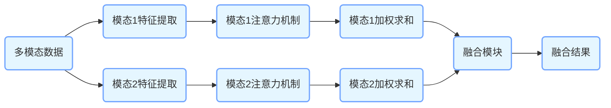

# 注意力机制在AI Agent多模态融合中的应用

> 关键词：注意力机制、AI Agent、多模态融合、深度学习、计算机视觉、自然语言处理、模式识别

> 摘要：本文聚焦于注意力机制在AI Agent多模态融合中的应用。随着人工智能技术的不断发展，AI Agent需要处理多种模态的数据，如文本、图像、音频等，多模态融合成为提升AI Agent智能水平的关键。注意力机制作为一种强大的工具，能够帮助AI Agent在处理多模态数据时，自动聚焦于关键信息，提高融合效果。文章深入探讨了注意力机制的核心概念、算法原理，通过数学模型进行详细阐释，并结合项目实战给出具体的代码案例和分析。此外，还介绍了注意力机制在不同实际应用场景中的作用，推荐了相关的学习资源、开发工具和论文著作。最后对未来发展趋势与挑战进行了总结，为相关领域的研究和应用提供了全面而深入的参考。

## 1. 背景介绍 
### 1.1 目的和范围
本文章的目的在于全面深入地探讨注意力机制在AI Agent多模态融合中的应用。多模态融合是当前人工智能领域的一个重要研究方向，旨在将不同模态的数据（如视觉、听觉、语言等）进行整合，以提升AI Agent的智能表现和决策能力。注意力机制作为一种能够自适应地分配资源、聚焦关键信息的技术，在多模态融合中具有重要的应用价值。本文将涵盖注意力机制的基本概念、核心算法原理、数学模型，以及在实际项目中的应用案例和代码实现，同时分析其在不同应用场景中的作用和未来发展趋势。

### 1.2 预期读者
本文预期读者包括人工智能、机器学习、计算机科学等相关领域的研究人员、开发者、学生，以及对AI Agent多模态融合和注意力机制感兴趣的技术爱好者。希望通过本文的阐述，能够帮助读者深入理解注意力机制在多模态融合中的应用原理和方法，为其在相关领域的研究和实践提供参考。

### 1.3 文档结构概述
本文将按照以下结构进行组织：
- 核心概念与联系：介绍注意力机制和AI Agent多模态融合的基本概念，以及它们之间的联系，并通过文本示意图和Mermaid流程图进行展示。
- 核心算法原理 & 具体操作步骤：详细讲解注意力机制的核心算法原理，并使用Python源代码进行具体操作步骤的阐述。
- 数学模型和公式 & 详细讲解 & 举例说明：给出注意力机制的数学模型和公式，并进行详细讲解和举例说明。
- 项目实战：代码实际案例和详细解释说明：通过一个具体的项目实战，展示注意力机制在AI Agent多模态融合中的应用，包括开发环境搭建、源代码实现和代码解读。
- 实际应用场景：介绍注意力机制在AI Agent多模态融合中的实际应用场景。
- 工具和资源推荐：推荐相关的学习资源、开发工具框架和论文著作。
- 总结：未来发展趋势与挑战：对注意力机制在AI Agent多模态融合中的未来发展趋势和面临的挑战进行总结。
- 附录：常见问题与解答：解答读者在阅读过程中可能遇到的常见问题。
- 扩展阅读 & 参考资料：提供相关的扩展阅读材料和参考资料。

### 1.4 术语表
#### 1.4.1 核心术语定义
- **注意力机制（Attention Mechanism）**：一种模仿人类注意力的机制，能够自动地从大量信息中聚焦于关键部分，在深度学习中常用于提高模型的性能。
- **AI Agent（人工智能智能体）**：能够感知环境、进行决策并采取行动的智能实体，可处理多种模态的数据。
- **多模态融合（Multimodal Fusion）**：将来自不同模态（如视觉、听觉、语言等）的数据进行整合，以获取更全面、准确的信息。
- **模态（Modality）**：数据的不同表现形式，如文本、图像、音频等。

#### 1.4.2 相关概念解释
- **深度学习（Deep Learning）**：一种基于人工神经网络的机器学习方法，通过多层神经网络对数据进行学习和表示。
- **特征提取（Feature Extraction）**：从原始数据中提取出具有代表性的特征，以便后续的处理和分析。
- **表征学习（Representation Learning）**：自动学习数据的有效表示，使得模型能够更好地理解和处理数据。

#### 1.4.3 缩略词列表
- **CNN（Convolutional Neural Network）**：卷积神经网络
- **RNN（Recurrent Neural Network）**：循环神经网络
- **LSTM（Long Short-Term Memory）**：长短期记忆网络
- **Transformer**：一种基于注意力机制的深度学习模型
- **NLP（Natural Language Processing）**：自然语言处理
- **CV（Computer Vision）**：计算机视觉

## 2. 核心概念与联系 

### 注意力机制的基本概念
注意力机制源于人类的认知过程，人类在处理信息时，会自动地将注意力集中在重要的部分，而忽略其他无关信息。在深度学习中，注意力机制通过计算输入序列中每个元素的重要性权重，来动态地分配模型的注意力资源。具体来说，注意力机制通过一个注意力函数，将输入序列映射到一个权重分布上，然后根据这个权重分布对输入序列进行加权求和，得到一个上下文向量，该向量包含了输入序列中重要的信息。

### AI Agent多模态融合的概念
AI Agent多模态融合是指将来自不同模态的数据（如文本、图像、音频等）进行整合，以获取更全面、准确的信息。多模态数据包含了丰富的互补信息，通过融合这些信息，AI Agent能够更好地理解环境、进行决策和采取行动。多模态融合的方法主要包括早期融合、晚期融合和混合融合等。

### 注意力机制与AI Agent多模态融合的联系
注意力机制在AI Agent多模态融合中起着至关重要的作用。在多模态融合过程中，不同模态的数据可能具有不同的重要性和相关性，注意力机制能够帮助AI Agent自动地识别和聚焦于关键的模态信息，提高融合的效果。例如，在一个同时处理图像和文本的AI Agent中，注意力机制可以根据图像和文本的内容，动态地分配注意力权重，使得模型能够更好地理解图像和文本之间的关系，从而做出更准确的决策。

### 文本示意图
```plaintext
AI Agent多模态融合
|
|-- 模态1（如文本）
|   |-- 特征提取
|   |-- 注意力机制（计算权重）
|   |-- 加权求和
|
|-- 模态2（如图像）
|   |-- 特征提取
|   |-- 注意力机制（计算权重）
|   |-- 加权求和
|
|-- 融合模块
|   |-- 整合不同模态的加权信息
|   |-- 输出融合结果
```

### Mermaid流程图


## 3. 核心算法原理 & 具体操作步骤 

### 注意力机制的核心算法原理
注意力机制的核心算法可以分为三个主要步骤：查询（Query）、键（Key）和值（Value）的计算，注意力权重的计算，以及加权求和。具体来说，给定一个查询向量 $Q$、一组键向量 $K$ 和一组值向量 $V$，注意力机制的计算过程如下：

1. **计算注意力分数**：通过一个相似度函数（如点积、余弦相似度等）计算查询向量 $Q$ 与每个键向量 $K_i$ 之间的相似度，得到注意力分数 $e_i$。
2. **计算注意力权重**：将注意力分数 $e_i$ 通过一个归一化函数（如Softmax函数）进行归一化，得到注意力权重 $\alpha_i$。
3. **加权求和**：将注意力权重 $\alpha_i$ 与对应的值向量 $V_i$ 进行加权求和，得到上下文向量 $C$。

### Python源代码实现
以下是一个简单的Python代码示例，实现了一个基于点积注意力的注意力机制：

```python
import torch
import torch.nn.functional as F

def dot_product_attention(query, keys, values):
    """
    点积注意力机制的实现

    参数:
    query (torch.Tensor): 查询向量，形状为 (batch_size, d_q)
    keys (torch.Tensor): 键向量，形状为 (batch_size, seq_len, d_k)
    values (torch.Tensor): 值向量，形状为 (batch_size, seq_len, d_v)

    返回:
    torch.Tensor: 上下文向量，形状为 (batch_size, d_v)
    """
    # 计算注意力分数
    scores = torch.matmul(query.unsqueeze(1), keys.transpose(-2, -1)).squeeze(1)  # (batch_size, seq_len)

    # 计算注意力权重
    attention_weights = F.softmax(scores, dim=-1)  # (batch_size, seq_len)

    # 加权求和
    context_vector = torch.matmul(attention_weights.unsqueeze(1), values).squeeze(1)  # (batch_size, d_v)

    return context_vector

# 示例使用
batch_size = 2
d_q = 10
seq_len = 3
d_k = 10
d_v = 20

query = torch.randn(batch_size, d_q)
keys = torch.randn(batch_size, seq_len, d_k)
values = torch.randn(batch_size, seq_len, d_v)

context_vector = dot_product_attention(query, keys, values)
print("上下文向量形状:", context_vector.shape)
```

### 具体操作步骤
1. **初始化查询、键和值向量**：根据实际需求，初始化查询向量 $Q$、键向量 $K$ 和值向量 $V$。
2. **计算注意力分数**：使用点积运算计算查询向量 $Q$ 与每个键向量 $K_i$ 之间的相似度，得到注意力分数 $e_i$。
3. **计算注意力权重**：使用Softmax函数对注意力分数 $e_i$ 进行归一化，得到注意力权重 $\alpha_i$。
4. **加权求和**：将注意力权重 $\alpha_i$ 与对应的值向量 $V_i$ 进行加权求和，得到上下文向量 $C$。

## 4. 数学模型和公式 & 详细讲解 & 举例说明 

### 数学模型和公式
#### 点积注意力
点积注意力的数学模型可以表示为：

$$
\text{Attention}(Q, K, V) = \text{softmax}\left(\frac{QK^T}{\sqrt{d_k}}\right)V
$$

其中，$Q$ 是查询矩阵，形状为 $(n_q, d_q)$；$K$ 是键矩阵，形状为 $(n_k, d_k)$；$V$ 是值矩阵，形状为 $(n_k, d_v)$；$d_k$ 是键向量的维度。$\text{softmax}$ 函数用于对注意力分数进行归一化，得到注意力权重。

#### 缩放因子 $\sqrt{d_k}$
引入缩放因子 $\sqrt{d_k}$ 的目的是为了防止点积的结果过大，导致Softmax函数的梯度变得很小。当 $d_k$ 很大时，点积的结果可能会变得非常大，使得Softmax函数的输出变得非常尖锐，大部分注意力权重集中在少数几个元素上，从而影响模型的性能。

### 详细讲解
- **查询、键和值的含义**：查询向量 $Q$ 表示需要关注的信息，键向量 $K$ 表示可供选择的信息，值向量 $V$ 表示每个信息对应的内容。通过计算查询向量 $Q$ 与键向量 $K$ 之间的相似度，得到注意力权重，然后根据注意力权重对值向量 $V$ 进行加权求和，得到上下文向量。
- **Softmax函数的作用**：Softmax函数用于将注意力分数转换为概率分布，使得所有注意力权重之和为1。这样可以确保模型在计算上下文向量时，能够根据每个信息的重要性进行加权求和。

### 举例说明
假设我们有一个查询向量 $Q = [1, 2, 3]$，三个键向量 $K_1 = [4, 5, 6]$，$K_2 = [7, 8, 9]$，$K_3 = [10, 11, 12]$，以及对应的三个值向量 $V_1 = [13, 14]$，$V_2 = [15, 16]$，$V_3 = [17, 18]$。

1. **计算注意力分数**：
    - $e_1 = Q \cdot K_1^T = 1\times4 + 2\times5 + 3\times6 = 32$
    - $e_2 = Q \cdot K_2^T = 1\times7 + 2\times8 + 3\times9 = 50$
    - $e_3 = Q \cdot K_3^T = 1\times10 + 2\times11 + 3\times12 = 68$

2. **计算注意力权重**：
    - $\alpha_1 = \frac{\exp(e_1)}{\exp(e_1) + \exp(e_2) + \exp(e_3)}$
    - $\alpha_2 = \frac{\exp(e_2)}{\exp(e_1) + \exp(e_2) + \exp(e_3)}$
    - $\alpha_3 = \frac{\exp(e_3)}{\exp(e_1) + \exp(e_2) + \exp(e_3)}$

3. **加权求和**：
    - $C = \alpha_1V_1 + \alpha_2V_2 + \alpha_3V_3$

## 5. 项目实战：代码实际案例和详细解释说明 

### 5.1  开发环境搭建
本项目使用Python 3.8作为开发语言，主要使用的深度学习框架是PyTorch。以下是搭建开发环境的步骤：

1. **安装Python 3.8**：从Python官方网站下载并安装Python 3.8。
2. **创建虚拟环境**：使用`venv`或`conda`创建一个虚拟环境，以隔离项目的依赖。
```bash
# 使用venv创建虚拟环境
python3 -m venv myenv
source myenv/bin/activate  # 在Windows上使用 myenv\Scripts\activate

# 使用conda创建虚拟环境
conda create -n myenv python=3.8
conda activate myenv
```
3. **安装PyTorch**：根据自己的CUDA版本和操作系统，从PyTorch官方网站选择合适的安装命令进行安装。
```bash
# 安装CPU版本的PyTorch
pip install torch torchvision torchaudio

# 安装CUDA版本的PyTorch（以CUDA 11.3为例）
pip install torch torchvision torchaudio --extra-index-url https://download.pytorch.org/whl/cu113
```
4. **安装其他依赖库**：安装项目所需的其他依赖库，如`numpy`、`matplotlib`等。
```bash
pip install numpy matplotlib
```

### 5.2  源代码详细实现和代码解读
本项目实现一个简单的多模态融合模型，使用注意力机制将图像和文本信息进行融合。以下是具体的代码实现：

```python
import torch
import torch.nn as nn
import torch.nn.functional as F

# 图像特征提取器
class ImageFeatureExtractor(nn.Module):
    def __init__(self, input_channels, hidden_channels, output_channels):
        super(ImageFeatureExtractor, self).__init__()
        self.conv1 = nn.Conv2d(input_channels, hidden_channels, kernel_size=3, padding=1)
        self.relu1 = nn.ReLU()
        self.pool1 = nn.MaxPool2d(kernel_size=2, stride=2)
        self.conv2 = nn.Conv2d(hidden_channels, output_channels, kernel_size=3, padding=1)
        self.relu2 = nn.ReLU()
        self.pool2 = nn.AdaptiveAvgPool2d((1, 1))

    def forward(self, x):
        x = self.conv1(x)
        x = self.relu1(x)
        x = self.pool1(x)
        x = self.conv2(x)
        x = self.relu2(x)
        x = self.pool2(x)
        x = x.view(x.size(0), -1)
        return x

# 文本特征提取器
class TextFeatureExtractor(nn.Module):
    def __init__(self, vocab_size, embedding_dim, hidden_dim, output_dim):
        super(TextFeatureExtractor, self).__init__()
        self.embedding = nn.Embedding(vocab_size, embedding_dim)
        self.lstm = nn.LSTM(embedding_dim, hidden_dim, batch_first=True)
        self.fc = nn.Linear(hidden_dim, output_dim)

    def forward(self, x):
        x = self.embedding(x)
        _, (h_n, _) = self.lstm(x)
        x = h_n.squeeze(0)
        x = self.fc(x)
        return x

# 注意力机制模块
class AttentionModule(nn.Module):
    def __init__(self, d_q, d_k):
        super(AttentionModule, self).__init__()
        self.query_proj = nn.Linear(d_q, d_k)
        self.key_proj = nn.Linear(d_k, d_k)
        self.value_proj = nn.Linear(d_k, d_k)

    def forward(self, query, keys, values):
        Q = self.query_proj(query)
        K = self.key_proj(keys)
        V = self.value_proj(values)

        scores = torch.matmul(Q.unsqueeze(1), K.transpose(-2, -1)).squeeze(1)
        attention_weights = F.softmax(scores, dim=-1)
        context_vector = torch.matmul(attention_weights.unsqueeze(1), V).squeeze(1)
        return context_vector

# 多模态融合模型
class MultimodalFusionModel(nn.Module):
    def __init__(self, input_channels, vocab_size, embedding_dim, hidden_dim, output_dim):
        super(MultimodalFusionModel, self).__init__()
        self.image_extractor = ImageFeatureExtractor(input_channels, 64, output_dim)
        self.text_extractor = TextFeatureExtractor(vocab_size, embedding_dim, hidden_dim, output_dim)
        self.attention = AttentionModule(output_dim, output_dim)
        self.fc = nn.Linear(output_dim, 1)

    def forward(self, image, text):
        image_features = self.image_extractor(image)
        text_features = self.text_extractor(text)

        # 使用图像特征作为查询，文本特征作为键和值
        context_vector = self.attention(image_features, text_features, text_features)

        # 融合特征
        fused_features = image_features + context_vector

        # 分类输出
        output = self.fc(fused_features)
        return output

# 示例使用
input_channels = 3
vocab_size = 1000
embedding_dim = 100
hidden_dim = 128
output_dim = 256

model = MultimodalFusionModel(input_channels, vocab_size, embedding_dim, hidden_dim, output_dim)

# 生成示例数据
image = torch.randn(2, input_channels, 32, 32)
text = torch.randint(0, vocab_size, (2, 10))

# 前向传播
output = model(image, text)
print("模型输出形状:", output.shape)
```

### 5.3  代码解读与分析
- **图像特征提取器（`ImageFeatureExtractor`）**：使用卷积神经网络（CNN）对图像进行特征提取。通过两个卷积层和池化层，将输入的图像转换为固定长度的特征向量。
- **文本特征提取器（`TextFeatureExtractor`）**：使用词嵌入层将输入的文本转换为词向量，然后使用长短期记忆网络（LSTM）对词向量进行处理，最后通过全连接层得到文本的特征向量。
- **注意力机制模块（`AttentionModule`）**：实现了一个简单的注意力机制，通过线性变换将查询、键和值映射到同一空间，然后计算注意力权重并进行加权求和。
- **多模态融合模型（`MultimodalFusionModel`）**：将图像特征提取器、文本特征提取器和注意力机制模块组合在一起，实现了图像和文本信息的多模态融合。具体来说，使用图像特征作为查询，文本特征作为键和值，通过注意力机制得到上下文向量，然后将图像特征和上下文向量相加得到融合特征，最后通过全连接层进行分类输出。

## 6. 实际应用场景 
### 智能客服
在智能客服系统中，AI Agent需要处理用户的文本咨询和语音问题，同时可能还需要参考相关的图像或视频信息。注意力机制可以帮助AI Agent聚焦于用户问题的关键部分，同时融合不同模态的信息，提高问题解答的准确性和效率。例如，当用户在咨询一款产品时，AI Agent可以根据用户的文本描述和上传的产品图片，快速定位问题并提供准确的解决方案。

### 自动驾驶
在自动驾驶领域，AI Agent需要处理来自摄像头、雷达、激光雷达等多种传感器的信息。注意力机制可以帮助AI Agent在不同的驾驶场景下，自动聚焦于关键的信息，如前方的车辆、行人、交通标志等，从而做出准确的决策。例如，在复杂的城市交通环境中，AI Agent可以通过注意力机制重点关注前方的交通信号灯和行人，确保行车安全。

### 医疗诊断
在医疗诊断中，AI Agent可以处理患者的病历、影像（如X光、CT等）和基因数据等多模态信息。注意力机制可以帮助医生和AI Agent聚焦于关键的诊断信息，提高诊断的准确性和效率。例如，在分析患者的X光影像时，注意力机制可以帮助AI Agent自动识别出病变区域，同时结合病历信息和基因数据，提供更全面的诊断建议。

### 视频内容理解
在视频内容理解中，AI Agent需要处理视频的图像、音频和文本信息。注意力机制可以帮助AI Agent聚焦于视频的关键帧、重要的音频片段和相关的文本描述，从而更好地理解视频的内容。例如，在视频分类任务中，注意力机制可以帮助AI Agent关注视频中的关键场景和动作，提高分类的准确性。

## 7. 工具和资源推荐
### 7.1 学习资源推荐
#### 7.1.1 书籍推荐
- 《深度学习》（Deep Learning）：由Ian Goodfellow、Yoshua Bengio和Aaron Courville合著，是深度学习领域的经典教材，涵盖了深度学习的基本概念、算法和应用。
- 《Python深度学习》（Deep Learning with Python）：由Francois Chollet（Keras的作者）撰写，通过Python代码示例介绍了深度学习的实践方法，适合初学者。
- 《注意力机制：基础与应用》（Attention Mechanisms: Foundations and Applications）：专门介绍注意力机制的书籍，详细讲解了注意力机制的原理、算法和应用场景。

#### 7.1.2 在线课程
- Coursera上的“深度学习专项课程”（Deep Learning Specialization）：由Andrew Ng教授授课，是深度学习领域的经典在线课程，涵盖了神经网络、卷积神经网络、循环神经网络等内容。
- edX上的“人工智能基础”（Introduction to Artificial Intelligence）：介绍了人工智能的基本概念、算法和应用，包括多模态融合和注意力机制的相关内容。
- 哔哩哔哩（Bilibili）上的一些深度学习相关的视频教程，如李宏毅的机器学习课程，讲解生动易懂，适合初学者。

#### 7.1.3 技术博客和网站
- Medium上的一些技术博客，如Towards Data Science，经常发布关于深度学习、人工智能等领域的最新研究成果和实践经验。
- arXiv.org：一个预印本服务器，提供了大量的学术论文，包括注意力机制和多模态融合领域的最新研究成果。
- 知乎上的一些技术专栏和话题，如“深度学习”、“人工智能”等，有很多专业人士分享的经验和见解。

### 7.2 开发工具框架推荐
#### 7.2.1 IDE和编辑器
- PyCharm：一款专业的Python集成开发环境（IDE），提供了丰富的代码编辑、调试和分析功能，适合Python开发者。
- Visual Studio Code：一款轻量级的代码编辑器，支持多种编程语言和插件，通过安装Python相关的插件，可以方便地进行Python开发。
- Jupyter Notebook：一种交互式的开发环境，适合进行数据分析和模型实验，支持代码、文本、图像等多种格式的展示。

#### 7.2.2 调试和性能分析工具
- PyTorch Profiler：PyTorch自带的性能分析工具，可以帮助开发者分析模型的性能瓶颈，优化代码。
- TensorBoard：一个可视化工具，可以帮助开发者可视化模型的训练过程、损失曲线、模型结构等信息。
- cProfile：Python自带的性能分析工具，可以帮助开发者分析Python代码的性能瓶颈。

#### 7.2.3 相关框架和库
- PyTorch：一个开源的深度学习框架，提供了丰富的神经网络层和优化算法，支持GPU加速，广泛应用于深度学习研究和开发。
- TensorFlow：另一个开源的深度学习框架，具有强大的分布式训练和部署能力，也被广泛应用于工业界和学术界。
- Hugging Face Transformers：一个开源的自然语言处理库，提供了多种预训练的Transformer模型，方便开发者进行自然语言处理任务的开发。

### 7.3 相关论文著作推荐
#### 7.3.1 经典论文
- “Attention Is All You Need”：提出了Transformer模型，是注意力机制领域的经典论文，奠定了现代自然语言处理的基础。
- “Show, Attend and Tell: Neural Image Caption Generation with Visual Attention”：将注意力机制应用于图像描述生成任务，展示了注意力机制在多模态融合中的应用潜力。
- “Multimodal Deep Learning for Robust Audio-Visual Speech Recognition”：将多模态深度学习应用于音频-视觉语音识别任务，通过融合音频和视觉信息提高了语音识别的准确性。

#### 7.3.2 最新研究成果
- 关注顶级学术会议，如NeurIPS（神经信息处理系统大会）、ICML（国际机器学习会议）、CVPR（计算机视觉与模式识别会议）、ACL（计算语言学协会年会）等，这些会议上会发布很多关于注意力机制和多模态融合的最新研究成果。
- 关注知名学术期刊，如Journal of Artificial Intelligence Research（JAIR）、Artificial Intelligence（AI）、Pattern Recognition（PR）等，这些期刊上会发表一些高质量的研究论文。

#### 7.3.3 应用案例分析
- 可以参考一些实际应用案例的论文和报告，如智能客服、自动驾驶、医疗诊断等领域的应用案例，了解注意力机制在实际场景中的应用方法和效果。例如，一些关于智能客服系统的论文会详细介绍如何使用注意力机制融合文本和语音信息，提高客服系统的性能。

## 8. 总结：未来发展趋势与挑战
### 未来发展趋势
- **更复杂的多模态融合**：未来的AI Agent将需要处理更多种类、更复杂的多模态数据，如触觉、嗅觉等模态的信息。注意力机制将在这些更复杂的多模态融合中发挥重要作用，帮助AI Agent更好地理解和整合不同模态的信息。
- **与其他技术的融合**：注意力机制将与其他人工智能技术，如强化学习、元学习等进行融合，进一步提升AI Agent的智能水平和适应性。例如，在强化学习中引入注意力机制，可以帮助智能体更快地学习和适应环境。
- **跨领域应用**：注意力机制在AI Agent多模态融合中的应用将扩展到更多领域，如教育、娱乐、金融等。例如，在教育领域，注意力机制可以帮助智能教育系统更好地理解学生的学习状态和需求，提供个性化的学习服务。

### 挑战
- **计算资源需求**：注意力机制的计算复杂度较高，尤其是在处理大规模多模态数据时，需要大量的计算资源和时间。如何优化注意力机制的算法，降低计算成本，是未来需要解决的一个重要问题。
- **多模态数据的对齐和融合**：不同模态的数据具有不同的特征和表示方式，如何将这些数据进行有效的对齐和融合，是多模态融合中的一个关键挑战。注意力机制需要更好地处理多模态数据之间的语义关联和时空关系，提高融合的效果。
- **可解释性**：注意力机制虽然在提高模型性能方面取得了显著的效果，但它的决策过程往往是黑盒的，缺乏可解释性。在一些对安全性和可靠性要求较高的应用场景中，如医疗诊断、自动驾驶等，如何提高注意力机制的可解释性，是一个亟待解决的问题。

## 9. 附录：常见问题与解答
### 问题1：注意力机制和传统的机器学习方法有什么区别？
**解答**：传统的机器学习方法通常对输入数据进行固定的特征提取和处理，缺乏对数据中关键信息的自适应聚焦能力。而注意力机制可以根据输入数据的内容，自动地分配注意力权重，聚焦于关键信息，从而提高模型的性能和泛化能力。

### 问题2：如何选择合适的注意力机制？
**解答**：选择合适的注意力机制需要考虑具体的应用场景和数据特点。例如，在处理序列数据时，可以选择基于序列的注意力机制，如点积注意力、多头注意力等；在处理图像数据时，可以选择基于空间的注意力机制，如通道注意力、空间注意力等。此外，还可以根据模型的复杂度和计算资源的限制来选择合适的注意力机制。

### 问题3：注意力机制在多模态融合中的作用是什么？
**解答**：在多模态融合中，不同模态的数据可能具有不同的重要性和相关性。注意力机制可以帮助AI Agent自动地识别和聚焦于关键的模态信息，提高融合的效果。例如，在同时处理图像和文本的多模态任务中，注意力机制可以根据图像和文本的内容，动态地分配注意力权重，使得模型能够更好地理解图像和文本之间的关系，从而做出更准确的决策。

### 问题4：如何评估注意力机制在多模态融合中的性能？
**解答**：可以使用多种指标来评估注意力机制在多模态融合中的性能，如准确率、召回率、F1值等分类指标，以及均方误差（MSE）、平均绝对误差（MAE）等回归指标。此外，还可以通过可视化注意力权重的方式，直观地观察注意力机制的聚焦效果，评估其是否能够正确地关注关键信息。

## 10. 扩展阅读 & 参考资料
### 扩展阅读
- “Self-Attention Generative Adversarial Networks”：介绍了自注意力机制在生成对抗网络中的应用，展示了注意力机制在图像生成领域的潜力。
- “Graph Attention Networks”：提出了图注意力网络（GAT），将注意力机制应用于图数据的处理，为图神经网络的发展提供了新的思路。
- “Attention in Long - Short - Term Memory Networks for Machine Reading”：研究了注意力机制在长短期记忆网络（LSTM）中的应用，提高了机器阅读理解的性能。

### 参考资料
- Goodfellow, I., Bengio, Y., & Courville, A. (2016). Deep Learning. MIT Press.
- Chollet, F. (2018). Deep Learning with Python. Manning Publications.
- Vaswani, A., Shazeer, N., Parmar, N., Uszkoreit, J., Jones, L., Gomez, A. N., ... & Polosukhin, I. (2017). Attention Is All You Need. Advances in Neural Information Processing Systems.
- Xu, K., Ba, J., Kiros, R., Cho, K., Courville, A., Salakhudinov, R., ... & Bengio, Y. (2015). Show, Attend and Tell: Neural Image Caption Generation with Visual Attention. Proceedings of the 32nd International Conference on Machine Learning.