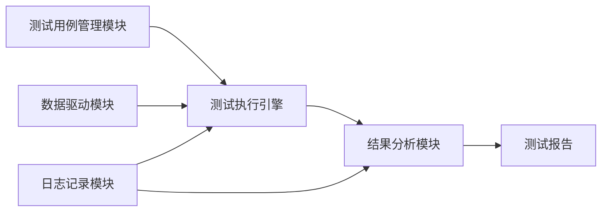

# 测试自动化：质量保证体系

> 关键词：测试自动化、质量保证体系、自动化测试框架、测试用例、持续集成

> 摘要：本文围绕测试自动化在质量保证体系中的应用展开深入探讨。首先介绍了测试自动化的背景，包括其目的、预期读者和文档结构等内容。接着阐述了测试自动化的核心概念、算法原理、数学模型等理论知识，结合Python代码进行详细说明。通过项目实战展示了测试自动化在实际开发中的具体实现和代码解读。同时分析了测试自动化的实际应用场景，推荐了相关的学习资源、开发工具框架和论文著作。最后总结了测试自动化的未来发展趋势与挑战，并提供常见问题解答和扩展阅读参考资料，旨在全面呈现测试自动化在质量保证体系中的重要性和应用方法，帮助读者构建完善的质量保证体系。

## 1. 背景介绍 
### 1.1 目的和范围
在当今快速发展的软件开发领域，软件的规模和复杂度不断增加，传统的手动测试方式已难以满足高效、高质量的测试需求。测试自动化作为一种提高测试效率和质量的有效手段，逐渐成为软件开发过程中不可或缺的一部分。本文章的目的在于深入探讨测试自动化在质量保证体系中的应用，详细介绍测试自动化的相关概念、技术和方法，帮助读者理解如何构建一个完善的测试自动化质量保证体系。

本文的范围涵盖了测试自动化的各个方面，包括核心概念、算法原理、数学模型、项目实战、实际应用场景等。通过全面的阐述，使读者能够系统地了解测试自动化，并将其应用到实际的软件开发项目中，提升软件的质量和开发效率。

### 1.2 预期读者
本文预期读者主要包括以下几类人群：
- **软件测试人员**：希望通过学习测试自动化技术，提高测试效率和质量，减少手动测试的工作量。
- **软件开发人员**：了解测试自动化的原理和方法，有助于在开发过程中更好地配合测试人员，提高软件的可测试性。
- **软件项目经理**：掌握测试自动化在质量保证体系中的应用，能够合理安排测试资源，确保项目按时交付，提高项目的成功率。
- **对测试自动化感兴趣的技术爱好者**：通过阅读本文，了解测试自动化的基本概念和技术，拓宽技术视野。

### 1.3 文档结构概述
本文将按照以下结构进行组织：
1. **背景介绍**：介绍测试自动化的目的、预期读者和文档结构等内容。
2. **核心概念与联系**：阐述测试自动化的核心概念、原理和架构，并通过文本示意图和Mermaid流程图进行说明。
3. **核心算法原理 & 具体操作步骤**：详细讲解测试自动化的核心算法原理，结合Python源代码进行阐述，并给出具体的操作步骤。
4. **数学模型和公式 & 详细讲解 & 举例说明**：介绍测试自动化的数学模型和公式，进行详细讲解并举例说明。
5. **项目实战：代码实际案例和详细解释说明**：通过实际项目案例，展示测试自动化的具体实现过程，包括开发环境搭建、源代码详细实现和代码解读。
6. **实际应用场景**：分析测试自动化在不同领域的实际应用场景。
7. **工具和资源推荐**：推荐相关的学习资源、开发工具框架和论文著作。
8. **总结：未来发展趋势与挑战**：总结测试自动化的未来发展趋势和面临的挑战。
9. **附录：常见问题与解答**：解答读者在学习和应用测试自动化过程中常见的问题。
10. **扩展阅读 & 参考资料**：提供相关的扩展阅读资料和参考文献。

### 1.4 术语表
#### 1.4.1 核心术语定义
- **测试自动化**：使用软件工具来执行测试用例，自动比较实际结果和预期结果，并生成测试报告的过程。
- **质量保证体系**：为确保软件产品或服务满足规定的质量要求而建立的一系列相互关联的活动、过程和资源的集合。
- **自动化测试框架**：一种支持自动化测试的软件平台，提供了测试用例管理、测试执行、结果分析等功能。
- **测试用例**：对软件系统进行测试的一组输入数据和预期输出结果，用于验证软件系统的功能和性能。
- **持续集成**：软件开发过程中，频繁地将开发人员的代码集成到共享的代码库中，并自动进行构建和测试的过程。

#### 1.4.2 相关概念解释
- **测试脚本**：实现测试用例的自动化代码，通常使用编程语言编写。
- **测试数据**：用于测试软件系统的输入数据，包括正常数据、边界数据和异常数据等。
- **测试环境**：运行软件系统进行测试的硬件、软件和网络环境。
- **测试覆盖率**：衡量测试用例对软件系统功能和代码的覆盖程度的指标。

#### 1.4.3 缩略词列表
- **CI**：Continuous Integration，持续集成
- **TDD**：Test Driven Development，测试驱动开发
- **BDD**：Behavior Driven Development，行为驱动开发
- **UI**：User Interface，用户界面
- **API**：Application Programming Interface，应用程序编程接口

## 2. 核心概念与联系 
### 2.1 测试自动化的核心概念
测试自动化是将手动测试过程转化为自动化执行的过程，通过使用自动化测试工具和脚本，实现测试用例的自动执行、结果的自动比较和测试报告的自动生成。测试自动化的核心目标是提高测试效率、减少人为错误、增加测试覆盖率和提高软件质量。

### 2.2 测试自动化与质量保证体系的联系
测试自动化是质量保证体系的重要组成部分，它可以帮助质量保证团队更高效地执行测试任务，确保软件产品满足规定的质量要求。通过自动化测试，可以在软件开发的早期发现缺陷，减少缺陷修复的成本和时间。同时，自动化测试可以提供客观、准确的测试结果，为质量决策提供依据。

### 2.3 测试自动化的架构
测试自动化的架构通常包括以下几个部分：
- **测试用例管理模块**：负责测试用例的创建、存储、管理和维护。
- **测试执行引擎**：负责执行测试用例，并将执行结果返回给测试用例管理模块。
- **结果分析模块**：对测试执行结果进行分析，生成测试报告。
- **数据驱动模块**：提供测试数据，支持测试用例的参数化执行。
- **日志记录模块**：记录测试执行过程中的日志信息，方便问题排查和分析。

### 2.4 文本示意图
```plaintext
+-------------------+
|  测试用例管理模块  |
+-------------------+
        |
        v
+-------------------+
|  测试执行引擎     |
+-------------------+
        |
        v
+-------------------+
|  结果分析模块     |
+-------------------+
        |
        v
+-------------------+
|  测试报告         |
+-------------------+
^                   |
|                   v
+-------------------+   +-------------------+
|  数据驱动模块     |   |  日志记录模块     |
+-------------------+   +-------------------+
```

### 2.5 Mermaid流程图


## 3. 核心算法原理 & 具体操作步骤 
### 3.1 核心算法原理
测试自动化的核心算法原理主要包括以下几个方面：
- **测试用例的选择和排序**：根据测试需求和优先级，选择合适的测试用例，并对其进行排序，以确保测试的全面性和高效性。
- **测试数据的生成和管理**：根据测试用例的要求，生成合适的测试数据，并对其进行管理，以确保测试数据的准确性和一致性。
- **测试脚本的执行和结果比较**：执行测试脚本，获取实际结果，并将其与预期结果进行比较，判断测试是否通过。
- **测试报告的生成和分析**：根据测试执行结果，生成测试报告，并对其进行分析，以发现软件系统中的缺陷和问题。

### 3.2 Python源代码实现
以下是一个简单的Python测试自动化示例，使用`unittest`框架来实现：

```python
import unittest

# 定义一个被测试的函数
def add(a, b):
    return a + b

# 定义测试类，继承自unittest.TestCase
class TestAdd(unittest.TestCase):
    # 定义测试方法，以test开头
    def test_add(self):
        # 调用被测试的函数
        result = add(2, 3)
        # 断言实际结果与预期结果是否相等
        self.assertEqual(result, 5)

if __name__ == '__main__':
    # 运行测试
    unittest.main()
```

### 3.3 具体操作步骤
1. **安装Python环境**：确保系统中已经安装了Python环境，可以从Python官方网站下载并安装。
2. **创建测试文件**：创建一个Python文件，例如`test_add.py`，并将上述代码复制到文件中。
3. **运行测试**：在命令行中运行`python test_add.py`，即可执行测试用例。
4. **查看测试结果**：如果测试通过，命令行将输出`OK`；如果测试失败，将输出详细的错误信息。

## 4. 数学模型和公式 & 详细讲解 & 举例说明 
### 4.1 测试覆盖率的数学模型
测试覆盖率是衡量测试用例对软件系统功能和代码的覆盖程度的指标，常用的测试覆盖率指标包括语句覆盖率、分支覆盖率、条件覆盖率等。

#### 4.1.1 语句覆盖率
语句覆盖率是指测试用例执行过程中，被执行的语句数与总语句数的比值，计算公式如下：
$$
\text{语句覆盖率} = \frac{\text{被执行的语句数}}{\text{总语句数}} \times 100\%
$$

#### 4.1.2 分支覆盖率
分支覆盖率是指测试用例执行过程中，被执行的分支数与总分支数的比值，计算公式如下：
$$
\text{分支覆盖率} = \frac{\text{被执行的分支数}}{\text{总分支数}} \times 100\%
$$

#### 4.1.3 条件覆盖率
条件覆盖率是指测试用例执行过程中，被执行的条件表达式的真值和假值的组合数与总组合数的比值，计算公式如下：
$$
\text{条件覆盖率} = \frac{\text{被执行的条件组合数}}{\text{总条件组合数}} \times 100\%
$$

### 4.2 详细讲解
测试覆盖率是评估测试用例质量的重要指标，它可以帮助我们发现测试用例中存在的漏洞和不足，从而提高测试的全面性和有效性。在实际应用中，我们通常希望测试覆盖率越高越好，但并不是所有的代码都需要被测试，我们需要根据软件系统的重要性和风险程度，合理设置测试覆盖率的目标。

### 4.3 举例说明
假设有以下Python代码：

```python
def is_even(n):
    if n % 2 == 0:
        return True
    else:
        return False
```

我们可以编写以下测试用例来测试这个函数：

```python
import unittest

class TestIsEven(unittest.TestCase):
    def test_is_even(self):
        result = is_even(2)
        self.assertEqual(result, True)

if __name__ == '__main__':
    unittest.main()
```

在这个例子中，我们只测试了`n`为偶数的情况，语句覆盖率为`50%`，分支覆盖率为`50%`。为了提高测试覆盖率，我们可以增加一个测试用例来测试`n`为奇数的情况：

```python
import unittest

class TestIsEven(unittest.TestCase):
    def test_is_even_even(self):
        result = is_even(2)
        self.assertEqual(result, True)

    def test_is_even_odd(self):
        result = is_even(3)
        self.assertEqual(result, False)

if __name__ == '__main__':
    unittest.main()
```

增加测试用例后，语句覆盖率和分支覆盖率都提高到了`100%`。

## 5. 项目实战：代码实际案例和详细解释说明 
### 5.1  开发环境搭建
#### 5.1.1 安装Python
从Python官方网站（https://www.python.org/downloads/）下载并安装Python 3.x版本。

#### 5.1.2 安装测试框架
在本项目中，我们使用`unittest`和`pytest`作为测试框架。可以使用以下命令来安装：
```sh
pip install pytest
```

#### 5.1.3 安装相关库
根据项目需求，可能需要安装其他相关库，例如`requests`用于测试API接口，`selenium`用于测试Web界面等。可以使用以下命令来安装：
```sh
pip install requests selenium
```

### 5.2  源代码详细实现和代码解读
#### 5.2.1 测试API接口
以下是一个使用`requests`库测试API接口的示例：

```python
import requests
import pytest

# 定义API接口的URL
API_URL = 'https://jsonplaceholder.typicode.com/posts/1'

# 定义测试函数
def test_api():
    # 发送GET请求
    response = requests.get(API_URL)
    # 断言响应状态码是否为200
    assert response.status_code == 200
    # 解析响应数据
    data = response.json()
    # 断言响应数据中是否包含'id'字段
    assert 'id' in data
```

#### 5.2.2 代码解读
- `import requests`：导入`requests`库，用于发送HTTP请求。
- `import pytest`：导入`pytest`库，用于编写和运行测试用例。
- `API_URL`：定义API接口的URL。
- `test_api`：定义测试函数，以`test_`开头。
- `response = requests.get(API_URL)`：发送GET请求，并将响应结果存储在`response`变量中。
- `assert response.status_code == 200`：断言响应状态码是否为200，表示请求成功。
- `data = response.json()`：解析响应数据为JSON格式。
- `assert 'id' in data`：断言响应数据中是否包含`id`字段。

#### 5.2.3 测试Web界面
以下是一个使用`selenium`库测试Web界面的示例：

```python
from selenium import webdriver
import pytest

# 定义Web页面的URL
WEB_URL = 'https://www.google.com'

# 定义测试函数
def test_web():
    # 创建Chrome浏览器驱动实例
    driver = webdriver.Chrome()
    try:
        # 打开Web页面
        driver.get(WEB_URL)
        # 查找搜索框元素
        search_box = driver.find_element_by_name('q')
        # 在搜索框中输入关键词
        search_box.send_keys('Python')
        # 提交搜索表单
        search_box.submit()
        # 断言页面标题是否包含关键词
        assert 'Python' in driver.title
    finally:
        # 关闭浏览器
        driver.quit()
```

#### 5.2.4 代码解读
- `from selenium import webdriver`：导入`selenium`库的`webdriver`模块，用于操作浏览器。
- `import pytest`：导入`pytest`库，用于编写和运行测试用例。
- `WEB_URL`：定义Web页面的URL。
- `test_web`：定义测试函数，以`test_`开头。
- `driver = webdriver.Chrome()`：创建Chrome浏览器驱动实例。
- `driver.get(WEB_URL)`：打开Web页面。
- `search_box = driver.find_element_by_name('q')`：查找搜索框元素。
- `search_box.send_keys('Python')`：在搜索框中输入关键词。
- `search_box.submit()`：提交搜索表单。
- `assert 'Python' in driver.title`：断言页面标题是否包含关键词。
- `driver.quit()`：关闭浏览器。

### 5.3  代码解读与分析
#### 5.3.1 测试框架的选择
在本项目中，我们选择了`unittest`和`pytest`作为测试框架。`unittest`是Python内置的测试框架，简单易用，适合初学者。`pytest`是一个功能强大的第三方测试框架，支持更多的测试功能和插件，适合复杂项目的测试。

#### 5.3.2 测试用例的设计
测试用例的设计应该遵循以下原则：
- **独立性**：每个测试用例应该独立运行，不依赖于其他测试用例的执行结果。
- **可重复性**：测试用例应该可以重复执行，并且每次执行的结果应该一致。
- **完整性**：测试用例应该覆盖软件系统的所有功能和边界条件。

#### 5.3.3 测试数据的管理
测试数据的管理是测试自动化的重要环节，它可以提高测试的效率和准确性。在本项目中，我们可以使用数据驱动的方式来管理测试数据，例如使用`pytest`的`parametrize`装饰器来实现参数化测试。

```python
import pytest

# 定义测试数据
test_data = [
    (2, 3, 5),
    (4, 6, 10),
    (1, 9, 10)
]

# 定义测试函数
@pytest.mark.parametrize('a, b, expected', test_data)
def test_add(a, b, expected):
    result = a + b
    assert result == expected
```

在这个例子中，我们使用`pytest`的`parametrize`装饰器来实现参数化测试，将多组测试数据传递给测试函数，提高了测试的效率和覆盖率。

## 6. 实际应用场景 
### 6.1 软件开发过程中的测试自动化
在软件开发过程中，测试自动化可以应用于以下几个阶段：
- **单元测试**：在代码编写完成后，使用自动化测试工具对代码单元进行测试，确保代码的正确性和稳定性。
- **集成测试**：在多个代码单元集成后，使用自动化测试工具对集成系统进行测试，确保各个模块之间的接口和交互正常。
- **系统测试**：在整个软件系统开发完成后，使用自动化测试工具对系统进行全面的测试，确保系统的功能和性能满足需求。
- **回归测试**：在软件系统进行修改或升级后，使用自动化测试工具对系统进行回归测试，确保修改或升级不会引入新的缺陷。

### 6.2 持续集成和持续交付中的测试自动化
在持续集成和持续交付（CI/CD）流程中，测试自动化是不可或缺的环节。通过自动化测试，可以在代码提交到代码库后立即进行构建和测试，及时发现代码中的缺陷，确保代码的质量。同时，自动化测试可以帮助团队实现快速迭代和持续交付，提高软件开发的效率和质量。

### 6.3 移动应用开发中的测试自动化
在移动应用开发中，测试自动化可以帮助开发人员快速、高效地对移动应用进行测试，确保应用的兼容性、稳定性和性能。常见的移动应用测试自动化工具包括Appium、Robotium等，它们可以模拟用户在移动设备上的操作，对移动应用进行自动化测试。

### 6.4 游戏开发中的测试自动化
在游戏开发中，测试自动化可以帮助开发人员对游戏的功能、性能、兼容性等方面进行测试，确保游戏的质量和用户体验。常见的游戏测试自动化工具包括Unity Test Framework、Unreal Automation Tool等，它们可以对游戏的脚本、关卡、特效等进行自动化测试。

## 7. 工具和资源推荐
### 7.1 学习资源推荐
#### 7.1.1 书籍推荐
- 《Python自动化测试实战》：本书详细介绍了使用Python进行自动化测试的方法和技巧，包括测试框架、测试用例设计、测试数据管理等内容。
- 《自动化测试最佳实践》：本书介绍了自动化测试的最佳实践和经验，包括测试策略、测试工具选择、测试环境搭建等内容。
- 《软件测试的艺术》：本书是软件测试领域的经典著作，介绍了软件测试的基本概念、方法和技术，对于理解测试自动化的原理和方法有很大的帮助。

#### 7.1.2 在线课程
- Coursera上的“Software Testing and Automation Specialization”：该课程由知名大学教授授课，系统地介绍了软件测试和自动化的相关知识和技能。
- Udemy上的“Automated Software Testing with Python”：该课程通过实际项目案例，详细介绍了使用Python进行自动化测试的方法和技巧。
- 网易云课堂上的“软件测试自动化实战”：该课程由国内知名测试专家授课，结合实际项目案例，介绍了软件测试自动化的实践经验和方法。

#### 7.1.3 技术博客和网站
- 开源中国（https://www.oschina.net/）：提供了丰富的开源项目和技术文章，包括测试自动化相关的内容。
- 博客园（https://www.cnblogs.com/）：有很多测试自动化领域的技术博客，分享了测试自动化的实践经验和技术心得。
- 思否（https://segmentfault.com/）：提供了很多测试自动化相关的技术文章和问答，帮助读者解决测试自动化过程中遇到的问题。

### 7.2 开发工具框架推荐
#### 7.2.1 IDE和编辑器
- PyCharm：一款功能强大的Python集成开发环境，支持自动化测试框架的开发和调试。
- Visual Studio Code：一款轻量级的代码编辑器，支持多种编程语言和自动化测试框架的开发。
- Sublime Text：一款简洁高效的代码编辑器，支持多种编程语言和自动化测试框架的开发。

#### 7.2.2 调试和性能分析工具
- pytest：一款功能强大的Python测试框架，支持调试和性能分析功能。
- unittest：Python内置的测试框架，支持调试和性能分析功能。
- Selenium IDE：一款Web自动化测试工具，支持调试和性能分析功能。

#### 7.2.3 相关框架和库
- requests：一款Python HTTP库，用于发送HTTP请求，支持自动化测试API接口。
- selenium：一款Web自动化测试框架，用于模拟用户在Web页面上的操作，支持自动化测试Web界面。
- Appium：一款移动应用自动化测试框架，用于模拟用户在移动设备上的操作，支持自动化测试移动应用。

### 7.3 相关论文著作推荐
#### 7.3.1 经典论文
- “Automated Software Testing: A Roadmap”：该论文介绍了自动化测试的发展历程、现状和未来趋势，对于理解自动化测试的本质和发展方向有很大的帮助。
- “A Survey on Software Test Automation”：该论文对软件测试自动化的相关技术和方法进行了全面的综述，为研究和应用软件测试自动化提供了参考。
- “Model-Based Testing of Reactive Systems: A Survey”：该论文对基于模型的测试方法进行了全面的综述，为研究和应用基于模型的测试方法提供了参考。

#### 7.3.2 最新研究成果
- 每年的IEEE International Conference on Software Testing, Verification and Validation（ICST）会议上都会发表很多关于测试自动化的最新研究成果，可以关注该会议的论文集。
- ACM Transactions on Software Engineering and Methodology（TOSEM）期刊上也会发表很多关于测试自动化的高质量研究论文，可以关注该期刊的最新文章。

#### 7.3.3 应用案例分析
- 很多知名公司都会在其技术博客上分享测试自动化的应用案例和实践经验，例如Google、Microsoft、Amazon等公司的技术博客，可以关注这些博客上的相关文章。
- 一些开源项目的文档和代码中也会包含测试自动化的应用案例，可以参考这些开源项目的相关内容。

## 8. 总结：未来发展趋势与挑战
### 8.1 未来发展趋势
#### 8.1.1 智能化测试
随着人工智能和机器学习技术的发展，测试自动化将越来越智能化。智能化测试可以自动生成测试用例、自动分析测试结果、自动定位缺陷等，提高测试的效率和准确性。

#### 8.1.2 持续测试
持续测试将成为未来测试自动化的重要发展方向。持续测试可以在软件开发的整个生命周期中持续进行测试，及时发现和解决问题，确保软件的质量和稳定性。

#### 8.1.3 跨平台和跨设备测试
随着移动应用、Web应用和物联网应用的不断发展，跨平台和跨设备测试将变得越来越重要。测试自动化工具需要支持多种平台和设备，确保软件在不同环境下的兼容性和稳定性。

#### 8.1.4 安全测试自动化
随着网络安全问题的日益突出，安全测试自动化将成为未来测试自动化的重要组成部分。安全测试自动化可以自动检测软件系统中的安全漏洞，及时发现和防范安全风险。

### 8.2 挑战
#### 8.2.1 测试数据的管理和维护
测试数据的管理和维护是测试自动化中的一个重要挑战。随着软件系统的不断发展和变化，测试数据也需要不断更新和维护，以确保测试的准确性和有效性。

#### 8.2.2 测试环境的复杂性
测试环境的复杂性是测试自动化中的另一个挑战。不同的软件系统需要不同的测试环境，测试环境的搭建和配置需要耗费大量的时间和精力。

#### 8.2.3 测试工具的选择和集成
市场上有很多测试自动化工具，选择合适的测试工具并将其集成到软件开发流程中是一个挑战。不同的测试工具具有不同的特点和适用场景，需要根据项目的需求和特点进行选择。

#### 8.2.4 人员技能的提升
测试自动化需要测试人员具备一定的编程和技术能力，因此人员技能的提升是一个挑战。测试人员需要不断学习和掌握新的技术和方法，以适应测试自动化的发展需求。

## 9. 附录：常见问题与解答
### 9.1 测试自动化是否可以完全替代手动测试？
测试自动化不能完全替代手动测试。虽然测试自动化可以提高测试效率和准确性，但在某些情况下，手动测试仍然是必要的。例如，在测试用户体验、界面设计等方面，手动测试可以更好地发现问题。

### 9.2 如何选择合适的测试自动化工具？
选择合适的测试自动化工具需要考虑以下几个因素：
- **项目需求**：根据项目的需求和特点，选择适合的测试自动化工具。
- **技术栈**：考虑项目使用的技术栈，选择与之兼容的测试自动化工具。
- **团队技能**：考虑团队成员的技能水平，选择易于学习和使用的测试自动化工具。
- **成本**：考虑测试自动化工具的成本，包括购买成本、使用成本和维护成本等。

### 9.3 如何提高测试自动化的覆盖率？
提高测试自动化的覆盖率可以从以下几个方面入手：
- **完善测试用例**：确保测试用例覆盖软件系统的所有功能和边界条件。
- **使用数据驱动测试**：使用数据驱动测试的方法，生成多组测试数据，提高测试的覆盖率。
- **结合多种测试技术**：结合单元测试、集成测试、系统测试等多种测试技术，全面覆盖软件系统。
- **定期更新测试用例**：随着软件系统的不断发展和变化，定期更新测试用例，确保测试用例的有效性。

### 9.4 测试自动化过程中出现问题如何解决？
测试自动化过程中出现问题可以按照以下步骤解决：
- **查看日志信息**：查看测试执行过程中的日志信息，了解问题的具体情况。
- **调试测试脚本**：使用调试工具对测试脚本进行调试，找出问题所在。
- **检查测试环境**：检查测试环境是否正常，确保测试环境的稳定性。
- **参考文档和社区**：参考测试自动化工具的文档和社区，查找类似问题的解决方案。
- **寻求帮助**：如果以上方法都无法解决问题，可以寻求专业人士的帮助。

## 10. 扩展阅读 & 参考资料
### 10.1 扩展阅读
- 《软件测试的艺术》（第3版），作者：Glenford J. Myers、Tom Badgett、Corey Sandler
- 《Python测试驱动开发》，作者：Harry Percival
- 《持续交付：发布可靠软件的系统方法》，作者：Jez Humble、David Farley

### 10.2 参考资料
- Python官方文档：https://docs.python.org/
- pytest官方文档：https://docs.pytest.org/
- selenium官方文档：https://www.selenium.dev/documentation/
- Appium官方文档：http://appium.io/docs/en/about-appium/intro/