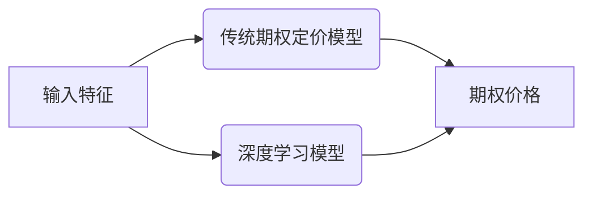

# 深度学习在期权定价模型中的创新

> 关键词：深度学习、期权定价模型、金融科技、神经网络、创新应用

> 摘要：本文聚焦于深度学习在期权定价模型中的创新应用。随着金融市场的不断发展和复杂化，传统期权定价模型面临诸多挑战。深度学习凭借其强大的非线性拟合能力和数据处理能力，为期权定价带来了新的思路和方法。文章首先介绍了研究的背景和相关概念，接着深入探讨了深度学习核心算法原理及具体操作步骤，通过数学模型和公式进行详细讲解并举例说明。然后给出项目实战案例，包括开发环境搭建、源代码实现与解读。随后阐述了深度学习在期权定价中的实际应用场景，推荐了相关的学习资源、开发工具框架和论文著作。最后总结了未来发展趋势与挑战，并提供常见问题解答和扩展阅读参考资料，旨在全面展现深度学习在期权定价模型中创新应用的全貌。

## 1. 背景介绍 
### 1.1 目的和范围
期权作为金融市场中重要的衍生工具，其定价的准确性对于投资者决策、风险管理以及市场的稳定运行都具有至关重要的意义。传统的期权定价模型，如布莱克 - 斯科尔斯（Black - Scholes）模型，虽然在理论和实践中都有广泛应用，但由于其基于一系列严格的假设条件，在实际市场环境中存在一定的局限性。随着金融市场的不断发展，市场数据的复杂性和多样性不断增加，传统模型难以准确捕捉市场的动态变化。

本研究的目的在于探索深度学习在期权定价模型中的创新应用，以提高期权定价的准确性和灵活性。研究范围涵盖了常见的深度学习算法，如神经网络、卷积神经网络（CNN）、循环神经网络（RNN）及其变体等在期权定价中的应用，同时考虑不同市场环境和期权类型下的定价问题。

### 1.2 预期读者
本文预期读者包括金融领域的专业人士，如金融分析师、投资经理、风险管理专家等，他们可以通过本文了解深度学习在期权定价中的应用，为实际工作中的决策提供参考。同时，也适合计算机科学和人工智能领域的研究人员和开发者，特别是对金融科技交叉领域感兴趣的人群，他们可以从中获取深度学习在金融应用中的具体案例和技术细节。此外，高校相关专业的师生也可以将本文作为学习和研究的参考资料。

### 1.3 文档结构概述
本文将按照以下结构进行阐述：首先介绍相关背景和核心概念，包括期权定价模型和深度学习的基本原理及联系；接着详细讲解深度学习在期权定价中的核心算法原理和具体操作步骤，并结合数学模型和公式进行说明；然后通过项目实战，展示深度学习在期权定价中的代码实现和详细解读；之后介绍深度学习在期权定价中的实际应用场景；再推荐相关的学习资源、开发工具框架和论文著作；最后总结未来发展趋势与挑战，提供常见问题解答和扩展阅读参考资料。

### 1.4 术语表
#### 1.4.1 核心术语定义
- **期权**：一种金融衍生品，赋予持有者在特定日期或之前以特定价格买入或卖出标的资产的权利。
- **期权定价模型**：用于计算期权理论价值的数学模型，如布莱克 - 斯科尔斯模型、二叉树模型等。
- **深度学习**：机器学习的一个分支，通过构建多层神经网络来学习数据中的复杂模式和特征。
- **神经网络**：由大量神经元组成的计算模型，用于模拟人脑的信息处理过程，可用于分类、回归等任务。
- **隐含波动率**：通过期权市场价格反推得到的波动率，反映了市场对未来标的资产价格波动的预期。

#### 1.4.2 相关概念解释
- **风险中性定价原理**：在风险中性世界中，所有资产的预期收益率都等于无风险利率，期权的价值可以通过对其到期时的期望收益进行贴现得到。
- **蒙特卡罗模拟**：一种通过随机抽样来模拟复杂系统行为的方法，在期权定价中可用于模拟标的资产价格的随机路径。
- **过拟合**：模型在训练数据上表现良好，但在测试数据上表现不佳的现象，通常是由于模型过于复杂，学习了训练数据中的噪声。

#### 1.4.3 缩略词列表
- **BSM**：Black - Scholes - Merton 模型，即布莱克 - 斯科尔斯 - 默顿模型。
- **CNN**：Convolutional Neural Network，卷积神经网络。
- **RNN**：Recurrent Neural Network，循环神经网络。
- **LSTM**：Long Short - Term Memory，长短期记忆网络。
- **GRU**：Gated Recurrent Unit，门控循环单元。

## 2. 核心概念与联系 

### 2.1 期权定价模型原理
传统的期权定价模型中，布莱克 - 斯科尔斯模型是最为经典的模型之一。该模型基于以下假设：
1. 标的资产价格遵循几何布朗运动，即 $dS = \mu Sdt+\sigma SdW$，其中 $S$ 是标的资产价格，$\mu$ 是预期收益率，$\sigma$ 是波动率，$W$ 是维纳过程。
2. 市场无摩擦，即不存在交易成本和税收。
3. 无风险利率 $r$ 是常数。
4. 标的资产可以连续交易。

在这些假设下，欧式期权的定价公式为：

对于欧式看涨期权：
$$C = S_0N(d_1)-Ke^{-rT}N(d_2)$$

对于欧式看跌期权：
$$P = Ke^{-rT}N(-d_2)-S_0N(-d_1)$$

其中：
$$d_1=\frac{\ln(\frac{S_0}{K})+(r + \frac{\sigma^2}{2})T}{\sigma\sqrt{T}}$$
$$d_2 = d_1-\sigma\sqrt{T}$$

$S_0$ 是标的资产的当前价格，$K$ 是期权的执行价格，$T$ 是期权的到期时间，$N(\cdot)$ 是标准正态分布的累积分布函数。

二叉树模型则是一种离散时间的期权定价模型，它将期权的有效期划分为多个时间间隔，在每个时间间隔内，标的资产价格有两种可能的变化：上升或下降。通过从期权到期日开始逐步向前推导，可以得到期权的当前价值。

### 2.2 深度学习原理
深度学习的核心是神经网络，神经网络由输入层、隐藏层和输出层组成。输入层接收原始数据，隐藏层对数据进行非线性变换和特征提取，输出层给出最终的预测结果。

以多层感知机（MLP）为例，其神经元的计算过程可以表示为：

对于第 $l$ 层的第 $j$ 个神经元，其输入为：
$$z_j^l=\sum_{i = 0}^{n_{l - 1}}w_{ji}^la_i^{l - 1}+b_j^l$$

其中 $w_{ji}^l$ 是第 $l - 1$ 层的第 $i$ 个神经元到第 $l$ 层的第 $j$ 个神经元的权重，$a_i^{l - 1}$ 是第 $l - 1$ 层的第 $i$ 个神经元的输出，$b_j^l$ 是第 $l$ 层的第 $j$ 个神经元的偏置。

神经元的输出为：
$$a_j^l = f(z_j^l)$$

其中 $f(\cdot)$ 是激活函数，常见的激活函数有 sigmoid 函数、ReLU 函数等。

### 2.3 深度学习与期权定价模型的联系
传统的期权定价模型基于严格的假设条件，在实际市场中难以准确反映市场的复杂性和动态变化。深度学习具有强大的非线性拟合能力，可以直接从市场数据中学习到期权价格与各种影响因素之间的复杂关系，而不需要依赖于严格的假设。

例如，深度学习模型可以处理包含隐含波动率、历史价格、宏观经济指标等多源异构数据，通过对这些数据的学习和分析，提高期权定价的准确性。同时，深度学习模型可以自适应地调整模型参数，以适应不同市场环境下的定价需求。

### 2.4 文本示意图和 Mermaid 流程图
#### 文本示意图
期权定价问题可以看作是一个从输入特征（如标的资产价格、执行价格、到期时间、波动率等）到期权价格的映射过程。传统期权定价模型通过数学公式来实现这个映射，而深度学习模型则通过神经网络的学习过程来实现。

输入特征 -> 传统期权定价模型（数学公式） -> 期权价格
输入特征 -> 深度学习模型（神经网络） -> 期权价格

#### Mermaid 流程图


## 3. 核心算法原理 & 具体操作步骤 

### 3.1 多层感知机（MLP）在期权定价中的应用
#### 3.1.1 算法原理
多层感知机是一种前馈神经网络，由多个全连接层组成。在期权定价中，我们可以将期权的相关特征（如标的资产价格、执行价格、到期时间、波动率等）作为输入，期权的价格作为输出。

MLP 的训练过程是一个优化问题，目标是最小化预测值与真实值之间的误差。常用的损失函数是均方误差（MSE）：
$$L=\frac{1}{N}\sum_{i = 1}^{N}(y_i-\hat{y}_i)^2$$

其中 $N$ 是样本数量，$y_i$ 是真实的期权价格，$\hat{y}_i$ 是模型的预测价格。

为了最小化损失函数，我们可以使用梯度下降算法来更新模型的权重和偏置。梯度下降算法的更新公式为：
$$w_{ji}^l\leftarrow w_{ji}^l-\alpha\frac{\partial L}{\partial w_{ji}^l}$$
$$b_j^l\leftarrow b_j^l-\alpha\frac{\partial L}{\partial b_j^l}$$

其中 $\alpha$ 是学习率，控制每次更新的步长。

#### 3.1.2 具体操作步骤
1. **数据准备**：收集期权的相关数据，包括标的资产价格、执行价格、到期时间、波动率、期权价格等，并进行数据清洗和预处理，如归一化处理。
2. **模型构建**：使用 Python 的深度学习框架（如 TensorFlow 或 PyTorch）构建 MLP 模型，确定模型的层数、神经元数量和激活函数。
3. **模型训练**：将预处理后的数据分为训练集和测试集，使用训练集对模型进行训练，通过迭代更新模型的权重和偏置，最小化损失函数。
4. **模型评估**：使用测试集对训练好的模型进行评估，计算预测误差（如均方误差、平均绝对误差等）。
5. **模型应用**：使用训练好的模型对新的期权数据进行定价预测。

#### 3.1.3 Python 源代码实现
```python
import numpy as np
import tensorflow as tf
from tensorflow.keras.models import Sequential
from tensorflow.keras.layers import Dense
from sklearn.model_selection import train_test_split
from sklearn.preprocessing import StandardScaler

# 生成模拟数据
np.random.seed(42)
n_samples = 1000
# 模拟期权特征：标的资产价格、执行价格、到期时间、波动率
X = np.random.rand(n_samples, 4)
# 模拟期权价格（这里简单生成，实际需要真实数据）
y = np.random.rand(n_samples)

# 数据预处理
scaler = StandardScaler()
X = scaler.fit_transform(X)

# 划分训练集和测试集
X_train, X_test, y_train, y_test = train_test_split(X, y, test_size=0.2, random_state=42)

# 构建 MLP 模型
model = Sequential([
    Dense(64, activation='relu', input_shape=(4,)),
    Dense(32, activation='relu'),
    Dense(1)
])

# 编译模型
model.compile(optimizer='adam', loss='mse')

# 训练模型
model.fit(X_train, y_train, epochs=100, batch_size=32, validation_data=(X_test, y_test))

# 评估模型
test_loss = model.evaluate(X_test, y_test)
print(f"Test loss: {test_loss}")

# 预测新数据
new_data = np.random.rand(1, 4)
new_data = scaler.transform(new_data)
prediction = model.predict(new_data)
print(f"Predicted option price: {prediction[0][0]}")
```

### 3.2 卷积神经网络（CNN）在期权定价中的应用
#### 3.2.1 算法原理
卷积神经网络主要用于处理具有网格结构的数据，如图像数据。在期权定价中，我们可以将期权的历史价格序列看作是一维的时间序列数据，使用 CNN 来提取时间序列中的特征。

CNN 的核心操作是卷积层，卷积层通过卷积核在输入数据上滑动，进行卷积运算，提取局部特征。卷积运算的公式为：
$$y_{ij}=\sum_{m = 0}^{M - 1}\sum_{n = 0}^{N - 1}x_{i + m,j + n}w_{mn}+b$$

其中 $x$ 是输入数据，$w$ 是卷积核，$b$ 是偏置，$y$ 是卷积输出。

在卷积层之后，通常会使用池化层来降低数据的维度，减少计算量。常用的池化操作有最大池化和平均池化。

#### 3.2.2 具体操作步骤
1. **数据准备**：收集期权的历史价格序列数据，并将其转换为适合 CNN 输入的格式。
2. **模型构建**：使用深度学习框架构建 CNN 模型，确定卷积层、池化层和全连接层的参数。
3. **模型训练**：将数据分为训练集和测试集，使用训练集对模型进行训练，通过迭代更新模型的权重和偏置，最小化损失函数。
4. **模型评估**：使用测试集对训练好的模型进行评估，计算预测误差。
5. **模型应用**：使用训练好的模型对新的期权数据进行定价预测。

#### 3.2.3 Python 源代码实现
```python
import numpy as np
import tensorflow as tf
from tensorflow.keras.models import Sequential
from tensorflow.keras.layers import Conv1D, MaxPooling1D, Flatten, Dense
from sklearn.model_selection import train_test_split
from sklearn.preprocessing import StandardScaler

# 生成模拟数据
np.random.seed(42)
n_samples = 1000
sequence_length = 10
# 模拟期权历史价格序列
X = np.random.rand(n_samples, sequence_length, 1)
# 模拟期权价格
y = np.random.rand(n_samples)

# 数据预处理
scaler = StandardScaler()
for i in range(n_samples):
    X[i, :, 0] = scaler.fit_transform(X[i, :, 0].reshape(-1, 1)).flatten()

# 划分训练集和测试集
X_train, X_test, y_train, y_test = train_test_split(X, y, test_size=0.2, random_state=42)

# 构建 CNN 模型
model = Sequential([
    Conv1D(32, kernel_size=3, activation='relu', input_shape=(sequence_length, 1)),
    MaxPooling1D(pool_size=2),
    Flatten(),
    Dense(64, activation='relu'),
    Dense(1)
])

# 编译模型
model.compile(optimizer='adam', loss='mse')

# 训练模型
model.fit(X_train, y_train, epochs=100, batch_size=32, validation_data=(X_test, y_test))

# 评估模型
test_loss = model.evaluate(X_test, y_test)
print(f"Test loss: {test_loss}")

# 预测新数据
new_data = np.random.rand(1, sequence_length, 1)
for i in range(1):
    new_data[i, :, 0] = scaler.fit_transform(new_data[i, :, 0].reshape(-1, 1)).flatten()
prediction = model.predict(new_data)
print(f"Predicted option price: {prediction[0][0]}")
```

### 3.3 循环神经网络（RNN）及其变体在期权定价中的应用
#### 3.3.1 算法原理
循环神经网络是一种专门处理序列数据的神经网络，它通过引入循环结构，能够捕捉序列数据中的时间依赖关系。

传统的 RNN 存在梯度消失和梯度爆炸的问题，为了解决这些问题，出现了长短期记忆网络（LSTM）和门控循环单元（GRU）等变体。

LSTM 引入了输入门、遗忘门和输出门，通过门控机制来控制信息的流动，从而更好地捕捉序列数据中的长期依赖关系。

GRU 是 LSTM 的简化版本，它将输入门和遗忘门合并为一个更新门，减少了模型的参数数量，提高了计算效率。

#### 3.3.2 具体操作步骤
1. **数据准备**：收集期权的历史价格序列数据，并将其转换为适合 RNN 输入的格式。
2. **模型构建**：使用深度学习框架构建 RNN、LSTM 或 GRU 模型，确定模型的参数。
3. **模型训练**：将数据分为训练集和测试集，使用训练集对模型进行训练，通过迭代更新模型的权重和偏置，最小化损失函数。
4. **模型评估**：使用测试集对训练好的模型进行评估，计算预测误差。
5. **模型应用**：使用训练好的模型对新的期权数据进行定价预测。

#### 3.3.3 Python 源代码实现（以 LSTM 为例）
```python
import numpy as np
import tensorflow as tf
from tensorflow.keras.models import Sequential
from tensorflow.keras.layers import LSTM, Dense
from sklearn.model_selection import train_test_split
from sklearn.preprocessing import StandardScaler

# 生成模拟数据
np.random.seed(42)
n_samples = 1000
sequence_length = 10
# 模拟期权历史价格序列
X = np.random.rand(n_samples, sequence_length, 1)
# 模拟期权价格
y = np.random.rand(n_samples)

# 数据预处理
scaler = StandardScaler()
for i in range(n_samples):
    X[i, :, 0] = scaler.fit_transform(X[i, :, 0].reshape(-1, 1)).flatten()

# 划分训练集和测试集
X_train, X_test, y_train, y_test = train_test_split(X, y, test_size=0.2, random_state=42)

# 构建 LSTM 模型
model = Sequential([
    LSTM(64, input_shape=(sequence_length, 1)),
    Dense(1)
])

# 编译模型
model.compile(optimizer='adam', loss='mse')

# 训练模型
model.fit(X_train, y_train, epochs=100, batch_size=32, validation_data=(X_test, y_test))

# 评估模型
test_loss = model.evaluate(X_test, y_test)
print(f"Test loss: {test_loss}")

# 预测新数据
new_data = np.random.rand(1, sequence_length, 1)
for i in range(1):
    new_data[i, :, 0] = scaler.fit_transform(new_data[i, :, 0].reshape(-1, 1)).flatten()
prediction = model.predict(new_data)
print(f"Predicted option price: {prediction[0][0]}")
```

## 4. 数学模型和公式 & 详细讲解 & 举例说明 

### 4.1 布莱克 - 斯科尔斯模型的数学推导
布莱克 - 斯科尔斯模型的推导基于以下几个关键步骤：

1. **标的资产价格的几何布朗运动**：
假设标的资产价格 $S$ 遵循几何布朗运动：
$$dS = \mu Sdt+\sigma SdW$$

其中 $\mu$ 是预期收益率，$\sigma$ 是波动率，$W$ 是维纳过程。

2. **构造投资组合**：
构造一个包含期权和标的资产的投资组合 $\Pi$，使得投资组合在短时间内是无风险的。设期权价格为 $C(S,t)$，则投资组合为：
$$\Pi = C(S,t)-\Delta S$$

其中 $\Delta=\frac{\partial C}{\partial S}$ 是期权的 Delta 值。

3. **应用伊藤引理**：
对期权价格 $C(S,t)$ 应用伊藤引理：
$$dC = (\frac{\partial C}{\partial t}+\mu S\frac{\partial C}{\partial S}+\frac{1}{2}\sigma^2S^2\frac{\partial^2 C}{\partial S^2})dt+\sigma S\frac{\partial C}{\partial S}dW$$

4. **投资组合的变化**：
投资组合 $\Pi$ 的变化为：
$$d\Pi = dC-\Delta dS$$

将 $dC$ 和 $dS$ 代入上式，得到：
$$d\Pi = (\frac{\partial C}{\partial t}+\frac{1}{2}\sigma^2S^2\frac{\partial^2 C}{\partial S^2})dt$$

由于投资组合在短时间内是无风险的，其收益率应该等于无风险利率 $r$，即：
$$d\Pi = r\Pi dt$$

将 $\Pi = C(S,t)-\Delta S$ 代入上式，得到布莱克 - 斯科尔斯偏微分方程：
$$\frac{\partial C}{\partial t}+rS\frac{\partial C}{\partial S}+\frac{1}{2}\sigma^2S^2\frac{\partial^2 C}{\partial S^2}-rC = 0$$

5. **求解偏微分方程**：
在欧式期权的边界条件下，求解上述偏微分方程，得到欧式看涨期权和看跌期权的定价公式：

对于欧式看涨期权：
$$C = S_0N(d_1)-Ke^{-rT}N(d_2)$$

对于欧式看跌期权：
$$P = Ke^{-rT}N(-d_2)-S_0N(-d_1)$$

其中：
$$d_1=\frac{\ln(\frac{S_0}{K})+(r + \frac{\sigma^2}{2})T}{\sigma\sqrt{T}}$$
$$d_2 = d_1-\sigma\sqrt{T}$$

### 4.2 深度学习模型的损失函数和优化算法
#### 4.2.1 损失函数
常见的损失函数有均方误差（MSE）、平均绝对误差（MAE）和交叉熵损失等。在期权定价中，由于我们的目标是预测期权的价格，通常使用均方误差作为损失函数：
$$L=\frac{1}{N}\sum_{i = 1}^{N}(y_i-\hat{y}_i)^2$$

其中 $N$ 是样本数量，$y_i$ 是真实的期权价格，$\hat{y}_i$ 是模型的预测价格。

#### 4.2.2 优化算法
常见的优化算法有随机梯度下降（SGD）、Adagrad、Adadelta、Adam 等。以随机梯度下降为例，其更新公式为：
$$w\leftarrow w-\alpha\frac{\partial L}{\partial w}$$
$$b\leftarrow b-\alpha\frac{\partial L}{\partial b}$$

其中 $w$ 和 $b$ 是模型的权重和偏置，$\alpha$ 是学习率。

### 4.3 举例说明
假设我们有一个欧式看涨期权，标的资产当前价格 $S_0 = 100$，执行价格 $K = 105$，无风险利率 $r = 0.05$，波动率 $\sigma = 0.2$，到期时间 $T = 1$ 年。

首先计算 $d_1$ 和 $d_2$：
$$d_1=\frac{\ln(\frac{100}{105})+(0.05+\frac{0.2^2}{2})\times1}{0.2\sqrt{1}}\approx -0.02$$
$$d_2 = d_1 - 0.2\sqrt{1}\approx -0.22$$

然后计算 $N(d_1)$ 和 $N(d_2)$：
$N(d_1)\approx 0.4920$，$N(d_2)\approx 0.4129$

最后计算欧式看涨期权的价格：
$$C = 100\times0.4920 - 105\times e^{-0.05\times1}\times0.4129\approx 10.42$$

现在我们使用深度学习模型进行期权定价预测。假设我们已经训练好一个 MLP 模型，输入特征为 $[S_0, K, r, \sigma, T]$，经过模型预测得到期权价格为 $10.50$。

我们可以计算预测误差：
$$MSE=(10.42 - 10.50)^2 = 0.0064$$

## 5. 项目实战：代码实际案例和详细解释说明 

### 5.1  开发环境搭建
#### 5.1.1 操作系统
本项目可以在 Windows、Linux 或 macOS 等主流操作系统上进行开发。建议使用 Linux 系统，如 Ubuntu，因为 Linux 系统对深度学习开发的支持较好，并且有丰富的开源软件资源。

#### 5.1.2 Python 环境
安装 Python 3.7 或以上版本。可以使用 Anaconda 来管理 Python 环境，Anaconda 是一个流行的 Python 发行版，包含了许多科学计算和深度学习相关的库。

安装 Anaconda 后，可以创建一个新的虚拟环境：
```bash
conda create -n option_pricing python=3.8
conda activate option_pricing
```

#### 5.1.3 深度学习框架
安装 TensorFlow 或 PyTorch 深度学习框架。以 TensorFlow 为例，可以使用以下命令安装：
```bash
pip install tensorflow
```

#### 5.1.4 其他依赖库
安装其他必要的依赖库，如 NumPy、Pandas、Scikit - learn 等：
```bash
pip install numpy pandas scikit-learn
```

### 5.2  源代码详细实现和代码解读
#### 5.2.1 数据准备
```python
import numpy as np
import pandas as pd
from sklearn.preprocessing import StandardScaler
from sklearn.model_selection import train_test_split

# 读取数据
data = pd.read_csv('option_data.csv')

# 提取特征和标签
X = data[['S', 'K', 'r', 'sigma', 'T']].values
y = data['option_price'].values

# 数据预处理
scaler = StandardScaler()
X = scaler.fit_transform(X)

# 划分训练集和测试集
X_train, X_test, y_train, y_test = train_test_split(X, y, test_size=0.2, random_state=42)
```
**代码解读**：
- 首先使用 Pandas 库读取包含期权数据的 CSV 文件。
- 然后提取特征（标的资产价格 $S$、执行价格 $K$、无风险利率 $r$、波动率 $\sigma$、到期时间 $T$）和标签（期权价格）。
- 接着使用 StandardScaler 对特征数据进行归一化处理，使得数据具有零均值和单位方差。
- 最后使用 train_test_split 函数将数据划分为训练集和测试集，测试集占总数据的 20%。

#### 5.2.2 模型构建
```python
import tensorflow as tf
from tensorflow.keras.models import Sequential
from tensorflow.keras.layers import Dense

# 构建 MLP 模型
model = Sequential([
    Dense(64, activation='relu', input_shape=(5,)),
    Dense(32, activation='relu'),
    Dense(1)
])

# 编译模型
model.compile(optimizer='adam', loss='mse')
```
**代码解读**：
- 使用 TensorFlow 的 Keras API 构建一个简单的 MLP 模型。模型包含一个输入层、两个隐藏层和一个输出层。
- 输入层有 5 个神经元，对应 5 个特征。
- 隐藏层使用 ReLU 激活函数，增加模型的非线性能力。
- 输出层有 1 个神经元，输出期权价格的预测值。
- 使用 Adam 优化器和均方误差损失函数编译模型。

#### 5.2.3 模型训练
```python
# 训练模型
model.fit(X_train, y_train, epochs=100, batch_size=32, validation_data=(X_test, y_test))
```
**代码解读**：
- 使用 fit 方法对模型进行训练，训练 100 个 epoch，每个 batch 包含 32 个样本。
- 同时使用测试集作为验证数据，在每个 epoch 结束时计算验证集的损失值，以监控模型的泛化能力。

#### 5.2.4 模型评估
```python
# 评估模型
test_loss = model.evaluate(X_test, y_test)
print(f"Test loss: {test_loss}")
```
**代码解读**：
- 使用 evaluate 方法对训练好的模型进行评估，计算测试集的损失值。

#### 5.2.5 模型预测
```python
# 预测新数据
new_data = np.array([[100, 105, 0.05, 0.2, 1]])
new_data = scaler.transform(new_data)
prediction = model.predict(new_data)
print(f"Predicted option price: {prediction[0][0]}")
```
**代码解读**：
- 构造一个新的期权数据样本，进行归一化处理后，使用训练好的模型进行预测，输出预测的期权价格。

### 5.3  代码解读与分析
#### 5.3.1 数据预处理的重要性
数据预处理是深度学习中非常重要的一步。通过归一化处理，可以使得不同特征具有相同的尺度，避免某些特征因为数值范围过大而对模型训练产生过大的影响。同时，归一化还可以加速模型的收敛速度，提高训练效率。

#### 5.3.2 模型结构的选择
在本项目中，我们选择了一个简单的 MLP 模型。模型的层数和神经元数量是根据经验和实验进行选择的。增加模型的复杂度可以提高模型的拟合能力，但也容易导致过拟合。因此，需要在模型复杂度和泛化能力之间进行平衡。

#### 5.3.3 优化器和损失函数的选择
Adam 优化器是一种自适应学习率的优化算法，它结合了 AdaGrad 和 RMSProp 的优点，能够自动调整学习率，在大多数情况下都能取得较好的效果。均方误差损失函数适用于回归问题，能够衡量模型预测值与真实值之间的平均误差。

#### 5.3.4 模型评估和调优
通过计算测试集的损失值，可以评估模型的泛化能力。如果测试集的损失值过高，可能是模型过拟合或欠拟合。可以通过调整模型结构、增加训练数据、使用正则化等方法来进行调优。

## 6. 实际应用场景 
### 6.1 投资决策
在投资决策中，准确的期权定价对于投资者来说至关重要。深度学习模型可以利用大量的市场数据，如标的资产价格、隐含波动率、宏观经济指标等，更准确地预测期权价格。投资者可以根据深度学习模型的定价结果，判断期权是否被高估或低估，从而做出合理的投资决策。

例如，当深度学习模型预测的期权价格高于市场价格时，投资者可以考虑买入该期权；反之，当预测价格低于市场价格时，可以考虑卖出该期权。

### 6.2 风险管理
期权在风险管理中具有重要作用。金融机构和企业可以利用深度学习模型对期权进行定价，评估期权组合的风险。通过分析期权价格的变化对投资组合价值的影响，金融机构可以采取相应的风险管理措施，如调整期权头寸、进行套期保值等。

例如，银行可以使用深度学习模型对其持有的期权组合进行风险评估，根据模型的结果调整期权的持仓比例，降低投资组合的风险。

### 6.3 市场监管
市场监管机构可以利用深度学习模型对期权市场进行监测和分析。通过对期权价格的实时监测和预测，监管机构可以及时发现市场异常波动和潜在的风险。同时，深度学习模型还可以帮助监管机构评估市场参与者的行为，防范市场操纵和内幕交易等违法行为。

例如，监管机构可以使用深度学习模型分析期权市场的交易数据，识别异常的交易模式和价格波动，及时采取措施维护市场的稳定和公平。

### 6.4 产品创新
深度学习在期权定价中的应用还可以促进金融产品的创新。金融机构可以利用深度学习模型开发新的期权产品，满足不同投资者的需求。例如，基于深度学习模型的定价结果，金融机构可以设计出更加个性化的期权产品，如与多种标的资产相关的复合期权、具有特殊行权条件的奇异期权等。

## 7. 工具和资源推荐
### 7.1 学习资源推荐
#### 7.1.1 书籍推荐
- 《深度学习》（Deep Learning），作者：Ian Goodfellow、Yoshua Bengio 和 Aaron Courville。这本书是深度学习领域的经典教材，系统地介绍了深度学习的基本概念、算法和应用。
- 《Python 深度学习》（Deep Learning with Python），作者：Francois Chollet。本书以 Keras 深度学习框架为例，详细介绍了如何使用 Python 进行深度学习开发。
- 《金融衍生品定价的数学模型与计算方法》，作者：叶中行。这本书介绍了金融衍生品定价的基本理论和方法，包括期权定价模型、蒙特卡罗模拟等。

#### 7.1.2 在线课程
- Coursera 上的“深度学习专项课程”（Deep Learning Specialization），由 Andrew Ng 教授授课。该课程系统地介绍了深度学习的各个方面，包括神经网络、卷积神经网络、循环神经网络等。
- edX 上的“金融工程原理”（Principles of Financial Engineering），该课程介绍了金融工程的基本原理和方法，包括期权定价、风险管理等。
- 哔哩哔哩（B 站）上有许多关于深度学习和金融科技的免费教程，如“深度学习入门”、“期权定价模型详解”等，可以根据自己的需求选择学习。

#### 7.1.3 技术博客和网站
- Medium 上有许多关于深度学习和金融科技的优秀博客文章，如 Towards Data Science、Finimize 等。
- arXiv 是一个预印本平台，上面有许多关于深度学习和金融领域的最新研究成果，可以及时了解该领域的前沿动态。
- 金融界、和讯网等金融网站提供了丰富的金融市场数据和分析报告，可以帮助我们更好地理解期权市场。

### 7.2 开发工具框架推荐
#### 7.2.1 IDE和编辑器
- PyCharm：是一款专门为 Python 开发设计的集成开发环境（IDE），具有强大的代码编辑、调试和项目管理功能。
- Jupyter Notebook：是一个交互式的开发环境，适合进行数据探索、模型实验和结果展示。
- Visual Studio Code：是一款轻量级的代码编辑器，支持多种编程语言和插件扩展，非常适合深度学习开发。

#### 7.2.2 调试和性能分析工具
- TensorBoard：是 TensorFlow 提供的可视化工具，可以帮助我们可视化模型的训练过程、损失曲线、网络结构等。
- PyTorch Profiler：是 PyTorch 提供的性能分析工具，可以帮助我们分析模型的性能瓶颈，优化模型的运行效率。
- cProfile：是 Python 标准库中的性能分析工具，可以帮助我们分析 Python 代码的运行时间和函数调用情况。

#### 7.2.3 相关框架和库
- TensorFlow：是一个开源的深度学习框架，由 Google 开发，具有强大的计算能力和丰富的工具库。
- PyTorch：是一个开源的深度学习框架，由 Facebook 开发，具有动态图和易用性的特点。
- Scikit - learn：是一个开源的机器学习库，提供了许多常用的机器学习算法和工具，如数据预处理、模型选择、评估指标等。

### 7.3 相关论文著作推荐
#### 7.3.1 经典论文
- Fischer, T., & Krauss, C. (2018). Deep learning in asset pricing. Journal of Financial Economics, 128(2), 373 - 391. 该论文探讨了深度学习在资产定价中的应用，提出了一种基于深度学习的期权定价模型。
- Hull, J. C., & White, A. (1987). The pricing of options on assets with stochastic volatilities. Journal of Finance, 42(2), 281 - 300. 这是期权定价领域的经典论文，提出了随机波动率模型，对传统的期权定价模型进行了扩展。

#### 7.3.2 最新研究成果
- Feng, Y., Lin, X., & Pan, J. (2021). Deep hedging and model uncertainty. Management Science, 67(8), 4778 - 4800. 该论文研究了深度学习在期权套期保值和模型不确定性方面的应用。
- Xiu, D. (2021). Machine learning in derivatives pricing. Journal of Economic Dynamics and Control, 124, 104063. 这篇论文综述了机器学习在衍生品定价中的应用，包括深度学习、强化学习等方法。

#### 7.3.3 应用案例分析
- Belomestny, D., & Schoenmakers, J. (2020). Deep neural networks for option pricing and hedging: a review. European Journal of Operational Research, 284(2), 589 - 604. 该论文对深度学习在期权定价和套期保值中的应用案例进行了综述和分析。
- Horvath, P., & Muguruza, A. (2020). Option pricing with deep learning: a practitioner's guide. Quantitative Finance, 20(8), 1351 - 1367. 这篇论文提供了深度学习在期权定价中的实际应用指南和案例分析。

## 8. 总结：未来发展趋势与挑战
### 8.1 未来发展趋势
#### 8.1.1 多模态数据融合
未来的深度学习期权定价模型将越来越多地融合多模态数据，如文本数据（新闻报道、公司公告等）、图像数据（市场图表、技术指标图等）和传统的金融数据。通过融合多模态数据，可以更全面地捕捉市场信息，提高期权定价的准确性。

#### 8.1.2 强化学习与深度学习的结合
强化学习可以用于优化期权交易策略，而深度学习可以用于期权定价。将强化学习与深度学习相结合，可以实现期权定价和交易策略的联合优化，提高投资组合的收益和风险管理能力。

#### 8.1.3 可解释性深度学习模型
随着深度学习模型在金融领域的广泛应用，模型的可解释性变得越来越重要。未来的研究将致力于开发可解释性的深度学习模型，使得投资者和监管机构能够理解模型的决策过程和依据，提高模型的可信度和实用性。

#### 8.1.4 跨市场和跨境应用
随着金融市场的全球化，期权市场之间的联系越来越紧密。未来的深度学习期权定价模型将不仅考虑单一市场的因素，还将考虑跨市场和跨境的因素，如汇率波动、国际宏观经济政策等，以提高模型的适用性和准确性。

### 8.2 挑战
#### 8.2.1 数据质量和隐私问题
深度学习模型需要大量的高质量数据进行训练。然而，金融数据往往存在噪声、缺失值和异常值等问题，需要进行复杂的数据清洗和预处理。此外，金融数据涉及用户的隐私和敏感信息，数据的收集、存储和使用需要遵守严格的法律法规。

#### 8.2.2 模型的稳定性和可靠性
金融市场具有高度的不确定性和波动性，深度学习模型在不同的市场环境下可能表现出不同的性能。因此，如何提高模型的稳定性和可靠性，使其在各种市场条件下都能准确地进行期权定价，是一个亟待解决的问题。

#### 8.2.3 计算资源和效率
深度学习模型通常需要大量的计算资源进行训练和推理。在实际应用中，如何提高模型的计算效率，降低计算成本，是一个重要的挑战。此外，随着模型复杂度的增加，模型的训练时间也会相应增加，如何缩短训练时间，提高模型的实时性，也是需要解决的问题。

#### 8.2.4 监管和合规问题
深度学习在期权定价中的应用涉及到金融市场的稳定和公平。监管机构需要制定相应的法律法规和监管标准，确保深度学习模型的使用符合合规要求。同时，金融机构需要加强内部风险管理，防范因模型使用不当而带来的风险。

## 9. 附录：常见问题与解答
### 9.1 深度学习模型的训练时间过长怎么办？
- **优化模型结构**：减少模型的层数和神经元数量，降低模型的复杂度，从而减少训练时间。
- **使用硬件加速**：使用 GPU 或 TPU 等硬件加速设备，提高模型的训练效率。
- **调整训练参数**：适当减少训练的 epoch 数和 batch 大小，加快训练速度。

### 9.2 如何判断深度学习模型是否过拟合？
- **观察训练集和测试集的损失曲线**：如果训练集的损失不断下降，而测试集的损失先下降后上升，说明模型可能过拟合。
- **使用交叉验证**：通过交叉验证可以更准确地评估模型的泛化能力。如果交叉验证的结果不稳定，说明模型可能过拟合。

### 9.3 深度学习模型的预测结果不准确怎么办？
- **检查数据质量**：确保数据没有噪声、缺失值和异常值，进行必要的数据清洗和预处理。
- **调整模型结构**：尝试增加或减少模型的层数和神经元数量，调整激活函数等，提高模型的拟合能力。
- **增加训练数据**：收集更多的训练数据，丰富模型的学习样本，提高模型的泛化能力。

### 9.4 如何选择合适的深度学习算法？
- **数据类型和特点**：如果数据是序列数据，如期权的历史价格序列，可以选择 RNN 及其变体；如果数据具有网格结构，如市场图表，可以选择 CNN。
- **问题的复杂度**：对于简单的期权定价问题，可以选择简单的 MLP 模型；对于复杂的问题，可以选择更复杂的深度学习模型。
- **实验和比较**：通过实验比较不同算法的性能，选择性能最优的算法。

## 10. 扩展阅读 & 参考资料
### 10.1 扩展阅读
- 《人工智能：现代方法》（Artificial Intelligence: A Modern Approach），作者：Stuart Russell 和 Peter Norvig。这本书是人工智能领域的经典教材，介绍了人工智能的基本概念、算法和应用。
- 《金融科技：应用与创新》，作者：谢平、邹传伟。本书介绍了金融科技的发展现状和应用场景，包括深度学习在金融领域的应用。
- 《Python 金融数据分析实战》，作者：李金、张传波。这本书通过实际案例介绍了如何使用 Python 进行金融数据分析和建模，包括期权定价模型的实现。

### 10.2 参考资料
- 金融数据可以从万得（Wind）、彭博（Bloomberg）等金融数据提供商获取。
- 深度学习框架的官方文档是学习和使用框架的重要参考资料，如 TensorFlow 官方文档（https://www.tensorflow.org/ ）、PyTorch 官方文档（https://pytorch.org/ ）。
- 学术数据库如 IEEE Xplore、ACM Digital Library、ScienceDirect 等提供了大量的学术论文和研究成果，可以用于深入学习和研究深度学习在期权定价中的应用。