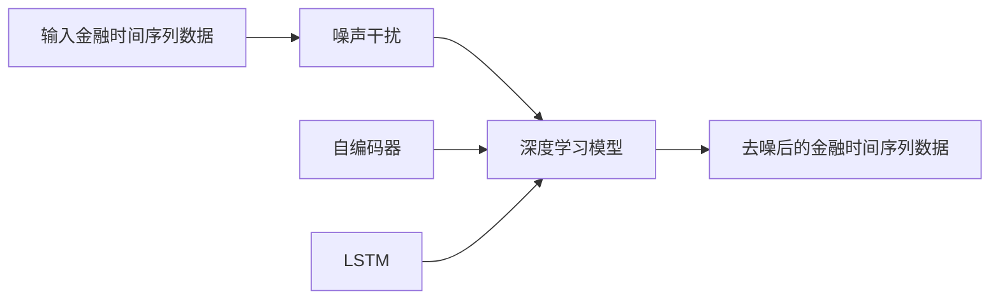

# 深度学习在金融时间序列去噪中的应用

> 关键词：深度学习、金融时间序列、去噪、神经网络、数据分析

> 摘要：本文深入探讨了深度学习在金融时间序列去噪中的应用。金融时间序列数据包含大量噪声，这些噪声会影响后续的分析和预测结果。深度学习凭借其强大的特征学习和非线性映射能力，为金融时间序列去噪提供了有效的解决方案。文章首先介绍了相关背景知识，包括目的范围、预期读者等；接着阐述了核心概念与联系，包括时间序列、噪声、深度学习模型等；详细讲解了核心算法原理及具体操作步骤，并用 Python 代码进行了阐述；介绍了相关数学模型和公式；通过项目实战展示了代码的实际应用和详细解释；探讨了深度学习在金融时间序列去噪中的实际应用场景；推荐了相关的学习资源、开发工具框架以及论文著作；最后总结了未来发展趋势与挑战，并对常见问题进行了解答，还提供了扩展阅读和参考资料。

## 1. 背景介绍 
### 1.1 目的和范围
金融市场中的时间序列数据，如股票价格、汇率、利率等，对于投资者、金融机构和政策制定者都具有重要意义。然而，这些数据往往受到各种噪声的干扰，如市场情绪波动、突发事件影响等。噪声的存在会使数据的特征变得模糊，影响对金融市场趋势的准确判断和预测。本文的目的是研究如何利用深度学习技术有效地去除金融时间序列中的噪声，提高数据质量，为后续的金融分析和决策提供更可靠的依据。范围涵盖了常见的深度学习模型在金融时间序列去噪中的应用，包括自编码器、长短时记忆网络（LSTM）等。

### 1.2 预期读者
本文预期读者包括金融领域的分析师、数据科学家、机器学习爱好者以及相关专业的学生。对于金融分析师来说，了解深度学习去噪技术可以帮助他们更好地处理金融数据，挖掘数据中的潜在信息；数据科学家可以从技术实现的角度深入理解深度学习在金融领域的应用；机器学习爱好者可以通过本文了解深度学习在实际场景中的具体应用案例；相关专业的学生可以将本文作为学习资料，加深对金融时间序列和深度学习的理解。

### 1.3 文档结构概述
本文将按照以下结构展开：首先介绍背景知识，包括目的范围、预期读者等；接着阐述核心概念与联系，包括时间序列、噪声、深度学习模型等；详细讲解核心算法原理及具体操作步骤，并用 Python 代码进行阐述；介绍相关数学模型和公式；通过项目实战展示代码的实际应用和详细解释；探讨深度学习在金融时间序列去噪中的实际应用场景；推荐相关的学习资源、开发工具框架以及论文著作；最后总结未来发展趋势与挑战，并对常见问题进行解答，还提供扩展阅读和参考资料。

### 1.4 术语表
#### 1.4.1 核心术语定义
- **金融时间序列**：按时间顺序排列的金融数据序列，如股票价格、汇率、利率等随时间变化的数据。
- **噪声**：在金融时间序列中，噪声是指那些干扰数据真实趋势的随机波动或异常值，可能由市场情绪、突发事件等因素引起。
- **深度学习**：一种基于人工神经网络的机器学习技术，通过构建多层神经网络来学习数据的复杂特征和模式。
- **自编码器**：一种无监督学习的深度学习模型，其目标是将输入数据编码为低维表示，然后再从低维表示中解码出原始数据，通过这种方式学习数据的特征。
- **长短时记忆网络（LSTM）**：一种特殊的循环神经网络，能够处理序列数据中的长期依赖关系，在处理时间序列数据方面具有优势。

#### 1.4.2 相关概念解释
- **时间序列分析**：研究时间序列数据的统计特性和变化规律的方法，包括趋势分析、季节性分析、周期性分析等。
- **噪声类型**：常见的噪声类型包括白噪声、高斯噪声、脉冲噪声等。白噪声是一种具有恒定功率谱密度的随机信号；高斯噪声是服从高斯分布的噪声；脉冲噪声是由突发的、短暂的干扰引起的噪声。
- **过拟合**：在机器学习中，过拟合是指模型在训练数据上表现良好，但在测试数据上表现不佳的现象，通常是由于模型过于复杂，学习了训练数据中的噪声和细节。
- **欠拟合**：欠拟合是指模型在训练数据和测试数据上的表现都不佳的现象，通常是由于模型过于简单，无法学习到数据的复杂特征。

#### 1.4.3 缩略词列表
- **LSTM**：Long Short-Term Memory，长短时记忆网络
- **RNN**：Recurrent Neural Network，循环神经网络
- **AE**：Autoencoder，自编码器
- **MSE**：Mean Squared Error，均方误差

## 2. 核心概念与联系 

### 金融时间序列
金融时间序列是指按照时间顺序排列的金融数据，如股票价格、汇率、利率等。这些数据通常具有以下特点：
- **时序性**：数据按照时间顺序排列，每个数据点都与特定的时间相关联。
- **波动性**：金融市场受到各种因素的影响，如宏观经济环境、政策变化、公司业绩等，导致金融时间序列具有较大的波动性。
- **噪声干扰**：金融时间序列中往往包含大量的噪声，这些噪声会影响数据的真实趋势和特征。

### 噪声
噪声是指在金融时间序列中干扰数据真实趋势的随机波动或异常值。噪声的来源主要包括以下几个方面：
- **市场情绪**：投资者的情绪波动会导致市场的买卖行为发生变化，从而引起金融时间序列的波动。
- **突发事件**：如自然灾害、政治事件、公司重大公告等突发事件会对金融市场产生影响，导致金融时间序列出现异常波动。
- **数据采集误差**：在数据采集过程中，可能会由于设备故障、人为错误等原因导致数据出现误差，这些误差也可以看作是噪声。

### 深度学习模型
深度学习模型是一种基于人工神经网络的机器学习技术，通过构建多层神经网络来学习数据的复杂特征和模式。在金融时间序列去噪中，常用的深度学习模型包括自编码器和长短时记忆网络（LSTM）。

- **自编码器（AE）**：自编码器是一种无监督学习的深度学习模型，其结构包括编码器和解码器两部分。编码器将输入数据编码为低维表示，解码器再从低维表示中解码出原始数据。自编码器的目标是使解码输出尽可能接近原始输入，通过这种方式学习数据的特征。自编码器可以有效地去除数据中的噪声，因为在编码过程中，模型会忽略噪声信息，只保留数据的主要特征。
- **长短时记忆网络（LSTM）**：LSTM 是一种特殊的循环神经网络，能够处理序列数据中的长期依赖关系。在金融时间序列去噪中，LSTM 可以学习到时间序列中的长期趋势和模式，从而更好地去除噪声。LSTM 通过门控机制来控制信息的流动，能够有效地解决传统循环神经网络中的梯度消失问题。

### 核心概念原理和架构的文本示意图
金融时间序列去噪的核心概念原理和架构可以用以下文本示意图表示：

输入金融时间序列数据 -> 噪声干扰 -> 深度学习模型（自编码器、LSTM 等） -> 去噪后的金融时间序列数据

### Mermaid 流程图


## 3. 核心算法原理 & 具体操作步骤 

### 自编码器原理
自编码器的目标是学习数据的低维表示，通过编码器将输入数据映射到低维空间，然后通过解码器将低维表示映射回原始空间。自编码器的损失函数通常使用均方误差（MSE），即预测值与真实值之间的平方误差的平均值。

### 自编码器的 Python 实现
```python
import numpy as np
import tensorflow as tf
from tensorflow.keras import layers, models

# 生成示例金融时间序列数据
np.random.seed(42)
time_steps = 100
input_dim = 1
data = np.random.randn(time_steps, input_dim)

# 添加噪声
noise_factor = 0.5
noisy_data = data + noise_factor * np.random.randn(*data.shape)

# 构建自编码器模型
input_layer = layers.Input(shape=(input_dim,))
encoded = layers.Dense(64, activation='relu')(input_layer)
encoded = layers.Dense(32, activation='relu')(encoded)
decoded = layers.Dense(64, activation='relu')(encoded)
decoded = layers.Dense(input_dim, activation='linear')(decoded)

autoencoder = models.Model(input_layer, decoded)

# 编译模型
autoencoder.compile(optimizer='adam', loss='mse')

# 训练模型
autoencoder.fit(noisy_data, data, epochs=50, batch_size=32)

# 进行去噪
denoised_data = autoencoder.predict(noisy_data)
```

### 具体操作步骤
1. **数据准备**：收集金融时间序列数据，并进行预处理，如归一化、标准化等。
2. **添加噪声**：为了模拟真实的噪声环境，可以在原始数据中添加一定比例的噪声。
3. **构建自编码器模型**：定义编码器和解码器的结构，并将它们组合成自编码器模型。
4. **编译模型**：选择合适的优化器和损失函数，如 Adam 优化器和均方误差（MSE）损失函数。
5. **训练模型**：使用添加噪声后的数据作为输入，原始数据作为目标，对自编码器模型进行训练。
6. **去噪**：使用训练好的自编码器模型对新的噪声数据进行去噪处理。

### 长短时记忆网络（LSTM）原理
LSTM 是一种特殊的循环神经网络，能够处理序列数据中的长期依赖关系。LSTM 通过门控机制来控制信息的流动，包括输入门、遗忘门和输出门。输入门控制新信息的输入，遗忘门控制旧信息的遗忘，输出门控制信息的输出。

### LSTM 的 Python 实现
```python
import numpy as np
import tensorflow as tf
from tensorflow.keras import layers, models

# 生成示例金融时间序列数据
np.random.seed(42)
time_steps = 100
input_dim = 1
data = np.random.randn(time_steps, input_dim)

# 添加噪声
noise_factor = 0.5
noisy_data = data + noise_factor * np.random.randn(*data.shape)

# 调整数据形状以适应 LSTM 输入
noisy_data = np.reshape(noisy_data, (noisy_data.shape[0], 1, noisy_data.shape[1]))
data = np.reshape(data, (data.shape[0], 1, data.shape[1]))

# 构建 LSTM 模型
input_layer = layers.Input(shape=(1, input_dim))
lstm_layer = layers.LSTM(64, return_sequences=True)(input_layer)
output_layer = layers.Dense(input_dim, activation='linear')(lstm_layer)

lstm_model = models.Model(input_layer, output_layer)

# 编译模型
lstm_model.compile(optimizer='adam', loss='mse')

# 训练模型
lstm_model.fit(noisy_data, data, epochs=50, batch_size=32)

# 进行去噪
denoised_data = lstm_model.predict(noisy_data)
denoised_data = np.reshape(denoised_data, (denoised_data.shape[0], denoised_data.shape[2]))
```

### 具体操作步骤
1. **数据准备**：收集金融时间序列数据，并进行预处理，如归一化、标准化等。
2. **添加噪声**：为了模拟真实的噪声环境，可以在原始数据中添加一定比例的噪声。
3. **调整数据形状**：LSTM 模型的输入需要是三维张量，因此需要将数据调整为合适的形状。
4. **构建 LSTM 模型**：定义 LSTM 层和输出层的结构，并将它们组合成 LSTM 模型。
5. **编译模型**：选择合适的优化器和损失函数，如 Adam 优化器和均方误差（MSE）损失函数。
6. **训练模型**：使用添加噪声后的数据作为输入，原始数据作为目标，对 LSTM 模型进行训练。
7. **去噪**：使用训练好的 LSTM 模型对新的噪声数据进行去噪处理，并将输出数据调整为合适的形状。

## 4. 数学模型和公式 & 详细讲解 & 举例说明 

### 均方误差（MSE）
均方误差是一种常用的损失函数，用于衡量预测值与真实值之间的差异。其数学公式为：

$$MSE = \frac{1}{n} \sum_{i=1}^{n} (y_i - \hat{y}_i)^2$$

其中，$n$ 是样本数量，$y_i$ 是真实值，$\hat{y}_i$ 是预测值。

### 详细讲解
均方误差的计算方法是将每个样本的预测值与真实值之间的差值平方，然后求平均值。均方误差的值越小，说明预测值与真实值之间的差异越小，模型的性能越好。

### 举例说明
假设我们有一组真实值 $y = [1, 2, 3, 4, 5]$ 和一组预测值 $\hat{y} = [1.2, 2.1, 2.9, 4.2, 4.8]$，则均方误差的计算过程如下：

$$
\begin{align*}
MSE &= \frac{1}{5} \times [(1 - 1.2)^2 + (2 - 2.1)^2 + (3 - 2.9)^2 + (4 - 4.2)^2 + (5 - 4.8)^2] \\
&= \frac{1}{5} \times [(-0.2)^2 + (-0.1)^2 + (0.1)^2 + (-0.2)^2 + (0.2)^2] \\
&= \frac{1}{5} \times [0.04 + 0.01 + 0.01 + 0.04 + 0.04] \\
&= \frac{1}{5} \times 0.14 \\
&= 0.028
\end{align*}
$$

### 自编码器的损失函数
自编码器的目标是使解码输出尽可能接近原始输入，因此其损失函数通常使用均方误差。自编码器的损失函数可以表示为：

$$L = \frac{1}{n} \sum_{i=1}^{n} \| x_i - \hat{x}_i \|^2$$

其中，$n$ 是样本数量，$x_i$ 是原始输入，$\hat{x}_i$ 是解码输出。

### 长短时记忆网络（LSTM）的数学模型
LSTM 的核心是门控机制，包括输入门、遗忘门和输出门。其数学模型如下：

- **遗忘门**：决定上一时刻的细胞状态 $C_{t-1}$ 有多少信息需要被遗忘。

$$f_t = \sigma(W_f [h_{t-1}, x_t] + b_f)$$

其中，$f_t$ 是遗忘门的输出，$\sigma$ 是 sigmoid 函数，$W_f$ 是遗忘门的权重矩阵，$h_{t-1}$ 是上一时刻的隐藏状态，$x_t$ 是当前时刻的输入，$b_f$ 是遗忘门的偏置。

- **输入门**：决定当前时刻的输入 $x_t$ 有多少信息需要被加入到细胞状态 $C_t$ 中。

$$i_t = \sigma(W_i [h_{t-1}, x_t] + b_i)$$

$$\tilde{C}_t = \tanh(W_C [h_{t-1}, x_t] + b_C)$$

其中，$i_t$ 是输入门的输出，$\tilde{C}_t$ 是候选细胞状态，$\tanh$ 是双曲正切函数，$W_i$ 和 $W_C$ 是输入门和候选细胞状态的权重矩阵，$b_i$ 和 $b_C$ 是输入门和候选细胞状态的偏置。

- **细胞状态更新**：根据遗忘门和输入门的输出，更新细胞状态 $C_t$。

$$C_t = f_t \odot C_{t-1} + i_t \odot \tilde{C}_t$$

其中，$\odot$ 表示逐元素相乘。

- **输出门**：决定当前时刻的细胞状态 $C_t$ 有多少信息需要被输出到隐藏状态 $h_t$ 中。

$$o_t = \sigma(W_o [h_{t-1}, x_t] + b_o)$$

$$h_t = o_t \odot \tanh(C_t)$$

其中，$o_t$ 是输出门的输出，$h_t$ 是当前时刻的隐藏状态，$W_o$ 是输出门的权重矩阵，$b_o$ 是输出门的偏置。

### 详细讲解
LSTM 通过门控机制来控制信息的流动，遗忘门决定了上一时刻的细胞状态有多少信息需要被遗忘，输入门决定了当前时刻的输入有多少信息需要被加入到细胞状态中，输出门决定了当前时刻的细胞状态有多少信息需要被输出到隐藏状态中。通过这种方式，LSTM 能够有效地处理序列数据中的长期依赖关系。

### 举例说明
假设我们有一个简单的 LSTM 模型，输入维度为 10，隐藏维度为 20。则遗忘门、输入门、候选细胞状态和输出门的权重矩阵和偏置的维度分别为：

- $W_f$: $(20, 30)$
- $b_f$: $(20,)$
- $W_i$: $(20, 30)$
- $b_i$: $(20,)$
- $W_C$: $(20, 30)$
- $b_C$: $(20,)$
- $W_o$: $(20, 30)$
- $b_o$: $(20,)$

其中，30 是 $[h_{t-1}, x_t]$ 的维度（$20 + 10$）。

在每个时间步，LSTM 模型会根据输入 $x_t$ 和上一时刻的隐藏状态 $h_{t-1}$ 计算遗忘门、输入门、候选细胞状态和输出门的输出，然后更新细胞状态 $C_t$ 和隐藏状态 $h_t$。

## 5. 项目实战：代码实际案例和详细解释说明 

### 5.1  开发环境搭建
- **操作系统**：Windows、Linux 或 macOS
- **Python 版本**：Python 3.6 及以上
- **深度学习框架**：TensorFlow 2.x 或 PyTorch
- **其他库**：NumPy、Pandas、Matplotlib 等

以下是使用 Anaconda 搭建开发环境的步骤：

1. 下载并安装 Anaconda：从 Anaconda 官方网站（https://www.anaconda.com/products/individual）下载适合自己操作系统的 Anaconda 安装包，并按照安装向导进行安装。
2. 创建虚拟环境：打开 Anaconda Prompt（Windows）或终端（Linux、macOS），输入以下命令创建一个名为 `finance_denoising` 的虚拟环境：

```bash
conda create -n finance_denoising python=3.8
```

3. 激活虚拟环境：输入以下命令激活虚拟环境：

```bash
conda activate finance_denoising
```

4. 安装所需库：输入以下命令安装所需的库：

```bash
conda install tensorflow pandas numpy matplotlib
```

### 5.2  源代码详细实现和代码解读
以下是一个使用自编码器对金融时间序列进行去噪的完整代码示例：

```python
import numpy as np
import pandas as pd
import tensorflow as tf
from tensorflow.keras import layers, models
import matplotlib.pyplot as plt

# 读取金融时间序列数据
data = pd.read_csv('stock_prices.csv', index_col=0)
prices = data['Close'].values

# 数据预处理
from sklearn.preprocessing import MinMaxScaler
scaler = MinMaxScaler()
prices = scaler.fit_transform(prices.reshape(-1, 1))

# 添加噪声
noise_factor = 0.1
noisy_prices = prices + noise_factor * np.random.randn(*prices.shape)
noisy_prices = np.clip(noisy_prices, 0, 1)

# 构建自编码器模型
input_layer = layers.Input(shape=(1,))
encoded = layers.Dense(64, activation='relu')(input_layer)
encoded = layers.Dense(32, activation='relu')(encoded)
decoded = layers.Dense(64, activation='relu')(encoded)
decoded = layers.Dense(1, activation='linear')(decoded)

autoencoder = models.Model(input_layer, decoded)

# 编译模型
autoencoder.compile(optimizer='adam', loss='mse')

# 训练模型
autoencoder.fit(noisy_prices, prices, epochs=50, batch_size=32)

# 进行去噪
denoised_prices = autoencoder.predict(noisy_prices)

# 反归一化
denoised_prices = scaler.inverse_transform(denoised_prices)
prices = scaler.inverse_transform(prices)
noisy_prices = scaler.inverse_transform(noisy_prices)

# 可视化结果
plt.figure(figsize=(12, 6))
plt.plot(prices, label='Original Prices')
plt.plot(noisy_prices, label='Noisy Prices')
plt.plot(denoised_prices, label='Denoised Prices')
plt.legend()
plt.title('Financial Time Series Denoising using Autoencoder')
plt.xlabel('Time')
plt.ylabel('Stock Price')
plt.show()
```

### 代码解读
1. **数据读取**：使用 Pandas 库读取金融时间序列数据，这里假设数据文件名为 `stock_prices.csv`，并提取收盘价作为时间序列数据。
2. **数据预处理**：使用 MinMaxScaler 对数据进行归一化处理，将数据缩放到 0 到 1 之间。
3. **添加噪声**：为了模拟真实的噪声环境，在归一化后的数据中添加一定比例的噪声，并使用 `np.clip` 函数将噪声数据限制在 0 到 1 之间。
4. **构建自编码器模型**：定义编码器和解码器的结构，并将它们组合成自编码器模型。编码器使用两个全连接层将输入数据编码为低维表示，解码器使用两个全连接层将低维表示解码为原始数据。
5. **编译模型**：选择 Adam 优化器和均方误差（MSE）损失函数对模型进行编译。
6. **训练模型**：使用添加噪声后的数据作为输入，原始数据作为目标，对自编码器模型进行训练，训练 50 个 epoch，每个 batch 包含 32 个样本。
7. **去噪**：使用训练好的自编码器模型对新的噪声数据进行去噪处理。
8. **反归一化**：将去噪后的数据和原始数据进行反归一化处理，恢复数据的原始尺度。
9. **可视化结果**：使用 Matplotlib 库将原始数据、噪声数据和去噪后的数据进行可视化，以便直观地观察去噪效果。

### 5.3  代码解读与分析
- **模型结构**：自编码器的结构相对简单，由编码器和解码器两部分组成。编码器将输入数据映射到低维空间，解码器将低维表示映射回原始空间。通过这种方式，自编码器可以学习到数据的主要特征，从而去除噪声。
- **损失函数**：均方误差（MSE）是一种常用的损失函数，用于衡量预测值与真实值之间的差异。在自编码器中，MSE 可以有效地衡量解码输出与原始输入之间的差异，从而优化模型的参数。
- **训练过程**：训练过程中，模型会不断调整参数，使得解码输出尽可能接近原始输入。通过多次迭代训练，模型可以学习到数据的特征，从而提高去噪效果。
- **可视化结果**：通过可视化结果可以直观地观察去噪效果。如果去噪后的数据与原始数据接近，说明模型的去噪效果较好；如果去噪后的数据仍然存在较多噪声，说明模型的性能还有待提高。

## 6. 实际应用场景 
### 金融市场预测
在金融市场预测中，准确的时间序列数据是进行有效预测的基础。深度学习在金融时间序列去噪中的应用可以去除数据中的噪声，提高数据的质量，从而为金融市场预测提供更可靠的依据。例如，通过对股票价格、汇率等时间序列数据进行去噪处理，可以更准确地分析市场趋势，预测未来价格走势，为投资者提供决策支持。

### 风险评估
金融机构在进行风险评估时，需要对各种金融数据进行分析。噪声的存在会影响风险评估的准确性，导致误判。深度学习去噪技术可以去除金融时间序列中的噪声，使数据更加真实可靠，从而提高风险评估的准确性。例如，在信用风险评估中，通过对借款人的财务数据进行去噪处理，可以更准确地评估借款人的信用状况，降低信用风险。

### 投资组合优化
投资组合优化的目标是在风险和收益之间找到平衡。准确的金融时间序列数据对于投资组合优化至关重要。深度学习去噪技术可以去除数据中的噪声，提高数据的质量，从而为投资组合优化提供更准确的依据。例如，通过对不同资产的收益率时间序列数据进行去噪处理，可以更准确地计算资产之间的相关性，优化投资组合的配置，提高投资收益。

### 高频交易
在高频交易中，交易决策通常基于实时的金融时间序列数据。噪声的存在会影响交易决策的准确性，导致交易损失。深度学习去噪技术可以实时去除金融时间序列中的噪声，为高频交易提供更准确的信号。例如，通过对股票价格的高频数据进行去噪处理，可以更准确地捕捉价格波动的趋势，及时做出交易决策，提高高频交易的效率和收益。

## 7. 工具和资源推荐
### 7.1 学习资源推荐
#### 7.1.1 书籍推荐
- 《深度学习》（Deep Learning）：由 Ian Goodfellow、Yoshua Bengio 和 Aaron Courville 所著，是深度学习领域的经典教材，涵盖了深度学习的基本概念、算法和应用。
- 《Python 深度学习》（Deep Learning with Python）：由 Francois Chollet 所著，介绍了如何使用 Python 和 Keras 库进行深度学习开发，包含了许多实际案例。
- 《金融时间序列分析》（Analysis of Financial Time Series）：由 Ruey S. Tsay 所著，是金融时间序列分析领域的经典教材，介绍了金融时间序列的建模、预测和风险管理等方法。

#### 7.1.2 在线课程
- Coursera 上的“深度学习专项课程”（Deep Learning Specialization）：由 Andrew Ng 教授授课，涵盖了深度学习的基础知识、卷积神经网络、循环神经网络等内容。
- edX 上的“金融科技与数据分析”（Fintech and Data Analytics）：介绍了金融科技领域的数据分析方法，包括金融时间序列分析和深度学习在金融领域的应用。
- Udemy 上的“Python 金融分析与算法交易”（Python for Finance: Investment Fundamentals & Data Analytics）：介绍了如何使用 Python 进行金融数据分析和算法交易，包含了许多实际案例。

#### 7.1.3 技术博客和网站
- Medium：一个技术博客平台，上面有许多关于深度学习和金融时间序列分析的文章，可以关注一些知名的作者和博客。
- Towards Data Science：一个专注于数据科学和机器学习的博客平台，上面有许多关于深度学习在金融领域应用的文章。
- Kaggle：一个数据科学竞赛平台，上面有许多金融时间序列分析的数据集和竞赛项目，可以通过参与竞赛来提高自己的技能。

### 7.2 开发工具框架推荐
#### 7.2.1 IDE和编辑器
- PyCharm：一个专业的 Python 集成开发环境，提供了丰富的代码编辑、调试和项目管理功能。
- Jupyter Notebook：一个交互式的开发环境，适合进行数据探索和模型开发，支持 Python、R 等多种编程语言。
- Visual Studio Code：一个轻量级的代码编辑器，支持多种编程语言和插件，适合快速开发和调试。

#### 7.2.2 调试和性能分析工具
- TensorBoard：TensorFlow 提供的可视化工具，可以用于查看模型的训练过程、损失曲线、模型结构等信息。
- PyTorch Profiler：PyTorch 提供的性能分析工具，可以用于分析模型的性能瓶颈，优化模型的训练和推理速度。
- cProfile：Python 内置的性能分析工具，可以用于分析 Python 代码的性能瓶颈。

#### 7.2.3 相关框架和库
- TensorFlow：一个开源的深度学习框架，提供了丰富的深度学习模型和工具，支持 CPU、GPU 和 TPU 等多种计算设备。
- PyTorch：一个开源的深度学习框架，具有动态图和静态图两种模式，适合快速开发和研究。
- Keras：一个高级神经网络 API，基于 TensorFlow、Theano 等后端，提供了简单易用的接口，适合快速搭建深度学习模型。
- Pandas：一个数据处理和分析库，提供了丰富的数据结构和数据处理方法，适合处理金融时间序列数据。
- NumPy：一个科学计算库，提供了高效的数组操作和数学函数，是深度学习和数据分析的基础库。

### 7.3 相关论文著作推荐
#### 7.3.1 经典论文
- “Autoencoder Denoising for Financial Time Series”：介绍了自编码器在金融时间序列去噪中的应用，分析了自编码器的原理和性能。
- “Long Short-Term Memory Networks for Financial Time Series Prediction”：探讨了长短时记忆网络（LSTM）在金融时间序列预测中的应用，比较了 LSTM 与其他模型的性能。
- “Deep Learning in Finance: A Review”：对深度学习在金融领域的应用进行了全面的综述，包括金融时间序列分析、风险评估、投资组合优化等方面。

#### 7.3.2 最新研究成果
- 关注顶级学术会议和期刊，如 NeurIPS、ICML、JMLR 等，了解深度学习在金融时间序列去噪中的最新研究成果。
- 关注知名研究机构和学者的研究动态，如斯坦福大学、麻省理工学院、伯克利大学等的相关研究。

#### 7.3.3 应用案例分析
- 一些金融机构和科技公司会发布关于深度学习在金融领域应用的案例分析，可以参考这些案例了解实际应用中的技术细节和经验教训。
- Kaggle 上的一些金融时间序列分析竞赛项目也提供了许多实际应用案例，可以参考这些案例学习如何使用深度学习技术解决实际问题。

## 8. 总结：未来发展趋势与挑战
### 未来发展趋势
- **模型融合**：未来可能会将多种深度学习模型进行融合，如自编码器与 LSTM、卷积神经网络（CNN）等模型的融合，以充分发挥不同模型的优势，提高金融时间序列去噪的效果。
- **强化学习的应用**：强化学习可以在动态环境中进行决策和优化，未来可能会将强化学习应用于金融时间序列去噪中，通过不断学习和调整去噪策略，提高去噪的效率和准确性。
- **跨领域融合**：深度学习与其他领域的技术，如量子计算、区块链等的融合，可能会为金融时间序列去噪带来新的思路和方法。例如，量子计算可以提高模型的计算效率，区块链可以保证数据的安全性和可信度。

### 挑战
- **数据质量和可用性**：金融时间序列数据往往存在数据缺失、异常值等问题，这些问题会影响深度学习模型的性能。此外，金融数据的获取和使用也受到法律法规的限制，如何获取高质量、可用的数据是一个挑战。
- **模型解释性**：深度学习模型通常是黑盒模型，其决策过程难以解释。在金融领域，模型的解释性非常重要，因为金融决策往往涉及到大量的资金和风险。如何提高深度学习模型的解释性，是一个亟待解决的问题。
- **计算资源和效率**：深度学习模型的训练和推理需要大量的计算资源，如 GPU、TPU 等。如何在有限的计算资源下提高模型的训练和推理效率，是一个挑战。

## 9. 附录：常见问题与解答
### 问题 1：深度学习模型在金融时间序列去噪中的效果如何？
深度学习模型在金融时间序列去噪中具有较好的效果。通过学习数据的特征和模式，深度学习模型可以有效地去除噪声，提高数据的质量。然而，模型的效果受到多种因素的影响，如数据质量、模型结构、训练参数等。在实际应用中，需要根据具体情况选择合适的模型和参数，以达到最佳的去噪效果。

### 问题 2：如何选择合适的深度学习模型进行金融时间序列去噪？
选择合适的深度学习模型需要考虑多个因素，如数据的特点、去噪的目标、计算资源等。自编码器适用于去除数据中的随机噪声，学习数据的主要特征；LSTM 适用于处理序列数据中的长期依赖关系，对于具有趋势性和周期性的金融时间序列数据有较好的效果。在实际应用中，可以尝试多种模型，并通过实验比较它们的性能，选择最合适的模型。

### 问题 3：如何评估深度学习模型在金融时间序列去噪中的性能？
可以使用多种指标来评估深度学习模型在金融时间序列去噪中的性能，如均方误差（MSE）、均方根误差（RMSE）、平均绝对误差（MAE）等。这些指标可以衡量去噪后的数据与原始数据之间的差异，差异越小，说明模型的性能越好。此外，还可以通过可视化的方式观察去噪效果，直观地评估模型的性能。

### 问题 4：深度学习模型在金融时间序列去噪中是否会过拟合？
深度学习模型在金融时间序列去噪中可能会出现过拟合的问题。过拟合是指模型在训练数据上表现良好，但在测试数据上表现不佳的现象。为了避免过拟合，可以采用以下方法：
- **数据增强**：通过对原始数据进行变换，如平移、旋转、缩放等，增加数据的多样性，提高模型的泛化能力。
- **正则化**：在模型训练过程中，添加正则化项，如 L1 正则化、L2 正则化等，限制模型的复杂度，防止模型过拟合。
- **早停策略**：在模型训练过程中，监控验证集的性能，当验证集的性能不再提升时，提前停止训练，避免模型过拟合。

### 问题 5：深度学习模型在金融时间序列去噪中的计算复杂度如何？
深度学习模型的计算复杂度与模型的结构、数据的规模等因素有关。一般来说，模型的层数越多、神经元数量越多，计算复杂度就越高。此外，数据的规模越大，计算复杂度也会相应增加。在实际应用中，需要根据计算资源和时间要求，选择合适的模型和参数，以平衡计算复杂度和去噪效果。

## 10. 扩展阅读 & 参考资料
### 扩展阅读
- 《深度学习进阶：基于 Python 的理论与实现》：深入介绍了深度学习的理论和实现细节，适合有一定基础的读者进一步学习。
- 《金融机器学习实战》：介绍了机器学习在金融领域的实际应用，包括金融时间序列分析、风险评估、投资组合优化等方面的案例。
- 《Python 数据科学手册》：介绍了 Python 在数据科学领域的应用，包括数据处理、数据分析、机器学习等方面的内容。

### 参考资料
- Goodfellow, I., Bengio, Y., & Courville, A. (2016). Deep Learning. MIT Press.
- Chollet, F. (2018). Deep Learning with Python. Manning Publications.
- Tsay, R. S. (2014). Analysis of Financial Time Series. Wiley.
- “Autoencoder Denoising for Financial Time Series” 相关学术论文
- “Long Short-Term Memory Networks for Financial Time Series Prediction” 相关学术论文
- “Deep Learning in Finance: A Review” 相关学术论文