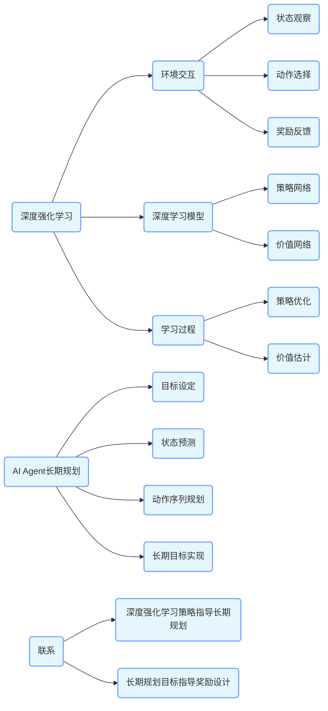

# 深度强化学习在AI Agent长期规划中的应用

> 关键词：深度强化学习、AI Agent、长期规划、马尔可夫决策过程、策略网络

> 摘要：本文围绕深度强化学习在AI Agent长期规划中的应用展开。首先介绍了相关背景知识，包括目的范围、预期读者等内容。接着阐述了深度强化学习和AI Agent长期规划的核心概念及它们之间的联系，并通过示意图和流程图进行直观展示。详细讲解了核心算法原理，结合Python代码进行说明，同时给出相关数学模型和公式并举例。通过项目实战，展示了开发环境搭建、源代码实现与解读。探讨了深度强化学习在多个实际场景中的应用，推荐了学习资源、开发工具框架以及相关论文著作。最后总结了未来发展趋势与挑战，并给出常见问题解答和扩展阅读参考资料，旨在为读者全面呈现深度强化学习在AI Agent长期规划中应用的相关知识。

## 1. 背景介绍 
### 1.1 目的和范围
随着人工智能技术的不断发展，AI Agent在各种复杂环境中的应用越来越广泛。然而，如何让AI Agent具备长期规划的能力，以实现更高效、更智能的决策，成为了当前研究的热点问题。深度强化学习作为一种强大的机器学习方法，为解决AI Agent的长期规划问题提供了有效的途径。

本文的目的在于深入探讨深度强化学习在AI Agent长期规划中的应用，详细介绍相关的理论知识、算法原理和实际应用案例。范围涵盖了深度强化学习的基本概念、核心算法，以及如何将其应用于AI Agent的长期规划中，同时还会涉及到实际项目的开发过程和相关工具资源的推荐。

### 1.2 预期读者
本文预期读者包括对人工智能、机器学习领域感兴趣的研究人员、工程师、学生等。对于有一定编程基础和机器学习知识的读者来说，能够更好地理解本文的内容，但即使是初学者，通过仔细阅读和学习，也可以对深度强化学习在AI Agent长期规划中的应用有一个较为全面的了解。

### 1.3 文档结构概述
本文将按照以下结构进行组织：首先介绍背景知识，包括目的范围、预期读者和文档结构概述等内容；接着阐述深度强化学习和AI Agent长期规划的核心概念及它们之间的联系；详细讲解核心算法原理，并结合Python代码进行说明；给出相关数学模型和公式并举例；通过项目实战，展示开发环境搭建、源代码实现与解读；探讨深度强化学习在多个实际场景中的应用；推荐学习资源、开发工具框架以及相关论文著作；最后总结未来发展趋势与挑战，并给出常见问题解答和扩展阅读参考资料。

### 1.4 术语表
#### 1.4.1 核心术语定义
- **深度强化学习（Deep Reinforcement Learning）**：结合了深度学习和强化学习的方法，通过深度神经网络来学习最优策略，以在环境中获得最大的累积奖励。
- **AI Agent（人工智能智能体）**：能够感知环境、做出决策并执行动作的智能实体，其目标是在环境中实现特定的任务。
- **长期规划（Long - term Planning）**：AI Agent为了实现长期目标，对一系列动作进行合理安排和决策的过程。
- **马尔可夫决策过程（Markov Decision Process，MDP）**：一种用于描述决策过程的数学模型，其中系统的状态转移具有马尔可夫性质。
- **策略网络（Policy Network）**：深度强化学习中用于生成动作策略的神经网络。

#### 1.4.2 相关概念解释
- **状态（State）**：在马尔可夫决策过程中，状态是对环境当前情况的一种描述，AI Agent根据状态来做出决策。
- **动作（Action）**：AI Agent在某个状态下可以执行的操作，不同的动作会导致环境状态的变化。
- **奖励（Reward）**：环境根据AI Agent的动作给予的反馈信号，用于评估动作的好坏，AI Agent的目标是最大化累积奖励。
- **价值函数（Value Function）**：用于评估在某个状态下采取某种策略所能获得的预期累积奖励。

#### 1.4.3 缩略词列表
- **MDP**：Markov Decision Process（马尔可夫决策过程）
- **DQN**：Deep Q - Network（深度Q网络）
- **A2C**：Advantage Actor - Critic（优势演员 - 评论家算法）
- **PPO**：Proximal Policy Optimization（近端策略优化算法）

## 2. 核心概念与联系 

### 深度强化学习的核心概念
深度强化学习是强化学习与深度学习的结合。强化学习是一种通过智能体与环境进行交互，以最大化累积奖励为目标的学习方法。在强化学习中，智能体在环境中观察到状态 $s$，选择一个动作 $a$ 执行，环境会根据动作转移到下一个状态 $s'$，并给予智能体一个奖励 $r$。智能体的目标是学习一个策略 $\pi$，使得在每个状态下选择的动作能够在长期内获得最大的累积奖励。

深度学习则为强化学习提供了强大的函数逼近能力。通过使用深度神经网络，我们可以学习到复杂的状态 - 动作映射关系，从而解决高维状态空间和连续动作空间的问题。

### AI Agent长期规划的核心概念
AI Agent的长期规划是指智能体在面对复杂环境和长期目标时，能够制定一系列合理的动作序列，以实现最终目标。长期规划需要考虑到未来的状态和奖励，不仅仅是当前的即时奖励。例如，在一个机器人导航任务中，机器人需要规划一条从起点到终点的路径，可能需要绕过障碍物，这就需要考虑到不同动作对未来状态的影响。

### 两者之间的联系
深度强化学习为AI Agent的长期规划提供了有效的解决方案。通过深度强化学习算法，AI Agent可以学习到一个最优策略，该策略能够在长期内最大化累积奖励，从而实现长期规划的目标。例如，在一个游戏环境中，AI Agent可以通过深度强化学习学习到如何在多个回合中获得最高的分数，这就涉及到了长期规划的过程。

### 文本示意图
```plaintext
深度强化学习
  |
  |-- 环境交互
  |     |
  |     |-- 状态观察
  |     |-- 动作选择
  |     |-- 奖励反馈
  |
  |-- 深度学习模型
  |     |
  |     |-- 策略网络
  |     |-- 价值网络
  |
  |-- 学习过程
        |
        |-- 策略优化
        |-- 价值估计

AI Agent长期规划
  |
  |-- 目标设定
  |
  |-- 状态预测
  |
  |-- 动作序列规划
  |
  |-- 长期目标实现

联系：深度强化学习的学习结果（策略）用于指导AI Agent的长期规划，而长期规划的目标为深度强化学习提供了奖励设计的依据。
```

### Mermaid流程图


## 3. 核心算法原理 & 具体操作步骤 

### 深度Q网络（DQN）算法原理
深度Q网络（DQN）是深度强化学习中的经典算法，它通过深度神经网络来近似Q值函数。Q值函数 $Q(s, a)$ 表示在状态 $s$ 下采取动作 $a$ 所能获得的预期累积奖励。

DQN的目标是学习一个最优的Q值函数 $Q^*(s, a)$，使得在每个状态下选择Q值最大的动作能够获得最大的累积奖励。DQN使用经验回放和目标网络来提高训练的稳定性。

### 具体操作步骤
1. **初始化**：初始化Q网络 $Q(s, a; \theta)$ 和目标网络 $Q(s, a; \theta^-)$，其中 $\theta$ 和 $\theta^-$ 分别是Q网络和目标网络的参数。初始化经验回放缓冲区 $D$。
2. **环境交互**：在每个时间步 $t$，智能体观察到当前状态 $s_t$，根据 $\epsilon$ - 贪心策略选择动作 $a_t$：
   - 以概率 $\epsilon$ 随机选择一个动作。
   - 以概率 $1 - \epsilon$ 选择 $Q(s_t, a; \theta)$ 值最大的动作。
3. **执行动作**：执行动作 $a_t$，环境转移到下一个状态 $s_{t + 1}$，并给予奖励 $r_t$。
4. **存储经验**：将经验 $(s_t, a_t, r_t, s_{t + 1})$ 存储到经验回放缓冲区 $D$ 中。
5. **经验回放**：从经验回放缓冲区 $D$ 中随机采样一个小批量的经验 $(s_i, a_i, r_i, s_{i + 1})$。
6. **计算目标Q值**：对于每个经验 $(s_i, a_i, r_i, s_{i + 1})$，计算目标Q值 $y_i$：
   - 如果 $s_{i + 1}$ 是终止状态，则 $y_i = r_i$。
   - 否则，$y_i = r_i + \gamma \max_{a'} Q(s_{i + 1}, a'; \theta^-)$，其中 $\gamma$ 是折扣因子。
7. **更新Q网络**：使用均方误差损失函数 $L(\theta) = \frac{1}{N} \sum_{i = 1}^{N} (y_i - Q(s_i, a_i; \theta))^2$ 来更新Q网络的参数 $\theta$。
8. **更新目标网络**：每隔一定的时间步，将目标网络的参数 $\theta^-$ 更新为Q网络的参数 $\theta$。

### Python代码实现
```python
import torch
import torch.nn as nn
import torch.optim as optim
import numpy as np
import random

# 定义Q网络
class QNetwork(nn.Module):
    def __init__(self, state_size, action_size):
        super(QNetwork, self).__init__()
        self.fc1 = nn.Linear(state_size, 64)
        self.fc2 = nn.Linear(64, 64)
        self.fc3 = nn.Linear(64, action_size)

    def forward(self, x):
        x = torch.relu(self.fc1(x))
        x = torch.relu(self.fc2(x))
        return self.fc3(x)

# 定义DQN智能体
class DQNAgent:
    def __init__(self, state_size, action_size, learning_rate=0.001, gamma=0.99, epsilon=1.0, epsilon_decay=0.995, epsilon_min=0.01, batch_size=64, memory_size=10000):
        self.state_size = state_size
        self.action_size = action_size
        self.learning_rate = learning_rate
        self.gamma = gamma
        self.epsilon = epsilon
        self.epsilon_decay = epsilon_decay
        self.epsilon_min = epsilon_min
        self.batch_size = batch_size
        self.memory = []
        self.memory_size = memory_size

        # 初始化Q网络和目标网络
        self.q_network = QNetwork(state_size, action_size)
        self.target_network = QNetwork(state_size, action_size)
        self.target_network.load_state_dict(self.q_network.state_dict())
        self.optimizer = optim.Adam(self.q_network.parameters(), lr=learning_rate)

    def remember(self, state, action, reward, next_state, done):
        if len(self.memory) > self.memory_size:
            self.memory.pop(0)
        self.memory.append((state, action, reward, next_state, done))

    def act(self, state):
        if np.random.rand() <= self.epsilon:
            return random.randrange(self.action_size)
        state = torch.FloatTensor(state).unsqueeze(0)
        q_values = self.q_network(state)
        action = torch.argmax(q_values).item()
        return action

    def replay(self):
        if len(self.memory) < self.batch_size:
            return
        minibatch = random.sample(self.memory, self.batch_size)
        states, actions, rewards, next_states, dones = zip(*minibatch)

        states = torch.FloatTensor(states)
        actions = torch.LongTensor(actions)
        rewards = torch.FloatTensor(rewards)
        next_states = torch.FloatTensor(next_states)
        dones = torch.FloatTensor(dones)

        q_values = self.q_network(states).gather(1, actions.unsqueeze(1)).squeeze(1)
        next_q_values = self.target_network(next_states).max(1)[0]
        target_q_values = rewards + (1 - dones) * self.gamma * next_q_values

        loss = nn.MSELoss()(q_values, target_q_values)
        self.optimizer.zero_grad()
        loss.backward()
        self.optimizer.step()

        if self.epsilon > self.epsilon_min:
            self.epsilon *= self.epsilon_decay

    def update_target_network(self):
        self.target_network.load_state_dict(self.q_network.state_dict())
```

## 4. 数学模型和公式 & 详细讲解 & 举例说明 

### 马尔可夫决策过程（MDP）
马尔可夫决策过程是一个五元组 $(S, A, P, R, \gamma)$，其中：
- $S$ 是状态空间，表示环境所有可能的状态。
- $A$ 是动作空间，表示智能体在每个状态下可以执行的动作。
- $P(s'|s, a)$ 是状态转移概率，表示在状态 $s$ 下执行动作 $a$ 后转移到状态 $s'$ 的概率。
- $R(s, a)$ 是奖励函数，表示在状态 $s$ 下执行动作 $a$ 所获得的即时奖励。
- $\gamma \in [0, 1]$ 是折扣因子，用于权衡即时奖励和未来奖励的重要性。

### 价值函数
- **状态价值函数 $V^\pi(s)$**：表示在策略 $\pi$ 下，从状态 $s$ 开始所能获得的预期累积奖励：
  $$V^\pi(s) = \mathbb{E}_\pi \left[ \sum_{t = 0}^{\infty} \gamma^t r_t | s_0 = s \right]$$
- **动作价值函数 $Q^\pi(s, a)$**：表示在策略 $\pi$ 下，从状态 $s$ 执行动作 $a$ 后所能获得的预期累积奖励：
  $$Q^\pi(s, a) = \mathbb{E}_\pi \left[ \sum_{t = 0}^{\infty} \gamma^t r_t | s_0 = s, a_0 = a \right]$$

### 贝尔曼方程
- **状态价值函数的贝尔曼方程**：
  $$V^\pi(s) = \sum_{a \in A} \pi(a|s) \left[ R(s, a) + \gamma \sum_{s' \in S} P(s'|s, a) V^\pi(s') \right]$$
- **动作价值函数的贝尔曼方程**：
  $$Q^\pi(s, a) = R(s, a) + \gamma \sum_{s' \in S} P(s'|s, a) \sum_{a' \in A} \pi(a'|s') Q^\pi(s', a')$$

### 最优价值函数和最优策略
- 最优状态价值函数 $V^*(s)$ 是所有策略下状态价值函数的最大值：
  $$V^*(s) = \max_{\pi} V^\pi(s)$$
- 最优动作价值函数 $Q^*(s, a)$ 是所有策略下动作价值函数的最大值：
  $$Q^*(s, a) = \max_{\pi} Q^\pi(s, a)$$
- 最优策略 $\pi^*$ 是使得 $V^\pi(s) = V^*(s)$ 或 $Q^\pi(s, a) = Q^*(s, a)$ 的策略。

### 举例说明
考虑一个简单的网格世界环境，智能体在一个 $3 \times 3$ 的网格中移动，目标是到达右下角的网格。智能体可以执行上、下、左、右四个动作。每个状态是智能体在网格中的位置，奖励函数如下：
- 到达目标状态，奖励为 10。
- 撞到墙壁，奖励为 -1。
- 其他情况，奖励为 0。

假设折扣因子 $\gamma = 0.9$，我们可以使用上述数学模型和公式来计算状态价值函数和动作价值函数，从而找到最优策略。

## 5. 项目实战：代码实际案例和详细解释说明 

### 5.1  开发环境搭建
1. **安装Python**：建议使用Python 3.6及以上版本，可以从Python官方网站（https://www.python.org/downloads/） 下载并安装。
2. **安装深度学习框架**：我们使用PyTorch作为深度学习框架，可以根据自己的系统和CUDA版本，从PyTorch官方网站（https://pytorch.org/get-started/locally/） 选择合适的安装命令进行安装。
3. **安装其他依赖库**：还需要安装NumPy、Matplotlib等常用的Python库，可以使用pip命令进行安装：
```bash
pip install numpy matplotlib
```

### 5.2  源代码详细实现和代码解读
我们以OpenAI Gym中的CartPole环境为例，使用DQN算法训练一个AI Agent来平衡杆子。

```python
import gym
import torch
import torch.nn as nn
import torch.optim as optim
import numpy as np
import random

# 定义Q网络
class QNetwork(nn.Module):
    def __init__(self, state_size, action_size):
        super(QNetwork, self).__init__()
        self.fc1 = nn.Linear(state_size, 64)
        self.fc2 = nn.Linear(64, 64)
        self.fc3 = nn.Linear(64, action_size)

    def forward(self, x):
        x = torch.relu(self.fc1(x))
        x = torch.relu(self.fc2(x))
        return self.fc3(x)

# 定义DQN智能体
class DQNAgent:
    def __init__(self, state_size, action_size, learning_rate=0.001, gamma=0.99, epsilon=1.0, epsilon_decay=0.995, epsilon_min=0.01, batch_size=64, memory_size=10000):
        self.state_size = state_size
        self.action_size = action_size
        self.learning_rate = learning_rate
        self.gamma = gamma
        self.epsilon = epsilon
        self.epsilon_decay = epsilon_decay
        self.epsilon_min = epsilon_min
        self.batch_size = batch_size
        self.memory = []
        self.memory_size = memory_size

        # 初始化Q网络和目标网络
        self.q_network = QNetwork(state_size, action_size)
        self.target_network = QNetwork(state_size, action_size)
        self.target_network.load_state_dict(self.q_network.state_dict())
        self.optimizer = optim.Adam(self.q_network.parameters(), lr=learning_rate)

    def remember(self, state, action, reward, next_state, done):
        if len(self.memory) > self.memory_size:
            self.memory.pop(0)
        self.memory.append((state, action, reward, next_state, done))

    def act(self, state):
        if np.random.rand() <= self.epsilon:
            return random.randrange(self.action_size)
        state = torch.FloatTensor(state).unsqueeze(0)
        q_values = self.q_network(state)
        action = torch.argmax(q_values).item()
        return action

    def replay(self):
        if len(self.memory) < self.batch_size:
            return
        minibatch = random.sample(self.memory, self.batch_size)
        states, actions, rewards, next_states, dones = zip(*minibatch)

        states = torch.FloatTensor(states)
        actions = torch.LongTensor(actions)
        rewards = torch.FloatTensor(rewards)
        next_states = torch.FloatTensor(next_states)
        dones = torch.FloatTensor(dones)

        q_values = self.q_network(states).gather(1, actions.unsqueeze(1)).squeeze(1)
        next_q_values = self.target_network(next_states).max(1)[0]
        target_q_values = rewards + (1 - dones) * self.gamma * next_q_values

        loss = nn.MSELoss()(q_values, target_q_values)
        self.optimizer.zero_grad()
        loss.backward()
        self.optimizer.step()

        if self.epsilon > self.epsilon_min:
            self.epsilon *= self.epsilon_decay

    def update_target_network(self):
        self.target_network.load_state_dict(self.q_network.state_dict())

# 主训练循环
if __name__ == "__main__":
    env = gym.make('CartPole-v1')
    state_size = env.observation_space.shape[0]
    action_size = env.action_space.n
    agent = DQNAgent(state_size, action_size)

    num_episodes = 1000
    for episode in range(num_episodes):
        state = env.reset()
        total_reward = 0
        done = False
        while not done:
            action = agent.act(state)
            next_state, reward, done, _ = env.step(action)
            agent.remember(state, action, reward, next_state, done)
            agent.replay()
            state = next_state
            total_reward += reward
        if episode % 10 == 0:
            agent.update_target_network()
        print(f"Episode {episode}: Total Reward = {total_reward}")
    env.close()
```

### 5.3  代码解读与分析
1. **Q网络定义**：`QNetwork` 类定义了一个简单的三层全连接神经网络，用于近似Q值函数。输入是状态，输出是每个动作的Q值。
2. **DQN智能体定义**：`DQNAgent` 类实现了DQN算法的核心功能，包括经验回放、动作选择、Q网络更新和目标网络更新等。
3. **主训练循环**：在主训练循环中，我们创建了一个CartPole环境，初始化了DQN智能体，然后进行多个回合的训练。在每个回合中，智能体与环境进行交互，收集经验并进行训练。每隔10个回合，更新一次目标网络。

通过不断训练，智能体可以学习到一个最优策略，使得杆子能够保持平衡更长的时间。

## 6. 实际应用场景 
### 机器人导航
在机器人导航中，深度强化学习可以用于机器人的路径规划和避障。机器人需要在复杂的环境中找到一条从起点到终点的最优路径，同时避免碰撞障碍物。通过深度强化学习，机器人可以学习到在不同环境状态下采取何种动作，以实现长期的导航目标。

### 游戏AI
在游戏领域，深度强化学习可以用于训练游戏AI。例如，在围棋、星际争霸等复杂游戏中，AI Agent可以通过深度强化学习学习到最优的游戏策略，从而在与人类或其他AI的对战中取得胜利。

### 资源管理
在云计算、数据中心等领域，深度强化学习可以用于资源管理。例如，根据不同的任务需求和资源使用情况，动态地分配计算资源、存储资源等，以提高资源的利用率和系统的性能。

### 金融投资
在金融投资领域，深度强化学习可以用于投资组合优化和交易策略制定。AI Agent可以根据市场行情和历史数据，学习到最优的投资策略，以实现长期的投资收益最大化。

## 7. 工具和资源推荐
### 7.1 学习资源推荐
#### 7.1.1 书籍推荐
- 《强化学习：原理与Python实现》：全面介绍了强化学习的基本原理和算法，同时给出了Python代码实现，适合初学者入门。
- 《深度学习》：由深度学习领域的三位大牛Ian Goodfellow、Yoshua Bengio和Aaron Courville合著，系统地介绍了深度学习的理论和实践。
- 《动手学深度学习》：在线书籍，提供了丰富的代码示例和详细的讲解，适合有一定编程基础的读者学习深度学习。

#### 7.1.2 在线课程
- Coursera上的“Reinforcement Learning Specialization”：由DeepMind的专家授课，系统地介绍了强化学习的理论和实践。
- edX上的“Introduction to Deep Learning”：由MIT的教授授课，讲解了深度学习的基本概念和算法。
- B站的“深度强化学习入门”系列视频：由国内的学者制作，内容通俗易懂，适合初学者学习。

#### 7.1.3 技术博客和网站
- OpenAI官方博客：提供了深度强化学习领域的最新研究成果和应用案例。
- DeepMind官方博客：分享了DeepMind在人工智能领域的研究进展和技术文章。
- Medium上的“Towards Data Science”：有很多关于深度学习、强化学习的技术文章和教程。

### 7.2 开发工具框架推荐
#### 7.2.1 IDE和编辑器
- PyCharm：一款功能强大的Python集成开发环境，提供了代码编辑、调试、版本控制等功能。
- Jupyter Notebook：交互式的开发环境，适合进行数据分析和模型训练的实验。
- Visual Studio Code：轻量级的代码编辑器，支持多种编程语言和插件扩展。

#### 7.2.2 调试和性能分析工具
- TensorBoard：TensorFlow提供的可视化工具，可以用于查看模型的训练过程、损失函数变化等。
- PyTorch Profiler：PyTorch提供的性能分析工具，可以帮助用户分析模型的性能瓶颈。
- NVIDIA Nsight Systems：用于GPU性能分析的工具，可以帮助用户优化GPU代码。

#### 7.2.3 相关框架和库
- PyTorch：一个开源的深度学习框架，提供了丰富的深度学习模型和工具。
- TensorFlow：另一个流行的深度学习框架，具有广泛的应用和社区支持。
- OpenAI Gym：一个开源的强化学习环境库，提供了多种不同类型的环境，方便用户进行强化学习算法的实验。

### 7.3 相关论文著作推荐
#### 7.3.1 经典论文
- “Human - level control through deep reinforcement learning”：发表于《Nature》杂志，介绍了DQN算法在Atari游戏中的应用，开创了深度强化学习的先河。
- “Mastering the game of Go with deep neural networks and tree search”：同样发表于《Nature》杂志，介绍了AlphaGo使用的深度强化学习和蒙特卡罗树搜索算法。

#### 7.3.2 最新研究成果
- 关注arXiv上关于深度强化学习的最新论文，了解领域内的最新研究进展。
- 参加NeurIPS、ICML、AAAI等人工智能领域的顶级学术会议，获取最新的研究成果。

#### 7.3.3 应用案例分析
- 查看各大科技公司的技术博客，了解深度强化学习在实际业务中的应用案例。
- 研究开源项目中的深度强化学习应用，学习他人的实践经验。

## 8. 总结：未来发展趋势与挑战
### 未来发展趋势
- **与其他技术的融合**：深度强化学习将与计算机视觉、自然语言处理等技术进一步融合，实现更加复杂和智能的AI Agent。例如，结合计算机视觉技术，AI Agent可以更好地感知环境；结合自然语言处理技术，AI Agent可以与人类进行更加自然的交互。
- **多智能体强化学习**：在复杂的多智能体环境中，深度强化学习将发挥重要作用。多个智能体之间可以通过协作和竞争来实现共同的目标，例如在自动驾驶、智能交通等领域。
- **理论基础的完善**：随着研究的深入，深度强化学习的理论基础将不断完善。例如，更加深入地研究算法的收敛性、稳定性等问题，为实际应用提供更加坚实的理论支持。

### 挑战
- **样本效率问题**：深度强化学习通常需要大量的样本进行训练，这在实际应用中可能会面临时间和资源的限制。如何提高样本效率，减少训练所需的样本数量，是当前面临的一个重要挑战。
- **可解释性问题**：深度强化学习模型通常是黑盒模型，其决策过程难以解释。在一些对安全性和可靠性要求较高的应用场景中，如医疗、自动驾驶等，模型的可解释性至关重要。如何提高深度强化学习模型的可解释性，是一个亟待解决的问题。
- **环境建模问题**：在实际应用中，环境往往是复杂和不确定的。如何准确地对环境进行建模，以及如何处理环境中的噪声和不确定性，是深度强化学习面临的另一个挑战。

## 9. 附录：常见问题与解答
### 深度强化学习和传统强化学习有什么区别？
深度强化学习结合了深度学习和强化学习的方法，通过深度神经网络来学习最优策略。与传统强化学习相比，深度强化学习可以处理高维状态空间和连续动作空间的问题，具有更强的函数逼近能力。

### 如何选择合适的深度强化学习算法？
选择合适的深度强化学习算法需要考虑多个因素，如环境的复杂度、动作空间的类型、样本效率要求等。例如，对于离散动作空间的问题，可以选择DQN、A2C等算法；对于连续动作空间的问题，可以选择DDPG、PPO等算法。

### 深度强化学习训练过程中容易出现哪些问题？
深度强化学习训练过程中容易出现训练不稳定、收敛速度慢、过拟合等问题。为了缓解这些问题，可以采用经验回放、目标网络、正则化等技术。

### 如何评估深度强化学习模型的性能？
可以使用多种指标来评估深度强化学习模型的性能，如平均奖励、成功率、累积奖励等。此外，还可以通过可视化模型的决策过程、观察智能体在环境中的行为等方式来评估模型的性能。

## 10. 扩展阅读 & 参考资料
- Sutton, R. S., & Barto, A. G. (2018). Reinforcement learning: An introduction. MIT press.
- Goodfellow, I., Bengio, Y., & Courville, A. (2016). Deep learning. MIT press.
- OpenAI Gym官方文档：https://gym.openai.com/docs/
- PyTorch官方文档：https://pytorch.org/docs/stable/
- 李宏毅深度强化学习课程：https://www.bilibili.com/video/BV1MW411w79n