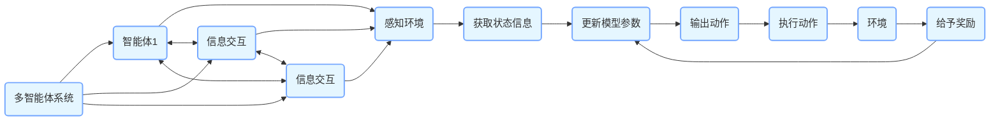

# 深度强化学习在多智能体推理协作中的应用

> 关键词：深度强化学习、多智能体系统、推理协作、马尔可夫决策过程、策略梯度算法

> 摘要：本文聚焦于深度强化学习在多智能体推理协作中的应用。首先介绍了相关的背景知识，包括目的范围、预期读者等。接着阐述了核心概念，如多智能体系统和深度强化学习的原理与联系，并给出相应的文本示意图和Mermaid流程图。详细讲解了核心算法原理，用Python代码进行了说明，同时给出数学模型和公式并举例。通过项目实战展示了代码实现和详细解读。探讨了实际应用场景，推荐了学习资源、开发工具框架以及相关论文著作。最后总结了未来发展趋势与挑战，还提供了常见问题解答和扩展阅读参考资料，旨在为读者全面呈现深度强化学习在多智能体推理协作领域的知识体系和应用方法。

## 1. 背景介绍 
### 1.1 目的和范围
在当今复杂的系统和环境中，多智能体系统的应用越来越广泛，如智能交通、机器人协作、网络通信等。多智能体之间的有效推理和协作是实现系统高效运行的关键。深度强化学习作为一种强大的机器学习方法，为解决多智能体推理协作问题提供了新的思路和方法。本文的目的在于深入探讨深度强化学习在多智能体推理协作中的应用，详细介绍相关的理论、算法和实践，范围涵盖从基础概念到实际应用案例，以及未来发展趋势的分析。

### 1.2 预期读者
本文预期读者包括对人工智能、机器学习、多智能体系统等领域感兴趣的科研人员、工程师、学生等。对于有一定编程基础和机器学习知识的读者，能够更深入地理解本文所阐述的内容；而对于初学者，也可以通过本文初步了解深度强化学习在多智能体推理协作中的应用原理和方法。

### 1.3 文档结构概述
本文首先介绍背景知识，让读者对主题有初步的了解。接着阐述核心概念，包括多智能体系统和深度强化学习的基本原理以及它们之间的联系。然后详细讲解核心算法原理和具体操作步骤，并用Python代码进行说明。给出数学模型和公式，并举例进行详细讲解。通过项目实战展示代码的实际实现和详细解释。探讨实际应用场景，为读者提供实际应用的参考。推荐学习资源、开发工具框架以及相关论文著作，帮助读者进一步深入学习。最后总结未来发展趋势与挑战，提供常见问题解答和扩展阅读参考资料。

### 1.4 术语表
#### 1.4.1 核心术语定义
- **深度强化学习（Deep Reinforcement Learning）**：结合了深度学习和强化学习的方法，通过深度神经网络来学习最优策略，以在环境中获得最大的累积奖励。
- **多智能体系统（Multi - Agent System）**：由多个智能体组成的系统，这些智能体可以感知环境、进行决策并采取行动，它们之间通过交互和协作来实现共同或各自的目标。
- **推理协作（Reasoning and Collaboration）**：智能体在多智能体系统中，通过对环境信息和其他智能体行为的推理，进行有效的协作以完成任务。
- **策略（Policy）**：智能体在给定状态下选择动作的规则，通常用 $\pi(a|s)$ 表示在状态 $s$ 下选择动作 $a$ 的概率。
- **奖励（Reward）**：环境在智能体采取动作后给予的反馈信号，用于表示该动作的好坏程度，智能体的目标是最大化累积奖励。

#### 1.4.2 相关概念解释
- **马尔可夫决策过程（Markov Decision Process，MDP）**：是一个用于描述强化学习问题的数学模型，由状态集合 $S$、动作集合 $A$、状态转移概率 $P(s'|s,a)$（表示在状态 $s$ 采取动作 $a$ 后转移到状态 $s'$ 的概率）、奖励函数 $R(s,a,s')$（表示在状态 $s$ 采取动作 $a$ 转移到状态 $s'$ 时获得的奖励）和折扣因子 $\gamma$ 组成。
- **策略梯度算法（Policy Gradient Algorithm）**：一类直接对策略进行优化的强化学习算法，通过计算策略的梯度来更新策略参数，以提高智能体的性能。

#### 1.4.3 缩略词列表
- **MDP**：Markov Decision Process（马尔可夫决策过程）
- **DQN**：Deep Q - Network（深度Q网络）
- **A2C**：Advantage Actor - Critic（优势演员 - 评论家算法）
- **PPO**：Proximal Policy Optimization（近端策略优化算法）

## 2. 核心概念与联系 
### 2.1 多智能体系统原理
多智能体系统由多个智能体组成，每个智能体都有自己的感知能力、决策能力和行动能力。智能体通过感知环境获取信息，根据自身的策略进行决策，并采取相应的行动。智能体之间可以通过通信、协作等方式来实现共同或各自的目标。例如，在一个机器人协作搬运任务中，每个机器人作为一个智能体，它们需要感知周围的环境（如障碍物、目标位置等），根据自身的任务和其他机器人的状态进行决策，然后采取移动、抓取等行动，通过协作完成搬运任务。

### 2.2 深度强化学习原理
深度强化学习结合了深度学习和强化学习的优势。深度学习通过深度神经网络来学习复杂的函数映射，能够处理高维的输入数据。强化学习则是通过智能体与环境的交互，根据环境给予的奖励来学习最优策略。在深度强化学习中，深度神经网络通常用于近似值函数（如Q函数）或策略函数。智能体在环境中不断地采取动作，根据环境反馈的奖励来更新网络参数，以提高策略的性能。

### 2.3 多智能体系统与深度强化学习的联系
在多智能体系统中，深度强化学习可以用于解决智能体的决策和协作问题。每个智能体可以使用深度强化学习算法来学习自己的策略，以最大化自己的奖励。同时，智能体之间的交互和协作也可以通过深度强化学习来实现。例如，智能体可以学习预测其他智能体的行为，从而更好地进行协作。多智能体系统的环境动态和智能体之间的相互作用增加了深度强化学习的复杂性，但也为解决更复杂的问题提供了可能。

### 2.4 文本示意图
多智能体系统与深度强化学习的关系可以用以下文本示意图表示：

多智能体系统包含多个智能体，每个智能体与环境进行交互。智能体通过感知环境获取状态信息，将状态信息输入到深度强化学习模型中。深度强化学习模型根据状态信息输出动作，智能体执行该动作。环境根据智能体的动作给出奖励，智能体根据奖励更新深度强化学习模型的参数，以优化策略。同时，智能体之间可以进行信息交互，共同协作完成任务。

### 2.5 Mermaid流程图


## 3. 核心算法原理 & 具体操作步骤 
### 3.1 策略梯度算法原理
策略梯度算法是一类直接对策略进行优化的强化学习算法。策略通常用一个参数化的函数 $\pi_{\theta}(a|s)$ 表示，其中 $\theta$ 是策略的参数。策略梯度算法的目标是最大化期望累积奖励 $J(\theta)$，即：

$$J(\theta) = \mathbb{E}_{\tau \sim \pi_{\theta}} \left[ \sum_{t=0}^{T} \gamma^t r_t \right]$$

其中 $\tau$ 是一个轨迹，由一系列的状态、动作和奖励组成，$\gamma$ 是折扣因子，$r_t$ 是在时间步 $t$ 获得的奖励。

根据策略梯度定理，策略梯度可以表示为：

$$\nabla_{\theta} J(\theta) = \mathbb{E}_{\tau \sim \pi_{\theta}} \left[ \sum_{t=0}^{T} \nabla_{\theta} \log \pi_{\theta}(a_t|s_t) Q^{\pi_{\theta}}(s_t,a_t) \right]$$

其中 $Q^{\pi_{\theta}}(s_t,a_t)$ 是动作价值函数，表示在策略 $\pi_{\theta}$ 下，在状态 $s_t$ 采取动作 $a_t$ 后的期望累积奖励。

### 3.2 基于策略梯度算法的多智能体协作步骤
1. **初始化**：初始化每个智能体的策略网络参数 $\theta_i$，设置折扣因子 $\gamma$、学习率 $\alpha$ 等超参数。
2. **环境交互**：每个智能体根据自己的策略 $\pi_{\theta_i}(a|s)$ 在环境中选择动作 $a_i$，执行动作后环境返回新的状态 $s'$ 和奖励 $r_i$。
3. **计算优势值**：计算每个智能体的优势值 $A^{\pi_{\theta_i}}(s_t,a_t)$，用于估计动作的好坏程度。优势值可以用不同的方法计算，例如使用评论家网络估计 $Q$ 值和 $V$ 值，然后计算 $A = Q - V$。
4. **更新策略**：根据策略梯度公式，使用梯度上升法更新每个智能体的策略网络参数：

$$\theta_i \leftarrow \theta_i + \alpha \nabla_{\theta_i} J(\theta_i)$$

5. **重复步骤2 - 4**：不断重复环境交互、计算优势值和更新策略的过程，直到达到终止条件（如达到最大训练步数、策略收敛等）。

### 3.3 Python代码实现
```python
import torch
import torch.nn as nn
import torch.optim as optim
import numpy as np

# 定义策略网络
class PolicyNetwork(nn.Module):
    def __init__(self, input_dim, output_dim):
        super(PolicyNetwork, self).__init__()
        self.fc1 = nn.Linear(input_dim, 64)
        self.fc2 = nn.Linear(64, output_dim)
        self.softmax = nn.Softmax(dim=1)

    def forward(self, x):
        x = torch.relu(self.fc1(x))
        x = self.fc2(x)
        x = self.softmax(x)
        return x

# 定义智能体类
class Agent:
    def __init__(self, input_dim, output_dim, learning_rate):
        self.policy_network = PolicyNetwork(input_dim, output_dim)
        self.optimizer = optim.Adam(self.policy_network.parameters(), lr=learning_rate)

    def get_action(self, state):
        state = torch.FloatTensor(state).unsqueeze(0)
        action_probs = self.policy_network(state)
        action = torch.multinomial(action_probs, 1).item()
        return action

    def update_policy(self, states, actions, rewards, gamma):
        states = torch.FloatTensor(states)
        actions = torch.LongTensor(actions)
        rewards = torch.FloatTensor(rewards)

        # 计算折扣累积奖励
        discounted_rewards = []
        cumulative_reward = 0
        for r in reversed(rewards):
            cumulative_reward = r + gamma * cumulative_reward
            discounted_rewards.insert(0, cumulative_reward)
        discounted_rewards = torch.FloatTensor(discounted_rewards)

        # 计算策略梯度
        action_probs = self.policy_network(states)
        log_probs = torch.log(action_probs.gather(1, actions.unsqueeze(1)).squeeze(1))
        loss = -torch.sum(log_probs * discounted_rewards)

        # 更新策略网络
        self.optimizer.zero_grad()
        loss.backward()
        self.optimizer.step()

# 模拟多智能体环境
class MultiAgentEnv:
    def __init__(self):
        self.state_dim = 5
        self.action_dim = 3
        self.num_agents = 2

    def reset(self):
        states = [np.random.rand(self.state_dim) for _ in range(self.num_agents)]
        return states

    def step(self, actions):
        next_states = [np.random.rand(self.state_dim) for _ in range(self.num_agents)]
        rewards = [np.random.rand() for _ in range(self.num_agents)]
        done = False
        return next_states, rewards, done

# 训练多智能体系统
def train_multi_agent_system(num_episodes, gamma, learning_rate):
    env = MultiAgentEnv()
    agents = [Agent(env.state_dim, env.action_dim, learning_rate) for _ in range(env.num_agents)]

    for episode in range(num_episodes):
        states = env.reset()
        episode_states = [[] for _ in range(env.num_agents)]
        episode_actions = [[] for _ in range(env.num_agents)]
        episode_rewards = [[] for _ in range(env.num_agents)]

        done = False
        while not done:
            actions = [agent.get_action(state) for agent, state in zip(agents, states)]
            next_states, rewards, done = env.step(actions)

            for i in range(env.num_agents):
                episode_states[i].append(states[i])
                episode_actions[i].append(actions[i])
                episode_rewards[i].append(rewards[i])

            states = next_states

        # 更新每个智能体的策略
        for i in range(env.num_agents):
            agents[i].update_policy(episode_states[i], episode_actions[i], episode_rewards[i], gamma)

        if episode % 10 == 0:
            print(f"Episode {episode}: Rewards = {[sum(r) for r in episode_rewards]}")

# 运行训练
train_multi_agent_system(num_episodes=100, gamma=0.99, learning_rate=0.001)
```

## 4. 数学模型和公式 & 详细讲解 & 举例说明 
### 4.1 马尔可夫决策过程（MDP）
马尔可夫决策过程是一个用于描述强化学习问题的数学模型，由以下几个部分组成：
- **状态集合 $S$**：表示环境可能处于的所有状态的集合。
- **动作集合 $A$**：表示智能体可以采取的所有动作的集合。
- **状态转移概率 $P(s'|s,a)$**：表示在状态 $s$ 采取动作 $a$ 后转移到状态 $s'$ 的概率。
- **奖励函数 $R(s,a,s')$**：表示在状态 $s$ 采取动作 $a$ 转移到状态 $s'$ 时获得的奖励。
- **折扣因子 $\gamma$**：用于权衡当前奖励和未来奖励的重要性，$0 \leq \gamma \leq 1$。

在多智能体系统中，每个智能体的决策过程可以看作是一个马尔可夫决策过程的扩展，因为智能体的决策不仅受到自身状态和动作的影响，还受到其他智能体的状态和动作的影响。

### 4.2 价值函数
在强化学习中，价值函数用于评估状态或状态 - 动作对的好坏程度。常见的价值函数有状态价值函数 $V^{\pi}(s)$ 和动作价值函数 $Q^{\pi}(s,a)$。

- **状态价值函数 $V^{\pi}(s)$**：表示在策略 $\pi$ 下，从状态 $s$ 开始的期望累积奖励，定义为：

$$V^{\pi}(s) = \mathbb{E}_{\tau \sim \pi} \left[ \sum_{t=0}^{\infty} \gamma^t r_t | s_0 = s \right]$$

- **动作价值函数 $Q^{\pi}(s,a)$**：表示在策略 $\pi$ 下，在状态 $s$ 采取动作 $a$ 后的期望累积奖励，定义为：

$$Q^{\pi}(s,a) = \mathbb{E}_{\tau \sim \pi} \left[ \sum_{t=0}^{\infty} \gamma^t r_t | s_0 = s, a_0 = a \right]$$

### 4.3 贝尔曼方程
贝尔曼方程是强化学习中的重要方程，用于描述价值函数的递归关系。

- **状态价值函数的贝尔曼方程**：

$$V^{\pi}(s) = \sum_{a \in A} \pi(a|s) \sum_{s' \in S} P(s'|s,a) \left[ R(s,a,s') + \gamma V^{\pi}(s') \right]$$

- **动作价值函数的贝尔曼方程**：

$$Q^{\pi}(s,a) = \sum_{s' \in S} P(s'|s,a) \left[ R(s,a,s') + \gamma \sum_{a' \in A} \pi(a'|s') Q^{\pi}(s',a') \right]$$

### 4.4 举例说明
考虑一个简单的多智能体环境，有两个智能体在一个二维网格世界中移动。每个智能体的状态可以用其在网格中的位置表示，动作可以是上下左右移动。环境的奖励设置为：智能体到达目标位置获得正奖励，撞到障碍物获得负奖励。

假设智能体 1 的当前状态为 $s_1$，采取动作 $a_1$，根据状态转移概率 $P(s_1'|s_1,a_1)$ 转移到新状态 $s_1'$，并获得奖励 $R(s_1,a_1,s_1')$。智能体 2 的状态和动作也会影响环境的动态和智能体 1 的奖励。

根据贝尔曼方程，智能体 1 的动作价值函数 $Q^{\pi}(s_1,a_1)$ 可以计算为：

$$Q^{\pi}(s_1,a_1) = \sum_{s_1' \in S} P(s_1'|s_1,a_1) \left[ R(s_1,a_1,s_1') + \gamma \sum_{a_1' \in A} \pi(a_1'|s_1') Q^{\pi}(s_1',a_1') \right]$$

智能体 1 可以根据 $Q$ 值选择最优动作，以最大化期望累积奖励。

## 5. 项目实战：代码实际案例和详细解释说明 
### 5.1  开发环境搭建
1. **安装Python**：建议使用Python 3.6及以上版本，可以从Python官方网站（https://www.python.org/downloads/）下载并安装。
2. **安装深度学习框架**：本文使用PyTorch作为深度学习框架，可以根据自己的系统和CUDA版本选择合适的安装方式，具体安装命令可以参考PyTorch官方网站（https://pytorch.org/get-started/locally/）。例如，在没有CUDA支持的情况下，可以使用以下命令安装：

```sh
pip install torch torchvision
```

3. **安装其他依赖库**：还需要安装一些其他的依赖库，如NumPy等，可以使用以下命令安装：

```sh
pip install numpy
```

### 5.2  源代码详细实现和代码解读
以下是上述多智能体系统训练代码的详细解读：

```python
import torch
import torch.nn as nn
import torch.optim as optim
import numpy as np

# 定义策略网络
class PolicyNetwork(nn.Module):
    def __init__(self, input_dim, output_dim):
        super(PolicyNetwork, self).__init__()
        self.fc1 = nn.Linear(input_dim, 64)
        self.fc2 = nn.Linear(64, output_dim)
        self.softmax = nn.Softmax(dim=1)

    def forward(self, x):
        x = torch.relu(self.fc1(x))
        x = self.fc2(x)
        x = self.softmax(x)
        return x
```
- **`PolicyNetwork` 类**：定义了一个简单的策略网络，包含两个全连接层和一个Softmax层。输入维度为 `input_dim`，输出维度为 `output_dim`。`forward` 方法实现了前向传播过程，将输入通过两个全连接层和ReLU激活函数，最后通过Softmax层输出动作概率分布。

```python
# 定义智能体类
class Agent:
    def __init__(self, input_dim, output_dim, learning_rate):
        self.policy_network = PolicyNetwork(input_dim, output_dim)
        self.optimizer = optim.Adam(self.policy_network.parameters(), lr=learning_rate)

    def get_action(self, state):
        state = torch.FloatTensor(state).unsqueeze(0)
        action_probs = self.policy_network(state)
        action = torch.multinomial(action_probs, 1).item()
        return action

    def update_policy(self, states, actions, rewards, gamma):
        states = torch.FloatTensor(states)
        actions = torch.LongTensor(actions)
        rewards = torch.FloatTensor(rewards)

        # 计算折扣累积奖励
        discounted_rewards = []
        cumulative_reward = 0
        for r in reversed(rewards):
            cumulative_reward = r + gamma * cumulative_reward
            discounted_rewards.insert(0, cumulative_reward)
        discounted_rewards = torch.FloatTensor(discounted_rewards)

        # 计算策略梯度
        action_probs = self.policy_network(states)
        log_probs = torch.log(action_probs.gather(1, actions.unsqueeze(1)).squeeze(1))
        loss = -torch.sum(log_probs * discounted_rewards)

        # 更新策略网络
        self.optimizer.zero_grad()
        loss.backward()
        self.optimizer.step()
```
- **`Agent` 类**：定义了智能体的行为和更新策略的方法。
  - `__init__` 方法：初始化策略网络和优化器。
  - `get_action` 方法：根据当前状态，通过策略网络输出动作概率分布，然后使用 `torch.multinomial` 函数从概率分布中采样得到动作。
  - `update_policy` 方法：根据收集到的状态、动作和奖励，计算折扣累积奖励，然后计算策略梯度，最后使用优化器更新策略网络的参数。

```python
# 模拟多智能体环境
class MultiAgentEnv:
    def __init__(self):
        self.state_dim = 5
        self.action_dim = 3
        self.num_agents = 2

    def reset(self):
        states = [np.random.rand(self.state_dim) for _ in range(self.num_agents)]
        return states

    def step(self, actions):
        next_states = [np.random.rand(self.state_dim) for _ in range(self.num_agents)]
        rewards = [np.random.rand() for _ in range(self.num_agents)]
        done = False
        return next_states, rewards, done
```
- **`MultiAgentEnv` 类**：模拟了一个多智能体环境。
  - `__init__` 方法：初始化环境的状态维度、动作维度和智能体数量。
  - `reset` 方法：重置环境，返回每个智能体的初始状态。
  - `step` 方法：根据智能体的动作，返回下一个状态、奖励和是否终止的标志。

```python
# 训练多智能体系统
def train_multi_agent_system(num_episodes, gamma, learning_rate):
    env = MultiAgentEnv()
    agents = [Agent(env.state_dim, env.action_dim, learning_rate) for _ in range(env.num_agents)]

    for episode in range(num_episodes):
        states = env.reset()
        episode_states = [[] for _ in range(env.num_agents)]
        episode_actions = [[] for _ in range(env.num_agents)]
        episode_rewards = [[] for _ in range(env.num_agents)]

        done = False
        while not done:
            actions = [agent.get_action(state) for agent, state in zip(agents, states)]
            next_states, rewards, done = env.step(actions)

            for i in range(env.num_agents):
                episode_states[i].append(states[i])
                episode_actions[i].append(actions[i])
                episode_rewards[i].append(rewards[i])

            states = next_states

        # 更新每个智能体的策略
        for i in range(env.num_agents):
            agents[i].update_policy(episode_states[i], episode_actions[i], episode_rewards[i], gamma)

        if episode % 10 == 0:
            print(f"Episode {episode}: Rewards = {[sum(r) for r in episode_rewards]}")

# 运行训练
train_multi_agent_system(num_episodes=100, gamma=0.99, learning_rate=0.001)
```
- **`train_multi_agent_system` 函数**：实现了多智能体系统的训练过程。
  - 初始化环境和智能体。
  - 进行多个回合的训练，每个回合中智能体与环境交互，收集状态、动作和奖励。
  - 每个回合结束后，更新每个智能体的策略。
  - 每10个回合打印一次奖励信息。

### 5.3  代码解读与分析
- **优点**：
  - 代码结构清晰，将策略网络、智能体和环境分别封装成类，易于理解和扩展。
  - 使用策略梯度算法直接对策略进行优化，避免了值函数估计的误差。
  - 可以通过调整超参数（如学习率、折扣因子等）来优化训练效果。
- **缺点**：
  - 模拟环境比较简单，状态和奖励是随机生成的，不能真实反映实际多智能体系统的复杂性。
  - 策略梯度算法的训练过程可能比较不稳定，需要进行更多的优化和调整。
- **改进方向**：
  - 可以使用更复杂的环境，如OpenAI Gym中的多智能体环境，来提高代码的实用性。
  - 可以使用更先进的策略梯度算法，如近端策略优化算法（PPO），来提高训练的稳定性和效率。

## 6. 实际应用场景 
### 6.1 智能交通
在智能交通系统中，多个车辆可以看作是多个智能体。车辆需要根据周围的交通状况（如其他车辆的位置、速度、交通信号等）进行决策，选择合适的行驶速度和路线。深度强化学习可以用于训练车辆的智能驾驶策略，使车辆能够在复杂的交通环境中安全、高效地行驶。同时，车辆之间可以通过协作来优化交通流量，减少拥堵。例如，车辆可以通过通信共享信息，协调加速、减速和变道等动作。

### 6.2 机器人协作
在机器人协作任务中，多个机器人需要共同完成一个复杂的任务，如搬运、装配等。每个机器人需要感知环境和其他机器人的状态，根据任务要求进行决策和行动。深度强化学习可以用于训练机器人的协作策略，使机器人能够根据环境的变化和其他机器人的行为进行实时调整，提高协作效率。例如，在机器人搬运任务中，机器人可以通过协作规划最优的搬运路径，避免碰撞和重复劳动。

### 6.3 网络通信
在网络通信中，多个节点（如路由器、基站等）可以看作是多个智能体。节点需要根据网络的状态（如带宽、延迟、流量等）进行决策，选择合适的路由和资源分配策略。深度强化学习可以用于训练节点的智能决策策略，使网络能够自适应地调整资源分配，提高网络的性能和可靠性。例如，在无线网络中，基站可以根据用户的需求和信道条件，动态地分配带宽和功率，提高用户的满意度。

### 6.4 游戏
在多玩家游戏中，每个玩家可以看作是一个智能体。玩家需要根据游戏的状态和其他玩家的行为进行决策，选择合适的策略和行动。深度强化学习可以用于训练玩家的智能策略，使玩家能够在游戏中取得更好的成绩。例如，在策略游戏中，玩家可以通过学习其他玩家的策略，调整自己的战术，提高胜率。

## 7. 工具和资源推荐
### 7.1 学习资源推荐
#### 7.1.1 书籍推荐
- 《Reinforcement Learning: An Introduction》（《强化学习：原理与Python实现》）：这是一本经典的强化学习教材，详细介绍了强化学习的基本概念、算法和应用。
- 《Deep Learning》（《深度学习》）：由Ian Goodfellow、Yoshua Bengio和Aaron Courville合著，是深度学习领域的权威教材，对深度强化学习的理论基础有很好的介绍。
- 《Multi - Agent Systems: Algorithmic, Game - Theoretic, and Logical Foundations》（《多智能体系统：算法、博弈论和逻辑基础》）：介绍了多智能体系统的基本理论和方法，对于理解多智能体推理协作有很大的帮助。

#### 7.1.2 在线课程
- Coursera上的“Reinforcement Learning Specialization”：由DeepMind的David Silver教授授课，是一门非常受欢迎的强化学习在线课程，涵盖了强化学习的各个方面。
- edX上的“Introduction to Artificial Intelligence”：介绍了人工智能的基本概念和方法，包括多智能体系统和强化学习的相关内容。
- OpenAI Spinning Up：OpenAI提供的一个强化学习教程，包含了强化学习的基本概念、算法实现和实践案例。

#### 7.1.3 技术博客和网站
- OpenAI博客（https://openai.com/blog/）：OpenAI发布的最新研究成果和技术文章，对于了解深度强化学习的前沿动态有很大的帮助。
- DeepMind博客（https://deepmind.com/blog/）：DeepMind发布的关于人工智能和强化学习的研究成果和技术文章。
- arXiv（https://arxiv.org/）：一个预印本平台，包含了大量的学术论文，其中有很多关于深度强化学习和多智能体系统的研究论文。

### 7.2 开发工具框架推荐
#### 7.2.1 IDE和编辑器
- PyCharm：一款功能强大的Python集成开发环境，提供了代码编辑、调试、版本控制等功能，对于开发深度强化学习项目非常方便。
- Jupyter Notebook：一个交互式的开发环境，适合进行代码实验和数据分析，可以实时查看代码的运行结果。
- Visual Studio Code：一款轻量级的代码编辑器，支持多种编程语言和插件，具有丰富的扩展功能。

#### 7.2.2 调试和性能分析工具
- TensorBoard：TensorFlow提供的一个可视化工具，可以用于查看训练过程中的损失函数、奖励曲线等信息，帮助调试和优化模型。
- PyTorch Profiler：PyTorch提供的性能分析工具，可以用于分析模型的计算时间、内存使用等情况，帮助优化模型性能。
- cProfile：Python内置的性能分析工具，可以用于分析Python代码的运行时间和函数调用情况。

#### 7.2.3 相关框架和库
- PyTorch：一个开源的深度学习框架，提供了丰富的神经网络模块和优化算法，对于实现深度强化学习算法非常方便。
- TensorFlow：另一个流行的深度学习框架，具有强大的分布式计算能力和模型部署功能。
- OpenAI Gym：一个开源的强化学习环境库，提供了多种不同的环境，方便进行强化学习算法的实验和测试。
- PettingZoo：一个多智能体强化学习环境库，提供了多种多智能体环境，适合进行多智能体强化学习的研究和开发。

### 7.3 相关论文著作推荐
#### 7.3.1 经典论文
- “Playing Atari with Deep Reinforcement Learning”：这篇论文提出了深度Q网络（DQN）算法，是深度强化学习领域的经典之作。
- “Asynchronous Methods for Deep Reinforcement Learning”：提出了异步优势演员 - 评论家算法（A3C），提高了深度强化学习的训练效率。
- “Proximal Policy Optimization Algorithms”：提出了近端策略优化算法（PPO），是一种高效稳定的策略梯度算法。

#### 7.3.2 最新研究成果
- 关注NeurIPS、ICML、AAAI等顶级人工智能会议的最新论文，了解深度强化学习和多智能体系统的最新研究进展。
- 关注相关领域的学术期刊，如Journal of Artificial Intelligence Research（JAIR）、Artificial Intelligence等。

#### 7.3.3 应用案例分析
- 研究一些实际应用中的深度强化学习和多智能体系统案例，如AlphaGo、OpenAI Five等，了解它们的技术原理和实现方法。
- 分析一些工业界的应用案例，如智能交通、机器人协作等领域的应用，学习如何将深度强化学习和多智能体系统应用到实际问题中。

## 8. 总结：未来发展趋势与挑战
### 8.1 未来发展趋势
- **更复杂的多智能体协作**：未来的多智能体系统将面临更复杂的任务和环境，需要智能体之间进行更深入的协作和推理。例如，在智能城市中，多个交通、能源、环境等领域的智能体需要协同工作，实现城市的可持续发展。
- **结合其他技术**：深度强化学习将与其他技术，如计算机视觉、自然语言处理等相结合，实现更强大的智能体。例如，智能机器人可以通过计算机视觉感知环境，通过自然语言处理与人类进行交互，同时使用深度强化学习进行决策和行动。
- **可解释性和安全性**：随着深度强化学习在关键领域的应用越来越广泛，对智能体决策的可解释性和安全性的要求也越来越高。未来的研究将致力于提高深度强化学习算法的可解释性和安全性，确保智能体的决策是可理解和可靠的。
- **分布式和联邦学习**：在大规模多智能体系统中，分布式和联邦学习将成为重要的研究方向。通过分布式和联邦学习，智能体可以在不共享原始数据的情况下进行协作学习，提高数据的安全性和隐私性。

### 8.2 挑战
- **训练效率**：深度强化学习的训练过程通常比较耗时，特别是在多智能体系统中，由于智能体之间的相互作用和环境的复杂性，训练效率更低。如何提高训练效率是一个亟待解决的问题。
- **智能体之间的协调**：在多智能体系统中，智能体之间的协调是一个挑战。智能体需要根据其他智能体的行为进行决策，同时避免出现冲突和不协调的情况。如何设计有效的协调机制是一个重要的研究方向。
- **环境的不确定性**：实际环境通常具有很大的不确定性，如噪声、动态变化等。深度强化学习算法需要能够适应这种不确定性，提高智能体的鲁棒性。
- **可扩展性**：随着智能体数量的增加，多智能体系统的复杂性也会急剧增加。如何设计可扩展的算法和架构，使系统能够处理大规模的多智能体问题，是一个挑战。

## 9. 附录：常见问题与解答
### 9.1 深度强化学习和传统强化学习有什么区别？
深度强化学习结合了深度学习和强化学习的优势，使用深度神经网络来近似值函数或策略函数，能够处理高维的输入数据，如图像、语音等。而传统强化学习通常使用表格来存储值函数或策略，适用于状态和动作空间较小的问题。

### 9.2 多智能体系统中智能体之间如何通信？
智能体之间的通信方式有很多种，常见的有直接通信、广播通信、基于消息的通信等。直接通信是指智能体之间直接交换信息；广播通信是指一个智能体向所有其他智能体发送信息；基于消息的通信是指智能体通过发送和接收消息来交换信息。通信的内容可以包括状态信息、动作信息、奖励信息等。

### 9.3 如何选择合适的深度强化学习算法？
选择合适的深度强化学习算法需要考虑多个因素，如问题的类型（离散动作还是连续动作）、环境的复杂性、训练效率等。例如，对于离散动作问题，可以选择DQN、A2C等算法；对于连续动作问题，可以选择DDPG、PPO等算法。同时，还可以根据实际情况进行算法的改进和优化。

### 9.4 深度强化学习在多智能体系统中的训练过程为什么不稳定？
深度强化学习在多智能体系统中的训练过程不稳定的原因有很多，主要包括以下几点：
- **环境的动态性**：多智能体系统的环境是动态变化的，智能体的行为会影响其他智能体的状态和奖励，导致训练过程不稳定。
- **策略的相互影响**：智能体之间的策略相互影响，一个智能体的策略变化可能会导致其他智能体的奖励发生变化，从而影响训练的稳定性。
- **探索与利用的平衡**：深度强化学习需要在探索新的动作和利用已有的经验之间进行平衡，如果探索不足或过度探索，都会导致训练不稳定。

### 9.5 如何提高深度强化学习在多智能体系统中的训练效率？
可以从以下几个方面提高深度强化学习在多智能体系统中的训练效率：
- **使用并行计算**：利用GPU、分布式计算等技术，并行地进行环境交互和模型训练，提高计算效率。
- **优化算法**：选择更高效的深度强化学习算法，如PPO、A3C等，减少训练的迭代次数。
- **经验回放**：使用经验回放机制，将智能体的经验存储在回放缓冲区中，随机采样进行训练，提高数据的利用率。
- **课程学习**：采用课程学习的方法，从简单的任务开始训练，逐步增加任务的难度，提高训练的效率和稳定性。

## 10. 扩展阅读 & 参考资料
### 10.1 扩展阅读
- 《Deep Reinforcement Learning Hands-On》（《深度强化学习实战》）：这本书提供了更多深度强化学习的实践案例和代码实现，适合进一步深入学习。
- 《Game Theory: An Introduction》（《博弈论导论》）：博弈论与多智能体系统密切相关，学习博弈论可以帮助更好地理解多智能体之间的交互和协作。
- 《Probabilistic Robotics》（《概率机器人学》）：对于机器人领域的多智能体系统，概率机器人学提供了很多有用的理论和方法。

### 10.2 参考资料
- Sutton, R. S., & Barto, A. G. (2018). Reinforcement Learning: An Introduction. MIT press.
- Goodfellow, I., Bengio, Y., & Courville, A. (2016). Deep Learning. MIT press.
- Shoham, Y., & Leyton - Brown, K. (2008). Multi - Agent Systems: Algorithmic, Game - Theoretic, and Logical Foundations. Cambridge University Press.
- Mnih, V., Kavukcuoglu, K., Silver, D., Rusu, A. A., Veness, J., Bellemare, M. G., ... & Petersen, S. (2015). Human - level control through deep reinforcement learning. Nature, 518(7540), 529 - 533.
- Mnih, V., Badia, A. P., Mirza, M., Graves, A., Lillicrap, T., Harley, T., ... & Kavukcuoglu, K. (2016). Asynchronous methods for deep reinforcement learning. In International conference on machine learning (pp. 1928 - 1937).
- Schulman, J., Wolski, F., Dhariwal, P., Radford, A., & Klimov, O. (2017). Proximal policy optimization algorithms. arXiv preprint arXiv:1707.06347.