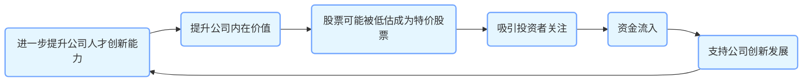

# 特价股票与公司人才创新能力的关系探讨

> 关键词：特价股票、公司人才、创新能力、股票价值、企业发展

> 摘要：本文旨在深入探讨特价股票与公司人才创新能力之间的关系。通过对相关概念的阐述、理论原理的分析、数学模型的构建以及实际案例的研究，揭示两者之间内在的联系和相互影响机制。了解这种关系对于投资者评估股票价值、企业管理者制定人才战略以及推动企业创新发展都具有重要意义。同时，文章还对实际应用场景、相关工具资源进行了介绍，并对未来发展趋势与挑战进行了总结，为相关领域的研究和实践提供了全面的参考。

## 1. 背景介绍 
### 1.1 目的和范围
本研究的主要目的是全面分析特价股票与公司人才创新能力之间的关系。在当今竞争激烈的商业环境中，股票市场的表现与公司的内在价值密切相关，而公司的人才创新能力又是决定其长期竞争力和价值的关键因素。通过探讨两者的关系，我们希望能够为投资者提供更准确的股票价值评估方法，为企业管理者提供人才战略制定的参考依据，促进企业的可持续发展。

本研究的范围涵盖了不同行业、不同规模的企业，以及国内外的股票市场。通过对各种案例和数据的分析，力求得出具有普遍性和代表性的结论。

### 1.2 预期读者
本文的预期读者包括股票投资者、企业管理者、金融分析师、学术研究人员以及对企业创新和股票市场感兴趣的人士。对于投资者来说，了解特价股票与公司人才创新能力的关系有助于他们做出更明智的投资决策；企业管理者可以从中获取有关人才战略和创新发展的启示；金融分析师可以将其作为评估股票价值和企业竞争力的重要参考；学术研究人员可以在此基础上进行更深入的理论研究；而对相关领域感兴趣的人士则可以通过本文了解到这两个重要概念之间的内在联系。

### 1.3 文档结构概述
本文共分为十个部分。第一部分为背景介绍，阐述了研究的目的、范围、预期读者和文档结构概述，并对相关术语进行了定义和解释。第二部分介绍了核心概念与联系，包括特价股票和公司人才创新能力的定义、原理和架构，并通过文本示意图和 Mermaid 流程图进行了直观展示。第三部分详细讲解了核心算法原理和具体操作步骤，使用 Python 源代码进行了详细阐述。第四部分构建了数学模型和公式，并进行了详细讲解和举例说明。第五部分通过项目实战，给出了代码实际案例和详细解释说明，包括开发环境搭建、源代码实现和代码解读与分析。第六部分探讨了实际应用场景，分析了这种关系在不同领域的具体应用。第七部分推荐了相关的工具和资源，包括学习资源、开发工具框架和论文著作。第八部分总结了未来发展趋势与挑战，对研究的前景进行了展望。第九部分为附录，解答了常见问题。第十部分提供了扩展阅读和参考资料，方便读者进一步深入研究。

### 1.4 术语表
#### 1.4.1 核心术语定义
- **特价股票**：指市场价格相对其内在价值较低的股票。通常是由于市场短期波动、投资者情绪、行业竞争等因素导致股票价格被低估。
- **公司人才创新能力**：指公司内部员工所具备的创新思维、创新技能和创新实践能力，以及公司为支持和促进创新所提供的组织环境、制度保障和资源配置等方面的综合能力。

#### 1.4.2 相关概念解释
- **股票内在价值**：是指股票未来预期现金流的现值，它反映了公司的基本面和长期发展潜力。股票的市场价格会围绕其内在价值波动，但由于市场的不确定性和投资者的非理性行为，两者之间可能会出现偏离。
- **创新**：是指创造新的产品、服务、技术、流程或商业模式等，以满足市场需求、提高企业竞争力和创造价值的过程。创新不仅仅是技术创新，还包括管理创新、营销创新等多个方面。

#### 1.4.3 缩略词列表
- **PE**：市盈率（Price-to-Earnings Ratio），是指股票价格与每股收益的比率，用于衡量股票的估值水平。
- **ROE**：净资产收益率（Return on Equity），是指净利润与股东权益的比率，反映了公司运用自有资本的效率。

## 2. 核心概念与联系 
### 2.1 特价股票的原理和架构
特价股票的形成主要是由于市场的无效性和信息不对称。市场参与者的情绪、短期的宏观经济因素、行业竞争态势等都会导致股票价格的波动，从而使得一些股票的市场价格低于其内在价值。

特价股票的评估通常基于对公司基本面的分析，包括财务状况、行业地位、竞争优势等。常见的评估方法有市盈率法、市净率法、现金流折现法等。

下面是特价股票评估的文本示意图：

```plaintext
特价股票评估
|-- 基本面分析
|   |-- 财务状况
|   |   |-- 盈利能力
|   |   |-- 偿债能力
|   |   |-- 运营能力
|   |-- 行业地位
|   |   |-- 市场份额
|   |   |-- 竞争优势
|   |-- 发展前景
|       |-- 行业趋势
|       |-- 公司战略
|-- 估值方法
|   |-- 市盈率法
|   |-- 市净率法
|   |-- 现金流折现法
```

### 2.2 公司人才创新能力的原理和架构
公司人才创新能力的形成依赖于公司的人才资源管理和创新文化建设。公司需要吸引、培养和留住具有创新能力的人才，并为他们提供良好的创新环境和激励机制。

公司人才创新能力的评估可以从人才素质、创新投入、创新产出等多个维度进行。人才素质包括员工的专业技能、创新思维、团队协作能力等；创新投入包括研发费用、人力资源投入等；创新产出包括专利数量、新产品销售额等。

下面是公司人才创新能力评估的文本示意图：

```plaintext
公司人才创新能力评估
|-- 人才素质
|   |-- 专业技能
|   |-- 创新思维
|   |-- 团队协作能力
|-- 创新投入
|   |-- 研发费用
|   |-- 人力资源投入
|-- 创新产出
|   |-- 专利数量
|   |-- 新产品销售额
|   |-- 创新奖项
```

### 2.3 特价股票与公司人才创新能力的联系
特价股票与公司人才创新能力之间存在着密切的联系。一方面，具有较强人才创新能力的公司往往具有更高的长期发展潜力和内在价值，其股票可能被市场低估，成为特价股票。另一方面，特价股票所代表的公司如果能够充分发挥人才创新能力，实现创新突破，将有助于提升公司的市场竞争力和股票价值。

下面是两者关系的 Mermaid 流程图：



## 3. 核心算法原理 & 具体操作步骤 
### 3.1 特价股票筛选算法原理
特价股票筛选的核心思想是通过对股票的基本面数据进行分析，找出市场价格低于其内在价值的股票。常用的方法是基于市盈率（PE）和市净率（PB）的筛选方法。

市盈率是指股票价格与每股收益的比率，市净率是指股票价格与每股净资产的比率。一般来说，市盈率和市净率较低的股票可能被低估。

以下是使用 Python 实现的特价股票筛选算法示例：

```python
import pandas as pd

def screen_bargain_stocks(data, pe_threshold, pb_threshold):
    """
    筛选特价股票
    :param data: 股票数据，包含 'PE', 'PB', 'StockCode', 'StockName' 列
    :param pe_threshold: 市盈率阈值
    :param pb_threshold: 市净率阈值
    :return: 筛选后的特价股票数据
    """
    bargain_stocks = data[(data['PE'] < pe_threshold) & (data['PB'] < pb_threshold)]
    return bargain_stocks

# 示例数据
data = pd.DataFrame({
    'StockCode': ['000001', '000002', '000003'],
    'StockName': ['StockA', 'StockB', 'StockC'],
    'PE': [10, 20, 5],
    'PB': [1.5, 2.5, 1.0]
})

# 筛选特价股票
pe_threshold = 15
pb_threshold = 2
bargain_stocks = screen_bargain_stocks(data, pe_threshold, pb_threshold)
print(bargain_stocks)
```

### 3.2 公司人才创新能力评估算法原理
公司人才创新能力评估可以通过构建综合评价指标体系来实现。我们可以选取人才素质、创新投入、创新产出等方面的指标，为每个指标赋予相应的权重，然后计算综合得分。

以下是使用 Python 实现的公司人才创新能力评估算法示例：

```python
import pandas as pd

def evaluate_innovation_ability(data, weights):
    """
    评估公司人才创新能力
    :param data: 公司数据，包含人才素质、创新投入、创新产出等指标列
    :param weights: 各指标的权重，字典类型
    :return: 公司人才创新能力综合得分
    """
    scores = data.copy()
    for column in data.columns:
        scores[column] = scores[column] * weights[column]
    scores['TotalScore'] = scores.sum(axis=1)
    return scores

# 示例数据
data = pd.DataFrame({
    'CompanyName': ['CompanyA', 'CompanyB', 'CompanyC'],
    'TalentQuality': [80, 70, 90],
    'InnovationInput': [75, 85, 80],
    'InnovationOutput': [85, 75, 95]
})

# 指标权重
weights = {
    'TalentQuality': 0.3,
    'InnovationInput': 0.3,
    'InnovationOutput': 0.4
}

# 评估公司人才创新能力
scores = evaluate_innovation_ability(data, weights)
print(scores)
```

### 3.3 具体操作步骤
1. **数据收集**：收集股票的基本面数据，包括市盈率、市净率等；收集公司的人才创新能力相关数据，包括人才素质、创新投入、创新产出等。
2. **数据预处理**：对收集到的数据进行清洗、整理和标准化处理，确保数据的质量和一致性。
3. **特价股票筛选**：使用上述特价股票筛选算法，根据设定的市盈率和市净率阈值筛选出特价股票。
4. **公司人才创新能力评估**：使用上述公司人才创新能力评估算法，根据设定的指标权重计算公司的人才创新能力综合得分。
5. **关系分析**：将筛选出的特价股票与公司人才创新能力评估结果进行关联分析，找出两者之间的关系。

## 4. 数学模型和公式 & 详细讲解 & 举例说明 
### 4.1 特价股票估值模型
常用的特价股票估值模型是现金流折现模型（DCF）。该模型的基本思想是将股票未来预期的现金流折现到当前，得到股票的内在价值。

现金流折现模型的公式为：

$$V = \sum_{t=1}^{n} \frac{CF_t}{(1 + r)^t} + \frac{TV}{(1 + r)^n}$$

其中：
- $V$ 表示股票的内在价值
- $CF_t$ 表示第 $t$ 期的预期现金流
- $r$ 表示折现率
- $n$ 表示预测期数
- $TV$ 表示终值

### 4.2 公司人才创新能力综合评价模型
公司人才创新能力综合评价模型可以采用加权平均法。设 $x_1, x_2, \cdots, x_m$ 为各评价指标的得分，$w_1, w_2, \cdots, w_m$ 为各指标的权重，且 $\sum_{i=1}^{m} w_i = 1$，则公司人才创新能力综合得分 $S$ 的计算公式为：

$$S = \sum_{i=1}^{m} w_i x_i$$

### 4.3 举例说明
#### 4.3.1 特价股票估值模型举例
假设某公司未来三年的预期现金流分别为 100 万元、120 万元、150 万元，折现率为 10%，三年后公司的终值为 1000 万元。则该公司股票的内在价值为：

$$V = \frac{100}{(1 + 0.1)^1} + \frac{120}{(1 + 0.1)^2} + \frac{150}{(1 + 0.1)^3} + \frac{1000}{(1 + 0.1)^3}$$

$$V = \frac{100}{1.1} + \frac{120}{1.21} + \frac{150}{1.331} + \frac{1000}{1.331}$$

$$V \approx 90.91 + 99.17 + 112.69 + 751.31$$

$$V \approx 1054.08 \text{（万元）}$$

#### 4.3.2 公司人才创新能力综合评价模型举例
假设某公司的人才素质、创新投入、创新产出指标得分分别为 80 分、75 分、85 分，对应的权重分别为 0.3、0.3、0.4。则该公司人才创新能力综合得分 $S$ 为：

$$S = 0.3 \times 80 + 0.3 \times 75 + 0.4 \times 85$$

$$S = 24 + 22.5 + 34$$

$$S = 80.5 \text{（分）}$$

## 5. 项目实战：代码实际案例和详细解释说明 
### 5.1  开发环境搭建
本次项目实战使用 Python 进行开发，需要安装以下库：
- `pandas`：用于数据处理和分析
- `numpy`：用于数值计算
- `matplotlib`：用于数据可视化

可以使用以下命令安装这些库：

```sh
pip install pandas numpy matplotlib
```

### 5.2  源代码详细实现和代码解读
#### 5.2.1 数据收集和预处理
```python
import pandas as pd

# 模拟数据收集
stock_data = pd.DataFrame({
    'StockCode': ['000001', '000002', '000003'],
    'StockName': ['StockA', 'StockB', 'StockC'],
    'PE': [10, 20, 5],
    'PB': [1.5, 2.5, 1.0]
})

company_data = pd.DataFrame({
    'CompanyName': ['CompanyA', 'CompanyB', 'CompanyC'],
    'TalentQuality': [80, 70, 90],
    'InnovationInput': [75, 85, 80],
    'InnovationOutput': [85, 75, 95]
})

# 数据预处理
# 这里可以进行数据清洗、缺失值处理等操作，示例中暂不处理
```

#### 5.2.2 特价股票筛选
```python
def screen_bargain_stocks(data, pe_threshold, pb_threshold):
    """
    筛选特价股票
    :param data: 股票数据，包含 'PE', 'PB', 'StockCode', 'StockName' 列
    :param pe_threshold: 市盈率阈值
    :param pb_threshold: 市净率阈值
    :return: 筛选后的特价股票数据
    """
    bargain_stocks = data[(data['PE'] < pe_threshold) & (data['PB'] < pb_threshold)]
    return bargain_stocks

# 筛选特价股票
pe_threshold = 15
pb_threshold = 2
bargain_stocks = screen_bargain_stocks(stock_data, pe_threshold, pb_threshold)
print("特价股票：")
print(bargain_stocks)
```

#### 5.2.3 公司人才创新能力评估
```python
def evaluate_innovation_ability(data, weights):
    """
    评估公司人才创新能力
    :param data: 公司数据，包含人才素质、创新投入、创新产出等指标列
    :param weights: 各指标的权重，字典类型
    :return: 公司人才创新能力综合得分
    """
    scores = data.copy()
    for column in data.columns:
        if column != 'CompanyName':
            scores[column] = scores[column] * weights[column]
    scores['TotalScore'] = scores.drop('CompanyName', axis=1).sum(axis=1)
    return scores

# 指标权重
weights = {
    'TalentQuality': 0.3,
    'InnovationInput': 0.3,
    'InnovationOutput': 0.4
}

# 评估公司人才创新能力
scores = evaluate_innovation_ability(company_data, weights)
print("公司人才创新能力得分：")
print(scores)
```

### 5.3  代码解读与分析
#### 5.3.1 数据收集和预处理
在这部分代码中，我们使用 `pandas` 库模拟了股票数据和公司数据的收集。实际应用中，这些数据可以从金融数据库、公司年报等渠道获取。数据预处理部分，我们只是简单地创建了数据，实际中可能需要对数据进行清洗、缺失值处理、异常值处理等操作，以确保数据的质量。

#### 5.3.2 特价股票筛选
`screen_bargain_stocks` 函数通过对股票数据的市盈率和市净率进行筛选，找出低于设定阈值的股票，作为特价股票。这个函数的核心是使用布尔索引对 `pandas` 数据框进行筛选操作。

#### 5.3.3 公司人才创新能力评估
`evaluate_innovation_ability` 函数根据设定的指标权重，对公司的人才素质、创新投入、创新产出等指标进行加权求和，计算出公司人才创新能力的综合得分。这个函数的核心是使用循环遍历各指标列，进行加权计算，并将结果相加得到综合得分。

## 6. 实际应用场景 
### 6.1 投资者决策
对于股票投资者来说，了解特价股票与公司人才创新能力的关系可以帮助他们做出更明智的投资决策。投资者可以通过筛选特价股票，找出那些被市场低估但具有较强人才创新能力的公司股票。这些公司往往具有更高的长期发展潜力，其股票价格有望在未来上涨。投资者可以在股票价格被低估时买入，等待公司的创新成果转化为实际的经济效益，从而获得投资收益。

### 6.2 企业战略制定
企业管理者可以通过评估公司的人才创新能力，了解公司在行业中的竞争地位和发展潜力。如果公司的人才创新能力较强，但股票价格被低估，企业管理者可以采取措施提升公司的市场形象和知名度，吸引投资者的关注，提高股票价格。同时，企业管理者还可以根据人才创新能力的评估结果，制定相应的人才战略和创新战略，加大对创新的投入，培养和吸引更多具有创新能力的人才，进一步提升公司的竞争力。

### 6.3 行业研究和政策制定
对于行业研究人员和政策制定者来说，研究特价股票与公司人才创新能力的关系可以帮助他们了解行业的发展趋势和创新活力。通过分析不同行业中特价股票的分布和公司人才创新能力的差异，可以发现行业中存在的问题和机遇，为行业政策的制定提供参考依据。例如，对于人才创新能力较强但股票价格普遍较低的行业，可以出台相关政策支持行业的发展，提高行业的整体竞争力。

## 7. 工具和资源推荐
### 7.1 学习资源推荐
#### 7.1.1 书籍推荐
- 《聪明的投资者》（The Intelligent Investor）：作者是本杰明·格雷厄姆（Benjamin Graham），这本书是价值投资的经典著作，详细介绍了股票投资的基本原理和方法，对于理解特价股票的概念和评估方法具有重要的指导意义。
- 《创新者的窘境》（The Innovator's Dilemma）：作者是克莱顿·克里斯坦森（Clayton Christensen），这本书探讨了企业创新的重要性和面临的挑战，对于理解公司人才创新能力的培养和提升具有重要的启示作用。
- 《Python 数据分析实战》（Python for Data Analysis）：作者是韦斯·麦金尼（Wes McKinney），这本书详细介绍了使用 Python 进行数据分析的方法和技巧，对于实现本文中的算法和进行数据处理具有重要的参考价值。

#### 7.1.2 在线课程
- Coursera 上的“Financial Markets”：由耶鲁大学教授罗伯特·席勒（Robert Shiller）授课，该课程介绍了金融市场的基本原理和运行机制，对于理解股票市场和投资决策具有重要的帮助。
- edX 上的“Introduction to Innovation and Entrepreneurship”：由麻省理工学院（MIT）教授授课，该课程介绍了创新和创业的基本概念和方法，对于理解公司人才创新能力的培养和企业创新发展具有重要的启示作用。
- 中国大学 MOOC 上的“Python 语言程序设计”：由北京理工大学教授嵩天授课，该课程介绍了 Python 语言的基本语法和编程技巧，对于学习 Python 编程和实现本文中的算法具有重要的基础作用。

#### 7.1.3 技术博客和网站
- 雪球网（https://xueqiu.com/）：是一个专业的股票投资社区，提供了丰富的股票数据、分析工具和投资者交流平台，对于了解股票市场和特价股票的信息具有重要的帮助。
- 36氪（https://36kr.com/）：是一个专注于创新和创业的媒体平台，提供了大量的创新企业案例和行业分析文章，对于了解公司人才创新能力和企业创新发展的动态具有重要的参考价值。
- 开源中国（https://www.oschina.net/）：是一个开源技术社区，提供了丰富的开源项目和技术文章，对于学习 Python 编程和数据分析技术具有重要的帮助。

### 7.2 开发工具框架推荐
#### 7.2.1 IDE和编辑器
- PyCharm：是一款专业的 Python 集成开发环境（IDE），提供了丰富的代码编辑、调试、版本控制等功能，对于开发 Python 程序具有重要的帮助。
- Jupyter Notebook：是一个交互式的编程环境，支持多种编程语言，特别适合进行数据分析和可视化。通过 Jupyter Notebook，我们可以方便地进行代码的编写、运行和结果展示，对于实现本文中的算法和进行数据分析具有重要的作用。

#### 7.2.2 调试和性能分析工具
- pdb：是 Python 自带的调试工具，可以帮助我们在程序运行过程中进行单步调试、查看变量值等操作，对于查找程序中的错误和理解程序的执行流程具有重要的帮助。
- cProfile：是 Python 自带的性能分析工具，可以帮助我们分析程序的性能瓶颈，找出执行时间较长的函数和代码段，对于优化程序的性能具有重要的作用。

#### 7.2.3 相关框架和库
- pandas：是一个强大的数据处理和分析库，提供了丰富的数据结构和数据操作方法，对于处理股票数据和公司人才创新能力数据具有重要的作用。
- numpy：是一个用于数值计算的库，提供了高效的数组操作和数学函数，对于实现本文中的算法和进行数值计算具有重要的帮助。
- matplotlib：是一个用于数据可视化的库，提供了丰富的绘图函数和工具，对于展示特价股票筛选结果和公司人才创新能力评估结果具有重要的作用。

### 7.3 相关论文著作推荐
#### 7.3.1 经典论文
- Fama, E. F., & French, K. R. (1992). The cross-section of expected stock returns. The Journal of Finance, 47(2), 427-465. 这篇论文提出了著名的 Fama-French 三因子模型，用于解释股票收益率的差异，对于理解股票定价和估值具有重要的理论意义。
- Christensen, C. M. (1997). The innovator's dilemma: When new technologies cause great firms to fail. Harvard Business School Press. 这篇论文提出了“创新者的窘境”理论，探讨了企业在面对新技术和市场变化时的挑战和机遇，对于理解公司人才创新能力和企业创新发展具有重要的启示作用。

#### 7.3.2 最新研究成果
- 关注顶级金融学术期刊，如 The Journal of Finance、The Review of Financial Studies 等，这些期刊发表了大量关于股票市场和公司财务的最新研究成果。
- 关注管理科学和创新领域的学术期刊，如 Management Science、Research Policy 等，这些期刊发表了大量关于公司人才创新能力和企业创新发展的最新研究成果。

#### 7.3.3 应用案例分析
- 可以通过阅读一些知名企业的案例分析报告，了解这些企业在人才创新能力培养和股票市场表现方面的经验和教训。例如，苹果公司在创新方面的成功经验，以及一些传统企业在面对市场竞争时由于缺乏创新能力而导致股票价格下跌的案例。

## 8. 总结：未来发展趋势与挑战
### 8.1 未来发展趋势
- **数字化和智能化**：随着信息技术的不断发展，股票市场和企业创新将越来越数字化和智能化。大数据、人工智能等技术将被广泛应用于股票分析、人才评估和创新管理等领域，提高决策的准确性和效率。
- **创新驱动发展**：在全球竞争日益激烈的背景下，创新将成为企业发展的核心驱动力。具有较强人才创新能力的公司将在市场竞争中占据优势，其股票价值也将得到提升。
- **跨学科融合**：特价股票与公司人才创新能力的研究将越来越涉及到金融、管理、技术等多个学科的知识和方法。跨学科的研究和合作将有助于更深入地理解两者之间的关系，为投资者和企业管理者提供更全面的决策支持。

### 8.2 挑战
- **数据质量和隐私问题**：在数字化和智能化的背景下，数据的质量和隐私问题将成为一个重要的挑战。股票数据和公司人才创新能力数据的准确性和完整性将直接影响到分析结果的可靠性，而数据的隐私保护也需要得到重视。
- **创新的不确定性**：创新本身具有不确定性，即使公司拥有较强的人才创新能力，也不能保证创新一定能够成功。创新的失败可能会导致公司的业绩下滑和股票价格下跌，给投资者带来风险。
- **市场的复杂性和波动性**：股票市场是一个复杂的系统，受到多种因素的影响，如宏观经济环境、政策变化、投资者情绪等。市场的复杂性和波动性增加了特价股票筛选和公司人才创新能力评估的难度，需要投资者和企业管理者具备更高的分析和决策能力。

## 9. 附录：常见问题与解答
### 9.1 如何确定特价股票的估值阈值？
特价股票的估值阈值可以根据不同的行业和市场环境进行调整。一般来说，可以参考同行业的平均市盈率和市净率水平，以及历史数据的统计分析结果。同时，还需要结合公司的基本面情况和发展前景进行综合判断。

### 9.2 如何评估公司人才创新能力的指标权重？
公司人才创新能力的指标权重可以根据公司的战略目标和发展阶段进行确定。一般来说，对于处于创新驱动阶段的公司，可以适当提高创新产出指标的权重；对于处于人才培养阶段的公司，可以适当提高人才素质指标的权重。同时，还可以参考同行业的经验和专家意见进行调整。

### 9.3 特价股票一定具有投资价值吗？
特价股票不一定具有投资价值。虽然特价股票的市场价格相对较低，但可能是由于公司存在一些潜在的问题，如财务困境、管理不善、行业竞争加剧等。在投资特价股票时，需要对公司的基本面进行深入分析，了解公司的人才创新能力、发展前景等情况，以判断其是否具有投资价值。

## 10. 扩展阅读 & 参考资料
### 10.1 扩展阅读
- 《金融炼金术》（The Alchemy of Finance）：作者是乔治·索罗斯（George Soros），这本书介绍了作者的投资哲学和方法，对于理解股票市场的运行机制和投资决策具有重要的启示作用。
- 《从 0 到 1》（Zero to One）：作者是彼得·蒂尔（Peter Thiel），这本书探讨了创业和创新的本质，对于理解公司人才创新能力的培养和企业创新发展具有重要的参考价值。

### 10.2 参考资料
- 各金融数据库和公司年报，如 Wind 金融数据库、东方财富网等，提供了丰富的股票数据和公司财务信息。
- 各学术期刊和研究报告，如 The Journal of Finance、Management Science 等，提供了关于股票市场和公司创新的最新研究成果。