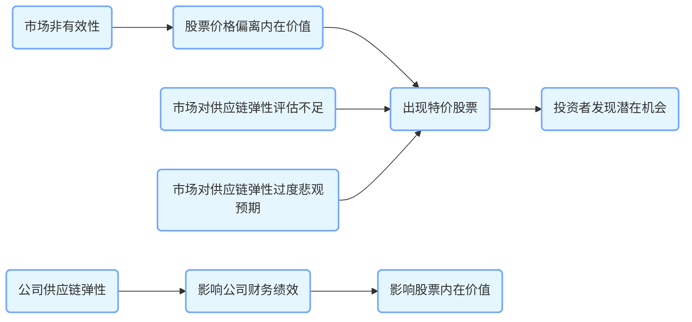

# 特价股票与公司供应链弹性的关系探讨

> 关键词：特价股票、公司供应链弹性、股票估值、供应链风险、市场效率

> 摘要：本文旨在深入探讨特价股票与公司供应链弹性之间的关系。通过对相关核心概念的阐述、算法原理的分析、数学模型的构建以及项目实战案例的研究，揭示特价股票与公司供应链弹性相互影响的内在机制。同时，分析其在实际应用场景中的表现，推荐相关的工具和资源，最后对未来发展趋势与挑战进行总结，以期为投资者、企业管理者等提供有价值的参考和决策依据。

## 1. 背景介绍 
### 1.1 目的和范围
本研究的主要目的是全面且深入地探究特价股票与公司供应链弹性之间的关系。通过综合运用多种分析方法和工具，揭示两者之间的内在联系和相互影响机制。研究范围涵盖了不同行业、不同规模的上市公司，旨在从更广泛的视角来理解特价股票和公司供应链弹性的相关问题。不仅关注两者关系的理论层面，还注重在实际市场环境中的应用和验证。

### 1.2 预期读者
本文预期读者包括股票投资者、企业管理者、供应链管理专家、金融分析师以及对金融市场和供应链领域感兴趣的研究人员。对于股票投资者来说，了解特价股票与公司供应链弹性的关系有助于他们做出更明智的投资决策；企业管理者可以从供应链弹性的角度来审视公司的股票价值，优化公司的供应链策略；供应链管理专家能够深入理解供应链弹性对公司市场价值的影响；金融分析师则可以将这一关系纳入其分析框架，提高分析的准确性和全面性；研究人员可以在此基础上进行更深入的学术研究。

### 1.3 文档结构概述
本文首先介绍研究的背景信息，包括目的、预期读者和文档结构概述等内容。接着阐述核心概念与联系，明确特价股票和公司供应链弹性的定义和相互关系，并通过文本示意图和 Mermaid 流程图进行直观展示。然后详细讲解核心算法原理和具体操作步骤，利用 Python 源代码进行阐述。之后构建数学模型和公式，并通过举例说明其应用。在项目实战部分，展示代码实际案例并进行详细解释说明。随后分析实际应用场景，推荐相关的工具和资源。最后总结未来发展趋势与挑战，提供常见问题与解答以及扩展阅读和参考资料。

### 1.4 术语表
#### 1.4.1 核心术语定义
- **特价股票**：指市场价格相对其内在价值被低估的股票。这种低估可能是由于市场的短期波动、投资者情绪、公司的短期困境等多种因素导致。投资者通常认为特价股票具有较高的投资价值，因为随着时间的推移，其价格有较大可能回归到内在价值水平。
- **公司供应链弹性**：指公司的供应链在面对内外部干扰和不确定性时，能够快速恢复并维持其基本功能和绩效水平的能力。它包括供应链的灵活性、适应性和恢复能力等多个方面，反映了公司供应链系统的稳健性和应对风险的能力。

#### 1.4.2 相关概念解释
- **股票估值**：是对股票内在价值的评估过程。通过分析公司的财务状况、行业前景、竞争优势等多种因素，运用不同的估值方法（如市盈率法、现金流折现法等）来确定股票的合理价值。股票估值是判断股票是否为特价股票的重要依据。
- **供应链风险**：指在供应链运作过程中可能面临的各种不确定性和潜在威胁，如供应商中断、需求波动、运输延误、自然灾害等。这些风险可能会对公司的供应链绩效产生负面影响，降低公司的供应链弹性。

#### 1.4.3 缩略词列表
- **PE**：市盈率（Price - Earnings Ratio），是股票价格与每股收益的比率，常用于股票估值。
- **DCF**：现金流折现法（Discounted Cash Flow），一种通过预测公司未来现金流并将其折现到当前的股票估值方法。

## 2. 核心概念与联系 
### 核心概念原理
#### 特价股票原理
特价股票的出现主要基于市场的非有效性。在有效的市场中，股票价格应该能够及时、准确地反映公司的所有信息。然而，实际市场中存在各种因素导致市场并非完全有效，例如信息不对称、投资者的非理性行为等。当市场对公司的某些信息过度反应或反应不足时，就可能导致股票价格偏离其内在价值，从而出现特价股票。投资者可以通过深入研究公司的基本面、行业动态等信息，寻找那些被市场低估的股票，以期获得超额收益。

#### 公司供应链弹性原理
公司供应链弹性的形成依赖于多个因素。首先，供应链的灵活性是其重要组成部分，包括生产能力的可调整性、供应商的多元化等。通过拥有灵活的生产能力，公司可以根据市场需求的变化快速调整生产规模；供应商的多元化可以降低对单一供应商的依赖，减少因供应商问题导致的供应链中断风险。其次，适应性也是关键因素，公司需要能够快速适应外部环境的变化，如政策法规的调整、技术创新等。最后，恢复能力是指在供应链受到干扰后，公司能够迅速恢复到正常运作状态的能力，这需要公司具备完善的应急预案和快速响应机制。

### 核心概念架构的文本示意图
特价股票与公司供应链弹性的关系可以用以下架构来描述：

公司的供应链弹性状况会对其财务绩效和市场竞争力产生影响。具有较高供应链弹性的公司能够更好地应对内外部干扰，维持稳定的生产和销售，从而提高公司的盈利能力和市场份额。这些积极的表现会反映在公司的财务报表中，进而影响股票的内在价值。如果市场能够准确评估公司的供应链弹性，那么具有高弹性供应链的公司股票价格应该相对较高。然而，由于市场的非有效性，可能会出现对公司供应链弹性评估不足的情况，导致股票价格被低估，从而出现特价股票。

另一方面，特价股票的存在也可能与公司供应链弹性相关的市场预期有关。如果市场对公司的供应链弹性存在过度悲观的预期，即使公司实际上具有较强的供应链弹性，股票价格也可能被压低。投资者可以通过深入分析公司的供应链状况，识别这种市场预期的偏差，发现潜在的特价股票。

### Mermaid 流程图


## 3. 核心算法原理 & 具体操作步骤 
### 核心算法原理
我们可以通过构建一个综合评估模型来分析特价股票与公司供应链弹性的关系。这个模型主要包括两个部分：股票估值模型和供应链弹性评估模型。

#### 股票估值模型
我们采用现金流折现法（DCF）来估算股票的内在价值。DCF 模型的基本原理是将公司未来的现金流折现到当前，以此来确定公司的价值。具体公式为：

$V = \sum_{t=1}^{n} \frac{FCF_t}{(1 + r)^t} + \frac{TV}{(1 + r)^n}$

其中，$V$ 表示公司的内在价值，$FCF_t$ 表示第 $t$ 期的自由现金流，$r$ 表示折现率，$n$ 表示预测期数，$TV$ 表示终值。

#### 供应链弹性评估模型
供应链弹性评估可以从多个维度进行，例如供应商稳定性、生产灵活性、物流可靠性等。我们可以采用层次分析法（AHP）来确定各个维度的权重，然后通过打分的方式对每个维度进行评估，最后综合计算得到公司的供应链弹性得分。

### 具体操作步骤及 Python 源代码实现
#### 股票估值模型的 Python 实现
```python
import numpy as np

def dcf_valuation(fcf, growth_rate, discount_rate, num_years, terminal_growth_rate):
    """
    现金流折现法股票估值模型
    :param fcf: 初始自由现金流
    :param growth_rate: 预测期内的增长率
    :param discount_rate: 折现率
    :param num_years: 预测期数
    :param terminal_growth_rate: 终值增长率
    :return: 公司的内在价值
    """
    cash_flows = []
    for year in range(num_years):
        fcf = fcf * (1 + growth_rate)
        cash_flows.append(fcf)
    
    terminal_value = cash_flows[-1] * (1 + terminal_growth_rate) / (discount_rate - terminal_growth_rate)
    cash_flows.append(terminal_value)
    
    discounted_cash_flows = []
    for i, cf in enumerate(cash_flows):
        discounted_cash_flows.append(cf / (1 + discount_rate) ** (i + 1))
    
    return sum(discounted_cash_flows)

# 示例参数
initial_fcf = 100
growth_rate = 0.1
discount_rate = 0.15
num_years = 5
terminal_growth_rate = 0.05

# 计算内在价值
intrinsic_value = dcf_valuation(initial_fcf, growth_rate, discount_rate, num_years, terminal_growth_rate)
print(f"公司的内在价值: {intrinsic_value}")
```
#### 供应链弹性评估模型的 Python 实现
```python
import numpy as np

# 定义供应链弹性评估维度的权重（使用 AHP 方法确定）
weights = np.array([0.3, 0.3, 0.2, 0.2])  # 假设四个维度：供应商稳定性、生产灵活性、物流可靠性、需求响应能力

# 定义每个维度的得分（满分 10 分）
scores = np.array([8, 7, 6, 7])

# 计算供应链弹性得分
supply_chain_resilience_score = np.dot(weights, scores)
print(f"公司的供应链弹性得分: {supply_chain_resilience_score}")
```

## 4. 数学模型和公式 & 详细讲解 & 举例说明 
### 股票估值的数学模型和公式
#### 现金流折现法（DCF）
如前面所述，DCF 模型的公式为：

$V = \sum_{t=1}^{n} \frac{FCF_t}{(1 + r)^t} + \frac{TV}{(1 + r)^n}$

详细讲解：
- $FCF_t$：第 $t$ 期的自由现金流。自由现金流是指公司在满足了所有运营和投资需求后剩余的现金流量，它反映了公司实际可用于分配给股东或进行再投资的现金数量。在实际应用中，$FCF_t$ 可以通过公司的财务报表进行计算，通常公式为：$FCF_t = EBIT(1 - T) + D&A - \Delta WC - CAPEX$，其中 $EBIT$ 是息税前利润，$T$ 是所得税税率，$D&A$ 是折旧和摊销，$\Delta WC$ 是营运资本的变化，$CAPEX$ 是资本性支出。
- $r$：折现率。折现率反映了投资者对投资回报的预期和风险的补偿要求。通常可以使用加权平均资本成本（WACC）来作为折现率，$WACC = w_d \times r_d(1 - T) + w_e \times r_e$，其中 $w_d$ 和 $w_e$ 分别是债务和股权的权重，$r_d$ 是债务成本，$r_e$ 是股权成本。
- $n$：预测期数。预测期数的选择通常取决于公司的行业特点和发展阶段。一般来说，对于稳定增长的公司，可以选择 5 - 10 年作为预测期。
- $TV$：终值。终值是指预测期结束后公司的持续价值。一种常用的计算终值的方法是使用永续增长模型，$TV = \frac{FCF_{n+1}}{r - g}$，其中 $FCF_{n+1}$ 是预测期结束后下一期的自由现金流，$g$ 是终值增长率。

举例说明：
假设一家公司的初始自由现金流为 $100$ 万元，预测期内的增长率为 $10\%$，折现率为 $15\%$，预测期数为 $5$ 年，终值增长率为 $5\%$。

首先计算每年的自由现金流：
$FCF_1 = 100 \times (1 + 0.1) = 110$ 万元
$FCF_2 = 110 \times (1 + 0.1) = 121$ 万元
$FCF_3 = 121 \times (1 + 0.1) = 133.1$ 万元
$FCF_4 = 133.1 \times (1 + 0.1) = 146.41$ 万元
$FCF_5 = 146.41 \times (1 + 0.1) = 161.051$ 万元

然后计算终值：
$FCF_6 = 161.051 \times (1 + 0.05) = 169.10355$ 万元
$TV = \frac{169.10355}{0.15 - 0.05} = 1691.0355$ 万元

最后计算公司的内在价值：
$V = \frac{110}{(1 + 0.15)^1} + \frac{121}{(1 + 0.15)^2} + \frac{133.1}{(1 + 0.15)^3} + \frac{146.41}{(1 + 0.15)^4} + \frac{161.051}{(1 + 0.15)^5} + \frac{1691.0355}{(1 + 0.15)^5}$
$V \approx 95.65 + 91.38 + 87.30 + 83.43 + 79.75 + 847.44 = 1284.95$ 万元

### 供应链弹性评估的数学模型和公式
#### 层次分析法（AHP）
层次分析法是一种多准则决策分析方法，用于确定各个评估维度的权重。其基本步骤包括：
1. 构建层次结构模型：将供应链弹性评估问题分解为不同的层次，如目标层（供应链弹性）、准则层（供应商稳定性、生产灵活性等）和方案层（具体的评估指标）。
2. 构造判断矩阵：对同一层次的元素进行两两比较，确定它们的相对重要性，形成判断矩阵。判断矩阵的元素 $a_{ij}$ 表示元素 $i$ 相对于元素 $j$ 的重要性程度，通常采用 1 - 9 标度法进行赋值。
3. 计算权重向量：通过求解判断矩阵的特征值和特征向量，得到各个元素的权重。
4. 一致性检验：检验判断矩阵的一致性，确保判断的合理性。

假设我们已经通过 AHP 方法得到了四个评估维度的权重向量 $W = [0.3, 0.3, 0.2, 0.2]$，每个维度的得分向量 $S = [8, 7, 6, 7]$。

则供应链弹性得分 $R$ 的计算公式为：

$R = \sum_{i=1}^{4} w_i \times s_i$

其中，$w_i$ 是第 $i$ 个维度的权重，$s_i$ 是第 $i$ 个维度的得分。

代入数值计算：
$R = 0.3 \times 8 + 0.3 \times 7 + 0.2 \times 6 + 0.2 \times 7$
$R = 2.4 + 2.1 + 1.2 + 1.4 = 7.1$

## 5. 项目实战：代码实际案例和详细解释说明 
### 5.1  开发环境搭建
#### 操作系统
可以选择 Windows、Linux 或 macOS 等常见的操作系统。本项目在开发过程中使用的是 Windows 10 操作系统。

#### Python 环境
安装 Python 3.7 及以上版本。可以从 Python 官方网站（https://www.python.org/downloads/） 下载并安装。安装完成后，建议使用虚拟环境来管理项目的依赖包，以避免不同项目之间的包冲突。可以使用 `venv` 或 `conda` 来创建虚拟环境。

#### 依赖包安装
在虚拟环境中安装所需的依赖包，主要包括 `numpy` 等科学计算库。可以使用 `pip` 来安装：
```sh
pip install numpy
```

### 5.2  源代码详细实现和代码解读
#### 完整代码示例
```python
import numpy as np

# 股票估值模型 - 现金流折现法
def dcf_valuation(fcf, growth_rate, discount_rate, num_years, terminal_growth_rate):
    """
    现金流折现法股票估值模型
    :param fcf: 初始自由现金流
    :param growth_rate: 预测期内的增长率
    :param discount_rate: 折现率
    :param num_years: 预测期数
    :param terminal_growth_rate: 终值增长率
    :return: 公司的内在价值
    """
    cash_flows = []
    for year in range(num_years):
        fcf = fcf * (1 + growth_rate)
        cash_flows.append(fcf)
    
    terminal_value = cash_flows[-1] * (1 + terminal_growth_rate) / (discount_rate - terminal_growth_rate)
    cash_flows.append(terminal_value)
    
    discounted_cash_flows = []
    for i, cf in enumerate(cash_flows):
        discounted_cash_flows.append(cf / (1 + discount_rate) ** (i + 1))
    
    return sum(discounted_cash_flows)

# 供应链弹性评估模型 - 层次分析法加权得分
def supply_chain_resilience_evaluation(weights, scores):
    """
    供应链弹性评估模型
    :param weights: 各评估维度的权重向量
    :param scores: 各评估维度的得分向量
    :return: 供应链弹性得分
    """
    return np.dot(weights, scores)

# 示例参数
# 股票估值参数
initial_fcf = 100
growth_rate = 0.1
discount_rate = 0.15
num_years = 5
terminal_growth_rate = 0.05

# 供应链弹性评估参数
weights = np.array([0.3, 0.3, 0.2, 0.2])  # 假设四个维度：供应商稳定性、生产灵活性、物流可靠性、需求响应能力
scores = np.array([8, 7, 6, 7])

# 计算股票内在价值
intrinsic_value = dcf_valuation(initial_fcf, growth_rate, discount_rate, num_years, terminal_growth_rate)
print(f"公司的内在价值: {intrinsic_value}")

# 计算供应链弹性得分
supply_chain_resilience_score = supply_chain_resilience_evaluation(weights, scores)
print(f"公司的供应链弹性得分: {supply_chain_resilience_score}")

# 综合分析特价股票与供应链弹性的关系
# 假设当前股票市场价格为 1000
market_price = 1000
if intrinsic_value > market_price:
    print("该股票可能是特价股票")
else:
    print("该股票可能不是特价股票")

# 根据供应链弹性得分进行简单判断
if supply_chain_resilience_score > 7:
    print("公司具有较强的供应链弹性")
else:
    print("公司的供应链弹性有待提高")
```
#### 代码解读
1. **股票估值模型（`dcf_valuation` 函数）**：
    - 该函数实现了现金流折现法的股票估值过程。首先，通过循环计算预测期内每年的自由现金流，并将其存储在 `cash_flows` 列表中。
    - 然后，使用永续增长模型计算终值，并将其添加到 `cash_flows` 列表中。
    - 最后，将每个现金流按照折现率进行折现，并求和得到公司的内在价值。

2. **供应链弹性评估模型（`supply_chain_resilience_evaluation` 函数）**：
    - 该函数使用层次分析法确定的权重向量和各维度的得分向量，通过 `np.dot` 函数计算供应链弹性得分。

3. **主程序部分**：
    - 定义了股票估值和供应链弹性评估所需的参数。
    - 调用 `dcf_valuation` 函数计算公司的内在价值，并输出结果。
    - 调用 `supply_chain_resilience_evaluation` 函数计算供应链弹性得分，并输出结果。
    - 假设当前股票市场价格为 1000，通过比较内在价值和市场价格判断该股票是否可能是特价股票。
    - 根据供应链弹性得分判断公司的供应链弹性状况。

### 5.3  代码解读与分析
#### 优点
- **模块化设计**：将股票估值和供应链弹性评估分别封装成独立的函数，提高了代码的可复用性和可维护性。
- **灵活性**：代码中的参数可以根据实际情况进行调整，例如预测期数、增长率、权重等，方便进行不同场景的分析。
- **简单易懂**：代码结构清晰，注释详细，易于理解和使用。

#### 局限性
- **参数估计的主观性**：现金流折现法中的增长率、折现率等参数以及供应链弹性评估中的权重都需要进行估计，这些估计过程存在一定的主观性，可能会影响结果的准确性。
- **模型的简化**：代码中使用的模型是对实际情况的简化，例如假设增长率和折现率在预测期内保持不变，可能与实际情况存在偏差。

## 6. 实际应用场景 
### 投资者决策
对于股票投资者来说，了解特价股票与公司供应链弹性的关系可以帮助他们做出更明智的投资决策。当投资者发现某只股票的市场价格相对其内在价值被低估，同时公司具有较强的供应链弹性时，这可能是一个很好的投资机会。因为具有高弹性供应链的公司能够更好地应对市场变化和风险，未来的盈利能力和市场竞争力更有保障，股票价格有较大可能回归到合理水平，从而为投资者带来较高的回报。

例如，在疫情期间，一些具有强大供应链弹性的公司能够迅速调整生产计划，保障原材料供应，维持稳定的生产和销售。这些公司的股票在市场波动中表现相对稳定，甚至可能出现逆势上涨的情况。投资者如果能够提前识别这些公司的供应链优势，就有可能抓住投资机会。

### 企业战略规划
企业管理者可以从供应链弹性的角度来审视公司的股票价值，优化公司的供应链策略。通过提高公司的供应链弹性，企业可以增强自身的竞争力，提高市场对公司的预期，从而提升股票价格。例如，企业可以通过建立多元化的供应商体系、优化生产流程、加强物流管理等措施来提高供应链弹性。

同时，企业管理者还可以根据股票市场的反馈来调整供应链策略。如果公司的股票价格持续低迷，可能意味着市场对公司的供应链弹性存在担忧。企业管理者可以分析原因，采取相应的改进措施，以提高公司的供应链弹性和市场价值。

### 供应链风险管理
在供应链管理中，了解特价股票与公司供应链弹性的关系有助于识别潜在的供应链风险。如果一家公司的股票价格被低估，且供应链弹性得分较低，可能意味着该公司的供应链存在潜在风险。供应链管理者可以对这些公司进行重点关注，加强风险监测和预警，制定相应的风险应对措施，以降低供应链中断的风险。

例如，当发现某家供应商的母公司股票价格持续下跌且供应链弹性较差时，企业可以考虑寻找替代供应商，或者与该供应商协商采取措施提高其供应链弹性，以保障自身的供应链安全。

## 7. 工具和资源推荐
### 7.1 学习资源推荐
#### 7.1.1 书籍推荐
- 《聪明的投资者》（The Intelligent Investor）：作者是本杰明·格雷厄姆（Benjamin Graham），这本书是价值投资领域的经典著作，介绍了如何通过基本面分析来寻找特价股票，对投资者具有重要的指导意义。
- 《供应链风险管理》（Supply Chain Risk Management）：详细介绍了供应链风险管理的理论和实践方法，包括如何评估和提高供应链弹性，对于供应链管理专业人士和企业管理者来说是一本很好的参考书籍。
- 《财务报表分析与证券定价》（Financial Statement Analysis and Security Valuation）：提供了深入分析公司财务报表和进行股票估值的方法和技巧，有助于读者更好地理解股票估值模型。

#### 7.1.2 在线课程
- Coursera 平台上的“Financial Markets”课程：由耶鲁大学教授罗伯特·席勒（Robert Shiller）主讲，涵盖了金融市场的基本原理、投资策略等内容，对股票投资和估值有深入的讲解。
- edX 平台上的“Supply Chain Management”课程：由麻省理工学院（MIT）等知名高校的教授授课，系统地介绍了供应链管理的各个方面，包括供应链弹性的概念和提升方法。

#### 7.1.3 技术博客和网站
- Seeking Alpha（https://seekingalpha.com/）：一个金融投资领域的专业网站，提供了大量的股票分析、投资策略和市场评论等内容，有助于投资者了解市场动态和寻找特价股票。
- Supply Chain Dive（https://www.supplychaindive.com/）：专注于供应链领域的新闻和分析，提供了关于供应链弹性、风险管理等方面的最新资讯和案例研究。

### 7.2 开发工具框架推荐
#### 7.2.1 IDE和编辑器
- PyCharm：一款专业的 Python 集成开发环境（IDE），具有强大的代码编辑、调试和智能提示功能，适合进行 Python 代码的开发和调试。
- Visual Studio Code：一款轻量级的代码编辑器，支持多种编程语言，通过安装相关的插件可以实现 Python 开发的各种功能，如代码高亮、调试等。

#### 7.2.2 调试和性能分析工具
- pdb：Python 自带的调试工具，可以帮助开发者逐行调试代码，查找代码中的错误和问题。
- cProfile：Python 的性能分析工具，可以分析代码的运行时间和函数调用情况，帮助开发者优化代码性能。

#### 7.2.3 相关框架和库
- Pandas：一个强大的数据处理和分析库，提供了高效的数据结构和数据操作方法，可用于处理和分析公司的财务数据和供应链数据。
- Scikit-learn：一个机器学习库，提供了多种机器学习算法和工具，可用于对股票价格和供应链弹性进行预测和分析。

### 7.3 相关论文著作推荐
#### 7.3.1 经典论文
- “The Theory of Rational Option Pricing” by Fischer Black and Myron Scholes：这篇论文提出了著名的布莱克 - 斯科尔斯期权定价模型，对金融市场的定价理论产生了深远影响，对于理解股票估值和市场效率有重要的参考价值。
- “Supply Chain Resilience: Definition, Review, and Research Agenda” by Jayashankar M. Swaminathan and Yingzi Wang：对供应链弹性的概念、评估方法和研究现状进行了系统的综述和分析，为供应链弹性的研究提供了重要的理论基础。

#### 7.3.2 最新研究成果
- 关注《Management Science》、《Operations Research》等顶级学术期刊上关于金融市场和供应链管理的最新研究论文，了解该领域的前沿动态和研究成果。

#### 7.3.3 应用案例分析
- 一些知名咨询公司（如麦肯锡、波士顿咨询等）发布的关于企业供应链管理和投资策略的案例分析报告，通过实际案例展示了如何应用相关理论和方法来解决实际问题，具有很强的实践指导意义。

## 8. 总结：未来发展趋势与挑战
### 未来发展趋势
#### 数据驱动的决策
随着信息技术的不断发展和大数据的广泛应用，未来在分析特价股票与公司供应链弹性的关系时，将更加依赖数据驱动的决策方法。通过收集和分析大量的公司财务数据、供应链数据、市场数据等，利用机器学习和人工智能算法可以更准确地评估股票的内在价值和公司的供应链弹性，为投资者和企业管理者提供更科学的决策依据。

#### 供应链数字化转型
越来越多的企业将进行供应链数字化转型，通过引入物联网、区块链、人工智能等技术，实现供应链的可视化、智能化和自动化。这将有助于提高供应链的透明度和响应速度，增强供应链弹性。同时，数字化转型也将为分析特价股票与公司供应链弹性的关系提供更多的数据和信息。

#### 跨学科研究的兴起
特价股票与公司供应链弹性的关系涉及金融、管理、工程等多个学科领域。未来，跨学科研究将越来越受到重视，不同学科的专家将共同合作，从多个角度深入研究这一问题，为解决实际问题提供更全面的解决方案。

### 挑战
#### 数据质量和隐私问题
在数据驱动的决策过程中，数据质量是关键因素。如果数据存在误差、缺失或不准确的情况，将影响分析结果的准确性。此外，随着数据的大量收集和使用，数据隐私问题也日益突出。如何在保护数据隐私的前提下，充分利用数据进行分析和决策，是一个亟待解决的问题。

#### 模型的复杂性和不确定性
股票估值和供应链弹性评估模型都具有一定的复杂性，并且存在很多不确定性因素。例如，现金流折现法中的增长率、折现率等参数的估计具有一定的主观性，供应链弹性评估中的权重确定也存在一定的难度。如何处理这些不确定性因素，提高模型的准确性和可靠性，是一个挑战。

#### 市场环境的变化
金融市场和供应链环境都在不断变化，新的风险和挑战不断涌现。例如，全球经济形势的波动、贸易政策的变化、自然灾害等都可能对股票价格和公司供应链弹性产生影响。如何及时适应市场环境的变化，调整分析方法和策略，是投资者和企业管理者面临的重要挑战。

## 9. 附录：常见问题与解答
### 1. 如何准确估计现金流折现法中的增长率和折现率？
增长率和折现率的估计是现金流折现法中的关键环节，也是比较困难的部分。增长率可以通过分析公司的历史财务数据、行业发展趋势、市场竞争状况等因素来进行预测。折现率通常可以使用加权平均资本成本（WACC）来计算，其中债务成本可以参考公司的债券利率，股权成本可以使用资本资产定价模型（CAPM）来估计。然而，这些方法都存在一定的主观性，需要结合具体情况进行综合判断。

### 2. 层次分析法确定的权重是否具有客观性？
层次分析法确定的权重在一定程度上依赖于专家的判断，存在一定的主观性。为了提高权重的客观性，可以邀请多个领域的专家进行评估，并对评估结果进行统计分析和一致性检验。此外，还可以结合实际数据和案例进行验证和调整。

### 3. 如何判断一家公司的供应链弹性是否足够强？
判断一家公司的供应链弹性是否足够强需要综合考虑多个因素。可以从供应商稳定性、生产灵活性、物流可靠性、需求响应能力等多个维度进行评估，并与同行业的其他公司进行比较。此外，还可以关注公司在面对内外部干扰时的表现，如是否能够快速恢复生产、保障供应等。

### 4. 特价股票一定具有投资价值吗？
特价股票并不一定具有投资价值。虽然特价股票的市场价格相对其内在价值被低估，但这并不意味着其价格一定会回归到合理水平。股票价格的走势受到多种因素的影响，如公司的基本面变化、市场环境的波动、宏观经济政策等。因此，在投资特价股票时，需要进行全面的分析和评估，不能仅仅依据股票价格被低估这一因素来做出投资决策。

## 10. 扩展阅读 & 参考资料
### 扩展阅读
- 《金融炼金术》（The Alchemy of Finance）：作者是乔治·索罗斯（George Soros），这本书介绍了作者的投资哲学和实践经验，对理解金融市场的运行机制和投资策略有一定的启发。
- 《供应链创新与实践》：探讨了供应链管理领域的创新理念和实践案例，有助于深入了解供应链弹性的提升方法和应用场景。

### 参考资料
- 公司的财务报表和年报，可从证券交易所官方网站或公司官方网站获取。
- 行业研究报告，如券商发布的行业分析报告、咨询公司的研究报告等。
- 相关学术期刊和会议论文，如《Journal of Financial Economics》、《Production and Operations Management》等。