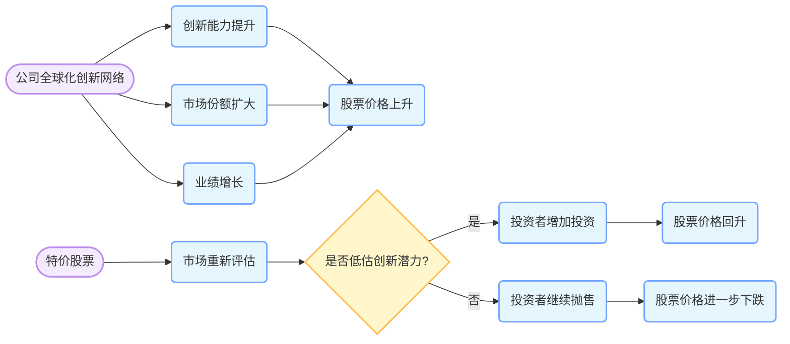

# 特价股票与公司全球化创新网络的关系探讨

> 关键词：特价股票、公司全球化、创新网络、股票价值、企业创新

> 摘要：本文旨在深入探讨特价股票与公司全球化创新网络之间的关系。通过对相关核心概念的阐述，剖析其内在联系和作用机制。运用算法原理、数学模型等工具，揭示两者关系的本质。结合项目实战案例，进一步验证理论分析的结果。同时，探讨实际应用场景，推荐相关学习资源、开发工具和论文著作。最后，总结未来发展趋势与挑战，为投资者和企业管理者提供有价值的参考和决策依据，以更好地理解特价股票的投资价值和公司全球化创新网络的战略意义。

## 1. 背景介绍 
### 1.1 目的和范围
本研究的目的在于全面、深入地探究特价股票与公司全球化创新网络之间的关系。随着全球经济一体化的不断推进，公司的全球化战略日益重要，创新能力也成为企业核心竞争力的关键因素。而股票市场作为企业融资和投资者获取收益的重要平台，特价股票的出现往往伴随着各种复杂的因素。本研究旨在揭示公司全球化创新网络对特价股票价值的影响机制，以及特价股票所反映的公司在全球化创新网络中的地位和发展潜力。研究范围涵盖了不同行业、不同规模的企业，以及全球主要股票市场中的特价股票样本。

### 1.2 预期读者
本文预期读者包括股票投资者、企业管理者、金融分析师、学术研究人员以及对经济金融领域感兴趣的人士。对于投资者而言，了解特价股票与公司全球化创新网络的关系有助于他们做出更明智的投资决策；企业管理者可以从本文中获取关于全球化创新战略的启示，以提升企业的市场价值和竞争力；金融分析师可以将本文的研究成果应用于股票估值和行业分析中；学术研究人员可以在此基础上开展更深入的理论和实证研究；而对经济金融领域感兴趣的人士则可以通过本文了解相关领域的前沿知识和研究动态。

### 1.3 文档结构概述
本文将按照以下结构展开：首先介绍背景信息，包括研究目的、预期读者和文档结构概述等内容；接着阐述核心概念与联系，包括特价股票、公司全球化创新网络的定义、原理和架构，并通过示意图和流程图进行直观展示；然后讲解核心算法原理和具体操作步骤，利用 Python 源代码详细阐述；再介绍数学模型和公式，并结合具体例子进行说明；随后通过项目实战，包括开发环境搭建、源代码实现和代码解读，进一步验证理论分析的结果；之后探讨实际应用场景；推荐相关的工具和资源，包括学习资源、开发工具框架和论文著作；最后总结未来发展趋势与挑战，提供常见问题与解答，并列出扩展阅读和参考资料。

### 1.4 术语表
#### 1.4.1 核心术语定义
- **特价股票**：指在股票市场中，价格相对其内在价值或同行业其他股票价格较低的股票。特价股票的形成可能是由于市场短期波动、公司短期业绩不佳、行业竞争压力等多种因素导致。
- **公司全球化**：指企业突破国界限制，在全球范围内配置资源、开展生产经营活动、拓展市场的过程。公司全球化包括市场全球化、生产全球化、研发全球化等多个方面。
- **创新网络**：指企业与供应商、客户、科研机构、高校、政府等相关主体之间通过合作、交流、知识共享等方式形成的网络关系。创新网络有助于企业获取外部资源、知识和技术，提升创新能力。
- **公司全球化创新网络**：指企业在全球化过程中，与全球范围内的相关主体建立的创新网络。它整合了全球的创新资源，促进企业的技术创新和产品升级，提高企业的全球竞争力。

#### 1.4.2 相关概念解释
- **股票内在价值**：指股票未来预期现金流的现值。它是基于公司的基本面、盈利能力、成长潜力等因素计算得出的股票的真实价值。
- **市场效率**：指股票市场对信息的反映程度。在有效市场中，股票价格能够及时、准确地反映所有可用信息；而在非有效市场中，股票价格可能会偏离其内在价值。
- **创新生态系统**：指由企业、政府、科研机构、高校、金融机构等多种主体组成的，相互依存、相互作用的创新环境。创新生态系统为企业的创新活动提供了必要的资源和支持。

#### 1.4.3 缩略词列表
- **GDP**：国内生产总值（Gross Domestic Product）
- **R&D**：研究与开发（Research and Development）
- **IPO**：首次公开募股（Initial Public Offering）

## 2. 核心概念与联系 

### 2.1 特价股票的原理和架构
特价股票的形成原理主要与市场供求关系、公司基本面和投资者情绪等因素有关。从市场供求关系来看，如果某只股票的供给大于需求，其价格就会下跌，可能成为特价股票。公司基本面方面，如公司业绩不佳、财务状况恶化、面临重大诉讼等问题，会导致投资者对其信心下降，从而使股票价格走低。投资者情绪也会对股票价格产生影响，当市场处于恐慌或悲观情绪时，投资者可能会过度抛售股票，导致股票价格偏离其内在价值。

特价股票的架构可以从以下几个层面来理解：
- **宏观层面**：宏观经济环境、政策法规、行业发展趋势等因素会影响整个股票市场的走势，进而影响特价股票的形成。例如，经济衰退时期，多数股票价格下跌，可能会出现更多的特价股票。
- **中观层面**：行业竞争格局、行业技术变革等因素会影响行业内企业的业绩和市场表现，从而导致部分企业的股票成为特价股票。
- **微观层面**：公司的治理结构、经营管理水平、创新能力等因素会直接影响公司的业绩和市场价值，决定其股票是否会成为特价股票。

### 2.2 公司全球化创新网络的原理和架构
公司全球化创新网络的原理基于资源互补、知识共享和协同创新的理念。在全球化背景下，企业面临着激烈的市场竞争和快速的技术变革，仅依靠自身的资源和能力难以满足创新需求。通过与全球范围内的相关主体建立创新网络，企业可以获取外部的先进技术、知识和人才，实现资源的优化配置和创新能力的提升。

公司全球化创新网络的架构主要包括以下几个部分：
- **核心企业**：是创新网络的发起者和组织者，具有较强的技术实力和市场影响力。核心企业通过与网络内其他主体的合作，推动创新项目的实施和创新成果的转化。
- **合作伙伴**：包括供应商、客户、科研机构、高校等。供应商可以提供高质量的原材料和零部件，客户可以反馈市场需求信息，科研机构和高校可以提供前沿的技术和研究成果。
- **创新平台**：是创新网络的载体，包括研发中心、技术转移中心、创新孵化器等。创新平台为创新主体之间的交流与合作提供了场所和设施。
- **网络治理机制**：包括合作协议、利益分配机制、知识产权保护机制等。网络治理机制确保创新网络的正常运行和各主体之间的利益平衡。

### 2.3 特价股票与公司全球化创新网络的联系
特价股票与公司全球化创新网络之间存在着密切的联系。一方面，公司全球化创新网络的发展状况会影响其股票价格。如果公司能够成功构建全球化创新网络，获取更多的创新资源和市场机会，提升创新能力和竞争力，其股票价格可能会上升；反之，如果公司在全球化创新网络中面临困难，如合作失败、技术瓶颈等，其股票价格可能会下跌，甚至成为特价股票。

另一方面，特价股票也可以反映公司在全球化创新网络中的地位和发展潜力。如果一只股票成为特价股票，可能是由于市场对公司的全球化创新战略存在误解或低估，也可能是公司在全球化创新过程中遇到了暂时的困难。投资者可以通过深入分析公司的全球化创新网络，评估其未来的发展潜力，判断特价股票是否具有投资价值。

### 2.4 文本示意图
特价股票与公司全球化创新网络的关系可以用以下文本示意图表示：

公司全球化创新网络的发展水平和效果会直接影响公司的业绩和市场竞争力，进而影响股票价格。当公司的全球化创新网络运行良好，创新成果不断涌现，市场份额扩大时，股票价格可能会上升；反之，当公司的全球化创新网络出现问题，如创新能力不足、市场拓展受阻时，股票价格可能会下跌，形成特价股票。

特价股票的出现也可能引发市场对公司全球化创新战略的重新评估。如果投资者认为公司的全球化创新潜力被低估，可能会增加对该股票的投资，推动股票价格回升；如果投资者认为公司的全球化创新面临难以克服的困难，可能会继续抛售股票，使股票价格进一步下跌。

### 2.5 Mermaid 流程图


## 3. 核心算法原理 & 具体操作步骤 

### 3.1 核心算法原理
为了探究特价股票与公司全球化创新网络的关系，我们可以采用多因素回归分析算法。多因素回归分析是一种统计方法，用于研究多个自变量与因变量之间的线性关系。在本研究中，我们将股票价格作为因变量，公司全球化创新网络的相关指标作为自变量，通过建立回归模型，分析自变量对因变量的影响程度。

具体来说，我们可以选取以下自变量：
- **全球化程度指标**：如海外销售额占总销售额的比例、海外子公司数量等。
- **创新能力指标**：如研发投入占营业收入的比例、专利数量等。
- **网络合作指标**：如合作伙伴数量、合作项目数量等。

### 3.2 Python 源代码实现
```python
import pandas as pd
import numpy as np
from sklearn.linear_model import LinearRegression
from sklearn.model_selection import train_test_split
from sklearn.metrics import mean_squared_error

# 读取数据
data = pd.read_csv('stock_data.csv')

# 提取自变量和因变量
X = data[['globalization_ratio', 'R&D_ratio', 'partner_number', 'project_number']]
y = data['stock_price']

# 划分训练集和测试集
X_train, X_test, y_train, y_test = train_test_split(X, y, test_size=0.2, random_state=42)

# 创建线性回归模型
model = LinearRegression()

# 训练模型
model.fit(X_train, y_train)

# 预测
y_pred = model.predict(X_test)

# 计算均方误差
mse = mean_squared_error(y_test, y_pred)
print(f"均方误差: {mse}")

# 输出模型系数
coefficients = model.coef_
intercept = model.intercept_
print(f"模型系数: {coefficients}")
print(f"截距: {intercept}")
```

### 3.3 具体操作步骤
1. **数据收集**：收集相关企业的股票价格数据、全球化程度数据、创新能力数据和网络合作数据等。数据可以从金融数据库、企业年报、行业报告等渠道获取。
2. **数据预处理**：对收集到的数据进行清洗、整理和标准化处理，以消除数据中的噪声和异常值，提高数据质量。
3. **变量选择**：根据研究目的和理论假设，选择合适的自变量和因变量。
4. **模型建立**：使用 Python 中的 `sklearn` 库建立线性回归模型。
5. **模型训练**：将数据划分为训练集和测试集，使用训练集对模型进行训练。
6. **模型评估**：使用测试集对训练好的模型进行评估，计算均方误差等评估指标，评估模型的预测性能。
7. **结果分析**：分析模型的系数和截距，了解自变量对因变量的影响程度和方向。

## 4. 数学模型和公式 & 详细讲解 & 举例说明 

### 4.1 数学模型和公式
多因素回归分析的数学模型可以表示为：

$$y = \beta_0 + \beta_1x_1 + \beta_2x_2 + \cdots + \beta_nx_n + \epsilon$$

其中，$y$ 是因变量（股票价格），$x_1, x_2, \cdots, x_n$ 是自变量（全球化程度指标、创新能力指标、网络合作指标等），$\beta_0$ 是截距，$\beta_1, \beta_2, \cdots, \beta_n$ 是回归系数，$\epsilon$ 是误差项。

回归系数 $\beta_i$ 表示在其他自变量保持不变的情况下，自变量 $x_i$ 每增加一个单位，因变量 $y$ 的平均变化量。截距 $\beta_0$ 表示当所有自变量都为 0 时，因变量 $y$ 的取值。

### 4.2 详细讲解
在多因素回归分析中，我们的目标是通过样本数据估计回归系数 $\beta_0, \beta_1, \cdots, \beta_n$ 的值，使得误差项 $\epsilon$ 的平方和最小。这可以通过最小二乘法来实现。

最小二乘法的基本思想是：对于给定的样本数据 $(x_{1i}, x_{2i}, \cdots, x_{ni}, y_i)$，$i = 1, 2, \cdots, m$，我们要找到一组回归系数 $\hat{\beta}_0, \hat{\beta}_1, \cdots, \hat{\beta}_n$，使得残差平方和：

$$S(\hat{\beta}_0, \hat{\beta}_1, \cdots, \hat{\beta}_n) = \sum_{i = 1}^{m}(y_i - \hat{y}_i)^2 = \sum_{i = 1}^{m}(y_i - \hat{\beta}_0 - \hat{\beta}_1x_{1i} - \cdots - \hat{\beta}_nx_{ni})^2$$

达到最小。其中，$\hat{y}_i$ 是根据回归模型预测的因变量值。

通过求解上述最小化问题，可以得到回归系数的估计值 $\hat{\beta}_0, \hat{\beta}_1, \cdots, \hat{\beta}_n$。这些估计值可以用来解释自变量对因变量的影响程度和方向。

### 4.3 举例说明
假设我们收集了 100 家企业的股票价格数据、海外销售额占总销售额的比例（$x_1$）、研发投入占营业收入的比例（$x_2$）和合作伙伴数量（$x_3$）数据。使用多因素回归分析得到的回归模型为：

$$y = 10 + 2x_1 + 3x_2 + 0.5x_3$$

这意味着，在其他因素保持不变的情况下，海外销售额占总销售额的比例每增加 1%，股票价格平均增加 2 元；研发投入占营业收入的比例每增加 1%，股票价格平均增加 3 元；合作伙伴数量每增加 1 个，股票价格平均增加 0.5 元。截距 10 表示当海外销售额占总销售额的比例、研发投入占营业收入的比例和合作伙伴数量都为 0 时，股票价格的估计值为 10 元。

## 5. 项目实战：代码实际案例和详细解释说明 

### 5.1  开发环境搭建
1. **安装 Python**：从 Python 官方网站（https://www.python.org/downloads/）下载并安装 Python 3.x 版本。
2. **安装必要的库**：使用 `pip` 命令安装 `pandas`、`numpy`、`sklearn` 等库。

```sh
pip install pandas numpy scikit-learn
```

3. **数据准备**：收集相关企业的股票价格数据、全球化程度数据、创新能力数据和网络合作数据等，并将其保存为 CSV 文件。

### 5.2  源代码详细实现和代码解读
```python
import pandas as pd
import numpy as np
from sklearn.linear_model import LinearRegression
from sklearn.model_selection import train_test_split
from sklearn.metrics import mean_squared_error

# 读取数据
data = pd.read_csv('stock_data.csv')

# 代码解读：使用 pandas 库的 read_csv 函数读取 CSV 文件中的数据，并将其存储在 DataFrame 对象 data 中。

# 提取自变量和因变量
X = data[['globalization_ratio', 'R&D_ratio', 'partner_number', 'project_number']]
y = data['stock_price']

# 代码解读：从 DataFrame 对象 data 中提取自变量（全球化程度指标、创新能力指标、网络合作指标等）和因变量（股票价格）。

# 划分训练集和测试集
X_train, X_test, y_train, y_test = train_test_split(X, y, test_size=0.2, random_state=42)

# 代码解读：使用 sklearn 库的 train_test_split 函数将数据划分为训练集和测试集，其中测试集占总数据的 20%。random_state 参数用于确保每次划分的结果相同。

# 创建线性回归模型
model = LinearRegression()

# 代码解读：使用 sklearn 库的 LinearRegression 类创建一个线性回归模型对象。

# 训练模型
model.fit(X_train, y_train)

# 代码解读：使用训练集数据对线性回归模型进行训练，即通过最小二乘法估计回归系数。

# 预测
y_pred = model.predict(X_test)

# 代码解读：使用训练好的模型对测试集数据进行预测，得到预测的股票价格。

# 计算均方误差
mse = mean_squared_error(y_test, y_pred)
print(f"均方误差: {mse}")

# 代码解读：使用 sklearn 库的 mean_squared_error 函数计算预测值与真实值之间的均方误差，评估模型的预测性能。

# 输出模型系数
coefficients = model.coef_
intercept = model.intercept_
print(f"模型系数: {coefficients}")
print(f"截距: {intercept}")

# 代码解读：通过模型的 coef_ 属性和 intercept_ 属性获取回归系数和截距，并将其输出。
```

### 5.3  代码解读与分析
- **数据读取**：使用 `pandas` 库的 `read_csv` 函数读取 CSV 文件中的数据，方便进行数据处理和分析。
- **数据划分**：使用 `sklearn` 库的 `train_test_split` 函数将数据划分为训练集和测试集，避免模型过拟合，提高模型的泛化能力。
- **模型训练**：使用 `sklearn` 库的 `LinearRegression` 类创建线性回归模型，并使用训练集数据对模型进行训练。
- **模型评估**：使用均方误差（MSE）作为评估指标，衡量模型的预测性能。均方误差越小，说明模型的预测效果越好。
- **结果分析**：通过分析回归系数和截距，可以了解自变量对因变量的影响程度和方向。例如，如果某个自变量的回归系数为正，说明该自变量与因变量呈正相关关系；如果回归系数为负，说明该自变量与因变量呈负相关关系。

## 6. 实际应用场景 
### 6.1 投资决策
投资者可以通过分析公司的全球化创新网络，评估其创新能力和发展潜力，判断特价股票是否具有投资价值。如果公司在全球化创新网络中具有较强的竞争力，创新成果不断涌现，市场份额不断扩大，而其股票价格由于短期因素被低估，投资者可以考虑买入该股票，等待其价值回归。

### 6.2 企业战略制定
企业管理者可以通过构建和优化全球化创新网络，提升企业的创新能力和竞争力，从而提高企业的市场价值和股票价格。例如，企业可以加强与全球范围内的科研机构、高校和供应商的合作，获取更多的创新资源和技术支持；加大研发投入，提高产品的科技含量和附加值；拓展海外市场，扩大市场份额。

### 6.3 行业分析
金融分析师可以通过研究特价股票与公司全球化创新网络的关系，分析行业的发展趋势和竞争格局。例如，如果某个行业中多数企业的股票价格被低估，而其全球化创新网络发展良好，可能意味着该行业具有较大的发展潜力；反之，如果某个行业中多数企业的股票价格较高，但全球化创新网络存在问题，可能意味着该行业面临着较大的竞争压力和发展瓶颈。

## 7. 工具和资源推荐
### 7.1 学习资源推荐
#### 7.1.1 书籍推荐
- 《金融市场学》：全面介绍了金融市场的基本概念、运行机制和投资策略，有助于读者了解股票市场的基本知识。
- 《创新管理》：系统阐述了创新管理的理论和方法，包括创新战略、创新组织、创新过程等方面的内容，对理解公司的创新活动有很大帮助。
- 《全球化战略》：探讨了企业在全球化背景下的战略选择和管理模式，为企业管理者提供了全球化战略的思路和方法。

#### 7.1.2 在线课程
- Coursera 平台上的“Financial Markets”课程：由耶鲁大学教授罗伯特·席勒（Robert Shiller）主讲，深入讲解了金融市场的理论和实践。
- edX 平台上的“Innovation Management and Entrepreneurship”课程：介绍了创新管理和创业的相关知识和技能。
- Udemy 平台上的“Global Business Strategy”课程：帮助学员了解企业全球化战略的制定和实施。

#### 7.1.3 技术博客和网站
- 雪球网：提供股票市场的行情数据、公司资讯、投资者交流等服务，是投资者获取股票信息和交流投资经验的重要平台。
- 36氪：专注于科技创新和创业领域的资讯平台，提供最新的科技动态、创新案例和行业分析。
- 哈佛商业评论网：发表了大量关于企业管理、战略规划、创新等方面的文章，具有较高的学术价值和实践指导意义。

### 7.2 开发工具框架推荐
#### 7.2.1 IDE和编辑器
- PyCharm：一款专业的 Python 集成开发环境，提供代码编辑、调试、版本控制等功能，适合开发 Python 项目。
- Jupyter Notebook：一种交互式的开发环境，支持多种编程语言，方便进行数据分析和模型训练。
- Visual Studio Code：一款轻量级的代码编辑器，支持多种编程语言和插件扩展，具有良好的用户体验。

#### 7.2.2 调试和性能分析工具
- pdb：Python 内置的调试工具，用于调试 Python 代码，查找代码中的错误。
- cProfile：Python 内置的性能分析工具，用于分析 Python 代码的运行时间和性能瓶颈。
- TensorBoard：用于可视化深度学习模型的训练过程和性能指标，帮助开发者优化模型。

#### 7.2.3 相关框架和库
- pandas：用于数据处理和分析的 Python 库，提供了高效的数据结构和数据操作方法。
- numpy：用于科学计算的 Python 库，提供了多维数组和数学函数等功能。
- sklearn：用于机器学习的 Python 库，提供了各种机器学习算法和工具，方便进行数据挖掘和模型训练。

### 7.3 相关论文著作推荐
#### 7.3.1 经典论文
- “Efficient Capital Markets: A Review of Theory and Empirical Work” by Eugene F. Fama：该论文提出了有效市场假说，对金融市场的效率和股票价格的形成机制进行了深入探讨。
- “The Theory of the Growth of the Firm” by Edith Penrose：该论文阐述了企业成长的理论和机制，对理解企业的发展战略和创新行为有重要启示。
- “Innovation and Entrepreneurship: Practice and Principles” by Peter F. Drucker：该论文强调了创新和创业在企业发展中的重要性，提出了创新和创业的实践原则和方法。

#### 7.3.2 最新研究成果
- 关注顶级学术期刊如《Journal of Financial Economics》、《Management Science》、《Strategic Management Journal》等，这些期刊发表了大量关于金融、管理和创新领域的最新研究成果。
- 参加国际学术会议，如美国金融学会年会（AFA）、战略管理学会年会（SMS）等，了解最新的学术动态和研究前沿。

#### 7.3.3 应用案例分析
- 分析知名企业的全球化创新案例，如苹果公司的全球供应链管理和创新生态系统建设、华为公司的全球化研发战略和5G技术创新等，从中汲取经验和教训。
- 研究投资机构的投资策略和案例，了解他们如何通过分析公司的全球化创新网络来选择投资标的。

## 8. 总结：未来发展趋势与挑战
### 8.1 未来发展趋势
- **全球化创新网络的深化**：随着全球经济一体化的不断推进，企业将更加注重在全球范围内整合创新资源，构建更加完善的全球化创新网络。企业之间的合作将更加紧密，创新生态系统将更加复杂和多元化。
- **科技创新的加速**：新兴技术如人工智能、大数据、区块链等将不断涌现，推动企业的创新和发展。企业将加大在科技创新方面的投入，利用新技术提升创新能力和竞争力。
- **投资者对创新的重视**：投资者将更加关注企业的创新能力和全球化创新网络的建设，将其作为评估企业投资价值的重要指标。具有较强创新能力和全球化创新网络的企业将更容易获得投资者的青睐。

### 8.2 挑战
- **文化差异和语言障碍**：在全球化创新网络中，企业需要与不同国家和地区的合作伙伴进行合作，文化差异和语言障碍可能会影响沟通和协作效率，增加合作成本和风险。
- **知识产权保护**：在创新过程中，知识产权的保护至关重要。但在全球范围内，不同国家和地区的知识产权法律和政策存在差异，企业需要面对知识产权保护的挑战。
- **市场竞争加剧**：随着全球化创新网络的发展，企业面临的市场竞争将更加激烈。企业需要不断提升创新能力和竞争力，以应对市场竞争的挑战。

## 9. 附录：常见问题与解答
### 9.1 什么是特价股票？
特价股票是指在股票市场中，价格相对其内在价值或同行业其他股票价格较低的股票。特价股票的形成可能是由于市场短期波动、公司短期业绩不佳、行业竞争压力等多种因素导致。

### 9.2 公司全球化创新网络有什么作用？
公司全球化创新网络可以帮助企业获取外部的先进技术、知识和人才，实现资源的优化配置和创新能力的提升。通过与全球范围内的相关主体建立合作关系，企业可以拓展市场，提高市场份额，增强企业的竞争力。

### 9.3 如何判断特价股票是否具有投资价值？
判断特价股票是否具有投资价值需要综合考虑多个因素。首先，要分析公司的基本面，包括公司的业绩、财务状况、行业地位等。其次，要评估公司的全球化创新网络，了解其创新能力和发展潜力。此外，还需要关注市场趋势和投资者情绪等因素。

### 9.4 企业如何构建和优化全球化创新网络？
企业可以通过以下方式构建和优化全球化创新网络：加强与全球范围内的科研机构、高校和供应商的合作，建立长期稳定的合作关系；加大研发投入，提高自身的创新能力；积极参与国际标准制定和行业合作，提升企业的国际影响力；培养和引进国际化人才，提高企业的跨文化管理能力。

## 10. 扩展阅读 & 参考资料
### 10.1 扩展阅读
- 《金融炼金术》，乔治·索罗斯（George Soros）著，介绍了索罗斯的投资哲学和金融市场操作方法。
- 《创新者的窘境》，克莱顿·克里斯坦森（Clayton M. Christensen）著，探讨了企业在面对颠覆性创新时的困境和应对策略。
- 《世界是平的》，托马斯·弗里德曼（Thomas L. Friedman）著，分析了全球化对世界经济和企业的影响。

### 10.2 参考资料
- 金融数据库，如 Bloomberg、Wind 等，提供了股票市场的行情数据和公司财务数据。
- 企业年报和行业报告，如上市公司的年度报告、行业协会发布的行业研究报告等，提供了企业和行业的详细信息。
- 学术论文数据库，如 Web of Science、CNKI 等，提供了相关领域的学术研究成果。