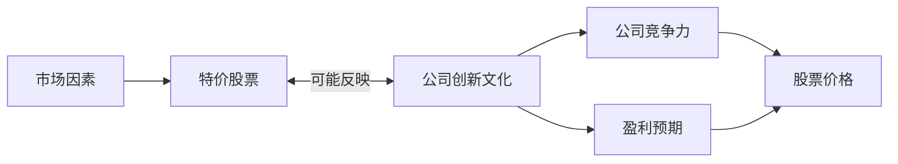

# 特价股票与公司创新文化的潜在联系

> 关键词：特价股票、公司创新文化、股票估值、创新驱动、企业文化、市场反应、企业竞争力

> 摘要：本文旨在深入探讨特价股票与公司创新文化之间的潜在联系。通过对相关概念的介绍、核心关系的分析、数学模型的构建、实际案例的研究以及应用场景的探讨等多个方面，全面剖析两者之间的内在关联。研究发现，公司创新文化可能会对股票价格产生影响，而特价股票背后的公司可能蕴含着不同的创新文化特质。了解这种联系有助于投资者更全面地评估股票价值，也为企业塑造创新文化以提升竞争力提供参考。

## 1. 背景介绍 
### 1.1 目的和范围
本研究的目的在于揭示特价股票与公司创新文化之间的潜在联系，为投资者、企业管理者以及相关研究人员提供有价值的见解。研究范围涵盖了对特价股票的定义、公司创新文化的内涵、两者之间的相互作用机制，以及在不同市场环境下的表现等方面。通过综合分析，试图解答特价股票是否能反映公司创新文化，以及公司创新文化如何影响股票价格等问题。

### 1.2 预期读者
本文预期读者包括投资者，他们可以通过了解特价股票与公司创新文化的关系，更准确地评估股票投资价值，制定更合理的投资策略；企业管理者，有助于他们认识到创新文化对企业市场表现的重要性，从而更好地塑造和强化企业创新文化；金融分析师和研究人员，为他们的研究提供新的视角和思路，推动相关领域的学术研究发展。

### 1.3 文档结构概述
本文首先介绍相关的背景信息，包括目的、读者和文档结构等。接着阐述核心概念与联系，分析特价股票和公司创新文化的原理和相互关系，并通过流程图展示。然后详细讲解核心算法原理和具体操作步骤，利用 Python 代码进行说明。随后构建数学模型和公式，进行详细讲解并举例说明。通过项目实战，展示代码实际案例并进行解读。探讨实际应用场景，推荐相关的工具和资源。最后总结未来发展趋势与挑战，提供常见问题与解答以及扩展阅读和参考资料。

### 1.4 术语表
#### 1.4.1 核心术语定义
- **特价股票**：指市场价格相对其内在价值被低估的股票，通常表现为较低的市盈率、市净率等估值指标。
- **公司创新文化**：是指在公司内部形成的一种鼓励创新、支持冒险、容忍失败的文化氛围和价值观念，它体现在公司的战略规划、组织架构、管理制度、员工行为等各个方面。

#### 1.4.2 相关概念解释
- **股票估值**：是对股票的内在价值进行评估的过程，常用的方法包括市盈率法、市净率法、现金流折现法等。
- **创新驱动**：指企业依靠创新来推动自身发展，通过技术创新、产品创新、管理创新等方式提高企业的竞争力和市场份额。

#### 1.4.3 缩略词列表
- **PE**：市盈率（Price - Earnings Ratio），是指股票价格除以每股收益的比率。
- **PB**：市净率（Price - Book Ratio），是指股票价格除以每股净资产的比率。

## 2. 核心概念与联系 

### 2.1 特价股票的原理
特价股票的出现通常是由于市场的短期非理性行为或对公司的错误认知。市场参与者可能受到情绪、宏观经济环境、行业波动等因素的影响，导致对某些股票的定价偏离其内在价值。例如，当市场整体处于熊市时，许多股票的价格都会被过度压低，即使一些公司的基本面仍然良好，其股票也可能成为特价股票。

### 2.2 公司创新文化的内涵
公司创新文化包括多个方面。从价值观层面来看，强调勇于尝试、追求卓越、开放包容的价值观，鼓励员工提出新的想法和创意。在组织架构上，可能采用扁平化的结构，减少层级限制，促进信息的快速流通和团队协作。在管理制度方面，设立奖励机制，对创新成果给予物质和精神上的奖励，同时容忍创新过程中的失败。

### 2.3 两者的潜在联系
公司创新文化可能会对股票价格产生影响。具有良好创新文化的公司通常更具发展潜力，能够不断推出新的产品和服务，提高市场竞争力，从而增加公司的盈利预期。这可能会吸引更多的投资者关注，推动股票价格上升。相反，如果市场没有充分认识到公司的创新文化价值，可能会导致股票价格被低估，形成特价股票。

另一方面，特价股票背后的公司可能蕴含着独特的创新文化。这些公司可能正在进行创新转型，但由于短期的业绩波动或市场误解，其股票价格被压低。投资者如果能够识别出这些公司的创新潜力，就有可能在未来获得超额收益。

### 2.4 文本示意图
特价股票与公司创新文化的关系可以用以下示意图表示：

特价股票 <-- 市场因素（情绪、宏观经济等）
           |
           | 可能反映
           |
公司创新文化 -- 影响 --> 公司竞争力、盈利预期
                          |
                          | 影响 --> 股票价格

### 2.5 Mermaid 流程图


## 3. 核心算法原理 & 具体操作步骤 

### 3.1 评估特价股票的算法原理
我们可以使用市盈率（PE）和市净率（PB）等指标来初步筛选特价股票。一般来说，较低的 PE 和 PB 值可能表示股票被低估。以下是使用 Python 代码实现筛选特价股票的示例：

```python
import pandas as pd

# 模拟股票数据
data = {
    '股票代码': ['000001', '000002', '000003'],
    '市盈率': [10, 20, 5],
    '市净率': [1.5, 2.5, 1]
}

df = pd.DataFrame(data)

# 定义筛选条件
pe_threshold = 15
pb_threshold = 2

# 筛选特价股票
cheap_stocks = df[(df['市盈率'] < pe_threshold) & (df['市净率'] < pb_threshold)]

print(cheap_stocks)
```

### 3.2 评估公司创新文化的操作步骤
评估公司创新文化是一个相对复杂的过程，需要综合考虑多个方面。以下是具体的操作步骤：
1. **资料收集**：收集公司的年报、新闻报道、行业研究报告等资料，了解公司的战略规划、研发投入、创新成果等信息。
2. **员工访谈**：与公司的员工进行访谈，了解公司内部的工作氛围、团队协作情况、对创新的支持程度等。
3. **创新指标分析**：分析公司的专利数量、新产品研发速度、研发费用占比等指标，评估公司的创新能力。
4. **文化评估模型**：可以使用一些文化评估模型，如丹尼森组织文化模型，对公司的创新文化进行量化评估。

### 3.3 关联分析步骤
在筛选出特价股票和评估公司创新文化后，需要进行关联分析。具体步骤如下：
1. **数据整合**：将特价股票数据和公司创新文化评估数据整合到一个数据集中。
2. **相关性分析**：使用统计方法，如皮尔逊相关系数，分析特价股票指标（如 PE、PB）与公司创新文化评估指标之间的相关性。
3. **案例研究**：选取一些具有代表性的特价股票公司，深入研究其创新文化和股票价格变化的关系，验证相关性分析的结果。

以下是使用 Python 进行相关性分析的示例代码：

```python
import numpy as np
import pandas as pd
from scipy.stats import pearsonr

# 模拟特价股票数据和创新文化评估数据
stock_data = np.array([10, 15, 20])  # 市盈率数据
innovation_data = np.array([80, 70, 60])  # 创新文化评估得分

# 计算皮尔逊相关系数
corr, p_value = pearsonr(stock_data, innovation_data)

print(f"皮尔逊相关系数: {corr}")
print(f"p 值: {p_value}")
```

## 4. 数学模型和公式 & 详细讲解 & 举例说明 

### 4.1 股票估值模型
常用的股票估值模型之一是现金流折现模型（DCF）。该模型的基本思想是将股票的未来现金流折现到当前，以确定股票的内在价值。公式如下：

$$V = \sum_{t = 1}^{n}\frac{CF_t}{(1 + r)^t}$$

其中，$V$ 表示股票的内在价值，$CF_t$ 表示第 $t$ 期的现金流，$r$ 表示折现率，$n$ 表示预测期数。

### 4.2 举例说明
假设某公司未来三年的现金流分别为 100 万元、120 万元和 150 万元，折现率为 10%。则该公司股票的内在价值计算如下：

$$V=\frac{100}{(1 + 0.1)^1}+\frac{120}{(1 + 0.1)^2}+\frac{150}{(1 + 0.1)^3}$$

$$V=\frac{100}{1.1}+\frac{120}{1.21}+\frac{150}{1.331}$$

$$V\approx90.91 + 99.17+112.69$$

$$V\approx302.77$$（万元）

如果该公司股票的市场价格低于 302.77 万元，则可能被认为是特价股票。

### 4.3 创新文化评估模型
我们可以使用加权平均法来构建一个简单的创新文化评估模型。假设我们从研发投入、专利数量、新产品研发速度三个方面评估公司的创新文化，权重分别为 $w_1$、$w_2$、$w_3$，对应的得分分别为 $s_1$、$s_2$、$s_3$。则创新文化评估得分 $S$ 的计算公式为：

$$S = w_1s_1+w_2s_2 + w_3s_3$$

其中，$w_1 + w_2+w_3 = 1$。

### 4.4 举例说明
假设研发投入、专利数量、新产品研发速度的权重分别为 0.3、0.4、0.3，对应的得分分别为 80 分、70 分、90 分。则创新文化评估得分计算如下：

$$S=0.3\times80 + 0.4\times70+0.3\times90$$

$$S = 24+28 + 27$$

$$S = 79$$（分）

## 5. 项目实战：代码实际案例和详细解释说明 

### 5.1  开发环境搭建
在进行项目实战之前，需要搭建相应的开发环境。以下是具体的步骤：
1. **安装 Python**：从 Python 官方网站（https://www.python.org/downloads/）下载并安装 Python 3.x 版本。
2. **安装必要的库**：使用以下命令安装 pandas、numpy、scipy 等必要的库：
```sh
pip install pandas numpy scipy
```
3. **选择开发工具**：可以选择使用 PyCharm、Jupyter Notebook 等开发工具进行代码编写和调试。

### 5.2  源代码详细实现和代码解读
以下是一个完整的项目实战代码示例，包括特价股票筛选、公司创新文化评估和关联分析：

```python
import pandas as pd
import numpy as np
from scipy.stats import pearsonr

# 模拟股票数据
stock_data = {
    '股票代码': ['000001', '000002', '000003', '000004', '000005'],
    '市盈率': [10, 20, 5, 12, 18],
    '市净率': [1.5, 2.5, 1, 1.2, 2.2]
}

df_stock = pd.DataFrame(stock_data)

# 定义筛选条件
pe_threshold = 15
pb_threshold = 2

# 筛选特价股票
cheap_stocks = df_stock[(df_stock['市盈率'] < pe_threshold) & (df_stock['市净率'] < pb_threshold)]

print("特价股票:")
print(cheap_stocks)

# 模拟公司创新文化评估数据
innovation_data = {
    '股票代码': ['000001', '000002', '000003', '000004', '000005'],
    '研发投入得分': [80, 70, 90, 75, 85],
    '专利数量得分': [70, 60, 80, 72, 82],
    '新产品研发速度得分': [85, 75, 95, 80, 90]
}

df_innovation = pd.DataFrame(innovation_data)

# 计算创新文化评估得分
weights = [0.3, 0.4, 0.3]
df_innovation['创新文化评估得分'] = df_innovation[['研发投入得分', '专利数量得分', '新产品研发速度得分']].values.dot(weights)

print("\n公司创新文化评估得分:")
print(df_innovation[['股票代码', '创新文化评估得分']])

# 数据整合
merged_data = pd.merge(cheap_stocks, df_innovation, on='股票代码')

# 关联分析
corr, p_value = pearsonr(merged_data['市盈率'], merged_data['创新文化评估得分'])

print("\n关联分析结果:")
print(f"皮尔逊相关系数: {corr}")
print(f"p 值: {p_value}")
```

### 5.3  代码解读与分析
1. **特价股票筛选**：通过定义市盈率和市净率的阈值，筛选出符合条件的特价股票。
2. **公司创新文化评估**：模拟了公司的研发投入、专利数量、新产品研发速度等数据，并使用加权平均法计算创新文化评估得分。
3. **数据整合**：将特价股票数据和公司创新文化评估数据按照股票代码进行合并，以便进行关联分析。
4. **关联分析**：使用皮尔逊相关系数分析特价股票的市盈率与公司创新文化评估得分之间的相关性。

通过这个项目实战，我们可以初步了解特价股票与公司创新文化之间的潜在联系。

## 6. 实际应用场景 

### 6.1 投资者决策
投资者可以利用特价股票与公司创新文化的关系来制定投资策略。当发现一只特价股票时，深入研究其背后公司的创新文化。如果公司具有良好的创新文化，可能意味着该公司具有较大的发展潜力，股票价格在未来有上涨的空间。投资者可以在适当的时候买入该股票，以获取超额收益。

### 6.2 企业管理
企业管理者可以认识到创新文化对企业市场表现的重要性。通过塑造和强化企业创新文化，提高企业的竞争力和市场价值。同时，关注股票价格的变化，了解市场对企业创新文化的认知程度，及时调整企业战略和沟通策略。

### 6.3 金融分析师研究
金融分析师可以将公司创新文化纳入股票分析的框架中。通过研究特价股票与公司创新文化的关系，提供更全面、准确的股票分析报告，为投资者和企业管理者提供有价值的建议。

## 7. 工具和资源推荐
### 7.1 学习资源推荐
#### 7.1.1 书籍推荐
- 《聪明的投资者》（The Intelligent Investor）：本杰明·格雷厄姆（Benjamin Graham）著，这本书是价值投资的经典之作，介绍了股票投资的基本原理和方法。
- 《创新者的窘境》（The Innovator's Dilemma）：克莱顿·克里斯坦森（Clayton M. Christensen）著，深入探讨了企业创新的挑战和机遇。

#### 7.1.2 在线课程
- Coursera 上的“Financial Markets”课程：由耶鲁大学的罗伯特·席勒（Robert Shiller）教授讲授，介绍了金融市场的基本原理和投资策略。
- edX 上的“Innovation Management”课程：帮助学习者了解创新管理的理论和实践。

#### 7.1.3 技术博客和网站
- Seeking Alpha：提供股票分析、投资策略等方面的文章和研究报告。
- Harvard Business Review：发表关于企业管理、创新等领域的前沿研究和案例分析。

### 7.2 开发工具框架推荐
#### 7.2.1 IDE和编辑器
- PyCharm：一款专业的 Python 集成开发环境，提供代码编辑、调试、版本控制等功能。
- Jupyter Notebook：一个交互式的开发环境，适合进行数据分析和可视化。

#### 7.2.2 调试和性能分析工具
- pdb：Python 内置的调试工具，用于调试 Python 代码。
- cProfile：Python 标准库中的性能分析工具，用于分析代码的性能瓶颈。

#### 7.2.3 相关框架和库
- pandas：用于数据处理和分析的 Python 库，提供了高效的数据结构和数据操作方法。
- numpy：用于科学计算的 Python 库，提供了高效的数组操作和数学函数。
- scipy：用于科学计算和统计分析的 Python 库，提供了丰富的统计函数和算法。

### 7.3 相关论文著作推荐
#### 7.3.1 经典论文
- “The Capital Asset Pricing Model: Theory and Evidence”：由 Eugene F. Fama 和 Kenneth R. French 撰写，对资本资产定价模型进行了深入的研究和分析。
- “The Theory of Economic Development”：约瑟夫·熊彼特（Joseph A. Schumpeter）著，提出了创新驱动经济发展的理论。

#### 7.3.2 最新研究成果
- 关注顶级金融和管理学期刊，如《Journal of Finance》《Management Science》等，了解关于特价股票和公司创新文化的最新研究成果。

#### 7.3.3 应用案例分析
- 一些商业案例数据库，如哈佛商业案例库、毅伟商学院案例库等，提供了大量关于企业创新和股票市场的实际案例分析。

## 8. 总结：未来发展趋势与挑战
### 8.1 未来发展趋势
- **数据驱动的分析**：随着大数据和人工智能技术的发展，未来将有更多的数据用于分析特价股票与公司创新文化的关系。通过挖掘海量的市场数据、企业数据和社交媒体数据，可以更准确地评估公司的创新文化和股票价值。
- **跨学科研究**：特价股票与公司创新文化的研究涉及金融、管理、心理学等多个学科。未来的研究将更加注重跨学科的融合，从不同的角度深入探讨两者之间的关系。
- **创新文化的量化评估**：目前对公司创新文化的评估主要基于定性分析和主观判断。未来将开发出更加科学、客观的量化评估方法，提高评估的准确性和可靠性。

### 8.2 挑战
- **数据质量和可用性**：获取准确、全面的股票数据和公司创新文化数据存在一定的困难。数据的质量和可用性将影响分析结果的准确性。
- **文化的复杂性**：公司创新文化是一个复杂的概念，受到多种因素的影响。如何准确地衡量和理解公司创新文化的内涵和影响是一个挑战。
- **市场的不确定性**：股票市场受到宏观经济环境、政策变化、投资者情绪等多种因素的影响，具有较高的不确定性。如何在不确定的市场环境中准确把握特价股票与公司创新文化的关系是一个难题。

## 9. 附录：常见问题与解答
### 9.1 如何确定特价股票的标准？
特价股票的标准没有统一的定义，通常可以参考市盈率、市净率、股息率等估值指标。一般来说，较低的市盈率和市净率可能表示股票被低估。但需要注意的是，这些指标只是参考，还需要结合公司的基本面和行业情况进行综合分析。

### 9.2 如何评估公司的创新文化？
评估公司的创新文化需要综合考虑多个方面，如公司的战略规划、研发投入、专利数量、新产品研发速度、员工访谈等。可以使用一些文化评估模型和工具，如丹尼森组织文化模型，对公司的创新文化进行量化评估。

### 9.3 特价股票一定与公司创新文化有关吗？
不一定。特价股票的出现可能是由于多种原因，如市场的短期非理性行为、行业竞争、公司业绩下滑等。虽然公司创新文化可能会影响股票价格，但并不是所有的特价股票都与公司创新文化有关。需要具体情况具体分析。

## 10. 扩展阅读 & 参考资料
### 10.1 扩展阅读
- 《金融炼金术》（The Alchemy of Finance）：乔治·索罗斯（George Soros）著，探讨了金融市场的运作机制和投资者的行为。
- 《从 0 到 1》（Zero to One）：彼得·蒂尔（Peter Thiel）著，介绍了创业和创新的理念和方法。

### 10.2 参考资料
- 相关的金融和管理学期刊，如《Journal of Finance》《Management Science》《Academy of Management Journal》等。
- 证券交易所的官方网站，如上海证券交易所（https://www.sse.com.cn/）、深圳证券交易所（https://www.szse.cn/）等，获取股票市场的相关数据和信息。
- 企业的官方网站和年报，了解公司的基本情况和创新战略。