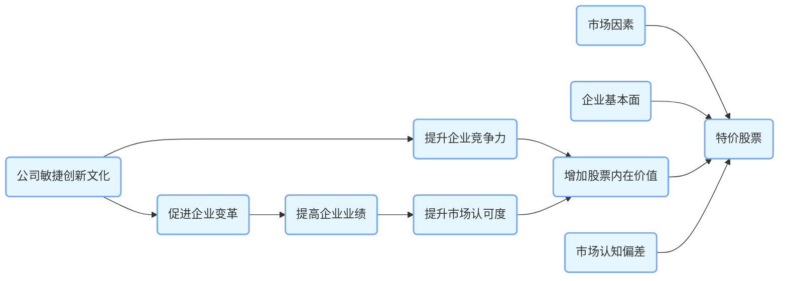

# 特价股票与公司敏捷创新文化的深度分析方法

> 关键词：特价股票、公司敏捷创新文化、深度分析方法、财务指标、企业文化评估

> 摘要：本文旨在深入探讨特价股票与公司敏捷创新文化之间的关系，并提供一套全面的深度分析方法。通过对特价股票的概念、形成原因及评估要点的阐述，以及对公司敏捷创新文化的内涵、特征和重要性的分析，揭示两者之间的内在联系。同时，详细介绍了从财务视角、企业文化视角等多维度进行分析的具体方法和步骤，并结合实际案例进行说明。此外，还探讨了该分析方法在实际应用场景中的作用，推荐了相关的工具和资源，最后对未来发展趋势与挑战进行了总结，为投资者和企业管理者提供有价值的参考。

## 1. 背景介绍 
### 1.1 目的和范围
本研究的目的在于建立一套科学、系统的深度分析方法，用于剖析特价股票与公司敏捷创新文化之间的关系。通过对这一关系的深入理解，投资者能够更准确地评估股票的投资价值，企业管理者可以更好地认识到敏捷创新文化对企业市场表现的影响，从而优化企业战略和文化建设。

本研究的范围涵盖了特价股票的定义、分类、影响因素，公司敏捷创新文化的构成要素、评估方法，以及两者之间的相互作用机制。同时，还涉及到如何运用财务分析、企业文化评估等工具和方法来进行深度分析，并通过实际案例进行验证和应用。

### 1.2 预期读者
本文预期读者包括投资者、金融分析师、企业管理者、学术研究人员以及对金融市场和企业文化感兴趣的相关人士。对于投资者来说，希望通过本文的分析方法更好地选择投资标的；金融分析师可以借鉴文中的方法完善其股票分析体系；企业管理者能够从中获得关于企业文化建设和市场价值提升的启示；学术研究人员则可以在此基础上进行更深入的理论研究。

### 1.3 文档结构概述
本文共分为十个部分。第一部分为背景介绍，阐述研究的目的、范围、预期读者和文档结构概述。第二部分介绍核心概念与联系，包括特价股票和公司敏捷创新文化的概念、原理和两者之间的联系，并通过文本示意图和 Mermaid 流程图进行展示。第三部分讲解核心算法原理和具体操作步骤，运用 Python 源代码详细阐述分析过程。第四部分介绍数学模型和公式，并进行详细讲解和举例说明。第五部分通过项目实战，展示代码实际案例并进行详细解释说明。第六部分探讨实际应用场景。第七部分推荐相关的工具和资源，包括学习资源、开发工具框架和相关论文著作。第八部分总结未来发展趋势与挑战。第九部分为附录，解答常见问题。第十部分提供扩展阅读和参考资料。

### 1.4 术语表
#### 1.4.1 核心术语定义
- **特价股票**：指在股票市场中，价格相对其内在价值被低估的股票。这种低估可能是由于市场短期波动、行业负面消息、企业短期困境等多种因素导致。
- **公司敏捷创新文化**：一种强调快速响应市场变化、鼓励创新和持续改进的企业文化。它包括开放的沟通氛围、灵活的组织架构、对创新的支持和激励等要素。

#### 1.4.2 相关概念解释
- **股票内在价值**：指股票未来预期现金流的现值，是评估股票真实价值的重要指标。它受到公司盈利能力、资产质量、行业前景等多种因素的影响。
- **企业文化评估**：通过一系列方法和指标，对企业的价值观、行为准则、员工态度等文化要素进行评价和分析的过程。

#### 1.4.3 缩略词列表
- **PE**：市盈率（Price - Earnings Ratio），是股票价格与每股收益的比率，用于衡量股票的估值水平。
- **ROE**：净资产收益率（Return on Equity），反映股东权益的收益水平，用以衡量公司运用自有资本的效率。

## 2. 核心概念与联系 

### 2.1 特价股票的概念和原理
特价股票是股票市场中一种特殊的投资标的。其价格被低估的原因主要有以下几点：
- **市场情绪影响**：当市场整体处于悲观情绪时，投资者可能会过度抛售股票，导致一些优质股票的价格下跌到其内在价值以下。
- **企业短期困境**：企业可能由于短期的经营问题、突发事件等原因，导致市场对其未来前景产生担忧，从而使股票价格下降。
- **行业负面消息**：整个行业面临不利因素时，行业内的股票价格可能会受到牵连，即使某些企业本身具有良好的基本面，其股票价格也可能被低估。

特价股票的原理基于价值投资理论，即股票价格最终会回归其内在价值。投资者通过寻找被低估的股票，在价格回归价值的过程中获得收益。

### 2.2 公司敏捷创新文化的内涵和特征
公司敏捷创新文化是一种适应快速变化市场环境的企业文化。其内涵包括以下几个方面：
- **开放的沟通氛围**：鼓励员工之间、部门之间的信息共享和交流，打破信息壁垒，促进创新思想的产生。
- **灵活的组织架构**：能够快速调整组织架构和业务流程，以适应市场变化和客户需求。
- **对创新的支持和激励**：企业为员工提供创新的资源和环境，对创新成果给予奖励和认可。

其特征主要有：
- **快速响应**：能够迅速对市场变化做出反应，及时调整企业战略和产品服务。
- **持续改进**：不断寻求优化和改进企业的运营和管理，提高企业的竞争力。
- **勇于尝试**：鼓励员工勇于尝试新的想法和方法，不怕失败。

### 2.3 特价股票与公司敏捷创新文化的联系
公司敏捷创新文化对特价股票的形成和发展具有重要影响。一方面，具有敏捷创新文化的企业能够更好地适应市场变化，及时调整战略和业务，提高企业的盈利能力和市场竞争力，从而使其股票的内在价值得到提升。当市场未能及时认识到企业的这种优势时，就可能出现股票价格被低估的情况，形成特价股票。

另一方面，特价股票的存在也可能促使企业进一步加强敏捷创新文化建设。企业为了提升股票价格和市场形象，会更加注重创新和变革，以提高企业的业绩和市场认可度。

### 2.4 文本示意图
特价股票与公司敏捷创新文化的联系可以用以下文本示意图表示：

特价股票 <---- 市场因素（情绪、行业消息等）
           |
           |---- 企业基本面（盈利能力、资产质量等）
           |
           |---- 公司敏捷创新文化（开放沟通、灵活架构、创新激励）
           |
           |---- 提升企业竞争力 ----> 增加股票内在价值
           |
           |---- 市场认知偏差 ----> 股票价格低估（特价股票）

### 2.5 Mermaid 流程图


## 3. 核心算法原理 & 具体操作步骤 

### 3.1 核心算法原理
我们的核心算法旨在综合评估特价股票和公司敏捷创新文化之间的关系。主要通过以下几个步骤实现：
- **财务指标分析**：通过计算和分析一系列财务指标，如市盈率（PE）、净资产收益率（ROE）、市净率（PB）等，评估股票的估值水平和企业的盈利能力。
- **企业文化评估**：设计一套企业文化评估指标体系，通过问卷调查、访谈等方式收集数据，对公司的敏捷创新文化进行量化评估。
- **关联分析**：运用统计分析方法，如相关性分析、回归分析等，研究财务指标和企业文化评估结果之间的关系，从而揭示特价股票与公司敏捷创新文化之间的内在联系。

### 3.2 具体操作步骤

#### 3.2.1 数据收集
- **财务数据**：从金融数据库（如东方财富、同花顺等）获取股票的历史价格、财务报表等数据。
- **企业文化数据**：通过设计问卷对企业员工进行调查，收集关于企业沟通氛围、组织灵活性、创新激励等方面的数据。

#### 3.2.2 财务指标计算
使用 Python 代码计算财务指标，以下是一个简单的示例：

```python
import pandas as pd

# 假设我们有一个包含股票价格和每股收益的 DataFrame
data = {
    'stock_price': [10, 12, 15, 13],
    'earnings_per_share': [1, 1.2, 1.5, 1.3]
}
df = pd.DataFrame(data)

# 计算市盈率（PE）
df['PE'] = df['stock_price'] / df['earnings_per_share']

print(df)
```

#### 3.2.3 企业文化评估
根据问卷数据，对每个问题进行打分，然后计算各项指标的得分，最后得出企业文化的综合得分。以下是一个简单的示例：

```python
# 假设我们有一个包含员工对企业文化问题回答的 DataFrame
culture_data = {
    'question1': [4, 3, 5, 4],
    'question2': [3, 4, 4, 3],
    'question3': [5, 4, 5, 4]
}
culture_df = pd.DataFrame(culture_data)

# 计算各项指标的得分
culture_df['score1'] = culture_df['question1'] * 0.3
culture_df['score2'] = culture_df['question2'] * 0.3
culture_df['score3'] = culture_df['question3'] * 0.4

# 计算企业文化综合得分
culture_df['total_score'] = culture_df['score1'] + culture_df['score2'] + culture_df['score3']

print(culture_df)
```

#### 3.2.4 关联分析
使用 Python 的 `scipy` 库进行相关性分析，以下是一个示例：

```python
from scipy.stats import pearsonr

# 假设我们已经计算出了财务指标和企业文化综合得分
pe_data = df['PE']
culture_score = culture_df['total_score']

# 计算皮尔逊相关系数和 p 值
corr, p_value = pearsonr(pe_data, culture_score)

print(f"皮尔逊相关系数: {corr}")
print(f"p 值: {p_value}")
```

## 4. 数学模型和公式 & 详细讲解 & 举例说明 

### 4.1 财务指标相关公式
- **市盈率（PE）**：
$$PE = \frac{P}{EPS}$$
其中，$P$ 表示股票价格，$EPS$ 表示每股收益。市盈率反映了投资者为获取公司每一元盈利所愿意支付的价格。例如，某股票价格为 20 元，每股收益为 2 元，则其市盈率为 $20 \div 2 = 10$ 倍。

- **净资产收益率（ROE）**：
$$ROE = \frac{净利润}{净资产} \times 100\%$$
净资产收益率衡量了公司运用自有资本的效率。例如，某公司净利润为 1000 万元，净资产为 5000 万元，则其净资产收益率为 $(1000 \div 5000) \times 100\% = 20\%$。

- **市净率（PB）**：
$$PB = \frac{P}{BVPS}$$
其中，$P$ 表示股票价格，$BVPS$ 表示每股净资产。市净率反映了市场对公司净资产的估值水平。例如，某股票价格为 15 元，每股净资产为 5 元，则其市净率为 $15 \div 5 = 3$ 倍。

### 4.2 企业文化评估指标体系及公式
假设我们的企业文化评估指标体系包括沟通氛围（$C$）、组织灵活性（$O$）、创新激励（$I$）三个方面，其权重分别为 $w_C$、$w_O$、$w_I$，且 $w_C + w_O + w_I = 1$。每个方面又包含若干个问题，每个问题的得分分别为 $s_{C_i}$、$s_{O_j}$、$s_{I_k}$。

则沟通氛围得分 $S_C$ 为：
$$S_C = \frac{\sum_{i = 1}^{n_C} s_{C_i}}{n_C}$$
其中，$n_C$ 为沟通氛围方面的问题数量。

组织灵活性得分 $S_O$ 为：
$$S_O = \frac{\sum_{j = 1}^{n_O} s_{O_j}}{n_O}$$
其中，$n_O$ 为组织灵活性方面的问题数量。

创新激励得分 $S_I$ 为：
$$S_I = \frac{\sum_{k = 1}^{n_I} s_{I_k}}{n_I}$$
其中，$n_I$ 为创新激励方面的问题数量。

企业文化综合得分 $S$ 为：
$$S = w_C \times S_C + w_O \times S_O + w_I \times S_I$$

例如，假设 $w_C = 0.3$，$w_O = 0.3$，$w_I = 0.4$，沟通氛围方面有 3 个问题，得分分别为 4、3、5；组织灵活性方面有 2 个问题，得分分别为 3、4；创新激励方面有 2 个问题，得分分别为 5、4。

则 $S_C = \frac{4 + 3 + 5}{3} = 4$
$S_O = \frac{3 + 4}{2} = 3.5$
$S_I = \frac{5 + 4}{2} = 4.5$

$S = 0.3 \times 4 + 0.3 \times 3.5 + 0.4 \times 4.5 = 4.05$

### 4.3 关联分析公式
- **皮尔逊相关系数**：
$$r = \frac{\sum_{i = 1}^{n} (x_i - \bar{x})(y_i - \bar{y})}{\sqrt{\sum_{i = 1}^{n} (x_i - \bar{x})^2 \sum_{i = 1}^{n} (y_i - \bar{y})^2}}$$
其中，$x_i$ 和 $y_i$ 分别为两个变量的观测值，$\bar{x}$ 和 $\bar{y}$ 分别为两个变量的均值，$n$ 为观测值的数量。皮尔逊相关系数 $r$ 的取值范围为 $[-1, 1]$，$r$ 越接近 1 表示两个变量正相关性越强，越接近 -1 表示负相关性越强，接近 0 表示相关性较弱。

例如，假设有两个变量 $X = [1, 2, 3, 4]$ 和 $Y = [2, 4, 6, 8]$，则 $\bar{x} = \frac{1 + 2 + 3 + 4}{4} = 2.5$，$\bar{y} = \frac{2 + 4 + 6 + 8}{4} = 5$。

$\sum_{i = 1}^{4} (x_i - \bar{x})(y_i - \bar{y}) = (1 - 2.5)(2 - 5) + (2 - 2.5)(4 - 5) + (3 - 2.5)(6 - 5) + (4 - 2.5)(8 - 5) = 10$

$\sum_{i = 1}^{4} (x_i - \bar{x})^2 = (1 - 2.5)^2 + (2 - 2.5)^2 + (3 - 2.5)^2 + (4 - 2.5)^2 = 5$

$\sum_{i = 1}^{4} (y_i - \bar{y})^2 = (2 - 5)^2 + (4 - 5)^2 + (6 - 5)^2 + (8 - 5)^2 = 20$

$r = \frac{10}{\sqrt{5 \times 20}} = 1$，说明 $X$ 和 $Y$ 正相关性很强。

## 5. 项目实战：代码实际案例和详细解释说明 

### 5.1  开发环境搭建
- **Python 环境**：安装 Python 3.x 版本，可以从 Python 官方网站（https://www.python.org/downloads/）下载安装包进行安装。
- **开发工具**：推荐使用 PyCharm 作为开发工具，它具有强大的代码编辑、调试和项目管理功能。可以从 JetBrains 官方网站（https://www.jetbrains.com/pycharm/）下载社区版进行安装。
- **相关库**：安装所需的 Python 库，如 `pandas`、`scipy` 等。可以使用 `pip` 命令进行安装：
```sh
pip install pandas scipy
```

### 5.2  源代码详细实现和代码解读

#### 5.2.1 数据收集与预处理
```python
import pandas as pd

# 模拟从金融数据库获取财务数据
financial_data = {
    'stock_price': [10, 12, 15, 13, 14],
    'earnings_per_share': [1, 1.2, 1.5, 1.3, 1.4],
    'net_asset': [50, 60, 70, 65, 75],
    'net_profit': [5, 6, 7, 6.5, 7.5]
}
financial_df = pd.DataFrame(financial_data)

# 模拟从问卷调查获取企业文化数据
culture_data = {
    'question1': [4, 3, 5, 4, 3],
    'question2': [3, 4, 4, 3, 4],
    'question3': [5, 4, 5, 4, 5]
}
culture_df = pd.DataFrame(culture_data)

# 数据预处理：处理缺失值等
financial_df = financial_df.dropna()
culture_df = culture_df.dropna()
```
**代码解读**：这段代码模拟了从金融数据库和问卷调查中获取财务数据和企业文化数据，并进行了简单的数据预处理，删除了包含缺失值的行。

#### 5.2.2 财务指标计算
```python
# 计算市盈率（PE）
financial_df['PE'] = financial_df['stock_price'] / financial_df['earnings_per_share']

# 计算净资产收益率（ROE）
financial_df['ROE'] = (financial_df['net_profit'] / financial_df['net_asset']) * 100

# 计算每股净资产
financial_df['BVPS'] = financial_df['net_asset'] / len(financial_df)

# 计算市净率（PB）
financial_df['PB'] = financial_df['stock_price'] / financial_df['BVPS']

print(financial_df)
```
**代码解读**：这段代码根据前面介绍的财务指标公式，计算了市盈率、净资产收益率、每股净资产和市净率，并将结果添加到财务数据的 DataFrame 中。

#### 5.2.3 企业文化评估
```python
# 定义各项指标的权重
w_C = 0.3
w_O = 0.3
w_I = 0.4

# 计算沟通氛围得分
culture_df['S_C'] = culture_df['question1'].mean()

# 计算组织灵活性得分
culture_df['S_O'] = culture_df['question2'].mean()

# 计算创新激励得分
culture_df['S_I'] = culture_df['question3'].mean()

# 计算企业文化综合得分
culture_df['total_score'] = w_C * culture_df['S_C'] + w_O * culture_df['S_O'] + w_I * culture_df['S_I']

print(culture_df)
```
**代码解读**：这段代码根据企业文化评估指标体系及公式，计算了沟通氛围、组织灵活性、创新激励得分和企业文化综合得分，并将结果添加到企业文化数据的 DataFrame 中。

#### 5.2.4 关联分析
```python
from scipy.stats import pearsonr

# 提取财务指标和企业文化综合得分
pe_data = financial_df['PE']
culture_score = culture_df['total_score']

# 计算皮尔逊相关系数和 p 值
corr, p_value = pearsonr(pe_data, culture_score)

print(f"皮尔逊相关系数: {corr}")
print(f"p 值: {p_value}")
```
**代码解读**：这段代码使用 `scipy` 库的 `pearsonr` 函数计算了财务指标（市盈率）和企业文化综合得分之间的皮尔逊相关系数和 p 值，以分析两者之间的相关性。

### 5.3  代码解读与分析
通过上述代码，我们完成了从数据收集、预处理、财务指标计算、企业文化评估到关联分析的整个流程。在实际应用中，我们可以根据具体需求对代码进行扩展和优化。

例如，数据收集部分可以使用真实的金融 API 和问卷调查平台来获取数据；财务指标计算可以添加更多的指标，如股息率、毛利率等；企业文化评估可以设计更复杂的指标体系和问卷问题；关联分析可以使用更高级的统计方法，如多元回归分析等。

通过对皮尔逊相关系数和 p 值的分析，我们可以判断特价股票的财务指标和公司敏捷创新文化之间是否存在显著的相关性。如果相关系数接近 1 且 p 值小于 0.05，则说明两者存在显著的正相关性，即公司敏捷创新文化越强，股票的估值可能越高；反之，如果相关系数接近 -1 且 p 值小于 0.05，则说明存在显著的负相关性。

## 6. 实际应用场景 
### 6.1 投资决策
投资者可以利用本文介绍的深度分析方法，在选择投资标的时，不仅关注股票的财务指标，还考虑公司的敏捷创新文化。通过评估公司的创新能力和适应市场变化的能力，更准确地判断股票的投资价值。例如，当发现一只股票价格被低估（特价股票），同时其所属公司具有较强的敏捷创新文化时，投资者可以认为该股票具有较大的投资潜力，可能在未来获得较高的收益。

### 6.2 企业战略调整
企业管理者可以运用该分析方法，了解企业的敏捷创新文化对股票市场表现的影响。如果发现企业的股票价格被低估，且企业文化评估结果显示创新文化存在不足，企业管理者可以针对性地加强企业文化建设，提升企业的创新能力和市场竞争力，从而提高股票的市场价值。

### 6.3 行业研究
金融分析师和学术研究人员可以使用该方法对不同行业的企业进行研究，比较不同行业企业的敏捷创新文化和股票市场表现之间的差异。通过分析行业特点和趋势，为行业发展提供有价值的建议和参考。

## 7. 工具和资源推荐
### 7.1 学习资源推荐
#### 7.1.1 书籍推荐
- 《聪明的投资者》（The Intelligent Investor）：作者本杰明·格雷厄姆（Benjamin Graham），被誉为价值投资的圣经，书中详细介绍了股票投资的基本原理和方法，对理解特价股票的概念和分析方法有很大帮助。
- 《创新者的窘境》（The Innovator's Dilemma）：作者克莱顿·克里斯坦森（Clayton M. Christensen），探讨了企业在创新过程中面临的挑战和机遇，对理解公司敏捷创新文化的重要性和建设方法有深刻的启示。

#### 7.1.2 在线课程
- Coursera 上的“Financial Markets”：由耶鲁大学教授罗伯特·席勒（Robert J. Shiller）授课，系统介绍了金融市场的基本原理和投资分析方法。
- edX 上的“Organizational Behavior”：帮助学习者了解组织行为学的基本理论和方法，对理解企业文化有很大帮助。

#### 7.1.3 技术博客和网站
- 雪球网（https://xueqiu.com/）：提供丰富的股票市场信息和投资者交流平台，投资者可以在这里获取最新的股票分析和投资策略。
- 36氪（https://36kr.com/）：专注于科技创新和创业领域，提供大量关于企业创新和文化建设的文章和案例。

### 7.2 开发工具框架推荐
#### 7.2.1 IDE和编辑器
- PyCharm：功能强大的 Python 集成开发环境，具有代码自动补全、调试、版本控制等功能，适合 Python 开发。
- Jupyter Notebook：交互式编程环境，方便进行数据探索和分析，适合进行数据分析和算法实现。

#### 7.2.2 调试和性能分析工具
- `pdb`：Python 内置的调试器，可以帮助开发者定位代码中的问题。
- `cProfile`：Python 标准库中的性能分析工具，可以分析代码的执行时间和调用次数，帮助优化代码性能。

#### 7.2.3 相关框架和库
- `pandas`：强大的数据处理和分析库，提供了 DataFrame 等数据结构，方便进行数据的读取、处理和分析。
- `scipy`：科学计算库，提供了丰富的统计分析和数值计算函数，用于进行关联分析等统计计算。

### 7.3 相关论文著作推荐
#### 7.3.1 经典论文
- Fama, E. F., & French, K. R. (1992). The cross - section of expected stock returns. The Journal of Finance, 47(2), 427 - 465. 该论文提出了著名的 Fama - French 三因子模型，对股票收益率的影响因素进行了深入研究。
- Porter, M. E. (1985). Competitive advantage: Creating and sustaining superior performance. Free Press. 迈克尔·波特（Michael E. Porter）的经典著作，阐述了企业竞争优势的来源和构建方法，对理解企业的市场竞争力有重要意义。

#### 7.3.2 最新研究成果
- 可以关注《Journal of Financial Economics》、《Management Science》等顶级学术期刊，获取关于股票市场和企业文化的最新研究成果。

#### 7.3.3 应用案例分析
- 可以参考一些商业案例书籍和报告，如《哈佛商业评论》（Harvard Business Review）上的案例文章，了解企业在实践中如何通过创新文化提升企业价值和市场竞争力。

## 8. 总结：未来发展趋势与挑战
### 8.1 未来发展趋势
- **数字化转型加速**：随着信息技术的快速发展，企业的数字化转型将加速，公司敏捷创新文化将更加注重数字化能力的培养和提升。这将使得企业能够更快地响应市场变化，推出创新的产品和服务，从而对股票市场表现产生积极影响。
- **跨学科研究深入**：特价股票与公司敏捷创新文化的研究将越来越多地涉及金融、管理、心理学等多个学科的知识和方法。跨学科的研究将有助于更全面、深入地理解两者之间的关系，为投资决策和企业管理提供更科学的依据。
- **大数据和人工智能应用广泛**：大数据和人工智能技术将在该领域得到更广泛的应用。通过分析海量的金融数据和企业内部数据，可以更准确地评估特价股票和公司敏捷创新文化，提高分析的效率和准确性。

### 8.2 挑战
- **数据质量和隐私问题**：在数据收集和分析过程中，数据质量和隐私问题是面临的重要挑战。不准确或不完整的数据可能导致分析结果的偏差，而企业内部数据的隐私保护也需要得到重视。
- **企业文化评估的主观性**：企业文化评估往往具有一定的主观性，不同的评估方法和评估人员可能得出不同的结果。如何建立客观、科学的企业文化评估体系是需要解决的问题。
- **市场不确定性**：股票市场受到多种因素的影响，具有很大的不确定性。即使企业具有良好的敏捷创新文化，其股票价格也可能受到市场整体波动、宏观经济环境等因素的影响，导致分析结果与实际情况存在偏差。

## 9. 附录：常见问题与解答
### 9.1 如何判断一只股票是否为特价股票？
判断一只股票是否为特价股票需要综合考虑多个因素。可以通过分析财务指标，如市盈率、市净率等，与同行业其他股票进行比较，如果这些指标明显低于行业平均水平，则该股票可能被低估。此外，还需要考虑企业的基本面、行业前景、市场情绪等因素。

### 9.2 企业文化评估的问卷应该如何设计？
企业文化评估问卷的设计应该围绕公司敏捷创新文化的核心要素，如开放的沟通氛围、灵活的组织架构、对创新的支持和激励等。可以设计一系列问题，让员工根据实际情况进行打分。问题的表述应该清晰、明确，避免歧义。同时，为了保证评估的客观性，可以邀请不同部门、不同层级的员工参与问卷调查。

### 9.3 皮尔逊相关系数和 p 值的含义是什么？
皮尔逊相关系数衡量了两个变量之间的线性相关性，取值范围为 $[-1, 1]$。当相关系数接近 1 时，表示两个变量正相关性很强；接近 -1 时，表示负相关性很强；接近 0 时，表示相关性较弱。

p 值是用于检验相关性是否显著的统计量。一般来说，当 p 值小于 0.05 时，认为两个变量之间的相关性是显著的；当 p 值大于 0.05 时，认为相关性不显著。

## 10. 扩展阅读 & 参考资料
### 10.1 扩展阅读
- 《金融炼金术》（The Alchemy of Finance），作者乔治·索罗斯（George Soros），探讨了金融市场的运行规律和投资者的行为模式。
- 《从优秀到卓越》（Good to Great），作者吉姆·柯林斯（Jim Collins），研究了企业如何从优秀走向卓越，对企业的战略和文化建设有重要启示。

### 10.2 参考资料
- 东方财富网（https://www.eastmoney.com/）：提供丰富的金融数据和市场资讯。
- 同花顺财经（https://www.10jqka.com.cn/）：专注于股票市场分析和投资服务。
- 企业官方网站：获取企业的年报、公告等信息，了解企业的经营状况和文化建设情况。