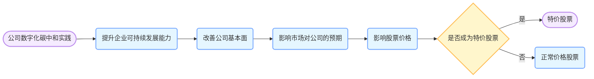

# 特价股票与公司数字化碳中和实践的关联性研究

> 关键词：特价股票、公司数字化、碳中和实践、关联性、金融市场、可持续发展、企业战略

> 摘要：本文聚焦于特价股票与公司数字化碳中和实践之间的关联性进行深入研究。随着全球对可持续发展和气候变化问题的关注度不断提升，公司的碳中和实践成为重要的发展方向，而数字化则为其提供了有力的支撑手段。同时，金融市场中的特价股票也反映了投资者对公司的预期和市场的供需关系。通过对两者关联性的探讨，有助于投资者更好地理解市场动态，企业更合理地制定发展战略，促进经济的可持续发展。文章首先介绍了研究的背景、目的、范围和相关术语，接着阐述了核心概念及其联系，详细讲解了相关算法原理和数学模型，通过项目实战案例进行代码实现和分析，探讨了实际应用场景，推荐了相关工具和资源，最后总结了未来发展趋势与挑战，并提供了常见问题解答和参考资料。

## 1. 背景介绍 
### 1.1 目的和范围
本研究的目的在于深入探究特价股票与公司数字化碳中和实践之间的内在联系。通过分析公司在数字化碳中和实践方面的举措和成果，以及这些因素如何影响股票市场中该公司股票的定价和交易情况，为投资者提供更全面的投资决策依据，同时也为企业在制定可持续发展战略时提供参考。研究范围涵盖了不同行业的上市公司，重点关注那些在数字化和碳中和领域有显著行动的企业，通过对其财务数据、市场表现和实践活动的研究，揭示两者之间的关联性。

### 1.2 预期读者
本文的预期读者包括金融市场的投资者、企业的管理者、政策制定者以及对可持续发展和金融市场研究感兴趣的学者和研究人员。投资者可以从本文中获取关于如何评估公司数字化碳中和实践对股票价值影响的信息，从而优化投资组合；企业管理者可以借鉴相关研究成果，更好地制定企业的发展战略，提升企业的竞争力；政策制定者可以根据研究结果制定更合理的政策，推动企业的可持续发展；学者和研究人员则可以在本文的基础上进行更深入的学术研究。

### 1.3 文档结构概述
本文共分为十个部分。第一部分为背景介绍，阐述了研究的目的、范围、预期读者和文档结构概述，并对相关术语进行了定义和解释。第二部分介绍了特价股票、公司数字化和碳中和实践的核心概念及其联系，通过文本示意图和 Mermaid 流程图进行展示。第三部分详细讲解了核心算法原理，并给出了具体的操作步骤，使用 Python 源代码进行阐述。第四部分介绍了相关的数学模型和公式，并进行详细讲解和举例说明。第五部分通过项目实战，展示了代码的实际案例和详细解释说明，包括开发环境搭建、源代码实现和代码解读与分析。第六部分探讨了实际应用场景。第七部分推荐了学习资源、开发工具框架和相关论文著作。第八部分总结了未来发展趋势与挑战。第九部分为附录，提供了常见问题与解答。第十部分为扩展阅读和参考资料。

### 1.4 术语表
#### 1.4.1 核心术语定义
- **特价股票**：指在股票市场中，价格相对较低，可能由于市场供需关系、公司业绩、行业竞争等多种因素导致的股票。特价股票并不一定意味着公司价值低，可能存在被市场低估的情况。
- **公司数字化**：是指企业利用数字技术对业务流程、管理模式、产品和服务等进行全面的改造和升级，以提高企业的效率、创新能力和竞争力。数字化包括数字化转型、数字化营销、数字化运营等多个方面。
- **碳中和实践**：是指企业通过采取一系列措施，减少自身生产经营活动中产生的温室气体排放，并通过植树造林、购买碳信用等方式抵消剩余的碳排放，实现企业的碳排放与碳吸收达到平衡的过程。

#### 1.4.2 相关概念解释
- **数字化转型**：是公司数字化的核心内容，指企业从传统的业务模式向数字化业务模式转变的过程，包括采用新技术、改变组织架构、培养数字化人才等多个方面。
- **碳信用**：是一种可以在市场上交易的碳排放权，企业可以通过购买碳信用来抵消自身的碳排放。
- **可持续发展**：是指既满足当代人的需求，又不损害后代人满足其需求的能力的发展模式。企业的数字化碳中和实践是实现可持续发展的重要途径。

#### 1.4.3 缩略词列表
- **ESG**：Environmental, Social and Governance，环境、社会和治理，是一种关注企业可持续发展的投资理念和评价标准。
- **IoT**：Internet of Things，物联网，是指通过各种信息传感器、射频识别技术、全球定位系统等技术和装置，实时采集任何需要监控、连接、互动的物体或过程的声、光、热、电、力学、化学、生物、位置等各种需要的信息，通过各类可能的网络接入，实现物与物、物与人的泛在连接，实现对物品和过程的智能化感知、识别和管理。
- **AI**：Artificial Intelligence，人工智能，是指研究、开发用于模拟、延伸和扩展人的智能的理论、方法、技术及应用系统的一门新的技术科学。

## 2. 核心概念与联系 

### 核心概念原理
- **特价股票**：在股票市场中，股票价格受到多种因素的影响，包括公司的基本面、行业前景、宏观经济环境、市场情绪等。当这些因素导致市场对某只股票的需求下降或供给增加时，股票价格可能会下跌，形成特价股票。特价股票可能是由于公司短期业绩不佳、负面新闻影响等原因造成的，但也可能是市场对公司价值的错误评估，存在投资机会。
- **公司数字化**：公司数字化的原理在于利用数字技术提高企业的效率和竞争力。通过数字化转型，企业可以实现业务流程的自动化和优化，提高生产效率；可以利用大数据和人工智能技术进行市场分析和客户洞察，提供个性化的产品和服务；可以通过数字化营销渠道扩大市场份额，提升品牌知名度。
- **碳中和实践**：碳中和实践的原理是基于全球气候变化的背景，企业为了应对气候变化，减少自身的碳排放，实现可持续发展。企业可以通过采用清洁能源、提高能源效率、优化生产流程等方式减少碳排放，同时通过植树造林、购买碳信用等方式抵消剩余的碳排放，实现碳中和目标。

### 架构的文本示意图
特价股票与公司数字化碳中和实践之间的联系可以用以下文本示意图表示：

公司数字化碳中和实践 -> 提升企业可持续发展能力 -> 改善公司基本面 -> 影响市场对公司的预期 -> 影响股票价格 -> 与特价股票产生关联

### Mermaid 流程图


## 3. 核心算法原理 & 具体操作步骤 

### 核心算法原理
为了研究特价股票与公司数字化碳中和实践的关联性，我们可以采用回归分析算法。回归分析是一种统计方法，用于研究自变量与因变量之间的关系。在本研究中，我们将公司数字化碳中和实践的相关指标作为自变量，股票价格作为因变量，通过回归分析来确定两者之间的关系。

### Python 源代码详细阐述
```python
import pandas as pd
import numpy as np
from sklearn.linear_model import LinearRegression
from sklearn.model_selection import train_test_split
from sklearn.metrics import mean_squared_error

# 读取数据
data = pd.read_csv('stock_data.csv')

# 提取自变量和因变量
X = data[['digitalization_index', 'carbon_neutral_index']]  # 公司数字化指数和碳中和指数作为自变量
y = data['stock_price']  # 股票价格作为因变量

# 划分训练集和测试集
X_train, X_test, y_train, y_test = train_test_split(X, y, test_size=0.2, random_state=42)

# 创建线性回归模型
model = LinearRegression()

# 训练模型
model.fit(X_train, y_train)

# 预测
y_pred = model.predict(X_test)

# 评估模型
mse = mean_squared_error(y_test, y_pred)
rmse = np.sqrt(mse)
print(f"均方误差 (MSE): {mse}")
print(f"均方根误差 (RMSE): {rmse}")

# 查看模型系数
coefficients = model.coef_
intercept = model.intercept_
print(f"模型系数: {coefficients}")
print(f"模型截距: {intercept}")
```

### 具体操作步骤
1. **数据收集**：收集公司的数字化指数、碳中和指数和股票价格等相关数据，可以从金融数据库、企业年报、行业报告等渠道获取。
2. **数据预处理**：对收集到的数据进行清洗、整理和标准化处理，确保数据的质量和一致性。
3. **划分数据集**：将数据集划分为训练集和测试集，一般采用 80:20 的比例。
4. **模型训练**：使用训练集数据对线性回归模型进行训练，得到模型的系数和截距。
5. **模型预测**：使用测试集数据对训练好的模型进行预测，得到预测结果。
6. **模型评估**：使用均方误差（MSE）和均方根误差（RMSE）等指标对模型的预测性能进行评估。
7. **结果分析**：分析模型的系数和截距，确定公司数字化碳中和实践与股票价格之间的关系。

## 4. 数学模型和公式 & 详细讲解 & 举例说明 

### 数学模型
线性回归模型的数学表达式为：

$$y = \beta_0 + \beta_1x_1 + \beta_2x_2 + \epsilon$$

其中，$y$ 是因变量（股票价格），$x_1$ 和 $x_2$ 是自变量（公司数字化指数和碳中和指数），$\beta_0$ 是截距，$\beta_1$ 和 $\beta_2$ 是系数，$\epsilon$ 是误差项。

### 详细讲解
- **截距 $\beta_0$**：表示当自变量 $x_1$ 和 $x_2$ 都为 0 时，因变量 $y$ 的取值。在本研究中，截距可以理解为在没有数字化和碳中和实践的情况下，股票的基本价格。
- **系数 $\beta_1$ 和 $\beta_2$**：表示自变量 $x_1$ 和 $x_2$ 对因变量 $y$ 的影响程度。如果 $\beta_1$ 为正，表示公司数字化指数的增加会导致股票价格的上涨；如果 $\beta_2$ 为正，表示碳中和指数的增加会导致股票价格的上涨。
- **误差项 $\epsilon$**：表示模型无法解释的随机误差，反映了实际值与预测值之间的差异。

### 举例说明
假设通过回归分析得到的模型系数为 $\beta_0 = 10$，$\beta_1 = 2$，$\beta_2 = 3$。某公司的数字化指数为 5，碳中和指数为 3，则该公司股票价格的预测值为：

$$y = 10 + 2\times5 + 3\times3 = 10 + 10 + 9 = 29$$

这意味着根据模型预测，该公司的股票价格为 29 元。

## 5. 项目实战：代码实际案例和详细解释说明 

### 5.1  开发环境搭建
- **操作系统**：Windows、Linux 或 macOS 均可。
- **Python 版本**：建议使用 Python 3.7 及以上版本。
- **开发工具**：可以使用 PyCharm、Jupyter Notebook 等开发工具。
- **依赖库安装**：在命令行中运行以下命令安装所需的依赖库：
```sh
pip install pandas numpy scikit-learn
```

### 5.2  源代码详细实现和代码解读
```python
import pandas as pd
import numpy as np
from sklearn.linear_model import LinearRegression
from sklearn.model_selection import train_test_split
from sklearn.metrics import mean_squared_error

# 读取数据
data = pd.read_csv('stock_data.csv')

# 提取自变量和因变量
X = data[['digitalization_index', 'carbon_neutral_index']]  # 公司数字化指数和碳中和指数作为自变量
y = data['stock_price']  # 股票价格作为因变量

# 划分训练集和测试集
X_train, X_test, y_train, y_test = train_test_split(X, y, test_size=0.2, random_state=42)

# 创建线性回归模型
model = LinearRegression()

# 训练模型
model.fit(X_train, y_train)

# 预测
y_pred = model.predict(X_test)

# 评估模型
mse = mean_squared_error(y_test, y_pred)
rmse = np.sqrt(mse)
print(f"均方误差 (MSE): {mse}")
print(f"均方根误差 (RMSE): {rmse}")

# 查看模型系数
coefficients = model.coef_
intercept = model.intercept_
print(f"模型系数: {coefficients}")
print(f"模型截距: {intercept}")
```
### 代码解读
1. **导入必要的库**：导入 `pandas`、`numpy`、`sklearn.linear_model`、`sklearn.model_selection` 和 `sklearn.metrics` 等库，用于数据处理、模型训练和评估。
2. **读取数据**：使用 `pandas` 的 `read_csv` 函数读取存储在 `stock_data.csv` 文件中的数据。
3. **提取自变量和因变量**：从数据中提取公司数字化指数和碳中和指数作为自变量，股票价格作为因变量。
4. **划分训练集和测试集**：使用 `sklearn.model_selection` 中的 `train_test_split` 函数将数据集划分为训练集和测试集，测试集占比为 20%。
5. **创建线性回归模型**：使用 `sklearn.linear_model` 中的 `LinearRegression` 类创建线性回归模型。
6. **训练模型**：使用训练集数据对模型进行训练，调用 `fit` 方法。
7. **预测**：使用测试集数据对训练好的模型进行预测，调用 `predict` 方法。
8. **评估模型**：使用 `sklearn.metrics` 中的 `mean_squared_error` 函数计算均方误差（MSE），并计算均方根误差（RMSE）。
9. **查看模型系数**：查看模型的系数和截距，了解自变量对因变量的影响程度。

### 5.3  代码解读与分析
- **模型评估指标**：均方误差（MSE）和均方根误差（RMSE）是衡量模型预测性能的重要指标。MSE 表示预测值与实际值之间误差的平方的平均值，RMSE 是 MSE 的平方根，更直观地反映了预测值与实际值之间的平均误差。一般来说，MSE 和 RMSE 越小，模型的预测性能越好。
- **模型系数分析**：模型的系数反映了自变量对因变量的影响程度。如果系数为正，表示自变量的增加会导致因变量的增加；如果系数为负，表示自变量的增加会导致因变量的减少。通过分析模型系数，可以了解公司数字化和碳中和实践对股票价格的影响方向和程度。

## 6. 实际应用场景 
### 投资者决策
投资者可以利用本研究的成果，在选择投资标的时，不仅关注公司的财务指标，还考虑公司的数字化碳中和实践情况。如果公司在数字化和碳中和方面有积极的举措和良好的表现，可能会提升公司的可持续发展能力和市场竞争力，从而对股票价格产生积极影响。投资者可以通过分析公司的数字化指数和碳中和指数，结合回归模型的预测结果，判断股票是否具有投资价值，避免投资那些忽视可持续发展的公司。

### 企业战略制定
企业管理者可以根据本研究的结论，认识到数字化碳中和实践对企业价值和股票价格的影响，从而制定更合理的企业战略。企业可以加大在数字化和碳中和方面的投入，推动企业的数字化转型和碳中和实践，提升企业的可持续发展能力和市场形象。同时，企业可以通过披露数字化碳中和实践的相关信息，向市场传递积极信号，吸引投资者的关注，提高企业的股票价格。

### 政策制定
政策制定者可以根据本研究的结果，制定相关政策，鼓励企业进行数字化和碳中和实践。例如，政府可以出台税收优惠政策、财政补贴政策等，支持企业开展数字化转型和节能减排项目；可以建立碳交易市场，促进企业之间的碳排放权交易，推动企业实现碳中和目标。通过政策引导，促进企业的可持续发展，实现经济的绿色转型。

## 7. 工具和资源推荐
### 7.1 学习资源推荐
#### 7.1.1 书籍推荐
- 《数字化转型：企业的必修课》：介绍了企业数字化转型的理论、方法和实践案例，帮助读者了解数字化转型的重要性和实施路径。
- 《碳中和经济学》：系统阐述了碳中和的经济学原理、政策措施和市场机制，对理解碳中和实践具有重要的指导意义。
- 《金融市场学》：涵盖了金融市场的基本概念、理论和运行机制，有助于读者了解股票市场的相关知识。

#### 7.1.2 在线课程
- Coursera 上的 “Data Science Specialization”：提供了数据科学的全面课程，包括数据处理、机器学习、数据分析等内容，有助于读者掌握数据分析和建模的技能。
- edX 上的 “Sustainable Energy”：介绍了可持续能源的相关知识和技术，对理解碳中和实践有帮助。
- Udemy 上的 “Python for Data Science and Machine Learning Bootcamp”：专门针对 Python 在数据科学和机器学习中的应用进行教学，适合初学者学习。

#### 7.1.3 技术博客和网站
- Medium：是一个内容丰富的技术博客平台，有很多关于数字化、碳中和、金融市场等方面的文章和观点。
- Towards Data Science：专注于数据科学和机器学习领域的技术博客，提供了很多实用的技术教程和案例分析。
- Carbon Brief：是一个专注于气候变化和碳中和领域的网站，提供了最新的研究成果、政策动态和行业资讯。

### 7.2 开发工具框架推荐
#### 7.2.1 IDE和编辑器
- PyCharm：是一款专业的 Python 集成开发环境，具有代码编辑、调试、版本控制等功能，适合开发大型 Python 项目。
- Jupyter Notebook：是一个交互式的开发环境，支持 Python、R 等多种编程语言，适合进行数据分析和模型开发。
- Visual Studio Code：是一款轻量级的代码编辑器，支持多种编程语言和插件扩展，具有丰富的功能和良好的用户体验。

#### 7.2.2 调试和性能分析工具
- PDB：是 Python 自带的调试工具，可以在代码中设置断点，逐行执行代码，帮助开发者定位和解决问题。
- cProfile：是 Python 的性能分析工具，可以统计代码的运行时间和函数调用次数，帮助开发者优化代码性能。
- Py-Spy：是一个轻量级的 Python 性能分析工具，可以实时监控 Python 程序的性能，找出性能瓶颈。

#### 7.2.3 相关框架和库
- Pandas：是一个强大的数据处理和分析库，提供了数据结构和数据操作工具，方便进行数据清洗、整理和分析。
- NumPy：是 Python 的科学计算库，提供了高效的多维数组对象和数学函数，用于数值计算和数据分析。
- Scikit-learn：是一个常用的机器学习库，提供了各种机器学习算法和工具，包括分类、回归、聚类等算法，方便进行模型开发和评估。

### 7.3 相关论文著作推荐
#### 7.3.1 经典论文
- “The Impact of Corporate Social Responsibility on Firm Value: A Meta - Analysis”：通过元分析的方法，研究了企业社会责任对企业价值的影响，为研究公司数字化碳中和实践与企业价值的关系提供了理论基础。
- “Digital Transformation: A Multidisciplinary Reflection and Research Agenda”：对数字化转型进行了多学科的反思和研究，提出了数字化转型的研究议程，有助于深入理解公司数字化的内涵和意义。
- “The Economics of Climate Change: The Stern Review”：是关于气候变化经济学的经典著作，对碳中和实践的经济意义和政策措施进行了深入探讨。

#### 7.3.2 最新研究成果
- 关注学术数据库如 Web of Science、IEEE Xplore、ACM Digital Library 等，搜索关于特价股票、公司数字化、碳中和实践等方面的最新研究论文，了解该领域的前沿动态和研究进展。

#### 7.3.3 应用案例分析
- 可以参考一些行业报告和企业案例分析，了解不同行业的企业在数字化碳中和实践方面的成功经验和挑战，以及这些实践对企业股票价格和市场表现的影响。例如，一些新能源汽车企业在数字化和碳中和方面的实践案例，为其他企业提供了借鉴和参考。

## 8. 总结：未来发展趋势与挑战
### 未来发展趋势
- **数字化与碳中和深度融合**：未来，公司的数字化和碳中和实践将更加紧密地结合在一起。数字化技术将为碳中和实践提供更强大的支持，例如通过物联网技术实现能源消耗的实时监测和优化，通过人工智能技术进行碳排放预测和管理。同时，碳中和实践也将推动企业的数字化转型，促使企业采用更高效、更环保的数字技术和解决方案。
- **投资者对可持续发展的关注度不断提高**：随着全球对可持续发展问题的关注度不断提升，投资者将越来越重视公司的数字化碳中和实践。投资者在选择投资标的时，将更多地考虑公司的 ESG 表现，包括环境、社会和治理等方面。这将促使企业更加积极地开展数字化碳中和实践，以满足投资者的需求，提升企业的市场竞争力。
- **政策支持力度不断加大**：各国政府将出台更多的政策支持企业的数字化和碳中和实践。例如，加大对清洁能源研发和应用的投入，建立更完善的碳交易市场，实施更严格的碳排放监管政策等。这些政策将为企业的数字化碳中和实践提供良好的政策环境，推动企业加快可持续发展的步伐。

### 挑战
- **数据获取和质量问题**：研究特价股票与公司数字化碳中和实践的关联性需要大量的数据支持，但目前相关数据的获取存在一定的困难。一方面，公司在数字化和碳中和方面的数据披露不够充分和规范；另一方面，数据的质量和准确性也存在一定的问题，需要进行有效的清洗和整理。
- **技术难题**：实现公司的数字化和碳中和目标面临着一些技术难题。例如，在数字化转型过程中，企业需要解决数据安全、隐私保护、系统集成等问题；在碳中和实践中，企业需要开发和应用更高效的节能减排技术、碳捕捉和封存技术等。
- **成本压力**：企业开展数字化和碳中和实践需要投入大量的资金和资源，这对企业的财务状况造成了一定的压力。特别是对于一些中小企业来说，可能难以承担数字化和碳中和实践的成本，需要政府和社会提供更多的支持和帮助。

## 9. 附录：常见问题与解答
### 1. 什么是特价股票？
特价股票是指在股票市场中，价格相对较低的股票。特价股票可能是由于市场供需关系、公司业绩、行业竞争等多种因素导致的，并不一定意味着公司价值低，可能存在被市场低估的情况。

### 2. 公司数字化和碳中和实践有什么关系？
公司数字化可以为碳中和实践提供有力的支持。通过数字化技术，企业可以实现能源消耗的实时监测和优化，提高能源效率；可以进行碳排放的精准计算和管理，制定更有效的减排策略；可以推动清洁能源的应用和发展，实现碳中和目标。同时，碳中和实践也可以促进企业的数字化转型，促使企业采用更环保、更高效的数字技术和解决方案。

### 3. 如何评估公司的数字化和碳中和实践水平？
可以通过一些指标来评估公司的数字化和碳中和实践水平。例如，数字化方面可以考虑公司的数字化转型战略、数字化技术应用程度、数字化人才储备等指标；碳中和方面可以考虑公司的碳排放强度、清洁能源使用比例、碳减排目标和措施等指标。此外，还可以参考一些第三方机构的评估报告和评级结果。

### 4. 特价股票一定是有投资价值的吗？
不一定。特价股票可能是由于公司存在一些问题或风险导致价格下跌，也可能是市场对公司价值的错误评估。在投资特价股票时，需要对公司的基本面、行业前景、财务状况等进行全面的分析和评估，了解公司的数字化碳中和实践情况，判断股票是否具有投资价值。

### 5. 企业开展数字化和碳中和实践的成本高吗？
企业开展数字化和碳中和实践需要投入一定的资金和资源，成本相对较高。但从长远来看，数字化和碳中和实践可以提高企业的效率和竞争力，降低企业的运营成本，带来长期的经济效益。同时，政府也会出台一些政策支持企业的数字化和碳中和实践，降低企业的成本压力。

## 10. 扩展阅读 & 参考资料
### 扩展阅读
- 《可持续投资：从理论到实践》：深入探讨了可持续投资的理论和实践，为投资者提供了更全面的投资决策依据。
- 《绿色金融：助力可持续发展》：介绍了绿色金融的概念、政策和市场机制，对理解金融市场在可持续发展中的作用具有重要意义。
- 《工业 4.0：数字化转型的新时代》：详细阐述了工业 4.0 的理念、技术和应用，对企业的数字化转型具有指导作用。

### 参考资料
- 金融数据库：如 Bloomberg、Wind 等，提供了丰富的金融数据和信息。
- 企业年报和社会责任报告：可以获取公司的财务数据、业务发展情况和数字化碳中和实践的相关信息。
- 行业报告和研究机构的研究成果：如麦肯锡、波士顿咨询等机构发布的行业报告和研究成果，对了解行业动态和发展趋势具有重要参考价值。