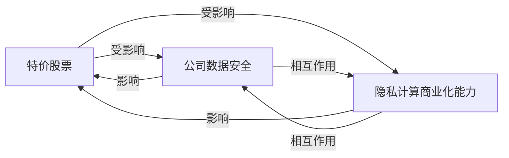

# 特价股票与公司数据安全与隐私计算商业化能力的关联性研究

> 关键词：特价股票、公司数据安全、隐私计算、商业化能力、关联性

> 摘要：本文旨在深入研究特价股票与公司数据安全及隐私计算商业化能力之间的关联性。通过对相关核心概念的阐述、算法原理的分析、数学模型的构建，结合项目实战案例，探讨三者之间的内在联系及影响机制。研究发现，公司的数据安全和隐私计算商业化能力对其股票价格和市场表现有着重要影响，而特价股票的出现也可能反映出公司在这些方面存在的问题或潜力。同时，文章还介绍了相关的应用场景、工具资源，并对未来发展趋势与挑战进行了展望，为投资者、企业管理者及相关研究人员提供了有价值的参考。

## 1. 背景介绍 
### 1.1 目的和范围
本研究的目的在于揭示特价股票与公司数据安全及隐私计算商业化能力之间的潜在关系。在当今数字化时代，数据已成为企业的核心资产之一，数据安全和隐私保护对于企业的生存和发展至关重要。同时，股票市场作为企业价值的重要体现，其价格波动受到多种因素的影响。特价股票通常指价格相对较低或出现异常波动的股票，研究其与公司数据安全和隐私计算商业化能力的关系，有助于投资者更好地评估企业的价值和风险，也为企业管理者提供改进数据管理和商业化策略的依据。

本研究的范围涵盖了不同行业的上市公司，通过对公开数据的分析和案例研究，探讨特价股票与公司数据安全及隐私计算商业化能力之间的普遍规律和特殊情况。

### 1.2 预期读者
本文的预期读者包括投资者、金融分析师、企业管理者、数据安全专家、隐私计算研究人员以及对相关领域感兴趣的学者和学生。投资者可以通过本文了解数据安全和隐私计算商业化能力对股票价格的影响，从而做出更明智的投资决策；企业管理者可以从中获取提升企业数据管理和商业化能力的思路和方法；数据安全专家和隐私计算研究人员可以在理论和实践层面得到新的启发；学者和学生可以将本文作为研究该领域的参考资料。

### 1.3 文档结构概述
本文共分为十个部分。第一部分为背景介绍，阐述研究的目的、范围、预期读者和文档结构概述，并对相关术语进行解释。第二部分介绍核心概念与联系，包括特价股票、公司数据安全和隐私计算商业化能力的定义、原理和架构，并通过文本示意图和 Mermaid 流程图展示它们之间的关系。第三部分讲解核心算法原理和具体操作步骤，使用 Python 源代码详细阐述相关算法。第四部分构建数学模型和公式，对其进行详细讲解并举例说明。第五部分通过项目实战，介绍开发环境搭建、源代码详细实现和代码解读。第六部分探讨实际应用场景。第七部分推荐相关的工具和资源，包括学习资源、开发工具框架和论文著作。第八部分总结未来发展趋势与挑战。第九部分为附录，解答常见问题。第十部分提供扩展阅读和参考资料。

### 1.4 术语表
#### 1.4.1 核心术语定义
- **特价股票**：指在股票市场中，价格相对较低或出现异常波动的股票。其价格可能受到公司基本面、市场情绪、行业竞争等多种因素的影响。
- **公司数据安全**：指公司采取一系列措施保护其数据资产的保密性、完整性和可用性，防止数据泄露、篡改和丢失等安全事件的发生。
- **隐私计算**：是一种在保证数据隐私的前提下，实现数据价值挖掘和利用的技术。它允许在不泄露原始数据的情况下，对数据进行分析和计算。
- **商业化能力**：指公司将技术、产品或服务转化为商业价值的能力，包括市场推广、销售、盈利模式设计等方面。

#### 1.4.2 相关概念解释
- **数据泄露**：指未经授权的人员获取了公司的敏感数据，可能导致公司的商业机密、客户信息等泄露，给公司带来声誉损失和经济损失。
- **数据脱敏**：是一种对敏感数据进行处理的技术，通过替换、掩码等方式将数据中的敏感信息进行隐藏，以保护数据的隐私。
- **多方安全计算**：是隐私计算的一种重要技术，它允许多个参与方在不泄露各自数据的情况下，共同进行计算和分析。

#### 1.4.3 缩略词列表
- **GDPR**：General Data Protection Regulation，通用数据保护条例
- **ML**：Machine Learning，机器学习
- **AI**：Artificial Intelligence，人工智能

## 2. 核心概念与联系 
### 2.1 特价股票
特价股票是股票市场中的一种特殊现象。从投资者的角度来看，特价股票可能具有一定的投资吸引力，因为其价格相对较低，可能存在较大的上涨空间。然而，特价股票的出现也可能意味着公司存在一些问题，如财务困境、经营不善、市场竞争力下降等。

特价股票的价格波动受到多种因素的影响，包括公司的基本面、宏观经济环境、行业竞争、市场情绪等。例如，如果公司的财务报表显示业绩不佳，或者行业面临整体下滑的趋势，都可能导致其股票价格下跌成为特价股票。

### 2.2 公司数据安全
公司数据安全是公司运营的重要保障。在数字化时代，公司的业务活动越来越依赖于数据，如客户信息、业务数据、研发成果等。这些数据一旦泄露，可能会给公司带来严重的损失，包括声誉损失、法律风险和经济损失。

公司数据安全包括多个方面，如数据访问控制、数据加密、数据备份与恢复等。数据访问控制可以确保只有授权人员能够访问公司的敏感数据；数据加密可以将数据转换为密文，防止数据在传输和存储过程中被窃取；数据备份与恢复可以在数据丢失或损坏时，及时恢复数据。

### 2.3 隐私计算商业化能力
隐私计算商业化能力是指公司将隐私计算技术转化为商业价值的能力。随着数据隐私保护意识的提高，隐私计算技术越来越受到关注。公司可以通过提供隐私计算服务、开发隐私计算产品等方式，实现隐私计算的商业化。

隐私计算商业化能力包括市场需求分析、技术研发、产品推广、盈利模式设计等方面。例如，公司需要了解市场对隐私计算的需求，研发出符合市场需求的隐私计算技术和产品，通过有效的市场推广将产品推向市场，并设计合理的盈利模式实现盈利。

### 2.4 核心概念的联系
特价股票与公司数据安全和隐私计算商业化能力之间存在着密切的联系。一方面，公司的数据安全问题可能会影响其股票价格。如果公司发生数据泄露事件，会损害公司的声誉，导致投资者对公司的信心下降，从而引发股票价格下跌，使股票成为特价股票。另一方面，公司的隐私计算商业化能力也会影响其市场竞争力和股票价格。如果公司能够成功将隐私计算技术商业化，提高公司的盈利能力和市场竞争力，可能会吸引更多的投资者，推动股票价格上涨；反之，如果公司在隐私计算商业化方面存在问题，可能会导致股票价格下跌。

以下是核心概念联系的文本示意图：

特价股票 <-> 公司数据安全
特价股票 <-> 隐私计算商业化能力
公司数据安全 <-> 隐私计算商业化能力

以下是 Mermaid 流程图：



## 3. 核心算法原理 & 具体操作步骤 
### 3.1 算法原理
为了研究特价股票与公司数据安全和隐私计算商业化能力的关联性，我们可以采用机器学习算法进行数据分析。这里我们选择逻辑回归算法，逻辑回归是一种广泛应用于分类问题的算法，它可以根据输入的特征变量预测样本属于某个类别的概率。

逻辑回归的基本原理是通过一个逻辑函数将线性回归的结果映射到 0 到 1 之间的概率值。逻辑函数的表达式为：

$$\sigma(z)=\frac{1}{1 + e^{-z}}$$

其中，$z$ 是线性回归的结果，$z = \theta_0 + \theta_1x_1 + \theta_2x_2 + \cdots + \theta_nx_n$，$\theta_i$ 是模型的参数，$x_i$ 是输入的特征变量。

在我们的研究中，我们将特价股票作为分类目标，将公司数据安全和隐私计算商业化能力的相关指标作为特征变量，通过逻辑回归算法建立模型，预测股票是否为特价股票。

### 3.2 具体操作步骤
#### 3.2.1 数据收集
首先，我们需要收集相关的数据。数据来源包括公司的财务报表、数据安全报告、市场研究报告等。我们需要收集的特征变量包括公司的数据安全投入、数据泄露事件次数、隐私计算技术研发投入、隐私计算产品销售额等，以及股票价格、市盈率等股票相关指标。

#### 3.2.2 数据预处理
收集到的数据可能存在缺失值、异常值等问题，需要进行预处理。我们可以使用均值、中位数等方法填充缺失值，使用箱线图等方法检测和处理异常值。同时，我们还需要对数据进行标准化处理，将不同特征变量的取值范围统一到相同的尺度上，以提高模型的性能。

#### 3.2.3 特征选择
在预处理后的数据中，可能存在一些与目标变量相关性较低的特征变量，我们需要进行特征选择，选择与目标变量相关性较高的特征变量作为模型的输入。可以使用相关性分析、方差分析等方法进行特征选择。

#### 3.2.4 模型训练
将处理后的数据分为训练集和测试集，使用训练集数据对逻辑回归模型进行训练。在训练过程中，我们需要使用优化算法（如梯度下降算法）来调整模型的参数，使得模型的预测结果与真实结果之间的误差最小。

#### 3.2.5 模型评估
使用测试集数据对训练好的模型进行评估，计算模型的准确率、召回率、F1 值等评估指标，评估模型的性能。

#### 3.2.6 模型应用
将训练好的模型应用于实际数据，预测股票是否为特价股票，并分析公司数据安全和隐私计算商业化能力对股票价格的影响。

### 3.3 Python 源代码实现
```python
import pandas as pd
from sklearn.model_selection import train_test_split
from sklearn.linear_model import LogisticRegression
from sklearn.preprocessing import StandardScaler
from sklearn.metrics import accuracy_score, recall_score, f1_score

# 数据收集和读取
data = pd.read_csv('stock_data.csv')

# 数据预处理
# 填充缺失值
data.fillna(data.mean(), inplace=True)

# 分离特征变量和目标变量
X = data.drop('is_special_stock', axis=1)
y = data['is_special_stock']

# 数据标准化
scaler = StandardScaler()
X_scaled = scaler.fit_transform(X)

# 特征选择（这里简单选择所有特征）
# 实际应用中可以使用更复杂的特征选择方法

# 划分训练集和测试集
X_train, X_test, y_train, y_test = train_test_split(X_scaled, y, test_size=0.2, random_state=42)

# 模型训练
model = LogisticRegression()
model.fit(X_train, y_train)

# 模型预测
y_pred = model.predict(X_test)

# 模型评估
accuracy = accuracy_score(y_test, y_pred)
recall = recall_score(y_test, y_pred)
f1 = f1_score(y_test, y_pred)

print(f"Accuracy: {accuracy}")
print(f"Recall: {recall}")
print(f"F1 Score: {f1}")
```

## 4. 数学模型和公式 & 详细讲解 & 举例说明 
### 4.1 逻辑回归模型的数学公式
逻辑回归模型的数学公式可以表示为：

$$P(y = 1|x)=\frac{1}{1 + e^{-(\theta_0 + \theta_1x_1 + \theta_2x_2 + \cdots + \theta_nx_n)}}$$

其中，$P(y = 1|x)$ 表示在给定特征变量 $x$ 的情况下，样本属于正类（即特价股票）的概率，$\theta_i$ 是模型的参数，$x_i$ 是输入的特征变量。

### 4.2 损失函数
逻辑回归模型的损失函数通常使用对数损失函数（也称为交叉熵损失函数），其表达式为：

$$J(\theta)=-\frac{1}{m}\sum_{i = 1}^{m}[y^{(i)}\log(P(y^{(i)} = 1|x^{(i)}))+(1 - y^{(i)})\log(1 - P(y^{(i)} = 1|x^{(i)}))]$$

其中，$m$ 是样本数量，$y^{(i)}$ 是第 $i$ 个样本的真实标签，$P(y^{(i)} = 1|x^{(i)})$ 是模型对第 $i$ 个样本的预测概率。

### 4.3 梯度下降算法
为了求解逻辑回归模型的参数 $\theta$，我们可以使用梯度下降算法。梯度下降算法的基本思想是通过不断迭代更新参数，使得损失函数的值逐渐减小。

参数更新的公式为：

$$\theta_j:=\theta_j-\alpha\frac{\partial J(\theta)}{\partial\theta_j}$$

其中，$\alpha$ 是学习率，控制参数更新的步长，$\frac{\partial J(\theta)}{\partial\theta_j}$ 是损失函数对参数 $\theta_j$ 的偏导数。

### 4.4 举例说明
假设我们有一个简单的数据集，包含两个特征变量 $x_1$ 和 $x_2$，以及一个目标变量 $y$（表示是否为特价股票）。数据集如下：

| $x_1$ | $x_2$ | $y$ |
| --- | --- | --- |
| 1 | 2 | 0 |
| 2 | 3 | 0 |
| 3 | 4 | 1 |
| 4 | 5 | 1 |

我们使用逻辑回归模型对这个数据集进行训练，首先计算线性回归的结果 $z$：

$$z = \theta_0 + \theta_1x_1 + \theta_2x_2$$

然后将 $z$ 代入逻辑函数计算预测概率 $P(y = 1|x)$：

$$P(y = 1|x)=\frac{1}{1 + e^{-z}}$$

接着计算损失函数 $J(\theta)$，并使用梯度下降算法更新参数 $\theta$，直到损失函数的值收敛到一个较小的值。

在实际应用中，我们可以使用 Python 中的 `sklearn` 库来实现逻辑回归模型，代码如下：

```python
import numpy as np
from sklearn.linear_model import LogisticRegression

# 定义数据集
X = np.array([[1, 2], [2, 3], [3, 4], [4, 5]])
y = np.array([0, 0, 1, 1])

# 模型训练
model = LogisticRegression()
model.fit(X, y)

# 模型预测
new_X = np.array([[5, 6]])
prediction = model.predict(new_X)
print(f"Prediction: {prediction}")
```

## 5. 项目实战：代码实际案例和详细解释说明 
### 5.1 开发环境搭建
#### 5.1.1 安装 Python
首先，我们需要安装 Python 环境。可以从 Python 官方网站（https://www.python.org/downloads/） 下载适合自己操作系统的 Python 安装包，并按照安装向导进行安装。

#### 5.1.2 安装依赖库
在安装好 Python 后，我们需要安装一些必要的依赖库，如 `pandas`、`sklearn` 等。可以使用 `pip` 命令进行安装：

```sh
pip install pandas sklearn
```

### 5.2 源代码详细实现和代码解读
#### 5.2.1 数据读取和预处理
```python
import pandas as pd

# 数据读取
data = pd.read_csv('stock_data.csv')

# 填充缺失值
data.fillna(data.mean(), inplace=True)

# 分离特征变量和目标变量
X = data.drop('is_special_stock', axis=1)
y = data['is_special_stock']
```

代码解读：
- `pd.read_csv('stock_data.csv')`：使用 `pandas` 库的 `read_csv` 函数读取存储在 `stock_data.csv` 文件中的数据。
- `data.fillna(data.mean(), inplace=True)`：使用均值填充数据中的缺失值。
- `data.drop('is_special_stock', axis=1)`：从数据中删除目标变量 `is_special_stock`，得到特征变量 `X`。
- `data['is_special_stock']`：提取目标变量 `y`。

#### 5.2.2 数据标准化
```python
from sklearn.preprocessing import StandardScaler

# 数据标准化
scaler = StandardScaler()
X_scaled = scaler.fit_transform(X)
```

代码解读：
- `StandardScaler()`：创建一个 `StandardScaler` 对象，用于数据标准化。
- `scaler.fit_transform(X)`：对特征变量 `X` 进行标准化处理，将其转换为均值为 0，标准差为 1 的数据。

#### 5.2.3 划分训练集和测试集
```python
from sklearn.model_selection import train_test_split

# 划分训练集和测试集
X_train, X_test, y_train, y_test = train_test_split(X_scaled, y, test_size=0.2, random_state=42)
```

代码解读：
- `train_test_split(X_scaled, y, test_size=0.2, random_state=42)`：使用 `train_test_split` 函数将标准化后的特征变量 `X_scaled` 和目标变量 `y` 划分为训练集和测试集，测试集占总数据的 20%，`random_state=42` 用于保证每次划分的结果相同。

#### 5.2.4 模型训练
```python
from sklearn.linear_model import LogisticRegression

# 模型训练
model = LogisticRegression()
model.fit(X_train, y_train)
```

代码解读：
- `LogisticRegression()`：创建一个逻辑回归模型对象。
- `model.fit(X_train, y_train)`：使用训练集数据对逻辑回归模型进行训练。

#### 5.2.5 模型预测和评估
```python
from sklearn.metrics import accuracy_score, recall_score, f1_score

# 模型预测
y_pred = model.predict(X_test)

# 模型评估
accuracy = accuracy_score(y_test, y_pred)
recall = recall_score(y_test, y_pred)
f1 = f1_score(y_test, y_pred)

print(f"Accuracy: {accuracy}")
print(f"Recall: {recall}")
print(f"F1 Score: {f1}")
```

代码解读：
- `model.predict(X_test)`：使用训练好的模型对测试集数据进行预测，得到预测结果 `y_pred`。
- `accuracy_score(y_test, y_pred)`：计算模型的准确率，即预测正确的样本数占总样本数的比例。
- `recall_score(y_test, y_pred)`：计算模型的召回率，即预测为正类的样本中实际为正类的比例。
- `f1_score(y_test, y_pred)`：计算模型的 F1 值，是准确率和召回率的调和平均数。

### 5.3 代码解读与分析
通过上述代码，我们实现了一个简单的逻辑回归模型，用于预测股票是否为特价股票。在代码中，我们首先对数据进行了预处理，包括填充缺失值和数据标准化，以提高模型的性能。然后将数据划分为训练集和测试集，使用训练集数据对模型进行训练，使用测试集数据对模型进行评估。

在模型评估中，我们使用了准确率、召回率和 F1 值等评估指标。准确率可以反映模型的整体预测能力，召回率可以反映模型对正类样本的预测能力，F1 值可以综合考虑准确率和召回率。

通过分析模型的评估指标，我们可以了解模型的性能。如果准确率、召回率和 F1 值都较高，说明模型的性能较好；如果某个指标较低，可能需要对模型进行调整或优化，如选择更合适的特征变量、调整模型的参数等。

## 6. 实际应用场景 
### 6.1 投资者决策
对于投资者来说，了解特价股票与公司数据安全和隐私计算商业化能力的关联性可以帮助他们做出更明智的投资决策。如果投资者发现某只特价股票的公司在数据安全方面存在严重问题，或者隐私计算商业化能力较弱，可能需要谨慎投资；反之，如果公司在数据安全和隐私计算商业化方面表现出色，即使股票价格暂时较低，也可能具有投资价值。

### 6.2 企业风险管理
企业管理者可以通过研究特价股票与公司数据安全和隐私计算商业化能力的关联性，加强企业的数据安全管理和隐私计算商业化能力建设。如果企业的股票价格出现异常波动成为特价股票，管理者可以检查企业的数据安全状况和隐私计算商业化进展，及时发现问题并采取措施加以解决，降低企业的风险。

### 6.3 行业监管
监管部门可以利用这种关联性对行业进行监管。通过监测企业的股票价格和数据安全、隐私计算商业化能力等指标，及时发现企业存在的问题，加强对企业的监管力度，保障行业的健康发展。

### 6.4 市场研究
市场研究机构可以通过研究特价股票与公司数据安全和隐私计算商业化能力的关联性，深入了解市场趋势和企业竞争力。他们可以为投资者、企业管理者和监管部门提供有价值的研究报告和建议，促进市场的良性发展。

## 7. 工具和资源推荐
### 7.1 学习资源推荐
#### 7.1.1 书籍推荐
- 《Python 数据分析实战》：介绍了使用 Python 进行数据分析的基本方法和技巧，包括数据处理、数据可视化、机器学习等方面的内容，对于学习数据分析和实现相关算法有很大帮助。
- 《机器学习》（周志华著）：是一本经典的机器学习教材，系统地介绍了机器学习的基本概念、算法和应用，对于深入理解逻辑回归等机器学习算法有重要的参考价值。
- 《数据安全与隐私保护》：全面介绍了数据安全和隐私保护的相关知识和技术，包括数据加密、访问控制、隐私计算等方面的内容，有助于了解公司数据安全和隐私计算的原理和方法。

#### 7.1.2 在线课程
- Coursera 上的 “Machine Learning” 课程：由斯坦福大学的 Andrew Ng 教授讲授，是一门非常经典的机器学习课程，涵盖了机器学习的基本概念、算法和应用，通过视频讲解、编程作业等方式帮助学习者掌握机器学习的知识和技能。
- edX 上的 “Data Science MicroMasters Program” 课程：提供了全面的数据科学学习内容，包括数据处理、数据分析、机器学习、深度学习等方面的课程，适合想要系统学习数据科学的学习者。
- 中国大学 MOOC 上的 “数据安全与隐私保护” 课程：由国内高校的专家讲授，介绍了数据安全和隐私保护的相关知识和技术，结合实际案例进行讲解，有助于学习者深入理解相关概念和方法。

#### 7.1.3 技术博客和网站
- Medium：是一个汇聚了众多技术专家和开发者的博客平台，上面有很多关于数据分析、机器学习、数据安全等方面的优秀文章，可以帮助学习者了解最新的技术动态和研究成果。
- Towards Data Science：是一个专注于数据科学领域的技术博客，提供了大量关于数据分析、机器学习、深度学习等方面的教程和案例，对于学习和实践数据科学有很大帮助。
- 信息安全技术标准网：提供了丰富的信息安全和数据隐私相关的标准和规范，对于了解数据安全和隐私计算的法律法规和技术标准有重要的参考价值。

### 7.2 开发工具框架推荐
#### 7.2.1 IDE和编辑器
- PyCharm：是一款专门为 Python 开发设计的集成开发环境（IDE），具有代码编辑、调试、自动完成等功能，支持多种 Python 框架和库，对于开发 Python 程序非常方便。
- Jupyter Notebook：是一个开源的 Web 应用程序，支持多种编程语言，如 Python、R 等。它可以将代码、文本、图像等组合在一起，形成交互式的文档，非常适合数据分析和机器学习的开发和实验。
- Visual Studio Code：是一款轻量级的代码编辑器，支持多种编程语言和插件，具有丰富的扩展功能。它可以通过安装 Python 相关的插件，实现 Python 代码的编辑、调试等功能。

#### 7.2.2 调试和性能分析工具
- pdb：是 Python 内置的调试工具，可以帮助开发者在代码中设置断点、单步执行代码、查看变量值等，方便排查代码中的问题。
- cProfile：是 Python 内置的性能分析工具，可以统计代码的执行时间和函数调用次数，帮助开发者找出代码中的性能瓶颈。
- Scikit-learn 的 `cross_val_score` 函数：可以用于对机器学习模型进行交叉验证，评估模型的性能，帮助开发者选择合适的模型和参数。

#### 7.2.3 相关框架和库
- Pandas：是一个用于数据处理和分析的 Python 库，提供了高效的数据结构和数据操作方法，如数据读取、数据清洗、数据筛选等，对于处理和分析股票数据和公司数据非常有用。
- Scikit-learn：是一个广泛应用于机器学习的 Python 库，提供了丰富的机器学习算法和工具，如分类算法、回归算法、聚类算法等，对于实现逻辑回归模型和其他机器学习算法非常方便。
- TensorFlow：是一个开源的机器学习框架，支持深度学习算法的开发和训练，对于处理复杂的数据分析和预测任务有很大优势。

### 7.3 相关论文著作推荐
#### 7.3.1 经典论文
- “The Elements of Statistical Learning”：是统计学和机器学习领域的经典著作，系统地介绍了统计学习的基本理论和方法，包括线性回归、逻辑回归、决策树等算法，对于深入理解机器学习算法的原理和应用有重要的参考价值。
- “Privacy-Preserving Data Mining”：探讨了隐私保护数据挖掘的相关技术和方法，介绍了如何在保护数据隐私的前提下进行数据挖掘和分析，对于了解隐私计算的理论和实践有很大帮助。
- “Data Security and Privacy in the Cloud”：研究了云计算环境下的数据安全和隐私保护问题，提出了一些解决方案和技术，对于了解云环境下公司数据安全和隐私计算的挑战和应对措施有重要的参考价值。

#### 7.3.2 最新研究成果
- 可以关注顶级学术会议和期刊，如 SIGKDD、ICML、NeurIPS 等会议，以及 Journal of Machine Learning Research、ACM Transactions on Intelligent Systems and Technology 等期刊，获取关于数据分析、机器学习、数据安全和隐私计算等领域的最新研究成果。

#### 7.3.3 应用案例分析
- 可以参考一些行业报告和案例分析，了解企业在数据安全和隐私计算商业化方面的成功案例和经验教训。例如，一些大型科技公司的年报和技术白皮书，以及咨询公司发布的行业研究报告等。

## 8. 总结：未来发展趋势与挑战
### 8.1 未来发展趋势
#### 8.1.1 数据安全和隐私保护的重要性不断提升
随着数字化时代的发展，数据的价值越来越高，数据安全和隐私保护的重要性也日益凸显。企业将更加重视数据安全和隐私计算，加大在这方面的投入，以保护自身的核心资产和客户的隐私。

#### 8.1.2 隐私计算技术的不断创新和发展
隐私计算技术将不断创新和发展，新的算法和技术将不断涌现，如多方安全计算、同态加密等技术将得到更广泛的应用。这些技术将在保证数据隐私的前提下，实现更高效的数据挖掘和利用。

#### 8.1.3 特价股票与公司数据安全和隐私计算商业化能力的关联性将更加紧密
随着市场对数据安全和隐私计算的关注度不断提高，投资者将更加重视公司在这些方面的表现。特价股票与公司数据安全和隐私计算商业化能力的关联性将更加紧密，公司的数据安全和隐私计算商业化能力将成为影响股票价格的重要因素之一。

#### 8.1.4 行业监管将更加严格
为了保障数据安全和隐私，行业监管将更加严格。政府和监管部门将出台更多的法律法规和政策，加强对企业数据安全和隐私计算的监管，规范市场秩序。

### 8.2 挑战
#### 8.2.1 技术挑战
隐私计算技术目前还存在一些技术难题，如计算效率低、安全性难以保证等问题。需要进一步研究和开发新的算法和技术，提高隐私计算的性能和安全性。

#### 8.2.2 成本挑战
企业在数据安全和隐私计算方面的投入较大，包括技术研发、设备采购、人员培训等方面的成本。对于一些中小企业来说，可能难以承担这些成本，这将限制他们在数据安全和隐私计算方面的发展。

#### 8.2.3 人才挑战
数据安全和隐私计算是一个新兴领域，需要具备相关专业知识和技能的人才。目前，这方面的人才相对短缺，企业和研究机构需要加强人才培养和引进，以满足行业发展的需求。

#### 8.2.4 法律法规和政策挑战
随着数据安全和隐私保护的重要性不断提升，相关的法律法规和政策也在不断完善。企业需要及时了解和遵守这些法律法规和政策，否则可能面临法律风险。同时，不同国家和地区的法律法规和政策存在差异，也给企业的跨国经营带来了挑战。

## 9. 附录：常见问题与解答
### 9.1 什么是特价股票？
特价股票是指在股票市场中，价格相对较低或出现异常波动的股票。其价格可能受到公司基本面、市场情绪、行业竞争等多种因素的影响。

### 9.2 公司数据安全包括哪些方面？
公司数据安全包括数据访问控制、数据加密、数据备份与恢复等方面。数据访问控制可以确保只有授权人员能够访问公司的敏感数据；数据加密可以将数据转换为密文，防止数据在传输和存储过程中被窃取；数据备份与恢复可以在数据丢失或损坏时，及时恢复数据。

### 9.3 什么是隐私计算商业化能力？
隐私计算商业化能力是指公司将隐私计算技术转化为商业价值的能力。包括市场需求分析、技术研发、产品推广、盈利模式设计等方面。

### 9.4 如何评估公司的数据安全和隐私计算商业化能力？
可以从多个方面评估公司的数据安全和隐私计算商业化能力。对于数据安全，可以评估公司的数据安全投入、数据泄露事件次数、数据安全管理制度等；对于隐私计算商业化能力，可以评估公司的隐私计算技术研发投入、隐私计算产品销售额、市场份额等。

### 9.5 逻辑回归算法适用于哪些问题？
逻辑回归算法适用于分类问题，特别是二分类问题。它可以根据输入的特征变量预测样本属于某个类别的概率。在我们的研究中，我们使用逻辑回归算法预测股票是否为特价股票。

### 9.6 如何提高逻辑回归模型的性能？
可以从多个方面提高逻辑回归模型的性能。例如，选择更合适的特征变量，进行特征工程，提高特征的质量；调整模型的参数，如正则化参数等；使用交叉验证等方法选择最优的模型参数；对数据进行预处理，如标准化、归一化等，提高数据的质量。

## 10. 扩展阅读 & 参考资料
### 10.1 扩展阅读
- 《数字经济时代的数据安全与隐私保护》
- 《人工智能与数据安全》
- 《金融科技与股票市场分析》

### 10.2 参考资料
- 相关公司的财务报表和年度报告
- 行业研究报告和市场分析报告
- 学术期刊和会议论文
- 相关法律法规和政策文件