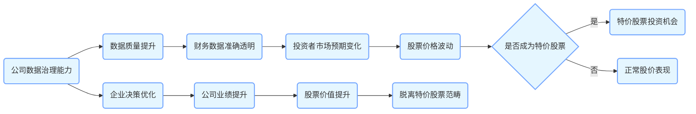

# 特价股票与公司数据治理能力的关系分析

> 关键词：特价股票、公司数据治理能力、财务数据、市场预期、企业决策、风险管理、信息披露

> 摘要：本文旨在深入探讨特价股票与公司数据治理能力之间的内在关系。通过对特价股票的定义、形成原因以及公司数据治理能力的构成要素、重要性的分析，阐述两者之间相互影响的机制。运用数学模型、算法原理以及实际案例，揭示数据治理能力如何影响特价股票的价值评估和市场表现，同时分析特价股票的市场动态对公司数据治理提出的挑战和要求。为投资者、企业管理者以及监管机构提供全面、深入的理论和实践参考，以更好地理解和应对相关问题，实现资本市场的健康发展和企业的可持续经营。

## 1. 背景介绍 
### 1.1 目的和范围
本研究的主要目的是系统地分析特价股票与公司数据治理能力之间的关系。通过对相关理论和实际案例的研究，揭示两者之间的内在联系和相互作用机制，为投资者在选择特价股票时提供更全面的决策依据，帮助企业管理者认识到数据治理能力对公司股价和市场形象的重要性，同时也为监管机构制定相关政策提供参考。研究范围涵盖了不同行业、不同规模的上市公司，以及国内外资本市场的相关数据和案例。

### 1.2 预期读者
本文的预期读者包括各类投资者，如个人投资者、机构投资者等，他们可以通过本文了解特价股票的投资价值与公司数据治理能力的关联，从而优化投资决策；企业管理者可以从中认识到数据治理对公司市场表现的重要性，进而提升公司的数据治理水平；监管机构工作人员可以参考本文的研究成果，制定更有效的监管政策，维护资本市场的稳定和健康发展；此外，对金融、管理等领域感兴趣的学者和研究人员也可以从本文中获取有价值的研究思路和参考资料。

### 1.3 文档结构概述
本文首先对相关背景进行介绍，明确研究的目的、范围、预期读者和文档结构。接着阐述特价股票和公司数据治理能力的核心概念及其联系，通过文本示意图和 Mermaid 流程图进行直观展示。然后详细讲解核心算法原理和具体操作步骤，结合 Python 源代码进行说明。之后介绍相关的数学模型和公式，并通过举例进行详细讲解。再通过项目实战，展示代码实际案例并进行详细解释说明。随后分析实际应用场景，为不同主体提供参考。接着推荐相关的工具和资源，包括学习资源、开发工具框架和相关论文著作。最后总结未来发展趋势与挑战，提供常见问题与解答，并列出扩展阅读和参考资料。

### 1.4 术语表
#### 1.4.1 核心术语定义
- **特价股票**：指在股票市场中，价格相对其内在价值或同行业其他股票价格明显偏低的股票。特价股票可能由于多种因素导致价格被低估，如市场短期波动、公司负面事件、行业整体不景气等。
- **公司数据治理能力**：是指公司对其内部和外部数据进行有效管理、控制和利用的能力。包括数据的采集、存储、处理、分析、安全保护以及信息披露等一系列活动，旨在确保数据的准确性、完整性、及时性和安全性，为公司的决策、运营和风险管理提供支持。

#### 1.4.2 相关概念解释
- **财务数据**：是公司数据的重要组成部分，反映了公司的财务状况、经营成果和现金流量等信息。包括资产负债表、利润表、现金流量表等报表数据，以及相关的财务指标，如毛利率、净利率、资产负债率等。
- **市场预期**：是投资者对公司未来发展前景、盈利能力、市场竞争力等方面的预期。市场预期会影响投资者对股票的估值和投资决策，进而影响股票价格。
- **企业决策**：是指企业管理者在面对各种问题和机会时，为实现企业的目标而做出的选择和决定。企业决策需要基于准确、全面的数据和信息，数据治理能力的高低会影响企业决策的质量和效果。
- **风险管理**：是指企业识别、评估和应对各种风险的过程。数据治理能力可以帮助企业及时、准确地获取风险信息，制定有效的风险应对策略，降低企业面临的风险。
- **信息披露**：是指公司按照相关法律法规和监管要求，向投资者和社会公众公开披露公司的财务状况、经营情况、重大事项等信息。信息披露的质量和透明度直接影响投资者对公司的信任和信心，也反映了公司的数据治理能力。

#### 1.4.3 缩略词列表
- **EPS**：Earnings Per Share，每股收益
- **ROE**：Return on Equity，净资产收益率
- **PE**：Price - Earnings Ratio，市盈率
- **PB**：Price - to - Book Ratio，市净率

## 2. 核心概念与联系 

### 核心概念原理
#### 特价股票
特价股票的形成往往是由于市场的非理性因素或公司的短期困境。从市场角度来看，投资者的情绪波动、宏观经济环境的变化、行业竞争格局的调整等都可能导致股票价格的短期下跌，使得一些具有内在价值的股票被低估。从公司角度来看，公司的经营业绩下滑、负面事件曝光、管理层变动等问题可能引发投资者的担忧，从而导致股票价格下降。然而，这些因素并不一定反映公司的长期发展潜力，因此特价股票可能存在投资机会。

#### 公司数据治理能力
公司数据治理能力是一个综合性的概念，涉及到公司的数据管理体系、技术架构、人员素质和企业文化等多个方面。有效的数据治理能够确保公司数据的质量，提高数据的可用性和价值，为公司的战略决策、运营管理和风险管理提供有力支持。具体来说，数据治理包括数据标准制定、数据质量控制、数据安全管理、数据生命周期管理等环节，通过建立健全的数据治理机制，公司可以更好地利用数据资源，提升自身的竞争力。

### 架构的文本示意图
特价股票与公司数据治理能力的关系可以用以下文本示意图表示：

公司数据治理能力（数据采集、存储、处理、分析、安全保护、信息披露） -> 影响公司财务数据质量和透明度 -> 影响投资者对公司的市场预期 -> 影响股票价格 -> 与特价股票的形成和投资价值相关

### Mermaid 流程图


从流程图可以看出，公司数据治理能力通过影响数据质量、投资者预期和企业决策等多个环节，与特价股票的形成和发展密切相关。良好的数据治理能力有助于提升公司的市场形象和股票价值，避免成为特价股票；而特价股票的出现也可能促使公司反思自身的数据治理问题，加强数据管理，提升公司的整体竞争力。

## 3. 核心算法原理 & 具体操作步骤 

### 核心算法原理
为了分析特价股票与公司数据治理能力的关系，我们可以采用多因素回归分析的方法。多因素回归分析是一种统计方法，用于研究一个因变量与多个自变量之间的关系。在本研究中，我们将股票价格作为因变量，公司数据治理能力的相关指标以及其他影响股票价格的因素作为自变量，建立回归模型，通过分析自变量的系数和显著性，来揭示特价股票与公司数据治理能力之间的关系。

### Python 源代码详细阐述
以下是使用 Python 进行多因素回归分析的示例代码：

```python
import pandas as pd
import numpy as np
from sklearn.linear_model import LinearRegression
from sklearn.model_selection import train_test_split
from sklearn.metrics import mean_squared_error

# 假设我们有一个包含股票价格、数据治理能力指标和其他影响因素的数据集
# 这里使用模拟数据进行演示
np.random.seed(0)
n_samples = 100

# 生成数据治理能力指标（用一个数值表示）
data_governance_ability = np.random.rand(n_samples) * 10

# 生成其他影响因素（如市场指数、行业平均水平等）
market_index = np.random.rand(n_samples) * 100
industry_average = np.random.rand(n_samples) * 20

# 生成股票价格（因变量），假设股票价格与数据治理能力、市场指数和行业平均水平相关
stock_price = 2 * data_governance_ability + 0.5 * market_index + 1 * industry_average + np.random.randn(n_samples) * 5

# 创建数据集
data = pd.DataFrame({
    'data_governance_ability': data_governance_ability,
    'market_index': market_index,
    'industry_average': industry_average,
    'stock_price': stock_price
})

# 划分自变量和因变量
X = data[['data_governance_ability', 'market_index', 'industry_average']]
y = data['stock_price']

# 划分训练集和测试集
X_train, X_test, y_train, y_test = train_test_split(X, y, test_size=0.2, random_state=0)

# 创建线性回归模型
model = LinearRegression()

# 训练模型
model.fit(X_train, y_train)

# 预测测试集
y_pred = model.predict(X_test)

# 计算均方误差
mse = mean_squared_error(y_test, y_pred)
print(f"均方误差: {mse}")

# 输出模型系数
print(f"数据治理能力系数: {model.coef_[0]}")
print(f"市场指数系数: {model.coef_[1]}")
print(f"行业平均水平系数: {model.coef_[2]}")
print(f"截距: {model.intercept_}")
```

### 具体操作步骤
1. **数据收集**：收集上市公司的股票价格数据、数据治理能力相关指标（如数据准确性得分、信息披露透明度评级等）以及其他可能影响股票价格的因素（如市场指数、行业平均水平、公司财务指标等）。
2. **数据预处理**：对收集到的数据进行清洗、整理和标准化处理，去除缺失值、异常值，确保数据的质量和一致性。
3. **变量选择**：根据研究目的和理论假设，选择合适的自变量和因变量。在本研究中，自变量包括数据治理能力指标和其他影响因素，因变量为股票价格。
4. **模型构建**：使用多因素回归分析方法，构建回归模型。在 Python 中，可以使用 `sklearn` 库中的 `LinearRegression` 类来实现线性回归模型。
5. **模型训练**：将数据集划分为训练集和测试集，使用训练集对模型进行训练，调整模型的参数，使模型能够较好地拟合数据。
6. **模型评估**：使用测试集对训练好的模型进行评估，计算模型的均方误差、决定系数等指标，评估模型的性能和预测能力。
7. **结果分析**：分析模型的系数和显著性，判断各个自变量对因变量的影响程度和方向。在本研究中，重点关注数据治理能力指标的系数，以揭示特价股票与公司数据治理能力之间的关系。

## 4. 数学模型和公式 & 详细讲解 & 举例说明 

### 数学模型和公式
多因素回归分析的数学模型可以表示为：

$$
y = \beta_0 + \beta_1x_1 + \beta_2x_2 + \cdots + \beta_nx_n + \epsilon
$$

其中：
- $y$ 是因变量，在本研究中表示股票价格；
- $\beta_0$ 是截距项；
- $\beta_1, \beta_2, \cdots, \beta_n$ 是自变量的系数；
- $x_1, x_2, \cdots, x_n$ 是自变量，包括数据治理能力指标和其他影响因素；
- $\epsilon$ 是误差项，服从均值为 0 的正态分布。

### 详细讲解
多因素回归分析的目标是通过最小化误差项的平方和，来估计模型的系数 $\beta_0, \beta_1, \cdots, \beta_n$。具体来说，我们要找到一组系数，使得以下目标函数最小化：

$$
\min_{\beta_0, \beta_1, \cdots, \beta_n} \sum_{i=1}^{m} (y_i - (\beta_0 + \beta_1x_{i1} + \beta_2x_{i2} + \cdots + \beta_nx_{in}))^2
$$

其中 $m$ 是样本数量，$y_i$ 是第 $i$ 个样本的因变量值，$x_{i1}, x_{i2}, \cdots, x_{in}$ 是第 $i$ 个样本的自变量值。

通过求解上述最小化问题，可以得到模型的系数估计值。系数 $\beta_j$ 表示在其他自变量保持不变的情况下，自变量 $x_j$ 每增加一个单位，因变量 $y$ 的平均变化量。如果 $\beta_j$ 为正，则表示 $x_j$ 与 $y$ 正相关；如果 $\beta_j$ 为负，则表示 $x_j$ 与 $y$ 负相关。

### 举例说明
假设我们通过多因素回归分析得到以下模型：

$$
\text{股票价格} = 10 + 2 \times \text{数据治理能力指标} + 0.5 \times \text{市场指数} + 1 \times \text{行业平均水平}
$$

这个模型表示，在其他因素不变的情况下，数据治理能力指标每增加 1 个单位，股票价格平均增加 2 个单位；市场指数每增加 1 个单位，股票价格平均增加 0.5 个单位；行业平均水平每增加 1 个单位，股票价格平均增加 1 个单位。截距项 10 表示当所有自变量都为 0 时的股票价格估计值。

如果一家公司的数据治理能力指标为 5，市场指数为 80，行业平均水平为 15，则根据上述模型可以预测该公司的股票价格为：

$$
\text{股票价格} = 10 + 2 \times 5 + 0.5 \times 80 + 1 \times 15 = 10 + 10 + 40 + 15 = 75
$$

通过这个例子可以看出，多因素回归分析可以帮助我们定量地分析各个因素对股票价格的影响，从而更好地理解特价股票与公司数据治理能力之间的关系。

## 5. 项目实战：代码实际案例和详细解释说明 

### 5.1 开发环境搭建
为了运行上述 Python 代码，我们需要搭建相应的开发环境。具体步骤如下：

1. **安装 Python**：从 Python 官方网站（https://www.python.org/downloads/）下载并安装 Python 3.x 版本。
2. **安装必要的库**：使用 `pip` 命令安装所需的库，包括 `pandas`、`numpy`、`sklearn` 等。打开命令行工具，执行以下命令：
```sh
pip install pandas numpy scikit-learn
```
3. **选择开发工具**：可以选择使用 Jupyter Notebook、PyCharm 等开发工具。Jupyter Notebook 适合进行交互式的数据分析和代码演示，PyCharm 则是一个功能强大的 Python 集成开发环境，适合进行大规模的项目开发。

### 5.2 源代码详细实现和代码解读
以下是对上述 Python 代码的详细实现和解读：

```python
import pandas as pd
import numpy as np
from sklearn.linear_model import LinearRegression
from sklearn.model_selection import train_test_split
from sklearn.metrics import mean_squared_error

# 假设我们有一个包含股票价格、数据治理能力指标和其他影响因素的数据集
# 这里使用模拟数据进行演示
np.random.seed(0)
n_samples = 100

# 生成数据治理能力指标（用一个数值表示）
data_governance_ability = np.random.rand(n_samples) * 10

# 生成其他影响因素（如市场指数、行业平均水平等）
market_index = np.random.rand(n_samples) * 100
industry_average = np.random.rand(n_samples) * 20

# 生成股票价格（因变量），假设股票价格与数据治理能力、市场指数和行业平均水平相关
stock_price = 2 * data_governance_ability + 0.5 * market_index + 1 * industry_average + np.random.randn(n_samples) * 5

# 创建数据集
data = pd.DataFrame({
    'data_governance_ability': data_governance_ability,
    'market_index': market_index,
    'industry_average': industry_average,
    'stock_price': stock_price
})

# 划分自变量和因变量
X = data[['data_governance_ability', 'market_index', 'industry_average']]
y = data['stock_price']

# 划分训练集和测试集
X_train, X_test, y_train, y_test = train_test_split(X, y, test_size=0.2, random_state=0)

# 创建线性回归模型
model = LinearRegression()

# 训练模型
model.fit(X_train, y_train)

# 预测测试集
y_pred = model.predict(X_test)

# 计算均方误差
mse = mean_squared_error(y_test, y_pred)
print(f"均方误差: {mse}")

# 输出模型系数
print(f"数据治理能力系数: {model.coef_[0]}")
print(f"市场指数系数: {model.coef_[1]}")
print(f"行业平均水平系数: {model.coef_[2]}")
print(f"截距: {model.intercept_}")
```

**代码解读**：
1. **导入必要的库**：导入 `pandas`、`numpy`、`sklearn` 等库，用于数据处理、数值计算、机器学习模型构建和评估。
2. **生成模拟数据**：使用 `numpy` 的随机数生成函数生成数据治理能力指标、市场指数、行业平均水平和股票价格的模拟数据。
3. **创建数据集**：使用 `pandas` 的 `DataFrame` 类将生成的数据组合成一个数据集。
4. **划分自变量和因变量**：将数据集中的数据治理能力指标、市场指数和行业平均水平作为自变量，股票价格作为因变量。
5. **划分训练集和测试集**：使用 `sklearn` 的 `train_test_split` 函数将数据集划分为训练集和测试集，其中测试集占总数据集的 20%。
6. **创建线性回归模型**：使用 `sklearn` 的 `LinearRegression` 类创建一个线性回归模型。
7. **训练模型**：使用训练集对线性回归模型进行训练，得到模型的系数和截距。
8. **预测测试集**：使用训练好的模型对测试集进行预测，得到预测的股票价格。
9. **计算均方误差**：使用 `sklearn` 的 `mean_squared_error` 函数计算预测值与真实值之间的均方误差，评估模型的性能。
10. **输出模型系数**：输出模型的系数和截距，分析各个自变量对因变量的影响程度。

### 5.3 代码解读与分析
通过上述代码的运行结果，我们可以得到以下信息：
- **均方误差**：均方误差反映了模型预测值与真实值之间的平均误差。均方误差越小，说明模型的预测能力越强。
- **模型系数**：模型的系数表示各个自变量对因变量的影响程度。在本研究中，数据治理能力指标的系数表示在其他因素不变的情况下，数据治理能力指标每增加 1 个单位，股票价格的平均变化量。如果数据治理能力指标的系数为正，说明数据治理能力越强，股票价格越高；如果系数为负，则说明数据治理能力越强，股票价格越低。
- **截距**：截距表示当所有自变量都为 0 时的因变量估计值。在本研究中，截距表示当数据治理能力指标、市场指数和行业平均水平都为 0 时的股票价格估计值。

通过对代码运行结果的分析，我们可以进一步了解特价股票与公司数据治理能力之间的关系，为投资决策和企业管理提供参考。

## 6. 实际应用场景 

### 投资者角度
对于投资者来说，了解特价股票与公司数据治理能力的关系可以帮助他们做出更明智的投资决策。当投资者发现一只特价股票时，可以通过分析该公司的数据治理能力来评估其投资价值。如果公司的数据治理能力较强，数据质量高，信息披露透明，那么这只特价股票可能存在被低估的情况，具有投资潜力。投资者可以进一步研究公司的基本面，结合其他因素，决定是否投资该股票。例如，一家公司虽然短期内股价下跌，但通过分析其财务报表的准确性、信息披露的及时性和完整性等数据治理方面的表现，发现公司的经营状况良好，数据治理能力较强，那么投资者可以考虑在适当的时候买入该股票，等待股价回升。

### 企业管理者角度
企业管理者认识到数据治理能力对公司股价的影响后，可以采取措施加强公司的数据治理。良好的数据治理可以提高公司的财务数据质量和透明度，增强投资者对公司的信心，从而提升公司的市场形象和股票价格。例如，企业可以建立完善的数据管理制度，加强数据质量控制，规范信息披露流程，提高数据的安全性和可靠性。此外，数据治理能力的提升还可以为企业的决策提供更准确、全面的信息支持，帮助企业优化运营管理，提高盈利能力，进一步提升公司的价值。

### 监管机构角度
监管机构可以通过加强对公司数据治理的监管，维护资本市场的稳定和健康发展。监管机构可以制定相关的法律法规和监管标准，要求上市公司加强数据治理，提高信息披露的质量和透明度。对于数据治理不力、信息披露违规的公司，监管机构可以采取相应的处罚措施，促使公司重视数据治理，保护投资者的合法权益。例如，监管机构可以对上市公司的财务报表进行审计，检查公司的数据治理制度和流程是否健全，对违规公司进行处罚和整改要求，以提高整个资本市场的信息质量和公信力。

## 7. 工具和资源推荐
### 7.1 学习资源推荐
#### 7.1.1 书籍推荐
- 《财务报表分析与股票估值》：本书详细介绍了如何通过分析公司的财务报表来评估股票的价值，对于理解特价股票的投资价值和公司财务数据的分析具有重要的参考价值。
- 《数据治理：概念、方法与实践》：全面阐述了数据治理的理论和实践，包括数据治理的框架、流程、技术和工具等方面的内容，有助于深入了解公司数据治理能力的构成和提升方法。
- 《金融市场与金融机构》：介绍了金融市场的基本原理和运行机制，以及金融机构的业务和管理，对于理解股票市场的运行和特价股票的形成原因具有重要的帮助。

#### 7.1.2 在线课程
- Coursera 平台上的“Financial Markets”课程：由耶鲁大学教授 Robert Shiller 主讲，系统介绍了金融市场的理论和实践，包括股票市场、债券市场、衍生品市场等方面的内容。
- edX 平台上的“Data Science MicroMasters Program”课程：提供了数据科学的全面培训，包括数据采集、处理、分析和可视化等方面的知识和技能，对于学习数据治理和数据分析具有重要的帮助。
- 中国大学 MOOC 平台上的“公司财务管理”课程：介绍了公司财务管理的基本理论和方法，包括财务报表分析、资本预算、融资决策等方面的内容，有助于理解公司财务数据和企业决策的关系。

#### 7.1.3 技术博客和网站
- Seeking Alpha：是一个专业的金融投资博客平台，提供了大量的股票分析、市场评论和投资策略等方面的内容，对于了解特价股票的市场动态和投资机会具有重要的参考价值。
- Data Governance Institute：是一个专注于数据治理的专业网站，提供了数据治理的最新研究成果、行业动态、最佳实践和案例分析等方面的内容，有助于深入了解数据治理的理论和实践。
- 雪球网：是国内知名的股票投资社区，提供了丰富的股票行情、公司公告、投资者交流等方面的内容，对于了解国内股票市场的情况和特价股票的信息具有重要的帮助。

### 7.2 开发工具框架推荐
#### 7.2.1 IDE和编辑器
- PyCharm：是一个功能强大的 Python 集成开发环境，提供了代码编辑、调试、版本控制等一系列功能，适合进行大规模的 Python 项目开发。
- Jupyter Notebook：是一个交互式的开发环境，支持多种编程语言，包括 Python、R 等，适合进行数据分析、模型训练和代码演示等工作。
- Visual Studio Code：是一个轻量级的代码编辑器，支持多种编程语言和插件扩展，具有丰富的功能和良好的用户体验，适合进行快速的代码编写和调试。

#### 7.2.2 调试和性能分析工具
- PDB：是 Python 内置的调试工具，可以帮助开发者逐步执行代码，查看变量的值和程序的执行流程，定位代码中的问题。
- cProfile：是 Python 标准库中的性能分析工具，可以统计程序中各个函数的执行时间和调用次数，帮助开发者找出程序中的性能瓶颈。
- Py-Spy：是一个轻量级的 Python 性能分析工具，可以实时监控 Python 程序的运行状态，分析函数的执行时间和 CPU 使用率，帮助开发者优化程序性能。

#### 7.2.3 相关框架和库
- Pandas：是一个强大的数据处理和分析库，提供了高效的数据结构和数据操作方法，适合进行数据清洗、整理、分析和可视化等工作。
- Numpy：是一个基础的数值计算库，提供了高效的数组操作和数学函数，是许多数据分析和机器学习库的基础。
- Scikit-learn：是一个常用的机器学习库，提供了丰富的机器学习算法和工具，包括分类、回归、聚类、降维等方面的算法，适合进行数据分析和模型训练。

### 7.3 相关论文著作推荐
#### 7.3.1 经典论文
- “Efficient Capital Markets: A Review of Theory and Empirical Work” by Eugene F. Fama：该论文是有效市场假说的经典文献，探讨了股票市场的效率和信息传递机制，对于理解特价股票的形成和市场定价具有重要的理论意义。
- “The Information Content of Annual Earnings Announcements” by Ray Ball and Philip Brown：该论文研究了年度盈利公告的信息含量，分析了财务信息对股票价格的影响，对于理解公司财务数据和股票价格的关系具有重要的参考价值。
- “Data Governance: A Conceptual Framework” by David Loshin：该论文提出了数据治理的概念框架，阐述了数据治理的目标、原则和方法，对于深入理解数据治理的理论和实践具有重要的指导意义。

#### 7.3.2 最新研究成果
- 关注顶级金融期刊，如《Journal of Finance》、《Review of Financial Studies》等，这些期刊发表了许多关于股票市场、公司财务和金融风险管理等方面的最新研究成果，有助于了解特价股票与公司数据治理能力关系的前沿研究动态。
- 关注数据治理领域的学术会议和研究机构的最新报告，如数据治理峰会、国际数据管理协会（DAMA）的研究报告等，这些资源提供了数据治理的最新技术和方法，对于提升公司数据治理能力具有重要的参考价值。

#### 7.3.3 应用案例分析
- 研究国内外知名企业的数据治理案例，如阿里巴巴、腾讯等公司的数据治理实践，了解这些企业如何通过有效的数据治理提升公司的竞争力和市场价值。
- 分析金融机构在风险管理和投资决策中应用数据治理的案例，如银行如何通过数据治理提高信贷风险评估的准确性，投资机构如何通过数据分析挖掘特价股票的投资机会等，从中获取实践经验和启示。

## 8. 总结：未来发展趋势与挑战

### 未来发展趋势
- **数据驱动的投资决策**：随着大数据、人工智能等技术的发展，投资者将越来越依赖数据和分析工具来做出投资决策。在评估特价股票时，投资者将更加关注公司的数据治理能力和数据质量，通过深入分析公司的财务数据、经营数据和市场数据，挖掘特价股票的投资价值。
- **企业数据治理的重要性日益凸显**：在数字化时代，数据已经成为企业的核心资产之一。企业将越来越重视数据治理，通过建立完善的数据治理体系，提高数据的质量和价值，为企业的决策、运营和风险管理提供有力支持。良好的数据治理能力将成为企业提升市场竞争力和股票价格的重要因素。
- **监管要求不断提高**：监管机构将加强对上市公司数据治理的监管，提高信息披露的质量和透明度要求。企业需要不断完善数据治理制度和流程，确保数据的准确性、完整性和及时性，以满足监管要求，避免因数据治理问题而受到处罚。

### 挑战
- **数据质量和安全问题**：随着数据量的不断增加和数据来源的多样化，保证数据的质量和安全成为企业面临的重要挑战。数据不准确、不完整、不一致等问题可能影响企业的决策和投资者的判断，而数据泄露、数据滥用等安全问题则可能给企业带来巨大的损失。
- **技术和人才短缺**：数据治理需要运用先进的技术和工具，如数据仓库、数据挖掘、人工智能等。然而，目前企业在这些技术方面的应用还存在一定的困难，同时也缺乏既懂数据治理又懂业务的复合型人才。
- **市场不确定性**：股票市场受到多种因素的影响，如宏观经济环境、政策变化、行业竞争等，市场不确定性较大。即使公司的数据治理能力较强，也不能完全保证股票价格的稳定上涨。投资者需要综合考虑多种因素，做出明智的投资决策。

## 9. 附录：常见问题与解答

### 1. 什么是特价股票？
特价股票是指在股票市场中，价格相对其内在价值或同行业其他股票价格明显偏低的股票。特价股票可能由于市场短期波动、公司负面事件、行业整体不景气等因素导致价格被低估。

### 2. 公司数据治理能力包括哪些方面？
公司数据治理能力包括数据的采集、存储、处理、分析、安全保护以及信息披露等一系列活动。具体来说，包括数据标准制定、数据质量控制、数据安全管理、数据生命周期管理等环节，旨在确保数据的准确性、完整性、及时性和安全性，为公司的决策、运营和风险管理提供支持。

### 3. 如何评估公司的数据治理能力？
可以从以下几个方面评估公司的数据治理能力：
- **数据质量**：检查公司财务数据的准确性、完整性和一致性，以及数据的更新频率和及时性。
- **信息披露**：查看公司信息披露的透明度和合规性，包括财务报表、重大事项公告等信息的披露情况。
- **数据安全**：了解公司的数据安全管理制度和措施，评估公司对数据的保护能力。
- **数据管理体系**：考察公司的数据管理组织架构、流程和制度是否健全，是否有专门的数据管理团队和负责人。

### 4. 特价股票一定具有投资价值吗？
不一定。特价股票虽然价格相对较低，但可能存在各种风险。有些特价股票可能是由于公司基本面恶化、经营困境等原因导致价格下跌，这类股票可能不具有投资价值。投资者在选择特价股票时，需要综合考虑公司的数据治理能力、财务状况、行业前景等多种因素，进行全面的分析和评估，以判断其投资价值。

### 5. 企业如何提升数据治理能力？
企业可以采取以下措施提升数据治理能力：
- **建立数据治理体系**：制定数据治理战略和目标，建立数据治理组织架构和流程，明确各部门的数据管理职责。
- **加强数据质量控制**：建立数据质量标准和规范，加强数据采集、存储、处理等环节的质量控制，定期对数据进行审计和清理。
- **提高信息披露透明度**：按照相关法律法规和监管要求，及时、准确、完整地披露公司信息，增强投资者对公司的信任。
- **加强数据安全管理**：建立数据安全管理制度和措施，加强数据的访问控制、加密保护和备份恢复，防止数据泄露和滥用。
- **培养数据治理人才**：加强员工的数据治理培训，提高员工的数据意识和技能，培养既懂数据治理又懂业务的复合型人才。

## 10. 扩展阅读 & 参考资料
- Fama, E. F. (1970). Efficient Capital Markets: A Review of Theory and Empirical Work. The Journal of Finance, 25(2), 383 - 417.
- Ball, R., & Brown, P. (1968). An Empirical Evaluation of Accounting Income Numbers. Journal of Accounting Research, 6(2), 159 - 178.
- Loshin, D. (2004). Data Governance: A Conceptual Framework. TDWI Best Practices Report.
- 陈信元. 会计学（第六版）. 上海财经大学出版社.
- 希勒. 金融与好的社会. 中信出版社.
- 穆迪. 数据治理：如何落实数据战略. 机械工业出版社.
- Seeking Alpha 官方网站：https://seekingalpha.com/
- Data Governance Institute 官方网站：https://datagovernance.com/
- 雪球网官方网站：https://xueqiu.com/