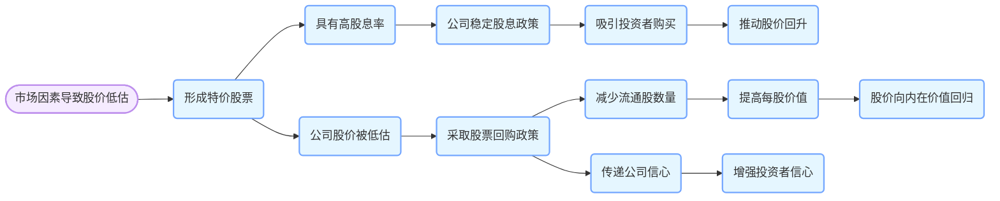

# 特价股票与公司股东回报政策的关联

> 关键词：特价股票、股东回报政策、股息政策、股票回购、公司价值

> 摘要：本文旨在深入探讨特价股票与公司股东回报政策之间的关联。首先介绍了相关背景知识，包括研究目的、预期读者、文档结构等。接着阐述了特价股票和股东回报政策的核心概念及联系，并通过数学模型和公式进行详细讲解与举例说明。在核心算法原理部分，使用 Python 代码进行了阐述。项目实战部分给出了实际案例及代码解读。还探讨了该关联在实际中的应用场景，推荐了相关的工具和资源。最后总结了未来发展趋势与挑战，提供了常见问题解答和扩展阅读参考资料，帮助读者全面理解特价股票与公司股东回报政策的关系及其影响。

## 1. 背景介绍 
### 1.1 目的和范围
本研究的目的在于全面剖析特价股票与公司股东回报政策之间的内在联系。通过对这一关联的深入研究，旨在为投资者提供更准确的投资决策依据，帮助公司管理者制定更合理的股东回报政策，同时也为学术研究提供新的视角和思路。

研究范围涵盖了不同行业、不同规模的上市公司，分析了特价股票的形成原因、特征，以及公司股东回报政策的主要类型和实施效果。不仅关注国内市场，还适当参考了国际市场的相关数据和案例，以确保研究结果的普遍性和适用性。

### 1.2 预期读者
本文预期读者包括广大投资者，无论是个人投资者还是机构投资者，他们可以通过了解特价股票与股东回报政策的关联，更好地评估投资价值，优化投资组合。公司管理者也能从本文中获得启示，制定更符合公司发展战略和股东利益的回报政策。此外，金融领域的研究人员、学者以及对资本市场感兴趣的学生等也能从本文中获取有价值的信息和研究思路。

### 1.3 文档结构概述
本文共分为十个部分。第一部分为背景介绍，阐述研究的目的、范围、预期读者和文档结构概述。第二部分讲解核心概念与联系，明确特价股票和股东回报政策的定义、原理及相互关系。第三部分介绍核心算法原理和具体操作步骤，通过 Python 代码详细说明相关算法。第四部分运用数学模型和公式进行详细讲解并举例说明。第五部分是项目实战，包括开发环境搭建、源代码实现和代码解读。第六部分探讨实际应用场景。第七部分推荐相关的工具和资源，包括学习资源、开发工具框架和相关论文著作。第八部分总结未来发展趋势与挑战。第九部分为附录，解答常见问题。第十部分提供扩展阅读和参考资料。

### 1.4 术语表
#### 1.4.1 核心术语定义
- **特价股票**：指市场价格相对其内在价值被低估的股票。这种低估可能是由于市场短期波动、行业负面消息、公司个别事件等因素导致。
- **股东回报政策**：公司管理层制定的关于如何将公司盈利分配给股东的政策，主要包括股息政策和股票回购政策。
- **股息政策**：公司决定向股东分配现金股息的政策，包括股息支付的频率、金额和方式等。
- **股票回购**：公司从市场上购回自己发行在外的股票，减少流通股数量，从而提高每股价值。

#### 1.4.2 相关概念解释
- **内在价值**：股票所代表的公司的真实价值，通常通过对公司的财务状况、盈利能力、发展前景等因素进行综合评估得出。
- **市场价格**：股票在证券市场上的交易价格，由供求关系等市场因素决定。
- **股息率**：股息与股票价格的比率，反映了股东从股息中获得的收益水平。

#### 1.4.3 缩略词列表
- **EPS**：每股收益（Earnings Per Share），反映公司每股普通股的盈利水平。
- **P/E**：市盈率（Price-to-Earnings Ratio），股票价格与每股收益的比率，用于评估股票的估值水平。

## 2. 核心概念与联系 

### 2.1 特价股票的原理和特征
特价股票的形成主要源于市场的非有效性。市场参与者的情绪、信息不对称、宏观经济环境变化等因素都可能导致股票价格偏离其内在价值。例如，当市场出现恐慌情绪时，投资者可能会过度抛售股票，导致股价大幅下跌，从而形成特价股票。

特价股票通常具有以下特征：
- **低市盈率**：相对于同行业其他股票，特价股票的市盈率较低，这意味着投资者可以以较低的价格购买到公司的盈利。
- **高股息率**：由于股价较低，而公司的股息政策相对稳定，特价股票往往具有较高的股息率，为投资者提供了较高的现金回报。
- **业绩稳定**：许多特价股票所属公司具有稳定的业绩和现金流，只是由于市场短期因素导致股价被低估。

### 2.2 公司股东回报政策的类型和原理
公司股东回报政策主要包括股息政策和股票回购政策。

#### 股息政策
股息政策的制定主要考虑公司的盈利状况、现金流、发展战略和股东需求等因素。公司可以选择固定股息政策、固定股息增长率政策或剩余股息政策等。固定股息政策是指公司每年向股东支付固定金额的股息，这种政策给股东提供了稳定的现金回报，但可能会限制公司的发展资金。固定股息增长率政策是指公司每年按照一定的增长率增加股息支付，这种政策可以反映公司的成长潜力。剩余股息政策是指公司在满足投资需求后，将剩余的盈利作为股息分配给股东，这种政策更注重公司的发展战略。

#### 股票回购政策
股票回购的原理是通过减少流通股数量，提高每股收益和每股净资产，从而提升股票的内在价值。公司可以在市场上以公开市场回购、要约回购等方式购回自己的股票。股票回购还可以向市场传递公司管理层对公司未来发展的信心，吸引投资者。

### 2.3 特价股票与股东回报政策的联系
特价股票与股东回报政策之间存在着密切的联系。一方面，特价股票往往具有较高的股息率，这是因为股价较低而股息相对稳定。公司通过稳定的股息政策可以吸引投资者购买特价股票，提高股票的市场需求，从而推动股价回升。另一方面，公司在股价被低估时，可能会采取股票回购政策。股票回购可以减少市场上的流通股数量，提高每股价值，使特价股票的价格向其内在价值回归。同时，股票回购也向市场传递了公司对自身价值的认可，增强了投资者的信心。

### 2.4 文本示意图
特价股票与股东回报政策的联系可以用以下文本示意图表示：

特价股票（低市盈率、高股息率、业绩稳定） <-- 股息政策（稳定股息吸引投资者） --> 股东回报政策
                                                         |
                                                         v
                                               股票回购政策（提升股价、增强信心）

### 2.5 Mermaid 流程图


## 3. 核心算法原理 & 具体操作步骤 

### 3.1 特价股票的识别算法
特价股票的识别主要基于股票的估值指标，如市盈率、市净率等。以下是一个简单的 Python 代码示例，用于识别特价股票：

```python
import pandas as pd

# 假设我们有一个包含股票信息的 DataFrame，列包括 '股票代码', '股票名称', '市盈率', '市净率'
stock_data = pd.DataFrame({
    '股票代码': ['000001', '000002', '000003'],
    '股票名称': ['股票 A', '股票 B', '股票 C'],
    '市盈率': [10, 20, 5],
    '市净率': [1.5, 2.5, 1]
})

# 定义市盈率和市净率的阈值
pe_threshold = 15
pb_threshold = 2

# 筛选出特价股票
bargain_stocks = stock_data[(stock_data['市盈率'] < pe_threshold) & (stock_data['市净率'] < pb_threshold)]

print('特价股票列表：')
print(bargain_stocks)
```

### 3.2 算法原理讲解
上述代码的原理是通过设定市盈率和市净率的阈值，筛选出低于这些阈值的股票作为特价股票。市盈率反映了投资者为获取公司每股盈利所愿意支付的价格，较低的市盈率可能意味着股票被低估。市净率反映了股票价格与每股净资产的比率，较低的市净率也可能表示股票具有投资价值。

### 3.3 具体操作步骤
1. **数据收集**：收集股票的相关信息，如市盈率、市净率等，可以从金融数据提供商或证券交易所网站获取。
2. **数据处理**：将收集到的数据整理成合适的格式，如 Pandas 的 DataFrame。
3. **设定阈值**：根据市场情况和投资策略，设定市盈率和市净率的阈值。
4. **筛选特价股票**：使用条件筛选语句，筛选出低于阈值的股票。
5. **分析结果**：对筛选出的特价股票进行进一步的分析，如查看公司的财务报表、行业前景等。

## 4. 数学模型和公式 & 详细讲解 & 举例说明 

### 4.1 股息折现模型
股息折现模型（Dividend Discount Model, DDM）是一种用于评估股票内在价值的数学模型。其基本公式为：

$$V = \sum_{t=1}^{\infty} \frac{D_t}{(1 + r)^t}$$

其中，$V$ 表示股票的内在价值，$D_t$ 表示第 $t$ 期的股息，$r$ 表示投资者要求的回报率。

### 4.2 公式讲解
该公式的原理是将股票未来各期的股息按照投资者要求的回报率进行折现，得到股票的内在价值。如果股票的市场价格低于其内在价值，则可以认为该股票是特价股票。

### 4.3 举例说明
假设某公司预计未来每年支付股息 $D = 2$ 元，投资者要求的回报率 $r = 10\%$。根据股息折现模型，该股票的内在价值为：

$$V = \frac{2}{0.1} = 20$$（元）

如果该股票的市场价格为 15 元，则可以认为该股票是特价股票。

### 4.4 股票回购对每股价值的影响
股票回购会减少流通股数量，从而提高每股收益和每股净资产。假设公司的净利润为 $E$，流通股数量为 $N$，每股收益为 $EPS = \frac{E}{N}$。公司进行股票回购，回购数量为 $\Delta N$，则回购后的每股收益为：

$$EPS' = \frac{E}{N - \Delta N}$$

可以看出，回购后每股收益会增加。同理，每股净资产也会相应增加，从而提升股票的内在价值。

### 4.5 举例说明
假设某公司的净利润为 1000 万元，流通股数量为 1000 万股，每股收益为 $EPS = \frac{1000}{1000} = 1$ 元。公司进行股票回购，回购数量为 100 万股，则回购后的每股收益为：

$$EPS' = \frac{1000}{1000 - 100} \approx 1.11$$（元）

可以看出，股票回购后每股收益有所增加。

## 5. 项目实战：代码实际案例和详细解释说明 

### 5.1 开发环境搭建
本项目使用 Python 进行开发，需要安装以下库：
- **pandas**：用于数据处理和分析。
- **numpy**：用于数值计算。
- **matplotlib**：用于数据可视化。

可以使用以下命令进行安装：

```sh
pip install pandas numpy matplotlib
```

### 5.2 源代码详细实现和代码解读
以下是一个完整的项目示例，用于分析特价股票与股东回报政策的关系：

```python
import pandas as pd
import numpy as np
import matplotlib.pyplot as plt

# 模拟股票数据
stock_data = pd.DataFrame({
    '股票代码': ['000001', '000002', '000003', '000004', '000005'],
    '股票名称': ['股票 A', '股票 B', '股票 C', '股票 D', '股票 E'],
    '市盈率': [10, 20, 5, 12, 18],
    '市净率': [1.5, 2.5, 1, 1.2, 2],
    '股息率': [5, 3, 6, 4, 3.5]
})

# 定义市盈率和市净率的阈值
pe_threshold = 15
pb_threshold = 2

# 筛选出特价股票
bargain_stocks = stock_data[(stock_data['市盈率'] < pe_threshold) & (stock_data['市净率'] < pb_threshold)]

# 分析特价股票的股息率
bargain_dividend_rates = bargain_stocks['股息率']

# 绘制股息率柱状图
plt.bar(bargain_stocks['股票名称'], bargain_dividend_rates)
plt.xlabel('股票名称')
plt.ylabel('股息率 (%)')
plt.title('特价股票的股息率')
plt.show()

# 模拟股票回购情况
# 假设公司 A 进行股票回购，回购比例为 10%
company_a = bargain_stocks[bargain_stocks['股票名称'] == '股票 A']
original_shares = 1000  # 原始流通股数量
repurchase_ratio = 0.1
repurchased_shares = original_shares * repurchase_ratio
new_shares = original_shares - repurchased_shares

# 假设公司 A 的净利润为 1000 万元
net_income = 1000
original_eps = net_income / original_shares
new_eps = net_income / new_shares

print(f'股票 A 原始每股收益: {original_eps} 元')
print(f'股票 A 回购后每股收益: {new_eps} 元')
```

### 5.3 代码解读与分析
1. **数据模拟**：使用 `pandas` 库模拟了股票的相关数据，包括股票代码、股票名称、市盈率、市净率和股息率。
2. **特价股票筛选**：根据设定的市盈率和市净率阈值，筛选出特价股票。
3. **股息率分析**：提取特价股票的股息率，并使用 `matplotlib` 库绘制股息率柱状图，直观展示特价股票的股息率情况。
4. **股票回购模拟**：假设公司 A 进行股票回购，计算回购前后的每股收益，展示股票回购对每股收益的影响。

通过这个项目示例，我们可以更直观地了解特价股票与股东回报政策的关系。

## 6. 实际应用场景 
### 6.1 投资者决策
对于投资者来说，了解特价股票与股东回报政策的关联可以帮助他们做出更明智的投资决策。投资者可以通过筛选特价股票，选择具有较高股息率的股票进行投资，以获取稳定的现金回报。同时，关注公司的股票回购政策，当公司进行股票回购时，可能意味着股票价格被低估，投资者可以考虑增加投资。

### 6.2 公司战略制定
公司管理者可以根据市场情况和公司发展战略，制定合理的股东回报政策。当公司股价被低估时，适当增加股息支付或进行股票回购，可以提高股东的满意度，增强投资者的信心，同时也有助于提升公司的市场形象和价值。

### 6.3 金融研究
金融研究人员可以通过研究特价股票与股东回报政策的关系，深入了解资本市场的运行机制和公司的财务决策行为。这有助于发现市场的非有效性和潜在的投资机会，为金融理论的发展提供实证依据。

## 7. 工具和资源推荐
### 7.1 学习资源推荐
#### 7.1.1 书籍推荐
- 《证券分析》（Security Analysis）：由本杰明·格雷厄姆（Benjamin Graham）和戴维·多德（David Dodd）所著，是价值投资的经典著作，详细介绍了股票估值和投资分析的方法。
- 《聪明的投资者》（The Intelligent Investor）：同样是本杰明·格雷厄姆的著作，为普通投资者提供了实用的投资策略和建议。
- 《财务报表分析与证券定价》（Financial Statement Analysis and Security Valuation）：介绍了如何通过财务报表分析来评估公司的价值和股票的投资价值。

#### 7.1.2 在线课程
- Coursera 上的“投资学原理”（Principles of Investing）：由知名大学教授授课，系统介绍了投资学的基本原理和方法。
- edX 上的“财务报表分析”（Financial Statement Analysis）：帮助学习者掌握财务报表分析的技巧和方法。
- 中国大学 MOOC 上的“公司金融”：讲解了公司金融的基本理论和实践，包括股东回报政策等内容。

#### 7.1.3 技术博客和网站
- 雪球网（xueqiu.com）：提供了丰富的股票分析和投资讨论内容，投资者可以在这里交流经验和分享观点。
- 东方财富网（eastmoney.com）：提供全面的金融信息和数据，包括股票行情、财务报表等。
- Seeking Alpha（seekingalpha.com）：是一个专业的金融分析网站，有许多专家和投资者分享的股票分析和投资策略。

### 7.2 开发工具框架推荐
#### 7.2.1 IDE和编辑器
- PyCharm：是一款专业的 Python 集成开发环境，提供了丰富的代码编辑、调试和版本控制功能。
- Visual Studio Code：是一款轻量级的代码编辑器，支持多种编程语言，通过安装相关插件可以方便地进行 Python 开发。

#### 7.2.2 调试和性能分析工具
- `pdb`：Python 内置的调试工具，可以帮助开发者逐行调试代码，查找问题。
- `cProfile`：Python 标准库中的性能分析工具，可以分析代码的执行时间和函数调用情况，帮助优化代码性能。

#### 7.2.3 相关框架和库
- `pandas`：用于数据处理和分析，提供了高效的数据结构和数据操作方法。
- `numpy`：用于数值计算，提供了丰富的数学函数和数组操作功能。
- `matplotlib`：用于数据可视化，能够绘制各种类型的图表，如柱状图、折线图等。

### 7.3 相关论文著作推荐
#### 7.3.1 经典论文
- Modigliani, F., & Miller, M. H. (1958). The Cost of Capital, Corporation Finance and the Theory of Investment. The American Economic Review, 48(3), 261-297. 该论文提出了著名的 MM 定理，对公司的资本结构和股息政策等问题进行了开创性的研究。
- Lintner, J. (1956). Distribution of Incomes of Corporations among Dividends, Retained Earnings, and Taxes. The American Economic Review, 46(2), 97-113. 该论文研究了公司的股息政策，提出了股息分配的理论模型。

#### 7.3.2 最新研究成果
- 可以关注《Journal of Finance》《The Review of Financial Studies》等顶级金融学术期刊，了解关于特价股票、股东回报政策等领域的最新研究成果。

#### 7.3.3 应用案例分析
- 许多金融研究机构和咨询公司会发布关于上市公司股东回报政策的案例分析报告，可以通过相关机构的网站或数据库获取这些报告，学习实际案例中的经验和教训。

## 8. 总结：未来发展趋势与挑战
### 8.1 未来发展趋势
- **数字化和智能化**：随着金融科技的发展，投资者和公司将更多地利用数字化和智能化工具来分析特价股票和制定股东回报政策。例如，使用大数据分析和人工智能算法来筛选特价股票，优化股息政策和股票回购策略。
- **国际化趋势**：全球资本市场的互联互通日益加强，投资者将更加关注国际市场的特价股票和公司的股东回报政策。公司也将面临来自国际投资者的更高要求，需要制定更加国际化的股东回报政策。
- **社会责任和可持续发展**：投资者越来越关注公司的社会责任和可持续发展表现，公司在制定股东回报政策时，可能会更多地考虑环境、社会和治理（ESG）因素，将股东回报与社会责任相结合。

### 8.2 挑战
- **市场不确定性**：市场环境复杂多变，宏观经济因素、政策变化、突发事件等都可能导致股票价格波动，增加了识别特价股票和制定合理股东回报政策的难度。
- **信息不对称**：投资者和公司之间存在信息不对称，投资者可能无法获取公司的全部信息，从而影响对特价股票和股东回报政策的判断。
- **法律法规限制**：不同国家和地区的法律法规对股东回报政策有不同的规定，公司在制定和实施股东回报政策时需要遵守相关法律法规，这也增加了政策制定的复杂性。

## 9. 附录：常见问题与解答
### 9.1 如何准确识别特价股票？
识别特价股票需要综合考虑多个因素，如市盈率、市净率、股息率等估值指标，同时还要分析公司的财务状况、行业前景、管理层能力等基本面因素。此外，还可以参考专业机构的研究报告和市场分析，但最终的决策还需要投资者自己进行独立思考和判断。

### 9.2 公司的股东回报政策会对股价产生怎样的影响？
稳定的股息政策可以吸引投资者，提高股票的市场需求，从而推动股价上涨。股票回购可以减少流通股数量，提高每股价值，也有助于提升股价。同时，股东回报政策还向市场传递了公司的财务状况和发展信心，对股价产生间接影响。

### 9.3 投资者应该如何选择适合自己的股东回报方式？
投资者应该根据自己的投资目标、风险承受能力和资金需求等因素来选择适合自己的股东回报方式。如果投资者追求稳定的现金收入，可以选择股息率较高的股票；如果投资者更关注股票的长期增值，可以关注公司的股票回购政策和发展前景。

## 10. 扩展阅读 & 参考资料
### 10.1 扩展阅读
- 《金融炼金术》（The Alchemy of Finance）：乔治·索罗斯（George Soros）的著作，探讨了金融市场的运行规律和投资者的行为心理。
- 《漫步华尔街》（A Random Walk Down Wall Street）：伯顿·马尔基尔（Burton Malkiel）的著作，介绍了股票投资的各种理论和方法，以及如何构建合理的投资组合。

### 10.2 参考资料
- 中国证券监督管理委员会官方网站（csrc.gov.cn）：提供了中国资本市场的相关法律法规、政策解读和市场数据。
- 上海证券交易所官方网站（sse.com）和深圳证券交易所官方网站（szse.cn）：提供了上市公司的公告、财务报表等信息。
- 彭博社（bloomberg.com）、路透社（reuters.com）等国际金融媒体：提供全球金融市场的最新动态和分析报道。