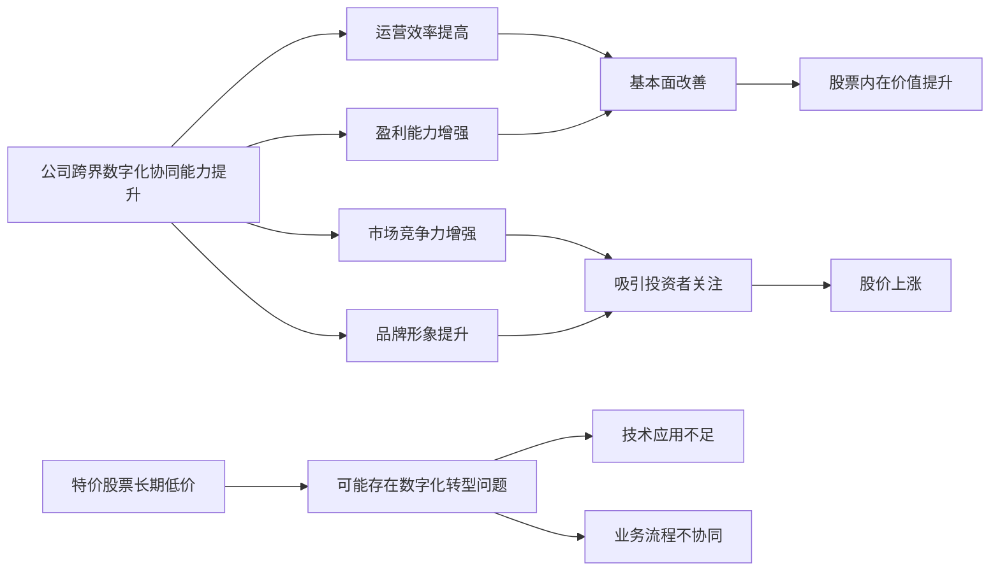

# 特价股票与公司跨界数字化协同能力的关系研究

> 关键词：特价股票、公司跨界数字化协同能力、股票估值、企业竞争力、数字化转型、协同效应、市场分析

> 摘要：本文旨在深入研究特价股票与公司跨界数字化协同能力之间的关系。通过对相关核心概念的阐述、算法原理的分析、数学模型的构建以及项目实战案例的探讨，揭示两者之间内在的联系。同时，结合实际应用场景，分析这种关系对企业和投资者的影响，并提供相关的工具和资源推荐。最后，对未来的发展趋势和挑战进行总结，以期为企业的数字化转型和投资者的决策提供有价值的参考。

## 1. 背景介绍 
### 1.1 目的和范围
本研究的主要目的是探究特价股票与公司跨界数字化协同能力之间的关联机制。随着数字化时代的到来，企业纷纷进行跨界数字化转型，以提升自身的竞争力。而特价股票作为市场中价格相对较低的股票，其价格波动与公司的各种因素密切相关。本研究将范围限定在探讨公司跨界数字化协同能力如何影响特价股票的价值，以及特价股票的市场表现又如何反映公司的跨界数字化协同能力等方面。

### 1.2 预期读者
本文预期读者包括金融投资者、企业管理者、行业研究人员以及对数字化转型和金融市场感兴趣的学者。对于投资者而言，了解特价股票与公司跨界数字化协同能力的关系有助于他们做出更明智的投资决策；企业管理者可以从中获取关于数字化转型对企业价值影响的启示，以制定更有效的战略；行业研究人员和学者则可以将本文作为进一步研究的参考。

### 1.3 文档结构概述
本文首先介绍相关的背景信息，包括研究的目的、预期读者和文档结构。接着阐述核心概念及其联系，包括特价股票和公司跨界数字化协同能力的定义、原理和架构。然后详细讲解核心算法原理和具体操作步骤，并通过数学模型和公式进行理论支持。之后通过项目实战案例，展示代码实现和详细解释。再分析实际应用场景，推荐相关的工具和资源。最后总结未来发展趋势与挑战，并提供常见问题解答和扩展阅读参考资料。

### 1.4 术语表
#### 1.4.1 核心术语定义
- **特价股票**：指在股票市场中，价格相对较低，可能由于各种原因被市场低估的股票。其价格通常低于同类股票的平均水平。
- **公司跨界数字化协同能力**：公司在不同业务领域之间，利用数字化技术实现资源共享、信息互通、业务协同，以提升整体运营效率和竞争力的能力。

#### 1.4.2 相关概念解释
- **股票估值**：对股票的内在价值进行评估的过程，通常基于公司的财务状况、盈利能力、发展前景等因素。
- **数字化转型**：企业利用数字技术对业务流程、组织架构、商业模式等进行全面变革，以适应数字化时代的发展需求。
- **协同效应**：指企业各部门或业务单元之间通过合作和协调，实现的整体效益大于各部分效益之和的效果。

#### 1.4.3 缩略词列表
- **ROE**：净资产收益率（Return on Equity）
- **EPS**：每股收益（Earnings Per Share）
- **AI**：人工智能（Artificial Intelligence）
- **IoT**：物联网（Internet of Things）

## 2. 核心概念与联系 
### 2.1 特价股票的原理和架构
特价股票的形成原因较为复杂，主要包括以下几个方面：
- **市场情绪影响**：投资者的恐慌、过度乐观或悲观情绪可能导致股票价格的异常波动，使得某些股票价格被低估，成为特价股票。
- **公司短期困境**：公司可能由于短期的经营问题、行业竞争压力或突发事件等原因，导致股价下跌，但公司的长期基本面可能仍然良好。
- **信息不对称**：市场上存在信息不对称的情况，部分投资者可能未能及时获取公司的真实价值信息，从而导致股票价格偏离其内在价值。

特价股票的架构可以从以下几个层次来理解：
- **价格层面**：表现为相对较低的股价，通常低于行业平均水平或其历史价格的一定比例。
- **基本面层面**：公司的财务状况、盈利能力、资产质量等基本因素可能被市场低估，但实际上具有一定的潜力。
- **市场层面**：受到市场供求关系、投资者偏好、宏观经济环境等因素的影响。

其文本示意图如下：

特价股票
|-- 价格层面：低股价
|-- 基本面层面：被低估的财务状况、盈利能力等
|-- 市场层面：供求关系、投资者偏好、宏观经济环境

### 2.2 公司跨界数字化协同能力的原理和架构
公司跨界数字化协同能力的原理基于数字化技术的应用和业务流程的优化。通过数字化技术，如大数据、人工智能、物联网等，公司可以打破不同业务领域之间的壁垒，实现信息的实时共享和业务的协同运作。具体原理如下：
- **数据驱动**：利用大数据技术收集、分析和挖掘不同业务领域的数据，为决策提供支持，实现资源的优化配置。
- **流程整合**：通过数字化手段对不同业务流程进行整合和优化，提高运营效率，降低成本。
- **创新驱动**：借助数字化技术推动业务模式和产品创新，提升公司的竞争力。

公司跨界数字化协同能力的架构可以分为以下几个部分：
- **数字化基础设施**：包括硬件设备、软件系统、网络通信等，为数字化协同提供技术支持。
- **业务协同平台**：整合不同业务部门的信息和流程，实现业务的协同运作。
- **组织文化**：营造支持跨界合作和数字化转型的组织文化，培养员工的数字化素养和协同意识。

其文本示意图如下：

公司跨界数字化协同能力
|-- 数字化基础设施：硬件、软件、网络
|-- 业务协同平台：信息整合、流程优化
|-- 组织文化：跨界合作、数字化素养

### 2.3 特价股票与公司跨界数字化协同能力的联系
公司跨界数字化协同能力的提升可能对特价股票产生积极影响。一方面，数字化协同可以提高公司的运营效率和盈利能力，改善公司的基本面，从而提升股票的内在价值。另一方面，数字化协同能力的增强可以提升公司的市场竞争力和品牌形象，吸引更多投资者的关注，推动股价上涨。

反之，特价股票的市场表现也可以在一定程度上反映公司的跨界数字化协同能力。如果一家公司的股票长期处于低价状态，可能暗示其在数字化转型和跨界协同方面存在问题，如技术应用不足、业务流程不协同等。

其 Mermaid 流程图如下：



## 3. 核心算法原理 & 具体操作步骤 
### 3.1 评估公司跨界数字化协同能力的算法原理
我们可以通过构建一个综合评估模型来评估公司的跨界数字化协同能力。该模型基于多个指标，包括数字化技术应用水平、业务流程协同程度、组织文化支持度等。具体算法原理如下：

首先，确定各个指标的权重。可以通过专家打分法或层次分析法来确定权重，以反映各个指标在评估中的重要性。

然后，对每个指标进行量化评估。例如，数字化技术应用水平可以通过公司在大数据、人工智能、物联网等技术方面的投入和应用效果来评估；业务流程协同程度可以通过业务流程的整合程度、信息共享效率等指标来评估；组织文化支持度可以通过员工的数字化素养、团队合作氛围等方面来评估。

最后，将各个指标的评估得分乘以其对应的权重，然后求和，得到公司跨界数字化协同能力的综合得分。

以下是使用 Python 实现的示例代码：

```python
# 定义各个指标的权重
weights = {
    '数字化技术应用水平': 0.4,
    '业务流程协同程度': 0.3,
    '组织文化支持度': 0.3
}

# 定义各个指标的评估得分
scores = {
    '数字化技术应用水平': 80,
    '业务流程协同程度': 70,
    '组织文化支持度': 75
}

# 计算综合得分
total_score = 0
for key in weights:
    total_score += weights[key] * scores[key]

print(f"公司跨界数字化协同能力综合得分: {total_score}")
```

### 3.2 分析特价股票与公司跨界数字化协同能力关系的操作步骤
1. **数据收集**：收集公司的财务数据、股价数据、数字化技术应用数据、业务流程数据等相关信息。
2. **数据预处理**：对收集到的数据进行清洗、整理和标准化处理，以确保数据的质量和一致性。
3. **计算公司跨界数字化协同能力得分**：使用上述评估算法计算公司的跨界数字化协同能力得分。
4. **分析特价股票特征**：确定股票是否为特价股票，并分析其价格走势、估值指标等特征。
5. **建立关联模型**：使用统计分析方法，如回归分析、相关性分析等，建立特价股票特征与公司跨界数字化协同能力得分之间的关联模型。
6. **模型验证和优化**：使用历史数据对关联模型进行验证，并根据验证结果对模型进行优化。
7. **结果分析和决策建议**：根据关联模型的结果，分析特价股票与公司跨界数字化协同能力之间的关系，并为投资者和企业管理者提供决策建议。

## 4. 数学模型和公式 & 详细讲解 & 举例说明 
### 4.1 评估公司跨界数字化协同能力的数学模型
设公司跨界数字化协同能力的综合得分记为 $S$，共有 $n$ 个评估指标，第 $i$ 个指标的权重记为 $w_i$，第 $i$ 个指标的评估得分记为 $x_i$，则综合得分的计算公式为：

$$S = \sum_{i=1}^{n} w_i x_i$$

其中，$\sum_{i=1}^{n} w_i = 1$，$0 \leq w_i \leq 1$，$0 \leq x_i \leq 100$。

### 4.2 分析特价股票与公司跨界数字化协同能力关系的数学模型
我们可以使用线性回归模型来分析特价股票的价格 $P$ 与公司跨界数字化协同能力得分 $S$ 之间的关系。线性回归模型的一般形式为：

$$P = \beta_0 + \beta_1 S + \epsilon$$

其中，$\beta_0$ 为截距项，$\beta_1$ 为回归系数，$\epsilon$ 为误差项，服从均值为 0 的正态分布。

### 4.3 举例说明
假设我们有以下数据：

| 公司名称 | 数字化技术应用水平得分 ($x_1$) | 业务流程协同程度得分 ($x_2$) | 组织文化支持度得分 ($x_3$) | 股票价格 ($P$) |
|---|---|---|---|---|
| A 公司 | 80 | 70 | 75 | 10 |
| B 公司 | 70 | 60 | 65 | 8 |
| C 公司 | 90 | 80 | 85 | 12 |

首先，计算各个公司的跨界数字化协同能力得分。假设权重 $w_1 = 0.4$，$w_2 = 0.3$，$w_3 = 0.3$，则：

- A 公司的综合得分 $S_A = 0.4 \times 80 + 0.3 \times 70 + 0.3 \times 75 = 76.5$
- B 公司的综合得分 $S_B = 0.4 \times 70 + 0.3 \times 60 + 0.3 \times 65 = 65.5$
- C 公司的综合得分 $S_C = 0.4 \times 90 + 0.3 \times 80 + 0.3 \times 85 = 85.5$

然后，使用线性回归模型来分析股票价格与跨界数字化协同能力得分之间的关系。我们可以使用 Python 的 `scikit-learn` 库来实现：

```python
import numpy as np
from sklearn.linear_model import LinearRegression

# 定义特征矩阵 X 和目标向量 y
X = np.array([[76.5], [65.5], [85.5]])
y = np.array([10, 8, 12])

# 创建线性回归模型
model = LinearRegression()

# 拟合模型
model.fit(X, y)

# 输出回归系数和截距项
print(f"回归系数: {model.coef_[0]}")
print(f"截距项: {model.intercept_}")
```

通过上述计算，我们可以得到回归系数和截距项，从而建立股票价格与跨界数字化协同能力得分之间的线性关系模型。

## 5. 项目实战：代码实际案例和详细解释说明 
### 5.1  开发环境搭建
为了实现上述算法和模型，我们需要搭建以下开发环境：
- **编程语言**：Python 3.x
- **开发工具**：Jupyter Notebook 或 PyCharm
- **相关库**：`pandas`、`numpy`、`scikit-learn`、`matplotlib` 等

可以使用以下命令来安装相关库：

```sh
pip install pandas numpy scikit-learn matplotlib
```

### 5.2  源代码详细实现和代码解读
以下是一个完整的项目实战代码示例，用于分析特价股票与公司跨界数字化协同能力之间的关系：

```python
import pandas as pd
import numpy as np
from sklearn.linear_model import LinearRegression
import matplotlib.pyplot as plt

# 读取数据
data = pd.read_csv('stock_data.csv')

# 定义各个指标的权重
weights = {
    '数字化技术应用水平': 0.4,
    '业务流程协同程度': 0.3,
    '组织文化支持度': 0.3
}

# 计算公司跨界数字化协同能力得分
data['跨界数字化协同能力得分'] = 0
for key in weights:
    data['跨界数字化协同能力得分'] += weights[key] * data[key]

# 分离特征矩阵 X 和目标向量 y
X = data[['跨界数字化协同能力得分']]
y = data['股票价格']

# 创建线性回归模型
model = LinearRegression()

# 拟合模型
model.fit(X, y)

# 输出回归系数和截距项
print(f"回归系数: {model.coef_[0]}")
print(f"截距项: {model.intercept_}")

# 预测股票价格
data['预测股票价格'] = model.predict(X)

# 绘制实际股票价格和预测股票价格的散点图
plt.scatter(data['跨界数字化协同能力得分'], data['股票价格'], label='实际股票价格')
plt.plot(data['跨界数字化协同能力得分'], data['预测股票价格'], color='red', label='预测股票价格')
plt.xlabel('跨界数字化协同能力得分')
plt.ylabel('股票价格')
plt.title('特价股票与公司跨界数字化协同能力关系')
plt.legend()
plt.show()
```

### 5.3  代码解读与分析
1. **数据读取**：使用 `pandas` 库的 `read_csv` 函数读取存储在 `stock_data.csv` 文件中的数据。
2. **计算跨界数字化协同能力得分**：根据各个指标的权重，计算每个公司的跨界数字化协同能力得分，并将结果存储在新的列中。
3. **分离特征矩阵和目标向量**：将跨界数字化协同能力得分作为特征矩阵 $X$，股票价格作为目标向量 $y$。
4. **创建和拟合线性回归模型**：使用 `scikit-learn` 库的 `LinearRegression` 类创建线性回归模型，并使用 `fit` 方法拟合模型。
5. **输出回归系数和截距项**：通过模型的 `coef_` 和 `intercept_` 属性输出回归系数和截距项。
6. **预测股票价格**：使用拟合好的模型对股票价格进行预测，并将预测结果存储在新的列中。
7. **绘制散点图**：使用 `matplotlib` 库绘制实际股票价格和预测股票价格的散点图，直观展示特价股票与公司跨界数字化协同能力之间的关系。

## 6. 实际应用场景 
### 6.1 投资者决策
对于投资者而言，了解特价股票与公司跨界数字化协同能力的关系可以帮助他们做出更明智的投资决策。如果一家公司具有较强的跨界数字化协同能力，但股票价格却处于较低水平，可能意味着该股票被市场低估，具有投资价值。投资者可以通过分析公司的数字化转型战略、技术应用情况和业务协同效果等方面，评估公司的跨界数字化协同能力，从而筛选出有潜力的特价股票。

### 6.2 企业战略制定
企业管理者可以通过研究特价股票与公司跨界数字化协同能力的关系，制定更有效的战略。如果公司的股票价格长期处于低价状态，可能需要审视公司的数字化转型和跨界协同策略是否存在问题。企业可以加大在数字化技术方面的投入，优化业务流程，加强组织文化建设，提升跨界数字化协同能力，从而提高公司的市场价值和股票价格。

### 6.3 行业分析
行业研究人员可以利用这种关系对整个行业进行分析。通过比较不同公司的跨界数字化协同能力和股票价格表现，可以了解行业内企业的数字化转型程度和竞争力差异。这有助于发现行业的发展趋势和潜在机会，为行业的整体发展提供参考。

## 7. 工具和资源推荐
### 7.1 学习资源推荐
#### 7.1.1 书籍推荐
- 《数字化转型：企业破局与增长的新引擎》：全面介绍了企业数字化转型的理论和实践，包括数字化技术的应用、业务流程的优化和组织文化的变革等方面。
- 《金融市场与金融机构》：系统讲解了金融市场的运作机制和金融机构的业务模式，对于理解股票市场和投资决策具有重要的参考价值。
- 《Python 数据分析实战》：详细介绍了使用 Python 进行数据分析的方法和技巧，包括数据处理、统计分析和可视化等方面。

#### 7.1.2 在线课程
- Coursera 上的“数字化转型战略”课程：由知名高校的教授授课，深入讲解企业数字化转型的战略规划和实施方法。
- edX 上的“金融市场与投资”课程：提供了金融市场的基础知识和投资分析的方法，适合初学者学习。
- 慕课网上的“Python 数据分析从入门到精通”课程：通过实际案例，系统地介绍了 Python 数据分析的流程和技术。

#### 7.1.3 技术博客和网站
- 36氪：关注科技、商业和创业领域的最新动态，提供了大量关于数字化转型和企业创新的文章和分析。
- 雪球网：专注于金融市场和投资领域，有很多投资者分享的股票分析和投资经验。
- 开源中国：提供了丰富的技术资源和开源项目，对于学习和了解数字化技术有很大的帮助。

### 7.2 开发工具框架推荐
#### 7.2.1 IDE和编辑器
- PyCharm：一款功能强大的 Python 集成开发环境，提供了代码编辑、调试、版本控制等丰富的功能。
- Jupyter Notebook：一种交互式的开发环境，适合进行数据分析和模型实验，方便代码的编写和展示。

#### 7.2.2 调试和性能分析工具
- `pdb`：Python 自带的调试工具，可以帮助开发者定位代码中的错误和问题。
- `cProfile`：用于分析 Python 代码的性能，找出代码中的瓶颈和优化点。

#### 7.2.3 相关框架和库
- `pandas`：用于数据处理和分析的 Python 库，提供了高效的数据结构和数据操作方法。
- `numpy`：Python 的数值计算库，提供了多维数组和各种数学函数，用于科学计算和数据分析。
- `scikit-learn`：用于机器学习的 Python 库，提供了各种机器学习算法和工具，方便进行模型训练和评估。

### 7.3 相关论文著作推荐
#### 7.3.1 经典论文
- “The Digital Transformation of Business: A Review and Research Agenda”：对企业数字化转型的相关研究进行了综述，并提出了未来的研究方向。
- “Stock Market Efficiency and the Pricing of Information”：探讨了股票市场的效率和信息定价问题，对于理解股票价格的形成机制具有重要意义。

#### 7.3.2 最新研究成果
- 关注顶级学术期刊，如《管理世界》、《金融研究》等，及时了解关于特价股票、公司跨界数字化协同能力等方面的最新研究成果。

#### 7.3.3 应用案例分析
- 一些商业杂志和咨询公司的报告中会有关于企业数字化转型和股票市场分析的应用案例，如麦肯锡、波士顿咨询等公司的报告，可以从中获取实际案例和经验教训。

## 8. 总结：未来发展趋势与挑战
### 8.1 未来发展趋势
- **数字化转型加速**：随着科技的不断进步，企业将加快数字化转型的步伐，跨界数字化协同能力将成为企业核心竞争力的重要组成部分。这将进一步影响特价股票的价值，具有较强跨界数字化协同能力的企业股票可能会获得更高的估值。
- **数据驱动决策**：投资者和企业管理者将越来越依赖数据和分析来做出决策。通过对大量的财务数据、市场数据和数字化转型数据的分析，能够更准确地评估公司的跨界数字化协同能力和股票的投资价值。
- **行业融合加深**：不同行业之间的界限将越来越模糊，企业的跨界合作和协同将更加频繁。这将为公司的跨界数字化协同能力带来新的机遇和挑战，也将影响特价股票在不同行业之间的分布和表现。

### 8.2 挑战
- **数据质量和安全问题**：在数字化转型过程中，企业将产生大量的数据。确保数据的质量和安全是一个重要的挑战。不准确或不安全的数据可能会影响对公司跨界数字化协同能力的评估和投资决策的准确性。
- **技术更新换代快**：数字化技术发展迅速，企业需要不断更新和升级技术，以保持跨界数字化协同能力的领先地位。这需要企业投入大量的资金和人力，对于一些中小企业来说可能是一个巨大的挑战。
- **人才短缺**：具备数字化技术和金融分析知识的复合型人才短缺。企业和投资者都需要这样的人才来推动数字化转型和进行投资决策。培养和吸引这类人才是当前面临的一个重要挑战。

## 9. 附录：常见问题与解答
### 9.1 如何准确评估公司的跨界数字化协同能力？
评估公司的跨界数字化协同能力需要综合考虑多个方面，包括数字化技术应用水平、业务流程协同程度、组织文化支持度等。可以通过构建综合评估模型，确定各个指标的权重，并对每个指标进行量化评估，最后计算综合得分。同时，还可以参考行业标杆和专家意见，以提高评估的准确性。

### 9.2 特价股票一定具有投资价值吗？
特价股票不一定具有投资价值。虽然特价股票价格相对较低，但可能存在各种风险，如公司基本面恶化、行业竞争加剧等。在投资特价股票时，需要深入分析公司的跨界数字化协同能力、财务状况、发展前景等因素，评估其内在价值，以确定是否具有投资价值。

### 9.3 企业如何提升跨界数字化协同能力？
企业可以从以下几个方面提升跨界数字化协同能力：
- **加大数字化技术投入**：积极引进和应用大数据、人工智能、物联网等数字化技术，提升企业的数字化水平。
- **优化业务流程**：打破部门壁垒，整合不同业务流程，实现信息共享和业务协同。
- **培养组织文化**：营造支持跨界合作和创新的组织文化，培养员工的数字化素养和协同意识。
- **加强人才培养和引进**：吸引和培养具备数字化技术和跨界管理能力的人才，为企业的数字化转型提供人才支持。

## 10. 扩展阅读 & 参考资料
- 《数字化转型的逻辑与路径》
- 《金融投资学》
- 各大金融机构和咨询公司的研究报告
- 相关学术期刊上的论文，如《管理科学学报》、《会计研究》等