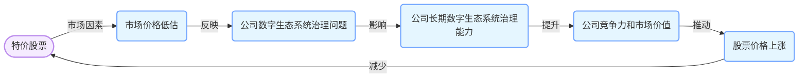

# 特价股票与公司长期数字生态系统治理能力的关系分析

> 关键词：特价股票、公司长期数字生态系统、治理能力、关系分析、财务指标、市场表现

> 摘要：本文旨在深入剖析特价股票与公司长期数字生态系统治理能力之间的关系。通过对相关概念的阐述、核心算法的讲解、数学模型的构建以及实际案例的分析，揭示两者之间内在的联系和相互影响。探讨特价股票的出现对公司数字生态系统治理的影响，以及公司良好的数字生态系统治理能力如何反映在股票价格上。同时，结合实际应用场景和未来发展趋势，为投资者和企业管理者提供有价值的参考和决策依据。

## 1. 背景介绍 
### 1.1 目的和范围
本研究的目的在于全面分析特价股票与公司长期数字生态系统治理能力之间的关系。具体范围涵盖了对特价股票的定义、特征和形成原因的探讨，公司长期数字生态系统治理能力的内涵、评估方法，以及两者之间的相互作用机制。通过对这些方面的研究，试图揭示这种关系对企业发展和投资者决策的影响。

### 1.2 预期读者
本文预期读者包括金融领域的投资者、企业管理者、金融分析师、学术研究人员以及对金融和企业管理感兴趣的相关人士。投资者可以从本文中获取有关特价股票投资决策的参考信息；企业管理者可以了解如何通过提升数字生态系统治理能力来影响公司的市场价值；金融分析师可以将本文的研究成果应用于对企业的评估和分析；学术研究人员可以在此基础上进行更深入的理论研究。

### 1.3 文档结构概述
本文将按照以下结构展开：首先介绍背景信息，包括研究目的、预期读者和文档结构概述；接着阐述核心概念与联系，明确特价股票和公司长期数字生态系统治理能力的定义和相互关系；然后讲解核心算法原理和具体操作步骤，通过Python代码实现相关算法；再介绍数学模型和公式，并进行详细讲解和举例说明；随后通过项目实战展示代码实际案例和详细解释说明；接着探讨实际应用场景；之后推荐相关的工具和资源；最后进行总结，分析未来发展趋势与挑战，并提供常见问题与解答以及扩展阅读和参考资料。

### 1.4 术语表
#### 1.4.1 核心术语定义
- **特价股票**：指市场价格相对其内在价值或行业平均水平较低的股票。特价股票可能由于市场误解、短期负面事件或行业周期性因素等导致价格被低估。
- **公司长期数字生态系统**：是指公司基于数字化技术构建的，涵盖内部运营、外部合作、客户关系等多个方面的复杂生态系统。它包括数字技术的应用、数据的管理和利用、数字化的业务流程以及与数字化相关的组织架构和文化等。
- **治理能力**：在公司长期数字生态系统中，治理能力是指公司有效管理和协调数字生态系统中各个要素，实现系统目标，提升系统效率和竞争力的能力。

#### 1.4.2 相关概念解释
- **数字生态系统的开放性**：指公司数字生态系统与外部环境的交互程度，包括与供应商、合作伙伴、客户等的信息共享和业务合作。
- **数据驱动决策**：是指公司在制定战略、运营决策等过程中，充分利用数据分析和挖掘的结果，以提高决策的科学性和准确性。
- **数字化转型**：是指公司通过采用数字技术，对业务模式、流程、组织架构等进行全面变革，以适应数字化时代的发展需求。

#### 1.4.3 缩略词列表
- **AI**：Artificial Intelligence，人工智能
- **Big Data**：大数据
- **IoT**：Internet of Things，物联网
- **ERP**：Enterprise Resource Planning，企业资源计划

## 2. 核心概念与联系 

### 2.1 特价股票的概念与特征
特价股票通常具有以下特征：
- **低市盈率（P/E）**：市盈率是股票价格与每股收益的比值，特价股票的市盈率往往低于行业平均水平，表明其价格相对较低。
- **低市净率（P/B）**：市净率是股票价格与每股净资产的比值，特价股票的市净率较低，可能意味着其资产被市场低估。
- **市场关注度低**：由于各种原因，特价股票可能没有得到市场的充分关注，导致其价格未能反映其真实价值。

特价股票的形成原因主要包括：
- **短期负面事件**：如公司业绩下滑、产品质量问题、法律纠纷等，导致市场对公司的信心下降，股价下跌。
- **行业周期性因素**：某些行业具有明显的周期性，在行业低谷期，相关公司的股票价格可能被低估。
- **市场误解**：市场对公司的业务模式、发展前景等存在误解，导致股票价格偏离其内在价值。

### 2.2 公司长期数字生态系统治理能力的内涵
公司长期数字生态系统治理能力包括以下几个方面：
- **数字战略规划能力**：公司能够制定明确的数字化战略，与公司的整体战略相匹配，指导数字生态系统的建设和发展。
- **数字技术应用能力**：公司能够有效地应用各种数字技术，如人工智能、大数据、物联网等，提升业务效率和创新能力。
- **数据管理能力**：公司能够对数据进行有效的收集、存储、分析和利用，以支持决策和业务发展。
- **组织与文化适应能力**：公司的组织架构和文化能够适应数字化转型的需求，促进数字生态系统的协同发展。

### 2.3 特价股票与公司长期数字生态系统治理能力的联系
特价股票与公司长期数字生态系统治理能力之间存在着密切的联系。一方面，公司良好的数字生态系统治理能力可以提升公司的竞争力和市场价值，从而有助于提高股票价格，减少特价股票出现的可能性。例如，通过有效的数字战略规划和数字技术应用，公司可以提高业务效率、降低成本、拓展市场，从而增加公司的盈利能力和市场份额，进而推动股票价格上涨。

另一方面，特价股票的出现可能反映出公司数字生态系统治理能力存在问题。如果公司在数字技术应用、数据管理等方面存在不足，可能导致市场对公司的发展前景缺乏信心，从而使股票价格被低估。例如，公司未能及时跟上数字化转型的步伐，在市场竞争中处于劣势，可能会导致业绩下滑，股票价格下跌。

### 2.4 核心概念原理和架构的文本示意图
特价股票与公司长期数字生态系统治理能力的关系可以用以下文本示意图表示：

特价股票 <-- 市场因素（短期负面事件、行业周期性、市场误解）
          |
          | 相互影响
          |
公司长期数字生态系统治理能力 <-- 数字战略规划、数字技术应用、数据管理、组织与文化适应

### 2.5 Mermaid 流程图


## 3. 核心算法原理 & 具体操作步骤 

### 3.1 特价股票的筛选算法
特价股票的筛选可以通过以下步骤实现：
1. **数据收集**：收集股票的基本信息，包括市盈率、市净率、每股收益、净资产等财务指标，以及行业平均数据。
2. **计算相对指标**：计算股票的市盈率、市净率等指标相对于行业平均水平的比值。
3. **设定筛选标准**：根据相对指标设定筛选标准，例如，市盈率低于行业平均水平的一定比例，市净率低于行业平均水平的一定比例等。
4. **筛选股票**：根据筛选标准筛选出符合条件的特价股票。

以下是使用Python实现特价股票筛选算法的示例代码：
```python
import pandas as pd

# 模拟股票数据
data = {
    '股票代码': ['000001', '000002', '000003', '000004', '000005'],
    '市盈率': [10, 15, 20, 8, 12],
    '市净率': [1.5, 2.0, 2.5, 1.2, 1.8],
    '行业平均市盈率': 15,
    '行业平均市净率': 2.0
}

df = pd.DataFrame(data)

# 计算相对市盈率和相对市净率
df['相对市盈率'] = df['市盈率'] / df['行业平均市盈率']
df['相对市净率'] = df['市净率'] / df['行业平均市净率']

# 设定筛选标准
pe_threshold = 0.8
pb_threshold = 0.8

# 筛选特价股票
special_stocks = df[(df['相对市盈率'] < pe_threshold) & (df['相对市净率'] < pb_threshold)]

print(special_stocks)
```

### 3.2 公司长期数字生态系统治理能力的评估算法
公司长期数字生态系统治理能力的评估可以采用多指标综合评价法。具体步骤如下：
1. **确定评估指标体系**：包括数字战略规划、数字技术应用、数据管理、组织与文化适应等方面的指标。
2. **确定指标权重**：根据各指标的重要程度确定其权重。
3. **数据收集**：收集公司在各指标方面的相关数据。
4. **指标量化**：将各指标的数据进行量化处理。
5. **计算综合得分**：根据指标权重和量化后的数据计算公司的综合得分。

以下是使用Python实现公司长期数字生态系统治理能力评估算法的示例代码：
```python
import pandas as pd

# 模拟公司数据
data = {
    '公司名称': ['公司A', '公司B', '公司C', '公司D', '公司E'],
    '数字战略规划得分': [80, 70, 60, 90, 75],
    '数字技术应用得分': [75, 85, 65, 95, 80],
    '数据管理得分': [85, 75, 60, 90, 80],
    '组织与文化适应得分': [70, 80, 65, 90, 75]
}

df = pd.DataFrame(data)

# 确定指标权重
weights = {
    '数字战略规划得分': 0.3,
    '数字技术应用得分': 0.3,
    '数据管理得分': 0.2,
    '组织与文化适应得分': 0.2
}

# 计算综合得分
df['综合得分'] = df['数字战略规划得分'] * weights['数字战略规划得分'] + \
                   df['数字技术应用得分'] * weights['数字技术应用得分'] + \
                   df['数据管理得分'] * weights['数据管理得分'] + \
                   df['组织与文化适应得分'] * weights['组织与文化适应得分']

print(df)
```

## 4. 数学模型和公式 & 详细讲解 & 举例说明 

### 4.1 特价股票筛选的数学模型
特价股票筛选的数学模型可以用以下公式表示：

设股票 $i$ 的市盈率为 $P/E_i$，行业平均市盈率为 $\overline{P/E}$，市净率为 $P/B_i$，行业平均市净率为 $\overline{P/B}$。

相对市盈率 $RPE_i = \frac{P/E_i}{\overline{P/E}}$

相对市净率 $RPB_i = \frac{P/B_i}{\overline{P/B}}$

如果 $RPE_i < \alpha$ 且 $RPB_i < \beta$，则股票 $i$ 为特价股票，其中 $\alpha$ 和 $\beta$ 为筛选阈值。

例如，假设行业平均市盈率为 15，行业平均市净率为 2.0，筛选阈值 $\alpha = 0.8$，$\beta = 0.8$。某股票的市盈率为 10，市净率为 1.2，则：

$RPE = \frac{10}{15} \approx 0.67 < 0.8$

$RPB = \frac{1.2}{2.0} = 0.6 < 0.8$

因此，该股票为特价股票。

### 4.2 公司长期数字生态系统治理能力评估的数学模型
公司长期数字生态系统治理能力评估的数学模型可以用以下公式表示：

设公司 $j$ 在第 $k$ 个指标上的得分是 $x_{jk}$，第 $k$ 个指标的权重是 $w_k$，指标总数为 $n$。

公司 $j$ 的综合得分 $S_j = \sum_{k=1}^{n} w_k x_{jk}$

例如，某公司在数字战略规划、数字技术应用、数据管理、组织与文化适应四个指标上的得分分别为 80、75、85、70，对应的权重分别为 0.3、0.3、0.2、0.2，则：

$S = 0.3 \times 80 + 0.3 \times 75 + 0.2 \times 85 + 0.2 \times 70$
$= 24 + 22.5 + 17 + 14$
$= 77.5$

## 5. 项目实战：代码实际案例和详细解释说明 

### 5.1  开发环境搭建
在进行项目实战之前，需要搭建相应的开发环境。以下是具体步骤：
1. **安装Python**：可以从Python官方网站（https://www.python.org/downloads/）下载并安装Python 3.x版本。
2. **安装必要的库**：使用pip命令安装pandas、numpy等必要的库。例如：
```sh
pip install pandas numpy
```
3. **选择开发工具**：可以选择PyCharm、Jupyter Notebook等开发工具。

### 5.2  源代码详细实现和代码解读
#### 5.2.1 特价股票筛选代码
```python
import pandas as pd

# 模拟股票数据
data = {
    '股票代码': ['000001', '000002', '000003', '000004', '000005'],
    '市盈率': [10, 15, 20, 8, 12],
    '市净率': [1.5, 2.0, 2.5, 1.2, 1.8],
    '行业平均市盈率': 15,
    '行业平均市净率': 2.0
}

df = pd.DataFrame(data)

# 计算相对市盈率和相对市净率
df['相对市盈率'] = df['市盈率'] / df['行业平均市盈率']
df['相对市净率'] = df['市净率'] / df['行业平均市净率']

# 设定筛选标准
pe_threshold = 0.8
pb_threshold = 0.8

# 筛选特价股票
special_stocks = df[(df['相对市盈率'] < pe_threshold) & (df['相对市净率'] < pb_threshold)]

print(special_stocks)
```
代码解读：
- 首先，导入pandas库，用于数据处理。
- 然后，模拟股票数据并创建DataFrame对象。
- 接着，计算相对市盈率和相对市净率。
- 再设定筛选标准。
- 最后，根据筛选标准筛选出特价股票并打印结果。

#### 5.2.2 公司长期数字生态系统治理能力评估代码
```python
import pandas as pd

# 模拟公司数据
data = {
    '公司名称': ['公司A', '公司B', '公司C', '公司D', '公司E'],
    '数字战略规划得分': [80, 70, 60, 90, 75],
    '数字技术应用得分': [75, 85, 65, 95, 80],
    '数据管理得分': [85, 75, 60, 90, 80],
    '组织与文化适应得分': [70, 80, 65, 90, 75]
}

df = pd.DataFrame(data)

# 确定指标权重
weights = {
    '数字战略规划得分': 0.3,
    '数字技术应用得分': 0.3,
    '数据管理得分': 0.2,
    '组织与文化适应得分': 0.2
}

# 计算综合得分
df['综合得分'] = df['数字战略规划得分'] * weights['数字战略规划得分'] + \
                   df['数字技术应用得分'] * weights['数字技术应用得分'] + \
                   df['数据管理得分'] * weights['数据管理得分'] + \
                   df['组织与文化适应得分'] * weights['组织与文化适应得分']

print(df)
```
代码解读：
- 同样先导入pandas库。
- 模拟公司数据并创建DataFrame对象。
- 确定各指标的权重。
- 根据权重和各指标得分计算综合得分。
- 最后打印包含综合得分的DataFrame。

### 5.3  代码解读与分析
#### 5.3.1 特价股票筛选代码分析
- **数据模拟**：通过字典模拟股票数据，方便后续处理。
- **相对指标计算**：使用DataFrame的除法运算计算相对市盈率和相对市净率，提高计算效率。
- **筛选操作**：使用布尔索引筛选出符合条件的特价股票，简洁高效。

#### 5.3.2 公司长期数字生态系统治理能力评估代码分析
- **数据模拟**：使用字典模拟公司数据，包含各指标得分。
- **权重确定**：通过字典确定各指标的权重，便于调整。
- **综合得分计算**：使用加权求和的方式计算综合得分，体现了各指标的重要程度。

## 6. 实际应用场景 
### 6.1 投资者决策
投资者可以利用特价股票与公司长期数字生态系统治理能力的关系进行投资决策。当发现特价股票时，投资者可以进一步分析公司的数字生态系统治理能力。如果公司具有较强的治理能力，可能意味着股票价格被低估，存在投资机会。例如，某科技公司的股票由于短期市场波动成为特价股票，但该公司在数字技术应用和数据管理方面具有领先优势，其长期数字生态系统治理能力较强，投资者可以考虑买入该股票。

### 6.2 企业战略规划
企业管理者可以通过评估公司的长期数字生态系统治理能力，发现自身的优势和不足。如果公司的股票被市场低估，管理者可以审视数字生态系统治理方面的问题，并采取相应的措施进行改进。例如，加强数字战略规划，加大对数字技术的研发投入，提升数据管理能力等，以提高公司的市场价值和股票价格。

### 6.3 金融机构评估
金融机构在对企业进行评估和信贷决策时，可以将公司长期数字生态系统治理能力作为重要的参考因素。良好的治理能力表明企业具有较强的竞争力和发展潜力，金融机构可以更愿意为其提供融资支持。同时，对于特价股票对应的企业，金融机构可以深入分析其治理能力，评估其风险和价值。

## 7. 工具和资源推荐
### 7.1 学习资源推荐
#### 7.1.1 书籍推荐
- 《金融市场与金融机构基础》：全面介绍了金融市场和金融机构的基本概念和运作机制，有助于读者了解股票市场的基本知识。
- 《数字化转型：企业的必修课》：深入探讨了企业数字化转型的理论和实践，对理解公司长期数字生态系统治理能力有很大帮助。
- 《数据挖掘：概念与技术》：介绍了数据挖掘的基本概念、算法和应用，对于数据管理和分析能力的提升有重要作用。

#### 7.1.2 在线课程
- Coursera上的“金融市场”课程：由知名大学教授授课，系统讲解金融市场的理论和实践。
- edX上的“数字化创新与转型”课程：提供了关于企业数字化转型的最新知识和案例分析。
- Udemy上的“Python数据分析实战”课程：通过实际案例学习Python在数据分析中的应用。

#### 7.1.3 技术博客和网站
- 雪球网：提供股票市场的实时行情、分析和讨论，是投资者交流的重要平台。
- 36氪：关注科技创新和企业数字化转型，提供最新的行业资讯和深度分析。
- 开源中国：提供开源技术的相关信息和教程，对于学习数字技术应用有很大帮助。

### 7.2 开发工具框架推荐
#### 7.2.1 IDE和编辑器
- PyCharm：功能强大的Python集成开发环境，提供代码编辑、调试、版本控制等功能。
- Jupyter Notebook：交互式的开发环境，适合数据分析和可视化，方便代码的展示和分享。
- Visual Studio Code：轻量级的代码编辑器，支持多种编程语言和插件扩展。

#### 7.2.2 调试和性能分析工具
- pdb：Python自带的调试工具，用于调试Python代码。
- cProfile：Python的性能分析工具，用于分析代码的性能瓶颈。
- Py-Spy：用于实时分析Python程序的性能。

#### 7.2.3 相关框架和库
- pandas：用于数据处理和分析的Python库，提供了高效的数据结构和数据操作方法。
- numpy：用于科学计算的Python库，提供了高性能的多维数组和数学函数。
- scikit-learn：用于机器学习的Python库，提供了各种机器学习算法和工具。

### 7.3 相关论文著作推荐
#### 7.3.1 经典论文
- Fama, E. F., & French, K. R. (1992). The cross-section of expected stock returns. The Journal of Finance, 47(2), 427-465. 该论文提出了著名的Fama-French三因子模型，对股票收益率的影响因素进行了深入分析。
- Teece, D. J., Pisano, G., & Shuen, A. (1997). Dynamic capabilities and strategic management. Strategic Management Journal, 18(7), 509-533. 该论文提出了动态能力理论，对企业的战略管理和竞争优势进行了探讨。

#### 7.3.2 最新研究成果
- 近年来，关于数字化转型和企业数字生态系统治理的研究不断涌现。可以通过学术数据库，如IEEE Xplore、ACM Digital Library、ScienceDirect等，查找相关的最新研究论文。

#### 7.3.3 应用案例分析
- 一些知名企业的数字化转型案例可以作为参考。例如，亚马逊通过强大的数字生态系统治理能力，实现了业务的快速发展和市场价值的提升；阿里巴巴通过数字化技术构建了庞大的商业生态系统，成为全球领先的电子商务企业。可以通过企业官方网站、行业报告等渠道获取这些案例的详细信息。

## 8. 总结：未来发展趋势与挑战
### 8.1 未来发展趋势
- **数字化转型加速**：随着数字技术的不断发展，企业的数字化转型将加速推进，公司长期数字生态系统治理能力将越来越重要。良好的治理能力将成为企业在市场竞争中取得优势的关键因素。
- **数据驱动决策普及**：数据在企业决策中的作用将越来越重要，企业将更加注重数据的收集、分析和利用，实现数据驱动决策。这将进一步提升公司的数字生态系统治理能力。
- **金融科技融合加深**：金融科技的发展将使金融市场与数字技术更加紧密地结合。特价股票的筛选和分析将更加智能化和精准化，投资者可以利用更多的数字技术工具进行投资决策。

### 8.2 挑战
- **数据安全与隐私问题**：在数字化转型过程中，企业面临着数据安全和隐私保护的挑战。一旦数据泄露，将对企业的声誉和市场价值造成严重影响。
- **技术更新换代快**：数字技术发展迅速，企业需要不断更新和升级数字技术，以保持竞争力。这对企业的技术研发和人才培养提出了更高的要求。
- **市场不确定性增加**：股票市场受到多种因素的影响，市场不确定性增加。特价股票的出现和消失具有一定的随机性，投资者和企业管理者需要更加准确地判断市场趋势。

## 9. 附录：常见问题与解答
### 9.1 特价股票一定是被低估的吗？
不一定。特价股票可能由于各种原因导致价格较低，有些可能是真正被低估，但也有些可能是因为公司存在潜在的问题，如业绩下滑、财务风险等。因此，在投资特价股票时，需要深入分析公司的基本面和数字生态系统治理能力。

### 9.2 如何准确评估公司的长期数字生态系统治理能力？
评估公司的长期数字生态系统治理能力需要综合考虑多个方面的因素，包括数字战略规划、数字技术应用、数据管理、组织与文化适应等。可以采用多指标综合评价法，结合定性和定量分析，同时参考行业标准和专家意见。

### 9.3 公司的数字生态系统治理能力对股票价格的影响有多大？
公司的数字生态系统治理能力对股票价格的影响是一个复杂的过程，受到多种因素的综合影响。一般来说，良好的治理能力可以提升公司的竞争力和市场价值，从而对股票价格产生积极的影响。但具体影响程度还需要根据市场环境、行业特点等因素进行具体分析。

## 10. 扩展阅读 & 参考资料
### 10.1 扩展阅读
- 《智能时代》：探讨了人工智能、大数据等技术对社会和经济的影响，对理解数字生态系统的发展趋势有一定的帮助。
- 《平台战略》：介绍了平台型企业的商业模式和竞争策略，对于分析公司数字生态系统的构建和治理有一定的参考价值。

### 10.2 参考资料
- 中国证券监督管理委员会官方网站：提供股票市场的相关政策和法规信息。
- 各大金融机构的研究报告：包含对股票市场和企业的分析和研究成果。
- 企业的年报和财务报表：可以获取企业的基本信息和财务数据，用于分析公司的数字生态系统治理能力和股票价值。