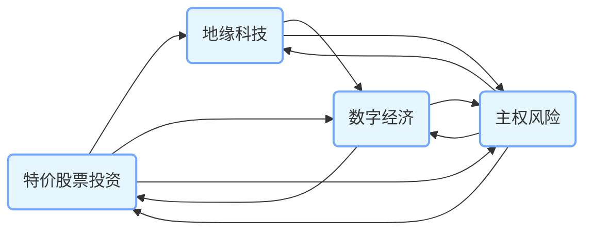

# 特价股票投资中的地缘科技与数字经济主权风险动态评估策略

> 关键词：特价股票投资、地缘科技、数字经济、主权风险、动态评估策略

> 摘要：本文聚焦于特价股票投资领域，深入探讨地缘科技与数字经济背景下主权风险的动态评估策略。在当今全球化和数字化的时代，地缘科技的发展以及数字经济的崛起对特价股票投资带来了新的机遇与挑战，主权风险的动态变化成为影响投资决策的关键因素。通过对相关核心概念的剖析、算法原理的阐述、数学模型的构建以及实际案例的分析，旨在为投资者提供一套科学、有效的主权风险动态评估方法，以降低投资风险，提高投资收益。

## 1. 背景介绍 
### 1.1 目的和范围
在全球经济格局不断演变的背景下，特价股票投资作为一种具有潜力的投资方式，吸引了众多投资者的关注。然而，地缘科技的快速发展和数字经济的蓬勃兴起，使得特价股票投资面临着更为复杂多变的主权风险。本研究的目的在于开发一套适用于特价股票投资的地缘科技与数字经济主权风险动态评估策略，帮助投资者更好地识别、评估和应对这些风险，从而做出更为明智的投资决策。研究范围涵盖了地缘科技和数字经济相关的各个领域，以及主权风险对特价股票投资的影响机制和评估方法。

### 1.2 预期读者
本文的预期读者包括从事特价股票投资的个人投资者、机构投资者、金融分析师、投资顾问等相关专业人士，以及对地缘科技、数字经济和主权风险研究感兴趣的学者和研究人员。

### 1.3 文档结构概述
本文将按照以下结构展开：首先介绍背景信息，包括研究目的、预期读者和文档结构概述；接着阐述核心概念与联系，明确相关术语和概念的内涵，并通过示意图和流程图展示其相互关系；然后详细讲解核心算法原理和具体操作步骤，结合 Python 源代码进行说明；再给出数学模型和公式，并通过举例进行详细讲解；之后通过项目实战，展示代码实际案例并进行详细解释说明；接着探讨实际应用场景；推荐相关的工具和资源；最后总结未来发展趋势与挑战，提供常见问题与解答，并列出扩展阅读和参考资料。

### 1.4 术语表
#### 1.4.1 核心术语定义
- **特价股票投资**：指投资者以相对较低的价格购买具有潜在价值的股票，期望在未来股票价格上涨时获得收益的投资行为。
- **地缘科技**：指受地理位置、政治、文化等因素影响的科技发展和应用，包括但不限于特定地区的科技创新、科技政策、科技产业布局等。
- **数字经济**：指以数字化的知识和信息作为关键生产要素，以现代信息网络作为重要载体，以信息通信技术的有效使用作为效率提升和经济结构优化的重要推动力的一系列经济活动。
- **主权风险**：指一个国家由于政治、经济、社会等方面的原因，可能导致其无法履行债务或对外国投资者的资产造成损失的风险。
- **动态评估策略**：指根据市场环境、地缘政治、经济形势等因素的变化，实时调整评估方法和指标体系，以准确评估风险的策略。

#### 1.4.2 相关概念解释
- **地缘政治风险**：指由于地缘政治因素（如领土争端、国际关系紧张等）导致的风险，可能对特价股票投资产生负面影响。
- **数字经济安全**：指保障数字经济系统的正常运行和数据安全，防止数字经济活动受到攻击、破坏或泄露的能力。
- **投资组合**：指投资者将资金分散投资于不同的股票、债券、基金等资产，以降低风险、提高收益的投资方式。

#### 1.4.3 缩略词列表
- **GDP**：国内生产总值（Gross Domestic Product）
- **ICT**：信息通信技术（Information and Communication Technology）
- **AI**：人工智能（Artificial Intelligence）
- **IoT**：物联网（Internet of Things）

## 2. 核心概念与联系 
### 核心概念原理
#### 特价股票投资原理
特价股票投资的核心原理在于寻找被市场低估的股票，通过分析公司的基本面、财务状况、行业前景等因素，判断其内在价值是否高于当前市场价格。当投资者认为某只股票的内在价值被低估时，就会选择买入该股票，等待其价格回归内在价值，从而获得投资收益。

#### 地缘科技原理
地缘科技的发展受到地理位置、政治、文化等多种因素的影响。不同地区由于资源禀赋、科技基础、政策支持等方面的差异，会形成不同的科技发展模式和产业布局。地缘科技的发展不仅影响着当地的经济增长和竞争力，也会对全球科技格局产生重要影响。

#### 数字经济原理
数字经济以数字化的知识和信息作为关键生产要素，通过现代信息网络和信息通信技术的应用，实现生产、流通、消费等各个环节的数字化和智能化。数字经济的发展促进了产业升级和创新，提高了生产效率和经济效益，同时也带来了新的商业模式和就业机会。

#### 主权风险原理
主权风险主要源于一个国家的政治、经济、社会等方面的不稳定因素。政治风险包括政治体制变革、政治冲突、政策不确定性等；经济风险包括经济衰退、通货膨胀、债务危机等；社会风险包括社会动荡、恐怖主义、自然灾害等。主权风险的存在可能导致一个国家无法按时偿还债务、实施资本管制、没收外国投资者资产等，从而给投资者带来损失。

### 架构的文本示意图
特价股票投资、地缘科技、数字经济和主权风险之间存在着复杂的相互关系。地缘科技的发展影响着数字经济的布局和发展，数字经济的发展又对特价股票投资的行业选择和企业价值评估产生影响。同时，主权风险作为一个综合性的风险因素，贯穿于整个投资过程中，对特价股票投资的收益和风险产生重要影响。可以用以下文本示意图表示：

特价股票投资
|
|-- 受地缘科技影响（科技发展水平、产业布局等）
|-- 受数字经济影响（数字化转型、新兴产业发展等）
|-- 受主权风险影响（政治、经济、社会等方面的不稳定因素）

地缘科技
|
|-- 影响数字经济发展（提供技术支持、促进产业升级等）
|-- 影响主权风险（科技实力对国家竞争力和稳定性的影响）

数字经济
|
|-- 影响特价股票投资（创造新的投资机会、改变企业估值方法等）
|-- 受主权风险影响（政策支持、数据安全等方面的风险）

主权风险
|
|-- 影响特价股票投资（投资环境、资产安全等方面的风险）
|-- 影响地缘科技和数字经济发展（政策不确定性、社会不稳定等因素的影响）

### Mermaid 流程图


## 3. 核心算法原理 & 具体操作步骤 
### 核心算法原理
本研究采用多因素综合评估算法来动态评估特价股票投资中的地缘科技与数字经济主权风险。该算法综合考虑了地缘科技、数字经济和主权风险的多个因素，通过构建指标体系，对每个因素进行量化评估，并根据各因素的权重计算综合风险得分。具体步骤如下：

1. **指标体系构建**：根据地缘科技、数字经济和主权风险的特点，选取相关的指标，构建指标体系。
2. **数据收集与预处理**：收集各指标的相关数据，并进行清洗、标准化等预处理操作，以确保数据的准确性和可比性。
3. **指标权重确定**：采用层次分析法（AHP）或熵权法等方法确定各指标的权重，以反映各因素在综合风险评估中的重要程度。
4. **风险得分计算**：根据各指标的实际值和权重，计算每个因素的风险得分，并将各因素的风险得分加权求和，得到综合风险得分。
5. **风险等级划分**：根据综合风险得分，将风险划分为不同的等级，如低风险、中风险、高风险等，以便投资者进行决策。

### 具体操作步骤及 Python 源代码
以下是一个简化的示例，展示了如何使用 Python 实现多因素综合评估算法：

```python
import numpy as np

# 指标体系
indicators = ['地缘科技发展水平', '数字经济规模', '政治稳定性', '经济增长率', '债务水平']

# 数据收集与预处理（示例数据）
data = np.array([
    [0.8, 0.7, 0.9, 0.6, 0.5],  # 国家 1 的指标值
    [0.6, 0.8, 0.7, 0.5, 0.6],  # 国家 2 的指标值
    [0.7, 0.6, 0.8, 0.4, 0.7]   # 国家 3 的指标值
])

# 指标权重确定（示例权重）
weights = np.array([0.2, 0.2, 0.2, 0.2, 0.2])

# 风险得分计算
risk_scores = np.dot(data, weights)

# 风险等级划分
risk_levels = []
for score in risk_scores:
    if score < 0.6:
        risk_levels.append('低风险')
    elif score < 0.8:
        risk_levels.append('中风险')
    else:
        risk_levels.append('高风险')

# 输出结果
for i in range(len(risk_scores)):
    print(f'国家 {i + 1} 的综合风险得分: {risk_scores[i]:.2f}, 风险等级: {risk_levels[i]}')
```

### 代码解释
1. **指标体系**：定义了一个包含 5 个指标的指标体系，分别反映地缘科技、数字经济和主权风险的不同方面。
2. **数据收集与预处理**：使用示例数据表示不同国家的指标值，并将其存储在一个二维数组中。
3. **指标权重确定**：使用示例权重表示各指标在综合风险评估中的重要程度，将其存储在一个一维数组中。
4. **风险得分计算**：使用 `np.dot()` 函数计算每个国家的综合风险得分，即将各指标值与对应的权重相乘并求和。
5. **风险等级划分**：根据综合风险得分，将风险划分为低风险、中风险和高风险三个等级，并将结果存储在一个列表中。
6. **输出结果**：遍历每个国家的综合风险得分和风险等级，并将其打印输出。

## 4. 数学模型和公式 & 详细讲解 & 举例说明 
### 数学模型
多因素综合评估算法的数学模型可以表示为：

$$R = \sum_{i=1}^{n} w_i \times x_i$$

其中，$R$ 表示综合风险得分，$w_i$ 表示第 $i$ 个指标的权重，$x_i$ 表示第 $i$ 个指标的实际值，$n$ 表示指标的个数。

### 详细讲解
该数学模型的核心思想是将各指标的实际值与其对应的权重相乘，并将结果相加，得到综合风险得分。权重的确定是该模型的关键，它反映了各因素在综合风险评估中的重要程度。在实际应用中，可以采用层次分析法（AHP）、熵权法等方法来确定权重。

### 举例说明
假设我们要评估一个国家的主权风险，选取了以下 3 个指标：政治稳定性（$x_1$）、经济增长率（$x_2$）、债务水平（$x_3$），对应的权重分别为 $w_1 = 0.4$，$w_2 = 0.3$，$w_3 = 0.3$。该国家的各指标实际值分别为 $x_1 = 0.8$，$x_2 = 0.6$，$x_3 = 0.7$。则该国家的综合风险得分 $R$ 为：

$$R = w_1 \times x_1 + w_2 \times x_2 + w_3 \times x_3$$
$$= 0.4 \times 0.8 + 0.3 \times 0.6 + 0.3 \times 0.7$$
$$= 0.32 + 0.18 + 0.21$$
$$= 0.71$$

根据风险等级划分标准，该国家的风险等级为中风险。

## 5. 项目实战：代码实际案例和详细解释说明 
### 5.1  开发环境搭建
#### 安装 Python
首先，需要安装 Python 开发环境。可以从 Python 官方网站（https://www.python.org/downloads/） 下载适合自己操作系统的 Python 安装包，并按照安装向导进行安装。

#### 安装必要的库
在项目中，需要使用一些 Python 库来进行数据处理、计算和可视化等操作。可以使用以下命令安装这些库：

```sh
pip install numpy pandas matplotlib
```

### 5.2  源代码详细实现和代码解读
以下是一个完整的项目实战代码示例，展示了如何使用多因素综合评估算法来动态评估特价股票投资中的地缘科技与数字经济主权风险：

```python
import numpy as np
import pandas as pd
import matplotlib.pyplot as plt

# 指标体系
indicators = ['地缘科技发展水平', '数字经济规模', '政治稳定性', '经济增长率', '债务水平']

# 数据收集与预处理
def load_data(file_path):
    data = pd.read_csv(file_path)
    # 数据清洗和标准化
    data = data.dropna()  # 去除缺失值
    data = (data - data.mean()) / data.std()  # 标准化处理
    return data.values

# 指标权重确定（使用熵权法）
def entropy_weight(data):
    n, m = data.shape
    p = data / np.sum(data, axis=0)
    e = -np.sum(p * np.log(p + 1e-8), axis=0) / np.log(n)
    w = (1 - e) / np.sum(1 - e)
    return w

# 风险得分计算
def calculate_risk_scores(data, weights):
    return np.dot(data, weights)

# 风险等级划分
def classify_risk_levels(scores):
    levels = []
    for score in scores:
        if score < 0.6:
            levels.append('低风险')
        elif score < 0.8:
            levels.append('中风险')
        else:
            levels.append('高风险')
    return levels

# 主函数
def main():
    # 加载数据
    file_path = 'data.csv'
    data = load_data(file_path)
    
    # 确定指标权重
    weights = entropy_weight(data)
    
    # 计算风险得分
    risk_scores = calculate_risk_scores(data, weights)
    
    # 划分风险等级
    risk_levels = classify_risk_levels(risk_scores)
    
    # 输出结果
    for i in range(len(risk_scores)):
        print(f'国家 {i + 1} 的综合风险得分: {risk_scores[i]:.2f}, 风险等级: {risk_levels[i]}')
    
    # 可视化结果
    plt.bar(range(len(risk_scores)), risk_scores)
    plt.xlabel('国家')
    plt.ylabel('综合风险得分')
    plt.title('特价股票投资中的地缘科技与数字经济主权风险评估')
    plt.xticks(range(len(risk_scores)), [f'国家 {i + 1}' for i in range(len(risk_scores))])
    plt.show()

if __name__ == '__main__':
    main()
```

### 5.3  代码解读与分析
1. **数据加载与预处理**：`load_data()` 函数用于加载数据，并进行数据清洗和标准化处理。数据清洗主要是去除缺失值，标准化处理是将数据转换为均值为 0，标准差为 1 的数据，以确保数据的可比性。
2. **指标权重确定**：`entropy_weight()` 函数使用熵权法来确定各指标的权重。熵权法是一种客观赋权法，它根据指标的变异程度来确定权重，变异程度越大的指标，其权重越高。
3. **风险得分计算**：`calculate_risk_scores()` 函数根据各指标的实际值和权重，计算每个国家的综合风险得分。
4. **风险等级划分**：`classify_risk_levels()` 函数根据综合风险得分，将风险划分为低风险、中风险和高风险三个等级。
5. **主函数**：`main()` 函数是程序的入口，它依次调用上述函数，完成数据加载、权重确定、风险得分计算、风险等级划分等操作，并将结果输出和可视化。

## 6. 实际应用场景 
### 投资者决策参考
对于个人投资者和机构投资者来说，在进行特价股票投资时，可以使用本研究提出的动态评估策略来评估不同国家和地区的主权风险。通过对地缘科技、数字经济等因素的综合分析，投资者可以更好地了解投资环境，识别潜在的风险和机会，从而做出更为明智的投资决策。

### 金融机构风险管理
金融机构在进行国际业务和投资时，面临着各种主权风险。本研究的动态评估策略可以帮助金融机构建立完善的风险管理体系，对不同国家和地区的主权风险进行实时监测和评估，及时采取风险控制措施，降低潜在的损失。

### 政府政策制定
政府在制定科技政策、经济政策和投资政策时，可以参考本研究的动态评估策略，了解地缘科技和数字经济的发展趋势，评估主权风险对经济发展的影响，从而制定出更加科学、合理的政策，促进经济的稳定增长和可持续发展。

## 7. 工具和资源推荐
### 7.1 学习资源推荐
#### 7.1.1 书籍推荐
- 《投资学》（作者：滋维·博迪等）：系统介绍了投资的基本理论、方法和策略，对股票投资、风险管理等方面有深入的阐述。
- 《数字经济：从概念到实践》（作者：陈劲等）：全面介绍了数字经济的概念、发展趋势和应用案例，有助于读者了解数字经济的本质和特点。
- 《地缘政治与国际经济》（作者：王正毅等）：探讨了地缘政治因素对国际经济和投资的影响，为理解地缘科技和主权风险提供了理论基础。

#### 7.1.2 在线课程
- Coursera 平台上的“投资原理”课程：由知名教授授课，系统讲解投资的基本原理和方法。
- edX 平台上的“数字经济与创新”课程：介绍数字经济的发展趋势和创新模式，以及如何在数字经济时代进行创新和创业。
- Udemy 平台上的“地缘政治分析与投资决策”课程：讲解地缘政治因素对投资决策的影响，以及如何运用地缘政治分析方法进行投资决策。

#### 7.1.3 技术博客和网站
- 雪球网：提供股票投资的资讯、分析和交流平台，有很多投资者分享自己的投资经验和观点。
- 艾瑞咨询网：专注于数字经济领域的研究和咨询，提供数字经济的行业报告、研究成果和趋势分析。
- 外交学院官网：发布地缘政治和国际关系方面的研究成果和专家观点，有助于了解地缘政治的最新动态。

### 7.2 开发工具框架推荐
#### 7.2.1 IDE和编辑器
- PyCharm：一款功能强大的 Python 集成开发环境，提供代码编辑、调试、版本控制等功能，适合专业的 Python 开发者使用。
- Visual Studio Code：一款轻量级的代码编辑器，支持多种编程语言，具有丰富的插件生态系统，可以根据需要进行定制。

#### 7.2.2 调试和性能分析工具
- pdb：Python 自带的调试工具，可以在代码中设置断点，逐步执行代码，查看变量的值和程序的执行流程。
- cProfile：Python 自带的性能分析工具，可以分析代码的运行时间和函数调用次数，帮助开发者找出性能瓶颈。

#### 7.2.3 相关框架和库
- NumPy：用于科学计算的 Python 库，提供了高效的数组操作和数学函数，是数据处理和计算的基础库。
- Pandas：用于数据处理和分析的 Python 库，提供了数据结构和数据操作方法，方便进行数据清洗、转换和分析。
- Matplotlib：用于数据可视化的 Python 库，提供了各种绘图函数和工具，能够创建高质量的图表和可视化效果。

### 7.3 相关论文著作推荐
#### 7.3.1 经典论文
- “The Determinants of Sovereign Risk: A Literature Review”（作者：Aizenman, J. 等）：对主权风险的影响因素进行了全面的文献综述，为研究主权风险提供了理论基础。
- “Digital Economy and Economic Growth: A Theoretical and Empirical Analysis”（作者：Brynjolfsson, E. 等）：探讨了数字经济对经济增长的影响机制和实证研究，为理解数字经济的经济效应提供了参考。
- “Geopolitical Risk and Stock Market Returns”（作者：Baker, S. R. 等）：研究了地缘政治风险对股票市场收益率的影响，为分析地缘政治因素对投资的影响提供了实证证据。

#### 7.3.2 最新研究成果
- 国际货币基金组织（IMF）发布的《全球金融稳定报告》：定期对全球金融市场和主权风险进行评估和分析，提供最新的研究成果和政策建议。
- 世界银行发布的《世界发展报告》：关注全球经济发展的趋势和挑战，对数字经济、地缘政治等领域的研究有重要的参考价值。

#### 7.3.3 应用案例分析
- 麦肯锡公司发布的《数字经济转型案例集》：收集了全球各地企业和政府在数字经济转型方面的成功案例，为实际应用提供了借鉴和参考。
- 摩根大通银行发布的《主权风险评估案例分析》：通过实际案例分析，介绍了主权风险评估的方法和应用，对投资者和金融机构有重要的指导意义。

## 8. 总结：未来发展趋势与挑战
### 未来发展趋势
- **科技融合加速**：地缘科技与数字经济的融合将越来越深入，新兴技术如人工智能、物联网、区块链等将在更多领域得到应用，推动数字经济的快速发展，也为特价股票投资带来更多的机遇和挑战。
- **数据驱动决策**：随着大数据、云计算等技术的发展，投资者将越来越依赖数据来进行决策。动态评估策略将更加注重数据的收集、分析和挖掘，以提高风险评估的准确性和及时性。
- **国际合作加强**：在全球化的背景下，各国之间的经济联系和科技合作将更加紧密。投资者和金融机构将更加注重国际合作，共同应对地缘科技和数字经济带来的主权风险。

### 挑战
- **数据质量和安全**：数据是动态评估策略的基础，但数据的质量和安全问题仍然是一个挑战。如何确保数据的准确性、完整性和安全性，是需要解决的关键问题。
- **模型的准确性和适应性**：多因素综合评估算法虽然能够考虑多个因素的影响，但模型的准确性和适应性仍然有待提高。如何根据不同的市场环境和投资需求，调整模型的参数和指标体系，是需要进一步研究的问题。
- **地缘政治不确定性**：地缘政治因素的不确定性是主权风险的重要来源之一。如何准确预测和应对地缘政治风险，是投资者和金融机构面临的巨大挑战。

## 9. 附录：常见问题与解答
### 问题 1：如何选择合适的指标来构建指标体系？
答：选择合适的指标需要综合考虑地缘科技、数字经济和主权风险的特点和影响因素。可以参考相关的研究文献、行业报告和专家意见，结合实际投资需求和数据可用性，选择具有代表性和可操作性的指标。同时，需要对指标进行相关性分析和筛选，避免指标之间的冗余和冲突。

### 问题 2：如何确定指标的权重？
答：确定指标权重的方法有很多种，常见的有层次分析法（AHP）、熵权法、主成分分析法等。层次分析法是一种主观赋权法，通过专家打分来确定指标的权重；熵权法是一种客观赋权法，根据指标的变异程度来确定权重；主成分分析法是一种数据驱动的方法，通过对数据进行降维处理来确定指标的权重。在实际应用中，可以根据具体情况选择合适的方法，也可以将多种方法结合使用。

### 问题 3：动态评估策略需要多久更新一次？
答：动态评估策略的更新频率取决于市场环境、地缘政治、经济形势等因素的变化情况。一般来说，可以根据投资周期和风险偏好，定期（如每月、每季度、每年）对评估策略进行更新和调整。同时，在遇到重大事件或市场波动时，需要及时对评估策略进行调整，以确保其有效性和准确性。

### 问题 4：如何验证动态评估策略的有效性？
答：可以通过以下方法来验证动态评估策略的有效性：
- **历史数据回测**：使用历史数据对动态评估策略进行回测，比较策略的预测结果与实际情况的差异，评估策略的准确性和可靠性。
- **模拟交易**：在模拟交易环境中使用动态评估策略进行投资操作，观察策略的表现和收益情况，评估策略的实用性和有效性。
- **实际应用验证**：在实际投资中使用动态评估策略，并与其他投资策略进行比较，观察策略的实际效果和收益情况，评估策略的优势和不足。

## 10. 扩展阅读 & 参考资料
### 扩展阅读
- 《金融风险管理》（作者：约翰·赫尔）：系统介绍了金融风险管理的理论、方法和实践，对主权风险、市场风险、信用风险等方面有深入的阐述。
- 《数字经济时代的创新与创业》（作者：黄群慧等）：探讨了数字经济时代的创新模式和创业机会，以及如何在数字经济背景下进行创新和创业。
- 《地缘政治与大国战略》（作者：时殷弘）：分析了地缘政治因素对大国战略和国际关系的影响，为理解地缘政治的本质和作用提供了理论支持。

### 参考资料
- 国际货币基金组织（IMF）官网：https://www.imf.org/
- 世界银行官网：https://www.worldbank.org/
- 联合国贸易和发展会议（UNCTAD）官网：https://unctad.org/
- 艾瑞咨询官网：https://www.iresearch.com.cn/
- 外交学院官网：https://www.cfau.edu.cn/