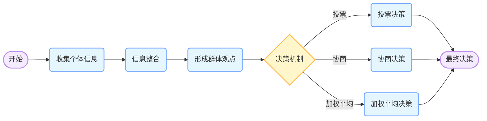

# 特价股票投资中的群体智慧与集体决策方法

> 关键词：特价股票、群体智慧、集体决策、投资策略、市场分析

> 摘要：本文聚焦于特价股票投资领域，深入探讨群体智慧与集体决策方法在其中的应用。首先介绍了相关背景知识，包括研究目的、预期读者等。接着阐述核心概念，剖析群体智慧与集体决策在特价股票投资中的原理和联系，并通过Mermaid流程图展示其架构。详细讲解了核心算法原理及具体操作步骤，辅以Python源代码进行说明。运用数学模型和公式对投资过程进行量化分析，并举例说明。通过项目实战，展示代码实际案例并进行详细解释。探讨了该方法在实际中的应用场景，推荐了相关学习资源、开发工具和论文著作。最后总结未来发展趋势与挑战，提供常见问题解答及扩展阅读参考资料，旨在为投资者提供全面、深入的特价股票投资中群体智慧与集体决策方法的指导。

## 1. 背景介绍 
### 1.1 目的和范围
在股票投资市场中，特价股票因其价格相对较低，往往吸引众多投资者的关注。然而，特价股票市场波动较大，投资风险也相对较高。本研究的目的在于探索如何运用群体智慧和集体决策方法来优化特价股票投资策略，降低投资风险，提高投资回报率。研究范围涵盖了群体智慧和集体决策的基本理论、相关算法、数学模型，以及在特价股票投资中的实际应用案例。

### 1.2 预期读者
本文预期读者包括对股票投资有兴趣的个人投资者、金融机构的投资分析师、从事金融科技研究的科研人员以及相关专业的学生。希望通过本文的阐述，能为不同层次的读者提供有关特价股票投资中群体智慧与集体决策方法的知识和实践指导。

### 1.3 文档结构概述
本文首先介绍背景知识，包括研究目的、预期读者和文档结构。接着阐述核心概念与联系，包括群体智慧和集体决策的原理及架构。然后详细讲解核心算法原理和具体操作步骤，结合Python源代码进行说明。随后运用数学模型和公式对投资过程进行量化分析，并举例说明。通过项目实战展示代码实际案例并进行详细解释。探讨实际应用场景，推荐相关学习资源、开发工具和论文著作。最后总结未来发展趋势与挑战，提供常见问题解答及扩展阅读参考资料。

### 1.4 术语表
#### 1.4.1 核心术语定义
- **特价股票**：指价格相对较低，通常低于市场平均估值的股票。这类股票可能由于公司业绩暂时不佳、行业周期波动或市场情绪等因素导致价格被低估。
- **群体智慧**：是指由多个个体组成的群体所表现出的智能和决策能力。在股票投资中，群体智慧可以通过众多投资者的观点、分析和交易行为来体现。
- **集体决策**：是指由多个决策者共同参与，通过协商、投票等方式做出的决策。在特价股票投资中，集体决策可以综合多个投资者的意见，减少个体决策的偏差和风险。

#### 1.4.2 相关概念解释
- **市场情绪**：是指投资者对市场的整体看法和预期，它会影响投资者的交易行为和股票价格。市场情绪可以分为乐观、悲观和中性等不同状态。
- **估值模型**：是用于评估股票内在价值的数学模型。常见的估值模型包括市盈率模型、市净率模型、现金流折现模型等。

#### 1.4.3 缩略词列表
- **PE**：市盈率（Price-to-Earnings Ratio），是指股票价格与每股收益的比率，用于衡量股票的估值水平。
- **PB**：市净率（Price-to-Book Ratio），是指股票价格与每股净资产的比率，用于衡量股票的估值水平。
- **DCF**：现金流折现模型（Discounted Cash Flow Model），是一种基于未来现金流折现的估值模型。

## 2. 核心概念与联系 

### 2.1 群体智慧原理
群体智慧的核心思想是，多个个体的知识、经验和观点的集合可以产生比单个个体更准确、更全面的决策。在特价股票投资中，不同的投资者可能基于不同的信息来源、分析方法和投资经验对特价股票进行评估。例如，有些投资者擅长基本面分析，关注公司的财务状况、行业前景等；有些投资者擅长技术分析，关注股票的价格走势、成交量等。通过集合这些不同投资者的观点，可以更全面地了解特价股票的投资价值。

### 2.2 集体决策原理
集体决策是通过一定的决策机制，将多个投资者的意见整合为一个最终的决策。常见的集体决策机制包括投票、协商、加权平均等。在特价股票投资中，集体决策可以避免单个投资者的主观偏见和情绪影响，提高决策的客观性和准确性。例如，在决定是否投资某只特价股票时，可以让多个投资者进行投票，根据投票结果做出决策。

### 2.3 群体智慧与集体决策的联系
群体智慧是集体决策的基础，集体决策是群体智慧的实现方式。通过收集和整合群体智慧，可以为集体决策提供更多的信息和依据；而集体决策则可以将群体智慧转化为实际的投资决策。两者相互依存、相互促进，共同提高特价股票投资的效果。

### 2.4 核心概念架构的文本示意图
```plaintext
群体智慧
|-- 个体信息（基本面分析、技术分析等）
|-- 信息整合（数据挖掘、机器学习等）
|-- 群体观点

集体决策
|-- 决策机制（投票、协商、加权平均等）
|-- 最终决策

群体智慧与集体决策的联系
|-- 群体智慧为集体决策提供信息
|-- 集体决策实现群体智慧的价值
```

### 2.5 Mermaid流程图


## 3. 核心算法原理 & 具体操作步骤 

### 3.1 核心算法原理
在特价股票投资中，我们可以使用基于机器学习的算法来整合群体智慧，进行集体决策。这里以支持向量机（SVM）算法为例进行说明。

支持向量机是一种有监督的机器学习算法，它的基本思想是在特征空间中找到一个最优的超平面，将不同类别的样本分开。在特价股票投资中，我们可以将股票的各种特征（如市盈率、市净率、营业收入增长率等）作为输入，将股票的投资评级（如买入、持有、卖出）作为输出，使用支持向量机算法进行训练和预测。

### 3.2 具体操作步骤
1. **数据收集**：收集特价股票的相关数据，包括基本面数据（如财务报表数据）、技术面数据（如价格走势数据）和市场情绪数据（如投资者情绪指数）等。
2. **数据预处理**：对收集到的数据进行清洗、归一化等预处理操作，以提高数据的质量和可用性。
3. **特征选择**：从预处理后的数据中选择与股票投资价值相关的特征，作为支持向量机算法的输入。
4. **模型训练**：使用历史数据对支持向量机模型进行训练，调整模型的参数，以提高模型的预测准确率。
5. **模型预测**：使用训练好的模型对新的特价股票数据进行预测，得到股票的投资评级。
6. **集体决策**：根据多个投资者对模型预测结果的意见，通过投票、协商等决策机制做出最终的投资决策。

### 3.3 Python源代码详细阐述
```python
import pandas as pd
from sklearn.svm import SVC
from sklearn.model_selection import train_test_split
from sklearn.preprocessing import StandardScaler
from sklearn.metrics import accuracy_score

# 数据收集
data = pd.read_csv('special_stock_data.csv')

# 数据预处理
# 分离特征和标签
X = data.drop('investment_rating', axis=1)
y = data['investment_rating']

# 数据归一化
scaler = StandardScaler()
X_scaled = scaler.fit_transform(X)

# 特征选择（这里简单选择所有特征）
selected_features = X_scaled

# 划分训练集和测试集
X_train, X_test, y_train, y_test = train_test_split(selected_features, y, test_size=0.2, random_state=42)

# 模型训练
model = SVC(kernel='rbf', C=1.0, random_state=42)
model.fit(X_train, y_train)

# 模型预测
y_pred = model.predict(X_test)

# 模型评估
accuracy = accuracy_score(y_test, y_pred)
print(f"模型预测准确率: {accuracy}")

# 集体决策示例（简单投票）
investor_opinions = [model.predict([new_stock_data])[0] for _ in range(10)]
vote_result = max(set(investor_opinions), key=investor_opinions.count)
print(f"集体决策结果: {vote_result}")
```

## 4. 数学模型和公式 & 详细讲解 & 举例说明 

### 4.1 支持向量机数学模型
支持向量机的目标是在特征空间中找到一个最优的超平面，使得不同类别的样本能够被最大程度地分开。对于线性可分的情况，支持向量机的数学模型可以表示为：

$$\min_{\mathbf{w},b} \frac{1}{2} \|\mathbf{w}\|^2$$

$$\text{s.t. } y_i(\mathbf{w}^T \mathbf{x}_i + b) \geq 1, \quad i = 1,2,\cdots,n$$

其中，$\mathbf{w}$ 是超平面的法向量，$b$ 是超平面的偏移量，$\mathbf{x}_i$ 是第 $i$ 个样本的特征向量，$y_i$ 是第 $i$ 个样本的标签（$y_i \in \{-1, +1\}$），$n$ 是样本的数量。

### 4.2 详细讲解
上述数学模型的目标是最小化 $\frac{1}{2} \|\mathbf{w}\|^2$，这等价于最大化不同类别的样本到超平面的间隔。约束条件 $y_i(\mathbf{w}^T \mathbf{x}_i + b) \geq 1$ 保证了所有样本都被正确分类，并且到超平面的距离不小于 1。

对于线性不可分的情况，可以引入松弛变量 $\xi_i$，将数学模型修改为：

$$\min_{\mathbf{w},b,\xi} \frac{1}{2} \|\mathbf{w}\|^2 + C \sum_{i=1}^{n} \xi_i$$

$$\text{s.t. } y_i(\mathbf{w}^T \mathbf{x}_i + b) \geq 1 - \xi_i, \quad \xi_i \geq 0, \quad i = 1,2,\cdots,n$$

其中，$C$ 是惩罚参数，用于控制分类误差和间隔大小之间的平衡。

### 4.3 举例说明
假设有一个二维特征空间，有两个类别的样本点，分别用蓝色和红色表示。支持向量机的目标是找到一个最优的超平面（一条直线），将这两个类别的样本点分开，并且使得两个类别到超平面的间隔最大。

例如，给定以下样本点：

- 类别 1：$(1, 1), (2, 2), (3, 3)$
- 类别 -1：$( -1, -1), (-2, -2), (-3, -3)$

我们可以使用支持向量机算法找到一个最优的超平面 $y = x$，将这两个类别的样本点分开。

## 5. 项目实战：代码实际案例和详细解释说明 

### 5.1  开发环境搭建
1. **安装Python**：从Python官方网站（https://www.python.org/downloads/）下载并安装Python 3.x版本。
2. **安装必要的库**：使用以下命令安装必要的Python库：
```sh
pip install pandas scikit-learn
```
3. **准备数据**：收集特价股票的相关数据，并保存为CSV文件，例如 `special_stock_data.csv`。

### 5.2  源代码详细实现和代码解读
```python
import pandas as pd
from sklearn.svm import SVC
from sklearn.model_selection import train_test_split
from sklearn.preprocessing import StandardScaler
from sklearn.metrics import accuracy_score

# 数据收集
data = pd.read_csv('special_stock_data.csv')

# 代码解读：使用pandas库的read_csv函数读取CSV文件，将数据存储在DataFrame对象中。

# 数据预处理
# 分离特征和标签
X = data.drop('investment_rating', axis=1)
y = data['investment_rating']

# 代码解读：使用DataFrame的drop方法删除目标列（投资评级），得到特征矩阵X；使用DataFrame的索引操作获取目标列，得到标签向量y。

# 数据归一化
scaler = StandardScaler()
X_scaled = scaler.fit_transform(X)

# 代码解读：使用StandardScaler类对特征矩阵进行归一化处理，使得每个特征的均值为0，标准差为1。

# 特征选择（这里简单选择所有特征）
selected_features = X_scaled

# 代码解读：由于这里简单选择所有特征，所以直接将归一化后的特征矩阵赋值给selected_features。

# 划分训练集和测试集
X_train, X_test, y_train, y_test = train_test_split(selected_features, y, test_size=0.2, random_state=42)

# 代码解读：使用train_test_split函数将特征矩阵和标签向量划分为训练集和测试集，测试集占总数据的20%。

# 模型训练
model = SVC(kernel='rbf', C=1.0, random_state=42)
model.fit(X_train, y_train)

# 代码解读：创建一个支持向量机分类器对象，使用径向基函数（RBF）作为核函数，惩罚参数C为1.0；使用fit方法对模型进行训练。

# 模型预测
y_pred = model.predict(X_test)

# 代码解读：使用训练好的模型对测试集进行预测，得到预测结果y_pred。

# 模型评估
accuracy = accuracy_score(y_test, y_pred)
print(f"模型预测准确率: {accuracy}")

# 代码解读：使用accuracy_score函数计算模型的预测准确率，并打印输出。

# 集体决策示例（简单投票）
new_stock_data = [1, 2, 3, 4, 5]  # 示例新股票数据
investor_opinions = [model.predict([new_stock_data])[0] for _ in range(10)]
vote_result = max(set(investor_opinions), key=investor_opinions.count)
print(f"集体决策结果: {vote_result}")

# 代码解读：定义一个示例新股票数据，模拟10个投资者对该股票的预测意见，使用简单投票的方式得到集体决策结果，并打印输出。
```

### 5.3  代码解读与分析
- **数据处理**：通过pandas库读取和处理数据，使用StandardScaler进行数据归一化，提高模型的训练效果。
- **模型训练**：使用支持向量机算法进行模型训练，通过调整核函数和惩罚参数等超参数，可以优化模型的性能。
- **模型评估**：使用准确率作为评估指标，衡量模型的预测能力。
- **集体决策**：通过简单投票的方式模拟集体决策过程，综合多个投资者的意见，得到最终的投资决策。

## 6. 实际应用场景 
### 6.1 个人投资者
个人投资者可以利用群体智慧和集体决策方法来优化自己的投资组合。通过参与投资社区或使用专业的投资分析工具，收集其他投资者的观点和分析，结合自己的判断，做出更明智的投资决策。例如，个人投资者可以参考投资社区中其他投资者对某只特价股票的分析和评级，再结合自己的基本面和技术分析，决定是否投资该股票。

### 6.2 金融机构
金融机构可以将群体智慧和集体决策方法应用于投资研究和资产管理中。通过收集和分析大量投资者的意见和交易数据，金融机构可以更准确地评估市场趋势和股票的投资价值，制定更合理的投资策略。例如，投资银行可以利用群体智慧和集体决策方法来筛选优质的特价股票，为客户提供投资建议；基金公司可以将其应用于基金的投资组合管理中，提高基金的收益率。

### 6.3 金融科技公司
金融科技公司可以开发基于群体智慧和集体决策的投资分析平台和工具，为投资者提供更智能、更个性化的投资服务。例如，金融科技公司可以利用大数据和人工智能技术，收集和分析投资者的行为数据和市场信息，为投资者提供实时的投资建议和风险评估；还可以开发基于区块链技术的投资决策平台，实现投资者之间的信息共享和集体决策。

## 7. 工具和资源推荐
### 7.1 学习资源推荐
#### 7.1.1 书籍推荐
- 《聪明的投资者》（The Intelligent Investor）：作者本杰明·格雷厄姆（Benjamin Graham），被誉为投资界的圣经，介绍了价值投资的基本原理和方法。
- 《金融炼金术》（The Alchemy of Finance）：作者乔治·索罗斯（George Soros），阐述了索罗斯的反身性理论和投资哲学。
- 《机器学习》（Machine Learning）：作者周志华，是机器学习领域的经典教材，介绍了机器学习的基本概念、算法和应用。

#### 7.1.2 在线课程
- Coursera上的“Machine Learning”课程：由斯坦福大学的Andrew Ng教授主讲，是机器学习领域的经典在线课程。
- edX上的“Financial Markets”课程：由耶鲁大学的Robert Shiller教授主讲，介绍了金融市场的基本原理和运行机制。
- 中国大学MOOC上的“投资学”课程：由国内知名高校的教授主讲，介绍了投资学的基本理论和方法。

#### 7.1.3 技术博客和网站
- Medium：是一个技术博客平台，有很多关于金融科技、机器学习和投资的优质文章。
- Seeking Alpha：是一个金融投资网站，提供股票分析、市场评论和投资建议等内容。
- 雪球：是国内知名的投资社区，有很多投资者分享自己的投资经验和观点。

### 7.2 开发工具框架推荐
#### 7.2.1 IDE和编辑器
- PyCharm：是一款专门为Python开发设计的集成开发环境，具有代码编辑、调试、版本控制等功能。
- Jupyter Notebook：是一个交互式的开发环境，适合进行数据探索、模型训练和结果展示。
- Visual Studio Code：是一款轻量级的代码编辑器，支持多种编程语言和插件扩展。

#### 7.2.2 调试和性能分析工具
- pdb：是Python的内置调试工具，可以帮助开发者定位和解决代码中的问题。
- cProfile：是Python的性能分析工具，可以帮助开发者分析代码的性能瓶颈。
- TensorBoard：是TensorFlow的可视化工具，可以帮助开发者可视化模型的训练过程和结果。

#### 7.2.3 相关框架和库
- pandas：是Python的数据分析库，提供了高效的数据结构和数据处理工具。
- scikit-learn：是Python的机器学习库，提供了丰富的机器学习算法和工具。
- TensorFlow：是Google开发的深度学习框架，支持大规模的深度学习模型训练和部署。

### 7.3 相关论文著作推荐
#### 7.3.1 经典论文
- “The Wisdom of Crowds”（群体的智慧）：作者James Surowiecki，阐述了群体智慧的基本原理和应用。
- “Efficient Capital Markets: A Review of Theory and Empirical Work”（有效资本市场：理论与实证研究综述）：作者Eugene F. Fama，是有效市场假说的经典论文。
- “Support-Vector Networks”（支持向量网络）：作者Corinna Cortes和Vapnik，介绍了支持向量机的基本原理和算法。

#### 7.3.2 最新研究成果
- 关注顶级金融和计算机科学期刊，如Journal of Finance、Journal of Financial Economics、Artificial Intelligence等，获取关于群体智慧、集体决策和股票投资的最新研究成果。
- 参加国际金融和计算机科学会议，如ACM SIGKDD、NeurIPS、ICML等，了解相关领域的最新研究动态。

#### 7.3.3 应用案例分析
- 研究金融机构和金融科技公司的实际应用案例，了解群体智慧和集体决策方法在特价股票投资中的具体应用和效果。
- 分析成功和失败的投资案例，总结经验教训，为自己的投资决策提供参考。

## 8. 总结：未来发展趋势与挑战
### 8.1 未来发展趋势
- **智能化发展**：随着人工智能和机器学习技术的不断发展，群体智慧和集体决策方法将更加智能化。例如，利用深度学习算法可以更准确地分析投资者的行为数据和市场信息，提供更智能的投资建议和决策支持。
- **多元化应用**：群体智慧和集体决策方法将不仅仅应用于股票投资领域，还将拓展到其他金融领域，如债券投资、基金投资、风险管理等。同时，也将在其他行业中得到应用，如医疗、教育、交通等。
- **区块链技术的应用**：区块链技术的去中心化、不可篡改和可追溯等特点，将为群体智慧和集体决策提供更安全、更可靠的技术支持。例如，利用区块链技术可以实现投资者之间的信息共享和集体决策，提高决策的透明度和公正性。

### 8.2 挑战
- **数据质量和隐私问题**：群体智慧和集体决策方法依赖于大量的数据，但数据的质量和隐私问题是一个挑战。例如，数据可能存在噪声、缺失值和错误，影响模型的训练效果；同时，投资者的个人信息和交易数据需要得到保护，防止泄露和滥用。
- **算法的可解释性**：人工智能和机器学习算法通常是黑盒模型，难以解释其决策过程和结果。在股票投资中，投资者需要了解决策的依据和风险，因此算法的可解释性是一个重要的挑战。
- **市场的不确定性**：股票市场是一个复杂的系统，受到多种因素的影响，如宏观经济环境、政策变化、公司业绩等。市场的不确定性增加了群体智慧和集体决策的难度，需要不断优化算法和模型，提高决策的准确性和可靠性。

## 9. 附录：常见问题与解答
### 9.1 群体智慧一定比个体决策更准确吗？
群体智慧并不一定比个体决策更准确。群体智慧的有效性取决于多个因素，如群体的规模、多样性、信息的准确性和完整性等。如果群体中的个体缺乏足够的知识和经验，或者信息存在偏差和错误，群体智慧可能会产生错误的决策。因此，在应用群体智慧时，需要确保群体的质量和信息的可靠性。

### 9.2 如何选择合适的集体决策机制？
选择合适的集体决策机制需要考虑多个因素，如决策的性质、时间限制、参与者的数量和特点等。例如，对于简单的决策问题，可以采用投票的方式；对于复杂的决策问题，需要进行协商和讨论，以充分听取各方的意见。同时，还可以根据参与者的专业知识和经验，采用加权平均等方式进行决策。

### 9.3 支持向量机算法在特价股票投资中的效果如何？
支持向量机算法在特价股票投资中的效果取决于多个因素，如数据的质量、特征的选择、模型的参数等。在实际应用中，需要对数据进行充分的预处理和特征工程，选择合适的模型参数，以提高模型的预测准确率。同时，还可以结合其他算法和方法，如神经网络、随机森林等，进行综合分析和决策。

## 10. 扩展阅读 & 参考资料
### 10.1 扩展阅读
- 《行为金融学》：介绍了投资者的行为偏差和心理因素对投资决策的影响，与群体智慧和集体决策方法有一定的关联。
- 《大数据时代》：探讨了大数据技术的发展和应用，为群体智慧和集体决策提供了数据支持。
- 《区块链技术原理与应用》：介绍了区块链技术的基本原理和应用场景，与群体智慧和集体决策的结合有一定的探索价值。

### 10.2 参考资料
- 相关的学术论文、研究报告和行业资讯。
- 金融机构和金融科技公司的官方网站和研究成果。
- 投资社区和论坛中投资者的分享和讨论。