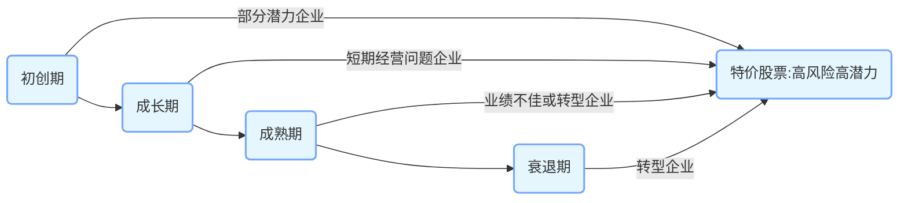

# 特价股票投资中的行业周期性考虑

> 关键词：特价股票、行业周期、投资策略、股票估值、经济周期

> 摘要：本文聚焦于特价股票投资中行业周期性的重要性。通过深入剖析行业周期的各个阶段及其对特价股票的影响，阐述了在不同行业周期下如何进行有效的投资决策。详细讲解了相关的核心概念、算法原理、数学模型，并结合实际案例展示操作方法。旨在帮助投资者更好地理解行业周期性与特价股票投资之间的联系，从而制定出更科学、合理的投资策略，提高投资收益并降低风险。

## 1. 背景介绍 

### 1.1 目的和范围
在股票投资领域，特价股票因其价格相对较低而具有一定的吸引力。然而，仅仅关注股票价格是不够的，行业的周期性变化对特价股票的表现有着至关重要的影响。本文的目的在于深入探讨在特价股票投资过程中如何充分考虑行业周期性因素，为投资者提供全面、系统的投资指导。范围涵盖了不同行业的周期特点、行业周期对特价股票的影响机制，以及基于行业周期的投资策略制定等方面。

### 1.2 预期读者
本文预期读者包括股票投资者、金融从业者、投资研究人员以及对股票投资有兴趣的爱好者。无论是新手投资者希望了解行业周期性对特价股票投资的基本概念，还是有一定经验的投资者寻求更深入的投资策略优化，都能从本文中获得有价值的信息。

### 1.3 文档结构概述
本文首先介绍了相关的背景知识，包括目的、预期读者和文档结构。接着阐述了核心概念，解释了行业周期和特价股票的定义及相互联系，并通过示意图和流程图进行直观展示。然后详细讲解了核心算法原理和具体操作步骤，结合 Python 代码进行说明。之后介绍了数学模型和公式，并举例说明其应用。再通过项目实战，展示了实际案例和代码解读。随后分析了实际应用场景，推荐了相关的工具和资源。最后对未来发展趋势与挑战进行总结，并提供了常见问题解答和扩展阅读参考资料。

### 1.4 术语表

#### 1.4.1 核心术语定义
- **特价股票**：指市场价格相对其内在价值或行业平均估值水平较低的股票。通常是由于市场短期情绪、行业暂时困境或公司特定事件等因素导致股价被低估。
- **行业周期**：行业从诞生、成长、成熟到衰退的整个发展过程，一般可分为初创期、成长期、成熟期和衰退期四个阶段。每个阶段具有不同的市场特征、竞争格局和发展趋势。

#### 1.4.2 相关概念解释
- **经济周期**：经济活动在扩张和收缩之间的周期性波动，通常包括繁荣、衰退、萧条和复苏四个阶段。经济周期会对不同行业的发展产生影响，进而影响行业周期的运行。
- **股票估值**：对股票的内在价值进行评估的过程。常用的估值方法包括市盈率（P/E）、市净率（P/B）、现金流折现法（DCF）等。股票估值是判断股票是否为特价股票的重要依据。

#### 1.4.3 缩略词列表
- **P/E**：市盈率（Price-to-Earnings Ratio），是股票价格与每股收益的比值，反映了市场对公司盈利的预期。
- **P/B**：市净率（Price-to-Book Ratio），是股票价格与每股净资产的比值，衡量了股票价格相对于公司净资产的倍数。
- **DCF**：现金流折现法（Discounted Cash Flow），通过预测公司未来的现金流并将其折现到当前，来估算公司的内在价值。

## 2. 核心概念与联系 

### 行业周期的阶段特征
行业周期一般分为初创期、成长期、成熟期和衰退期四个阶段，每个阶段具有不同的特征：
- **初创期**：行业刚刚兴起，技术尚不成熟，市场需求有待培育。企业数量较少，竞争相对不激烈，但面临较高的技术风险和市场风险。产品或服务的成本较高，盈利水平较低甚至亏损。
- **成长期**：行业进入快速发展阶段，技术逐渐成熟，市场需求迅速增长。企业数量增加，竞争加剧，但市场规模的扩大使得企业有更多的发展机会。产品或服务的成本逐渐降低，盈利水平提高。
- **成熟期**：行业发展趋于稳定，市场需求增长缓慢，竞争格局相对稳定。企业之间的竞争主要集中在成本、质量和品牌等方面。行业利润率相对稳定，但增长空间有限。
- **衰退期**：行业市场需求逐渐萎缩，技术被新兴行业替代。企业数量减少，竞争激烈程度下降，但部分企业面临生存困境。行业利润率下降，投资价值降低。

### 特价股票与行业周期的联系
行业周期的不同阶段对特价股票的产生和表现有着重要影响：
- **初创期**：由于行业前景不明朗，市场对相关股票的预期较低，部分具有潜力但尚未被市场充分认可的企业股票可能成为特价股票。这些股票虽然风险较高，但如果企业能够成功度过初创期，其股价可能会有较大的上涨空间。
- **成长期**：随着行业的快速发展，市场对行业内股票的关注度提高，股价普遍上涨。但在行业快速扩张过程中，也可能出现一些企业由于短期经营问题或市场误判而导致股价被低估，形成特价股票。
- **成熟期**：行业竞争格局稳定，市场对企业的估值相对合理。但由于行业整体增长放缓，一些业绩不佳或面临转型压力的企业股票可能会成为特价股票。这些股票的投资价值需要谨慎评估，因为其可能面临长期的业绩下滑风险。
- **衰退期**：行业整体前景不佳，大部分股票价格下跌。但在行业衰退过程中，也可能存在一些企业通过转型或重组等方式实现业务的多元化发展，其股票可能在短期内被低估，成为特价股票。然而，这类股票的投资风险较高，需要密切关注企业的转型进展和行业趋势。

### 文本示意图
| 行业周期阶段 | 市场特征 | 竞争格局 | 盈利水平 | 特价股票特点 |
| --- | --- | --- | --- | --- |
| 初创期 | 技术不成熟，需求待培育 | 企业数量少，竞争不激烈 | 低或亏损 | 潜力大但风险高 |
| 成长期 | 技术成熟，需求快速增长 | 企业数量增加，竞争加剧 | 提高 | 短期经营问题导致低估 |
| 成熟期 | 需求增长缓慢，格局稳定 | 竞争集中在成本等方面 | 稳定 | 业绩不佳或转型压力导致低估 |
| 衰退期 | 需求萎缩，技术被替代 | 企业数量减少，竞争下降 | 下降 | 转型企业短期低估，风险高 |

### Mermaid 流程图


## 3. 核心算法原理 & 具体操作步骤 

### 核心算法原理
在特价股票投资中，判断股票是否为特价以及结合行业周期进行投资决策的核心算法主要基于股票估值和行业分析。常用的股票估值方法包括市盈率（P/E）、市净率（P/B）和现金流折现法（DCF）。

#### 市盈率（P/E）法
市盈率是股票价格与每股收益的比值，反映了市场对公司盈利的预期。计算公式为：
$P/E = \frac{股票价格}{每股收益}$

一般来说，较低的市盈率可能意味着股票被低估，但需要结合行业平均市盈率进行分析。如果某只股票的市盈率低于行业平均水平，且公司的盈利状况稳定或有增长潜力，则该股票可能是特价股票。

#### 市净率（P/B）法
市净率是股票价格与每股净资产的比值，衡量了股票价格相对于公司净资产的倍数。计算公式为：
$P/B = \frac{股票价格}{每股净资产}$

较低的市净率可能表示股票价格相对净资产被低估。但不同行业的市净率水平差异较大，需要与行业平均市净率进行比较。

#### 现金流折现法（DCF）
现金流折现法通过预测公司未来的现金流并将其折现到当前，来估算公司的内在价值。基本公式为：
$V = \sum_{t=1}^{n} \frac{CF_t}{(1 + r)^t}$
其中，$V$ 表示公司的内在价值，$CF_t$ 表示第 $t$ 期的现金流，$r$ 表示折现率，$n$ 表示预测期数。

如果股票的市场价格低于通过 DCF 模型计算出的内在价值，则该股票可能是特价股票。

### 具体操作步骤

#### 步骤 1：行业周期判断
- 收集行业相关数据，包括市场规模、增长率、竞争格局等。
- 分析行业的技术发展趋势、政策环境等因素，判断行业所处的周期阶段。

#### 步骤 2：股票筛选
- 根据行业周期阶段，确定筛选特价股票的标准。例如，在初创期可以关注具有创新技术和潜力的企业；在成长期可以关注短期业绩波动但有成长潜力的企业。
- 使用股票估值方法（P/E、P/B、DCF 等）对行业内的股票进行估值，筛选出估值相对较低的股票。

#### 步骤 3：基本面分析
- 对筛选出的特价股票进行基本面分析，包括公司的财务状况、管理团队、市场竞争力等。
- 评估公司在行业周期中的适应能力和发展前景，判断其是否具有投资价值。

#### 步骤 4：投资决策
- 根据行业周期和股票的基本面分析结果，制定投资策略。例如，在行业成长期可以适当增加投资仓位；在行业衰退期则要谨慎投资。
- 定期跟踪行业和股票的动态，及时调整投资组合。

### Python 源代码实现
```python
import pandas as pd
import numpy as np

# 示例数据：股票价格、每股收益、每股净资产
stock_prices = np.array([10, 15, 20, 25])
earnings_per_share = np.array([1, 1.5, 2, 2.5])
book_value_per_share = np.array([5, 8, 10, 12])

# 计算市盈率和市净率
pe_ratios = stock_prices / earnings_per_share
pb_ratios = stock_prices / book_value_per_share

# 行业平均市盈率和市净率
industry_avg_pe = 12
industry_avg_pb = 2

# 筛选特价股票
cheap_stocks_pe = []
cheap_stocks_pb = []

for i in range(len(stock_prices)):
    if pe_ratios[i] < industry_avg_pe:
        cheap_stocks_pe.append(i)
    if pb_ratios[i] < industry_avg_pb:
        cheap_stocks_pb.append(i)

print("基于市盈率筛选的特价股票索引:", cheap_stocks_pe)
print("基于市净率筛选的特价股票索引:", cheap_stocks_pb)
```

### 代码解释
上述代码首先定义了股票的价格、每股收益和每股净资产数据。然后计算了每只股票的市盈率和市净率。接着设定了行业平均市盈率和市净率作为筛选标准。最后，通过遍历股票数据，筛选出市盈率和市净率低于行业平均水平的股票，并输出其索引。

## 4. 数学模型和公式 & 详细讲解 & 举例说明 

### 市盈率（P/E）模型
#### 公式
$P/E = \frac{股票价格}{每股收益}$

#### 详细讲解
市盈率反映了投资者为获得公司每股盈利所愿意支付的价格倍数。较低的市盈率可能表示股票被低估，但需要注意的是，不同行业的市盈率水平差异较大。例如，科技行业由于其高增长预期，市盈率普遍较高；而传统制造业的市盈率相对较低。

#### 举例说明
假设某只股票的价格为 20 元，每股收益为 2 元，则该股票的市盈率为：
$P/E = \frac{20}{2} = 10$

如果该行业的平均市盈率为 15，则该股票的市盈率低于行业平均水平，可能被认为是特价股票。

### 市净率（P/B）模型
#### 公式
$P/B = \frac{股票价格}{每股净资产}$

#### 详细讲解
市净率衡量了股票价格相对于公司净资产的倍数。较低的市净率可能表示股票价格相对净资产被低估。但对于一些轻资产的行业，如互联网、软件等，市净率的参考价值相对较低。

#### 举例说明
假设某只股票的价格为 15 元，每股净资产为 8 元，则该股票的市净率为：
$P/B = \frac{15}{8} = 1.875$

如果该行业的平均市净率为 2，则该股票的市净率低于行业平均水平，可能被认为是特价股票。

### 现金流折现法（DCF）模型
#### 公式
$V = \sum_{t=1}^{n} \frac{CF_t}{(1 + r)^t}$

#### 详细讲解
现金流折现法的核心思想是将公司未来的现金流折现到当前，以估算公司的内在价值。其中，$CF_t$ 表示第 $t$ 期的现金流，$r$ 表示折现率，$n$ 表示预测期数。折现率反映了投资者对投资风险的预期，风险越高，折现率越高。

#### 举例说明
假设某公司未来三年的现金流分别为 100 万元、120 万元和 150 万元，折现率为 10%，预测期数为 3 年。则该公司的内在价值为：
$V = \frac{100}{(1 + 0.1)^1} + \frac{120}{(1 + 0.1)^2} + \frac{150}{(1 + 0.1)^3}$
$V \approx 90.91 + 99.17 + 112.70 = 302.78$（万元）

如果该公司的市场价值低于 302.78 万元，则该公司的股票可能被认为是特价股票。

## 5. 项目实战：代码实际案例和详细解释说明 

### 5.1  开发环境搭建
#### 安装 Python
首先，需要安装 Python 开发环境。可以从 Python 官方网站（https://www.python.org/downloads/） 下载适合自己操作系统的 Python 安装包，并按照安装向导进行安装。

#### 安装必要的库
在进行股票投资分析时，需要使用一些 Python 库，如 Pandas、Numpy、Matplotlib 等。可以使用以下命令进行安装：
```sh
pip install pandas numpy matplotlib
```

### 5.2  源代码详细实现和代码解读
```python
import pandas as pd
import numpy as np
import matplotlib.pyplot as plt

# 模拟行业周期数据
industry_cycle_stages = ['初创期', '成长期', '成熟期', '衰退期']
industry_cycle_data = {
    '阶段': industry_cycle_stages,
    '市场规模增长率': [0.1, 0.3, 0.05, -0.1],
    '企业平均利润率': [0.05, 0.15, 0.1, 0.03]
}

industry_cycle_df = pd.DataFrame(industry_cycle_data)

# 模拟股票数据
stock_data = {
    '股票代码': ['A', 'B', 'C', 'D'],
    '价格': [10, 15, 20, 25],
    '每股收益': [1, 1.5, 2, 2.5],
    '每股净资产': [5, 8, 10, 12],
    '所属行业阶段': ['初创期', '成长期', '成熟期', '衰退期']
}

stock_df = pd.DataFrame(stock_data)

# 计算市盈率和市净率
stock_df['市盈率'] = stock_df['价格'] / stock_df['每股收益']
stock_df['市净率'] = stock_df['价格'] / stock_df['每股净资产']

# 行业平均市盈率和市净率
industry_avg_pe = 12
industry_avg_pb = 2

# 筛选特价股票
stock_df['是否特价股票（市盈率）'] = stock_df['市盈率'] < industry_avg_pe
stock_df['是否特价股票（市净率）'] = stock_df['市净率'] < industry_avg_pb

# 绘制行业周期数据图表
plt.figure(figsize=(10, 6))
plt.subplot(2, 1, 1)
plt.bar(industry_cycle_df['阶段'], industry_cycle_df['市场规模增长率'])
plt.title('行业周期各阶段市场规模增长率')
plt.xlabel('行业周期阶段')
plt.ylabel('市场规模增长率')

plt.subplot(2, 1, 2)
plt.bar(industry_cycle_df['阶段'], industry_cycle_df['企业平均利润率'])
plt.title('行业周期各阶段企业平均利润率')
plt.xlabel('行业周期阶段')
plt.ylabel('企业平均利润率')

plt.tight_layout()
plt.show()

# 输出结果
print("行业周期数据:")
print(industry_cycle_df)
print("\n股票数据:")
print(stock_df)
```

### 5.3  代码解读与分析
#### 数据模拟
- 首先，模拟了行业周期数据，包括行业周期的四个阶段（初创期、成长期、成熟期、衰退期）以及每个阶段的市场规模增长率和企业平均利润率。
- 然后，模拟了股票数据，包括股票代码、价格、每股收益、每股净资产和所属行业阶段。

#### 计算估值指标
- 计算了每只股票的市盈率和市净率，并与行业平均市盈率和市净率进行比较，判断股票是否为特价股票。

#### 数据可视化
- 使用 Matplotlib 库绘制了行业周期各阶段的市场规模增长率和企业平均利润率的柱状图，直观展示行业周期的特征。

#### 结果输出
- 最后，输出了行业周期数据和股票数据，包括股票的估值指标和是否为特价股票的判断结果。

通过这个项目实战案例，我们可以更直观地了解如何结合行业周期数据和股票估值指标来筛选特价股票。

## 6. 实际应用场景 
### 初创期行业投资
在初创期行业中，投资者可以关注那些具有创新技术和潜力的企业。虽然这些企业的股票风险较高，但如果能够成功度过初创期，其股价可能会有较大的上涨空间。例如，在新能源汽车行业的初创期，一些专注于电池技术研发的企业股票可能被市场低估。投资者可以通过深入研究企业的技术实力、市场前景和管理团队等因素，选择具有潜力的特价股票进行投资。

### 成长期行业投资
在成长期行业中，市场需求快速增长，企业的业绩普遍较好。但由于行业快速扩张，也可能出现一些企业由于短期经营问题或市场误判而导致股价被低估。投资者可以关注这些短期被低估的股票，通过分析企业的基本面和行业趋势，判断其是否具有投资价值。例如，在智能手机行业的成长期，一些手机零部件供应商可能由于短期订单波动而股价下跌，但如果其技术实力和市场份额稳定，仍然具有投资潜力。

### 成熟期行业投资
在成熟期行业中，市场竞争格局相对稳定，行业利润率相对稳定但增长空间有限。投资者可以关注那些业绩不佳或面临转型压力的企业股票。如果这些企业能够通过优化管理、拓展市场或进行技术创新等方式实现业绩改善，其股票可能具有投资价值。例如，传统家电行业进入成熟期后，一些企业通过向智能家居领域转型，可能会带来新的增长机会。

### 衰退期行业投资
在衰退期行业中，大部分股票价格下跌，但也可能存在一些企业通过转型或重组等方式实现业务的多元化发展。投资者可以关注这些转型企业的股票，但需要密切关注企业的转型进展和行业趋势。例如，传统煤炭行业在面临能源结构调整的衰退期，一些煤炭企业通过向新能源领域转型，可能会在短期内被市场低估，但投资风险较高。

## 7. 工具和资源推荐

### 7.1 学习资源推荐

#### 7.1.1 书籍推荐
- 《聪明的投资者》（本杰明·格雷厄姆著）：被誉为投资界的圣经，详细阐述了价值投资的理念和方法，对于理解特价股票投资具有重要的指导意义。
- 《金融炼金术》（乔治·索罗斯著）：作者通过自己的投资实践，探讨了金融市场的运行规律和投资策略，对投资者的思维方式有很大的启发。
- 《周期》（霍华德·马克斯著）：深入分析了经济周期、市场周期和行业周期等各种周期的特点和规律，帮助投资者更好地把握投资时机。

#### 7.1.2 在线课程
- Coursera 平台上的“投资学原理”课程：由知名高校的教授授课，系统地介绍了投资学的基本原理和方法，包括股票投资、债券投资、资产配置等内容。
- edX 平台上的“金融市场”课程：从宏观和微观的角度介绍了金融市场的运行机制和投资策略，对于理解股票市场和行业周期有很大的帮助。

#### 7.1.3 技术博客和网站
- 雪球网：国内知名的投资交流社区，汇聚了众多投资者和投资专家。在雪球网上可以了解到最新的股票行情、行业动态和投资分析观点。
- 东方财富网：提供全面的金融信息和数据服务，包括股票行情、财经新闻、研究报告等。可以通过东方财富网获取行业数据和股票估值信息。

### 7.2 开发工具框架推荐

#### 7.2.1 IDE和编辑器
- PyCharm：一款专业的 Python 集成开发环境，具有代码编辑、调试、版本控制等功能，适合进行股票投资分析的 Python 代码开发。
- Jupyter Notebook：一种交互式的开发环境，可以方便地进行数据探索、代码演示和结果展示，对于股票投资分析的可视化和数据处理非常有用。

#### 7.2.2 调试和性能分析工具
- PDB：Python 自带的调试工具，可以帮助开发者逐步执行代码，查找代码中的错误和问题。
- cProfile：Python 标准库中的性能分析工具，可以分析代码的运行时间和函数调用情况，帮助开发者优化代码性能。

#### 7.2.3 相关框架和库
- Pandas：用于数据处理和分析的 Python 库，提供了丰富的数据结构和数据操作方法，适合处理股票数据和行业数据。
- Numpy：用于科学计算的 Python 库，提供了高效的数组操作和数学函数，对于股票投资分析中的数值计算非常有用。
- Matplotlib：用于数据可视化的 Python 库，可以绘制各种类型的图表，如折线图、柱状图、散点图等，帮助投资者直观地展示数据和分析结果。

### 7.3 相关论文著作推荐

#### 7.3.1 经典论文
- Eugene F. Fama 和 Kenneth R. French 的“Common Risk Factors in the Returns on Stocks and Bonds”：提出了著名的三因子模型，用于解释股票和债券的收益率差异，对于理解股票市场的风险和收益具有重要的理论意义。
- Robert J. Shiller 的“Stock Prices, Earnings, and Expected Dividends”：研究了股票价格与盈利和预期股息之间的关系，揭示了股票市场的泡沫和非理性行为。

#### 7.3.2 最新研究成果
- 可以关注《金融研究》《经济研究》等国内权威金融经济期刊，以及 Journal of Finance、Review of Financial Studies 等国际知名金融学术期刊，获取最新的股票投资和行业周期研究成果。

#### 7.3.3 应用案例分析
- 可以参考一些专业的金融研究机构发布的研究报告，如中信证券、国泰君安等证券公司的研究报告，其中包含了大量的股票投资案例分析和行业周期研究。

## 8. 总结：未来发展趋势与挑战

### 未来发展趋势
- **科技驱动行业周期变化加速**：随着科技的快速发展，新兴行业不断涌现，行业周期的变化速度加快。例如，人工智能、区块链、生物医药等行业的发展日新月异，投资者需要更加敏锐地捕捉行业周期的变化，及时调整投资策略。
- **全球经济一体化影响行业周期**：全球经济一体化使得不同国家和地区的行业周期相互影响。一个国家或地区的行业发展可能受到全球经济形势、贸易政策等因素的影响。投资者需要关注全球经济动态，从更宏观的角度分析行业周期。
- **可持续投资理念的兴起**：随着社会对环境保护、社会责任等问题的关注度不断提高，可持续投资理念逐渐兴起。投资者在选择特价股票时，不仅要考虑股票的估值和行业周期，还要关注企业的可持续发展能力和社会责任表现。

### 挑战
- **行业周期判断难度增加**：由于科技发展的不确定性和全球经济环境的复杂性，行业周期的判断难度越来越大。投资者需要综合考虑多种因素，运用更加科学的方法和工具来判断行业周期。
- **信息过载问题**：在信息时代，投资者面临着海量的信息。如何从众多的信息中筛选出有价值的信息，准确分析行业周期和股票投资价值，是投资者面临的一大挑战。
- **市场波动风险**：股票市场的波动受到多种因素的影响，如宏观经济形势、政策变化、企业业绩等。即使投资者准确判断了行业周期和股票的投资价值，也可能面临市场波动带来的风险。

## 9. 附录：常见问题与解答

### 问题 1：如何准确判断行业所处的周期阶段？
答：判断行业所处的周期阶段需要综合考虑多个因素，包括市场规模、增长率、竞争格局、技术发展趋势、政策环境等。可以通过收集行业相关数据，分析行业的历史发展情况，参考行业研究报告和专家意见等方式来进行判断。

### 问题 2：特价股票是否一定具有投资价值？
答：不一定。特价股票只是价格相对较低，但并不意味着其一定具有投资价值。投资者需要对特价股票进行深入的基本面分析，包括公司的财务状况、管理团队、市场竞争力等，评估其在行业周期中的适应能力和发展前景，才能判断其是否具有投资价值。

### 问题 3：在不同行业周期阶段，投资策略应该如何调整？
答：在初创期，投资风险较高，应选择具有创新技术和潜力的企业，适当控制投资仓位。在成长期，可以增加投资仓位，关注短期被低估但有成长潜力的企业。在成熟期，要谨慎选择业绩不佳或面临转型压力的企业，关注其转型进展。在衰退期，要谨慎投资，关注转型企业的股票，但要密切关注其转型风险。

### 问题 4：如何处理股票投资中的市场波动风险？
答：可以通过分散投资、合理配置资产、设置止损点等方式来降低市场波动风险。分散投资可以将资金投资于不同行业、不同类型的股票，降低单一股票的风险。合理配置资产可以将资金分配到股票、债券、基金等不同资产类别中，实现风险的分散。设置止损点可以在股票价格下跌到一定程度时及时卖出，避免损失进一步扩大。

## 10. 扩展阅读 & 参考资料
- 本杰明·格雷厄姆. 《聪明的投资者》. 人民邮电出版社.
- 乔治·索罗斯. 《金融炼金术》. 海南出版社.
- 霍华德·马克斯. 《周期》. 中信出版社.
- Eugene F. Fama, Kenneth R. French. “Common Risk Factors in the Returns on Stocks and Bonds”. Journal of Financial Economics.
- Robert J. Shiller. “Stock Prices, Earnings, and Expected Dividends”. The Journal of Finance.
- 雪球网：https://xueqiu.com/
- 东方财富网：https://www.eastmoney.com/
- Coursera 平台：https://www.coursera.org/
- edX 平台：https://www.edx.org/