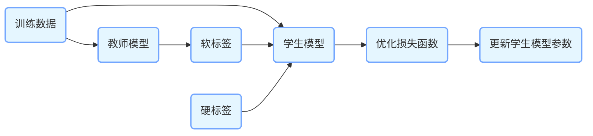

# 知识蒸馏：从教师模型到高效AI Agent

> 关键词：知识蒸馏、教师模型、学生模型、高效AI Agent、模型压缩、知识迁移、机器学习

> 摘要：本文深入探讨了知识蒸馏这一重要的机器学习技术，旨在阐述如何从强大的教师模型中提取知识并迁移到更高效的学生模型，从而构建高效的AI Agent。首先介绍了知识蒸馏的背景和相关概念，包括其目的、预期读者、文档结构等内容。接着详细讲解了核心概念与联系，通过文本示意图和Mermaid流程图进行清晰展示。在核心算法原理部分，使用Python源代码进行详细阐述。同时给出了相关的数学模型和公式，并结合实例进行说明。通过项目实战，展示了知识蒸馏在实际中的应用，包括开发环境搭建、源代码实现与解读。还探讨了知识蒸馏的实际应用场景，推荐了相关的工具和资源，最后总结了其未来发展趋势与挑战，并对常见问题进行了解答，提供了扩展阅读和参考资料，希望能为读者全面深入理解知识蒸馏技术提供有价值的参考。

## 1. 背景介绍 
### 1.1 目的和范围
随着人工智能技术的飞速发展，深度学习模型在各个领域取得了巨大的成功。然而，这些模型往往具有庞大的参数数量和复杂的结构，这导致了模型在存储、计算和部署等方面面临着诸多挑战。例如，在资源受限的设备上，如智能手机、物联网设备等，运行大型的深度学习模型几乎是不可能的。知识蒸馏技术应运而生，其目的在于将大型、复杂且性能优越的教师模型所学到的知识，迁移到小型、简单的学生模型中，使得学生模型在保持较高性能的同时，能够显著减少计算资源和存储需求。

本文的范围涵盖了知识蒸馏的基本概念、核心算法原理、数学模型、项目实战、实际应用场景以及相关工具和资源推荐等方面，旨在为读者提供一个全面且深入的知识蒸馏技术的学习和实践指南。

### 1.2 预期读者
本文预期读者包括但不限于以下几类人群：
- **机器学习研究者**：对知识蒸馏技术的原理、算法和研究进展感兴趣，希望深入了解该领域的最新研究成果和发展趋势。
- **人工智能工程师**：在实际项目中面临模型部署和优化的挑战，需要掌握知识蒸馏技术来构建高效的AI Agent，以满足不同应用场景的需求。
- **数据科学家**：希望通过知识蒸馏技术提高模型的效率和性能，更好地处理大规模数据和复杂任务。
- **学生和爱好者**：对人工智能和机器学习领域有浓厚兴趣，希望通过学习知识蒸馏技术来深入理解模型压缩和知识迁移的原理和方法。

### 1.3 文档结构概述
本文将按照以下结构进行组织：
1. **背景介绍**：介绍知识蒸馏的目的、范围、预期读者和文档结构，以及相关术语和概念。
2. **核心概念与联系**：详细讲解知识蒸馏的核心概念，包括教师模型、学生模型、软标签等，并通过文本示意图和Mermaid流程图展示它们之间的联系。
3. **核心算法原理 & 具体操作步骤**：使用Python源代码详细阐述知识蒸馏的核心算法原理和具体操作步骤。
4. **数学模型和公式 & 详细讲解 & 举例说明**：给出知识蒸馏的数学模型和公式，并结合实例进行详细讲解。
5. **项目实战：代码实际案例和详细解释说明**：通过一个具体的项目实战，展示知识蒸馏在实际中的应用，包括开发环境搭建、源代码实现与解读。
6. **实际应用场景**：探讨知识蒸馏技术在不同领域的实际应用场景。
7. **工具和资源推荐**：推荐学习知识蒸馏技术的相关书籍、在线课程、技术博客和网站，以及开发工具、框架和相关论文著作。
8. **总结：未来发展趋势与挑战**：总结知识蒸馏技术的发展现状，分析其未来发展趋势和面临的挑战。
9. **附录：常见问题与解答**：对读者在学习和实践知识蒸馏技术过程中常见的问题进行解答。
10. **扩展阅读 & 参考资料**：提供相关的扩展阅读材料和参考资料，方便读者进一步深入学习和研究。

### 1.4 术语表
#### 1.4.1 核心术语定义
- **知识蒸馏（Knowledge Distillation）**：一种将教师模型所学到的知识迁移到学生模型中的技术，通过让学生模型学习教师模型的输出（软标签）来提高学生模型的性能。
- **教师模型（Teacher Model）**：通常是一个大型、复杂且性能优越的深度学习模型，它在训练数据上进行充分训练，学到了丰富的知识。
- **学生模型（Student Model）**：一个小型、简单的深度学习模型，通过知识蒸馏技术从教师模型中学习知识，以达到接近教师模型的性能。
- **软标签（Soft Labels）**：教师模型的输出概率分布，包含了比硬标签（类别标签）更多的信息，能够为学生模型提供更丰富的学习信号。
- **硬标签（Hard Labels）**：样本的真实类别标签，通常是一个离散的数值。

#### 1.4.2 相关概念解释
- **模型压缩（Model Compression）**：旨在减少深度学习模型的参数数量和计算复杂度，以提高模型的存储效率和运行速度。知识蒸馏是模型压缩的一种有效方法。
- **知识迁移（Knowledge Transfer）**：将一个模型（源模型）学到的知识传递到另一个模型（目标模型）中，使得目标模型能够更快地学习和达到更好的性能。知识蒸馏是知识迁移的一种具体实现方式。

#### 1.4.3 缩略词列表
- **AI**：Artificial Intelligence，人工智能
- **ML**：Machine Learning，机器学习
- **DNN**：Deep Neural Network，深度神经网络
- **CNN**：Convolutional Neural Network，卷积神经网络
- **RNN**：Recurrent Neural Network，循环神经网络

## 2. 核心概念与联系 

知识蒸馏的核心思想是通过让学生模型学习教师模型的输出（软标签），来模仿教师模型的行为，从而达到将教师模型的知识迁移到学生模型中的目的。下面通过文本示意图和Mermaid流程图来详细展示知识蒸馏的核心概念和它们之间的联系。

### 文本示意图
知识蒸馏主要涉及三个关键部分：教师模型、学生模型和训练数据。训练数据首先输入到教师模型中，教师模型经过前向传播计算得到软标签。软标签包含了教师模型对各个类别的概率分布信息，相比于硬标签（真实类别标签），软标签能够提供更丰富的知识。

然后，训练数据和软标签一起输入到学生模型中，学生模型通过优化损失函数来学习软标签中的知识。损失函数通常由两部分组成：一部分是学生模型输出与软标签之间的损失，另一部分是学生模型输出与硬标签之间的损失。通过调整这两部分损失的权重，可以平衡学生模型对教师模型知识的学习和对真实数据的拟合。

### Mermaid流程图


在这个流程图中，训练数据同时输入到教师模型和学生模型中。教师模型输出软标签，软标签和硬标签一起作为学生模型的学习目标。学生模型通过优化损失函数来更新模型参数，从而不断学习教师模型的知识。

## 3. 核心算法原理 & 具体操作步骤 

### 核心算法原理
知识蒸馏的核心算法基于以下思想：教师模型在大规模数据上进行充分训练，学到了丰富的知识，这些知识体现在教师模型的输出概率分布（软标签）中。学生模型通过学习软标签，能够获得比直接学习硬标签更多的信息，从而提高学生模型的性能。

具体来说，知识蒸馏的损失函数通常由两部分组成：

1. **蒸馏损失（Distillation Loss）**：衡量学生模型输出与教师模型输出（软标签）之间的差异。常用的损失函数是KL散度（Kullback-Leibler Divergence），它能够衡量两个概率分布之间的差异。
2. **分类损失（Classification Loss）**：衡量学生模型输出与真实标签（硬标签）之间的差异。常用的损失函数是交叉熵损失（Cross-Entropy Loss）。

最终的损失函数是蒸馏损失和分类损失的加权和：

$$
L = \alpha \cdot L_{distillation} + (1 - \alpha) \cdot L_{classification}
$$

其中，$\alpha$ 是一个超参数，用于控制蒸馏损失和分类损失的权重。

### 具体操作步骤
下面使用Python和PyTorch框架来详细阐述知识蒸馏的具体操作步骤。

```python
import torch
import torch.nn as nn
import torch.optim as optim

# 定义教师模型
class TeacherModel(nn.Module):
    def __init__(self):
        super(TeacherModel, self).__init__()
        # 定义教师模型的层结构
        self.fc1 = nn.Linear(784, 128)
        self.fc2 = nn.Linear(128, 64)
        self.fc3 = nn.Linear(64, 10)

    def forward(self, x):
        x = x.view(-1, 784)
        x = torch.relu(self.fc1(x))
        x = torch.relu(self.fc2(x))
        x = self.fc3(x)
        return x

# 定义学生模型
class StudentModel(nn.Module):
    def __init__(self):
        super(StudentModel, self).__init__()
        # 定义学生模型的层结构
        self.fc1 = nn.Linear(784, 32)
        self.fc2 = nn.Linear(32, 10)

    def forward(self, x):
        x = x.view(-1, 784)
        x = torch.relu(self.fc1(x))
        x = self.fc2(x)
        return x

# 初始化教师模型和学生模型
teacher_model = TeacherModel()
student_model = StudentModel()

# 定义损失函数和优化器
criterion_distillation = nn.KLDivLoss(reduction='batchmean')
criterion_classification = nn.CrossEntropyLoss()
optimizer = optim.Adam(student_model.parameters(), lr=0.001)

# 超参数设置
alpha = 0.5
temperature = 4.0

# 训练循环
for epoch in range(10):
    running_loss = 0.0
    for i, (images, labels) in enumerate(train_loader):
        # 前向传播教师模型
        teacher_outputs = teacher_model(images)
        soft_labels = torch.softmax(teacher_outputs / temperature, dim=1)

        # 前向传播学生模型
        student_outputs = student_model(images)
        student_logits = torch.log_softmax(student_outputs / temperature, dim=1)

        # 计算蒸馏损失
        distillation_loss = criterion_distillation(student_logits, soft_labels) * (temperature ** 2)

        # 计算分类损失
        classification_loss = criterion_classification(student_outputs, labels)

        # 计算总损失
        total_loss = alpha * distillation_loss + (1 - alpha) * classification_loss

        # 反向传播和优化
        optimizer.zero_grad()
        total_loss.backward()
        optimizer.step()

        running_loss += total_loss.item()

    print(f'Epoch {epoch + 1}, Loss: {running_loss / len(train_loader)}')
```

### 代码解释
1. **模型定义**：定义了教师模型和学生模型，教师模型具有更复杂的层结构，学生模型相对简单。
2. **损失函数和优化器**：使用KL散度作为蒸馏损失函数，交叉熵损失作为分类损失函数，Adam优化器用于更新学生模型的参数。
3. **超参数设置**：设置了 $\alpha$ 和 $temperature$ 两个超参数，$\alpha$ 控制蒸馏损失和分类损失的权重，$temperature$ 用于软化教师模型的输出概率分布。
4. **训练循环**：在每个训练周期中，首先前向传播教师模型得到软标签，然后前向传播学生模型，计算蒸馏损失和分类损失，最后将两者加权求和得到总损失，进行反向传播和参数更新。

## 4. 数学模型和公式 & 详细讲解 & 举例说明 

### 数学模型和公式
#### KL散度（Kullback-Leibler Divergence）
KL散度是一种衡量两个概率分布之间差异的指标。给定两个概率分布 $P$ 和 $Q$，它们的KL散度定义为：

$$
D_{KL}(P || Q) = \sum_{i} P(i) \log \frac{P(i)}{Q(i)}
$$

在知识蒸馏中，$P$ 通常是教师模型的输出概率分布（软标签），$Q$ 是学生模型的输出概率分布。

#### 交叉熵损失（Cross-Entropy Loss）
交叉熵损失是一种常用的分类损失函数，用于衡量模型输出概率分布与真实标签之间的差异。给定模型的输出概率分布 $p$ 和真实标签 $y$，交叉熵损失定义为：

$$
L_{CE}(p, y) = - \sum_{i} y_i \log p_i
$$

其中，$y_i$ 是真实标签的第 $i$ 个分量，$p_i$ 是模型输出概率分布的第 $i$ 个分量。

#### 知识蒸馏损失函数
知识蒸馏的损失函数是蒸馏损失和分类损失的加权和：

$$
L = \alpha \cdot L_{distillation} + (1 - \alpha) \cdot L_{classification}
$$

其中，$L_{distillation}$ 是蒸馏损失，通常使用KL散度计算；$L_{classification}$ 是分类损失，通常使用交叉熵损失计算；$\alpha$ 是一个超参数，用于控制蒸馏损失和分类损失的权重。

### 详细讲解
- **KL散度**：KL散度的值越大，表示两个概率分布之间的差异越大。在知识蒸馏中，通过最小化KL散度，学生模型能够学习到教师模型的输出概率分布，从而模仿教师模型的行为。
- **交叉熵损失**：交叉熵损失衡量了模型输出概率分布与真实标签之间的差异。在知识蒸馏中，交叉熵损失确保学生模型能够正确分类样本，同时学习教师模型的知识。
- **知识蒸馏损失函数**：通过调整 $\alpha$ 的值，可以平衡学生模型对教师模型知识的学习和对真实数据的拟合。当 $\alpha$ 较大时，学生模型更注重学习教师模型的知识；当 $\alpha$ 较小时，学生模型更注重对真实数据的拟合。

### 举例说明
假设我们有一个三分类问题，教师模型的输出概率分布为 $P = [0.1, 0.3, 0.6]$，学生模型的输出概率分布为 $Q = [0.2, 0.2, 0.6]$。真实标签为 $y = [0, 0, 1]$。

#### 计算KL散度
$$
D_{KL}(P || Q) = 0.1 \log \frac{0.1}{0.2} + 0.3 \log \frac{0.3}{0.2} + 0.6 \log \frac{0.6}{0.6} \approx 0.051
$$

#### 计算交叉熵损失
$$
L_{CE}(Q, y) = - (0 \log 0.2 + 0 \log 0.2 + 1 \log 0.6) \approx 0.511
$$

假设 $\alpha = 0.5$，则知识蒸馏的总损失为：

$$
L = 0.5 \times 0.051 + (1 - 0.5) \times 0.511 = 0.281
$$

通过不断优化这个总损失，学生模型能够逐渐学习到教师模型的知识，同时正确分类样本。

## 5. 项目实战：代码实际案例和详细解释说明 

### 5.1  开发环境搭建
在进行知识蒸馏的项目实战之前，需要搭建相应的开发环境。以下是具体的步骤：

#### 安装Python
确保你已经安装了Python 3.x版本。可以从Python官方网站（https://www.python.org/downloads/） 下载并安装。

#### 安装深度学习框架
本文使用PyTorch作为深度学习框架，可以根据自己的CUDA版本和操作系统选择合适的安装方式。可以参考PyTorch官方网站（https://pytorch.org/get-started/locally/） 进行安装。

#### 安装其他依赖库
除了PyTorch，还需要安装一些其他的依赖库，如 `torchvision`、`numpy`、`matplotlib` 等。可以使用以下命令进行安装：

```sh
pip install torchvision numpy matplotlib
```

### 5.2  源代码详细实现和代码解读
下面是一个完整的知识蒸馏项目实战代码，使用MNIST数据集进行训练和测试。

```python
import torch
import torch.nn as nn
import torch.optim as optim
from torchvision import datasets, transforms
from torch.utils.data import DataLoader

# 定义教师模型
class TeacherModel(nn.Module):
    def __init__(self):
        super(TeacherModel, self).__init__()
        self.fc1 = nn.Linear(784, 128)
        self.fc2 = nn.Linear(128, 64)
        self.fc3 = nn.Linear(64, 10)

    def forward(self, x):
        x = x.view(-1, 784)
        x = torch.relu(self.fc1(x))
        x = torch.relu(self.fc2(x))
        x = self.fc3(x)
        return x

# 定义学生模型
class StudentModel(nn.Module):
    def __init__(self):
        super(StudentModel, self).__init__()
        self.fc1 = nn.Linear(784, 32)
        self.fc2 = nn.Linear(32, 10)

    def forward(self, x):
        x = x.view(-1, 784)
        x = torch.relu(self.fc1(x))
        x = self.fc2(x)
        return x

# 数据预处理
transform = transforms.Compose([
    transforms.ToTensor(),
    transforms.Normalize((0.1307,), (0.3081,))
])

# 加载MNIST数据集
train_dataset = datasets.MNIST(root='./data', train=True, transform=transform, download=True)
test_dataset = datasets.MNIST(root='./data', train=False, transform=transform)

train_loader = DataLoader(train_dataset, batch_size=64, shuffle=True)
test_loader = DataLoader(test_dataset, batch_size=64, shuffle=False)

# 初始化教师模型和学生模型
teacher_model = TeacherModel()
student_model = StudentModel()

# 定义损失函数和优化器
criterion_distillation = nn.KLDivLoss(reduction='batchmean')
criterion_classification = nn.CrossEntropyLoss()
optimizer = optim.Adam(student_model.parameters(), lr=0.001)

# 超参数设置
alpha = 0.5
temperature = 4.0

# 训练教师模型
teacher_criterion = nn.CrossEntropyLoss()
teacher_optimizer = optim.Adam(teacher_model.parameters(), lr=0.001)

for epoch in range(10):
    running_loss = 0.0
    for i, (images, labels) in enumerate(train_loader):
        teacher_optimizer.zero_grad()
        outputs = teacher_model(images)
        loss = teacher_criterion(outputs, labels)
        loss.backward()
        teacher_optimizer.step()
        running_loss += loss.item()
    print(f'Teacher Epoch {epoch + 1}, Loss: {running_loss / len(train_loader)}')

# 知识蒸馏训练学生模型
for epoch in range(10):
    running_loss = 0.0
    for i, (images, labels) in enumerate(train_loader):
        # 前向传播教师模型
        teacher_outputs = teacher_model(images)
        soft_labels = torch.softmax(teacher_outputs / temperature, dim=1)

        # 前向传播学生模型
        student_outputs = student_model(images)
        student_logits = torch.log_softmax(student_outputs / temperature, dim=1)

        # 计算蒸馏损失
        distillation_loss = criterion_distillation(student_logits, soft_labels) * (temperature ** 2)

        # 计算分类损失
        classification_loss = criterion_classification(student_outputs, labels)

        # 计算总损失
        total_loss = alpha * distillation_loss + (1 - alpha) * classification_loss

        # 反向传播和优化
        optimizer.zero_grad()
        total_loss.backward()
        optimizer.step()

        running_loss += total_loss.item()

    print(f'Student Epoch {epoch + 1}, Loss: {running_loss / len(train_loader)}')

# 测试学生模型
correct = 0
total = 0
with torch.no_grad():
    for images, labels in test_loader:
        outputs = student_model(images)
        _, predicted = torch.max(outputs.data, 1)
        total += labels.size(0)
        correct += (predicted == labels).sum().item()

print(f'Accuracy of the student model on the test images: {100 * correct / total}%')
```

### 5.3  代码解读与分析
1. **数据预处理和加载**：使用 `torchvision` 库加载MNIST数据集，并进行数据预处理，包括将图像转换为张量和归一化操作。
2. **教师模型训练**：首先训练教师模型，使用交叉熵损失函数和Adam优化器进行10个周期的训练。
3. **知识蒸馏训练学生模型**：在训练学生模型时，首先前向传播教师模型得到软标签，然后前向传播学生模型，计算蒸馏损失和分类损失，最后将两者加权求和得到总损失，进行反向传播和参数更新。
4. **测试学生模型**：在测试阶段，使用测试数据集对学生模型进行测试，计算模型的准确率。

通过这个项目实战，可以看到知识蒸馏技术能够在保持较高准确率的同时，显著减少学生模型的参数数量和计算复杂度。

## 6. 实际应用场景 
知识蒸馏技术在多个领域都有广泛的应用，以下是一些常见的实际应用场景：

### 移动设备和物联网设备
在移动设备（如智能手机、平板电脑）和物联网设备（如智能手表、智能家居设备）中，资源（如计算能力、存储容量）通常是受限的。大型的深度学习模型无法直接在这些设备上运行。知识蒸馏技术可以将大型模型的知识迁移到小型模型中，使得小型模型能够在这些设备上高效运行，实现实时的图像识别、语音识别等功能。

### 自动驾驶
在自动驾驶领域，需要对大量的传感器数据（如摄像头图像、雷达数据）进行实时处理和分析。知识蒸馏技术可以帮助将复杂的感知模型压缩成高效的模型，减少计算资源的需求，提高系统的实时性和可靠性。

### 医疗影像分析
医疗影像分析（如X光、CT、MRI等）需要处理大量的图像数据，并且对模型的准确性要求较高。知识蒸馏技术可以将大型的医学影像诊断模型的知识迁移到小型模型中，使得小型模型能够在医院的本地服务器上快速运行，为医生提供及时的诊断辅助。

### 自然语言处理
在自然语言处理领域，如机器翻译、文本分类、情感分析等任务，通常需要使用大型的预训练语言模型。知识蒸馏技术可以将这些大型模型的知识迁移到小型模型中，减少模型的存储和计算成本，提高模型的部署效率。

## 7. 工具和资源推荐
### 7.1 学习资源推荐
#### 7.1.1 书籍推荐
- 《深度学习》（Deep Learning）：由Ian Goodfellow、Yoshua Bengio和Aaron Courville所著，是深度学习领域的经典教材，涵盖了深度学习的基本概念、算法和应用。
- 《动手学深度学习》（Dive into Deep Learning）：由李沐等人所著，是一本开源的深度学习教材，提供了丰富的代码示例和实践项目，适合初学者学习。

#### 7.1.2 在线课程
- Coursera上的《深度学习专项课程》（Deep Learning Specialization）：由Andrew Ng教授授课，包括深度学习的基础知识、卷积神经网络、循环神经网络等内容。
- edX上的《麻省理工学院：深度学习》（MITx: 6.S191x Introduction to Deep Learning）：由麻省理工学院的教授授课，介绍了深度学习的基本原理和应用。

#### 7.1.3 技术博客和网站
- Medium：有很多关于深度学习和知识蒸馏的技术博客文章，作者来自不同的领域和背景，可以从中获取最新的研究成果和实践经验。
- arXiv：是一个预印本服务器，包含了大量的学术论文，其中有很多关于知识蒸馏的最新研究成果。

### 7.2 开发工具框架推荐
#### 7.2.1 IDE和编辑器
- PyCharm：是一款专门为Python开发设计的集成开发环境，提供了丰富的功能，如代码编辑、调试、版本控制等。
- Visual Studio Code：是一款轻量级的代码编辑器，支持多种编程语言，并且有很多插件可以扩展其功能。

#### 7.2.2 调试和性能分析工具
- PyTorch Profiler：是PyTorch自带的性能分析工具，可以帮助用户分析模型的计算时间、内存使用等情况。
- TensorBoard：是一个可视化工具，可以帮助用户可视化模型的训练过程、损失函数曲线、准确率等信息。

#### 7.2.3 相关框架和库
- PyTorch：是一个开源的深度学习框架，提供了丰富的深度学习模型和工具，支持知识蒸馏的实现。
- TensorFlow：是另一个流行的深度学习框架，也支持知识蒸馏的实现。

### 7.3 相关论文著作推荐
#### 7.3.1 经典论文
- 《Distilling the Knowledge in a Neural Network》：由Geoffrey Hinton等人发表，是知识蒸馏领域的经典论文，首次提出了知识蒸馏的概念和方法。

#### 7.3.2 最新研究成果
- 可以通过arXiv、IEEE Xplore、ACM Digital Library等学术数据库搜索关于知识蒸馏的最新研究成果。

#### 7.3.3 应用案例分析
- 可以参考一些开源项目和实际应用案例，了解知识蒸馏在不同领域的具体应用和实现方法。

## 8. 总结：未来发展趋势与挑战
### 未来发展趋势
- **多模态知识蒸馏**：随着人工智能技术的发展，多模态数据（如图像、语音、文本等）的处理变得越来越重要。未来的知识蒸馏技术可能会扩展到多模态领域，实现不同模态之间的知识迁移和融合。
- **自适应知识蒸馏**：目前的知识蒸馏方法通常使用固定的超参数（如 $\alpha$ 和 $temperature$），未来的研究可能会探索自适应的知识蒸馏方法，根据不同的任务和数据自动调整超参数，提高知识蒸馏的效果。
- **知识蒸馏与其他技术的结合**：知识蒸馏可以与其他技术（如模型量化、剪枝等）结合使用，进一步提高模型的压缩率和效率。

### 挑战
- **知识表示和迁移**：如何更好地表示教师模型的知识，并将其有效地迁移到学生模型中，仍然是一个挑战。不同的模型结构和任务可能需要不同的知识表示和迁移方法。
- **超参数调优**：知识蒸馏中的超参数（如 $\alpha$ 和 $temperature$）对模型的性能有很大的影响，如何快速、有效地调优这些超参数是一个难题。
- **模型可解释性**：知识蒸馏技术通常是通过让学生模型模仿教师模型的行为来学习知识，缺乏对模型决策过程的解释。如何提高知识蒸馏模型的可解释性是未来需要解决的问题之一。

## 9. 附录：常见问题与解答
### 问题1：知识蒸馏和模型压缩有什么关系？
知识蒸馏是模型压缩的一种有效方法。模型压缩的目标是减少深度学习模型的参数数量和计算复杂度，而知识蒸馏通过将大型教师模型的知识迁移到小型学生模型中，实现了模型的压缩，同时保持了较高的性能。

### 问题2：知识蒸馏中的温度参数有什么作用？
温度参数 $T$ 用于软化教师模型的输出概率分布。当 $T$ 较大时，概率分布变得更加平滑，不同类别之间的差异减小，这样可以提供更多的知识给学生模型；当 $T$ 较小时，概率分布变得更加尖锐，更接近硬标签。

### 问题3：如何选择知识蒸馏中的超参数 $\alpha$？
$\alpha$ 是一个用于控制蒸馏损失和分类损失权重的超参数。通常需要通过实验来选择合适的 $\alpha$ 值。一般来说，如果教师模型的性能较好，可以适当增大 $\alpha$ 的值，让学生模型更多地学习教师模型的知识；如果教师模型的性能一般，可以适当减小 $\alpha$ 的值，让学生模型更多地关注真实数据。

### 问题4：知识蒸馏是否适用于所有类型的深度学习模型？
知识蒸馏适用于大多数类型的深度学习模型，包括卷积神经网络（CNN）、循环神经网络（RNN）、Transformer等。但是，不同类型的模型可能需要不同的知识蒸馏方法和超参数设置。

## 10. 扩展阅读 & 参考资料
### 扩展阅读
- 《Model Compression and Acceleration for Deep Neural Networks: The Principles, Progress, and Challenges》：介绍了模型压缩和加速的相关技术和方法。
- 《Neural Architecture Search: A Survey》：介绍了神经网络架构搜索的相关技术和方法，与知识蒸馏有一定的关联。

### 参考资料
- Hinton, G., Vinyals, O., & Dean, J. (2015). Distilling the Knowledge in a Neural Network. arXiv preprint arXiv:1503.02531.
- PyTorch官方文档：https://pytorch.org/docs/stable/index.html
- TensorFlow官方文档：https://www.tensorflow.org/api_docs