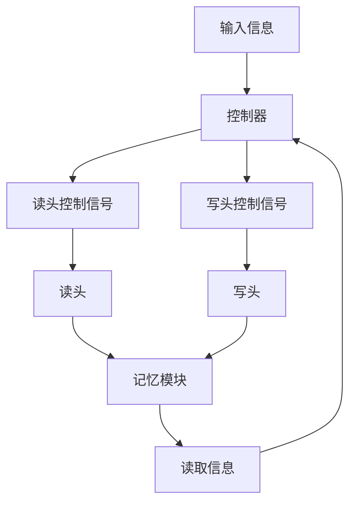

# 神经图灵机在程序化逻辑推理中的突破性应用

> 关键词：神经图灵机、程序化逻辑推理、深度学习、记忆机制、人工智能

> 摘要：本文聚焦于神经图灵机在程序化逻辑推理中的突破性应用。首先介绍神经图灵机的背景，包括其产生的目的和适用范围等。接着阐述神经图灵机的核心概念与联系，分析其架构原理。通过Python代码详细讲解核心算法原理和具体操作步骤，同时给出相关数学模型和公式并举例说明。然后进行项目实战，展示代码实际案例并详细解释。探讨神经图灵机在实际中的应用场景，推荐相关的学习资源、开发工具框架以及论文著作。最后总结神经图灵机在程序化逻辑推理领域的未来发展趋势与挑战，并给出常见问题的解答和扩展阅读参考资料，旨在全面深入地介绍神经图灵机在程序化逻辑推理方面的重要应用和价值。

## 1. 背景介绍 
### 1.1 目的和范围
传统的神经网络模型在处理复杂的逻辑推理任务时存在一定的局限性，例如缺乏有效的记忆机制，难以处理长序列和复杂的程序逻辑。神经图灵机（Neural Turing Machine，NTM）的出现旨在突破这些限制，为人工智能系统赋予更强大的逻辑推理能力。其应用范围涵盖自然语言处理中的语义理解、程序合成、知识推理等多个领域，通过模拟图灵机的工作方式，结合神经网络的学习能力，实现对复杂逻辑任务的有效处理。

### 1.2 预期读者
本文预期读者包括人工智能、机器学习、深度学习领域的研究人员和从业者，对神经网络和逻辑推理技术感兴趣的学生和爱好者，以及希望将神经图灵机应用于实际项目开发的工程师等。

### 1.3 文档结构概述
本文首先介绍神经图灵机的背景知识，包括目的、适用读者和文档结构等。接着深入讲解神经图灵机的核心概念与联系，包括其架构原理和工作流程。然后详细阐述核心算法原理和具体操作步骤，并给出相关的数学模型和公式。通过项目实战展示神经图灵机在实际中的应用代码和实现细节。探讨其实际应用场景，推荐相关的学习资源、开发工具框架和论文著作。最后总结神经图灵机的未来发展趋势与挑战，给出常见问题的解答和扩展阅读参考资料。

### 1.4 术语表
#### 1.4.1 核心术语定义
- **神经图灵机（Neural Turing Machine，NTM）**：一种结合了神经网络和图灵机概念的计算模型，通过引入外部记忆模块，使神经网络能够进行读写操作，从而增强其处理复杂逻辑任务的能力。
- **程序化逻辑推理**：指依据一定的程序规则和逻辑关系，对输入信息进行推理和判断，以得出合理结论的过程。
- **记忆模块**：神经图灵机中的一个重要组件，用于存储和检索信息，类似于图灵机的磁带。
- **读写头**：用于对记忆模块进行读写操作的组件，通过注意力机制来选择要读写的位置。

#### 1.4.2 相关概念解释
- **图灵机**：由英国数学家艾伦·图灵提出的一种抽象计算模型，它由一个无限长的磁带、一个读写头和一个控制单元组成，可以模拟任何可计算的算法。
- **神经网络**：一种模仿人类神经系统的计算模型，由大量的神经元组成，通过学习数据中的模式和规律来进行预测和分类。
- **注意力机制**：一种在神经网络中用于选择重要信息的机制，通过计算不同位置的权重，使模型能够聚焦于关键信息。

#### 1.4.3 缩略词列表
- **NTM**：Neural Turing Machine（神经图灵机）
- **RNN**：Recurrent Neural Network（循环神经网络）
- **LSTM**：Long Short - Term Memory（长短期记忆网络）

## 2. 核心概念与联系 

### 核心概念原理
神经图灵机的核心思想是将神经网络的学习能力与图灵机的计算能力相结合。传统的神经网络缺乏有效的外部记忆机制，难以处理长序列和复杂的逻辑推理任务。而神经图灵机引入了一个外部记忆模块，通过读写头对其进行读写操作，使得神经网络能够在处理任务的过程中存储和检索信息。

神经图灵机主要由三部分组成：控制器（通常是一个神经网络）、记忆模块和读写头。控制器根据输入信息生成读写头的控制信号，读写头根据这些信号对记忆模块进行读写操作。记忆模块可以看作是一个二维矩阵，每一行表示一个记忆单元，每个单元包含多个维度的信息。

### 架构的文本示意图
神经图灵机的架构可以描述如下：输入信息首先进入控制器，控制器根据输入生成读写头的控制信号，包括读头的读取权重和写头的写入权重、写入内容等。读头根据读取权重从记忆模块中读取信息，将读取的信息与输入信息一起作为控制器的输入，进行下一轮的计算。写头根据写入权重和写入内容对记忆模块进行更新。

### Mermaid 流程图


## 3. 核心算法原理 & 具体操作步骤 

### 核心算法原理
神经图灵机的核心算法主要包括控制器的计算、读写头的操作和记忆模块的更新。下面我们使用Python代码来详细阐述这些过程。

```python
import torch
import torch.nn as nn
import torch.nn.functional as F

# 定义控制器（这里使用一个简单的全连接神经网络作为示例）
class Controller(nn.Module):
    def __init__(self, input_size, hidden_size, output_size):
        super(Controller, self).__init__()
        self.fc1 = nn.Linear(input_size, hidden_size)
        self.fc2 = nn.Linear(hidden_size, output_size)

    def forward(self, x):
        x = F.relu(self.fc1(x))
        x = self.fc2(x)
        return x

# 定义读头
class ReadHead(nn.Module):
    def __init__(self, memory_size, memory_dim, controller_output_size):
        super(ReadHead, self).__init__()
        self.fc = nn.Linear(controller_output_size, memory_size)

    def forward(self, controller_output, memory):
        # 计算读取权重
        read_weights = F.softmax(self.fc(controller_output), dim=1)
        # 读取信息
        read_info = torch.matmul(read_weights, memory)
        return read_info, read_weights

# 定义写头
class WriteHead(nn.Module):
    def __init__(self, memory_size, memory_dim, controller_output_size):
        super(WriteHead, self).__init__()
        self.fc_weights = nn.Linear(controller_output_size, memory_size)
        self.fc_content = nn.Linear(controller_output_size, memory_dim)

    def forward(self, controller_output, memory):
        # 计算写入权重
        write_weights = F.softmax(self.fc_weights(controller_output), dim=1)
        # 计算写入内容
        write_content = self.fc_content(controller_output)
        # 更新记忆模块
        new_memory = memory + torch.matmul(write_weights.unsqueeze(2), write_content.unsqueeze(1))
        return new_memory, write_weights

# 定义神经图灵机
class NeuralTuringMachine(nn.Module):
    def __init__(self, input_size, hidden_size, output_size, memory_size, memory_dim):
        super(NeuralTuringMachine, self).__init__()
        self.controller = Controller(input_size + memory_dim, hidden_size, output_size)
        self.read_head = ReadHead(memory_size, memory_dim, output_size)
        self.write_head = WriteHead(memory_size, memory_dim, output_size)
        self.memory = torch.zeros(memory_size, memory_dim)

    def forward(self, input):
        # 读取信息
        read_info, read_weights = self.read_head(self.controller(torch.cat((input, self.memory.mean(dim=0).unsqueeze(0)), dim=1)), self.memory)
        # 控制器计算
        controller_output = self.controller(torch.cat((input, read_info), dim=1))
        # 更新记忆模块
        self.memory, write_weights = self.write_head(controller_output, self.memory)
        return controller_output
```

### 具体操作步骤
1. **初始化**：初始化控制器、读写头和记忆模块。
2. **输入信息**：将输入信息传递给控制器。
3. **读取信息**：控制器生成读头的控制信号，读头根据控制信号从记忆模块中读取信息。
4. **控制器计算**：将输入信息和读取的信息一起作为控制器的输入，进行计算。
5. **更新记忆模块**：控制器生成写头的控制信号，写头根据控制信号对记忆模块进行更新。
6. **输出结果**：控制器输出最终的结果。

## 4. 数学模型和公式 & 详细讲解 & 举例说明 

### 数学模型和公式
#### 读取操作
读头的读取权重 $w_t^r$ 可以通过控制器的输出 $h_t$ 计算得到：
$$w_t^r = \text{softmax}(W^r h_t + b^r)$$
其中 $W^r$ 和 $b^r$ 是读头的权重和偏置。读取的信息 $r_t$ 可以通过读取权重和记忆模块 $M_t$ 计算得到：
$$r_t = \sum_{i=1}^N w_t^r[i] M_t[i]$$
其中 $N$ 是记忆模块的行数。

#### 写入操作
写头的写入权重 $w_t^w$ 可以通过控制器的输出 $h_t$ 计算得到：
$$w_t^w = \text{softmax}(W^w h_t + b^w)$$
其中 $W^w$ 和 $b^w$ 是写头的权重和偏置。写入的内容 $e_t$ 可以通过控制器的输出 $h_t$ 计算得到：
$$e_t = W^e h_t + b^e$$
其中 $W^e$ 和 $b^e$ 是写头用于计算写入内容的权重和偏置。记忆模块的更新公式为：
$$M_{t+1}[i] = M_t[i] + w_t^w[i] e_t$$

### 详细讲解
读取操作通过计算读取权重，从记忆模块中加权求和得到读取的信息。写入操作通过计算写入权重和写入内容，对记忆模块进行更新。控制器的输出决定了读写头的操作，从而实现了神经图灵机的学习和推理能力。

### 举例说明
假设记忆模块 $M$ 是一个 $3\times 2$ 的矩阵：
$$M = \begin{bmatrix}
1 & 2 \\
3 & 4 \\
5 & 6
\end{bmatrix}$$
读头的读取权重 $w^r = [0.2, 0.3, 0.5]$，则读取的信息 $r$ 为：
$$r = 0.2\begin{bmatrix}1 \\ 2\end{bmatrix} + 0.3\begin{bmatrix}3 \\ 4\end{bmatrix} + 0.5\begin{bmatrix}5 \\ 6\end{bmatrix} = \begin{bmatrix}3.6 \\ 4.8\end{bmatrix}$$
假设写头的写入权重 $w^w = [0.1, 0.6, 0.3]$，写入内容 $e = \begin{bmatrix}7 \\ 8\end{bmatrix}$，则更新后的记忆模块 $M'$ 为：
$$M' = \begin{bmatrix}
1 + 0.1\times7 & 2 + 0.1\times8 \\
3 + 0.6\times7 & 4 + 0.6\times8 \\
5 + 0.3\times7 & 6 + 0.3\times8
\end{bmatrix} = \begin{bmatrix}
1.7 & 2.8 \\
7.2 & 8.8 \\
7.1 & 8.4
\end{bmatrix}$$

## 5. 项目实战：代码实际案例和详细解释说明 

### 5.1  开发环境搭建
- **操作系统**：推荐使用Ubuntu 18.04及以上版本或Windows 10及以上版本。
- **Python版本**：Python 3.6及以上版本。
- **深度学习框架**：PyTorch 1.7及以上版本。
- **安装命令**：
```bash
pip install torch torchvision
```

### 5.2  源代码详细实现和代码解读
```python
import torch
import torch.nn as nn
import torch.nn.functional as F
import torch.optim as optim

# 定义控制器（这里使用一个简单的全连接神经网络作为示例）
class Controller(nn.Module):
    def __init__(self, input_size, hidden_size, output_size):
        super(Controller, self).__init__()
        self.fc1 = nn.Linear(input_size, hidden_size)
        self.fc2 = nn.Linear(hidden_size, output_size)

    def forward(self, x):
        x = F.relu(self.fc1(x))
        x = self.fc2(x)
        return x

# 定义读头
class ReadHead(nn.Module):
    def __init__(self, memory_size, memory_dim, controller_output_size):
        super(ReadHead, self).__init__()
        self.fc = nn.Linear(controller_output_size, memory_size)

    def forward(self, controller_output, memory):
        # 计算读取权重
        read_weights = F.softmax(self.fc(controller_output), dim=1)
        # 读取信息
        read_info = torch.matmul(read_weights, memory)
        return read_info, read_weights

# 定义写头
class WriteHead(nn.Module):
    def __init__(self, memory_size, memory_dim, controller_output_size):
        super(WriteHead, self).__init__()
        self.fc_weights = nn.Linear(controller_output_size, memory_size)
        self.fc_content = nn.Linear(controller_output_size, memory_dim)

    def forward(self, controller_output, memory):
        # 计算写入权重
        write_weights = F.softmax(self.fc_weights(controller_output), dim=1)
        # 计算写入内容
        write_content = self.fc_content(controller_output)
        # 更新记忆模块
        new_memory = memory + torch.matmul(write_weights.unsqueeze(2), write_content.unsqueeze(1))
        return new_memory, write_weights

# 定义神经图灵机
class NeuralTuringMachine(nn.Module):
    def __init__(self, input_size, hidden_size, output_size, memory_size, memory_dim):
        super(NeuralTuringMachine, self).__init__()
        self.controller = Controller(input_size + memory_dim, hidden_size, output_size)
        self.read_head = ReadHead(memory_size, memory_dim, output_size)
        self.write_head = WriteHead(memory_size, memory_dim, output_size)
        self.memory = torch.zeros(memory_size, memory_dim)

    def forward(self, input):
        # 读取信息
        read_info, read_weights = self.read_head(self.controller(torch.cat((input, self.memory.mean(dim=0).unsqueeze(0)), dim=1)), self.memory)
        # 控制器计算
        controller_output = self.controller(torch.cat((input, read_info), dim=1))
        # 更新记忆模块
        self.memory, write_weights = self.write_head(controller_output, self.memory)
        return controller_output

# 训练过程
def train_ntm():
    # 定义参数
    input_size = 10
    hidden_size = 20
    output_size = 5
    memory_size = 10
    memory_dim = 8
    num_epochs = 100
    learning_rate = 0.001

    # 初始化神经图灵机
    ntm = NeuralTuringMachine(input_size, hidden_size, output_size, memory_size, memory_dim)

    # 定义损失函数和优化器
    criterion = nn.MSELoss()
    optimizer = optim.Adam(ntm.parameters(), lr=learning_rate)

    # 训练循环
    for epoch in range(num_epochs):
        # 生成随机输入
        input = torch.randn(1, input_size)
        # 前向传播
        output = ntm(input)
        # 生成随机目标输出
        target = torch.randn(1, output_size)
        # 计算损失
        loss = criterion(output, target)
        # 反向传播和优化
        optimizer.zero_grad()
        loss.backward()
        optimizer.step()

        if (epoch + 1) % 10 == 0:
            print(f'Epoch [{epoch + 1}/{num_epochs}], Loss: {loss.item():.4f}')

if __name__ == '__main__':
    train_ntm()
```

### 5.3  代码解读与分析
- **控制器**：使用一个简单的全连接神经网络，将输入信息进行非线性变换，生成读写头的控制信号。
- **读头**：根据控制器的输出计算读取权重，从记忆模块中读取信息。
- **写头**：根据控制器的输出计算写入权重和写入内容，对记忆模块进行更新。
- **神经图灵机**：将控制器、读写头和记忆模块组合在一起，实现整个计算过程。
- **训练过程**：使用随机生成的输入和目标输出，通过均方误差损失函数计算损失，使用Adam优化器进行参数更新。

## 6. 实际应用场景 
### 自然语言处理
在自然语言处理中，神经图灵机可以用于语义理解、文本生成等任务。例如，在机器翻译中，神经图灵机可以通过记忆模块存储和检索相关的语言知识，提高翻译的准确性和流畅性。在文本生成任务中，神经图灵机可以根据输入的上下文信息，生成合理的文本内容。

### 程序合成
神经图灵机可以学习程序的逻辑结构和执行步骤，从而实现程序的自动合成。例如，根据给定的任务描述和输入输出示例，神经图灵机可以生成相应的程序代码。

### 知识推理
在知识图谱中，神经图灵机可以利用记忆模块存储和推理知识，回答用户的问题。例如，在智能问答系统中，神经图灵机可以根据用户的问题，从知识图谱中检索相关信息，进行推理和回答。

### 机器人控制
在机器人控制中，神经图灵机可以用于路径规划、动作决策等任务。通过记忆模块存储环境信息和历史经验，机器人可以更加智能地进行决策和行动。

## 7. 工具和资源推荐
### 7.1 学习资源推荐
#### 7.1.1 书籍推荐
- 《深度学习》（Deep Learning）：由Ian Goodfellow、Yoshua Bengio和Aaron Courville合著，是深度学习领域的经典教材，涵盖了神经网络、深度学习算法等基础知识。
- 《Python深度学习》（Deep Learning with Python）：由Francois Chollet所著，通过Python代码和实例详细介绍了深度学习的应用和实践。
- 《人工智能：一种现代的方法》（Artificial Intelligence: A Modern Approach）：由Stuart Russell和Peter Norvig合著，全面介绍了人工智能的各个领域，包括机器学习、自然语言处理等。

#### 7.1.2 在线课程
- Coursera上的“深度学习专项课程”（Deep Learning Specialization）：由Andrew Ng教授授课，包括神经网络基础、卷积神经网络、循环神经网络等多个课程。
- edX上的“人工智能导论”（Introduction to Artificial Intelligence）：由麻省理工学院（MIT）的教师授课，介绍了人工智能的基本概念和算法。
- 哔哩哔哩（Bilibili）上有许多关于深度学习和神经图灵机的教程视频，可以帮助初学者快速入门。

#### 7.1.3 技术博客和网站
- Medium：有许多关于深度学习和人工智能的技术博客文章，涵盖了最新的研究成果和实践经验。
- arXiv：是一个预印本数据库，提供了大量的学术论文，包括神经图灵机的相关研究。
- OpenAI Blog：OpenAI发布的博客文章，介绍了人工智能领域的最新进展和研究成果。

### 7.2 开发工具框架推荐
#### 7.2.1 IDE和编辑器
- PyCharm：是一款专业的Python集成开发环境（IDE），提供了代码编辑、调试、版本控制等功能，方便开发人员进行深度学习项目的开发。
- Jupyter Notebook：是一个交互式的开发环境，支持Python、R等多种编程语言，适合进行数据分析和模型实验。
- Visual Studio Code：是一款轻量级的代码编辑器，支持多种编程语言和插件，具有丰富的扩展功能。

#### 7.2.2 调试和性能分析工具
- TensorBoard：是TensorFlow的可视化工具，可以用于查看模型的训练过程、损失曲线、网络结构等信息。
- PyTorch Profiler：是PyTorch的性能分析工具，可以帮助开发人员找出模型中的性能瓶颈，进行优化。
- NVIDIA Nsight Systems：是NVIDIA提供的性能分析工具，用于分析GPU加速的深度学习模型的性能。

#### 7.2.3 相关框架和库
- PyTorch：是一个开源的深度学习框架，提供了丰富的神经网络层和优化算法，支持GPU加速，易于使用和扩展。
- TensorFlow：是Google开发的深度学习框架，具有广泛的应用和丰富的工具库，适合大规模的深度学习项目。
- NumPy：是Python的数值计算库，提供了高效的数组操作和数学函数，是深度学习框架的基础。

### 7.3 相关论文著作推荐
#### 7.3.1 经典论文
- 《Neural Turing Machines》：由Alex Graves、Greg Wayne和Ivo Danihelka发表，首次提出了神经图灵机的概念和模型。
- 《Show, Attend and Tell: Neural Image Caption Generation with Visual Attention》：提出了注意力机制在图像描述生成中的应用，对神经图灵机的发展有一定的影响。
- 《Long Short - Term Memory》：由Sepp Hochreiter和Jürgen Schmidhuber发表，介绍了长短期记忆网络（LSTM）的原理和应用。

#### 7.3.2 最新研究成果
- 在arXiv等预印本平台上可以找到许多关于神经图灵机的最新研究成果，包括改进的模型结构、优化的算法等。
- 顶级学术会议如NeurIPS、ICML、CVPR等也会发表神经图灵机相关的最新研究论文。

#### 7.3.3 应用案例分析
- 许多研究机构和企业会发布神经图灵机在实际应用中的案例分析，例如在自然语言处理、计算机视觉等领域的应用。可以通过相关的技术博客、学术论文和企业报告来获取这些案例。

## 8. 总结：未来发展趋势与挑战
### 未来发展趋势
- **模型优化**：未来的研究可能会进一步优化神经图灵机的模型结构和算法，提高其学习效率和推理能力。例如，引入更复杂的注意力机制、改进记忆模块的设计等。
- **多模态融合**：将神经图灵机与其他模态的信息（如图像、音频等）进行融合，实现更强大的人工智能系统。例如，在图像描述生成中结合文本和图像信息。
- **强化学习结合**：将神经图灵机与强化学习相结合，使智能体能够在动态环境中进行学习和决策。例如，在机器人控制和游戏智能中应用。
- **应用拓展**：神经图灵机在更多领域的应用将得到拓展，如医疗、金融、交通等。例如，在医疗诊断中辅助医生进行疾病诊断和治疗方案推荐。

### 挑战
- **计算资源需求**：神经图灵机的训练和推理需要大量的计算资源，尤其是在处理大规模数据和复杂任务时。如何降低计算资源需求是一个重要的挑战。
- **可解释性**：神经图灵机作为一种深度学习模型，其决策过程往往缺乏可解释性。在一些对安全性和可靠性要求较高的领域，如医疗和金融，可解释性是一个关键问题。
- **数据质量和数量**：神经图灵机的性能依赖于大量高质量的数据。如何获取和标注这些数据，以及如何处理数据中的噪声和偏差，是需要解决的问题。
- **模型泛化能力**：神经图灵机在训练数据上可能表现良好，但在新的、未见过的数据上的泛化能力有待提高。如何提高模型的泛化能力是一个重要的研究方向。

## 9. 附录：常见问题与解答
### 1. 神经图灵机与传统神经网络有什么区别？
传统神经网络缺乏有效的外部记忆机制，难以处理长序列和复杂的逻辑推理任务。而神经图灵机引入了外部记忆模块和读写头，通过对记忆模块的读写操作，能够在处理任务的过程中存储和检索信息，从而增强了其处理复杂逻辑任务的能力。

### 2. 神经图灵机的训练过程复杂吗？
神经图灵机的训练过程相对复杂，因为它涉及到控制器、读写头和记忆模块的协同训练。训练过程需要调整多个参数，并且对计算资源的需求较高。但是，通过合理的优化算法和模型设计，可以提高训练效率。

### 3. 神经图灵机在实际应用中存在哪些局限性？
神经图灵机在实际应用中存在一些局限性，如计算资源需求大、可解释性差、数据质量和数量要求高、模型泛化能力有待提高等。这些问题需要在未来的研究中逐步解决。

### 4. 如何选择合适的神经图灵机模型参数？
选择合适的神经图灵机模型参数需要进行实验和调优。可以通过交叉验证等方法，在不同的参数组合下进行训练和评估，选择性能最优的参数组合。同时，也可以参考相关的研究文献和经验来确定参数的初始值。

## 10. 扩展阅读 & 参考资料
- Alex Graves, Greg Wayne, Ivo Danihelka. Neural Turing Machines. arXiv preprint arXiv:1410.5401, 2014.
- Ian Goodfellow, Yoshua Bengio, Aaron Courville. Deep Learning. MIT Press, 2016.
- Francois Chollet. Deep Learning with Python. Manning Publications, 2017.
- Stuart Russell, Peter Norvig. Artificial Intelligence: A Modern Approach. Pearson, 2020.
- Coursera: https://www.coursera.org/
- edX: https://www.edx.org/
- Medium: https://medium.com/
- arXiv: https://arxiv.org/
- OpenAI Blog: https://openai.com/blog/
- PyTorch: https://pytorch.org/
- TensorFlow: https://www.tensorflow.org/
- NumPy: https://numpy.org/