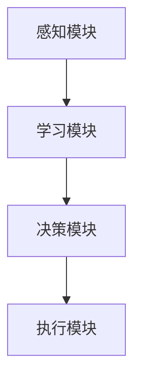

# 神经科学启发的AI Agent认知模型设计

> 关键词：神经科学、AI Agent、认知模型、神经网络、人工智能、学习机制、决策机制

> 摘要：本文聚焦于神经科学启发的AI Agent认知模型设计。首先介绍相关背景知识，明确目的、预期读者等内容。接着阐述核心概念与联系，通过文本示意图和Mermaid流程图展示其架构原理。详细讲解核心算法原理及具体操作步骤，用Python代码进行说明。同时给出数学模型和公式，并举例阐释。通过项目实战，展示代码实际案例并深入解释。探讨实际应用场景，推荐相关工具和资源。最后总结未来发展趋势与挑战，提供常见问题解答及参考资料，旨在为构建更智能、类人化的AI Agent提供全面且深入的技术指导。

## 1. 背景介绍 
### 1.1 目的和范围
本研究的主要目的是设计一种基于神经科学启发的AI Agent认知模型。在人工智能领域，当前的AI系统虽然在某些特定任务上表现出色，但与人类的认知能力相比仍存在巨大差距。通过借鉴神经科学的原理和机制，我们希望设计出的认知模型能够让AI Agent具备更接近人类的感知、学习、决策等认知能力。

本研究的范围涵盖了从神经科学原理的分析，到AI Agent认知模型的设计、算法实现，再到实际应用场景的探讨。我们将深入研究神经科学中的神经元结构、神经信号传递、大脑学习和决策机制等，并将这些原理应用到AI Agent的设计中。同时，我们会通过实际的代码案例来验证模型的可行性和有效性，并探讨该模型在不同领域的应用前景。

### 1.2 预期读者
本文预期读者包括人工智能领域的研究人员、开发者、学生，以及对神经科学和人工智能交叉领域感兴趣的专业人士。对于研究人员，本文可以为他们的研究提供新的思路和方法；对于开发者，能够帮助他们在实际项目中应用神经科学启发的技术；对于学生，有助于他们深入理解人工智能和神经科学的结合点，拓宽知识面。

### 1.3 文档结构概述
本文首先介绍研究的背景知识，包括目的、预期读者和文档结构概述等内容。接着详细阐述核心概念与联系，通过文本示意图和Mermaid流程图展示AI Agent认知模型的架构原理。然后讲解核心算法原理及具体操作步骤，使用Python代码进行详细说明。随后给出数学模型和公式，并举例进行详细讲解。通过项目实战，展示代码实际案例并进行深入解释。探讨该模型的实际应用场景，推荐相关的工具和资源。最后总结未来发展趋势与挑战，提供常见问题解答及参考资料。

### 1.4 术语表
#### 1.4.1 核心术语定义
- **AI Agent**：即人工智能智能体，是一种能够感知环境、根据感知信息进行决策并采取行动的实体。它可以是软件程序、机器人等。
- **认知模型**：对人类认知过程的一种抽象和建模，用于描述和模拟人类的感知、学习、记忆、决策等认知能力。
- **神经科学**：研究神经系统的结构、功能、发育、演化等方面的科学，为理解人类认知提供了生物学基础。

#### 1.4.2 相关概念解释
- **神经元**：神经系统的基本结构和功能单位，能够接收、处理和传递信息。神经元之间通过突触相互连接，形成复杂的神经网络。
- **神经可塑性**：指神经系统在经历学习、经验等过程中，其结构和功能发生改变的能力。这是大脑学习和适应环境的重要机制。
- **强化学习**：一种机器学习方法，智能体通过与环境进行交互，根据环境反馈的奖励信号来学习最优的行为策略。

#### 1.4.3 缩略词列表
- **ANN**：Artificial Neural Network，人工神经网络
- **RL**：Reinforcement Learning，强化学习
- **SNN**：Spiking Neural Network，脉冲神经网络

## 2. 核心概念与联系 
### 2.1 神经科学原理
神经科学揭示了人类大脑的复杂结构和功能。大脑由大量的神经元组成，神经元之间通过突触相互连接，形成了庞大而复杂的神经网络。神经元具有接收、处理和传递信息的能力，其工作过程可以分为以下几个步骤：
1. **信息接收**：神经元通过树突接收来自其他神经元的信号。
2. **信息处理**：神经元对接收的信号进行整合和处理，如果信号强度超过一定阈值，神经元就会产生动作电位。
3. **信息传递**：动作电位通过轴突传递到其他神经元，通过突触将信号传递给下一个神经元。

神经可塑性是神经科学中的一个重要概念，它指的是大脑在经历学习、经验等过程中，其结构和功能发生改变的能力。神经可塑性使得大脑能够适应不同的环境和任务需求，是人类学习和记忆的生物学基础。

### 2.2 AI Agent认知模型的架构原理
基于神经科学的原理，我们可以设计出AI Agent的认知模型。该模型主要包括感知模块、学习模块、决策模块和执行模块。

- **感知模块**：负责感知环境信息，类似于神经元的信息接收功能。它可以通过各种传感器（如摄像头、麦克风等）获取环境数据，并将其转换为AI Agent能够处理的信息。
- **学习模块**：用于学习环境的规律和模式，类似于大脑的学习和记忆功能。它可以采用各种机器学习算法（如深度学习、强化学习等）来更新AI Agent的知识和策略。
- **决策模块**：根据感知信息和学习到的知识，做出决策，类似于神经元的信息处理和决策功能。它可以采用决策树、神经网络等方法来生成决策结果。
- **执行模块**：根据决策结果采取行动，类似于神经元的信息传递和动作执行功能。它可以控制机器人的运动、软件程序的操作等。

### 2.3 文本示意图
```plaintext
         +----------------+
         |   感知模块   |
         +----------------+
                |
                v
         +----------------+
         |   学习模块   |
         +----------------+
                |
                v
         +----------------+
         |   决策模块   |
         +----------------+
                |
                v
         +----------------+
         |   执行模块   |
         +----------------+
```

### 2.4 Mermaid流程图


## 3. 核心算法原理 & 具体操作步骤 
### 3.1 感知模块算法原理
感知模块的主要任务是将环境信息转换为AI Agent能够处理的特征向量。这里我们以图像感知为例，介绍一种基于卷积神经网络（CNN）的感知算法。

卷积神经网络是一种专门用于处理具有网格结构数据（如图像）的深度学习模型。它通过卷积层、池化层和全连接层等组件，自动提取图像的特征。

以下是一个使用Python和PyTorch实现的简单卷积神经网络示例：
```python
import torch
import torch.nn as nn

class SimpleCNN(nn.Module):
    def __init__(self):
        super(SimpleCNN, self).__init__()
        self.conv1 = nn.Conv2d(3, 16, kernel_size=3, padding=1)
        self.relu1 = nn.ReLU()
        self.pool1 = nn.MaxPool2d(kernel_size=2, stride=2)
        self.conv2 = nn.Conv2d(16, 32, kernel_size=3, padding=1)
        self.relu2 = nn.ReLU()
        self.pool2 = nn.MaxPool2d(kernel_size=2, stride=2)
        self.fc1 = nn.Linear(32 * 8 * 8, 128)
        self.relu3 = nn.ReLU()
        self.fc2 = nn.Linear(128, 10)

    def forward(self, x):
        x = self.pool1(self.relu1(self.conv1(x)))
        x = self.pool2(self.relu2(self.conv2(x)))
        x = x.view(-1, 32 * 8 * 8)
        x = self.relu3(self.fc1(x))
        x = self.fc2(x)
        return x
```
### 3.2 学习模块算法原理
学习模块的主要任务是根据感知模块提供的信息，学习环境的规律和模式。这里我们以强化学习为例，介绍一种基于深度Q网络（DQN）的学习算法。

深度Q网络是一种结合了深度学习和强化学习的算法，它通过神经网络来近似Q值函数，从而实现智能体的学习和决策。

以下是一个使用Python和PyTorch实现的简单深度Q网络示例：
```python
import torch
import torch.nn as nn
import torch.optim as optim
import numpy as np

class DQN(nn.Module):
    def __init__(self, input_dim, output_dim):
        super(DQN, self).__init__()
        self.fc1 = nn.Linear(input_dim, 64)
        self.relu = nn.ReLU()
        self.fc2 = nn.Linear(64, output_dim)

    def forward(self, x):
        x = self.relu(self.fc1(x))
        x = self.fc2(x)
        return x

# 定义超参数
gamma = 0.99
epsilon = 0.1
learning_rate = 0.001

# 初始化网络和优化器
input_dim = 4
output_dim = 2
dqn = DQN(input_dim, output_dim)
optimizer = optim.Adam(dqn.parameters(), lr=learning_rate)

# 定义损失函数
criterion = nn.MSELoss()

# 训练循环
for episode in range(1000):
    state = np.random.rand(input_dim)
    state = torch.FloatTensor(state).unsqueeze(0)
    if np.random.rand() < epsilon:
        action = np.random.randint(0, output_dim)
    else:
        q_values = dqn(state)
        action = torch.argmax(q_values).item()
    # 模拟环境反馈
    next_state = np.random.rand(input_dim)
    next_state = torch.FloatTensor(next_state).unsqueeze(0)
    reward = np.random.rand()
    done = np.random.rand() < 0.1
    if done:
        target = reward
    else:
        next_q_values = dqn(next_state)
        max_next_q_value = torch.max(next_q_values).item()
        target = reward + gamma * max_next_q_value
    q_values = dqn(state)
    q_value = q_values[0][action]
    loss = criterion(q_value, torch.FloatTensor([target]))
    optimizer.zero_grad()
    loss.backward()
    optimizer.step()
```
### 3.3 决策模块算法原理
决策模块的主要任务是根据学习模块提供的信息，做出最优的决策。这里我们以贪心策略为例，介绍一种简单的决策算法。

贪心策略是一种在每个时间步都选择当前最优行动的策略。在深度Q网络中，我们可以根据Q值函数选择具有最大Q值的行动。

以下是一个使用Python实现的贪心策略示例：
```python
import torch

def greedy_policy(q_values):
    action = torch.argmax(q_values).item()
    return action
```
### 3.4 执行模块算法原理
执行模块的主要任务是根据决策模块提供的决策结果，采取相应的行动。这里我们以模拟机器人运动为例，介绍一种简单的执行算法。

以下是一个使用Python实现的模拟机器人运动示例：
```python
def execute_action(action):
    if action == 0:
        print("机器人向前移动")
    elif action == 1:
        print("机器人向后移动")
```

## 4. 数学模型和公式 & 详细讲解 & 举例说明 
### 4.1 卷积神经网络数学模型
卷积神经网络的核心操作是卷积运算。卷积运算可以用以下公式表示：
$$y_{i,j}^k = \sum_{m=0}^{M-1} \sum_{n=0}^{N-1} x_{i+m,j+n}^l \cdot w_{m,n}^{k,l} + b^k$$
其中，$x_{i,j}^l$ 表示第 $l$ 层的输入特征图在位置 $(i,j)$ 处的值，$w_{m,n}^{k,l}$ 表示第 $l$ 层到第 $k$ 层的卷积核在位置 $(m,n)$ 处的值，$b^k$ 表示第 $k$ 层的偏置，$y_{i,j}^k$ 表示第 $k$ 层的输出特征图在位置 $(i,j)$ 处的值。

例如，假设输入特征图 $x$ 是一个 $3\times3$ 的矩阵，卷积核 $w$ 是一个 $2\times2$ 的矩阵，偏置 $b = 1$，则卷积运算的过程如下：
```plaintext
输入特征图 x:
[[1, 2, 3],
 [4, 5, 6],
 [7, 8, 9]]

卷积核 w:
[[1, 2],
 [3, 4]]

卷积运算结果 y:
[[1*1 + 2*2 + 4*3 + 5*4 + 1, 2*1 + 3*2 + 5*3 + 6*4 + 1],
 [4*1 + 5*2 + 7*3 + 8*4 + 1, 5*1 + 6*2 + 8*3 + 9*4 + 1]]
```

### 4.2 深度Q网络数学模型
深度Q网络的目标是学习一个Q值函数 $Q(s,a)$，表示在状态 $s$ 下采取行动 $a$ 的预期累积奖励。Q值函数可以通过以下贝尔曼方程进行更新：
$$Q(s,a) \leftarrow Q(s,a) + \alpha \left[ r + \gamma \max_{a'} Q(s',a') - Q(s,a) \right]$$
其中，$\alpha$ 是学习率，$r$ 是当前奖励，$\gamma$ 是折扣因子，$s'$ 是下一个状态。

例如，假设当前状态 $s$，采取行动 $a$ 后获得奖励 $r = 1$，下一个状态 $s'$ 的最大Q值 $\max_{a'} Q(s',a') = 2$，当前Q值 $Q(s,a) = 0.5$，学习率 $\alpha = 0.1$，折扣因子 $\gamma = 0.9$，则更新后的Q值为：
$$Q(s,a) = 0.5 + 0.1 \times (1 + 0.9 \times 2 - 0.5) = 0.5 + 0.1 \times (1 + 1.8 - 0.5) = 0.5 + 0.1 \times 2.3 = 0.73$$

### 4.3 贪心策略数学模型
贪心策略可以用以下公式表示：
$$a^* = \arg \max_{a} Q(s,a)$$
其中，$a^*$ 表示最优行动，$Q(s,a)$ 表示在状态 $s$ 下采取行动 $a$ 的Q值。

例如，假设在状态 $s$ 下，Q值函数 $Q(s,a)$ 的值为 $Q(s,0) = 0.2$，$Q(s,1) = 0.5$，$Q(s,2) = 0.3$，则根据贪心策略，最优行动 $a^* = 1$。

## 5. 项目实战：代码实际案例和详细解释说明 
### 5.1  开发环境搭建
本项目使用Python作为开发语言，主要使用的库包括PyTorch、NumPy等。以下是搭建开发环境的步骤：
1. **安装Python**：从Python官方网站（https://www.python.org/downloads/）下载并安装Python 3.7或以上版本。
2. **创建虚拟环境**：使用以下命令创建一个虚拟环境：
```sh
python -m venv myenv
```
3. **激活虚拟环境**：
- 在Windows系统上，使用以下命令激活虚拟环境：
```sh
myenv\Scripts\activate
```
- 在Linux或Mac系统上，使用以下命令激活虚拟环境：
```sh
source myenv/bin/activate
```
4. **安装依赖库**：使用以下命令安装所需的依赖库：
```sh
pip install torch numpy
```

### 5.2  源代码详细实现和代码解读
以下是一个完整的基于神经科学启发的AI Agent认知模型的代码示例：
```python
import torch
import torch.nn as nn
import torch.optim as optim
import numpy as np

# 定义感知模块（简单卷积神经网络）
class SimpleCNN(nn.Module):
    def __init__(self):
        super(SimpleCNN, self).__init__()
        self.conv1 = nn.Conv2d(3, 16, kernel_size=3, padding=1)
        self.relu1 = nn.ReLU()
        self.pool1 = nn.MaxPool2d(kernel_size=2, stride=2)
        self.conv2 = nn.Conv2d(16, 32, kernel_size=3, padding=1)
        self.relu2 = nn.ReLU()
        self.pool2 = nn.MaxPool2d(kernel_size=2, stride=2)
        self.fc1 = nn.Linear(32 * 8 * 8, 128)
        self.relu3 = nn.ReLU()
        self.fc2 = nn.Linear(128, 10)

    def forward(self, x):
        x = self.pool1(self.relu1(self.conv1(x)))
        x = self.pool2(self.relu2(self.conv2(x)))
        x = x.view(-1, 32 * 8 * 8)
        x = self.relu3(self.fc1(x))
        x = self.fc2(x)
        return x

# 定义学习模块（深度Q网络）
class DQN(nn.Module):
    def __init__(self, input_dim, output_dim):
        super(DQN, self).__init__()
        self.fc1 = nn.Linear(input_dim, 64)
        self.relu = nn.ReLU()
        self.fc2 = nn.Linear(64, output_dim)

    def forward(self, x):
        x = self.relu(self.fc1(x))
        x = self.fc2(x)
        return x

# 定义贪心策略
def greedy_policy(q_values):
    action = torch.argmax(q_values).item()
    return action

# 定义执行模块
def execute_action(action):
    if action == 0:
        print("机器人向前移动")
    elif action == 1:
        print("机器人向后移动")

# 定义超参数
gamma = 0.99
epsilon = 0.1
learning_rate = 0.001

# 初始化感知模块
perception_module = SimpleCNN()

# 初始化学习模块
input_dim = 10
output_dim = 2
learning_module = DQN(input_dim, output_dim)
optimizer = optim.Adam(learning_module.parameters(), lr=learning_rate)
criterion = nn.MSELoss()

# 训练循环
for episode in range(1000):
    # 模拟感知过程
    input_image = torch.randn(1, 3, 32, 32)
    features = perception_module(input_image)
    state = features.detach().numpy().flatten()
    state = torch.FloatTensor(state).unsqueeze(0)

    # 决策过程
    if np.random.rand() < epsilon:
        action = np.random.randint(0, output_dim)
    else:
        q_values = learning_module(state)
        action = greedy_policy(q_values)

    # 执行动作
    execute_action(action)

    # 模拟环境反馈
    next_input_image = torch.randn(1, 3, 32, 32)
    next_features = perception_module(next_input_image)
    next_state = next_features.detach().numpy().flatten()
    next_state = torch.FloatTensor(next_state).unsqueeze(0)
    reward = np.random.rand()
    done = np.random.rand() < 0.1

    # 更新Q值
    if done:
        target = reward
    else:
        next_q_values = learning_module(next_state)
        max_next_q_value = torch.max(next_q_values).item()
        target = reward + gamma * max_next_q_value
    q_values = learning_module(state)
    q_value = q_values[0][action]
    loss = criterion(q_value, torch.FloatTensor([target]))
    optimizer.zero_grad()
    loss.backward()
    optimizer.step()
```
### 5.3  代码解读与分析
- **感知模块**：使用简单的卷积神经网络（SimpleCNN）对输入的图像进行特征提取。通过卷积层、池化层和全连接层，将图像转换为特征向量。
- **学习模块**：使用深度Q网络（DQN）学习环境的规律和模式。通过与环境的交互，根据奖励信号更新Q值函数。
- **决策模块**：使用贪心策略根据Q值函数选择最优行动。
- **执行模块**：根据决策结果采取相应的行动，这里模拟了机器人的移动。

在训练循环中，首先通过感知模块获取环境信息，然后根据贪心策略或随机策略选择行动，执行行动后获取环境反馈，最后根据反馈更新Q值函数。

## 6. 实际应用场景 
### 6.1 机器人领域
在机器人领域，基于神经科学启发的AI Agent认知模型可以让机器人具备更智能的感知、学习和决策能力。例如，机器人可以通过感知模块识别环境中的物体和障碍物，通过学习模块学习如何避开障碍物和完成任务，通过决策模块选择最优的行动策略，通过执行模块控制机器人的运动。

### 6.2 自动驾驶领域
在自动驾驶领域，AI Agent认知模型可以用于车辆的感知、决策和控制。车辆可以通过感知模块获取道路、交通信号、其他车辆等信息，通过学习模块学习交通规则和驾驶策略，通过决策模块选择最优的驾驶行为，通过执行模块控制车辆的加速、刹车和转向。

### 6.3 智能客服领域
在智能客服领域，AI Agent认知模型可以用于理解用户的问题、提供准确的回答和建议。客服系统可以通过感知模块识别用户的语音或文本信息，通过学习模块学习用户的语言习惯和问题模式，通过决策模块选择最优的回答策略，通过执行模块输出回答内容。

### 6.4 游戏领域
在游戏领域，AI Agent认知模型可以用于开发智能的游戏角色。游戏角色可以通过感知模块感知游戏环境和其他角色的状态，通过学习模块学习游戏规则和策略，通过决策模块选择最优的行动，通过执行模块控制游戏角色的行为。

## 7. 工具和资源推荐
### 7.1 学习资源推荐
#### 7.1.1 书籍推荐
- 《深度学习》（Deep Learning）：由Ian Goodfellow、Yoshua Bengio和Aaron Courville所著，是深度学习领域的经典教材，全面介绍了深度学习的理论和应用。
- 《神经网络与深度学习》（Neural Networks and Deep Learning）：由Michael Nielsen所著，以通俗易懂的方式介绍了神经网络和深度学习的基本原理和算法。
- 《神经科学：探索脑》（Neuroscience: Exploring the Brain）：由Mark F. Bear、Barry W. Connors和Michael A. Paradiso所著，是神经科学领域的经典教材，详细介绍了神经系统的结构和功能。

#### 7.1.2 在线课程
- Coursera上的“深度学习专项课程”（Deep Learning Specialization）：由Andrew Ng教授授课，包括深度学习的基础、卷积神经网络、循环神经网络等内容。
- edX上的“神经科学基础”（Fundamentals of Neuroscience）：由哈佛大学的教授授课，介绍了神经科学的基本概念和研究方法。
- Udemy上的“强化学习实战”（Reinforcement Learning in Action）：通过实际案例介绍了强化学习的算法和应用。

#### 7.1.3 技术博客和网站
- Medium：是一个技术博客平台，有很多关于人工智能、神经科学等领域的优质文章。
- arXiv：是一个预印本数据库，提供了大量关于人工智能、神经科学等领域的最新研究成果。
- OpenAI博客：OpenAI发布的关于人工智能研究和应用的博客，提供了很多前沿的技术和观点。

### 7.2 开发工具框架推荐
#### 7.2.1 IDE和编辑器
- PyCharm：是一款专门为Python开发设计的集成开发环境，提供了丰富的功能和工具，方便开发者进行代码编写、调试和管理。
- Jupyter Notebook：是一个交互式的开发环境，适合进行数据探索、模型训练和可视化等工作。
- Visual Studio Code：是一款轻量级的代码编辑器，支持多种编程语言和插件，具有良好的扩展性。

#### 7.2.2 调试和性能分析工具
- PyTorch Profiler：是PyTorch提供的性能分析工具，可以帮助开发者分析模型的性能瓶颈，优化代码。
- TensorBoard：是TensorFlow提供的可视化工具，也可以用于PyTorch模型的可视化和调试。
- cProfile：是Python内置的性能分析工具，可以帮助开发者分析代码的性能瓶颈。

#### 7.2.3 相关框架和库
- PyTorch：是一个开源的深度学习框架，提供了丰富的深度学习模型和工具，支持GPU加速。
- NumPy：是Python中用于科学计算的基础库，提供了高效的数组操作和数学函数。
- OpenAI Gym：是一个开源的强化学习环境库，提供了多种不同的强化学习任务和环境。

### 7.3 相关论文著作推荐
#### 7.3.1 经典论文
- “Playing Atari with Deep Reinforcement Learning”：介绍了深度Q网络（DQN）算法，是强化学习领域的经典论文。
- “ImageNet Classification with Deep Convolutional Neural Networks”：介绍了AlexNet卷积神经网络，开创了深度学习在图像分类领域的先河。
- “A Logical Calculus of the Ideas Immanent in Nervous Activity”：是神经科学领域的经典论文，提出了神经元的数学模型。

#### 7.3.2 最新研究成果
- 关注顶级学术会议（如NeurIPS、ICML、CVPR等）上的最新研究成果，了解神经科学启发的AI Agent认知模型的最新进展。
- 关注顶级学术期刊（如Nature、Science、Journal of Neuroscience等）上的相关研究论文。

#### 7.3.3 应用案例分析
- 研究一些实际应用案例，如自动驾驶汽车、智能机器人等，了解神经科学启发的AI Agent认知模型在实际应用中的实现和优化方法。

## 8. 总结：未来发展趋势与挑战
### 8.1 未来发展趋势
- **更加类人化**：未来的AI Agent认知模型将更加接近人类的认知机制，具备更强的感知、学习、推理和决策能力。例如，能够像人类一样理解复杂的语义信息、进行情感感知和表达等。
- **多模态融合**：将多种感知方式（如视觉、听觉、触觉等）进行融合，使AI Agent能够更全面地感知环境信息，提高其认知能力和适应性。
- **与其他技术的融合**：与物联网、区块链、量子计算等技术进行融合，拓展AI Agent的应用场景和功能。例如，在物联网环境中实现智能设备的自主协作和管理。

### 8.2 挑战
- **神经科学原理的理解和应用**：虽然神经科学已经取得了很大的进展，但我们对人类大脑的认知机制仍然存在很多未知。如何将神经科学的原理准确地应用到AI Agent的设计中，是一个巨大的挑战。
- **计算资源的限制**：基于神经科学启发的AI Agent认知模型通常需要大量的计算资源来训练和运行。如何在有限的计算资源下实现高效的模型训练和推理，是需要解决的问题。
- **伦理和安全问题**：随着AI Agent的智能化程度不断提高，其伦理和安全问题也越来越受到关注。例如，AI Agent的决策可能会对人类产生影响，如何确保其决策的公正性和安全性是一个重要的挑战。

## 9. 附录：常见问题与解答
### 9.1 如何选择合适的神经科学原理应用到AI Agent设计中？
选择合适的神经科学原理需要根据AI Agent的具体任务和应用场景来确定。首先，需要对任务和场景进行分析，了解其对认知能力的需求。然后，研究神经科学中与这些认知能力相关的原理和机制。例如，如果任务需要智能体具备学习和记忆能力，可以参考神经可塑性的原理；如果任务需要智能体进行决策，可以参考大脑的决策机制。

### 9.2 如何解决AI Agent认知模型的计算资源问题？
可以采用以下方法解决计算资源问题：
- **模型优化**：通过优化模型结构、减少参数数量等方法，降低模型的计算复杂度。
- **硬件加速**：使用GPU、TPU等硬件加速设备，提高模型的训练和推理速度。
- **分布式计算**：采用分布式计算技术，将计算任务分配到多个计算节点上进行处理，提高计算效率。

### 9.3 如何确保AI Agent认知模型的伦理和安全？
可以从以下几个方面确保AI Agent认知模型的伦理和安全：
- **算法设计**：在算法设计中考虑伦理和安全因素，例如设计公平性约束、避免偏见等。
- **数据管理**：确保训练数据的质量和安全性，避免使用含有偏见或敏感信息的数据。
- **监管和评估**：建立监管机制，对AI Agent的行为进行评估和监督，及时发现和解决伦理和安全问题。

## 10. 扩展阅读 & 参考资料
- Goodfellow, I., Bengio, Y., & Courville, A. (2016). Deep Learning. MIT Press.
- Nielsen, M. A. (2015). Neural Networks and Deep Learning. Determination Press.
- Bear, M. F., Connors, B. W., & Paradiso, M. A. (2015). Neuroscience: Exploring the Brain. Lippincott Williams & Wilkins.
- Mnih, V., Kavukcuoglu, K., Silver, D., et al. (2013). Playing Atari with Deep Reinforcement Learning. arXiv preprint arXiv:1312.5602.
- Krizhevsky, A., Sutskever, I., & Hinton, G. E. (2012). ImageNet Classification with Deep Convolutional Neural Networks. Advances in neural information processing systems.
- McCulloch, W. S., & Pitts, W. (1943). A Logical Calculus of the Ideas Immanent in Nervous Activity. The bulletin of mathematical biophysics, 5(4), 115-133.