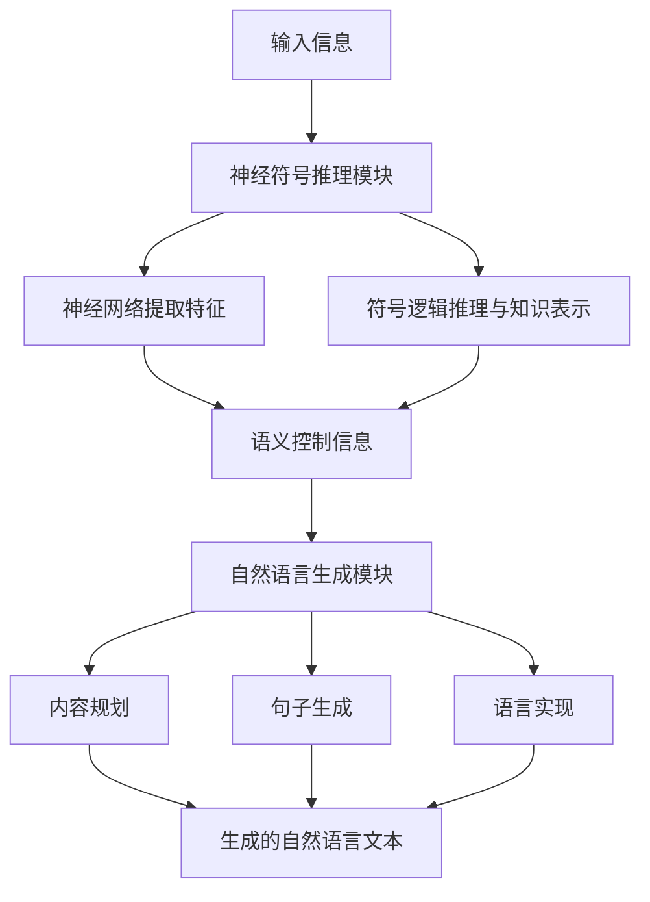

# 神经符号推理在自然语言生成中的语义控制技术研究

> 关键词：神经符号推理、自然语言生成、语义控制、符号逻辑、神经网络

> 摘要：本文聚焦于神经符号推理在自然语言生成中的语义控制技术。首先介绍了该研究的背景和相关概念，阐述了神经符号推理与自然语言生成的核心原理及联系。详细讲解了核心算法原理，通过 Python 代码进行具体实现步骤的说明，同时给出了相关的数学模型和公式并举例。结合项目实战，展示了代码的实际案例及详细解释。探讨了该技术的实际应用场景，推荐了学习资源、开发工具框架以及相关论文著作。最后总结了未来发展趋势与挑战，提供了常见问题解答和扩展阅读参考资料，旨在为该领域的研究和实践提供全面且深入的指导。

## 1. 背景介绍 
### 1.1 目的和范围
自然语言生成（Natural Language Generation, NLG）作为自然语言处理领域的重要分支，旨在将非语言形式的信息转化为自然语言文本。然而，传统的 NLG 方法在语义控制方面存在一定的局限性，生成的文本可能在语义准确性、逻辑性和连贯性上有所欠缺。神经符号推理结合了神经网络强大的学习能力和符号逻辑的精确推理能力，为解决 NLG 中的语义控制问题提供了新的思路。本研究的目的在于深入探讨神经符号推理在自然语言生成中的语义控制技术，范围涵盖相关理论、算法、实现以及应用等多个方面。

### 1.2 预期读者
本文预期读者包括自然语言处理领域的研究人员、对人工智能技术有深入兴趣的开发者、相关专业的学生以及关注自然语言生成技术发展的从业者。通过阅读本文，读者能够全面了解神经符号推理在自然语言生成语义控制方面的原理、方法和应用，为进一步的研究和实践提供参考。

### 1.3 文档结构概述
本文首先介绍研究的背景信息，包括目的、预期读者和文档结构。接着阐述神经符号推理和自然语言生成的核心概念及它们之间的联系，通过文本示意图和 Mermaid 流程图进行直观展示。然后详细讲解核心算法原理，并使用 Python 代码说明具体操作步骤。给出相关的数学模型和公式，并结合实际例子进行解释。通过项目实战展示代码的实际应用和详细解读。探讨该技术的实际应用场景，推荐学习资源、开发工具框架和相关论文著作。最后总结未来发展趋势与挑战，提供常见问题解答和扩展阅读参考资料。

### 1.4 术语表
#### 1.4.1 核心术语定义
- **神经符号推理（Neural-Symbolic Reasoning）**：将神经网络的学习能力与符号逻辑的推理能力相结合的一种推理方法，旨在利用神经网络处理非结构化数据，同时借助符号逻辑进行精确的知识表示和推理。
- **自然语言生成（Natural Language Generation, NLG）**：将非语言形式的信息（如数据、知识、意图等）转换为自然语言文本的过程。
- **语义控制（Semantic Control）**：在自然语言生成过程中，对生成文本的语义内容进行精确控制，确保生成的文本符合预期的语义要求，包括语义准确性、逻辑性和连贯性等。

#### 1.4.2 相关概念解释
- **神经网络（Neural Network）**：一种模仿人类神经系统的计算模型，由大量的神经元组成，通过对数据的学习来自动提取特征和模式。
- **符号逻辑（Symbolic Logic）**：用符号和规则来表示和处理逻辑关系的一种方法，能够进行精确的推理和知识表示。
- **知识图谱（Knowledge Graph）**：一种结构化的语义网络，用于表示实体、概念及其之间的关系，为自然语言处理提供丰富的知识支持。

#### 1.4.3 缩略词列表
- **NLG**：Natural Language Generation（自然语言生成）
- **NN**：Neural Network（神经网络）
- **KG**：Knowledge Graph（知识图谱）

## 2. 核心概念与联系 

### 神经符号推理原理
神经符号推理结合了神经网络和符号逻辑的优势。神经网络具有强大的模式识别和学习能力，能够处理非结构化的数据，如文本、图像等。符号逻辑则能够进行精确的推理和知识表示，通过定义明确的规则和符号来处理逻辑关系。神经符号推理的核心思想是将神经网络学习到的特征与符号逻辑的推理过程相结合，实现更强大的推理能力。

### 自然语言生成原理
自然语言生成是一个复杂的过程，通常包括内容规划、句子生成和语言实现等阶段。在内容规划阶段，系统根据输入的信息确定要表达的内容和结构；在句子生成阶段，将内容规划的结果转换为句子结构；在语言实现阶段，将句子结构转换为自然语言文本。

### 两者的联系
神经符号推理在自然语言生成中的语义控制方面发挥着重要作用。通过神经符号推理，可以将符号逻辑中的语义知识引入到自然语言生成过程中，从而实现对生成文本语义的精确控制。例如，利用知识图谱中的语义信息，结合神经网络的学习能力，在生成文本时确保生成的内容符合语义逻辑和知识约束。

### 文本示意图
神经符号推理与自然语言生成的关系可以用以下示意图表示：

```plaintext
输入信息（数据、知识、意图等）
    |
    v
神经符号推理模块
    - 神经网络提取特征
    - 符号逻辑进行推理和知识表示
    |
    v
语义控制信息
    |
    v
自然语言生成模块
    - 内容规划
    - 句子生成
    - 语言实现
    |
    v
生成的自然语言文本
```

### Mermaid 流程图


## 3. 核心算法原理 & 具体操作步骤 

### 核心算法原理
神经符号推理在自然语言生成中的语义控制算法主要包括以下几个步骤：

1. **特征提取**：使用神经网络对输入信息进行特征提取。例如，对于文本输入，可以使用预训练的语言模型（如 BERT）提取文本的语义特征。
2. **知识表示**：将符号逻辑中的知识（如知识图谱）进行表示，以便与神经网络提取的特征进行融合。
3. **推理过程**：结合神经网络提取的特征和符号逻辑的知识表示，进行推理操作，生成语义控制信息。
4. **自然语言生成**：根据语义控制信息，使用自然语言生成模型生成符合语义要求的文本。

### 具体操作步骤及 Python 代码实现

#### 步骤 1：特征提取
我们使用 Hugging Face 的 Transformers 库来加载预训练的 BERT 模型进行文本特征提取。

```python
from transformers import AutoTokenizer, AutoModel
import torch

# 加载预训练的 BERT 模型和分词器
tokenizer = AutoTokenizer.from_pretrained('bert-base-uncased')
model = AutoModel.from_pretrained('bert-base-uncased')

# 输入文本
text = "This is a sample sentence."

# 对文本进行分词
inputs = tokenizer(text, return_tensors='pt')

# 提取特征
with torch.no_grad():
    outputs = model(**inputs)

# 获取最后一层的隐藏状态作为特征
features = outputs.last_hidden_state
print(features.shape)
```

#### 步骤 2：知识表示
假设我们有一个简单的知识图谱，用字典来表示实体之间的关系。

```python
# 简单的知识图谱示例
knowledge_graph = {
    "apple": ["fruit", "red"],
    "banana": ["fruit", "yellow"]
}

# 定义一个函数来获取实体的知识表示
def get_knowledge_representation(entity):
    if entity in knowledge_graph:
        return knowledge_graph[entity]
    else:
        return []

# 示例：获取 "apple" 的知识表示
apple_knowledge = get_knowledge_representation("apple")
print(apple_knowledge)
```

#### 步骤 3：推理过程
我们将神经网络提取的特征和知识表示进行融合，然后进行简单的推理操作。

```python
# 假设我们有一个简单的推理函数，根据知识表示和特征进行推理
def reasoning(features, knowledge):
    # 这里只是一个简单的示例，实际中需要更复杂的推理逻辑
    if "fruit" in knowledge:
        # 假设根据特征和知识判断生成一个语义控制信息
        semantic_control_info = "The entity is a fruit."
    else:
        semantic_control_info = "The entity is not a fruit."
    return semantic_control_info

# 示例：进行推理
semantic_control = reasoning(features, apple_knowledge)
print(semantic_control)
```

#### 步骤 4：自然语言生成
我们使用 GPT-2 模型进行自然语言生成，根据语义控制信息生成文本。

```python
from transformers import GPT2LMHeadModel, GPT2Tokenizer

# 加载 GPT-2 模型和分词器
gpt_tokenizer = GPT2Tokenizer.from_pretrained('gpt2')
gpt_model = GPT2LMHeadModel.from_pretrained('gpt2')

# 将语义控制信息作为输入
input_text = semantic_control
input_ids = gpt_tokenizer.encode(input_text, return_tensors='pt')

# 生成文本
output = gpt_model.generate(input_ids, max_length=50, num_return_sequences=1)

# 解码生成的文本
generated_text = gpt_tokenizer.decode(output[0], skip_special_tokens=True)
print(generated_text)
```

## 4. 数学模型和公式 & 详细讲解 & 举例说明 

### 特征提取的数学模型
在使用神经网络进行特征提取时，通常使用的是深度学习中的前馈神经网络。以 BERT 模型为例，输入的文本经过分词后转换为词向量序列 $\mathbf{x} = [\mathbf{x}_1, \mathbf{x}_2, \cdots, \mathbf{x}_n]$，其中 $\mathbf{x}_i$ 是第 $i$ 个词的词向量。BERT 模型通过多层的 Transformer 编码器对输入的词向量序列进行处理，得到隐藏状态序列 $\mathbf{h} = [\mathbf{h}_1, \mathbf{h}_2, \cdots, \mathbf{h}_n]$，其中 $\mathbf{h}_i$ 是第 $i$ 个词的隐藏状态。

数学公式表示为：
$$\mathbf{h}_l = \text{TransformerEncoder}(\mathbf{h}_{l-1})$$
其中 $\mathbf{h}_0 = \mathbf{x}$，$l$ 表示 Transformer 编码器的层数。

### 知识表示的数学模型
知识图谱可以用图 $G = (V, E)$ 表示，其中 $V$ 是节点集合，$E$ 是边集合。节点表示实体或概念，边表示实体或概念之间的关系。对于一个实体 $v \in V$，其知识表示可以用一个向量 $\mathbf{k}_v$ 表示，该向量包含了与该实体相关的所有信息。

例如，对于实体 “apple”，其知识表示 $\mathbf{k}_{\text{apple}}$ 可以表示为：
$$\mathbf{k}_{\text{apple}} = [\text{fruit}, \text{red}]$$

### 推理过程的数学模型
推理过程可以看作是一个函数 $f$，它接受神经网络提取的特征 $\mathbf{h}$ 和知识表示 $\mathbf{k}$ 作为输入，输出语义控制信息 $\mathbf{s}$。

数学公式表示为：
$$\mathbf{s} = f(\mathbf{h}, \mathbf{k})$$

例如，在前面的示例中，推理函数 $f$ 可以定义为：
$$f(\mathbf{h}, \mathbf{k}) = \begin{cases}
\text{"The entity is a fruit."} & \text{if "fruit" in } \mathbf{k} \\
\text{"The entity is not a fruit."} & \text{otherwise}
\end{cases}$$

### 自然语言生成的数学模型
自然语言生成可以看作是一个概率模型，给定输入信息 $\mathbf{x}$ 和语义控制信息 $\mathbf{s}$，生成文本 $\mathbf{y}$ 的概率为 $P(\mathbf{y} | \mathbf{x}, \mathbf{s})$。

以 GPT-2 模型为例，它通过自回归的方式生成文本，即根据前面已经生成的词预测下一个词的概率。数学公式表示为：
$$P(y_t | y_1, y_2, \cdots, y_{t-1}, \mathbf{x}, \mathbf{s})$$
其中 $y_t$ 是第 $t$ 个词。

### 举例说明
假设我们有输入文本 “I like apples.”，经过 BERT 模型提取特征后得到特征向量 $\mathbf{h}$。“apple” 的知识表示为 $\mathbf{k}_{\text{apple}} = [\text{fruit}, \text{red}]$。通过推理函数 $f$，得到语义控制信息 $\mathbf{s} = \text{"The entity is a fruit."}$。然后将 $\mathbf{s}$ 作为输入，使用 GPT-2 模型生成文本，例如生成 “Apples are delicious fruits.”。

## 5. 项目实战：代码实际案例和详细解释说明 

### 5.1  开发环境搭建
#### 安装 Python
首先，确保你已经安装了 Python 3.6 或更高版本。你可以从 Python 官方网站（https://www.python.org/downloads/） 下载并安装。

#### 安装依赖库
使用 `pip` 安装所需的依赖库：
```sh
pip install transformers torch
```

### 5.2  源代码详细实现和代码解读
以下是一个完整的项目实战代码示例，结合前面介绍的步骤，实现神经符号推理在自然语言生成中的语义控制。

```python
from transformers import AutoTokenizer, AutoModel, GPT2LMHeadModel, GPT2Tokenizer
import torch

# 加载预训练的 BERT 模型和分词器
bert_tokenizer = AutoTokenizer.from_pretrained('bert-base-uncased')
bert_model = AutoModel.from_pretrained('bert-base-uncased')

# 简单的知识图谱示例
knowledge_graph = {
    "apple": ["fruit", "red"],
    "banana": ["fruit", "yellow"]
}

# 定义一个函数来获取实体的知识表示
def get_knowledge_representation(entity):
    if entity in knowledge_graph:
        return knowledge_graph[entity]
    else:
        return []

# 假设我们有一个简单的推理函数，根据知识表示和特征进行推理
def reasoning(features, knowledge):
    # 这里只是一个简单的示例，实际中需要更复杂的推理逻辑
    if "fruit" in knowledge:
        # 假设根据特征和知识判断生成一个语义控制信息
        semantic_control_info = "The entity is a fruit."
    else:
        semantic_control_info = "The entity is not a fruit."
    return semantic_control_info

# 加载 GPT-2 模型和分词器
gpt_tokenizer = GPT2Tokenizer.from_pretrained('gpt2')
gpt_model = GPT2LMHeadModel.from_pretrained('gpt2')

# 输入文本
text = "I like apples."

# 对文本进行分词
inputs = bert_tokenizer(text, return_tensors='pt')

# 提取特征
with torch.no_grad():
    outputs = bert_model(**inputs)

# 获取最后一层的隐藏状态作为特征
features = outputs.last_hidden_state

# 假设我们提取的实体是 "apples"
entity = "apples"
# 去除复数形式，获取知识表示
entity_base = entity.rstrip('s')
knowledge = get_knowledge_representation(entity_base)

# 进行推理
semantic_control = reasoning(features, knowledge)

# 将语义控制信息作为输入
input_ids = gpt_tokenizer.encode(semantic_control, return_tensors='pt')

# 生成文本
output = gpt_model.generate(input_ids, max_length=50, num_return_sequences=1)

# 解码生成的文本
generated_text = gpt_tokenizer.decode(output[0], skip_special_tokens=True)

print("输入文本:", text)
print("语义控制信息:", semantic_control)
print("生成的文本:", generated_text)
```

### 5.3  代码解读与分析
1. **特征提取部分**：使用 BERT 模型对输入文本进行特征提取，得到文本的语义特征。
2. **知识表示部分**：通过简单的知识图谱获取实体的知识表示。
3. **推理部分**：根据特征和知识表示进行推理，生成语义控制信息。
4. **自然语言生成部分**：使用 GPT-2 模型根据语义控制信息生成文本。

整个代码的核心思想是将神经符号推理引入到自然语言生成过程中，通过语义控制信息来确保生成的文本符合语义要求。

## 6. 实际应用场景 
### 智能客服
在智能客服系统中，神经符号推理在自然语言生成的语义控制技术可以帮助客服系统生成更准确、更符合用户需求的回复。例如，当用户询问产品信息时，系统可以结合产品知识图谱和用户问题的特征，进行推理和语义控制，生成详细、准确的产品介绍文本。

### 自动写作
在自动写作领域，该技术可以用于生成新闻报道、故事、论文等文本。通过引入领域知识和语义控制，生成的文本可以更加逻辑清晰、内容丰富。例如，在生成新闻报道时，可以结合事件的相关知识和语义约束，生成客观、准确的新闻文本。

### 机器翻译
在机器翻译中，神经符号推理可以帮助解决语义歧义问题，提高翻译的准确性和质量。通过结合源语言和目标语言的知识图谱，以及句子的特征，进行语义控制，生成更符合目标语言语义和语法规则的翻译文本。

### 智能助手
智能助手（如语音助手）可以利用该技术生成更自然、更符合用户意图的回答。例如，当用户询问天气、日程安排等信息时，系统可以结合相关知识和用户问题的语义控制，生成清晰、易懂的回答。

## 7. 工具和资源推荐
### 7.1 学习资源推荐
#### 7.1.1 书籍推荐
- 《自然语言处理入门》：介绍了自然语言处理的基本概念、算法和技术，适合初学者入门。
- 《深度学习》：详细讲解了深度学习的原理和应用，包括神经网络的结构和训练方法。
- 《知识图谱：方法、实践与应用》：全面介绍了知识图谱的构建、表示和推理技术。

#### 7.1.2 在线课程
- Coursera 上的 “Natural Language Processing Specialization”：由顶尖大学的教授授课，系统地介绍了自然语言处理的各个方面。
- edX 上的 “Deep Learning Specialization”：深入讲解了深度学习的理论和实践。
- 中国大学 MOOC 上的 “知识图谱”：介绍了知识图谱的基本概念、技术和应用。

#### 7.1.3 技术博客和网站
- Hugging Face Blog（https://huggingface.co/blog）：提供了关于自然语言处理模型和技术的最新研究和应用。
- arXiv.org（https://arxiv.org/）：收录了大量的学术论文，包括自然语言处理和神经符号推理领域的最新研究成果。
- Towards Data Science（https://towardsdatascience.com/）：有很多关于自然语言处理和人工智能的技术文章和案例分享。

### 7.2 开发工具框架推荐
#### 7.2.1 IDE和编辑器
- PyCharm：功能强大的 Python 集成开发环境，提供了代码编辑、调试、版本控制等功能。
- Visual Studio Code：轻量级的代码编辑器，支持多种编程语言，有丰富的插件可以扩展功能。

#### 7.2.2 调试和性能分析工具
- TensorBoard：用于可视化深度学习模型的训练过程和性能指标。
- PyTorch Profiler：可以帮助分析 PyTorch 模型的性能瓶颈，优化代码。

#### 7.2.3 相关框架和库
- Transformers：Hugging Face 开发的自然语言处理框架，提供了大量的预训练模型和工具。
- PyTorch：深度学习框架，支持动态图和静态图，方便进行模型的开发和训练。
- NetworkX：用于图的创建、操作和分析，可用于知识图谱的构建和处理。

### 7.3 相关论文著作推荐
#### 7.3.1 经典论文
- “Attention Is All You Need”：介绍了 Transformer 模型，为自然语言处理领域带来了革命性的变化。
- “BERT: Pre-training of Deep Bidirectional Transformers for Language Understanding”：提出了 BERT 模型，在自然语言处理任务中取得了优异的成绩。
- “Neural-Symbolic Learning and Reasoning: Contributions and Challenges”：探讨了神经符号学习和推理的相关问题和挑战。

#### 7.3.2 最新研究成果
可以通过 arXiv.org 和各大人工智能会议（如 ACL、EMNLP、NeurIPS 等）的官方网站获取神经符号推理在自然语言生成语义控制方面的最新研究成果。

#### 7.3.3 应用案例分析
一些知名的研究机构和企业会发布相关的应用案例分析报告，如 Google Research、Microsoft Research 等。可以通过他们的官方网站查找相关的案例。

## 8. 总结：未来发展趋势与挑战
### 未来发展趋势
- **融合多模态信息**：未来的神经符号推理在自然语言生成中可能会融合更多的多模态信息，如图像、音频等，从而生成更加丰富、生动的自然语言文本。
- **强化学习的应用**：引入强化学习机制，通过奖励函数来优化自然语言生成过程，提高生成文本的质量和语义控制能力。
- **可解释性增强**：随着人工智能的发展，对模型可解释性的要求越来越高。未来的神经符号推理模型可能会更加注重可解释性，以便更好地理解和控制生成文本的语义。

### 挑战
- **知识获取和表示**：获取和表示大规模的知识仍然是一个挑战，如何将不同来源的知识进行整合和表示，以便更好地应用于神经符号推理和自然语言生成是一个亟待解决的问题。
- **计算资源和效率**：神经符号推理模型通常比较复杂，需要大量的计算资源和时间。如何提高模型的计算效率，降低计算成本是一个重要的挑战。
- **语义理解的局限性**：目前的自然语言处理技术在语义理解方面仍然存在一定的局限性，如何更准确地理解和处理语义信息，提高语义控制的准确性是一个关键问题。

## 9. 附录：常见问题与解答
### 问题 1：神经符号推理与传统的自然语言处理方法有什么区别？
答：传统的自然语言处理方法通常侧重于神经网络的学习能力，而神经符号推理结合了神经网络和符号逻辑的优势。它能够利用符号逻辑的精确推理和知识表示能力，更好地控制生成文本的语义，提高文本的逻辑性和准确性。

### 问题 2：如何选择合适的预训练模型进行特征提取和自然语言生成？
答：选择预训练模型需要考虑任务的特点和需求。例如，如果任务是中文自然语言处理，可以选择中文预训练模型（如 Chinese-BERT）。对于自然语言生成任务，可以根据生成文本的风格和要求选择不同的模型，如 GPT-2 适合生成自然流畅的文本，T5 适合多种自然语言处理任务。

### 问题 3：知识图谱的构建和维护有哪些挑战？
答：知识图谱的构建和维护面临着知识获取、知识融合、知识更新等挑战。知识获取需要从不同的数据源中提取知识，知识融合需要解决知识冲突和不一致的问题，知识更新需要及时反映现实世界的变化。

### 问题 4：如何评估神经符号推理在自然语言生成中的语义控制效果？
答：可以使用多种评估指标来评估语义控制效果，如语义相似度、逻辑一致性、信息准确性等。也可以通过人工评估的方式，让专业人员对生成的文本进行评价。

## 10. 扩展阅读 & 参考资料
- 《人工智能：一种现代方法》
- 《自然语言处理实战》
- Hugging Face 官方文档（https://huggingface.co/docs）
- PyTorch 官方文档（https://pytorch.org/docs/stable/index.html）
- 相关的学术会议论文集，如 ACL、EMNLP、NeurIPS 等。