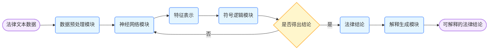

# 神经符号整合的可解释法律推理系统

> 关键词：神经符号整合、可解释性、法律推理系统、人工智能、符号逻辑、神经网络

> 摘要：本文聚焦于神经符号整合的可解释法律推理系统，旨在深入探讨该系统的原理、实现及应用。随着人工智能在法律领域的应用需求日益增长，可解释性成为法律推理系统的关键要求。神经符号整合结合了神经网络的强大学习能力和符号逻辑的可解释性，为构建更可靠、可解释的法律推理系统提供了有效途径。文章将详细阐述其核心概念、算法原理、数学模型，并通过项目实战展示系统的具体实现，同时分析其实际应用场景、推荐相关工具和资源，最后总结未来发展趋势与挑战。

## 1. 背景介绍 
### 1.1 目的和范围
法律推理是法律领域中的核心任务，传统的法律推理方法主要依赖于人工的逻辑分析和经验判断，效率较低且容易受到主观因素的影响。随着人工智能技术的发展，将其应用于法律推理成为研究热点。然而，现有的人工智能法律推理系统大多缺乏可解释性，难以满足法律领域对推理过程透明性和可追溯性的要求。本研究的目的在于构建一个基于神经符号整合的可解释法律推理系统，结合神经网络和符号逻辑的优势，实现高效、准确且可解释的法律推理。

本研究的范围涵盖了神经符号整合技术的原理、法律推理的基本概念和方法、系统的设计与实现、实际应用场景分析以及相关工具和资源的推荐等方面。

### 1.2 预期读者
本文预期读者包括法律领域的研究人员和从业者，如律师、法官、法律学者等，他们可以通过了解该系统更好地利用人工智能技术辅助法律决策；人工智能领域的研究人员和开发者，他们可以从中获取关于神经符号整合技术在法律领域应用的思路和方法；以及对跨学科研究感兴趣的学生和爱好者，帮助他们了解法律与人工智能交叉领域的前沿知识。

### 1.3 文档结构概述
本文共分为十个部分。第一部分为背景介绍，阐述研究的目的、范围、预期读者和文档结构。第二部分介绍神经符号整合的核心概念与联系，包括原理和架构的文本示意图及 Mermaid 流程图。第三部分详细讲解核心算法原理及具体操作步骤，并使用 Python 源代码进行阐述。第四部分介绍数学模型和公式，进行详细讲解并举例说明。第五部分通过项目实战展示代码实际案例和详细解释说明。第六部分分析实际应用场景。第七部分推荐相关的工具和资源。第八部分总结未来发展趋势与挑战。第九部分为附录，解答常见问题。第十部分提供扩展阅读和参考资料。

### 1.4 术语表
#### 1.4.1 核心术语定义
- **神经符号整合**：将神经网络的学习能力与符号逻辑的知识表示和推理能力相结合的技术，旨在实现既具有强大学习能力又具有可解释性的智能系统。
- **可解释性**：指系统的决策过程和结果能够被人类理解和解释的特性，在法律推理系统中尤为重要，以确保推理过程的透明性和公正性。
- **法律推理**：法律工作者从一个或几个已知的前提（法律事实或法律规范、法律原则、判例等法律资料）得出某种法律结论的思维过程。
- **神经网络**：一种模仿人类神经系统的计算模型，由大量的神经元组成，通过学习数据中的模式和规律来进行预测和分类。
- **符号逻辑**：用形式化的符号语言来表达逻辑关系和推理规则的逻辑系统，具有精确性和可解释性。

#### 1.4.2 相关概念解释
- **知识表示**：将知识以某种形式进行编码和存储，以便计算机能够处理和利用。在法律推理系统中，知识表示用于表示法律条文、案例等法律知识。
- **推理引擎**：基于知识表示和推理规则，对输入的法律事实进行推理，得出法律结论的模块。
- **机器学习**：让计算机通过数据学习模式和规律，从而实现预测和决策的技术。神经网络是机器学习中的一种重要方法。

#### 1.4.3 缩略词列表
- **AI**：Artificial Intelligence，人工智能
- **ML**：Machine Learning，机器学习
- **NN**：Neural Network，神经网络
- **SL**：Symbolic Logic，符号逻辑

## 2. 核心概念与联系 
神经符号整合的可解释法律推理系统的核心在于将神经网络和符号逻辑相结合，以实现高效、准确且可解释的法律推理。

### 核心概念原理
神经网络具有强大的学习能力，能够从大量的法律文本数据中自动学习到法律知识和模式。例如，通过对大量的法律案例进行训练，神经网络可以学习到不同法律事实与法律结论之间的关联。然而，神经网络的决策过程往往是黑盒的，难以解释其推理依据。

符号逻辑则具有明确的推理规则和知识表示方式，能够进行精确的逻辑推理，并且推理过程是可解释的。例如，根据法律条文的逻辑关系，可以使用符号逻辑进行推理，得出明确的法律结论。

神经符号整合的原理是将神经网络的学习能力与符号逻辑的可解释性相结合。一方面，利用神经网络对法律文本数据进行预处理和特征提取，将非结构化的法律文本转化为结构化的特征表示；另一方面，利用符号逻辑对提取的特征进行推理，得出可解释的法律结论。

### 架构的文本示意图
神经符号整合的可解释法律推理系统主要由以下几个模块组成：
1. **数据预处理模块**：对输入的法律文本数据进行清洗、分词、标注等预处理操作，将其转化为适合神经网络处理的格式。
2. **神经网络模块**：对预处理后的数据进行特征提取和学习，得到法律文本的特征表示。
3. **符号逻辑模块**：根据神经网络提取的特征和预先定义的法律知识和推理规则，进行逻辑推理，得出法律结论。
4. **解释生成模块**：根据符号逻辑的推理过程，生成可解释的文本解释，说明推理的依据和过程。

### Mermaid 流程图


## 3. 核心算法原理 & 具体操作步骤 
### 核心算法原理
神经符号整合的可解释法律推理系统主要涉及以下几个核心算法：
1. **神经网络算法**：用于对法律文本数据进行特征提取和学习。常用的神经网络算法包括卷积神经网络（CNN）、循环神经网络（RNN）及其变体（如 LSTM、GRU）等。以 LSTM 为例，它能够处理序列数据，对于法律文本这种具有时间顺序的文本数据非常适用。
2. **符号逻辑推理算法**：用于根据神经网络提取的特征和预先定义的法律知识和推理规则进行逻辑推理。常用的符号逻辑推理算法包括归结推理、自然演绎推理等。
3. **解释生成算法**：用于根据符号逻辑的推理过程生成可解释的文本解释。常见的方法包括模板生成、基于规则的生成等。

### 具体操作步骤及 Python 源代码阐述
以下是一个简化的神经符号整合的可解释法律推理系统的实现步骤及 Python 代码示例：

#### 步骤 1：数据预处理
```python
import nltk
from nltk.tokenize import word_tokenize
from nltk.corpus import stopwords
import string

# 下载必要的 nltk 数据
nltk.download('punkt')
nltk.download('stopwords')

def preprocess_text(text):
    # 转换为小写
    text = text.lower()
    # 去除标点符号
    text = text.translate(str.maketrans('', '', string.punctuation))
    # 分词
    tokens = word_tokenize(text)
    # 去除停用词
    stop_words = set(stopwords.words('english'))
    tokens = [token for token in tokens if token not in stop_words]
    return tokens

# 示例使用
text = "This is a sample legal text."
preprocessed_text = preprocess_text(text)
print(preprocessed_text)
```

#### 步骤 2：神经网络特征提取
```python
import torch
import torch.nn as nn
import torch.optim as optim
from torch.utils.data import Dataset, DataLoader

# 定义简单的 LSTM 模型
class LSTMModel(nn.Module):
    def __init__(self, input_size, hidden_size, num_layers, output_size):
        super(LSTMModel, self).__init__()
        self.hidden_size = hidden_size
        self.num_layers = num_layers
        self.lstm = nn.LSTM(input_size, hidden_size, num_layers, batch_first=True)
        self.fc = nn.Linear(hidden_size, output_size)

    def forward(self, x):
        h0 = torch.zeros(self.num_layers, x.size(0), self.hidden_size).to(x.device)
        c0 = torch.zeros(self.num_layers, x.size(0), self.hidden_size).to(x.device)
        out, _ = self.lstm(x, (h0, c0))
        out = self.fc(out[:, -1, :])
        return out

# 示例使用
input_size = 100
hidden_size = 64
num_layers = 2
output_size = 10

model = LSTMModel(input_size, hidden_size, num_layers, output_size)
```

#### 步骤 3：符号逻辑推理
```python
# 简单的符号逻辑推理示例
# 假设我们有一些法律规则和事实
legal_rules = {
    "rule1": {"condition": lambda x: x > 10, "conclusion": "Legal consequence 1"},
    "rule2": {"condition": lambda x: x <= 10, "conclusion": "Legal consequence 2"}
}

# 输入的特征值
feature_value = 15

# 进行推理
for rule_name, rule in legal_rules.items():
    if rule["condition"](feature_value):
        conclusion = rule["conclusion"]
        print(f"Based on {rule_name}, the legal conclusion is: {conclusion}")
```

#### 步骤 4：解释生成
```python
# 简单的解释生成示例
def generate_explanation(rule_name, conclusion):
    return f"The legal conclusion {conclusion} is reached because the input satisfies the condition of {rule_name}."

explanation = generate_explanation("rule1", "Legal consequence 1")
print(explanation)
```

## 4. 数学模型和公式 & 详细讲解 & 举例说明 
### 神经网络数学模型
以 LSTM 为例，LSTM 单元的数学模型如下：

- 输入门 $i_t$：
$$i_t = \sigma(W_{ii}x_t + W_{hi}h_{t-1} + b_i)$$
其中，$x_t$ 是当前时刻的输入，$h_{t-1}$ 是上一时刻的隐藏状态，$W_{ii}$ 和 $W_{hi}$ 是权重矩阵，$b_i$ 是偏置向量，$\sigma$ 是 sigmoid 函数。

- 遗忘门 $f_t$：
$$f_t = \sigma(W_{if}x_t + W_{hf}h_{t-1} + b_f)$$

- 细胞状态更新 $\tilde{C}_t$：
$$\tilde{C}_t = \tanh(W_{ic}x_t + W_{hc}h_{t-1} + b_c)$$

- 细胞状态 $C_t$：
$$C_t = f_t \odot C_{t-1} + i_t \odot \tilde{C}_t$$
其中，$\odot$ 表示逐元素相乘。

- 输出门 $o_t$：
$$o_t = \sigma(W_{io}x_t + W_{ho}h_{t-1} + b_o)$$

- 隐藏状态 $h_t$：
$$h_t = o_t \odot \tanh(C_t)$$

### 详细讲解
输入门 $i_t$ 决定了当前输入 $x_t$ 中有多少信息要被加入到细胞状态 $C_t$ 中。遗忘门 $f_t$ 决定了上一时刻的细胞状态 $C_{t-1}$ 中有多少信息要被遗忘。细胞状态更新 $\tilde{C}_t$ 计算了当前输入 $x_t$ 产生的新信息。细胞状态 $C_t$ 是通过遗忘门和输入门的操作更新得到的。输出门 $o_t$ 决定了细胞状态 $C_t$ 中有多少信息要被输出到隐藏状态 $h_t$ 中。

### 举例说明
假设我们有一个法律文本序列，每个时间步的输入 $x_t$ 是一个 100 维的向量，隐藏状态 $h_t$ 的维度是 64，细胞状态 $C_t$ 的维度也是 64。权重矩阵 $W_{ii}$ 的维度是 $64 \times 100$，$W_{hi}$ 的维度是 $64 \times 64$，偏置向量 $b_i$ 的维度是 64。通过上述公式，我们可以计算出每个时间步的输入门、遗忘门、细胞状态更新、细胞状态、输出门和隐藏状态。

### 符号逻辑推理数学模型
符号逻辑推理通常基于一阶逻辑或命题逻辑。以命题逻辑为例，假设我们有以下命题：
- $P$：表示某个法律事实成立
- $Q$：表示某个法律结论成立

我们有一个推理规则：$P \to Q$，即如果 $P$ 成立，则 $Q$ 成立。

如果已知 $P$ 为真，根据 modus ponens 规则，可以得出 $Q$ 为真。数学公式表示为：
$$\frac{P, P \to Q}{Q}$$

### 详细讲解
modus ponens 规则是命题逻辑中最基本的推理规则之一。它表示如果一个前提条件和一个蕴含关系都成立，那么可以得出蕴含关系的结论成立。在法律推理中，$P$ 可以表示某个具体的法律事实，$Q$ 可以表示根据该法律事实得出的法律结论，$P \to Q$ 可以表示法律规则。

### 举例说明
假设 $P$ 表示“某人的年龄大于 18 岁”，$Q$ 表示“某人具有完全民事行为能力”，法律规则是“如果某人的年龄大于 18 岁，那么某人具有完全民事行为能力”，即 $P \to Q$。如果已知某人的年龄确实大于 18 岁，即 $P$ 为真，那么根据 modus ponens 规则，可以得出某人具有完全民事行为能力，即 $Q$ 为真。

## 5. 项目实战：代码实际案例和详细解释说明 
### 5.1  开发环境搭建
#### 安装 Python
首先，确保你已经安装了 Python 3.6 或更高版本。可以从 Python 官方网站（https://www.python.org/downloads/） 下载并安装。

#### 安装必要的库
使用以下命令安装所需的 Python 库：
```sh
pip install torch nltk numpy pandas
```

### 5.2  源代码详细实现和代码解读
以下是一个完整的神经符号整合的可解释法律推理系统的代码示例：

```python
import nltk
from nltk.tokenize import word_tokenize
from nltk.corpus import stopwords
import string
import torch
import torch.nn as nn
import torch.optim as optim
from torch.utils.data import Dataset, DataLoader

# 数据预处理
nltk.download('punkt')
nltk.download('stopwords')

def preprocess_text(text):
    text = text.lower()
    text = text.translate(str.maketrans('', '', string.punctuation))
    tokens = word_tokenize(text)
    stop_words = set(stopwords.words('english'))
    tokens = [token for token in tokens if token not in stop_words]
    return tokens

# 定义 LSTM 模型
class LSTMModel(nn.Module):
    def __init__(self, input_size, hidden_size, num_layers, output_size):
        super(LSTMModel, self).__init__()
        self.hidden_size = hidden_size
        self.num_layers = num_layers
        self.lstm = nn.LSTM(input_size, hidden_size, num_layers, batch_first=True)
        self.fc = nn.Linear(hidden_size, output_size)

    def forward(self, x):
        h0 = torch.zeros(self.num_layers, x.size(0), self.hidden_size).to(x.device)
        c0 = torch.zeros(self.num_layers, x.size(0), self.hidden_size).to(x.device)
        out, _ = self.lstm(x, (h0, c0))
        out = self.fc(out[:, -1, :])
        return out

# 符号逻辑推理规则
legal_rules = {
    "rule1": {"condition": lambda x: x > 10, "conclusion": "Legal consequence 1"},
    "rule2": {"condition": lambda x: x <= 10, "conclusion": "Legal consequence 2"}
}

# 解释生成函数
def generate_explanation(rule_name, conclusion):
    return f"The legal conclusion {conclusion} is reached because the input satisfies the condition of {rule_name}."

# 主函数
def main():
    # 示例法律文本
    legal_text = "This is a sample legal text with some important information."
    preprocessed_text = preprocess_text(legal_text)
    print("Preprocessed text:", preprocessed_text)

    # 假设输入特征维度
    input_size = 100
    hidden_size = 64
    num_layers = 2
    output_size = 10

    model = LSTMModel(input_size, hidden_size, num_layers, output_size)

    # 模拟输入特征
    input_features = torch.randn(1, 10, input_size)
    output = model(input_features)
    feature_value = output.item()
    print("Feature value:", feature_value)

    # 符号逻辑推理
    for rule_name, rule in legal_rules.items():
        if rule["condition"](feature_value):
            conclusion = rule["conclusion"]
            print(f"Based on {rule_name}, the legal conclusion is: {conclusion}")
            explanation = generate_explanation(rule_name, conclusion)
            print("Explanation:", explanation)

if __name__ == "__main__":
    main()
```

### 5.3  代码解读与分析
- **数据预处理**：`preprocess_text` 函数将输入的法律文本进行清洗、分词和去除停用词等操作，将其转化为适合神经网络处理的格式。
- **神经网络模型**：`LSTMModel` 类定义了一个简单的 LSTM 模型，用于对法律文本的特征进行提取和学习。
- **符号逻辑推理**：`legal_rules` 字典定义了一些简单的法律推理规则，根据神经网络输出的特征值进行推理，得出法律结论。
- **解释生成**：`generate_explanation` 函数根据推理规则和结论生成可解释的文本解释。
- **主函数**：`main` 函数将上述步骤整合在一起，完成整个法律推理过程。

## 6. 实际应用场景 
### 法律案件辅助分析
在处理大量的法律案件时，神经符号整合的可解释法律推理系统可以帮助律师和法官快速分析案件事实，根据法律规则得出初步的法律结论，并提供可解释的推理依据。例如，在合同纠纷案件中，系统可以分析合同条款和相关证据，判断是否存在违约行为，并解释违约判断的依据。

### 法律知识检索与推荐
该系统可以对法律知识进行结构化表示和推理，当用户输入相关的法律问题时，系统可以根据法律规则和案例进行推理，检索出相关的法律条文和案例，并解释推荐的原因。例如，用户查询关于知识产权侵权的法律问题，系统可以推荐相关的法律条文和类似案例，并说明这些推荐是基于哪些法律规则和推理得出的。

### 法律教育与培训
在法律教育和培训中，可解释的法律推理系统可以作为教学工具，帮助学生理解法律推理的过程和方法。系统可以通过展示推理过程和解释依据，让学生更好地掌握法律知识和推理技巧。例如，在模拟法庭教学中，系统可以辅助学生分析案件，提供推理思路和解释，帮助学生提高法律实践能力。

### 法律风险评估
企业和个人在进行商业活动或决策时，需要评估可能面临的法律风险。神经符号整合的可解释法律推理系统可以根据相关的法律规则和业务信息，对潜在的法律风险进行评估，并解释风险评估的依据。例如，企业在进行跨国投资时，系统可以分析投资目的地的法律法规，评估可能面临的法律风险，如税收风险、知识产权风险等，并提供相应的解释和建议。

## 7. 工具和资源推荐
### 7.1 学习资源推荐
#### 7.1.1 书籍推荐
- 《人工智能：一种现代的方法》：这本书是人工智能领域的经典教材，全面介绍了人工智能的各个方面，包括知识表示、推理、机器学习等，对于理解神经符号整合的原理和方法有很大的帮助。
- 《法律人工智能》：专注于人工智能在法律领域的应用，介绍了法律推理、法律知识表示、法律文本分析等方面的技术和方法，为构建可解释法律推理系统提供了法律领域的专业知识。
- 《深度学习》：详细介绍了深度学习的基本原理、算法和应用，对于理解神经网络在法律推理系统中的应用有重要的参考价值。

#### 7.1.2 在线课程
- Coursera 上的“人工智能基础”课程：由知名高校的教授授课，系统地介绍了人工智能的基本概念、算法和应用，适合初学者入门。
- edX 上的“法律信息学”课程：专门介绍了信息技术在法律领域的应用，包括法律知识管理、法律推理、法律文本挖掘等内容，对于了解法律推理系统的相关技术有很大的帮助。
- 吴恩达的“深度学习专项课程”：深入讲解了深度学习的各种算法和应用，对于掌握神经网络技术在法律推理系统中的应用有重要的指导作用。

#### 7.1.3 技术博客和网站
- Medium 上的 AI 相关博客：有很多人工智能领域的专家和从业者分享他们的研究成果和实践经验，包括神经符号整合、法律人工智能等方面的内容。
- arXiv 网站：提供了大量的学术论文，涵盖了人工智能、法律推理等领域的最新研究成果，可以及时了解该领域的前沿动态。
- 中国法律信息网：提供了丰富的法律知识和案例资源，对于构建法律推理系统的法律知识库有很大的帮助。

### 7.2 开发工具框架推荐
#### 7.2.1 IDE和编辑器
- PyCharm：是一款专门为 Python 开发设计的集成开发环境，具有强大的代码编辑、调试和智能提示功能，适合开发神经符号整合的可解释法律推理系统。
- Visual Studio Code：是一款轻量级的代码编辑器，支持多种编程语言和插件扩展，具有丰富的功能和良好的用户体验，可以方便地进行 Python 代码的开发和调试。

#### 7.2.2 调试和性能分析工具
- PyTorch Profiler：是 PyTorch 提供的性能分析工具，可以帮助开发者分析神经网络模型的性能瓶颈，优化模型的训练和推理效率。
- cProfile：是 Python 内置的性能分析工具，可以对 Python 代码进行性能分析，找出代码中的性能瓶颈，提高代码的执行效率。

#### 7.2.3 相关框架和库
- PyTorch：是一个开源的深度学习框架，提供了丰富的神经网络模型和优化算法，方便开发者进行神经网络的开发和训练。
- NLTK：是一个自然语言处理工具包，提供了丰富的文本处理功能，如分词、词性标注、命名实体识别等，对于法律文本的预处理有很大的帮助。
- SymPy：是一个 Python 库，用于符号数学计算，支持符号逻辑推理和数学公式的处理，对于实现符号逻辑模块有重要的作用。

### 7.3 相关论文著作推荐
#### 7.3.1 经典论文
- “Neural-Symbolic Learning and Reasoning: A Survey and Interpretation”：对神经符号整合的研究进行了全面的综述和解读，介绍了神经符号整合的基本概念、方法和应用，是该领域的经典论文之一。
- “Legal Knowledge Representation and Reasoning: A Survey”：对法律知识表示和推理的研究进行了综述，介绍了法律知识的表示方法、推理技术和应用案例，对于理解法律推理系统的原理和方法有重要的参考价值。

#### 7.3.2 最新研究成果
- 在 arXiv、ACM Digital Library、IEEE Xplore 等学术数据库中搜索“neural-symbolic integration in legal reasoning”等关键词，可以获取该领域的最新研究成果。

#### 7.3.3 应用案例分析
- 一些知名的法律科技公司和研究机构会发布关于法律推理系统的应用案例分析，如 ROSS Intelligence 公司的相关案例，通过分析这些案例可以了解神经符号整合的可解释法律推理系统在实际应用中的效果和问题。

## 8. 总结：未来发展趋势与挑战
### 未来发展趋势
- **更深入的融合**：未来神经符号整合技术将更加深入地融合神经网络和符号逻辑，实现两者之间的无缝协作。例如，开发更加高效的知识表示和推理方法，使神经网络能够更好地理解和利用符号逻辑知识，符号逻辑模块能够更好地与神经网络进行交互和协同工作。
- **多模态融合**：除了文本数据，法律领域还涉及到图像、音频等多模态数据。未来的可解释法律推理系统将融合多模态数据，提高系统的信息处理能力和推理准确性。例如，在处理涉及合同图像的案件时，系统可以同时对图像中的文字和图像信息进行分析和推理。
- **智能化和自动化**：随着人工智能技术的不断发展，可解释法律推理系统将更加智能化和自动化。系统可以自动学习和更新法律知识，自动生成推理规则和解释，减少人工干预，提高系统的效率和准确性。
- **跨领域应用**：神经符号整合的可解释法律推理系统将不仅应用于法律领域，还将拓展到其他领域，如金融、医疗、交通等。例如，在金融领域，系统可以帮助银行和金融机构进行风险评估和合规检查，提供可解释的决策依据。

### 挑战
- **知识获取和表示**：法律知识具有复杂性和多样性，如何有效地获取和表示法律知识是一个挑战。法律条文、案例等法律知识的更新速度较快，需要建立高效的知识获取和更新机制。同时，如何将法律知识以合适的形式表示，以便神经网络和符号逻辑模块能够更好地处理和利用，也是一个需要解决的问题。
- **可解释性的深度和广度**：虽然神经符号整合技术在一定程度上提高了系统的可解释性，但目前的可解释性还存在一定的局限性。如何进一步提高可解释性的深度和广度，使系统的推理过程和结论能够被更全面、准确地解释，是一个重要的挑战。
- **计算资源和效率**：神经网络的训练和推理需要大量的计算资源，尤其是在处理大规模的法律数据时。如何优化系统的算法和架构，提高系统的计算效率，减少计算资源的消耗，是一个需要解决的问题。
- **法律伦理和隐私**：在法律推理系统的应用中，涉及到大量的法律数据和个人隐私信息。如何保障法律数据的安全和隐私，遵守法律伦理和道德规范，是一个需要重视的问题。

## 9. 附录：常见问题与解答
### 问题 1：神经符号整合的可解释法律推理系统与传统的法律推理方法有什么区别？
传统的法律推理方法主要依赖于人工的逻辑分析和经验判断，效率较低且容易受到主观因素的影响。而神经符号整合的可解释法律推理系统结合了神经网络的强大学习能力和符号逻辑的可解释性，能够自动从大量的法律数据中学习知识和模式，并且推理过程和结论具有可解释性，提高了法律推理的效率和准确性。

### 问题 2：如何保证系统的可解释性？
系统的可解释性主要通过符号逻辑模块和解释生成模块来保证。符号逻辑模块使用明确的推理规则和知识表示方式进行推理，推理过程是可追溯的。解释生成模块根据符号逻辑的推理过程生成可解释的文本解释，说明推理的依据和过程。

### 问题 3：系统的性能如何评估？
系统的性能可以从多个方面进行评估，如推理准确性、可解释性、效率等。推理准确性可以通过与专家的判断进行比较来评估；可解释性可以通过用户对解释的理解程度和满意度来评估；效率可以通过系统的响应时间和计算资源消耗来评估。

### 问题 4：系统能否处理复杂的法律问题？
系统可以处理一定程度的复杂法律问题。通过不断地学习和更新法律知识，优化系统的算法和架构，系统的处理能力将不断提高。但对于一些非常复杂的法律问题，可能还需要人工的参与和辅助。

### 问题 5：系统的法律知识如何更新？
系统的法律知识可以通过以下几种方式更新：一是定期从法律数据库、法律法规网站等数据源获取最新的法律条文和案例；二是通过人工标注和审核的方式，将新的法律知识添加到系统中；三是利用机器学习算法，自动从大量的法律文本中学习和发现新的法律知识。

## 10. 扩展阅读 & 参考资料
### 扩展阅读
- 《人工智能与法律的对话》：通过对话的形式探讨了人工智能在法律领域的应用和挑战，提供了一些有趣的观点和思考。
- 《法律的逻辑与方法》：介绍了法律推理的逻辑和方法，对于理解法律推理的本质和过程有很大的帮助。

### 参考资料
- McCarthy, J. (1959). Programs with common sense. In Proceedings of the Teddington Conference on the Mechanization of Thought Processes.
- Hinton, G. E., Osindero, S., & Teh, Y. W. (2006). A fast learning algorithm for deep belief nets. Neural computation, 18(7), 1527-1554.
- Prakken, H. (2017). An introduction to legal reasoning. In A companion to legal philosophy and legal theory (pp. 225-248). John Wiley & Sons, Ltd.