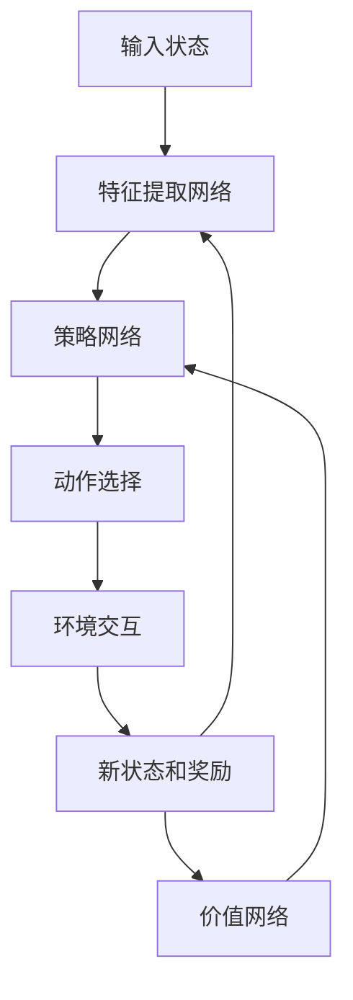

# 神经规划器在长期策略推理优化中的作用

> 关键词：神经规划器、长期策略推理、优化、人工智能、决策过程、智能系统

> 摘要：本文聚焦于神经规划器在长期策略推理优化中的关键作用。首先介绍了神经规划器及长期策略推理的背景知识，阐述其目的、预期读者和文档结构。接着深入剖析神经规划器的核心概念与架构，详细讲解其核心算法原理及具体操作步骤，给出相关数学模型和公式并举例说明。通过项目实战展示代码实现与解读，探讨神经规划器在实际应用场景中的表现。同时推荐了学习、开发工具及相关论文著作资源。最后总结神经规划器未来发展趋势与挑战，解答常见问题并提供扩展阅读和参考资料，旨在全面揭示神经规划器对长期策略推理优化的重要意义和价值。

## 1. 背景介绍 
### 1.1 目的和范围
在当今复杂多变的环境中，智能系统面临着越来越多需要制定长期策略的任务，如自动驾驶车辆的路径规划、智能机器人的任务执行、金融投资决策等。长期策略推理要求系统不仅能够考虑当前的状态，还需要预测未来的发展，并做出一系列连贯且有效的决策。神经规划器作为一种结合了神经网络强大的学习能力和规划算法的智能工具，为长期策略推理的优化提供了新的思路和方法。

本文的范围涵盖了神经规划器的基本概念、算法原理、数学模型，以及在长期策略推理优化中的具体应用。通过理论分析和实际案例，探讨神经规划器如何在不同场景下提高长期策略的质量和效率。

### 1.2 预期读者
本文预期读者包括人工智能领域的研究人员、工程师、计算机科学专业的学生，以及对智能决策和规划算法感兴趣的技术爱好者。对于希望深入了解神经规划器及其在长期策略推理中应用的读者，本文将提供全面且深入的知识和技术指导。

### 1.3 文档结构概述
本文将按照以下结构展开：首先介绍神经规划器和长期策略推理的相关背景知识和术语；接着阐述神经规划器的核心概念、架构和工作流程；然后详细讲解神经规划器的核心算法原理，并给出具体的操作步骤和Python源代码；再介绍神经规划器的数学模型和公式，并举例说明其应用；通过项目实战展示神经规划器在实际场景中的代码实现和详细解释；探讨神经规划器在不同实际应用场景中的表现；推荐学习、开发工具及相关论文著作资源；最后总结神经规划器的未来发展趋势与挑战，解答常见问题并提供扩展阅读和参考资料。

### 1.4 术语表
#### 1.4.1 核心术语定义
- **神经规划器（Neural Planner）**：一种结合了神经网络和规划算法的智能工具，利用神经网络的学习能力来优化规划过程，以生成更有效的策略。
- **长期策略推理（Long - term Strategy Reasoning）**：指智能系统在考虑当前状态的基础上，预测未来的发展，并制定一系列连贯的决策，以实现长期目标的过程。
- **策略（Strategy）**：在给定环境和目标下，智能系统采取的一系列行动或决策序列。
- **规划算法（Planning Algorithm）**：用于在状态空间中搜索最优路径或策略的算法，如A*算法、Dijkstra算法等。
- **神经网络（Neural Network）**：一种模仿人类神经系统的计算模型，由大量的神经元组成，能够自动学习数据中的模式和规律。

#### 1.4.2 相关概念解释
- **状态空间（State Space）**：指系统所有可能状态的集合。在长期策略推理中，智能系统需要在状态空间中搜索从当前状态到目标状态的最优路径。
- **动作空间（Action Space）**：指智能系统在每个状态下可以采取的所有可能动作的集合。策略就是在状态空间和动作空间之间的映射。
- **奖励函数（Reward Function）**：用于评估智能系统在每个状态下采取某个动作的好坏程度。长期策略推理的目标通常是最大化累积奖励。

#### 1.4.3 缩略词列表
- **AI**：Artificial Intelligence，人工智能
- **RL**：Reinforcement Learning，强化学习
- **MLP**：Multi - Layer Perceptron，多层感知机
- **CNN**：Convolutional Neural Network，卷积神经网络
- **RNN**：Recurrent Neural Network，循环神经网络

## 2. 核心概念与联系 
### 2.1 神经规划器的核心概念
神经规划器的核心思想是将神经网络的学习能力与传统规划算法相结合，以提高规划的效率和效果。传统规划算法通常在状态空间中进行搜索，以找到最优的策略。然而，在复杂的环境中，状态空间可能非常大，导致搜索效率低下。神经网络具有强大的学习能力，能够自动学习数据中的模式和规律。神经规划器利用神经网络来学习状态空间的特征和策略的分布，从而在规划过程中进行更有效的搜索。

神经规划器可以分为基于模型的神经规划器和无模型的神经规划器。基于模型的神经规划器通过学习环境的动态模型来预测未来的状态，然后使用规划算法在预测的状态空间中搜索最优策略。无模型的神经规划器则直接学习策略，而不显式地学习环境模型。

### 2.2 神经规划器与长期策略推理的联系
长期策略推理需要智能系统在考虑当前状态的基础上，预测未来的发展，并做出一系列连贯的决策。神经规划器可以在多个方面为长期策略推理提供支持。

首先，神经规划器可以通过学习环境的动态模型，更准确地预测未来的状态，从而帮助智能系统做出更合理的决策。其次，神经规划器可以利用神经网络的学习能力，在复杂的状态空间中快速搜索到最优策略，提高长期策略推理的效率。此外，神经规划器还可以通过学习奖励函数，优化长期策略，以最大化累积奖励。

### 2.3 神经规划器的架构示意图
以下是神经规划器的基本架构示意图：



在这个架构中，输入状态首先经过特征提取网络，提取出状态的特征表示。然后，策略网络根据特征表示生成动作分布，通过动作选择模块选择具体的动作与环境进行交互。环境返回新的状态和奖励，新状态再次输入到特征提取网络中，形成一个闭环。价值网络用于评估状态的价值，为策略网络的更新提供指导。

## 3. 核心算法原理 & 具体操作步骤 
### 3.1 核心算法原理
神经规划器的核心算法通常基于强化学习的思想。强化学习是一种通过智能体与环境进行交互，以最大化累积奖励的学习方法。在神经规划器中，智能体就是神经规划器本身，环境是需要进行长期策略推理的任务场景。

以基于策略梯度的强化学习算法为例，其核心思想是通过优化策略网络的参数，使得智能体在环境中获得的累积奖励最大化。策略网络的参数更新公式如下：

```python
import torch
import torch.optim as optim

# 定义策略网络
class PolicyNetwork(torch.nn.Module):
    def __init__(self, input_dim, output_dim):
        super(PolicyNetwork, self).__init__()
        self.fc1 = torch.nn.Linear(input_dim, 128)
        self.fc2 = torch.nn.Linear(128, output_dim)

    def forward(self, x):
        x = torch.relu(self.fc1(x))
        x = torch.softmax(self.fc2(x), dim=-1)
        return x

# 初始化策略网络和优化器
input_dim = 10
output_dim = 5
policy_network = PolicyNetwork(input_dim, output_dim)
optimizer = optim.Adam(policy_network.parameters(), lr=0.001)

# 收集经验数据
states = torch.randn(100, input_dim)
actions = torch.randint(0, output_dim, (100,))
rewards = torch.randn(100)

# 计算策略梯度
log_probs = torch.log(policy_network(states).gather(1, actions.unsqueeze(1)).squeeze(1))
loss = -(log_probs * rewards).mean()

# 更新策略网络参数
optimizer.zero_grad()
loss.backward()
optimizer.step()
```

### 3.2 具体操作步骤
1. **环境建模**：首先需要对长期策略推理的任务场景进行建模，定义状态空间、动作空间和奖励函数。
2. **网络构建**：构建神经规划器的网络结构，包括特征提取网络、策略网络和价值网络。
3. **数据收集**：让智能体在环境中进行交互，收集状态、动作和奖励等经验数据。
4. **策略更新**：根据收集到的经验数据，使用强化学习算法更新策略网络的参数，以最大化累积奖励。
5. **重复训练**：重复步骤3和4，直到策略网络收敛或达到预定的训练次数。

## 4. 数学模型和公式 & 详细讲解 & 举例说明 
### 4.1 数学模型
在强化学习中，智能体与环境的交互可以用马尔可夫决策过程（MDP）来建模。马尔可夫决策过程由一个五元组 $(S, A, P, R, \gamma)$ 表示，其中：
- $S$ 是状态空间，包含所有可能的状态。
- $A$ 是动作空间，包含所有可能的动作。
- $P(s'|s, a)$ 是状态转移概率，表示在状态 $s$ 下采取动作 $a$ 后转移到状态 $s'$ 的概率。
- $R(s, a)$ 是奖励函数，表示在状态 $s$ 下采取动作 $a$ 获得的即时奖励。
- $\gamma \in [0, 1]$ 是折扣因子，用于衡量未来奖励的重要性。

智能体的目标是找到一个最优策略 $\pi^*(a|s)$，使得累积折扣奖励 $G_t=\sum_{k = 0}^{\infty}\gamma^kR_{t + k + 1}$ 最大化。

### 4.2 公式讲解
策略梯度算法的目标是最大化目标函数 $J(\theta)$，其中 $\theta$ 是策略网络的参数。目标函数的梯度可以表示为：

$$\nabla_{\theta}J(\theta)=\mathbb{E}_{\tau \sim \pi_{\theta}(\tau)}\left[\sum_{t = 0}^{T}\nabla_{\theta}\log\pi_{\theta}(a_t|s_t)R(\tau)\right]$$

其中，$\tau=(s_0, a_0, r_0, s_1, a_1, r_1, \cdots)$ 是一个轨迹，$\pi_{\theta}(\tau)$ 是策略 $\pi_{\theta}$ 生成轨迹 $\tau$ 的概率，$R(\tau)=\sum_{t = 0}^{T}\gamma^tr_t$ 是轨迹 $\tau$ 的累积折扣奖励。

### 4.3 举例说明
假设一个简单的机器人导航任务，机器人在一个二维网格环境中移动，目标是到达指定的目标位置。状态空间可以表示为机器人的位置坐标 $(x, y)$，动作空间包括上下左右四个方向的移动。奖励函数可以设置为：当机器人到达目标位置时获得正奖励，当机器人撞到障碍物时获得负奖励，其他情况下获得零奖励。

使用策略梯度算法，机器人可以通过不断与环境交互，学习到最优的导航策略。在训练过程中，机器人根据当前状态选择动作，与环境交互后获得新的状态和奖励，然后根据奖励更新策略网络的参数，逐渐提高导航的效率和成功率。

## 5. 项目实战：代码实际案例和详细解释说明 
### 5.1  开发环境搭建
为了实现神经规划器在长期策略推理优化中的应用，我们可以使用Python语言和PyTorch深度学习框架。以下是搭建开发环境的步骤：

1. **安装Python**：建议使用Python 3.7及以上版本。可以从Python官方网站（https://www.python.org/downloads/）下载并安装。
2. **安装PyTorch**：根据自己的系统和CUDA版本，选择合适的PyTorch版本进行安装。可以参考PyTorch官方网站（https://pytorch.org/get-started/locally/）的指导进行安装。
3. **安装其他依赖库**：还需要安装一些其他的依赖库，如NumPy、Matplotlib等。可以使用pip命令进行安装：
```bash
pip install numpy matplotlib
```

### 5.2  源代码详细实现和代码解读
以下是一个简单的神经规划器在机器人导航任务中的实现代码：

```python
import torch
import torch.nn as nn
import torch.optim as optim
import numpy as np
import random

# 定义环境
class GridWorld:
    def __init__(self, grid_size=5, start=(0, 0), goal=(4, 4)):
        self.grid_size = grid_size
        self.start = start
        self.goal = goal
        self.current_state = start
        self.obstacles = [(2, 2), (2, 3)]

    def reset(self):
        self.current_state = self.start
        return np.array(self.current_state)

    def step(self, action):
        x, y = self.current_state
        if action == 0:  # 上
            x = max(0, x - 1)
        elif action == 1:  # 下
            x = min(self.grid_size - 1, x + 1)
        elif action == 2:  # 左
            y = max(0, y - 1)
        elif action == 3:  # 右
            y = min(self.grid_size - 1, y + 1)

        if (x, y) in self.obstacles:
            reward = -1
        elif (x, y) == self.goal:
            reward = 10
        else:
            reward = -0.1

        self.current_state = (x, y)
        done = (self.current_state == self.goal)
        return np.array(self.current_state), reward, done

# 定义策略网络
class PolicyNetwork(nn.Module):
    def __init__(self, input_dim, output_dim):
        super(PolicyNetwork, self).__init__()
        self.fc1 = nn.Linear(input_dim, 128)
        self.fc2 = nn.Linear(128, output_dim)

    def forward(self, x):
        x = torch.relu(self.fc1(x))
        x = torch.softmax(self.fc2(x), dim=-1)
        return x

# 训练函数
def train():
    env = GridWorld()
    input_dim = 2
    output_dim = 4
    policy_network = PolicyNetwork(input_dim, output_dim)
    optimizer = optim.Adam(policy_network.parameters(), lr=0.001)
    gamma = 0.99

    num_episodes = 1000
    for episode in range(num_episodes):
        state = env.reset()
        state = torch.FloatTensor(state)
        log_probs = []
        rewards = []
        done = False

        while not done:
            action_probs = policy_network(state)
            action = torch.multinomial(action_probs, 1).item()
            log_prob = torch.log(action_probs.squeeze(0)[action])
            log_probs.append(log_prob)

            next_state, reward, done = env.step(action)
            next_state = torch.FloatTensor(next_state)
            rewards.append(reward)

            state = next_state

        # 计算累积折扣奖励
        R = 0
        discounted_rewards = []
        for r in reversed(rewards):
            R = r + gamma * R
            discounted_rewards.insert(0, R)
        discounted_rewards = torch.FloatTensor(discounted_rewards)

        # 计算策略梯度
        policy_loss = []
        for log_prob, R in zip(log_probs, discounted_rewards):
            policy_loss.append(-log_prob * R)
        policy_loss = torch.stack(policy_loss).sum()

        # 更新策略网络参数
        optimizer.zero_grad()
        policy_loss.backward()
        optimizer.step()

        if episode % 100 == 0:
            print(f"Episode {episode}: Total Reward = {sum(rewards)}")

if __name__ == "__main__":
    train()
```

### 5.3  代码解读与分析
1. **环境定义**：`GridWorld` 类定义了一个简单的二维网格环境，包括起始位置、目标位置和障碍物。`reset` 方法用于重置环境，`step` 方法用于执行动作并返回新的状态、奖励和是否完成的标志。
2. **策略网络定义**：`PolicyNetwork` 类定义了一个简单的多层感知机作为策略网络，输入是状态，输出是动作的概率分布。
3. **训练函数**：`train` 函数实现了策略梯度算法的训练过程。在每个episode中，智能体与环境进行交互，收集状态、动作和奖励等经验数据。然后计算累积折扣奖励和策略梯度，更新策略网络的参数。

通过不断训练，策略网络可以学习到最优的导航策略，使得机器人能够高效地到达目标位置。

## 6. 实际应用场景 
### 6.1 自动驾驶
在自动驾驶领域，神经规划器可以用于车辆的路径规划和决策制定。车辆需要在复杂的交通环境中，考虑多个因素，如交通规则、其他车辆和行人的行为等，制定长期的行驶策略。神经规划器可以通过学习大量的交通数据，预测其他车辆和行人的行为，从而更准确地规划路径，提高行驶的安全性和效率。

### 6.2 智能机器人
智能机器人在执行任务时，需要根据环境的变化和任务的要求，制定长期的行动策略。例如，在仓库物流场景中，机器人需要在货架间移动，完成货物的搬运任务。神经规划器可以帮助机器人在复杂的仓库环境中，规划最优的路径，避免碰撞和提高搬运效率。

### 6.3 金融投资
在金融投资领域，投资者需要根据市场的变化和自身的投资目标，制定长期的投资策略。神经规划器可以通过学习历史市场数据，预测市场趋势，帮助投资者做出更合理的投资决策，提高投资收益。

### 6.4 游戏AI
在游戏中，AI角色需要根据游戏环境和对手的行为，制定长期的游戏策略。神经规划器可以帮助游戏AI在复杂的游戏场景中，学习最优的策略，提高游戏的竞技水平。

## 7. 工具和资源推荐
### 7.1 学习资源推荐
#### 7.1.1 书籍推荐
- 《Reinforcement Learning: An Introduction》：由Richard S. Sutton和Andrew G. Barto所著，是强化学习领域的经典教材，全面介绍了强化学习的理论和算法。
- 《Deep Learning》：由Ian Goodfellow、Yoshua Bengio和Aaron Courville所著，是深度学习领域的权威书籍，涵盖了深度学习的基本概念、算法和应用。

#### 7.1.2 在线课程
- Coursera上的《Reinforcement Learning Specialization》：由University of Alberta提供，包括多个强化学习的课程，适合初学者和有一定基础的学习者。
- edX上的《Introduction to Artificial Intelligence》：由MIT提供，介绍了人工智能的基本概念和算法，包括强化学习和规划算法。

#### 7.1.3 技术博客和网站
- OpenAI Blog（https://openai.com/blog/）：OpenAI发布的最新研究成果和技术文章，涵盖了人工智能的多个领域。
- DeepMind Blog（https://deepmind.com/blog/）：DeepMind发布的研究成果和技术文章，在强化学习和人工智能领域有很多重要的贡献。

### 7.2 开发工具框架推荐
#### 7.2.1 IDE和编辑器
- PyCharm：是一款专门为Python开发设计的集成开发环境，具有强大的代码编辑、调试和自动补全功能。
- Visual Studio Code：是一款轻量级的代码编辑器，支持多种编程语言和插件，适合快速开发和调试。

#### 7.2.2 调试和性能分析工具
- TensorBoard：是TensorFlow提供的可视化工具，可以用于可视化训练过程中的损失函数、准确率等指标，帮助开发者调试和优化模型。
- PyTorch Profiler：是PyTorch提供的性能分析工具，可以帮助开发者分析模型的运行时间和内存使用情况，优化模型的性能。

#### 7.2.3 相关框架和库
- PyTorch：是一个开源的深度学习框架，具有丰富的神经网络层和优化算法，适合开发神经规划器。
- Gym：是OpenAI开发的一个开源的强化学习环境库，提供了多种不同类型的环境，方便开发者进行强化学习算法的实验和验证。

### 7.3 相关论文著作推荐
#### 7.3.1 经典论文
- “Policy Gradient Methods for Reinforcement Learning with Function Approximation”：由Richard S. Sutton等人发表，提出了策略梯度算法，是强化学习领域的经典论文。
- “Human - Level Control through Deep Reinforcement Learning”：由DeepMind发表，介绍了深度Q网络（DQN）算法，在Atari游戏中取得了人类水平的表现。

#### 7.3.2 最新研究成果
- 关注顶级学术会议，如NeurIPS（Neural Information Processing Systems）、ICML（International Conference on Machine Learning）、AAAI（Association for the Advancement of Artificial Intelligence）等，这些会议上会发表神经规划器和强化学习领域的最新研究成果。

#### 7.3.3 应用案例分析
- 可以参考一些实际应用案例的论文，如自动驾驶、智能机器人等领域的相关论文，了解神经规划器在实际场景中的应用和效果。

## 8. 总结：未来发展趋势与挑战
### 8.1 未来发展趋势
- **与其他技术的融合**：神经规划器将与计算机视觉、自然语言处理等技术深度融合，以处理更复杂的任务和环境。例如，在自动驾驶中，结合计算机视觉技术可以更准确地感知周围环境，从而制定更合理的行驶策略。
- **可解释性增强**：随着神经规划器在越来越多的关键领域的应用，其可解释性变得越来越重要。未来的研究将致力于提高神经规划器的可解释性，使得决策过程更加透明和可信。
- **多智能体协作**：在许多实际场景中，需要多个智能体协同工作。未来的神经规划器将支持多智能体协作，通过学习智能体之间的交互和合作策略，提高整体的任务执行效率。

### 8.2 挑战
- **计算资源需求**：神经规划器通常需要大量的计算资源来进行训练和推理。在一些资源受限的场景中，如移动设备和嵌入式系统，如何高效地实现神经规划器是一个挑战。
- **环境建模的复杂性**：在复杂的现实环境中，准确地建模环境的动态和不确定性是非常困难的。环境建模的不准确可能导致神经规划器的性能下降。
- **数据收集和标注**：神经规划器的训练通常需要大量的高质量数据。在一些实际场景中，数据的收集和标注是一个耗时耗力的过程，如何有效地收集和利用数据是一个挑战。

## 9. 附录：常见问题与解答
### 9.1 神经规划器与传统规划算法有什么区别？
传统规划算法通常基于规则和搜索，在状态空间中进行穷举搜索以找到最优策略。而神经规划器结合了神经网络的学习能力，通过学习数据中的模式和规律，在复杂的状态空间中进行更高效的搜索。神经规划器可以处理更复杂的环境和任务，并且具有更好的泛化能力。

### 9.2 神经规划器在训练过程中容易出现哪些问题？
神经规划器在训练过程中容易出现梯度消失、梯度爆炸、过拟合等问题。梯度消失和梯度爆炸会导致训练不稳定，使得模型难以收敛。过拟合则会导致模型在训练数据上表现良好，但在测试数据上表现不佳。为了解决这些问题，可以采用一些技巧，如梯度裁剪、正则化、早停等。

### 9.3 如何评估神经规划器的性能？
可以从多个方面评估神经规划器的性能，如策略的质量、规划的效率、模型的泛化能力等。策略的质量可以通过计算累积奖励、成功率等指标来评估。规划的效率可以通过计算规划时间、搜索步数等指标来评估。模型的泛化能力可以通过在不同的测试环境中进行测试来评估。

## 10. 扩展阅读 & 参考资料
### 10.1 扩展阅读
- 可以阅读一些关于深度学习、强化学习和规划算法的高级书籍和论文，进一步深入了解神经规划器的原理和应用。
- 关注一些技术论坛和社区，如Stack Overflow、Reddit等，与其他开发者交流和分享经验。

### 10.2 参考资料
- 本文中引用的所有书籍、论文、网站和代码都可以作为参考资料。在进行进一步的研究和开发时，可以参考这些资料，以获取更详细的信息和技术指导。