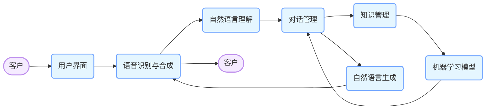

# 程序员在AI驱动的客户服务中的作用

> 关键词：程序员、AI、客户服务、智能客服系统、自然语言处理、机器学习、技术创新

> 摘要：本文旨在深入探讨程序员在AI驱动的客户服务中的关键作用。随着人工智能技术的飞速发展，客户服务领域正经历着深刻变革，AI驱动的客户服务逐渐成为主流。程序员作为这一变革的推动者和实现者，他们的工作贯穿于智能客服系统的各个环节，从核心算法的设计与优化到实际项目的开发与部署。文章将详细介绍相关背景知识，剖析核心概念与联系，阐述核心算法原理及操作步骤，探讨数学模型和公式，通过项目实战展示具体实现过程，分析实际应用场景，推荐相关工具和资源，并对未来发展趋势与挑战进行总结，最后提供常见问题解答及参考资料，以期全面呈现程序员在这一领域的重要价值。

## 1. 背景介绍 
### 1.1 目的和范围
本文章的目的在于全面阐述程序员在AI驱动的客户服务中的具体作用和重要性。范围涵盖了从AI客户服务系统的基础概念、核心算法原理，到实际项目开发与应用，以及未来发展趋势等多个方面。通过深入剖析，让读者对程序员在这一领域的工作有清晰的认识，了解他们如何推动AI技术在客户服务中的应用和创新。

### 1.2 预期读者
本文预期读者包括对AI技术和客户服务领域感兴趣的专业人士，如程序员、软件架构师、客户服务管理人员等；也适合相关专业的学生，以及希望了解AI在客户服务中应用的普通读者。通过阅读本文，读者可以获得对该领域的全面认知和深入理解。

### 1.3 文档结构概述
本文将按照以下结构进行阐述：首先介绍背景知识，包括目的、预期读者和文档结构概述等；接着讲解核心概念与联系，通过文本示意图和Mermaid流程图展示AI驱动的客户服务的架构；然后深入探讨核心算法原理及具体操作步骤，结合Python源代码进行详细阐述；再介绍相关的数学模型和公式，并举例说明；通过项目实战展示代码实际案例并进行详细解释；分析实际应用场景；推荐相关的工具和资源；总结未来发展趋势与挑战；提供常见问题解答；最后列出扩展阅读和参考资料。

### 1.4 术语表
#### 1.4.1 核心术语定义
- **AI（Artificial Intelligence）**：即人工智能，是研究、开发用于模拟、延伸和扩展人的智能的理论、方法、技术及应用系统的一门新的技术科学。
- **客户服务**：是指一种以客户为导向的价值观，它整合及管理在预先设定的最优成本——服务组合中的客户界面的所有要素。
- **智能客服系统**：利用人工智能技术实现客户服务自动化的系统，能够自动回答客户问题、解决客户需求。
- **自然语言处理（Natural Language Processing，NLP）**：是计算机科学领域与人工智能领域中的一个重要方向，它研究能实现人与计算机之间用自然语言进行有效通信的各种理论和方法。
- **机器学习（Machine Learning，ML）**：是一门多领域交叉学科，涉及概率论、统计学、逼近论、凸分析、算法复杂度理论等多门学科。它专门研究计算机怎样模拟或实现人类的学习行为，以获取新的知识或技能，重新组织已有的知识结构使之不断改善自身的性能。

#### 1.4.2 相关概念解释
- **对话管理**：在智能客服系统中，对话管理负责处理客户与系统之间的对话流程，包括理解客户意图、选择合适的回复策略、维持对话的连贯性等。
- **知识图谱**：是一种语义网络，用于表示实体之间的关系和知识。在智能客服系统中，知识图谱可以帮助系统更好地理解客户问题，并提供准确的答案。
- **情感分析**：通过对文本的分析，判断文本中所表达的情感倾向，如积极、消极或中性。在客户服务中，情感分析可以帮助客服人员了解客户的情绪状态，提供更贴心的服务。

#### 1.4.3 缩略词列表
- **AI**：Artificial Intelligence（人工智能）
- **NLP**：Natural Language Processing（自然语言处理）
- **ML**：Machine Learning（机器学习）
- **RNN**：Recurrent Neural Network（循环神经网络）
- **LSTM**：Long Short - Term Memory（长短期记忆网络）
- **CNN**：Convolutional Neural Network（卷积神经网络）

## 2. 核心概念与联系 
### 2.1 核心概念原理
AI驱动的客户服务主要基于自然语言处理和机器学习技术。自然语言处理技术使计算机能够理解和处理人类语言，包括文本分类、命名实体识别、情感分析等任务。机器学习技术则用于训练模型，使其能够自动学习数据中的模式和规律，从而实现对客户问题的准确预测和回答。

智能客服系统通常由以下几个核心模块组成：
- **用户界面**：提供客户与系统交互的接口，如网页、APP、聊天窗口等。
- **语音识别与合成**：将客户的语音转换为文本，或将系统的文本回复转换为语音。
- **自然语言理解**：分析客户的文本输入，理解其意图和语义。
- **对话管理**：管理客户与系统之间的对话流程，决定如何回复客户。
- **知识管理**：存储和管理与客户服务相关的知识和信息。
- **机器学习模型**：用于训练和优化系统的性能，提高问题回答的准确率。

### 2.2 架构的文本示意图
```plaintext
客户 ----> 用户界面 ----> 语音识别与合成 ----> 自然语言理解 ----> 对话管理 ----> 知识管理 ----> 机器学习模型 ----> 对话管理 ----> 自然语言生成 ----> 语音合成与输出 ----> 客户
```

### 2.3 Mermaid流程图


## 3. 核心算法原理 & 具体操作步骤 
### 3.1 自然语言处理算法原理
自然语言处理中的一个重要任务是文本分类，例如将客户问题分类到不同的类别中，以便系统能够快速找到合适的答案。常用的文本分类算法有朴素贝叶斯算法。

#### 3.1.1 朴素贝叶斯算法原理
朴素贝叶斯算法基于贝叶斯定理，假设特征之间相互独立。贝叶斯定理的公式为：
$$P(c|x)=\frac{P(x|c)P(c)}{P(x)}$$
其中，$P(c|x)$ 是在给定特征 $x$ 的情况下类别 $c$ 的后验概率，$P(x|c)$ 是在类别 $c$ 下特征 $x$ 的条件概率，$P(c)$ 是类别 $c$ 的先验概率，$P(x)$ 是特征 $x$ 的先验概率。

在文本分类中，我们将文本表示为词向量，每个词作为一个特征。假设文本 $x=(x_1,x_2,\cdots,x_n)$，其中 $x_i$ 是第 $i$ 个词。根据朴素贝叶斯的独立性假设，$P(x|c)=\prod_{i = 1}^{n}P(x_i|c)$。

#### 3.1.2 Python源代码实现
```python
from sklearn.feature_extraction.text import CountVectorizer
from sklearn.naive_bayes import MultinomialNB
from sklearn.model_selection import train_test_split
from sklearn.metrics import accuracy_score

# 示例数据
corpus = [
    "这个产品质量很好",
    "这个产品不太好用",
    "服务态度很棒",
    "服务太差劲了"
]
labels = ["产品好评", "产品差评", "服务好评", "服务差评"]

# 文本向量化
vectorizer = CountVectorizer()
X = vectorizer.fit_transform(corpus)

# 划分训练集和测试集
X_train, X_test, y_train, y_test = train_test_split(X, labels, test_size=0.2, random_state=42)

# 训练模型
clf = MultinomialNB()
clf.fit(X_train, y_train)

# 预测
y_pred = clf.predict(X_test)

# 计算准确率
accuracy = accuracy_score(y_test, y_pred)
print(f"准确率: {accuracy}")
```

### 3.2 机器学习模型训练步骤
#### 3.2.1 数据收集与预处理
收集与客户服务相关的数据，包括客户问题、答案、对话记录等。对数据进行清洗、标注和特征提取，将文本数据转换为计算机能够处理的数值形式。

#### 3.2.2 模型选择与训练
根据任务的特点选择合适的机器学习模型，如决策树、支持向量机、神经网络等。使用训练数据对模型进行训练，调整模型的参数，以提高模型的性能。

#### 3.2.3 模型评估与优化
使用测试数据对训练好的模型进行评估，计算模型的准确率、召回率、F1值等指标。根据评估结果对模型进行优化，如调整模型参数、增加训练数据等。

#### 3.2.4 模型部署与更新
将训练好的模型部署到生产环境中，使其能够为客户服务。定期收集新的数据，对模型进行更新和优化，以适应不断变化的客户需求。

## 4. 数学模型和公式 & 详细讲解 & 举例说明 
### 4.1 贝叶斯定理详细讲解
贝叶斯定理是一种基于概率的推理方法，它通过已知的先验概率和条件概率来计算后验概率。在客户服务中，贝叶斯定理可以用于预测客户问题的类别。

例如，假设我们有一个客户服务系统，处理产品和服务两类问题。根据历史数据，我们知道产品问题的先验概率 $P(产品问题)=0.6$，服务问题的先验概率 $P(服务问题)=0.4$。如果客户的问题中包含“产品”这个词，我们可以计算在包含“产品”这个词的情况下是产品问题的后验概率。

假设在产品问题中包含“产品”这个词的条件概率 $P(包含产品|产品问题)=0.8$，在服务问题中包含“产品”这个词的条件概率 $P(包含产品|服务问题)=0.2$。根据贝叶斯定理，我们可以计算：
$$P(产品问题|包含产品)=\frac{P(包含产品|产品问题)P(产品问题)}{P(包含产品|产品问题)P(产品问题)+P(包含产品|服务问题)P(服务问题)}$$
$$=\frac{0.8\times0.6}{0.8\times0.6 + 0.2\times0.4}=\frac{0.48}{0.48 + 0.08}=\frac{0.48}{0.56}\approx0.86$$

这意味着在客户问题中包含“产品”这个词的情况下，有大约86%的可能性是产品问题。

### 4.2 损失函数与优化算法
在机器学习中，损失函数用于衡量模型预测值与真实值之间的差异。常见的损失函数有均方误差（MSE）、交叉熵损失等。

#### 4.2.1 均方误差（MSE）
均方误差的公式为：
$$MSE=\frac{1}{n}\sum_{i = 1}^{n}(y_i - \hat{y}_i)^2$$
其中，$y_i$ 是真实值，$\hat{y}_i$ 是模型的预测值，$n$ 是样本数量。

#### 4.2.2 交叉熵损失
对于二分类问题，交叉熵损失的公式为：
$$L(y,\hat{y})=-y\log(\hat{y})-(1 - y)\log(1 - \hat{y})$$
其中，$y$ 是真实标签（0或1），$\hat{y}$ 是模型的预测概率。

优化算法用于最小化损失函数，常见的优化算法有随机梯度下降（SGD）、Adam等。

### 4.3 举例说明
假设我们有一个线性回归模型 $y = wx + b$，用于预测客户的满意度评分。我们有一组训练数据 $(x_1,y_1),(x_2,y_2),\cdots,(x_n,y_n)$，其中 $x_i$ 是客户的特征（如购买次数、消费金额等），$y_i$ 是客户的满意度评分。

我们使用均方误差作为损失函数，目标是找到最优的 $w$ 和 $b$，使得损失函数最小。我们可以使用随机梯度下降算法来更新 $w$ 和 $b$：
$$w = w-\alpha\frac{\partial L}{\partial w}$$
$$b = b-\alpha\frac{\partial L}{\partial b}$$
其中，$\alpha$ 是学习率，$\frac{\partial L}{\partial w}$ 和 $\frac{\partial L}{\partial b}$ 是损失函数对 $w$ 和 $b$ 的偏导数。

## 5. 项目实战：代码实际案例和详细解释说明 
### 5.1  开发环境搭建
#### 5.1.1 安装Python
首先，需要安装Python开发环境。可以从Python官方网站（https://www.python.org/downloads/） 下载适合自己操作系统的Python版本，并按照安装向导进行安装。

#### 5.1.2 安装必要的库
使用pip命令安装必要的库，如`scikit-learn`、`numpy`、`pandas`等：
```bash
pip install scikit-learn numpy pandas
```

### 5.2  源代码详细实现和代码解读
#### 5.2.1 数据加载与预处理
```python
import pandas as pd
from sklearn.feature_extraction.text import TfidfVectorizer
from sklearn.model_selection import train_test_split

# 加载数据
data = pd.read_csv('customer_service_data.csv')

# 提取特征和标签
X = data['question']
y = data['category']

# 文本向量化
vectorizer = TfidfVectorizer()
X = vectorizer.fit_transform(X)

# 划分训练集和测试集
X_train, X_test, y_train, y_test = train_test_split(X, y, test_size=0.2, random_state=42)
```
代码解读：
- 首先，使用`pandas`库加载客户服务数据。
- 然后，提取问题文本作为特征，类别标签作为目标变量。
- 接着，使用`TfidfVectorizer`将文本转换为TF-IDF特征向量。
- 最后，使用`train_test_split`函数将数据划分为训练集和测试集。

#### 5.2.2 模型训练与评估
```python
from sklearn.svm import SVC
from sklearn.metrics import accuracy_score, classification_report

# 训练模型
model = SVC()
model.fit(X_train, y_train)

# 预测
y_pred = model.predict(X_test)

# 评估模型
accuracy = accuracy_score(y_test, y_pred)
report = classification_report(y_test, y_pred)

print(f"准确率: {accuracy}")
print(report)
```
代码解读：
- 使用`SVC`（支持向量机分类器）作为分类模型。
- 使用训练集数据对模型进行训练。
- 使用测试集数据进行预测。
- 计算准确率和分类报告，评估模型的性能。

### 5.3  代码解读与分析
#### 5.3.1 数据预处理的重要性
数据预处理是机器学习项目中非常重要的一步。通过文本向量化，将文本数据转换为数值特征，使得计算机能够处理。TF-IDF（词频 - 逆文档频率）是一种常用的文本特征提取方法，它能够反映一个词在文档中的重要程度。

#### 5.3.2 模型选择与性能评估
选择合适的模型对于项目的成功至关重要。支持向量机是一种强大的分类模型，能够处理高维数据。通过计算准确率和分类报告，可以全面评估模型的性能，了解模型在不同类别上的表现。

## 6. 实际应用场景 
### 6.1 在线客服
在电商、金融、电信等行业，在线客服系统广泛应用AI技术。程序员开发的智能客服系统能够自动回答客户的常见问题，如产品信息咨询、订单状态查询、账户管理等。通过自然语言处理技术，系统能够理解客户的问题意图，并提供准确的答案。

### 6.2 电话客服
在电话客服场景中，语音识别和合成技术使得智能客服能够与客户进行语音交互。程序员开发的语音客服系统可以自动识别客户的语音问题，转换为文本后进行处理，并将回复转换为语音输出。这样可以提高客服效率，减少人工客服的工作量。

### 6.3 自助服务系统
许多企业提供自助服务系统，如网站的常见问题解答（FAQ）、智能机器人等。程序员通过开发智能算法，使得自助服务系统能够根据客户的问题自动推荐相关的解决方案，帮助客户快速解决问题。

### 6.4 客户反馈分析
AI技术还可以用于客户反馈分析。程序员开发的情感分析模型能够对客户的反馈文本进行分析，判断客户的情绪状态（积极、消极或中性）。企业可以根据分析结果及时调整服务策略，提高客户满意度。

## 7. 工具和资源推荐
### 7.1 学习资源推荐
#### 7.1.1 书籍推荐
- 《Python机器学习》：介绍了Python在机器学习中的应用，包括各种机器学习算法的原理和实现。
- 《自然语言处理入门》：详细讲解了自然语言处理的基本概念、算法和技术。
- 《深度学习》：深入探讨了深度学习的理论和实践，对于理解AI技术有很大帮助。

#### 7.1.2 在线课程
- Coursera上的“机器学习”课程：由斯坦福大学教授Andrew Ng主讲，是学习机器学习的经典课程。
- edX上的“自然语言处理”课程：提供了自然语言处理的系统学习资源。
- 阿里云天池平台的AI实战课程：包含了大量的AI项目实战案例，有助于提高实践能力。

#### 7.1.3 技术博客和网站
- 博客园：有许多程序员分享的AI技术文章和经验。
- 开源中国：提供了丰富的开源项目和技术资讯。
- Medium：有很多国际知名的AI专家分享的最新研究成果和技术趋势。

### 7.2 开发工具框架推荐
#### 7.2.1 IDE和编辑器
- PyCharm：是一款专门为Python开发设计的集成开发环境，具有强大的代码编辑、调试和项目管理功能。
- Jupyter Notebook：适合进行数据探索和模型实验，能够实时显示代码运行结果。
- Visual Studio Code：是一款轻量级的代码编辑器，支持多种编程语言和插件扩展。

#### 7.2.2 调试和性能分析工具
- TensorBoard：是TensorFlow的可视化工具，用于监控模型训练过程和分析模型性能。
- Py-Spy：可以对Python程序进行性能分析，找出性能瓶颈。
- PDB：Python自带的调试工具，用于调试Python代码。

#### 7.2.3 相关框架和库
- TensorFlow：是一个开源的机器学习框架，广泛应用于深度学习领域。
- PyTorch：是另一个流行的深度学习框架，具有动态图的优势。
- NLTK：是Python的自然语言处理工具包，提供了丰富的自然语言处理功能。

### 7.3 相关论文著作推荐
#### 7.3.1 经典论文
- 《A Mathematical Theory of Communication》：香农的信息论经典论文，为自然语言处理提供了理论基础。
- 《Gradient-based learning applied to document recognition》：介绍了卷积神经网络在图像识别中的应用，对深度学习的发展有重要影响。

#### 7.3.2 最新研究成果
- arXiv.org：是一个预印本平台，包含了大量的最新AI研究成果。
- ACL Anthology：是计算语言学协会的论文集，涵盖了自然语言处理领域的最新研究。

#### 7.3.3 应用案例分析
- 《AI in Customer Service: Real-World Case Studies》：介绍了AI在客户服务中的实际应用案例，具有很强的参考价值。

## 8. 总结：未来发展趋势与挑战
### 8.1 未来发展趋势
#### 8.1.1 多模态交互
未来的AI客户服务系统将支持多模态交互，如语音、文字、图像、视频等。客户可以通过多种方式与系统进行交互，提高交互的便捷性和效率。

#### 8.1.2 个性化服务
AI技术将能够更好地理解客户的个性化需求，为客户提供个性化的服务和推荐。通过分析客户的历史行为、偏好等信息，系统可以提供更加精准的解决方案。

#### 8.1.3 与其他技术的融合
AI将与物联网、大数据、区块链等技术深度融合，拓展客户服务的应用场景。例如，通过物联网设备获取客户的实时数据，为客户提供更加及时的服务。

### 8.2 挑战
#### 8.2.1 数据隐私和安全
AI客户服务系统需要处理大量的客户数据，数据隐私和安全是一个重要的挑战。程序员需要采取有效的措施，保护客户数据的安全和隐私。

#### 8.2.2 模型可解释性
深度学习模型通常是黑盒模型，其决策过程难以解释。在客户服务中，模型的可解释性非常重要，程序员需要研究如何提高模型的可解释性，让客户和企业能够理解模型的决策依据。

#### 8.2.3 语言理解的局限性
虽然自然语言处理技术取得了很大的进展，但仍然存在语言理解的局限性。例如，对于一些模糊、歧义的问题，系统可能无法准确理解。程序员需要不断改进自然语言处理算法，提高系统的语言理解能力。

## 9. 附录：常见问题与解答
### 9.1 如何提高智能客服系统的准确率？
可以通过以下方法提高智能客服系统的准确率：
- 增加训练数据的数量和质量，确保数据的多样性和代表性。
- 选择合适的机器学习模型，并进行调优。
- 对数据进行预处理，如去除噪声、归一化等。
- 定期更新模型，以适应不断变化的客户需求。

### 9.2 智能客服系统能否完全替代人工客服？
目前智能客服系统还不能完全替代人工客服。虽然智能客服系统能够处理一些常见问题，但对于一些复杂、个性化的问题，仍然需要人工客服的介入。人工客服可以提供更加人性化的服务，解决客户的情感需求。

### 9.3 如何选择合适的自然语言处理算法？
选择合适的自然语言处理算法需要考虑以下因素：
- 任务的特点，如文本分类、命名实体识别、情感分析等。
- 数据的规模和特点，如数据量的大小、文本的长度等。
- 算法的复杂度和性能，如训练时间、预测速度等。

### 9.4 如何保证AI客户服务系统的稳定性？
可以通过以下措施保证AI客户服务系统的稳定性：
- 进行充分的测试，包括功能测试、性能测试、安全测试等。
- 采用分布式架构，提高系统的容错能力。
- 定期对系统进行监控和维护，及时发现和解决问题。

## 10. 扩展阅读 & 参考资料
### 10.1 扩展阅读
- 《AI未来简史》：探讨了AI技术对未来社会的影响和挑战。
- 《人类简史：从动物到上帝》：从人类发展的角度思考AI技术的发展。

### 10.2 参考资料
- 相关的学术论文和研究报告。
- 各大技术公司的官方文档和博客文章。
- 开源项目的代码和文档。