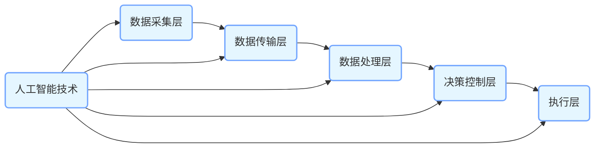

# 程序员在AI驱动的智能物流系统中的角色

> 关键词：程序员、AI、智能物流系统、角色、算法实现、系统开发

> 摘要：本文围绕程序员在AI驱动的智能物流系统中的角色展开探讨。首先介绍了智能物流系统的背景，明确目的、预期读者等内容。接着阐述了智能物流系统相关的核心概念与联系，包括原理和架构。详细讲解了其中涉及的核心算法原理与具体操作步骤，通过Python代码进行说明，并给出了相应的数学模型和公式。在项目实战部分，展示了开发环境搭建、源代码实现与解读。还介绍了智能物流系统的实际应用场景，推荐了相关的工具和资源。最后总结了未来发展趋势与挑战，提供了常见问题解答和参考资料，全面展现了程序员在智能物流系统中从技术实现到推动发展的重要角色。

## 1. 背景介绍 
### 1.1 目的和范围
随着全球经济的快速发展和电子商务的蓬勃兴起，物流行业面临着巨大的挑战和机遇。传统的物流管理模式已难以满足日益增长的业务需求，智能物流系统应运而生。智能物流系统借助人工智能（AI）、物联网（IoT）、大数据等先进技术，实现物流过程的自动化、智能化和高效化。

本文的目的在于深入探讨程序员在AI驱动的智能物流系统中的角色和作用。范围涵盖智能物流系统的各个环节，包括仓储管理、运输调度、配送路径规划等，以及程序员在系统开发、算法实现、系统优化等方面的具体工作。

### 1.2 预期读者
本文预期读者主要包括以下几类人群：
- **程序员和软件开发者**：希望了解智能物流系统的技术实现细节，以及自身在该领域的发展方向和工作重点。
- **物流行业从业者**：想要深入了解智能物流系统的技术原理，以便更好地与技术团队协作，推动物流业务的智能化升级。
- **技术管理人员和决策者**：需要掌握智能物流系统的整体架构和技术趋势，为企业的技术战略和投资决策提供参考。
- **科研人员和学生**：对智能物流系统和人工智能技术感兴趣，希望通过本文获取相关的理论知识和实践经验。

### 1.3 文档结构概述
本文将按照以下结构进行阐述：
- **核心概念与联系**：介绍智能物流系统和人工智能的核心概念，以及它们之间的联系，包括系统的原理和架构。
- **核心算法原理 & 具体操作步骤**：详细讲解智能物流系统中常用的核心算法，如路径规划算法、库存优化算法等，并给出Python代码示例。
- **数学模型和公式 & 详细讲解 & 举例说明**：介绍智能物流系统中涉及的数学模型和公式，如线性规划、图论等，并通过具体例子进行说明。
- **项目实战：代码实际案例和详细解释说明**：通过一个实际的智能物流系统项目，展示开发环境搭建、源代码实现和代码解读。
- **实际应用场景**：介绍智能物流系统在不同场景下的应用，如电商物流、快递配送、冷链物流等。
- **工具和资源推荐**：推荐学习智能物流系统和人工智能的相关书籍、在线课程、技术博客和网站，以及开发工具、框架和相关论文著作。
- **总结：未来发展趋势与挑战**：总结智能物流系统的未来发展趋势和面临的挑战，以及程序员在其中的应对策略。
- **附录：常见问题与解答**：解答读者在学习和实践过程中常见的问题。
- **扩展阅读 & 参考资料**：提供相关的扩展阅读材料和参考资料，方便读者进一步深入学习。

### 1.4 术语表
#### 1.4.1 核心术语定义
- **智能物流系统（Intelligent Logistics System）**：利用人工智能、物联网、大数据等技术，实现物流过程的自动化、智能化和高效化的系统。
- **人工智能（Artificial Intelligence，AI）**：研究如何使计算机系统能够模拟人类智能的技术和方法。
- **机器学习（Machine Learning）**：人工智能的一个分支，通过让计算机从数据中学习模式和规律，从而实现预测和决策。
- **深度学习（Deep Learning）**：一种基于人工神经网络的机器学习方法，能够处理复杂的非线性问题。
- **物联网（Internet of Things，IoT）**：通过各种信息传感器、射频识别技术、全球定位系统等技术，实现物与物、物与人的泛在连接，进行信息交换和通信的网络。
- **大数据（Big Data）**：指无法在一定时间范围内用常规软件工具进行捕捉、管理和处理的数据集合，具有海量、高增长和多样化的特点。

#### 1.4.2 相关概念解释
- **仓储管理**：对仓库内的货物进行存储、保管、出入库等管理的活动。
- **运输调度**：对运输车辆、驾驶员等资源进行合理安排和调度，以实现运输任务的高效完成。
- **配送路径规划**：根据货物的配送需求和交通状况，规划出最优的配送路径，以降低运输成本和提高配送效率。
- **库存优化**：通过合理控制库存水平，降低库存成本，同时满足客户的需求。

#### 1.4.3 缩略词列表
- **AI**：Artificial Intelligence（人工智能）
- **IoT**：Internet of Things（物联网）
- **ML**：Machine Learning（机器学习）
- **DL**：Deep Learning（深度学习）
- **GPS**：Global Positioning System（全球定位系统）
- **RFID**：Radio Frequency Identification（射频识别）

## 2. 核心概念与联系 

### 智能物流系统的核心概念
智能物流系统是一个复杂的综合性系统，它集成了多种先进技术，旨在实现物流过程的自动化、智能化和高效化。其核心目标是通过优化物流流程、提高资源利用率、降低成本，从而提升物流服务的质量和效率。

智能物流系统主要包括以下几个关键组成部分：
- **数据采集层**：通过各种传感器、设备和系统，采集物流过程中的各种数据，如货物信息、车辆位置、仓库库存等。
- **数据传输层**：将采集到的数据通过网络传输到数据处理中心，确保数据的实时性和准确性。
- **数据处理层**：对采集到的数据进行清洗、分析和挖掘，提取有价值的信息和知识，为决策提供支持。
- **决策控制层**：根据数据处理层提供的信息和知识，制定物流决策和控制策略，如运输调度、库存管理等。
- **执行层**：将决策控制层制定的策略和指令传递给相关的设备和系统，实现物流过程的自动化执行。

### 人工智能与智能物流系统的联系
人工智能技术为智能物流系统的发展提供了强大的支持和动力。通过应用人工智能技术，可以实现物流过程的智能化决策、自动化操作和优化管理。

具体来说，人工智能在智能物流系统中的应用主要体现在以下几个方面：
- **机器学习和深度学习**：通过对大量物流数据的学习和分析，建立预测模型和优化算法，实现物流需求预测、运输路径规划、库存管理等功能。
- **自然语言处理**：实现物流信息的自动识别、分类和理解，提高物流信息处理的效率和准确性。
- **计算机视觉**：用于货物的识别、定位和跟踪，实现物流过程的可视化和自动化。
- **智能机器人**：在仓储和配送环节中应用智能机器人，实现货物的自动搬运、分拣和包装，提高物流作业的效率和质量。

### 核心概念原理和架构的文本示意图
智能物流系统的核心概念原理和架构可以用以下文本示意图表示：

智能物流系统由数据采集层、数据传输层、数据处理层、决策控制层和执行层组成。数据采集层通过各种传感器和设备采集物流数据，数据传输层将数据传输到数据处理中心，数据处理层对数据进行分析和挖掘，决策控制层根据分析结果制定决策和策略，执行层将决策和策略传递给相关设备和系统进行执行。人工智能技术贯穿于整个智能物流系统的各个环节，为系统的智能化运行提供支持。

### Mermaid 流程图


## 3. 核心算法原理 & 具体操作步骤 

### 路径规划算法
路径规划是智能物流系统中的一个重要环节，其目标是在满足各种约束条件的前提下，找到一条最优的运输路径，以降低运输成本和提高运输效率。常见的路径规划算法包括Dijkstra算法、A*算法等。

#### Dijkstra算法原理
Dijkstra算法是一种经典的单源最短路径算法，用于计算一个节点到图中其他所有节点的最短路径。其基本思想是从起始节点开始，逐步扩展到其他节点，每次选择距离起始节点最近的节点进行扩展，直到所有节点都被扩展完毕。

#### Dijkstra算法Python代码实现
```python
import heapq

def dijkstra(graph, start):
    distances = {node: float('inf') for node in graph}
    distances[start] = 0
    priority_queue = [(0, start)]

    while priority_queue:
        current_distance, current_node = heapq.heappop(priority_queue)

        if current_distance > distances[current_node]:
            continue

        for neighbor, weight in graph[current_node].items():
            distance = current_distance + weight

            if distance < distances[neighbor]:
                distances[neighbor] = distance
                heapq.heappush(priority_queue, (distance, neighbor))

    return distances

# 示例图
graph = {
    'A': {'B': 1, 'C': 4},
    'B': {'A': 1, 'C': 2, 'D': 5},
    'C': {'A': 4, 'B': 2, 'D': 1},
    'D': {'B': 5, 'C': 1}
}

start_node = 'A'
distances = dijkstra(graph, start_node)
print(f"从节点 {start_node} 到其他节点的最短距离: {distances}")
```

#### 代码解释
1. **初始化距离字典**：将所有节点的距离初始化为无穷大，起始节点的距离初始化为0。
2. **使用优先队列**：将起始节点加入优先队列，队列中的元素按照距离从小到大排序。
3. **扩展节点**：从优先队列中取出距离最小的节点，更新其邻居节点的距离，如果邻居节点的距离被更新，则将其加入优先队列。
4. **重复步骤3**：直到优先队列为空。

### 库存优化算法
库存优化是智能物流系统中的另一个重要环节，其目标是在满足客户需求的前提下，最小化库存成本。常见的库存优化算法包括经济订货批量（EOQ）模型、ABC分类法等。

#### 经济订货批量（EOQ）模型原理
经济订货批量（EOQ）模型是一种经典的库存管理模型，用于确定最优的订货批量，以最小化库存成本。其基本思想是在订货成本和库存持有成本之间找到一个平衡点，使得总成本最小。

#### 经济订货批量（EOQ）模型Python代码实现
```python
import math

def eoq(demand, ordering_cost, holding_cost):
    return math.sqrt((2 * demand * ordering_cost) / holding_cost)

# 示例参数
demand = 1000  # 年需求量
ordering_cost = 50  # 每次订货成本
holding_cost = 2  # 单位库存持有成本

optimal_order_quantity = eoq(demand, ordering_cost, holding_cost)
print(f"最优订货批量: {optimal_order_quantity}")
```

#### 代码解释
1. **计算EOQ**：根据EOQ公式 $\text{EOQ} = \sqrt{\frac{2DS}{H}}$，其中 $D$ 为年需求量，$S$ 为每次订货成本，$H$ 为单位库存持有成本。
2. **返回结果**：返回计算得到的最优订货批量。

## 4. 数学模型和公式 & 详细讲解 & 举例说明 

### 路径规划中的图论模型
在路径规划问题中，通常可以将物流网络抽象为一个图 $G=(V, E)$，其中 $V$ 是节点集合，表示物流网络中的各个地点，如仓库、配送中心、客户地址等；$E$ 是边集合，表示节点之间的连接关系，边的权重表示节点之间的距离或运输成本。

#### Dijkstra算法的数学原理
Dijkstra算法的目标是找到从起始节点 $s$ 到图中其他所有节点的最短路径。设 $d(v)$ 表示从起始节点 $s$ 到节点 $v$ 的最短距离，初始时 $d(s)=0$，对于其他节点 $v\neq s$，$d(v)=\infty$。

在算法的每一步，选择一个距离起始节点最近的节点 $u$，并更新其邻居节点 $v$ 的距离：
$$
d(v)=\min\{d(v), d(u)+w(u, v)\}
$$
其中 $w(u, v)$ 表示节点 $u$ 到节点 $v$ 的边的权重。

#### 举例说明
假设有一个物流网络，用图表示如下：

| 节点 | 邻居节点及权重 |
| ---- | -------------- |
| A    | B(1), C(4)     |
| B    | A(1), C(2), D(5) |
| C    | A(4), B(2), D(1) |
| D    | B(5), C(1)     |

从节点A出发，使用Dijkstra算法计算到其他节点的最短距离：
- 初始时，$d(A)=0$，$d(B)=\infty$，$d(C)=\infty$，$d(D)=\infty$。
- 选择节点A，更新其邻居节点B和C的距离：$d(B)=1$，$d(C)=4$。
- 选择节点B，更新其邻居节点C和D的距离：$d(C)=\min\{4, 1+2\}=3$，$d(D)=\min\{\infty, 1+5\}=6$。
- 选择节点C，更新其邻居节点D的距离：$d(D)=\min\{6, 3+1\}=4$。
- 最终得到从节点A到其他节点的最短距离：$d(A)=0$，$d(B)=1$，$d(C)=3$，$d(D)=4$。

### 库存优化中的经济订货批量（EOQ）模型
经济订货批量（EOQ）模型的目标是在订货成本和库存持有成本之间找到一个平衡点，使得总成本最小。

#### 数学公式
设 $D$ 为年需求量，$S$ 为每次订货成本，$H$ 为单位库存持有成本，则经济订货批量（EOQ）公式为：
$$
\text{EOQ} = \sqrt{\frac{2DS}{H}}
$$

年总成本公式为：
$$
\text{TC} = \frac{D}{Q}S+\frac{Q}{2}H
$$
其中 $Q$ 为订货批量。

#### 举例说明
假设某企业每年需要采购1000件商品，每次订货成本为50元，单位库存持有成本为2元/件/年。则：
- 经济订货批量（EOQ）为：
$$
\text{EOQ} = \sqrt{\frac{2\times1000\times50}{2}} = 223.61 \approx 224 \text{ 件}
$$
- 年总成本为：
$$
\text{TC} = \frac{1000}{224}\times50+\frac{224}{2}\times2 = 446.43 \text{ 元}
$$

## 5. 项目实战：代码实际案例和详细解释说明 

### 5.1  开发环境搭建
#### 硬件环境
- **服务器**：建议使用配置较高的服务器，如Intel Xeon处理器、16GB以上内存、500GB以上硬盘。
- **存储设备**：可使用磁盘阵列或云存储，以保证数据的安全性和可靠性。
- **网络设备**：确保网络带宽足够，以支持数据的实时传输。

#### 软件环境
- **操作系统**：推荐使用Linux系统，如Ubuntu、CentOS等。
- **编程语言**：Python，版本3.6及以上。
- **数据库**：MySQL、MongoDB等，用于存储物流数据。
- **开发框架**：Django、Flask等，用于开发Web应用。
- **机器学习库**：Scikit-learn、TensorFlow、PyTorch等，用于实现机器学习和深度学习算法。

#### 安装步骤
1. **安装Python**：从Python官方网站下载Python安装包，按照安装向导进行安装。
2. **安装数据库**：根据选择的数据库类型，下载并安装相应的数据库软件，如MySQL、MongoDB等。
3. **安装开发框架**：使用pip命令安装Django、Flask等开发框架。
4. **安装机器学习库**：使用pip命令安装Scikit-learn、TensorFlow、PyTorch等机器学习库。

### 5.2  源代码详细实现和代码解读
#### 项目概述
本项目是一个简单的智能物流系统，实现了货物的入库、出库、库存管理和配送路径规划等功能。

#### 代码结构
```
smart_logistics_system/
├── app.py
├── models.py
├── routes.py
├── templates/
│   ├── index.html
│   ├── add_goods.html
│   ├── remove_goods.html
│   ├── view_inventory.html
│   ├── plan_route.html
└── static/
    ├── css/
    │   └── style.css
    └── js/
        └── script.js
```

#### app.py
```python
from flask import Flask, render_template
from models import db, Goods, Inventory
from routes import register_routes

app = Flask(__name__)
app.config['SQLALCHEMY_DATABASE_URI'] = 'sqlite:///smart_logistics.db'
app.config['SQLALCHEMY_TRACK_MODIFICATIONS'] = False
db.init_app(app)

with app.app_context():
    db.create_all()

register_routes(app)

if __name__ == '__main__':
    app.run(debug=True)
```

#### 代码解读
1. **初始化Flask应用**：创建一个Flask应用实例，并配置数据库连接信息。
2. **初始化数据库**：使用SQLAlchemy初始化数据库，并创建所有表。
3. **注册路由**：调用 `register_routes` 函数注册所有路由。
4. **运行应用**：启动Flask应用，开启调试模式。

#### models.py
```python
from flask_sqlalchemy import SQLAlchemy

db = SQLAlchemy()

class Goods(db.Model):
    id = db.Column(db.Integer, primary_key=True)
    name = db.Column(db.String(100), nullable=False)
    quantity = db.Column(db.Integer, nullable=False)

class Inventory(db.Model):
    id = db.Column(db.Integer, primary_key=True)
    goods_id = db.Column(db.Integer, db.ForeignKey('goods.id'), nullable=False)
    location = db.Column(db.String(100), nullable=False)
    quantity = db.Column(db.Integer, nullable=False)
    goods = db.relationship('Goods', backref=db.backref('inventories', lazy=True))
```

#### 代码解读
1. **定义数据库模型**：使用SQLAlchemy定义 `Goods` 和 `Inventory` 两个数据库模型，分别表示货物和库存信息。
2. **定义表结构**：定义表的字段，如 `id`、`name`、`quantity` 等，并设置主键、外键等约束条件。
3. **定义关系**：使用 `relationship` 方法定义 `Goods` 和 `Inventory` 之间的关联关系。

#### routes.py
```python
from flask import Flask, render_template, request, redirect, url_for
from models import db, Goods, Inventory
from dijkstra import dijkstra

def register_routes(app):
    @app.route('/')
    def index():
        return render_template('index.html')

    @app.route('/add_goods', methods=['GET', 'POST'])
    def add_goods():
        if request.method == 'POST':
            name = request.form.get('name')
            quantity = int(request.form.get('quantity'))
            new_goods = Goods(name=name, quantity=quantity)
            db.session.add(new_goods)
            db.session.commit()
            return redirect(url_for('index'))
        return render_template('add_goods.html')

    @app.route('/remove_goods', methods=['GET', 'POST'])
    def remove_goods():
        if request.method == 'POST':
            goods_id = int(request.form.get('goods_id'))
            goods = Goods.query.get(goods_id)
            if goods:
                db.session.delete(goods)
                db.session.commit()
            return redirect(url_for('index'))
        goods_list = Goods.query.all()
        return render_template('remove_goods.html', goods_list=goods_list)

    @app.route('/view_inventory')
    def view_inventory():
        inventory_list = Inventory.query.all()
        return render_template('view_inventory.html', inventory_list=inventory_list)

    @app.route('/plan_route', methods=['GET', 'POST'])
    def plan_route():
        if request.method == 'POST':
            start_node = request.form.get('start_node')
            graph = {
                'A': {'B': 1, 'C': 4},
                'B': {'A': 1, 'C': 2, 'D': 5},
                'C': {'A': 4, 'B': 2, 'D': 1},
                'D': {'B': 5, 'C': 1}
            }
            distances = dijkstra(graph, start_node)
            return render_template('plan_route.html', distances=distances)
        return render_template('plan_route.html')
```

#### 代码解读
1. **注册路由**：定义不同的路由，如 `/`、`/add_goods`、`/remove_goods` 等，处理不同的请求。
2. **货物管理**：实现货物的添加、删除功能，通过数据库操作实现数据的持久化。
3. **库存管理**：实现库存信息的查看功能，从数据库中查询库存信息并显示在页面上。
4. **路径规划**：实现配送路径规划功能，调用 `dijkstra` 算法计算最短路径，并将结果显示在页面上。

### 5.3  代码解读与分析
#### 数据库操作
本项目使用SQLAlchemy作为数据库操作工具，通过定义数据库模型和使用 `db.session` 进行数据库操作，如添加、删除、查询等。SQLAlchemy提供了方便的ORM（对象关系映射）功能，使得数据库操作更加简单和直观。

#### 路由处理
使用Flask的路由机制处理不同的请求，根据请求的URL和方法调用相应的处理函数。在处理函数中，可以进行数据的处理、数据库操作和页面渲染等操作。

#### 算法调用
在路径规划功能中，调用 `dijkstra` 算法计算最短路径。将图的信息和起始节点作为参数传递给 `dijkstra` 算法，得到最短路径的结果，并将结果显示在页面上。

#### 页面渲染
使用Flask的 `render_template` 函数渲染HTML模板，将数据传递给模板，在模板中使用Jinja2模板引擎进行数据的展示和处理。

## 6. 实际应用场景 
### 电商物流
在电商物流中，智能物流系统可以实现订单处理、仓储管理、运输调度和配送路径规划等功能。通过人工智能技术，可以对订单进行实时分析和预测，合理安排仓储和运输资源，优化配送路径，提高物流效率和客户满意度。

例如，电商平台可以根据用户的购买历史和地理位置信息，预测用户的购买需求，提前将商品存储在离用户较近的仓库中，以便在用户下单后能够快速配送。同时，智能物流系统可以实时跟踪货物的运输状态，及时向用户推送物流信息，提高用户的购物体验。

### 快递配送
在快递配送中，智能物流系统可以实现快递包裹的分拣、扫描、运输和派送等功能。通过计算机视觉技术，可以对快递包裹进行自动识别和分类，提高分拣效率和准确性。同时，智能物流系统可以根据快递包裹的目的地和交通状况，优化运输路线和派送顺序，提高派送效率和服务质量。

例如，快递公司可以使用智能机器人进行快递包裹的分拣和搬运，减少人工操作，提高工作效率。同时，通过智能物流系统的实时监控和调度功能，可以及时处理快递包裹的异常情况，如延误、丢失等，提高客户的满意度。

### 冷链物流
在冷链物流中，智能物流系统可以实现温度监控、货物跟踪和运输调度等功能。通过物联网技术，可以实时监测冷链运输车辆和仓库的温度、湿度等环境参数，确保货物的质量和安全。同时，智能物流系统可以根据货物的特性和运输要求，合理安排运输路线和运输时间，提高冷链物流的效率和效益。

例如，冷链物流企业可以使用温度传感器和GPS定位系统，实时监测冷链运输车辆的温度和位置信息，并将数据传输到智能物流系统中。智能物流系统可以根据数据进行分析和预警，及时采取措施保证货物的质量和安全。

### 制造业物流
在制造业物流中，智能物流系统可以实现原材料采购、生产配送和成品仓储等功能。通过人工智能技术，可以对生产计划和物流需求进行预测和优化，合理安排原材料的采购和配送，提高生产效率和降低成本。

例如，制造企业可以使用智能物流系统对生产线上的物料进行实时监控和管理，确保物料的及时供应和准确配送。同时，智能物流系统可以根据生产进度和订单需求，优化成品的仓储和运输，提高企业的市场响应能力。

## 7. 工具和资源推荐
### 7.1 学习资源推荐
#### 7.1.1 书籍推荐
- 《人工智能：一种现代的方法》：全面介绍了人工智能的基本概念、算法和应用，是人工智能领域的经典教材。
- 《Python机器学习》：详细介绍了Python在机器学习中的应用，包括数据预处理、模型选择、评估和优化等内容。
- 《物流管理》：系统介绍了物流管理的基本理论、方法和技术，是物流管理领域的经典教材。
- 《深度学习》：由深度学习领域的三位顶尖专家撰写，全面介绍了深度学习的理论、算法和应用。

#### 7.1.2 在线课程
- Coursera上的“人工智能基础”课程：由全球知名大学的教授授课，系统介绍了人工智能的基本概念、算法和应用。
- edX上的“Python数据科学”课程：介绍了Python在数据科学中的应用，包括数据处理、数据分析和机器学习等内容。
- 中国大学MOOC上的“物流工程与管理”课程：系统介绍了物流工程与管理的基本理论、方法和技术。
- Udemy上的“深度学习实战”课程：通过实际项目，介绍了深度学习的应用和实践技巧。

#### 7.1.3 技术博客和网站
- 机器之心：提供人工智能领域的最新技术、研究成果和应用案例。
- 开源中国：提供开源技术的资讯、教程和代码分享。
- 物流沙龙：专注于物流行业的资讯、研究和交流。
- 博客园：程序员的技术交流平台，有很多关于人工智能和物流系统的技术文章。

### 7.2 开发工具框架推荐
#### 7.2.1 IDE和编辑器
- PyCharm：专业的Python集成开发环境，提供代码编辑、调试、版本控制等功能。
- Visual Studio Code：轻量级的代码编辑器，支持多种编程语言，有丰富的插件扩展。
- Jupyter Notebook：交互式的开发环境，适合数据探索和模型实验。

#### 7.2.2 调试和性能分析工具
- PySnooper：简单易用的Python调试工具，可以自动打印函数的调用过程和变量的值。
- cProfile：Python内置的性能分析工具，可以分析代码的运行时间和调用次数。
- TensorBoard：TensorFlow的可视化工具，可以用于查看模型的训练过程和性能指标。

#### 7.2.3 相关框架和库
- Scikit-learn：简单易用的机器学习库，提供了丰富的机器学习算法和工具。
- TensorFlow：开源的深度学习框架，广泛应用于图像识别、自然语言处理等领域。
- PyTorch：另一个流行的深度学习框架，具有动态图和易于使用的特点。
- Django：Python的Web开发框架，适合快速开发Web应用。
- Flask：轻量级的Python Web开发框架，适合小型项目和快速原型开发。

### 7.3 相关论文著作推荐
#### 7.3.1 经典论文
- “A* Search Algorithm”：介绍了A*搜索算法的原理和应用，是路径规划领域的经典论文。
- “Economic Order Quantity (EOQ) Model”：介绍了经济订货批量（EOQ）模型的原理和应用，是库存管理领域的经典论文。
- “Reinforcement Learning: An Introduction”：介绍了强化学习的基本概念、算法和应用，是强化学习领域的经典著作。

#### 7.3.2 最新研究成果
- 关注顶级学术会议和期刊，如NeurIPS、ICML、KDD等，了解人工智能和物流领域的最新研究成果。
- 关注知名研究机构和学者的研究动态，如斯坦福大学、麻省理工学院、谷歌研究等。

#### 7.3.3 应用案例分析
- 阅读相关的行业报告和案例分析，了解智能物流系统在不同行业的应用实践和成功经验。
- 关注行业领军企业的技术创新和应用案例，如亚马逊、京东、顺丰等。

## 8. 总结：未来发展趋势与挑战
### 未来发展趋势
#### 智能化程度不断提高
随着人工智能技术的不断发展，智能物流系统的智能化程度将不断提高。未来，智能物流系统将能够实现更加复杂的决策和优化，如自主学习、自适应调整等，进一步提高物流效率和服务质量。

#### 与物联网深度融合
物联网技术将为智能物流系统提供更加丰富的数据来源，实现物流过程的全面感知和实时监控。未来，智能物流系统将与物联网深度融合，实现货物、车辆、仓库等设备的互联互通，提高物流管理的精细化水平。

#### 绿色物流成为趋势
随着环保意识的不断提高，绿色物流将成为未来物流行业的发展趋势。智能物流系统将在降低能源消耗、减少环境污染等方面发挥重要作用，如优化运输路线、采用新能源车辆等。

#### 跨境物流智能化
随着全球经济一体化的发展，跨境物流的需求不断增加。智能物流系统将在跨境物流中发挥重要作用，实现跨境物流的智能化管理和高效运作，如海关通关自动化、跨境运输优化等。

### 挑战
#### 数据安全和隐私问题
智能物流系统涉及大量的物流数据，如货物信息、客户信息、运输轨迹等，数据安全和隐私问题成为重要挑战。程序员需要采取有效的数据安全措施，如加密技术、访问控制等，保护数据的安全和隐私。

#### 技术集成和兼容性问题
智能物流系统需要集成多种先进技术，如人工智能、物联网、大数据等，技术集成和兼容性问题成为挑战。程序员需要具备跨领域的技术知识，能够解决不同技术之间的集成和兼容性问题。

#### 人才短缺问题
智能物流系统的发展需要大量的专业人才，如程序员、算法工程师、物流专家等。目前，相关领域的人才短缺问题较为突出，程序员需要不断学习和提升自己的技能，以适应智能物流系统发展的需求。

#### 标准和规范缺失问题
目前，智能物流系统的标准和规范还不够完善，不同企业和系统之间的兼容性和互操作性较差。程序员需要积极参与标准和规范的制定，推动智能物流系统的标准化和规范化发展。

## 9. 附录：常见问题与解答
### 问题1：智能物流系统的建设需要多长时间？
智能物流系统的建设时间取决于系统的规模和复杂度。小型的智能物流系统可能需要几个月的时间，而大型的、复杂的智能物流系统可能需要数年的时间。建设过程包括需求分析、系统设计、开发、测试、上线等多个阶段，每个阶段都需要投入一定的时间和精力。

### 问题2：智能物流系统的成本高吗？
智能物流系统的成本包括硬件设备成本、软件研发成本、人员培训成本等。硬件设备成本取决于系统的规模和配置，软件研发成本取决于系统的复杂度和功能需求。一般来说，智能物流系统的前期投资较高，但从长期来看，它可以提高物流效率、降低成本，带来显著的经济效益。

### 问题3：智能物流系统对物流行业的就业有什么影响？
智能物流系统的应用会对物流行业的就业结构产生一定的影响。一方面，一些传统的物流岗位可能会被自动化设备和智能系统所取代，如仓库搬运工、分拣员等。另一方面，智能物流系统的发展也会创造一些新的就业机会，如程序员、算法工程师、系统运维人员等。因此，物流行业的从业者需要不断学习和提升自己的技能，以适应智能物流系统的发展需求。

### 问题4：如何评估智能物流系统的性能？
评估智能物流系统的性能可以从多个方面进行，如物流效率、成本、服务质量等。具体指标包括订单处理时间、库存周转率、运输成本、客户满意度等。可以通过建立性能评估指标体系，定期对智能物流系统的性能进行评估和分析，及时发现问题并进行优化和改进。

### 问题5：智能物流系统与传统物流系统有什么区别？
智能物流系统与传统物流系统的主要区别在于智能化程度和技术应用。传统物流系统主要依靠人工操作和经验管理，效率较低、成本较高。而智能物流系统则利用人工智能、物联网、大数据等先进技术，实现物流过程的自动化、智能化和高效化，能够提高物流效率、降低成本、提升服务质量。

## 10. 扩展阅读 & 参考资料
### 扩展阅读
- 《智能物流：技术与应用》：详细介绍了智能物流的技术原理和应用案例，是深入了解智能物流的优秀书籍。
- 《物流大数据分析与应用》：介绍了物流大数据的采集、处理、分析和应用方法，对智能物流系统的数据分析有很大的帮助。
- 《人工智能与物流革命》：探讨了人工智能技术在物流行业的应用和发展趋势，为智能物流系统的未来发展提供了思路。

### 参考资料
- [Python官方文档](https://docs.python.org/3/)
- [Flask官方文档](https://flask.palletsprojects.com/en/2.2.x/)
- [SQLAlchemy官方文档](https://docs.sqlalchemy.org/en/14/)
- [Scikit-learn官方文档](https://scikit-learn.org/stable/)
- [TensorFlow官方文档](https://www.tensorflow.org/api_docs)
- [PyTorch官方文档](https://pytorch.org/docs/stable/)