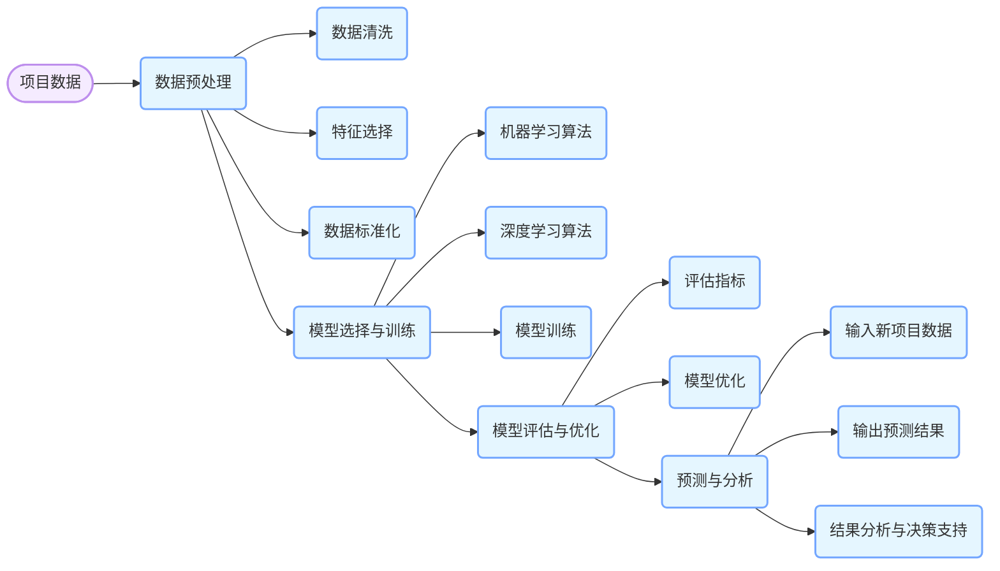

# 程序员如何利用AI进行项目预测分析

> 关键词：程序员、AI、项目预测分析、机器学习、数据分析、算法模型、预测技术

> 摘要：本文聚焦于程序员如何利用AI进行项目预测分析这一核心主题。随着信息技术的飞速发展，项目预测分析对于项目的成功实施愈发关键，AI技术的崛起为其带来了新的机遇和方法。文章将深入探讨相关的核心概念、算法原理、数学模型，通过项目实战案例详细阐述具体操作步骤，介绍实际应用场景，并推荐相关的工具和资源，最后总结未来发展趋势与挑战，旨在为程序员提供全面且实用的利用AI进行项目预测分析的指导。

## 1. 背景介绍 
### 1.1 目的和范围
在当今数字化时代，项目的复杂度和不确定性不断增加，准确的项目预测分析对于合理分配资源、制定计划以及确保项目成功至关重要。本文的目的在于帮助程序员了解如何借助AI技术进行项目预测分析，范围涵盖了从基础概念的理解到实际项目中的应用，以及相关工具和资源的推荐等方面。

### 1.2 预期读者
本文主要面向广大程序员群体，无论是新手程序员希望学习新的技术和方法，还是有经验的程序员寻求更高效的项目预测分析手段，都能从本文中获得有价值的信息。同时，对于项目管理人员、数据分析人员等对项目预测分析感兴趣的人员也具有一定的参考价值。

### 1.3 文档结构概述
本文首先介绍相关的背景知识，包括目的、预期读者和文档结构。接着阐述核心概念与联系，包括AI、项目预测分析等概念及其相互关系，并通过示意图和流程图进行直观展示。然后详细讲解核心算法原理和具体操作步骤，结合Python源代码进行说明。之后介绍数学模型和公式，并举例说明。再通过项目实战案例展示代码的实际应用和详细解释。随后介绍实际应用场景，推荐相关的工具和资源。最后总结未来发展趋势与挑战，提供常见问题与解答以及扩展阅读和参考资料。

### 1.4 术语表
#### 1.4.1 核心术语定义
- **AI（Artificial Intelligence）**：即人工智能，是研究、开发用于模拟、延伸和扩展人的智能的理论、方法、技术及应用系统的一门新的技术科学。
- **项目预测分析**：指在项目实施前或实施过程中，运用各种方法和技术对项目的进度、成本、质量等方面进行预测和分析，以辅助决策和管理。
- **机器学习（Machine Learning）**：是一门多领域交叉学科，涉及概率论、统计学、逼近论、凸分析、算法复杂度理论等多门学科。它专门研究计算机怎样模拟或实现人类的学习行为，以获取新的知识或技能，重新组织已有的知识结构使之不断改善自身的性能。
- **数据分析（Data Analysis）**：指用适当的统计分析方法对收集来的大量数据进行分析，提取有用信息和形成结论而对数据加以详细研究和概括总结的过程。

#### 1.4.2 相关概念解释
- **深度学习（Deep Learning）**：是机器学习的一个分支领域，它是一种基于对数据进行表征学习的方法。深度学习通过构建具有很多层的神经网络模型，自动从大量数据中学习特征和模式。
- **回归分析**：是一种统计分析方法，用于确定两个或多个变量之间的定量关系。在项目预测分析中，可用于预测连续型变量，如项目成本、工期等。
- **分类算法**：是一种机器学习算法，用于将数据样本分类到不同的类别中。在项目预测分析中，可用于预测项目的风险等级、成功与否等离散型变量。

#### 1.4.3 缩略词列表
- **AI**：Artificial Intelligence（人工智能）
- **ML**：Machine Learning（机器学习）
- **DL**：Deep Learning（深度学习）

## 2. 核心概念与联系 

### 核心概念原理
- **AI与项目预测分析的关系**：AI技术为项目预测分析提供了强大的工具和方法。通过机器学习、深度学习等算法，AI可以处理大量的项目数据，挖掘数据中的潜在模式和规律，从而对项目的未来发展进行预测。例如，利用历史项目数据训练机器学习模型，该模型可以根据当前项目的特征预测项目的工期、成本等关键指标。
- **机器学习在项目预测分析中的应用原理**：机器学习算法通过对历史项目数据的学习，构建预测模型。这些模型可以根据新的项目数据输入，输出预测结果。常见的机器学习算法包括线性回归、决策树、支持向量机等。例如，线性回归算法通过找到数据中的线性关系，来预测连续型变量；决策树算法通过构建决策树模型，对数据进行分类和预测。

### 架构的文本示意图
```plaintext
项目数据
|
|-- 数据预处理
|   |-- 数据清洗
|   |-- 特征选择
|   |-- 数据标准化
|
|-- 模型选择与训练
|   |-- 机器学习算法（线性回归、决策树等）
|   |-- 深度学习算法（神经网络等）
|   |-- 模型训练
|
|-- 模型评估与优化
|   |-- 评估指标（准确率、召回率等）
|   |-- 模型优化（参数调整等）
|
|-- 预测与分析
|   |-- 输入新项目数据
|   |-- 输出预测结果
|   |-- 结果分析与决策支持
```

### Mermaid流程图


## 3. 核心算法原理 & 具体操作步骤 

### 线性回归算法原理
线性回归是一种简单而常用的机器学习算法，用于预测连续型变量。其基本原理是通过找到数据中的线性关系，来构建预测模型。线性回归模型的数学表达式为：

$$y = \theta_0 + \theta_1x_1 + \theta_2x_2 + \cdots + \theta_nx_n$$

其中，$y$ 是预测值，$x_1, x_2, \cdots, x_n$ 是输入特征，$\theta_0, \theta_1, \cdots, \theta_n$ 是模型的参数。

### 具体操作步骤
1. **数据收集**：收集与项目相关的历史数据，例如项目的规模、资源投入、工期等。
2. **数据预处理**：对收集到的数据进行清洗、特征选择和数据标准化等操作，以提高模型的性能。
3. **模型训练**：使用训练数据来训练线性回归模型，找到最优的参数 $\theta$。
4. **模型评估**：使用测试数据对训练好的模型进行评估，计算评估指标，如均方误差（MSE）、均方根误差（RMSE）等。
5. **预测与分析**：使用训练好的模型对新项目数据进行预测，并对预测结果进行分析和决策支持。

### Python源代码实现
```python
import numpy as np
from sklearn.linear_model import LinearRegression
from sklearn.model_selection import train_test_split
from sklearn.metrics import mean_squared_error

# 生成示例数据
np.random.seed(0)
X = np.random.rand(100, 1)
y = 2 * X + 1 + 0.5 * np.random.randn(100, 1)

# 划分训练集和测试集
X_train, X_test, y_train, y_test = train_test_split(X, y, test_size=0.2, random_state=42)

# 创建线性回归模型
model = LinearRegression()

# 训练模型
model.fit(X_train, y_train)

# 预测
y_pred = model.predict(X_test)

# 评估模型
mse = mean_squared_error(y_test, y_pred)
rmse = np.sqrt(mse)

print(f"均方误差 (MSE): {mse}")
print(f"均方根误差 (RMSE): {rmse}")
```

### 代码解释
1. **数据生成**：使用 `np.random.rand` 生成随机的输入特征 $X$，并根据线性关系生成对应的目标值 $y$，同时添加一些噪声。
2. **数据划分**：使用 `train_test_split` 函数将数据划分为训练集和测试集，测试集占比为 20%。
3. **模型创建**：使用 `LinearRegression` 类创建线性回归模型。
4. **模型训练**：使用 `fit` 方法对模型进行训练，找到最优的参数 $\theta$。
5. **模型预测**：使用 `predict` 方法对测试集进行预测，得到预测结果 $y_pred$。
6. **模型评估**：使用 `mean_squared_error` 函数计算均方误差（MSE），并计算均方根误差（RMSE）。

## 4. 数学模型和公式 & 详细讲解 & 举例说明 

### 线性回归的数学模型
线性回归的目标是找到最优的参数 $\theta$，使得预测值 $y$ 与真实值 $\hat{y}$ 之间的误差最小。常用的误差度量方法是均方误差（MSE），其数学表达式为：

$$MSE = \frac{1}{m} \sum_{i=1}^{m} (y^{(i)} - \hat{y}^{(i)})^2$$

其中，$m$ 是样本数量，$y^{(i)}$ 是第 $i$ 个样本的真实值，$\hat{y}^{(i)}$ 是第 $i$ 个样本的预测值。

### 最小二乘法求解参数 $\theta$
为了找到最优的参数 $\theta$，可以使用最小二乘法。最小二乘法的目标是最小化均方误差（MSE），即：

$$\min_{\theta} MSE(\theta)$$

对于线性回归模型，最小二乘法的解可以通过以下公式得到：

$$\theta = (X^T X)^{-1} X^T y$$

其中，$X$ 是输入特征矩阵，$y$ 是目标值向量。

### 举例说明
假设有以下数据集：

| 特征 $x$ | 目标值 $y$ |
| --- | --- |
| 1 | 3 |
| 2 | 5 |
| 3 | 7 |
| 4 | 9 |

首先，将数据集表示为矩阵形式：

$$X = \begin{bmatrix} 1 & 1 \\ 1 & 2 \\ 1 & 3 \\ 1 & 4 \end{bmatrix}, y = \begin{bmatrix} 3 \\ 5 \\ 7 \\ 9 \end{bmatrix}$$

然后，计算 $X^T X$ 和 $X^T y$：

$$X^T X = \begin{bmatrix} 4 & 10 \\ 10 & 30 \end{bmatrix}, X^T y = \begin{bmatrix} 24 \\ 70 \end{bmatrix}$$

接着，计算 $(X^T X)^{-1}$：

$$(X^T X)^{-1} = \frac{1}{4 \times 30 - 10 \times 10} \begin{bmatrix} 30 & -10 \\ -10 & 4 \end{bmatrix} = \begin{bmatrix} 1.5 & -0.5 \\ -0.5 & 0.2 \end{bmatrix}$$

最后，计算参数 $\theta$：

$$\theta = (X^T X)^{-1} X^T y = \begin{bmatrix} 1.5 & -0.5 \\ -0.5 & 0.2 \end{bmatrix} \begin{bmatrix} 24 \\ 70 \end{bmatrix} = \begin{bmatrix} 1 \\ 2 \end{bmatrix}$$

因此，线性回归模型的表达式为 $y = 1 + 2x$。

## 5. 项目实战：代码实际案例和详细解释说明 

### 5.1  开发环境搭建
- **操作系统**：推荐使用 Linux 或 macOS 系统，也可以使用 Windows 系统。
- **Python 环境**：安装 Python 3.6 及以上版本。
- **开发工具**：推荐使用 PyCharm 或 Jupyter Notebook 作为开发工具。
- **相关库**：安装 `numpy`、`pandas`、`scikit-learn` 等相关库，可以使用以下命令进行安装：

```sh
pip install numpy pandas scikit-learn
```

### 5.2  源代码详细实现和代码解读
以下是一个使用线性回归模型预测项目成本的实际案例：

```python
import numpy as np
import pandas as pd
from sklearn.linear_model import LinearRegression
from sklearn.model_selection import train_test_split
from sklearn.metrics import mean_squared_error

# 加载数据
data = pd.read_csv('project_data.csv')

# 提取特征和目标值
X = data[['project_size', 'resource投入']].values
y = data['cost'].values

# 划分训练集和测试集
X_train, X_test, y_train, y_test = train_test_split(X, y, test_size=0.2, random_state=42)

# 创建线性回归模型
model = LinearRegression()

# 训练模型
model.fit(X_train, y_train)

# 预测
y_pred = model.predict(X_test)

# 评估模型
mse = mean_squared_error(y_test, y_pred)
rmse = np.sqrt(mse)

print(f"均方误差 (MSE): {mse}")
print(f"均方根误差 (RMSE): {rmse}")

# 预测新项目成本
new_project = np.array([[100, 20]])
new_cost = model.predict(new_project)
print(f"新项目成本预测值: {new_cost[0]}")
```

### 5.3  代码解读与分析
1. **数据加载**：使用 `pandas` 库的 `read_csv` 函数加载项目数据文件 `project_data.csv`。
2. **特征提取**：从数据中提取项目规模和资源投入作为特征，成本作为目标值。
3. **数据划分**：使用 `train_test_split` 函数将数据划分为训练集和测试集，测试集占比为 20%。
4. **模型创建**：使用 `LinearRegression` 类创建线性回归模型。
5. **模型训练**：使用 `fit` 方法对模型进行训练，找到最优的参数 $\theta$。
6. **模型预测**：使用 `predict` 方法对测试集进行预测，得到预测结果 $y_pred$。
7. **模型评估**：使用 `mean_squared_error` 函数计算均方误差（MSE），并计算均方根误差（RMSE）。
8. **新项目预测**：创建一个新的项目数据样本，使用训练好的模型进行预测，得到新项目的成本预测值。

## 6. 实际应用场景 
### 项目工期预测
在软件开发项目中，程序员可以利用AI技术对项目的工期进行预测。通过分析历史项目数据，包括项目的规模、功能复杂度、团队人员配置等因素，训练机器学习模型，从而预测新项目的工期。这有助于项目管理人员合理安排资源和制定计划，提高项目的成功率。

### 项目成本预测
AI技术还可以用于项目成本的预测。通过分析项目的各种成本因素，如人力成本、物料成本、设备成本等，结合历史项目数据，训练预测模型。这样可以在项目启动前对成本进行准确的估算，避免成本超支的情况发生。

### 项目风险预测
在项目实施过程中，存在各种风险因素，如技术风险、人员风险、市场风险等。程序员可以利用AI技术对这些风险因素进行分析和预测。通过构建分类模型，将项目的风险等级分为高、中、低等不同级别，提前采取相应的措施来降低风险。

### 资源需求预测
在项目实施过程中，需要合理安排资源，包括人力、物力、财力等。AI技术可以根据项目的进度和需求，预测未来的资源需求。例如，通过分析历史项目数据和当前项目的进展情况，预测下一个阶段所需的开发人员数量、设备数量等，从而实现资源的优化配置。

## 7. 工具和资源推荐
### 7.1 学习资源推荐
#### 7.1.1 书籍推荐
- 《机器学习》（周志华著）：这本书是机器学习领域的经典教材，全面介绍了机器学习的基本概念、算法和应用。
- 《Python 机器学习》（Sebastian Raschka 著）：该书详细介绍了如何使用 Python 进行机器学习，包括数据预处理、模型选择、模型评估等内容。
- 《深度学习》（Ian Goodfellow、Yoshua Bengio 和 Aaron Courville 著）：这是深度学习领域的权威书籍，深入介绍了深度学习的理论和实践。

#### 7.1.2 在线课程
- Coursera 上的《机器学习》课程（Andrew Ng 教授主讲）：这是一门非常经典的机器学习课程，适合初学者入门。
- edX 上的《深度学习》课程：由知名学者和专家授课，深入讲解深度学习的原理和应用。
- 哔哩哔哩（B 站）上有很多关于机器学习和 AI 的免费教程，适合初学者学习。

#### 7.1.3 技术博客和网站
- 博客园：有很多程序员分享的关于机器学习和 AI 的技术文章。
- 稀土掘金：提供了丰富的技术文章和案例，涵盖了机器学习、深度学习等领域。
- Kaggle：是一个数据科学竞赛平台，上面有很多优秀的数据分析和机器学习案例，可以学习和参考。

### 7.2 开发工具框架推荐
#### 7.2.1 IDE和编辑器
- PyCharm：是一款专业的 Python 集成开发环境，提供了丰富的功能和插件，方便开发和调试。
- Jupyter Notebook：是一个交互式的开发环境，适合进行数据分析和模型训练的实验。
- Visual Studio Code：是一款轻量级的代码编辑器，支持多种编程语言和插件，也可以用于 Python 开发。

#### 7.2.2 调试和性能分析工具
- PySnooper：可以方便地调试 Python 代码，输出代码的执行过程和变量的值。
- cProfile：是 Python 内置的性能分析工具，可以分析代码的性能瓶颈。
- TensorBoard：是 TensorFlow 提供的可视化工具，可以用于可视化模型的训练过程和性能指标。

#### 7.2.3 相关框架和库
- Scikit-learn：是一个简单易用的机器学习库，提供了各种机器学习算法和工具，适合初学者使用。
- TensorFlow：是一个开源的深度学习框架，由 Google 开发，广泛应用于深度学习领域。
- PyTorch：是另一个流行的深度学习框架，由 Facebook 开发，具有动态计算图的特点，适合研究和开发。

### 7.3 相关论文著作推荐
#### 7.3.1 经典论文
- 《A Machine Learning Approach to Software Effort Estimation》：该论文介绍了如何使用机器学习方法进行软件项目的工作量估算。
- 《Deep Learning》：这是深度学习领域的经典综述论文，对深度学习的发展和应用进行了全面的介绍。
- 《Pattern Recognition and Machine Learning》：这本书是模式识别和机器学习领域的经典著作，对相关理论和算法进行了深入的阐述。

#### 7.3.2 最新研究成果
- 可以通过学术搜索引擎，如 Google Scholar、IEEE Xplore 等，搜索最新的关于项目预测分析和 AI 技术的研究论文。
- 参加相关的学术会议，如 NeurIPS、ICML 等，了解最新的研究进展和成果。

#### 7.3.3 应用案例分析
- 可以在 Kaggle 等平台上找到很多关于项目预测分析的实际应用案例，通过学习这些案例可以了解如何将 AI 技术应用到实际项目中。
- 一些知名企业的技术博客也会分享他们在项目预测分析方面的实践经验和案例，如 Google、Facebook 等。

## 8. 总结：未来发展趋势与挑战
### 未来发展趋势
- **多模态数据融合**：未来的项目预测分析将不仅仅依赖于结构化数据，还会融合文本、图像、音频等多模态数据，以提高预测的准确性和全面性。
- **深度学习的进一步应用**：深度学习技术将在项目预测分析中得到更广泛的应用，如使用卷积神经网络（CNN）处理图像数据，使用循环神经网络（RNN）处理序列数据等。
- **实时预测与监控**：随着物联网技术的发展，项目数据可以实时获取，未来的项目预测分析将实现实时预测和监控，及时发现项目中的问题并采取措施。
- **自动化机器学习（AutoML）**：AutoML 技术将简化机器学习模型的开发过程，使得程序员可以更轻松地利用 AI 进行项目预测分析，降低技术门槛。

### 挑战
- **数据质量问题**：项目数据往往存在噪声、缺失值等问题，数据质量的好坏直接影响预测模型的性能。因此，如何提高数据质量是一个重要的挑战。
- **模型解释性**：深度学习模型通常是黑盒模型，其预测结果难以解释。在项目预测分析中，需要对预测结果进行解释，以便项目管理人员做出决策。因此，如何提高模型的解释性是一个亟待解决的问题。
- **隐私和安全问题**：项目数据往往包含敏感信息，如用户隐私、商业机密等。在利用 AI 进行项目预测分析时，需要确保数据的隐私和安全，防止数据泄露。
- **技术更新换代快**：AI 技术发展迅速，新的算法和模型不断涌现。程序员需要不断学习和更新知识，以跟上技术的发展步伐。

## 9. 附录：常见问题与解答
### 问题 1：如何选择合适的机器学习算法？
答：选择合适的机器学习算法需要考虑多个因素，如数据类型、问题类型、数据规模等。对于连续型变量的预测问题，可以选择线性回归、决策树回归等算法；对于离散型变量的分类问题，可以选择逻辑回归、决策树分类、支持向量机等算法。此外，还可以通过交叉验证等方法比较不同算法的性能，选择最优的算法。

### 问题 2：数据预处理的重要性是什么？
答：数据预处理是项目预测分析中非常重要的一步。原始数据往往存在噪声、缺失值、异常值等问题，这些问题会影响模型的性能。通过数据预处理，可以清洗数据、处理缺失值、进行特征选择和数据标准化等操作，提高数据的质量和模型的性能。

### 问题 3：如何评估预测模型的性能？
答：评估预测模型的性能可以使用多种指标，如均方误差（MSE）、均方根误差（RMSE）、平均绝对误差（MAE）、准确率、召回率、F1 值等。对于回归问题，常用的评估指标是 MSE、RMSE 和 MAE；对于分类问题，常用的评估指标是准确率、召回率和 F1 值。可以根据具体的问题选择合适的评估指标。

### 问题 4：如何优化预测模型？
答：优化预测模型可以从多个方面入手，如调整模型的参数、选择更合适的特征、使用更复杂的模型等。可以使用网格搜索、随机搜索等方法来寻找最优的参数组合。此外，还可以通过特征工程来选择更有价值的特征，提高模型的性能。

## 10. 扩展阅读 & 参考资料
### 扩展阅读
- 《人工智能：现代方法》（Stuart Russell 和 Peter Norvig 著）：这本书是人工智能领域的经典教材，全面介绍了人工智能的基本概念、算法和应用。
- 《数据挖掘：概念与技术》（Jiawei Han、Jian Pei 和 Jianying Yin 著）：该书详细介绍了数据挖掘的基本概念、算法和应用，对于理解项目预测分析中的数据处理和挖掘有很大的帮助。
- 《Python 数据科学手册》（Jake VanderPlas 著）：这本书介绍了如何使用 Python 进行数据科学研究，包括数据处理、数据分析、机器学习等内容。

### 参考资料
- Scikit-learn 官方文档：https://scikit-learn.org/stable/
- TensorFlow 官方文档：https://www.tensorflow.org/
- PyTorch 官方文档：https://pytorch.org/
- Kaggle 官方网站：https://www.kaggle.com/