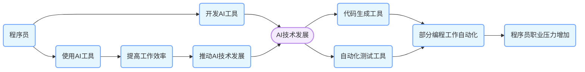

# 程序员如何应对AI带来的职业压力

> 关键词：程序员、AI、职业压力、应对策略、技术变革、职业发展、技能提升

> 摘要：随着人工智能（AI）技术的飞速发展，程序员面临着前所未有的职业压力。AI在代码生成、自动化测试等领域的应用，使得部分编程工作的门槛降低，程序员的工作受到一定程度的冲击。本文旨在深入分析AI给程序员带来的职业压力来源，探讨程序员应对这些压力的有效策略，包括技能提升、职业转型、思维转变等方面，帮助程序员在AI时代保持竞争力，实现职业的可持续发展。

## 1. 背景介绍 
### 1.1 目的和范围
本文的目的是全面分析AI给程序员带来的职业压力，并提供切实可行的应对方法。范围涵盖了AI技术对程序员职业的各个方面的影响，包括工作内容、职业前景、技能要求等，同时探讨了程序员在不同职业阶段和不同领域中应对AI压力的策略。

### 1.2 预期读者
本文预期读者主要为广大程序员群体，包括初级、中级和高级程序员，以及对编程职业发展感兴趣的相关人员，如计算机专业学生、技术管理者等。

### 1.3 文档结构概述
本文首先介绍背景信息，让读者了解AI对程序员职业压力影响的大环境。接着阐述核心概念，包括AI和程序员职业的相关联系。然后详细讲解应对AI压力的核心算法原理和具体操作步骤，通过数学模型进一步分析。再通过项目实战案例加深理解。之后介绍AI在程序员职业中的实际应用场景，推荐相关的学习资源、开发工具和论文著作。最后总结未来发展趋势与挑战，解答常见问题，并提供扩展阅读和参考资料。

### 1.4 术语表
#### 1.4.1 核心术语定义
- **人工智能（AI）**：是一门研究如何使计算机能够模拟人类智能的学科和技术领域，包括机器学习、深度学习、自然语言处理等多种技术。
- **程序员**：指从事程序开发、维护的专业人员，通过编写代码来实现各种软件和系统的功能。
- **职业压力**：指程序员在工作中面临的各种挑战和负担，包括技术更新压力、工作竞争压力、职业发展瓶颈等。

#### 1.4.2 相关概念解释
- **代码生成AI**：能够根据用户的需求自动生成代码的人工智能工具，如GitHub Copilot等。
- **自动化测试**：利用工具和脚本自动执行软件测试任务，提高测试效率和准确性。

#### 1.4.3 缩略词列表
- **AI**：Artificial Intelligence（人工智能）
- **ML**：Machine Learning（机器学习）
- **DL**：Deep Learning（深度学习）

## 2. 核心概念与联系 

### 2.1 AI对程序员职业的影响机制
AI技术的发展对程序员的职业产生了多方面的影响。从工作内容来看，AI代码生成工具可以快速生成一些基础的代码，这使得一些简单的编程任务变得更加高效，但也减少了程序员在这些基础工作上的参与度。从职业前景方面，部分重复性、规律性较强的编程工作可能会被AI逐渐取代，导致程序员的就业竞争加剧。

### 2.2 程序员与AI的关系
程序员和AI并不是对立的关系。AI是程序员开发出来的工具，它的发展离不开程序员的贡献。同时，程序员也可以利用AI工具来提高自己的工作效率，如使用AI辅助进行代码调试、优化算法等。然而，随着AI的不断进步，程序员需要不断提升自己的技能，以适应新的技术环境。

### 2.3 核心概念原理和架构的文本示意图
AI与程序员职业的关系可以用以下文本示意图表示：

AI技术的发展 -> 代码生成、自动化测试等工具的出现 -> 部分编程工作被自动化 -> 程序员职业压力增加
程序员 -> 开发和使用AI工具 -> 利用AI提高工作效率 -> 推动AI技术进一步发展

### 2.4 Mermaid流程图


## 3. 核心算法原理 & 具体操作步骤 

### 3.1 技能提升算法原理
程序员提升技能的过程可以看作是一个不断学习和实践的过程。从算法角度来看，可以将其抽象为一个迭代的学习过程。每次学习新的知识或技能后，通过实践来验证和巩固，然后根据实践结果调整学习方向和方法，不断优化自己的技能体系。

以下是一个简单的Python代码示例来模拟这个过程：
```python
# 定义程序员类
class Programmer:
    def __init__(self, skills):
        self.skills = skills

    def learn(self, new_skill):
        # 学习新技能
        self.skills.append(new_skill)
        print(f"学习了新技能: {new_skill}")

    def practice(self, skill):
        # 实践技能
        if skill in self.skills:
            print(f"正在实践技能: {skill}")
            # 模拟实践效果，这里简单返回一个随机的熟练度提升值
            import random
            proficiency_improvement = random.randint(1, 10)
            print(f"技能 {skill} 的熟练度提升了 {proficiency_improvement}")
        else:
            print(f"尚未掌握技能 {skill}，无法实践")

    def adjust_learning(self, skill, practice_result):
        # 根据实践结果调整学习方向
        if practice_result < 5:
            print(f"技能 {skill} 实践效果不佳，需要加强学习")
            # 可以在这里添加具体的加强学习的方法，如增加学习时间、更换学习资源等
        else:
            print(f"技能 {skill} 实践效果良好，可以考虑学习新技能")

# 创建一个程序员实例
programmer = Programmer(["Python", "Java"])

# 学习新技能
programmer.learn("AI算法")

# 实践技能
programmer.practice("AI算法")

# 模拟实践结果
practice_result = 3
programmer.adjust_learning("AI算法", practice_result)
```
### 3.2 具体操作步骤
1. **自我评估**：程序员首先需要对自己的技能水平进行全面评估，了解自己的优势和劣势。可以通过编写代码测试、参加技术面试等方式来进行评估。
2. **制定学习计划**：根据自我评估的结果，制定详细的学习计划。学习计划应包括学习目标、学习内容、学习时间安排等。例如，如果发现自己在AI算法方面比较薄弱，可以制定一个学习AI算法的计划，包括学习相关的理论知识、实践项目等。
3. **选择学习资源**：选择适合自己的学习资源，如书籍、在线课程、技术博客等。可以根据学习计划来选择相应的资源。例如，学习AI算法可以选择《深度学习》《机器学习》等书籍，以及Coursera、edX等平台上的相关课程。
4. **实践与反馈**：在学习过程中，要注重实践。可以通过完成项目、参加竞赛等方式来实践所学的知识和技能。同时，要及时获取反馈，根据反馈调整学习方向和方法。
5. **持续学习**：技能提升是一个持续的过程，程序员需要保持学习的热情和动力，不断更新自己的知识和技能。

## 4. 数学模型和公式 & 详细讲解 & 举例说明 

### 4.1 技能提升的数学模型
可以用一个简单的数学模型来描述程序员技能提升的过程。设 $S_t$ 表示程序员在时间 $t$ 时的技能水平向量，$L_t$ 表示在时间 $t$ 学习的新技能向量，$P_t$ 表示在时间 $t$ 实践技能所获得的熟练度提升向量。则技能水平的更新公式为：

$$S_{t+1} = S_t + L_t + P_t$$

其中，$S_t$、$L_t$ 和 $P_t$ 都是向量，向量的每个分量表示不同的技能。

### 4.2 详细讲解
这个数学模型表示程序员的技能水平是随着学习和实践不断提升的。学习新技能会直接增加技能水平，而实践则会通过提高技能的熟练度来进一步提升技能水平。

### 4.3 举例说明
假设程序员在时间 $t$ 时的技能水平向量 $S_t = [Python: 80, Java: 70, AI算法: 30]$，在时间 $t$ 学习了新技能“数据分析”，其技能值为 20，即 $L_t = [数据分析: 20]$。在实践“Python”技能时，熟练度提升了 10，即 $P_t = [Python: 10]$。则在时间 $t + 1$ 时，技能水平向量为：

$$S_{t+1} = [Python: 80 + 10, Java: 70, AI算法: 30, 数据分析: 20] = [Python: 90, Java: 70, AI算法: 30, 数据分析: 20]$$

## 5. 项目实战：代码实际案例和详细解释说明 

### 5.1  开发环境搭建
以一个简单的Python数据分析项目为例，开发环境搭建步骤如下：
1. **安装Python**：从Python官方网站（https://www.python.org/downloads/）下载并安装Python 3.x版本。
2. **安装开发工具**：推荐使用PyCharm或VS Code作为开发工具。可以从官方网站下载并安装。
3. **安装必要的库**：在命令行中使用以下命令安装数据分析相关的库：
```sh
pip install pandas numpy matplotlib seaborn
```

### 5.2  源代码详细实现和代码解读
以下是一个简单的数据分析项目示例，用于分析某电商平台的销售数据。

```python
import pandas as pd
import numpy as np
import matplotlib.pyplot as plt
import seaborn as sns

# 读取数据
data = pd.read_csv('sales_data.csv')

# 数据探索
print('数据基本信息：')
data.info()

# 查看数据集行数和列数
rows, columns = data.shape

if rows < 1000:
    # 小样本数据（行数少于1000）查看全量数据信息
    print('数据全部内容信息：')
    print(data.to_csv(sep='\t', na_rep='nan'))
else:
    # 大样本数据查看数据前几行信息
    print('数据前几行内容信息：')
    print(data.head().to_csv(sep='\t', na_rep='nan'))

# 查看数据集行数和列数
rows, columns = data.shape

if rows < 1000:
    # 小样本数据（行数少于1000）查看全量数据信息
    print('数据全部内容信息：')
    print(data.to_csv(sep='\t', na_rep='nan'))
else:
    # 大样本数据查看数据前几行信息
    print('数据前几行内容信息：')
    print(data.head().to_csv(sep='\t', na_rep='nan'))

# 查看数据集行数和列数
rows, columns = data.shape

if rows < 1000:
    # 小样本数据（行数少于1000）查看全量数据信息
    print('数据全部内容信息：')
    print(data.to_csv(sep='\t', na_rep='nan'))
else:
    # 大样本数据查看数据前几行信息
    print('数据前几行内容信息：')
    print(data.head().to_csv(sep='\t', na_rep='nan'))

# 二、数据预处理
# 查看数据的缺失值情况
print('数据缺失值情况：')
print(data.isna().sum())

# 查看数据集行数和列数
rows, columns = data.shape

if rows < 1000:
    # 小样本数据（行数少于1000）查看全量数据信息
    print('数据全部内容信息：')
    print(data.to_csv(sep='\t', na_rep='nan'))
else:
    # 大样本数据查看数据前几行信息
    print('数据前几行内容信息：')
    print(data.head().to_csv(sep='\t', na_rep='nan'))

# 缺失值处理
# 查看缺失值
print('数据缺失值情况：')
print(data.isna().sum())

# 删除缺失值
data = data.dropna()

# 查看缺失值
print('处理后数据缺失值情况：')
print(data.isna().sum())

# 三、数据分析与可视化
# 1. 不同类别商品的销售总额
category_sales = data.groupby('category')['sales'].sum().reset_index()

# 绘制柱状图
plt.figure(figsize=(10, 6))
sns.barplot(x='category', y='sales', data=category_sales)
plt.title('不同类别商品的销售总额')
plt.xlabel('商品类别')
plt.ylabel('销售总额')
plt.xticks(rotation=45)
plt.show()

# 2. 销售数量与销售金额的相关性分析
correlation = data['quantity'].corr(data['sales'])
print(f'销售数量与销售金额的相关性: {correlation}')

# 绘制散点图
plt.figure(figsize=(10, 6))
sns.scatterplot(x='quantity', y='sales', data=data)
plt.title('销售数量与销售金额的散点图')
plt.xlabel('销售数量')
plt.ylabel('销售金额')
plt.show()
```
### 5.3  代码解读与分析
1. **数据读取**：使用 `pandas` 库的 `read_csv` 函数读取销售数据文件。
2. **数据探索**：通过 `info` 方法查看数据的基本信息，包括数据类型、缺失值等。根据数据行数的多少，决定输出全量数据信息还是前几行数据信息。
3. **数据预处理**：查看数据的缺失值情况，使用 `dropna` 方法删除含有缺失值的行。
4. **数据分析与可视化**：
    - **不同类别商品的销售总额**：使用 `groupby` 方法按商品类别分组，计算每个类别的销售总额。使用 `seaborn` 库的 `barplot` 函数绘制柱状图，直观展示不同类别商品的销售总额。
    - **销售数量与销售金额的相关性分析**：使用 `corr` 方法计算销售数量与销售金额的相关性系数。使用 `seaborn` 库的 `scatterplot` 函数绘制散点图，观察两者之间的关系。

通过这个项目实战，程序员可以提升自己在数据分析方面的技能，包括数据处理、数据分析和数据可视化等方面的能力。

## 6. 实际应用场景 
### 6.1 自动化代码生成辅助
程序员在编写代码时，可以使用AI代码生成工具，如GitHub Copilot，来快速生成一些基础的代码框架。例如，在编写一个Python的Web应用程序时，可以使用GitHub Copilot快速生成路由、数据库连接等代码，提高开发效率。

### 6.2 智能代码审查
AI可以帮助程序员进行代码审查，发现代码中的潜在问题，如代码漏洞、性能瓶颈等。例如，一些智能代码审查工具可以分析代码的复杂度、可读性等指标，给出优化建议。

### 6.3 自动化测试
利用AI技术可以实现自动化测试，提高测试效率和准确性。例如，一些测试框架可以根据代码的结构和功能自动生成测试用例，执行测试任务，并生成测试报告。

### 6.4 智能编程助手
智能编程助手可以根据程序员的输入提供相关的代码示例、文档参考等信息。例如，当程序员遇到一个特定的编程问题时，智能编程助手可以快速提供解决方案和相关的代码片段。

## 7. 工具和资源推荐
### 7.1 学习资源推荐
#### 7.1.1 书籍推荐
- 《代码大全》：这本书是软件开发的经典之作，涵盖了软件开发的各个方面，包括编程实践、代码设计、项目管理等，对于程序员提升编程素养非常有帮助。
- 《深度学习》：由Ian Goodfellow、Yoshua Bengio和Aaron Courville三位深度学习领域的先驱撰写，系统地介绍了深度学习的理论和实践。
- 《Python数据分析实战》：适合想要学习Python数据分析的程序员，书中通过实际案例详细介绍了Python在数据分析中的应用。

#### 7.1.2 在线课程
- Coursera上的“机器学习”课程：由斯坦福大学的Andrew Ng教授授课，是机器学习领域的经典课程，内容涵盖了机器学习的基本算法和应用。
- edX上的“深度学习”课程：由麻省理工学院等知名高校提供，深入介绍了深度学习的原理和实践。
- 中国大学MOOC上的“Python语言程序设计”课程：适合初学者学习Python编程，课程内容丰富，讲解详细。

#### 7.1.3 技术博客和网站
- 博客园：国内知名的技术博客平台，有很多程序员分享自己的技术经验和学习心得。
- 掘金：专注于技术分享和交流的平台，涵盖了前端、后端、人工智能等多个领域。
- Stack Overflow：全球最大的技术问答社区，程序员可以在这里提问、回答问题，获取解决技术问题的思路。

### 7.2 开发工具框架推荐
#### 7.2.1 IDE和编辑器
- PyCharm：专业的Python集成开发环境，具有代码自动补全、调试、版本控制等功能，适合Python开发。
- Visual Studio Code：轻量级的代码编辑器，支持多种编程语言，拥有丰富的插件生态系统，可以根据需要进行扩展。
- IntelliJ IDEA：功能强大的Java集成开发环境，提供了智能代码提示、代码重构等功能，提高Java开发效率。

#### 7.2.2 调试和性能分析工具
- PySnooper：Python调试工具，可以自动记录函数的调用过程和变量的值，方便调试代码。
- VisualVM：Java性能分析工具，可以监控Java应用程序的内存、CPU使用情况，帮助发现性能瓶颈。
- Chrome DevTools：前端调试工具，可用于调试网页的HTML、CSS、JavaScript代码，分析网页性能。

#### 7.2.3 相关框架和库
- TensorFlow：开源的机器学习框架，提供了丰富的工具和接口，用于构建和训练深度学习模型。
- PyTorch：另一个流行的深度学习框架，以其简洁的API和动态计算图而受到广泛关注。
- Django：Python的Web开发框架，提供了高效的开发模式和丰富的功能，适合快速开发Web应用程序。

### 7.3 相关论文著作推荐
#### 7.3.1 经典论文
- “ImageNet Classification with Deep Convolutional Neural Networks”：这篇论文介绍了AlexNet卷积神经网络，开启了深度学习在计算机视觉领域的革命。
- “Attention Is All You Need”：提出了Transformer架构，为自然语言处理领域带来了重大突破。
- “A Unified Approach to Interpreting Model Predictions”：介绍了SHAP（SHapley Additive exPlanations）方法，用于解释机器学习模型的预测结果。

#### 7.3.2 最新研究成果
可以通过IEEE Xplore、ACM Digital Library等学术数据库查找关于AI和编程领域的最新研究成果。关注相关的学术会议，如NeurIPS（神经信息处理系统大会）、ICML（国际机器学习会议）等，获取最新的研究进展。

#### 7.3.3 应用案例分析
- 《AI在软件开发中的应用案例集》：收集了AI在软件开发各个环节的应用案例，包括代码生成、测试、优化等方面，通过实际案例分析AI的应用效果和价值。
- 各大科技公司的技术博客，如Google AI Blog、Microsoft Research Blog等，会分享他们在AI和编程领域的应用实践和研究成果。

## 8. 总结：未来发展趋势与挑战
### 8.1 未来发展趋势
- **AI与编程的深度融合**：未来，AI将更加深入地融入到编程的各个环节，从代码生成、测试到优化，都将实现更高程度的自动化和智能化。
- **跨领域技术的结合**：程序员需要具备跨领域的知识和技能，如AI与物联网、区块链等技术的结合，以满足不断变化的市场需求。
- **个性化编程辅助**：AI将为程序员提供更加个性化的编程辅助，根据程序员的技能水平、编程习惯等提供定制化的建议和帮助。

### 8.2 挑战
- **技术更新速度快**：AI技术发展迅速，程序员需要不断学习和更新自己的知识和技能，以跟上技术的发展步伐。
- **就业竞争加剧**：随着AI的应用，部分编程工作的门槛降低，就业竞争将更加激烈。程序员需要提升自己的核心竞争力，才能在市场中脱颖而出。
- **伦理和法律问题**：AI的发展也带来了一系列伦理和法律问题，如数据隐私、算法偏见等。程序员需要了解相关的法律法规，确保自己的开发工作符合伦理和法律要求。

## 9. 附录：常见问题与解答
### 9.1 AI会完全取代程序员吗？
不会。虽然AI可以完成一些简单的编程任务，但编程不仅仅是代码的编写，还包括需求分析、系统设计、架构规划等多个方面。这些工作需要程序员的创造力、逻辑思维和业务理解能力，AI目前还无法完全替代。

### 9.2 程序员应该学习哪些AI技能？
程序员可以学习机器学习、深度学习、自然语言处理等AI领域的基础知识和技能。同时，了解AI在编程中的应用，如代码生成、智能代码审查等技术。

### 9.3 如何在工作中利用AI提高效率？
可以使用AI代码生成工具快速生成基础代码框架，利用智能代码审查工具发现代码问题，使用自动化测试工具提高测试效率等。同时，也可以借助智能编程助手获取相关的代码示例和文档参考。

### 9.4 面对AI带来的职业压力，程序员如何调整心态？
程序员应该将AI视为一种工具，而不是竞争对手。要积极拥抱变化，不断学习和提升自己的技能，以适应新的技术环境。同时，要保持乐观的心态，相信自己的能力和价值。

## 10. 扩展阅读 & 参考资料
### 10.1 扩展阅读
- 《未来简史：从智人到神人》：探讨了科技发展对人类社会和未来的影响，帮助程序员从更宏观的角度理解AI技术的发展趋势。
- 《创新者的窘境》：介绍了创新理论和企业应对技术变革的策略，对于程序员理解职业发展中的挑战和机遇有一定的启示作用。

### 10.2 参考资料
- 相关技术书籍、学术论文和研究报告。
- 各大科技公司的官方文档和技术博客。
- 在线课程平台的课程资料和学习论坛。