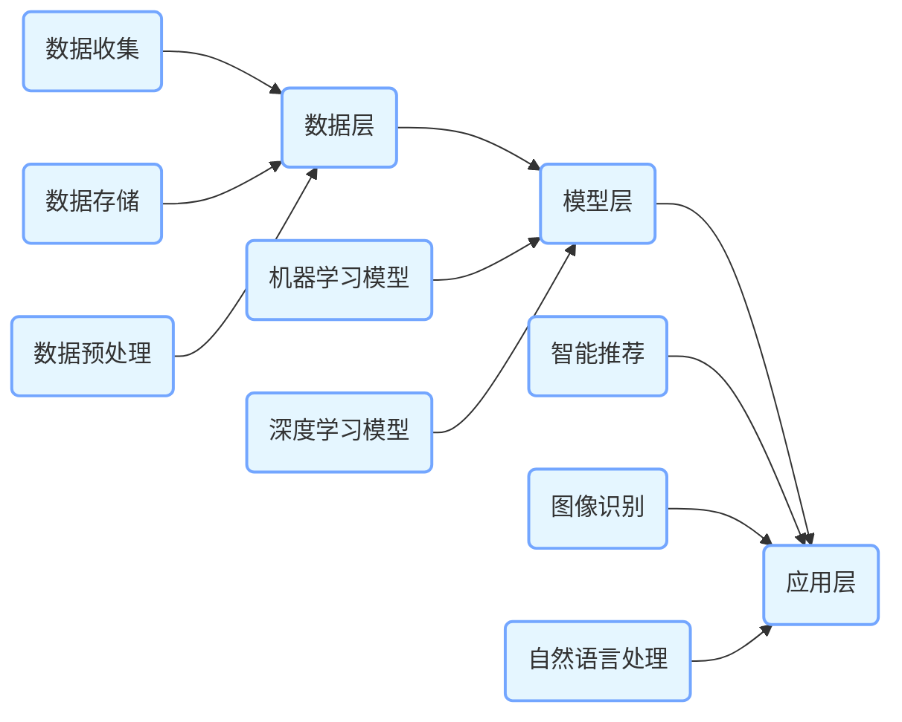

# 程序员如何融合AI技术实现职业升级

> 关键词：程序员、AI技术、职业升级、融合方法、技术应用

> 摘要：在当今科技飞速发展的时代，AI技术已经成为推动各个领域变革的关键力量。对于程序员而言，融合AI技术不仅是适应时代发展的必然选择，更是实现职业升级的重要途径。本文旨在深入探讨程序员融合AI技术实现职业升级的方法和策略，通过介绍AI的核心概念、算法原理、数学模型，结合项目实战案例，阐述如何将AI技术融入到实际编程工作中。同时，分析AI技术在不同应用场景中的应用，推荐相关的学习资源、开发工具和论文著作，最后总结未来发展趋势与挑战，为程序员的职业发展提供全面且有深度的指导。

## 1. 背景介绍 
### 1.1 目的和范围
本文的主要目的是为广大程序员提供一套全面且实用的方法，帮助他们融合AI技术实现职业升级。范围涵盖了AI技术的基础知识、核心算法、数学模型，以及如何在实际项目中应用AI技术，同时探讨了AI技术在不同领域的应用场景和未来发展趋势。

### 1.2 预期读者
本文预期读者主要是有一定编程基础的程序员，包括但不限于Web开发人员、移动应用开发人员、数据分析师等，他们希望通过学习和应用AI技术提升自己的职业技能和竞争力。

### 1.3 文档结构概述
本文将按照以下结构进行阐述：首先介绍AI技术的核心概念和相关联系，包括其原理和架构；接着深入讲解核心算法原理和具体操作步骤，并使用Python源代码进行详细阐述；然后介绍AI技术的数学模型和公式，并举例说明；通过项目实战案例展示如何在实际中应用AI技术；分析AI技术的实际应用场景；推荐相关的学习资源、开发工具和论文著作；最后总结未来发展趋势与挑战，并提供常见问题与解答以及扩展阅读和参考资料。

### 1.4 术语表
#### 1.4.1 核心术语定义
- **人工智能（AI）**：是指计算机系统能够执行通常需要人类智能才能完成的任务，如学习、推理、解决问题等。
- **机器学习（ML）**：是AI的一个分支，通过让计算机从数据中学习模式和规律，从而实现预测和决策。
- **深度学习（DL）**：是机器学习的一个子领域，基于人工神经网络，通过多层神经元的组合来学习数据的复杂特征。
- **神经网络（NN）**：是一种模仿人类神经系统的计算模型，由多个神经元组成，用于处理和分析数据。
- **训练数据**：用于训练机器学习模型的数据，包含输入特征和对应的标签。
- **测试数据**：用于评估训练好的机器学习模型性能的数据。

#### 1.4.2 相关概念解释
- **监督学习**：在监督学习中，训练数据包含输入特征和对应的标签，模型通过学习输入和标签之间的关系来进行预测。
- **无监督学习**：无监督学习中，训练数据只包含输入特征，模型通过发现数据中的模式和结构来进行聚类或降维等操作。
- **强化学习**：强化学习通过智能体与环境进行交互，根据环境反馈的奖励信号来学习最优策略。

#### 1.4.3 缩略词列表
- **AI**：Artificial Intelligence（人工智能）
- **ML**：Machine Learning（机器学习）
- **DL**：Deep Learning（深度学习）
- **NN**：Neural Network（神经网络）
- **CNN**：Convolutional Neural Network（卷积神经网络）
- **RNN**：Recurrent Neural Network（循环神经网络）

## 2. 核心概念与联系 

### 2.1 人工智能的核心概念
人工智能是一门综合性的学科，旨在使计算机系统具备人类智能的某些特征。其核心目标包括感知、理解、学习、推理和决策等。

#### 2.1.1 机器学习
机器学习是实现人工智能的重要手段之一。它通过让计算机从数据中学习模式和规律，从而实现预测和决策。常见的机器学习任务包括分类、回归、聚类等。

#### 2.1.2 深度学习
深度学习是机器学习的一个子领域，基于人工神经网络。它通过多层神经元的组合来学习数据的复杂特征，在图像识别、语音识别等领域取得了显著的成果。

### 2.2 人工智能的架构
人工智能系统通常由数据层、模型层和应用层组成。

#### 2.2.1 数据层
数据层负责收集、存储和预处理数据。数据是人工智能的基础，高质量的数据对于模型的训练和性能至关重要。

#### 2.2.2 模型层
模型层是人工智能系统的核心，包含各种机器学习和深度学习模型。这些模型通过对数据的学习和训练，实现对未知数据的预测和决策。

#### 2.2.3 应用层
应用层将训练好的模型应用到实际场景中，为用户提供各种智能服务，如智能推荐、图像识别、自然语言处理等。

### 2.3 核心概念的联系
机器学习和深度学习是人工智能的重要组成部分，它们相互关联、相互促进。机器学习为深度学习提供了理论基础和方法，而深度学习则通过多层神经网络的结构，使得机器学习能够处理更加复杂的数据和任务。

### 2.4 文本示意图
人工智能系统的架构可以用以下文本示意图表示：

数据层（数据收集、存储、预处理） -> 模型层（机器学习、深度学习模型） -> 应用层（智能服务）

### 2.5 Mermaid流程图


## 3. 核心算法原理 & 具体操作步骤 

### 3.1 线性回归算法原理
线性回归是一种简单而常用的机器学习算法，用于预测连续数值的输出。其基本原理是通过找到一条直线（或超平面），使得所有数据点到该直线（或超平面）的距离之和最小。

#### 3.1.1 数学模型
线性回归的数学模型可以表示为：

$$y = \theta_0 + \theta_1x_1 + \theta_2x_2 + \cdots + \theta_nx_n + \epsilon$$

其中，$y$ 是输出变量，$x_1, x_2, \cdots, x_n$ 是输入变量，$\theta_0, \theta_1, \cdots, \theta_n$ 是模型的参数，$\epsilon$ 是误差项。

#### 3.1.2 损失函数
线性回归通常使用均方误差（MSE）作为损失函数，其定义为：

$$J(\theta) = \frac{1}{2m}\sum_{i=1}^{m}(h_{\theta}(x^{(i)}) - y^{(i)})^2$$

其中，$m$ 是样本数量，$h_{\theta}(x^{(i)})$ 是模型的预测值，$y^{(i)}$ 是真实值。

#### 3.1.3 优化算法
为了找到使损失函数最小的参数 $\theta$，可以使用梯度下降算法。梯度下降算法的基本思想是沿着损失函数的负梯度方向更新参数，直到达到局部最小值。

### 3.2 线性回归的Python实现
```python
import numpy as np

class LinearRegression:
    def __init__(self, learning_rate=0.01, num_iterations=1000):
        self.learning_rate = learning_rate
        self.num_iterations = num_iterations
        self.weights = None
        self.bias = None

    def fit(self, X, y):
        num_samples, num_features = X.shape
        self.weights = np.zeros(num_features)
        self.bias = 0

        for _ in range(self.num_iterations):
            y_pred = np.dot(X, self.weights) + self.bias

            dw = (1 / num_samples) * np.dot(X.T, (y_pred - y))
            db = (1 / num_samples) * np.sum(y_pred - y)

            self.weights -= self.learning_rate * dw
            self.bias -= self.learning_rate * db

    def predict(self, X):
        return np.dot(X, self.weights) + self.bias
```

### 3.3 具体操作步骤
1. **数据准备**：收集和整理数据集，将其分为训练集和测试集。
2. **模型初始化**：创建线性回归模型对象，并设置学习率和迭代次数。
3. **模型训练**：使用训练集数据对模型进行训练，更新模型的参数。
4. **模型评估**：使用测试集数据对训练好的模型进行评估，计算损失函数的值。
5. **模型预测**：使用训练好的模型对新的数据进行预测。

```python
# 示例数据
X = np.array([[1], [2], [3], [4], [5]])
y = np.array([2, 4, 6, 8, 10])

# 创建模型对象
model = LinearRegression(learning_rate=0.01, num_iterations=1000)

# 模型训练
model.fit(X, y)

# 模型预测
new_X = np.array([[6]])
prediction = model.predict(new_X)
print("预测值:", prediction)
```

## 4. 数学模型和公式 & 详细讲解 & 举例说明 

### 4.1 逻辑回归的数学模型
逻辑回归是一种用于分类问题的机器学习算法，它通过将线性回归的输出通过逻辑函数（sigmoid函数）映射到[0, 1]区间，从而实现对二分类问题的预测。

#### 4.1.1 逻辑函数（sigmoid函数）
逻辑函数的定义为：

$$\sigma(z) = \frac{1}{1 + e^{-z}}$$

其中，$z$ 是线性回归的输出。

#### 4.1.2 逻辑回归的数学模型
逻辑回归的数学模型可以表示为：

$$P(y = 1|x) = \sigma(\theta_0 + \theta_1x_1 + \theta_2x_2 + \cdots + \theta_nx_n)$$

其中，$P(y = 1|x)$ 是给定输入 $x$ 时，输出为1的概率。

### 4.2 损失函数
逻辑回归通常使用对数损失函数（也称为交叉熵损失函数），其定义为：

$$J(\theta) = -\frac{1}{m}\sum_{i=1}^{m}[y^{(i)}\log(h_{\theta}(x^{(i)})) + (1 - y^{(i)})\log(1 - h_{\theta}(x^{(i)}))]$$

其中，$m$ 是样本数量，$h_{\theta}(x^{(i)})$ 是模型的预测概率，$y^{(i)}$ 是真实标签。

### 4.3 优化算法
同样可以使用梯度下降算法来优化逻辑回归的参数。梯度下降算法的更新公式为：

$$\theta_j := \theta_j - \alpha\frac{\partial J(\theta)}{\partial \theta_j}$$

其中，$\alpha$ 是学习率。

### 4.4 举例说明
假设有一个二分类问题，输入特征为 $x_1$ 和 $x_2$，真实标签为 $y$。我们可以使用逻辑回归模型来预测样本属于正类的概率。

```python
import numpy as np

def sigmoid(z):
    return 1 / (1 + np.exp(-z))

def log_loss(y_true, y_pred):
    m = len(y_true)
    return -(1 / m) * np.sum(y_true * np.log(y_pred) + (1 - y_true) * np.log(1 - y_pred))

def gradient_descent(X, y, learning_rate=0.01, num_iterations=1000):
    num_samples, num_features = X.shape
    weights = np.zeros(num_features)
    bias = 0

    for _ in range(num_iterations):
        linear_model = np.dot(X, weights) + bias
        y_pred = sigmoid(linear_model)

        dw = (1 / num_samples) * np.dot(X.T, (y_pred - y))
        db = (1 / num_samples) * np.sum(y_pred - y)

        weights -= learning_rate * dw
        bias -= learning_rate * db

    return weights, bias

# 示例数据
X = np.array([[1, 2], [2, 3], [3, 4], [4, 5]])
y = np.array([0, 0, 1, 1])

# 模型训练
weights, bias = gradient_descent(X, y)

# 模型预测
new_X = np.array([[5, 6]])
linear_model = np.dot(new_X, weights) + bias
prediction = sigmoid(linear_model)
print("预测概率:", prediction)
```

## 5. 项目实战：代码实际案例和详细解释说明 

### 5.1  开发环境搭建
#### 5.1.1 安装Python
首先需要安装Python，可以从Python官方网站（https://www.python.org/downloads/）下载适合自己操作系统的Python版本，并按照安装向导进行安装。

#### 5.1.2 安装必要的库
在Python环境中，我们需要安装一些必要的库，如NumPy、Pandas、Scikit-learn等。可以使用以下命令进行安装：

```bash
pip install numpy pandas scikit-learn
```

### 5.2  源代码详细实现和代码解读
#### 5.2.1 项目背景
我们将使用鸢尾花数据集进行分类任务，鸢尾花数据集包含了150个样本，分为3个类别，每个样本有4个特征。

#### 5.2.2 代码实现
```python
import numpy as np
from sklearn.datasets import load_iris
from sklearn.model_selection import train_test_split
from sklearn.preprocessing import StandardScaler
from sklearn.linear_model import LogisticRegression
from sklearn.metrics import accuracy_score

# 加载数据集
iris = load_iris()
X = iris.data
y = iris.target

# 数据划分
X_train, X_test, y_train, y_test = train_test_split(X, y, test_size=0.2, random_state=42)

# 数据标准化
scaler = StandardScaler()
X_train = scaler.fit_transform(X_train)
X_test = scaler.transform(X_test)

# 创建逻辑回归模型
model = LogisticRegression()

# 模型训练
model.fit(X_train, y_train)

# 模型预测
y_pred = model.predict(X_test)

# 模型评估
accuracy = accuracy_score(y_test, y_pred)
print("准确率:", accuracy)
```

#### 5.2.3 代码解读
1. **数据加载**：使用 `load_iris()` 函数加载鸢尾花数据集。
2. **数据划分**：使用 `train_test_split()` 函数将数据集分为训练集和测试集，测试集占比为20%。
3. **数据标准化**：使用 `StandardScaler()` 对数据进行标准化处理，使得数据的均值为0，标准差为1。
4. **模型创建**：使用 `LogisticRegression()` 创建逻辑回归模型。
5. **模型训练**：使用 `fit()` 方法对模型进行训练。
6. **模型预测**：使用 `predict()` 方法对测试集进行预测。
7. **模型评估**：使用 `accuracy_score()` 函数计算模型的准确率。

### 5.3  代码解读与分析
通过上述代码，我们可以看到使用逻辑回归模型进行分类任务的基本流程。数据的标准化处理可以提高模型的训练效率和性能，逻辑回归模型通过学习训练数据的特征和标签之间的关系，实现对未知数据的分类预测。最后，通过准确率评估指标可以衡量模型的性能。

## 6. 实际应用场景 
### 6.1 自然语言处理
在自然语言处理领域，AI技术可以用于文本分类、情感分析、机器翻译等任务。例如，在智能客服系统中，使用深度学习模型可以实现对用户问题的自动分类和回答，提高客服效率。

### 6.2 图像识别
图像识别是AI技术的重要应用领域之一，包括人脸识别、物体检测、图像分类等。例如，在安防监控系统中，使用人脸识别技术可以实现对人员的身份识别和追踪。

### 6.3 智能推荐
智能推荐系统利用AI技术分析用户的历史行为和偏好，为用户推荐个性化的内容和产品。例如，电商平台的商品推荐、音乐平台的歌曲推荐等。

### 6.4 医疗领域
在医疗领域，AI技术可以用于疾病诊断、医学影像分析、药物研发等。例如，使用深度学习模型对医学影像进行分析，可以辅助医生进行疾病的早期诊断。

### 6.5 金融领域
在金融领域，AI技术可以用于风险评估、欺诈检测、投资决策等。例如，使用机器学习模型对客户的信用风险进行评估，帮助银行做出贷款决策。

## 7. 工具和资源推荐
### 7.1 学习资源推荐
#### 7.1.1 书籍推荐
- 《Python机器学习》：介绍了Python在机器学习中的应用，包括各种机器学习算法的原理和实现。
- 《深度学习》：由深度学习领域的三位顶尖专家编写，全面介绍了深度学习的理论和实践。
- 《人工智能：一种现代的方法》：是人工智能领域的经典教材，涵盖了人工智能的各个方面。

#### 7.1.2 在线课程
- Coursera上的《机器学习》课程：由Andrew Ng教授授课，是学习机器学习的经典课程。
- edX上的《深度学习》课程：提供了深度学习的系统学习内容。
- 吴恩达的《机器学习专项课程》：深入讲解了机器学习的各个方面。

#### 7.1.3 技术博客和网站
- Medium：上面有很多关于AI技术的优秀博客文章。
- Towards Data Science：专注于数据科学和AI领域的知识分享。
- AI Stack Exchange：一个AI技术的问答社区。

### 7.2 开发工具框架推荐
#### 7.2.1 IDE和编辑器
- PyCharm：是一款专业的Python集成开发环境，提供了丰富的功能和插件。
- Jupyter Notebook：适合进行数据探索和模型开发，支持交互式编程。
- Visual Studio Code：轻量级的代码编辑器，支持多种编程语言和插件。

#### 7.2.2 调试和性能分析工具
- TensorBoard：用于可视化深度学习模型的训练过程和性能指标。
- Py-Spy：一个用于分析Python程序性能的工具。
- Memory Profiler：用于分析Python程序的内存使用情况。

#### 7.2.3 相关框架和库
- TensorFlow：Google开发的深度学习框架，提供了丰富的工具和接口。
- PyTorch：Facebook开发的深度学习框架，具有动态图的优势。
- Scikit-learn：一个简单而高效的机器学习库，包含了各种机器学习算法和工具。

### 7.3 相关论文著作推荐
#### 7.3.1 经典论文
- 《Gradient-based learning applied to document recognition》：介绍了卷积神经网络在文档识别中的应用。
- 《Long Short-Term Memory》：提出了长短期记忆网络（LSTM），解决了循环神经网络中的梯度消失问题。
- 《Attention Is All You Need》：提出了Transformer架构，在自然语言处理领域取得了巨大成功。

#### 7.3.2 最新研究成果
可以关注顶级学术会议如NeurIPS、ICML、CVPR等的论文，了解AI技术的最新研究成果。

#### 7.3.3 应用案例分析
- 《AI in Healthcare: A Comprehensive Overview》：介绍了AI技术在医疗领域的应用案例和发展趋势。
- 《AI in Finance: Transforming the Financial Industry》：分析了AI技术在金融领域的应用和挑战。

## 8. 总结：未来发展趋势与挑战
### 8.1 未来发展趋势
- **自动化和智能化**：AI技术将越来越多地应用于各个领域，实现自动化和智能化的生产和服务。
- **多模态融合**：将图像、语音、文本等多种模态的数据进行融合，实现更加智能的交互和决策。
- **边缘计算与AI的结合**：将AI模型部署到边缘设备上，实现实时、高效的智能处理。
- **AI与其他技术的融合**：如AI与区块链、物联网等技术的融合，创造出更多的应用场景和商业价值。

### 8.2 挑战
- **数据隐私和安全**：随着AI技术的广泛应用，数据隐私和安全问题日益突出，需要加强相关的法律法规和技术手段。
- **算法可解释性**：许多深度学习模型是黑盒模型，其决策过程难以解释，这在一些关键领域如医疗、金融等应用中存在风险。
- **人才短缺**：AI技术的发展需要大量的专业人才，目前人才短缺是制约AI技术发展的重要因素。
- **伦理和社会问题**：AI技术的发展可能会带来一些伦理和社会问题，如失业、偏见等，需要进行深入的研究和探讨。

## 9. 附录：常见问题与解答
### 9.1 学习AI技术需要具备哪些基础知识？
学习AI技术需要具备一定的数学基础，如线性代数、概率论与数理统计等，同时需要掌握一门编程语言，如Python。

### 9.2 如何选择适合自己的AI学习资源？
可以根据自己的学习目标和基础水平选择适合的学习资源。如果是初学者，可以从在线课程和书籍入手；如果已经有一定基础，可以阅读相关的论文和技术博客。

### 9.3 如何提高AI模型的性能？
可以通过优化数据预处理、选择合适的模型和算法、调整模型参数、增加训练数据等方法来提高AI模型的性能。

### 9.4 AI技术在实际应用中会遇到哪些问题？
在实际应用中，AI技术可能会遇到数据质量问题、模型过拟合或欠拟合问题、计算资源不足问题等。

## 10. 扩展阅读 & 参考资料
- 《AI未来进行式》
- 《智能时代》
- 相关学术期刊如《Journal of Artificial Intelligence Research》、《Artificial Intelligence》等。
- 各大科技公司的AI技术博客，如Google AI Blog、Facebook AI Research等。