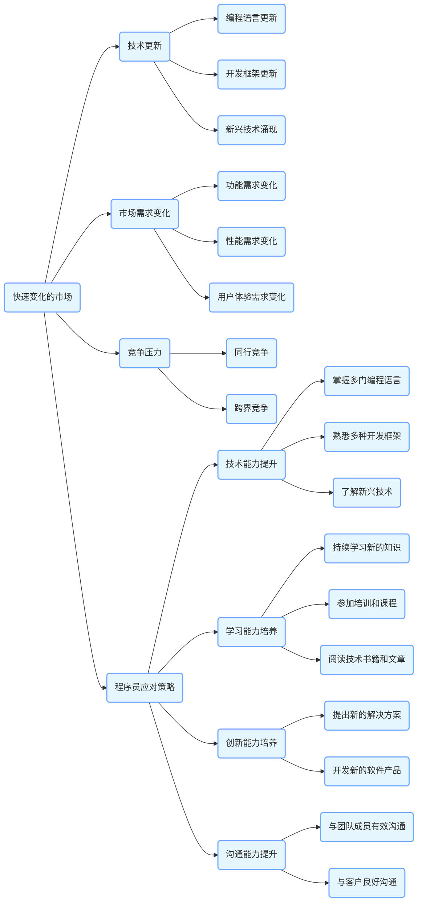

# 程序员如何适应快速变化的市场

> 关键词：程序员、快速变化市场、技术更新、职业发展、市场需求、技能提升、适应策略

> 摘要：在当今科技飞速发展的时代，软件行业的市场变化日新月异，这对程序员提出了极高的要求。本文旨在深入探讨程序员如何适应快速变化的市场。通过分析市场变化的背景和趋势，阐述核心概念和联系，介绍核心算法原理和操作步骤，探讨数学模型和公式在其中的应用，结合项目实战案例，分析实际应用场景，推荐相关工具和资源，最后总结未来发展趋势与挑战，并提供常见问题解答和参考资料，为程序员在快速变化的市场中找到适应之道提供全面而深入的指导。

## 1. 背景介绍 
### 1.1 目的和范围
本文章的目的在于为广大程序员提供全面且实用的策略和方法，以帮助他们更好地适应快速变化的市场环境。范围涵盖了从市场变化的宏观趋势到程序员个人技能提升、职业规划等微观层面，涉及到技术更新、市场需求分析、个人发展策略等多个方面。

### 1.2 预期读者
本文主要面向广大程序员群体，无论是初入职场的新手程序员，还是有一定经验的资深开发者，都能从本文中获取有价值的信息和启示。同时，对于关注软件行业发展、对程序员职业发展感兴趣的相关人士，如技术管理者、行业分析师等，也具有一定的参考价值。

### 1.3 文档结构概述
本文将首先介绍背景信息，包括目的、预期读者和文档结构概述等内容。接着阐述核心概念与联系，帮助读者理解相关关键概念和它们之间的关系。然后详细讲解核心算法原理和具体操作步骤，结合数学模型和公式进行深入分析。通过项目实战案例，展示如何将理论应用于实际。分析实际应用场景，让读者了解在不同场景下的应对策略。推荐相关的工具和资源，为程序员的学习和发展提供便利。最后总结未来发展趋势与挑战，提供常见问题解答和参考资料，方便读者进一步深入学习和探讨。

### 1.4 术语表
#### 1.4.1 核心术语定义
- **快速变化的市场**：指软件行业中技术、需求、竞争等因素在短时间内发生显著变化的市场环境。
- **技术栈**：程序员在开发过程中所使用的一系列技术和工具的组合。
- **职业规划**：个人根据自身的兴趣、能力和市场需求，对自己的职业发展进行的规划和安排。

#### 1.4.2 相关概念解释
- **技术更新**：随着科技的发展，新的技术不断涌现，旧的技术逐渐被淘汰，程序员需要不断学习和掌握新的技术。
- **市场需求**：市场对软件产品和服务的需求，包括功能、性能、用户体验等方面的要求。
- **技能提升**：程序员通过学习、实践等方式不断提高自己的技术水平和综合素质。

#### 1.4.3 缩略词列表
- **AI**：Artificial Intelligence，人工智能
- **ML**：Machine Learning，机器学习
- **DL**：Deep Learning，深度学习
- **IoT**：Internet of Things，物联网

## 2. 核心概念与联系 

### 核心概念原理
在快速变化的市场环境中，程序员面临着技术更新换代快、市场需求多样化、竞争激烈等挑战。为了适应这种变化，程序员需要具备多种核心能力，包括技术能力、学习能力、创新能力、沟通能力等。

技术能力是程序员的基础，它包括对编程语言、开发框架、数据库等的掌握。学习能力则是程序员不断适应变化的关键，通过持续学习新的技术和知识，程序员可以保持自己的竞争力。创新能力能够帮助程序员开发出更具竞争力的软件产品，满足市场的多样化需求。沟通能力则有助于程序员与团队成员、客户等进行有效的沟通和协作。

### 架构的文本示意图
```plaintext
快速变化的市场
|
|-- 技术更新
|   |-- 编程语言更新
|   |-- 开发框架更新
|   |-- 新兴技术涌现
|
|-- 市场需求变化
|   |-- 功能需求变化
|   |-- 性能需求变化
|   |-- 用户体验需求变化
|
|-- 竞争压力
|   |-- 同行竞争
|   |-- 跨界竞争
|
|-- 程序员应对策略
|   |-- 技术能力提升
|   |   |-- 掌握多门编程语言
|   |   |-- 熟悉多种开发框架
|   |   |-- 了解新兴技术
|   |-- 学习能力培养
|   |   |-- 持续学习新的知识
|   |   |-- 参加培训和课程
|   |   |-- 阅读技术书籍和文章
|   |-- 创新能力培养
|   |   |-- 提出新的解决方案
|   |   |-- 开发新的软件产品
|   |-- 沟通能力提升
|   |   |-- 与团队成员有效沟通
|   |   |-- 与客户良好沟通
```

### Mermaid 流程图


## 3. 核心算法原理 & 具体操作步骤 

### 核心算法原理
在适应快速变化的市场过程中，程序员可以采用一种类似于“自适应学习算法”的策略。该算法的核心思想是根据市场的变化和自身的状态，动态调整自己的学习和发展方向。

以下是一个简单的 Python 代码示例，模拟了这种自适应学习算法的基本原理：

```python
# 定义市场状态和程序员状态
market_state = {
    "technology_trend": ["AI", "IoT", "Blockchain"],  # 市场技术趋势
    "demand": ["High-performance", "User-friendly", "Secure"]  # 市场需求
}

programmer_state = {
    "skills": ["Python", "Java", "Web Development"],  # 程序员现有技能
    "learning_progress": 0  # 学习进度
}

# 定义自适应学习算法
def adaptive_learning(market_state, programmer_state):
    # 计算技能差距
    skill_gap = []
    for trend in market_state["technology_trend"]:
        if trend not in programmer_state["skills"]:
            skill_gap.append(trend)
    
    # 根据技能差距和市场需求调整学习方向
    learning_direction = []
    for gap in skill_gap:
        if any(demand in gap for demand in market_state["demand"]):
            learning_direction.append(gap)
    
    # 更新程序员状态
    programmer_state["learning_progress"] += len(learning_direction)
    programmer_state["skills"].extend(learning_direction)
    
    return programmer_state

# 模拟市场变化，多次调用自适应学习算法
for _ in range(5):
    programmer_state = adaptive_learning(market_state, programmer_state)
    print(f"Updated programmer state: {programmer_state}")
```

### 具体操作步骤
1. **市场分析**：定期收集和分析市场信息，了解技术趋势和市场需求的变化。可以通过行业报告、技术论坛、社交媒体等渠道获取相关信息。
2. **自我评估**：对自己的技能、知识、经验等进行全面评估，找出自己的优势和劣势。可以使用技能清单、能力测试等工具进行自我评估。
3. **制定学习计划**：根据市场分析和自我评估的结果，制定个性化的学习计划。学习计划应包括学习目标、学习内容、学习时间、学习方法等。
4. **实施学习计划**：按照学习计划，积极学习新的技术和知识。可以通过在线课程、培训、阅读书籍和文章、实践项目等方式进行学习。
5. **实践和应用**：将所学的知识和技能应用到实际项目中，通过实践不断提高自己的能力。可以参与开源项目、个人项目、竞赛等活动，积累实践经验。
6. **持续反馈和调整**：定期对自己的学习和发展情况进行评估和反馈，根据反馈结果调整学习计划和发展方向。可以通过与同行交流、参加技术会议、请教专家等方式获取反馈。

## 4. 数学模型和公式 & 详细讲解 & 举例说明 

### 数学模型
我们可以用一个简单的数学模型来描述程序员适应市场变化的过程。假设程序员的技能水平用向量 $\vec{S} = (s_1, s_2, \cdots, s_n)$ 表示，其中 $s_i$ 表示程序员在第 $i$ 项技能上的水平。市场需求用向量 $\vec{D} = (d_1, d_2, \cdots, d_n)$ 表示，其中 $d_i$ 表示市场对第 $i$ 项技能的需求程度。

程序员的适应度 $F$ 可以定义为技能水平向量与市场需求向量的相似度，我们可以使用余弦相似度来计算：

$$
F = \frac{\vec{S} \cdot \vec{D}}{\|\vec{S}\| \|\vec{D}\|}
$$

其中，$\vec{S} \cdot \vec{D}$ 表示向量的点积，$\|\vec{S}\|$ 和 $\|\vec{D}\|$ 分别表示向量的模。

### 详细讲解
余弦相似度的取值范围在 $[-1, 1]$ 之间，值越接近 1 表示程序员的技能水平与市场需求越匹配，适应度越高；值越接近 -1 表示程序员的技能水平与市场需求越不匹配，适应度越低。

通过计算适应度，程序员可以了解自己与市场需求的差距，从而有针对性地进行学习和提升。例如，如果某一项技能的市场需求较高，但程序员在该项技能上的水平较低，那么程序员可以重点学习和提升该项技能，以提高自己的适应度。

### 举例说明
假设市场需求向量 $\vec{D} = (0.8, 0.6, 0.4)$ 表示市场对技能 A、技能 B、技能 C 的需求程度分别为 0.8、0.6、0.4。程序员的技能水平向量 $\vec{S} = (0.5, 0.7, 0.3)$ 表示程序员在技能 A、技能 B、技能 C 上的水平分别为 0.5、0.7、0.3。

首先计算向量的点积：

$$
\vec{S} \cdot \vec{D} = 0.5 \times 0.8 + 0.7 \times 0.6 + 0.3 \times 0.4 = 0.4 + 0.42 + 0.12 = 0.94
$$

然后计算向量的模：

$$
\|\vec{S}\| = \sqrt{0.5^2 + 0.7^2 + 0.3^2} = \sqrt{0.25 + 0.49 + 0.09} = \sqrt{0.83} \approx 0.91
$$

$$
\|\vec{D}\| = \sqrt{0.8^2 + 0.6^2 + 0.4^2} = \sqrt{0.64 + 0.36 + 0.16} = \sqrt{1.16} \approx 1.08
$$

最后计算适应度：

$$
F = \frac{\vec{S} \cdot \vec{D}}{\|\vec{S}\| \|\vec{D}\|} = \frac{0.94}{0.91 \times 1.08} \approx \frac{0.94}{0.9828} \approx 0.96
$$

这表明程序员的技能水平与市场需求比较匹配，适应度较高。但程序员仍可以根据市场需求的变化，有针对性地提升自己在某些技能上的水平，以进一步提高适应度。

## 5. 项目实战：代码实际案例和详细解释说明 

### 5.1  开发环境搭建
在这个项目实战中，我们将开发一个简单的 Web 应用程序，使用 Python 的 Flask 框架。以下是开发环境搭建的步骤：

1. **安装 Python**：从 Python 官方网站（https://www.python.org/downloads/） 下载并安装 Python 3.x 版本。
2. **创建虚拟环境**：打开命令行工具，进入项目目录，使用以下命令创建虚拟环境：

```bash
python -m venv myenv
```

3. **激活虚拟环境**：在 Windows 系统中，使用以下命令激活虚拟环境：

```bash
myenv\Scripts\activate
```

在 Linux 或 macOS 系统中，使用以下命令激活虚拟环境：

```bash
source myenv/bin/activate
```

4. **安装 Flask**：在激活的虚拟环境中，使用以下命令安装 Flask：

```bash
pip install flask
```

### 5.2  源代码详细实现和代码解读
以下是一个简单的 Flask Web 应用程序的源代码：

```python
from flask import Flask, render_template

app = Flask(__name__)

# 定义路由和视图函数
@app.route('/')
def index():
    return render_template('index.html')

# 定义另一个路由和视图函数
@app.route('/about')
def about():
    return render_template('about.html')

if __name__ == '__main__':
    app.run(debug=True)
```

### 代码解读
1. **导入 Flask 模块**：`from flask import Flask, render_template` 导入 Flask 类和 `render_template` 函数。
2. **创建 Flask 应用实例**：`app = Flask(__name__)` 创建一个 Flask 应用实例。
3. **定义路由和视图函数**：
    - `@app.route('/')` 定义了根路由，当用户访问根 URL 时，会调用 `index` 视图函数。
    - `def index(): return render_template('index.html')` 视图函数返回一个 HTML 模板文件 `index.html`。
    - `@app.route('/about')` 定义了 `/about` 路由，当用户访问该 URL 时，会调用 `about` 视图函数。
    - `def about(): return render_template('about.html')` 视图函数返回一个 HTML 模板文件 `about.html`。
4. **运行应用程序**：`if __name__ == '__main__': app.run(debug=True)` 当脚本作为主程序运行时，启动 Flask 应用程序，并开启调试模式。

### 5.3  代码解读与分析
这个简单的 Flask Web 应用程序展示了如何使用 Flask 框架创建一个基本的 Web 应用。通过定义路由和视图函数，我们可以处理不同的 URL 请求，并返回相应的 HTML 页面。

在实际开发中，我们可以根据市场需求不断扩展和优化这个应用程序。例如，如果市场需求对用户交互性有更高的要求，我们可以添加表单处理、用户认证等功能；如果对性能有更高的要求，我们可以优化数据库查询、使用缓存等技术。

## 6. 实际应用场景 
### 企业内部开发
在企业内部开发中，程序员需要根据企业的业务需求和发展战略，不断调整自己的技术栈和开发方式。例如，随着企业数字化转型的推进，程序员可能需要学习和掌握大数据、人工智能等新兴技术，以开发出更高效、智能的企业应用系统。

### 互联网产品开发
在互联网产品开发领域，市场变化非常快速，用户需求也在不断变化。程序员需要密切关注市场动态和用户反馈，及时调整产品的功能和性能。例如，随着移动互联网的发展，程序员需要开发出适应移动设备的产品，优化用户体验。

### 开源项目贡献
参与开源项目可以让程序员接触到最新的技术和开发理念，同时也可以提高自己的技术水平和影响力。在开源项目中，程序员需要与全球的开发者合作，共同解决问题，推动项目的发展。例如，参与 Linux 内核开发、TensorFlow 开源项目等。

### 自由职业开发
自由职业程序员需要根据不同客户的需求，快速调整自己的技术和服务。他们需要具备良好的沟通能力和项目管理能力，以满足客户的需求并按时交付项目。例如，为不同行业的客户开发定制化的软件产品。

## 7. 工具和资源推荐
### 7.1 学习资源推荐
#### 7.1.1 书籍推荐
- 《Python 编程从入门到实践》：适合初学者学习 Python 编程语言。
- 《算法导论》：经典的算法书籍，深入讲解了各种算法的原理和实现。
- 《代码大全》：软件开发者的圣经，涵盖了软件开发的各个方面。

#### 7.1.2 在线课程
- Coursera：提供了丰富的计算机科学和编程课程，包括人工智能、机器学习等热门领域。
- edX：与全球顶尖高校合作，提供高质量的在线课程。
- 慕课网：专注于 IT 技能培训，有很多实用的编程课程。

#### 7.1.3 技术博客和网站
- 博客园：国内知名的技术博客平台，有很多程序员分享自己的技术经验和见解。
- Medium：国际上知名的技术博客平台，有很多优秀的技术文章。
- Stack Overflow：全球最大的程序员问答社区，遇到技术问题可以在这里查找答案。

### 7.2 开发工具框架推荐
#### 7.2.1 IDE和编辑器
- PyCharm：专业的 Python 集成开发环境，功能强大，适合 Python 开发。
- Visual Studio Code：轻量级的代码编辑器，支持多种编程语言，有丰富的插件。
- IntelliJ IDEA：优秀的 Java 集成开发环境，提高开发效率。

#### 7.2.2 调试和性能分析工具
- PySnooper：Python 调试工具，方便查看函数的执行过程和变量的值。
- Chrome DevTools：强大的前端调试和性能分析工具，可用于 Web 开发。
- VisualVM：Java 性能分析工具，帮助开发者优化 Java 应用程序的性能。

#### 7.2.3 相关框架和库
- Flask：轻量级的 Python Web 框架，适合快速开发 Web 应用。
- Django：功能强大的 Python Web 框架，提供了丰富的功能和组件。
- React：流行的 JavaScript 前端框架，用于构建用户界面。

### 7.3 相关论文著作推荐
#### 7.3.1 经典论文
- 《A Mathematical Theory of Communication》：信息论的经典论文，对计算机科学和通信领域产生了深远影响。
- 《The Structure of Scientific Revolutions》：探讨了科学发展的模式和规律，对理解技术发展有一定的启示。

#### 7.3.2 最新研究成果
- 关注顶级学术会议，如 ACM SIGPLAN、IEEE ICML 等，了解最新的研究成果和技术趋势。
- 阅读知名学术期刊，如 Journal of the ACM、Artificial Intelligence 等，获取前沿的研究论文。

#### 7.3.3 应用案例分析
- 研究成功的软件产品和项目案例，了解它们的技术架构、开发过程和商业模式。
- 分析失败的案例，从中吸取教训，避免在自己的项目中犯同样的错误。

## 8. 总结：未来发展趋势与挑战
### 未来发展趋势
- **人工智能和机器学习的普及**：人工智能和机器学习技术将在各个领域得到更广泛的应用，程序员需要掌握相关技术，开发出更智能的软件产品。
- **物联网的发展**：物联网将连接更多的设备和系统，程序员需要开发出适应物联网环境的软件，实现设备之间的互联互通和数据交互。
- **云计算和大数据的应用**：云计算和大数据技术将为企业提供更强大的计算和存储能力，程序员需要学习和掌握相关技术，开发出高效的云计算和大数据应用。
- **低代码和无代码开发的兴起**：低代码和无代码开发平台将降低软件开发的门槛，让更多非专业程序员也能参与到软件开发中来，程序员需要不断提升自己的技术水平，以应对这种变化。

### 挑战
- **技术更新换代快**：程序员需要不断学习和掌握新的技术，跟上技术发展的步伐，这对程序员的学习能力和时间管理能力提出了很高的要求。
- **竞争压力大**：随着软件行业的发展，程序员的数量不断增加，竞争也越来越激烈。程序员需要不断提升自己的竞争力，才能在市场中脱颖而出。
- **需求变化频繁**：市场需求变化频繁，程序员需要快速响应需求变化，调整自己的开发方向和技术栈，这对程序员的应变能力和项目管理能力提出了挑战。
- **跨领域知识要求高**：未来的软件产品往往涉及多个领域的知识，程序员需要具备跨领域的知识和技能，才能开发出更优秀的软件产品。

## 9. 附录：常见问题与解答
### 问题 1：如何平衡工作和学习的时间？
解答：可以制定合理的时间计划，将工作和学习时间进行合理分配。例如，每天安排一定的时间用于学习新的技术和知识，周末可以安排更多的时间进行深入学习和实践。同时，要学会利用碎片化时间，如在上下班路上、午休时间等，阅读技术文章、观看教学视频等。

### 问题 2：如何选择适合自己的学习资源？
解答：首先要明确自己的学习目标和需求，根据目标选择相应的学习资源。可以参考他人的推荐和评价，选择口碑好、质量高的学习资源。同时，要根据自己的学习能力和水平选择适合自己的学习资源，避免选择过于简单或过于困难的资源。

### 问题 3：如何提高自己的创新能力？
解答：可以多关注行业动态和前沿技术，了解最新的发展趋势和创新模式。积极参与开源项目、竞赛等活动，与其他开发者交流和合作，拓宽自己的视野和思路。同时，要勇于尝试新的技术和方法，敢于提出自己的想法和解决方案。

### 问题 4：如何应对技术更新换代快的问题？
解答：要保持学习的热情和积极性，建立持续学习的习惯。关注行业动态和技术趋势，及时了解新的技术和知识。定期对自己的技术栈进行评估和更新，淘汰过时的技术，学习和掌握新的技术。同时，要学会快速学习和掌握新的技术，提高自己的学习效率。

## 10. 扩展阅读 & 参考资料
### 扩展阅读
- 《浪潮之巅》：讲述了全球科技产业的发展历程和兴衰变迁，对理解科技行业的发展规律有很大的帮助。
- 《人类简史：从动物到上帝》：从宏观的角度探讨了人类的发展历程和未来趋势，对拓宽程序员的视野和思维有一定的启发。

### 参考资料
- 各技术官方文档，如 Python 官方文档、Flask 官方文档等。
- 行业报告和研究机构发布的相关数据和分析，如 Gartner 报告、IDC 报告等。