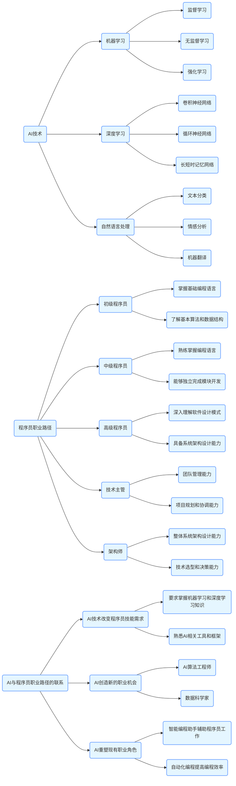

# 程序员的未来：AI将如何重塑职业路径

> 关键词：程序员、AI、职业路径、重塑、技术变革、未来趋势、技能需求

> 摘要：本文深入探讨了AI技术对程序员职业路径的多方面影响。在科技飞速发展的当下，AI正以前所未有的速度改变着软件行业的格局。文章首先介绍了研究的背景、目的、预期读者等内容，接着阐述了AI与程序员相关的核心概念及联系，详细讲解了相关核心算法原理与操作步骤，用数学模型和公式进行理论支持，通过项目实战案例分析AI在实际编程中的应用，探讨了实际应用场景，推荐了相关的工具和资源，最后总结了未来发展趋势与挑战，为程序员更好地适应AI时代的职业变革提供全面且深入的参考。

## 1. 背景介绍 
### 1.1 目的和范围
随着人工智能（AI）技术的迅猛发展，其在各个领域的应用日益广泛，软件行业也不例外。本文章旨在全面探讨AI技术将如何重塑程序员的职业路径，研究范围涵盖AI对程序员技能需求的改变、新的职业机会的产生、现有职业角色的转变等方面，帮助程序员清晰地了解未来的发展方向，以便提前做好职业规划和技能储备。

### 1.2 预期读者
本文的预期读者主要包括在职程序员、即将进入编程行业的准程序员、软件行业的管理者以及对AI和程序员职业发展感兴趣的研究人员。通过阅读本文，不同读者群体可以从各自的角度获取有价值的信息，如程序员可以明确自身的职业发展方向，管理者可以更好地进行团队规划和人才培养，研究人员可以获取相关研究素材和思路。

### 1.3 文档结构概述
本文将按照以下结构展开：首先介绍背景信息，包括目的、预期读者等；接着阐述AI与程序员相关的核心概念及联系，通过文本示意图和Mermaid流程图进行直观展示；然后详细讲解核心算法原理和具体操作步骤，结合Python源代码进行说明；再用数学模型和公式对相关理论进行支持，并举例说明；通过项目实战案例分析AI在实际编程中的应用；探讨AI在程序员职业中的实际应用场景；推荐相关的工具和资源，包括学习资源、开发工具框架和相关论文著作；最后总结未来发展趋势与挑战，提供常见问题解答和扩展阅读参考资料。

### 1.4 术语表
#### 1.4.1 核心术语定义
- **人工智能（AI）**：是一门研究如何使计算机能够模拟人类智能的学科，包括机器学习、深度学习、自然语言处理等多个领域，旨在让计算机具有感知、学习、推理和决策等能力。
- **机器学习（ML）**：是AI的一个重要分支，它通过让计算机从数据中自动学习模式和规律，从而实现预测和决策等功能。机器学习算法可以分为监督学习、无监督学习、强化学习等类型。
- **深度学习（DL）**：是一种基于人工神经网络的机器学习技术，通过构建多层神经网络来学习数据的深层次特征和模式，在图像识别、语音识别、自然语言处理等领域取得了显著的成果。
- **程序员**：是指从事程序开发、维护和优化等工作的专业人员，他们使用各种编程语言和开发工具来实现软件系统的功能。

#### 1.4.2 相关概念解释
- **自动化编程**：利用AI技术自动生成代码的过程，通过对大量代码数据的学习，AI可以根据需求生成相应的代码片段，提高编程效率。
- **智能编程助手**：基于AI技术的辅助编程工具，它可以为程序员提供代码建议、错误提示、优化建议等功能，帮助程序员提高编程质量和效率。
- **AI驱动的软件开发**：在软件开发过程中充分利用AI技术，如使用AI进行需求分析、设计优化、测试验证等，提高软件开发的质量和效率。

#### 1.4.3 缩略词列表
- **AI**：Artificial Intelligence（人工智能）
- **ML**：Machine Learning（机器学习）
- **DL**：Deep Learning（深度学习）
- **NLP**：Natural Language Processing（自然语言处理）
- **API**：Application Programming Interface（应用程序编程接口）

## 2. 核心概念与联系 
### 核心概念原理
#### 人工智能（AI）原理
AI的核心原理是通过模拟人类的智能行为，让计算机能够感知环境、学习知识、进行推理和决策。其主要实现方法包括机器学习、深度学习、知识表示与推理等。机器学习通过对大量数据的学习来发现数据中的模式和规律，从而实现预测和分类等任务。深度学习则是利用多层神经网络来学习数据的深层次特征，在图像、语音等领域取得了巨大的成功。

#### 程序员职业路径原理
程序员的职业路径通常包括初级程序员、中级程序员、高级程序员、技术主管、架构师等不同阶段。在每个阶段，程序员需要具备不同的技能和知识，如编程语言、算法设计、数据结构、软件设计模式等。随着技术的发展和市场需求的变化，程序员的职业路径也在不断演变。

### 架构的文本示意图
```plaintext
AI技术
|-- 机器学习
|   |-- 监督学习
|   |-- 无监督学习
|   |-- 强化学习
|-- 深度学习
|   |-- 卷积神经网络（CNN）
|   |-- 循环神经网络（RNN）
|   |-- 长短时记忆网络（LSTM）
|-- 自然语言处理（NLP）
|   |-- 文本分类
|   |-- 情感分析
|   |-- 机器翻译

程序员职业路径
|-- 初级程序员
|   |-- 掌握基础编程语言
|   |-- 了解基本算法和数据结构
|-- 中级程序员
|   |-- 熟练掌握编程语言
|   |-- 能够独立完成模块开发
|-- 高级程序员
|   |-- 深入理解软件设计模式
|   |-- 具备系统架构设计能力
|-- 技术主管
|   |-- 团队管理能力
|   |-- 项目规划和协调能力
|-- 架构师
|   |-- 整体系统架构设计能力
|   |-- 技术选型和决策能力

AI与程序员职业路径的联系
|-- AI技术改变程序员技能需求
|   |-- 要求掌握机器学习和深度学习知识
|   |-- 熟悉AI相关工具和框架
|-- AI创造新的职业机会
|   |-- AI算法工程师
|   |-- 数据科学家
|-- AI重塑现有职业角色
|   |-- 智能编程助手辅助程序员工作
|   |-- 自动化编程提高编程效率
```

### Mermaid流程图


## 3. 核心算法原理 & 具体操作步骤 
### 核心算法原理
#### 机器学习算法 - 线性回归
线性回归是一种简单而常用的监督学习算法，用于预测连续数值。其基本原理是通过找到一条最佳的直线来拟合数据点，使得数据点到直线的误差平方和最小。线性回归的数学模型可以表示为：

$$y = \theta_0 + \theta_1x_1 + \theta_2x_2 + \cdots + \theta_nx_n$$

其中，$y$ 是预测值，$x_1, x_2, \cdots, x_n$ 是输入特征，$\theta_0, \theta_1, \cdots, \theta_n$ 是模型的参数。

#### 深度学习算法 - 卷积神经网络（CNN）
卷积神经网络是一种专门用于处理具有网格结构数据（如图像）的深度学习模型。其核心原理是通过卷积层、池化层和全连接层的组合来自动提取数据的特征。卷积层通过卷积核在输入数据上滑动进行卷积操作，提取局部特征；池化层用于降低数据的维度，减少计算量；全连接层将提取的特征进行分类或回归等任务。

### 具体操作步骤及Python源代码
#### 线性回归实现步骤
1. **数据准备**：收集和整理数据集，将其分为训练集和测试集。
2. **模型训练**：使用训练集数据来训练线性回归模型，通过最小化误差平方和来求解模型的参数。
3. **模型评估**：使用测试集数据来评估模型的性能，常用的评估指标包括均方误差（MSE）、均方根误差（RMSE）等。

以下是一个使用Python和Scikit-learn库实现线性回归的示例代码：
```python
import numpy as np
from sklearn.model_selection import train_test_split
from sklearn.linear_model import LinearRegression
from sklearn.metrics import mean_squared_error

# 生成示例数据
X = np.array([1, 2, 3, 4, 5, 6, 7, 8, 9, 10]).reshape(-1, 1)
y = np.array([2, 4, 6, 8, 10, 12, 14, 16, 18, 20])

# 划分训练集和测试集
X_train, X_test, y_train, y_test = train_test_split(X, y, test_size=0.2, random_state=42)

# 创建线性回归模型
model = LinearRegression()

# 训练模型
model.fit(X_train, y_train)

# 预测
y_pred = model.predict(X_test)

# 评估模型
mse = mean_squared_error(y_test, y_pred)
rmse = np.sqrt(mse)

print(f"均方误差 (MSE): {mse}")
print(f"均方根误差 (RMSE): {rmse}")
```

#### 卷积神经网络（CNN）实现步骤
1. **数据准备**：加载和预处理图像数据集，将图像数据进行归一化、划分训练集和测试集等操作。
2. **模型构建**：使用深度学习框架（如TensorFlow、PyTorch）构建卷积神经网络模型，定义卷积层、池化层和全连接层的结构。
3. **模型训练**：使用训练集数据来训练CNN模型，通过反向传播算法来更新模型的参数。
4. **模型评估**：使用测试集数据来评估模型的性能，常用的评估指标包括准确率、召回率等。

以下是一个使用Python和TensorFlow库实现简单CNN模型的示例代码：
```python
import tensorflow as tf
from tensorflow.keras import datasets, layers, models
import matplotlib.pyplot as plt

# 加载数据集
(train_images, train_labels), (test_images, test_labels) = datasets.cifar10.load_data()

# 数据预处理
train_images, test_images = train_images / 255.0, test_images / 255.0

# 构建CNN模型
model = models.Sequential()
model.add(layers.Conv2D(32, (3, 3), activation='relu', input_shape=(32, 32, 3)))
model.add(layers.MaxPooling2D((2, 2)))
model.add(layers.Conv2D(64, (3, 3), activation='relu'))
model.add(layers.MaxPooling2D((2, 2)))
model.add(layers.Conv2D(64, (3, 3), activation='relu'))
model.add(layers.Flatten())
model.add(layers.Dense(64, activation='relu'))
model.add(layers.Dense(10))

# 编译模型
model.compile(optimizer='adam',
              loss=tf.keras.losses.SparseCategoricalCrossentropy(from_logits=True),
              metrics=['accuracy'])

# 训练模型
history = model.fit(train_images, train_labels, epochs=10, 
                    validation_data=(test_images, test_labels))

# 评估模型
test_loss, test_acc = model.evaluate(test_images,  test_labels, verbose=2)
print(f"测试准确率: {test_acc}")
```

## 4. 数学模型和公式 & 详细讲解 & 举例说明 
### 线性回归数学模型和公式
线性回归的目标是找到一组参数 $\theta = [\theta_0, \theta_1, \cdots, \theta_n]$ ，使得预测值 $\hat{y}$ 与真实值 $y$ 之间的误差最小。常用的误差度量方法是均方误差（MSE），其数学公式为：

$$MSE = \frac{1}{m} \sum_{i=1}^{m} (y^{(i)} - \hat{y}^{(i)})^2$$

其中，$m$ 是样本数量，$y^{(i)}$ 是第 $i$ 个样本的真实值，$\hat{y}^{(i)}$ 是第 $i$ 个样本的预测值。

为了最小化均方误差，我们可以使用梯度下降算法来更新模型的参数。梯度下降算法的更新公式为：

$$\theta_j := \theta_j - \alpha \frac{\partial}{\partial \theta_j} MSE(\theta)$$

其中，$\alpha$ 是学习率，控制参数更新的步长。

### 详细讲解
线性回归的基本思想是通过找到一条最佳的直线来拟合数据点。在二维空间中，线性回归模型可以表示为 $y = \theta_0 + \theta_1x$，其中 $\theta_0$ 是截距，$\theta_1$ 是斜率。在多维空间中，线性回归模型可以表示为 $y = \theta_0 + \theta_1x_1 + \theta_2x_2 + \cdots + \theta_nx_n$。

均方误差（MSE）是一种常用的误差度量方法，它衡量了预测值与真实值之间的平均误差平方。通过最小化均方误差，我们可以找到一组最优的参数 $\theta$，使得模型的预测效果最好。

梯度下降算法是一种迭代优化算法，它通过不断地更新模型的参数，使得误差函数的值逐渐减小。在每次迭代中，我们根据误差函数的梯度来更新参数，梯度的方向表示误差函数增加最快的方向，因此我们沿着梯度的反方向更新参数，以减小误差函数的值。

### 举例说明
假设我们有一个简单的数据集，包含两个特征 $x_1$ 和 $x_2$，以及一个目标值 $y$。数据集如下：

| $x_1$ | $x_2$ | $y$ |
|---|---|---|
| 1 | 2 | 5 |
| 2 | 3 | 7 |
| 3 | 4 | 9 |

我们可以使用线性回归模型来预测 $y$ 的值。假设线性回归模型为 $y = \theta_0 + \theta_1x_1 + \theta_2x_2$，我们的目标是找到一组参数 $\theta_0, \theta_1, \theta_2$，使得均方误差最小。

首先，我们需要计算均方误差的梯度。均方误差的梯度公式为：

$$\frac{\partial}{\partial \theta_j} MSE(\theta) = \frac{2}{m} \sum_{i=1}^{m} (\hat{y}^{(i)} - y^{(i)}) x_j^{(i)}$$

其中，$x_j^{(i)}$ 是第 $i$ 个样本的第 $j$ 个特征。

然后，我们可以使用梯度下降算法来更新参数。假设学习率 $\alpha = 0.01$，初始参数 $\theta_0 = 0, \theta_1 = 0, \theta_2 = 0$。在每次迭代中，我们根据梯度更新参数：

$$\theta_j := \theta_j - \alpha \frac{\partial}{\partial \theta_j} MSE(\theta)$$

经过多次迭代，我们可以得到一组最优的参数 $\theta_0, \theta_1, \theta_2$，使得均方误差最小。

### 卷积神经网络（CNN）数学模型和公式
卷积神经网络的核心操作是卷积操作，其数学公式为：

$$y_{i,j}^l = \sum_{m=0}^{M-1} \sum_{n=0}^{N-1} x_{i+m,j+n}^{l-1} w_{m,n}^l + b^l$$

其中，$y_{i,j}^l$ 是第 $l$ 层的第 $(i, j)$ 个神经元的输出，$x_{i+m,j+n}^{l-1}$ 是第 $l-1$ 层的第 $(i+m, j+n)$ 个神经元的输入，$w_{m,n}^l$ 是第 $l$ 层的卷积核的第 $(m, n)$ 个权重，$b^l$ 是第 $l$ 层的偏置。

### 详细讲解
卷积操作是CNN的核心操作，它通过卷积核在输入数据上滑动进行卷积运算，提取局部特征。卷积核是一个小的矩阵，它包含了一组权重，通过对输入数据和卷积核进行点积运算，得到输出特征图。

在卷积操作中，我们通常会使用激活函数来引入非线性因素，常用的激活函数包括ReLU、Sigmoid等。激活函数的作用是将卷积操作的输出进行非线性变换，使得模型能够学习到更复杂的特征。

池化层是CNN中的另一个重要组件，它用于降低数据的维度，减少计算量。常用的池化方法包括最大池化和平均池化。最大池化是指在每个池化窗口中选择最大值作为输出，平均池化是指在每个池化窗口中计算平均值作为输出。

### 举例说明
假设我们有一个输入图像，其大小为 $32 \times 32 \times 3$（高度 $\times$ 宽度 $\times$ 通道数），我们使用一个大小为 $3 \times 3 \times 3$ 的卷积核进行卷积操作，步长为 1，填充为 0。卷积核的权重为：

$$w = \begin{bmatrix}
w_{0,0} & w_{0,1} & w_{0,2} \\
w_{1,0} & w_{1,1} & w_{1,2} \\
w_{2,0} & w_{2,1} & w_{2,2}
\end{bmatrix}$$

偏置为 $b$。

在卷积操作中，卷积核在输入图像上滑动，每次与输入图像的一个局部区域进行点积运算，得到一个输出值。例如，当卷积核在输入图像的左上角位置时，输出值为：

$$y_{0,0} = \sum_{m=0}^{2} \sum_{n=0}^{2} x_{m,n} w_{m,n} + b$$

其中，$x_{m,n}$ 是输入图像的第 $(m, n)$ 个像素值。

通过不断地滑动卷积核，我们可以得到一个输出特征图。假设输出特征图的大小为 $30 \times 30 \times 1$（高度 $\times$ 宽度 $\times$ 通道数）。

## 5. 项目实战：代码实际案例和详细解释说明 
### 5.1  开发环境搭建
#### 安装Python
首先，我们需要安装Python环境。可以从Python官方网站（https://www.python.org/downloads/） 下载适合自己操作系统的Python安装包，并按照安装向导进行安装。

#### 安装必要的库
在项目中，我们需要使用一些Python库，如Scikit-learn、TensorFlow、NumPy、Matplotlib等。可以使用pip命令来安装这些库：
```sh
pip install scikit-learn tensorflow numpy matplotlib
```

### 5.2  源代码详细实现和代码解读
#### 线性回归项目实战
以下是一个使用线性回归预测房价的项目实战代码：
```python
import numpy as np
from sklearn.datasets import load_boston
from sklearn.model_selection import train_test_split
from sklearn.linear_model import LinearRegression
from sklearn.metrics import mean_squared_error

# 加载波士顿房价数据集
boston = load_boston()
X = boston.data
y = boston.target

# 划分训练集和测试集
X_train, X_test, y_train, y_test = train_test_split(X, y, test_size=0.2, random_state=42)

# 创建线性回归模型
model = LinearRegression()

# 训练模型
model.fit(X_train, y_train)

# 预测
y_pred = model.predict(X_test)

# 评估模型
mse = mean_squared_error(y_test, y_pred)
rmse = np.sqrt(mse)

print(f"均方误差 (MSE): {mse}")
print(f"均方根误差 (RMSE): {rmse}")
```
**代码解读**：
1. **数据加载**：使用 `load_boston` 函数加载波士顿房价数据集，将特征数据存储在 `X` 中，目标数据存储在 `y` 中。
2. **数据划分**：使用 `train_test_split` 函数将数据集划分为训练集和测试集，测试集占比为 20%。
3. **模型创建**：使用 `LinearRegression` 类创建线性回归模型。
4. **模型训练**：使用 `fit` 方法对模型进行训练，将训练集数据作为输入。
5. **模型预测**：使用 `predict` 方法对测试集数据进行预测，得到预测结果。
6. **模型评估**：使用 `mean_squared_error` 函数计算均方误差，并计算均方根误差。

#### 卷积神经网络（CNN）项目实战
以下是一个使用CNN进行图像分类的项目实战代码：
```python
import tensorflow as tf
from tensorflow.keras import datasets, layers, models
import matplotlib.pyplot as plt

# 加载数据集
(train_images, train_labels), (test_images, test_labels) = datasets.cifar10.load_data()

# 数据预处理
train_images, test_images = train_images / 255.0, test_images / 255.0

# 构建CNN模型
model = models.Sequential()
model.add(layers.Conv2D(32, (3, 3), activation='relu', input_shape=(32, 32, 3)))
model.add(layers.MaxPooling2D((2, 2)))
model.add(layers.Conv2D(64, (3, 3), activation='relu'))
model.add(layers.MaxPooling2D((2, 2)))
model.add(layers.Conv2D(64, (3, 3), activation='relu'))
model.add(layers.Flatten())
model.add(layers.Dense(64, activation='relu'))
model.add(layers.Dense(10))

# 编译模型
model.compile(optimizer='adam',
              loss=tf.keras.losses.SparseCategoricalCrossentropy(from_logits=True),
              metrics=['accuracy'])

# 训练模型
history = model.fit(train_images, train_labels, epochs=10, 
                    validation_data=(test_images, test_labels))

# 评估模型
test_loss, test_acc = model.evaluate(test_images,  test_labels, verbose=2)
print(f"测试准确率: {test_acc}")
```
**代码解读**：
1. **数据加载**：使用 `datasets.cifar10.load_data` 函数加载CIFAR-10图像数据集，将训练集数据存储在 `train_images` 和 `train_labels` 中，测试集数据存储在 `test_images` 和 `test_labels` 中。
2. **数据预处理**：将图像数据进行归一化处理，将像素值从 0-255 缩放到 0-1 之间。
3. **模型构建**：使用 `models.Sequential` 类构建CNN模型，依次添加卷积层、池化层、全连接层等。
4. **模型编译**：使用 `compile` 方法对模型进行编译，指定优化器、损失函数和评估指标。
5. **模型训练**：使用 `fit` 方法对模型进行训练，指定训练集数据、训练轮数和验证集数据。
6. **模型评估**：使用 `evaluate` 方法对模型进行评估，得到测试集的损失值和准确率。

### 5.3  代码解读与分析
#### 线性回归代码分析
- **优点**：线性回归是一种简单而有效的机器学习算法，具有计算速度快、易于理解和实现等优点。在数据特征与目标值之间存在线性关系时，线性回归可以取得较好的预测效果。
- **缺点**：线性回归只能处理线性关系，对于复杂的非线性关系，其预测效果可能不佳。此外，线性回归对异常值比较敏感，异常值可能会影响模型的性能。

#### 卷积神经网络代码分析
- **优点**：卷积神经网络在图像、语音等领域取得了巨大的成功，具有自动提取特征、处理大规模数据等优点。CNN可以学习到数据的深层次特征，从而提高模型的性能。
- **缺点**：卷积神经网络的训练过程比较复杂，需要大量的计算资源和时间。此外，CNN的模型结构比较复杂，需要对模型进行调优和优化，以提高模型的性能。

## 6. 实际应用场景 
### AI辅助编程
智能编程助手可以根据程序员输入的代码片段和注释，自动生成相关的代码建议和补全，提高编程效率。例如，当程序员输入一个函数名时，智能编程助手可以自动补全函数的参数和返回值，减少程序员的输入工作量。

### 自动化测试
利用AI技术可以实现自动化测试，自动生成测试用例，对软件系统进行全面的测试。AI可以根据软件的功能和结构，自动生成各种测试场景，发现软件中的潜在问题，提高软件的质量和可靠性。

### 代码优化
AI可以对现有代码进行分析和优化，发现代码中的性能瓶颈和潜在问题，并提供优化建议。例如，AI可以分析代码的复杂度，提出优化算法和数据结构的建议，提高代码的运行效率。

### AI驱动的软件开发
在软件开发过程中，利用AI技术进行需求分析、设计优化等工作。例如，AI可以对用户需求进行分析和理解，自动生成软件的功能模块和架构设计，提高软件开发的效率和质量。

### 智能代码审查
AI可以对程序员提交的代码进行审查，发现代码中的潜在问题和错误，如代码风格问题、安全漏洞等。智能代码审查可以提高代码的质量和一致性，减少人工审查的工作量。

## 7. 工具和资源推荐
### 7.1 学习资源推荐
#### 7.1.1 书籍推荐
- 《Python机器学习》：本书详细介绍了Python在机器学习领域的应用，包括机器学习算法的原理、实现和应用案例，适合初学者学习。
- 《深度学习》：由深度学习领域的三位先驱Ian Goodfellow、Yoshua Bengio和Aaron Courville撰写，是深度学习领域的经典教材，深入介绍了深度学习的理论和实践。
- 《人工智能：一种现代的方法》：全面介绍了人工智能的各个领域，包括搜索算法、知识表示、机器学习、自然语言处理等，是人工智能领域的权威著作。

#### 7.1.2 在线课程
- Coursera上的“机器学习”课程：由Andrew Ng教授主讲，是机器学习领域的经典课程，介绍了机器学习的基本概念、算法和应用。
- edX上的“深度学习微硕士项目”：由多位深度学习领域的专家授课，提供了深度学习的系统学习课程，包括卷积神经网络、循环神经网络等内容。
- 中国大学MOOC上的“人工智能基础”课程：由国内知名高校的教授授课，介绍了人工智能的基本概念、技术和应用，适合初学者学习。

#### 7.1.3 技术博客和网站
- Medium：是一个技术博客平台，上面有很多关于AI、机器学习、深度学习等领域的优秀文章，作者来自世界各地的技术专家。
- Towards Data Science：专注于数据科学和机器学习领域的技术博客，提供了很多实用的技术文章和案例分析。
- AI开源社区：如GitHub上的AI相关项目，是学习和交流AI技术的重要平台，可以查看最新的开源项目和代码实现。

### 7.2 开发工具框架推荐
#### 7.2.1 IDE和编辑器
- PyCharm：是一款专门为Python开发设计的集成开发环境（IDE），提供了代码编辑、调试、代码分析等功能，支持多种Python库和框架。
- Visual Studio Code：是一款轻量级的代码编辑器，支持多种编程语言，具有丰富的插件生态系统，可以方便地进行AI开发。
- Jupyter Notebook：是一个交互式的开发环境，适合进行数据探索、模型训练和可视化等工作，支持Python、R等多种编程语言。

#### 7.2.2 调试和性能分析工具
- TensorBoard：是TensorFlow提供的可视化工具，可以帮助用户可视化模型的训练过程、网络结构、损失函数等信息，方便进行调试和性能分析。
- PyTorch Profiler：是PyTorch提供的性能分析工具，可以帮助用户分析模型的性能瓶颈，优化模型的训练和推理过程。
- cProfile：是Python标准库中的性能分析工具，可以帮助用户分析Python代码的性能，找出性能瓶颈。

#### 7.2.3 相关框架和库
- TensorFlow：是Google开发的开源深度学习框架，提供了丰富的深度学习工具和库，支持多种硬件平台，广泛应用于图像识别、语音识别、自然语言处理等领域。
- PyTorch：是Facebook开发的开源深度学习框架，具有动态图的特点，易于使用和调试，在学术界和工业界都有广泛的应用。
- Scikit-learn：是一个简单而有效的机器学习库，提供了多种机器学习算法和工具，适合初学者学习和实践。

### 7.3 相关论文著作推荐
#### 7.3.1 经典论文
- “Gradient-Based Learning Applied to Document Recognition”：由Yann LeCun等人发表，介绍了卷积神经网络（CNN）的基本原理和应用，是CNN领域的经典论文。
- “ImageNet Classification with Deep Convolutional Neural Networks”：由Alex Krizhevsky等人发表，介绍了AlexNet模型，开启了深度学习在图像识别领域的革命。
- “Long Short-Term Memory”：由Sepp Hochreiter和Jürgen Schmidhuber发表，介绍了长短时记忆网络（LSTM）的基本原理和应用，是循环神经网络领域的经典论文。

#### 7.3.2 最新研究成果
- OpenAI的GPT系列论文：介绍了GPT模型的原理和应用，展示了自然语言处理领域的最新研究成果。
- Google的BERT论文：介绍了BERT模型的原理和应用，在自然语言处理领域取得了显著的成果。
- DeepMind的AlphaGo系列论文：介绍了AlphaGo模型的原理和应用，展示了人工智能在围棋领域的最新研究成果。

#### 7.3.3 应用案例分析
- 《AI未来简史》：通过多个实际应用案例，介绍了AI在医疗、金融、交通等领域的应用，探讨了AI对社会和人类的影响。
- 《智能时代》：介绍了AI在各个领域的应用案例，分析了AI对未来社会的影响和挑战，提供了应对策略和建议。

## 8. 总结：未来发展趋势与挑战
### 未来发展趋势
#### 技能需求变化
随着AI技术的发展，程序员需要掌握更多的AI相关技能，如机器学习、深度学习、自然语言处理等。同时，程序员还需要具备数据分析、算法设计等能力，以更好地应对AI时代的挑战。

#### 新的职业机会
AI技术将创造新的职业机会，如AI算法工程师、数据科学家、智能系统工程师等。这些职业需要具备深厚的AI技术背景和专业知识，为程序员提供了更广阔的职业发展空间。

#### 职业角色转变
现有程序员的职业角色将发生转变，智能编程助手和自动化编程工具将辅助程序员完成一些重复性的工作，程序员将更多地专注于创造性的工作，如系统架构设计、算法优化等。

### 挑战
#### 技术更新换代快
AI技术发展迅速，新的算法和模型不断涌现，程序员需要不断学习和更新自己的知识，以跟上技术的发展步伐。

#### 数据隐私和安全问题
在AI应用中，数据隐私和安全问题是一个重要的挑战。程序员需要确保数据的安全性和隐私性，防止数据泄露和滥用。

#### 伦理和道德问题
AI技术的发展也带来了一些伦理和道德问题，如AI的决策是否公平、是否会对人类造成伤害等。程序员需要考虑这些问题，确保AI技术的合理应用。

## 9. 附录：常见问题与解答
### 问题1：AI会取代程序员吗？
答：AI不会完全取代程序员，但会对程序员的职业路径产生影响。AI可以辅助程序员完成一些重复性的工作，提高编程效率，但创造性的工作仍然需要程序员来完成。例如，系统架构设计、算法优化等工作需要程序员的专业知识和经验。

### 问题2：程序员需要学习哪些AI知识？
答：程序员需要学习的AI知识包括机器学习、深度学习、自然语言处理等领域的基本概念、算法和应用。此外，还需要学习数据分析、算法设计等相关知识，以更好地应用AI技术。

### 问题3：如何学习AI技术？
答：可以通过阅读相关书籍、在线课程、技术博客等方式学习AI技术。同时，还可以通过实践项目来提高自己的AI技术能力，如参加开源项目、竞赛等。

### 问题4：AI技术在哪些领域有应用？
答：AI技术在医疗、金融、交通、教育、娱乐等领域都有广泛的应用。例如，在医疗领域，AI可以用于疾病诊断、药物研发等；在金融领域，AI可以用于风险评估、投资决策等。

## 10. 扩展阅读 & 参考资料
### 扩展阅读
- 《人类简史：从动物到上帝》：作者尤瓦尔·赫拉利，从人类发展的角度探讨了科技对人类社会的影响，对理解AI时代的变革有一定的启示作用。
- 《失控：全人类的最终命运和结局》：作者凯文·凯利，探讨了科技、社会和进化的关系，对未来科技发展的趋势有独特的见解。

### 参考资料
- 相关学术论文：如IEEE、ACM等学术期刊和会议上发表的关于AI和程序员职业发展的论文。
- 行业报告：如Gartner、IDC等机构发布的关于AI技术发展和应用的行业报告。
- 官方文档：如TensorFlow、PyTorch等AI框架的官方文档，是学习和使用这些框架的重要参考资料。