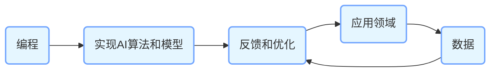

# 程序员的未来：AI时代的职业新常态

> 关键词：程序员、AI时代、职业新常态、技术变革、职业发展、技能提升、行业趋势

> 摘要：本文深入探讨了在AI时代程序员所面临的职业新常态。随着人工智能技术的飞速发展，程序员的工作内容、职业要求和发展路径都在发生深刻的变化。文章首先介绍了相关背景，包括目的范围、预期读者等。接着阐述了核心概念与联系，分析了AI与编程之间的相互关系和影响。详细讲解了核心算法原理及具体操作步骤，结合数学模型和公式进行了深入剖析。通过项目实战案例展示了AI技术在编程中的实际应用。探讨了程序员在AI时代的实际应用场景，推荐了相关的学习资源、开发工具和论文著作。最后总结了未来发展趋势与挑战，并提供了常见问题解答和扩展阅读参考资料，旨在帮助程序员更好地适应AI时代的职业变化，实现个人职业的持续发展。

## 1. 背景介绍 
### 1.1 目的和范围
在当今科技飞速发展的时代，人工智能（AI）正以前所未有的速度改变着各个行业。程序员作为推动科技进步的关键力量，其职业发展也受到了AI技术的深刻影响。本文的目的在于全面分析AI时代程序员所面临的职业新常态，探讨技术变革对程序员职业的影响，以及程序员如何在这个变化的环境中实现自身的发展。

文章的范围涵盖了AI技术的基本概念、对编程行业的影响、程序员所需的新技能和知识、实际应用场景、学习资源和工具推荐等多个方面，旨在为程序员提供一个全面的视角，帮助他们更好地应对AI时代的挑战和机遇。

### 1.2 预期读者
本文的预期读者主要包括以下几类人群：
- **在职程序员**：希望了解AI时代的发展趋势，提升自身技能，适应职业变化，实现职业晋升的程序员。
- **计算机相关专业学生**：对未来职业发展感兴趣，希望提前了解AI时代程序员的职业要求和发展方向的学生。
- **技术管理者**：需要了解行业动态，合理规划团队技术发展方向，提升团队竞争力的技术管理者。
- **对AI和编程感兴趣的爱好者**：希望了解AI技术和编程行业的发展，拓宽知识面的爱好者。

### 1.3 文档结构概述
本文将按照以下结构进行阐述：
- **核心概念与联系**：介绍AI和编程的核心概念，以及它们之间的相互关系和影响。
- **核心算法原理 & 具体操作步骤**：详细讲解AI中的核心算法原理，并结合Python代码展示具体的操作步骤。
- **数学模型和公式 & 详细讲解 & 举例说明**：介绍AI中的数学模型和公式，进行详细讲解并举例说明。
- **项目实战：代码实际案例和详细解释说明**：通过实际项目案例，展示AI技术在编程中的应用，包括开发环境搭建、源代码实现和代码解读。
- **实际应用场景**：探讨程序员在AI时代的实际应用场景，分析不同场景下的技术需求和挑战。
- **工具和资源推荐**：推荐相关的学习资源、开发工具和论文著作，帮助程序员提升技能和知识。
- **总结：未来发展趋势与挑战**：总结AI时代程序员的未来发展趋势，分析面临的挑战和应对策略。
- **附录：常见问题与解答**：提供常见问题的解答，帮助读者更好地理解文章内容。
- **扩展阅读 & 参考资料**：提供扩展阅读的建议和参考资料，方便读者深入学习。

### 1.4 术语表
#### 1.4.1 核心术语定义
- **人工智能（AI）**：是指计算机系统能够执行通常需要人类智能才能完成的任务，如学习、推理、解决问题、感知和语言理解等。
- **机器学习（ML）**：是人工智能的一个子集，专注于开发算法和模型，使计算机系统能够从数据中学习，而无需明确编程。
- **深度学习（DL）**：是机器学习的一个分支，使用多层神经网络来学习数据的复杂模式和表示。
- **自然语言处理（NLP）**：是人工智能的一个领域，致力于使计算机能够理解、处理和生成人类语言。
- **计算机视觉（CV）**：是人工智能的一个领域，专注于使计算机能够理解和解释图像和视频数据。

#### 1.4.2 相关概念解释
- **AI编程**：是指使用编程语言和工具来开发人工智能系统和应用程序的过程。
- **自动化编程**：是指使用AI技术来自动生成代码或辅助程序员进行编程的过程。
- **智能编程助手**：是指基于AI技术的工具，能够为程序员提供代码建议、错误诊断和修复等帮助。

#### 1.4.3 缩略词列表
- **AI**：Artificial Intelligence（人工智能）
- **ML**：Machine Learning（机器学习）
- **DL**：Deep Learning（深度学习）
- **NLP**：Natural Language Processing（自然语言处理）
- **CV**：Computer Vision（计算机视觉）

## 2. 核心概念与联系 

### 2.1 AI与编程的基本概念
人工智能（AI）是一门研究如何使计算机系统具有智能行为的学科。它的目标是让计算机能够像人类一样感知、学习、推理和决策。编程则是将人类的想法和算法转化为计算机能够理解和执行的指令的过程。

在AI时代，编程是实现人工智能系统的重要手段。通过编程，我们可以开发出各种AI算法和模型，实现语音识别、图像分类、自然语言处理等功能。同时，AI技术也为编程带来了新的发展机遇，如自动化编程、智能编程助手等。

### 2.2 AI与编程的相互关系和影响
AI与编程之间存在着相互促进、相互影响的关系。一方面，编程为AI的发展提供了技术支持。程序员通过编写代码来实现各种AI算法和模型，推动了AI技术的不断进步。另一方面，AI技术也为编程带来了新的变革。例如，自动化编程技术可以自动生成代码，提高编程效率；智能编程助手可以帮助程序员更快地找到问题和解决问题，提升编程质量。

此外，AI技术的发展也改变了编程的需求和方向。在AI时代，程序员需要掌握更多的AI相关知识和技能，如机器学习、深度学习、自然语言处理等。同时，编程的应用领域也得到了拓展，如智能医疗、智能交通、智能金融等。

### 2.3 核心概念原理和架构的文本示意图
AI与编程的关系可以用以下文本示意图来表示：

```plaintext
              编程
               │
               │  实现AI算法和模型
               ▼
人工智能系统 ────────►  应用领域（智能医疗、智能交通、智能金融等）
               │
               │  反馈和优化
               ▲
              数据
```

这个示意图展示了编程在实现人工智能系统中的作用，以及人工智能系统与应用领域和数据之间的关系。程序员通过编程实现AI算法和模型，将其应用于不同的领域。同时，应用领域产生的数据可以反馈给AI系统，用于优化算法和模型。

### 2.4 Mermaid流程图


这个流程图更加直观地展示了AI与编程的关系。编程通过实现AI算法和模型构建人工智能系统，人工智能系统应用于不同的领域，应用领域产生的数据反馈给人工智能系统进行优化。

## 3. 核心算法原理 & 具体操作步骤 

### 3.1 机器学习算法原理
机器学习是AI的核心领域之一，它主要包括监督学习、无监督学习和强化学习等方法。下面以监督学习中的线性回归算法为例，介绍其原理和具体操作步骤。

#### 3.1.1 线性回归算法原理
线性回归是一种用于预测连续数值的监督学习算法。它的基本思想是通过找到一条直线（或超平面），使得所有数据点到该直线（或超平面）的距离之和最小。这条直线（或超平面）的方程可以表示为：

$y = \theta_0 + \theta_1x_1 + \theta_2x_2 + \cdots + \theta_nx_n$

其中，$y$ 是预测值，$x_1, x_2, \cdots, x_n$ 是输入特征，$\theta_0, \theta_1, \cdots, \theta_n$ 是模型的参数。

线性回归的目标是找到最优的参数 $\theta$，使得预测值 $y$ 与真实值之间的误差最小。通常使用均方误差（MSE）作为损失函数，其定义为：

$MSE = \frac{1}{m}\sum_{i=1}^{m}(y^{(i)} - \hat{y}^{(i)})^2$

其中，$m$ 是样本数量，$y^{(i)}$ 是第 $i$ 个样本的真实值，$\hat{y}^{(i)}$ 是第 $i$ 个样本的预测值。

#### 3.1.2 具体操作步骤
下面是使用Python实现线性回归算法的具体步骤：

```python
import numpy as np
from sklearn.linear_model import LinearRegression
from sklearn.model_selection import train_test_split
from sklearn.metrics import mean_squared_error

# 生成一些示例数据
np.random.seed(0)
X = 2 * np.random.rand(100, 1)
y = 4 + 3 * X + np.random.randn(100, 1)

# 划分训练集和测试集
X_train, X_test, y_train, y_test = train_test_split(X, y, test_size=0.2, random_state=42)

# 创建线性回归模型
model = LinearRegression()

# 训练模型
model.fit(X_train, y_train)

# 预测测试集
y_pred = model.predict(X_test)

# 计算均方误差
mse = mean_squared_error(y_test, y_pred)
print(f"均方误差: {mse}")
```

### 3.2 深度学习算法原理
深度学习是机器学习的一个分支，它使用多层神经网络来学习数据的复杂模式和表示。下面以简单的全连接神经网络为例，介绍其原理和具体操作步骤。

#### 3.2.1 全连接神经网络原理
全连接神经网络由输入层、隐藏层和输出层组成。每个层由多个神经元组成，神经元之间通过权重连接。在训练过程中，神经网络通过不断调整权重，使得预测值与真实值之间的误差最小。

全连接神经网络的前向传播过程可以表示为：

$z^{[l]} = W^{[l]}a^{[l-1]} + b^{[l]}$

$a^{[l]} = g(z^{[l]})$

其中，$z^{[l]}$ 是第 $l$ 层的加权输入，$W^{[l]}$ 是第 $l$ 层的权重矩阵，$a^{[l-1]}$ 是第 $l-1$ 层的输出，$b^{[l]}$ 是第 $l$ 层的偏置向量，$g$ 是激活函数。

在训练过程中，通常使用反向传播算法来计算梯度，并使用梯度下降算法来更新权重。

#### 3.2.2 具体操作步骤
下面是使用Python和PyTorch实现简单全连接神经网络的具体步骤：

```python
import torch
import torch.nn as nn
import torch.optim as optim
from torch.utils.data import DataLoader, TensorDataset

# 生成一些示例数据
np.random.seed(0)
X = 2 * np.random.rand(100, 1).astype(np.float32)
y = 4 + 3 * X + np.random.randn(100, 1).astype(np.float32)

# 将数据转换为PyTorch张量
X_tensor = torch.from_numpy(X)
y_tensor = torch.from_numpy(y)

# 创建数据集和数据加载器
dataset = TensorDataset(X_tensor, y_tensor)
dataloader = DataLoader(dataset, batch_size=10, shuffle=True)

# 定义全连接神经网络模型
class SimpleNet(nn.Module):
    def __init__(self):
        super(SimpleNet, self).__init__()
        self.fc1 = nn.Linear(1, 10)
        self.relu = nn.ReLU()
        self.fc2 = nn.Linear(10, 1)

    def forward(self, x):
        x = self.fc1(x)
        x = self.relu(x)
        x = self.fc2(x)
        return x

# 创建模型、损失函数和优化器
model = SimpleNet()
criterion = nn.MSELoss()
optimizer = optim.SGD(model.parameters(), lr=0.01)

# 训练模型
num_epochs = 100
for epoch in range(num_epochs):
    for inputs, labels in dataloader:
        optimizer.zero_grad()
        outputs = model(inputs)
        loss = criterion(outputs, labels)
        loss.backward()
        optimizer.step()

    if (epoch + 1) % 10 == 0:
        print(f'Epoch [{epoch+1}/{num_epochs}], Loss: {loss.item():.4f}')
```

## 4. 数学模型和公式 & 详细讲解 & 举例说明 

### 4.1 线性回归的数学模型和公式
线性回归的数学模型可以表示为：

$y = \theta_0 + \theta_1x_1 + \theta_2x_2 + \cdots + \theta_nx_n + \epsilon$

其中，$y$ 是因变量，$x_1, x_2, \cdots, x_n$ 是自变量，$\theta_0, \theta_1, \cdots, \theta_n$ 是模型的参数，$\epsilon$ 是误差项，通常假设 $\epsilon$ 服从均值为 0，方差为 $\sigma^2$ 的正态分布。

线性回归的目标是找到最优的参数 $\theta$，使得预测值 $\hat{y}$ 与真实值 $y$ 之间的误差最小。通常使用最小二乘法来估计参数 $\theta$，即最小化均方误差（MSE）：

$MSE = \frac{1}{m}\sum_{i=1}^{m}(y^{(i)} - \hat{y}^{(i)})^2$

其中，$m$ 是样本数量，$y^{(i)}$ 是第 $i$ 个样本的真实值，$\hat{y}^{(i)}$ 是第 $i$ 个样本的预测值。

最小化 MSE 的参数 $\theta$ 可以通过求解正规方程得到：

$\hat{\theta} = (X^TX)^{-1}X^Ty$

其中，$X$ 是设计矩阵，$y$ 是目标向量。

#### 4.1.1 举例说明
假设我们有以下数据集：

| $x$ | $y$ |
| --- | --- |
| 1   | 3   |
| 2   | 5   |
| 3   | 7   |

我们可以使用线性回归来预测 $y$ 与 $x$ 之间的关系。首先，我们将数据集转换为矩阵形式：

$X = \begin{bmatrix} 1 & 1 \\ 1 & 2 \\ 1 & 3 \end{bmatrix}$

$y = \begin{bmatrix} 3 \\ 5 \\ 7 \end{bmatrix}$

然后，我们可以计算 $(X^TX)^{-1}X^Ty$：

$X^TX = \begin{bmatrix} 1 & 1 & 1 \\ 1 & 2 & 3 \end{bmatrix} \begin{bmatrix} 1 & 1 \\ 1 & 2 \\ 1 & 3 \end{bmatrix} = \begin{bmatrix} 3 & 6 \\ 6 & 14 \end{bmatrix}$

$(X^TX)^{-1} = \frac{1}{3\times14 - 6\times6} \begin{bmatrix} 14 & -6 \\ -6 & 3 \end{bmatrix} = \begin{bmatrix} \frac{7}{3} & -1 \\ -1 & \frac{1}{2} \end{bmatrix}$

$(X^TX)^{-1}X^T = \begin{bmatrix} \frac{7}{3} & -1 \\ -1 & \frac{1}{2} \end{bmatrix} \begin{bmatrix} 1 & 1 & 1 \\ 1 & 2 & 3 \end{bmatrix} = \begin{bmatrix} \frac{4}{3} & \frac{1}{3} & -\frac{2}{3} \\ -\frac{1}{2} & 0 & \frac{1}{2} \end{bmatrix}$

$(X^TX)^{-1}X^Ty = \begin{bmatrix} \frac{4}{3} & \frac{1}{3} & -\frac{2}{3} \\ -\frac{1}{2} & 0 & \frac{1}{2} \end{bmatrix} \begin{bmatrix} 3 \\ 5 \\ 7 \end{bmatrix} = \begin{bmatrix} 1 \\ 2 \end{bmatrix}$

因此，我们得到的线性回归模型为：

$y = 1 + 2x$

### 4.2 神经网络的数学模型和公式
神经网络的数学模型可以表示为一系列的线性变换和非线性激活函数的组合。对于一个简单的全连接神经网络，其前向传播过程可以表示为：

$z^{[l]} = W^{[l]}a^{[l-1]} + b^{[l]}$

$a^{[l]} = g(z^{[l]})$

其中，$z^{[l]}$ 是第 $l$ 层的加权输入，$W^{[l]}$ 是第 $l$ 层的权重矩阵，$a^{[l-1]}$ 是第 $l-1$ 层的输出，$b^{[l]}$ 是第 $l$ 层的偏置向量，$g$ 是激活函数。

在训练过程中，通常使用反向传播算法来计算梯度，并使用梯度下降算法来更新权重。梯度下降算法的更新公式为：

$\theta := \theta - \alpha \frac{\partial J(\theta)}{\partial \theta}$

其中，$\theta$ 是模型的参数，$\alpha$ 是学习率，$J(\theta)$ 是损失函数。

#### 4.2.1 举例说明
假设我们有一个简单的两层全连接神经网络，输入层有 2 个神经元，隐藏层有 3 个神经元，输出层有 1 个神经元。输入数据为 $x = \begin{bmatrix} 1 \\ 2 \end{bmatrix}$，权重矩阵和偏置向量分别为：

$W^{[1]} = \begin{bmatrix} 0.1 & 0.2 \\ 0.3 & 0.4 \\ 0.5 & 0.6 \end{bmatrix}$

$b^{[1]} = \begin{bmatrix} 0.1 \\ 0.2 \\ 0.3 \end{bmatrix}$

$W^{[2]} = \begin{bmatrix} 0.7 & 0.8 & 0.9 \end{bmatrix}$

$b^{[2]} = \begin{bmatrix} 0.4 \end{bmatrix}$

激活函数为 sigmoid 函数：

$g(z) = \frac{1}{1 + e^{-z}}$

首先，我们计算隐藏层的加权输入：

$z^{[1]} = W^{[1]}x + b^{[1]} = \begin{bmatrix} 0.1 & 0.2 \\ 0.3 & 0.4 \\ 0.5 & 0.6 \end{bmatrix} \begin{bmatrix} 1 \\ 2 \end{bmatrix} + \begin{bmatrix} 0.1 \\ 0.2 \\ 0.3 \end{bmatrix} = \begin{bmatrix} 0.6 \\ 1.3 \\ 2.0 \end{bmatrix}$

然后，我们计算隐藏层的输出：

$a^{[1]} = g(z^{[1]}) = \begin{bmatrix} \frac{1}{1 + e^{-0.6}} \\ \frac{1}{1 + e^{-1.3}} \\ \frac{1}{1 + e^{-2.0}} \end{bmatrix} \approx \begin{bmatrix} 0.6457 \\ 0.7858 \\ 0.8808 \end{bmatrix}$

接着，我们计算输出层的加权输入：

$z^{[2]} = W^{[2]}a^{[1]} + b^{[2]} = \begin{bmatrix} 0.7 & 0.8 & 0.9 \end{bmatrix} \begin{bmatrix} 0.6457 \\ 0.7858 \\ 0.8808 \end{bmatrix} + \begin{bmatrix} 0.4 \end{bmatrix} \approx \begin{bmatrix} 2.01 \end{bmatrix}$

最后，我们计算输出层的输出：

$a^{[2]} = g(z^{[2]}) = \frac{1}{1 + e^{-2.01}} \approx 0.881$

因此，该神经网络的输出为 0.881。

## 5. 项目实战：代码实际案例和详细解释说明 

### 5.1  开发环境搭建
在进行AI编程项目实战之前，我们需要搭建相应的开发环境。以下是搭建Python开发环境和安装相关库的步骤：

#### 5.1.1 安装Python
首先，我们需要安装Python。可以从Python官方网站（https://www.python.org/downloads/）下载适合自己操作系统的Python安装包，并按照安装向导进行安装。

#### 5.1.2 安装虚拟环境
为了避免不同项目之间的库冲突，建议使用虚拟环境。可以使用 `venv` 模块来创建虚拟环境：

```bash
python -m venv myenv
```

激活虚拟环境：

- **Windows**：
```bash
myenv\Scripts\activate
```
- **Linux/Mac**：
```bash
source myenv/bin/activate
```

#### 5.1.3 安装相关库
在虚拟环境中，我们可以使用 `pip` 来安装相关的库，如 `numpy`、`pandas`、`scikit-learn`、`torch` 等：

```bash
pip install numpy pandas scikit-learn torch
```

### 5.2  源代码详细实现和代码解读
下面我们以一个简单的图像分类项目为例，展示AI编程的实际应用。

#### 5.2.1 项目概述
该项目的目标是使用深度学习模型对图像进行分类。我们将使用PyTorch框架和CIFAR-10数据集。

#### 5.2.2 源代码实现
```python
import torch
import torch.nn as nn
import torch.optim as optim
import torchvision
import torchvision.transforms as transforms
from torch.utils.data import DataLoader

# 数据预处理
transform = transforms.Compose([
    transforms.ToTensor(),
    transforms.Normalize((0.5, 0.5, 0.5), (0.5, 0.5, 0.5))
])

# 加载数据集
trainset = torchvision.datasets.CIFAR10(root='./data', train=True,
                                        download=True, transform=transform)
trainloader = DataLoader(trainset, batch_size=4, shuffle=True)

testset = torchvision.datasets.CIFAR10(root='./data', train=False,
                                       download=True, transform=transform)
testloader = DataLoader(testset, batch_size=4, shuffle=False)

# 定义类别
classes = ('plane', 'car', 'bird', 'cat',
           'deer', 'dog', 'frog', 'horse', 'ship', 'truck')

# 定义神经网络模型
class Net(nn.Module):
    def __init__(self):
        super(Net, self).__init__()
        self.conv1 = nn.Conv2d(3, 6, 5)
        self.pool = nn.MaxPool2d(2, 2)
        self.conv2 = nn.Conv2d(6, 16, 5)
        self.fc1 = nn.Linear(16 * 5 * 5, 120)
        self.fc2 = nn.Linear(120, 84)
        self.fc3 = nn.Linear(84, 10)

    def forward(self, x):
        x = self.pool(torch.relu(self.conv1(x)))
        x = self.pool(torch.relu(self.conv2(x)))
        x = x.view(-1, 16 * 5 * 5)
        x = torch.relu(self.fc1(x))
        x = torch.relu(self.fc2(x))
        x = self.fc3(x)
        return x

# 创建模型、损失函数和优化器
net = Net()
criterion = nn.CrossEntropyLoss()
optimizer = optim.SGD(net.parameters(), lr=0.001, momentum=0.9)

# 训练模型
for epoch in range(2):
    running_loss = 0.0
    for i, data in enumerate(trainloader, 0):
        inputs, labels = data

        optimizer.zero_grad()

        outputs = net(inputs)
        loss = criterion(outputs, labels)
        loss.backward()
        optimizer.step()

        running_loss += loss.item()
        if i % 2000 == 1999:
            print(f'[{epoch + 1}, {i + 1:5d}] loss: {running_loss / 2000:.3f}')
            running_loss = 0.0

print('Finished Training')

# 测试模型
correct = 0
total = 0
with torch.no_grad():
    for data in testloader:
        images, labels = data
        outputs = net(images)
        _, predicted = torch.max(outputs.data, 1)
        total += labels.size(0)
        correct += (predicted == labels).sum().item()

print(f'Accuracy of the network on the 10000 test images: {100 * correct / total} %')
```

#### 5.2.3 代码解读
- **数据预处理**：使用 `transforms.Compose` 定义了数据预处理的步骤，包括将图像转换为张量和归一化操作。
- **加载数据集**：使用 `torchvision.datasets.CIFAR10` 加载 CIFAR-10 数据集，并使用 `DataLoader` 进行数据加载。
- **定义神经网络模型**：定义了一个简单的卷积神经网络模型 `Net`，包括卷积层、池化层和全连接层。
- **创建模型、损失函数和优化器**：创建了模型 `net`、损失函数 `criterion` 和优化器 `optimizer`。
- **训练模型**：使用 `for` 循环进行模型训练，在每个 epoch 中，通过前向传播、计算损失、反向传播和更新参数的步骤来更新模型。
- **测试模型**：使用测试集对模型进行测试，计算模型的准确率。

### 5.3  代码解读与分析
#### 5.3.1 模型结构分析
该卷积神经网络模型由两个卷积层、两个池化层和三个全连接层组成。卷积层用于提取图像的特征，池化层用于降低特征图的尺寸，全连接层用于进行分类。

#### 5.3.2 训练过程分析
在训练过程中，我们使用了随机梯度下降（SGD）优化器和交叉熵损失函数。通过不断迭代训练数据，模型的参数不断更新，损失函数的值逐渐减小。

#### 5.3.3 测试结果分析
在测试过程中，我们计算了模型在测试集上的准确率。准确率是衡量模型性能的一个重要指标，该模型在 CIFAR-10 数据集上的准确率可以反映其分类能力。

## 6. 实际应用场景 
### 6.1 智能医疗
在智能医疗领域，程序员可以使用AI技术开发各种医疗应用。例如，通过深度学习算法对医学图像（如X光、CT等）进行分析，帮助医生进行疾病诊断。程序员可以开发图像识别模型，自动检测图像中的病变区域，并给出诊断建议。

另外，AI技术还可以用于医疗数据的分析和挖掘。程序员可以开发数据分析模型，对患者的病历、基因数据等进行分析，预测疾病的发生风险，为个性化医疗提供支持。

### 6.2 智能交通
在智能交通领域，程序员可以使用AI技术开发自动驾驶系统、交通流量预测系统等。在自动驾驶系统中，程序员需要开发各种算法和模型，实现车辆的感知、决策和控制。例如，使用计算机视觉技术识别道路、交通标志和其他车辆，使用深度学习算法进行路径规划和决策。

交通流量预测系统可以帮助交通管理部门更好地进行交通调度。程序员可以开发时间序列分析模型，对历史交通数据进行分析，预测未来的交通流量，从而优化交通信号控制和道路规划。

### 6.3 智能金融
在智能金融领域，程序员可以使用AI技术开发风险评估模型、投资决策系统等。风险评估模型可以帮助金融机构评估客户的信用风险和投资风险。程序员可以开发机器学习模型，对客户的信用记录、财务数据等进行分析，预测客户的违约概率。

投资决策系统可以帮助投资者做出更明智的投资决策。程序员可以开发深度学习模型，对市场数据、新闻资讯等进行分析，预测股票、债券等金融产品的价格走势。

### 6.4 智能教育
在智能教育领域，程序员可以使用AI技术开发智能辅导系统、学习分析系统等。智能辅导系统可以根据学生的学习情况提供个性化的学习建议和辅导。程序员可以开发自然语言处理模型，实现智能问答和作业批改等功能。

学习分析系统可以帮助教师了解学生的学习过程和学习效果。程序员可以开发数据分析模型，对学生的学习行为数据进行分析，发现学生的学习问题和潜力，为教学改进提供支持。

## 7. 工具和资源推荐
### 7.1 学习资源推荐
#### 7.1.1 书籍推荐
- 《Python机器学习》：本书详细介绍了Python在机器学习中的应用，包括各种机器学习算法的原理和实现。
- 《深度学习》：由深度学习领域的三位先驱Ian Goodfellow、Yoshua Bengio和Aaron Courville撰写，是深度学习领域的经典教材。
- 《人工智能：一种现代的方法》：全面介绍了人工智能的各个领域，包括搜索算法、知识表示、机器学习、自然语言处理等。

#### 7.1.2 在线课程
- Coursera上的《机器学习》课程：由Andrew Ng教授讲授，是机器学习领域的经典课程。
- edX上的《深度学习》课程：由Yoshua Bengio等教授讲授，深入介绍了深度学习的原理和应用。
- 哔哩哔哩上的一些AI相关视频教程：有很多优秀的UP主分享AI编程的教学视频，适合初学者学习。

#### 7.1.3 技术博客和网站
- Medium：有很多AI领域的专家和开发者在上面分享技术文章和经验。
- Towards Data Science：专注于数据科学和机器学习领域的技术博客，有很多高质量的文章。
- 开源中国：提供了丰富的技术文章和开源项目，对于了解AI技术的最新动态和开源项目有很大帮助。

### 7.2 开发工具框架推荐
#### 7.2.1 IDE和编辑器
- PyCharm：是一款专门为Python开发设计的集成开发环境，提供了丰富的功能和插件，方便程序员进行代码编写、调试和管理。
- Visual Studio Code：是一款轻量级的代码编辑器，支持多种编程语言和插件，具有良好的扩展性和用户体验。
- Jupyter Notebook：是一种交互式的开发环境，适合进行数据分析和机器学习实验，方便程序员进行代码编写、可视化和文档记录。

#### 7.2.2 调试和性能分析工具
- Py-Spy：是一个用于Python程序的性能分析工具，可以帮助程序员找出程序中的性能瓶颈。
- TensorBoard：是TensorFlow提供的一个可视化工具，可以帮助程序员可视化模型的训练过程和性能指标。
- PDB：是Python自带的调试工具，可以帮助程序员进行代码调试和问题排查。

#### 7.2.3 相关框架和库
- TensorFlow：是一个开源的机器学习框架，由Google开发，提供了丰富的工具和库，支持多种深度学习模型的开发和训练。
- PyTorch：是一个开源的深度学习框架，由Facebook开发，具有动态图的特点，方便程序员进行模型开发和调试。
- Scikit-learn：是一个开源的机器学习库，提供了各种机器学习算法和工具，适合初学者快速上手。

### 7.3 相关论文著作推荐
#### 7.3.1 经典论文
- 《Gradient-Based Learning Applied to Document Recognition》：由Yann LeCun等人撰写，介绍了卷积神经网络（CNN）的基本原理和应用，是CNN领域的经典论文。
- 《ImageNet Classification with Deep Convolutional Neural Networks》：由Alex Krizhevsky等人撰写，介绍了AlexNet模型，开创了深度学习在图像分类领域的先河。
- 《Attention Is All You Need》：由Vaswani等人撰写，介绍了Transformer模型，是自然语言处理领域的重要突破。

#### 7.3.2 最新研究成果
- 可以关注顶级学术会议如NeurIPS、ICML、CVPR等的最新研究成果，了解AI领域的前沿技术和发展趋势。
- 一些知名的学术期刊如Journal of Artificial Intelligence Research（JAIR）、Artificial Intelligence等也会发表AI领域的最新研究成果。

#### 7.3.3 应用案例分析
- 《AI Superpowers: China, Silicon Valley, and the New World Order》：分析了中美在AI领域的发展现状和竞争态势，通过大量的应用案例展示了AI技术在各个领域的应用。
- 《Deep Medicine: How Artificial Intelligence Can Make Healthcare Human Again》：介绍了AI技术在医疗领域的应用案例和发展前景，探讨了AI与医疗的结合如何改善医疗服务。

## 8. 总结：未来发展趋势与挑战
### 8.1 未来发展趋势
#### 8.1.1 AI与编程的深度融合
未来，AI技术将与编程更加深度融合。自动化编程技术将得到进一步发展，智能编程助手将更加智能和强大，能够帮助程序员更快地编写代码、调试代码和优化代码。同时，AI技术也将为编程带来更多的创新应用，如基于AI的代码生成、代码推荐和代码审查等。

#### 8.1.2 跨领域技术的发展
随着AI技术的发展，跨领域技术将成为未来的发展趋势。程序员需要掌握更多的跨领域知识，如AI与医疗、AI与交通、AI与金融等领域的结合。跨领域技术的发展将为程序员带来更多的发展机会和挑战。

#### 8.1.3 低代码/无代码开发平台的兴起
低代码/无代码开发平台将逐渐兴起，使得非专业程序员也能够开发出复杂的应用程序。这些平台将提供可视化的开发界面和预制的组件，降低了编程的门槛。程序员需要适应这种变化，掌握低代码/无代码开发平台的使用方法，提高自己的工作效率。

### 8.2 挑战
#### 8.2.1 技术更新换代快
AI技术发展迅速，新的算法和模型不断涌现。程序员需要不断学习和更新自己的知识，跟上技术的发展步伐。这对于程序员来说是一个巨大的挑战，需要投入大量的时间和精力。

#### 8.2.2 数据隐私和安全问题
AI技术的应用需要大量的数据支持，数据隐私和安全问题成为了一个重要的挑战。程序员需要在开发AI系统时，充分考虑数据隐私和安全问题，采取有效的措施保护用户的数据。

#### 8.2.3 伦理和法律问题
AI技术的发展也带来了一系列的伦理和法律问题，如算法歧视、AI系统的责任界定等。程序员需要在开发AI系统时，充分考虑伦理和法律问题，确保AI系统的公平性和合法性。

### 8.3 应对策略
#### 8.3.1 持续学习
程序员需要树立终身学习的理念，不断学习新的技术和知识，提高自己的技术水平。可以通过参加培训课程、阅读技术书籍和文章、参与开源项目等方式进行学习。

#### 8.3.2 注重数据安全和隐私
在开发AI系统时，程序员需要注重数据安全和隐私，采取加密、访问控制等措施保护用户的数据。同时，需要遵守相关的法律法规，确保数据的合法使用。

#### 8.3.3 关注伦理和法律问题
程序员需要关注AI技术的伦理和法律问题，积极参与相关的讨论和研究，在开发AI系统时充分考虑伦理和法律因素，确保AI系统的公平性和合法性。

## 9. 附录：常见问题与解答
### 9.1 AI时代程序员是否会失业？
不会。虽然AI技术的发展会对程序员的工作产生一定的影响，但不会导致程序员失业。AI技术需要程序员来开发和维护，同时，AI技术也会创造出更多新的编程岗位，如AI算法工程师、数据科学家等。程序员需要不断学习和提升自己的技能，适应AI时代的发展需求。

### 9.2 程序员需要掌握哪些AI相关知识和技能？
程序员需要掌握的AI相关知识和技能包括机器学习、深度学习、自然语言处理、计算机视觉等领域的基本概念和算法。同时，还需要掌握相关的编程语言和工具，如Python、TensorFlow、PyTorch等。此外，程序员还需要具备数据处理和分析的能力，能够处理和分析大量的数据。

### 9.3 如何学习AI编程？
可以通过以下方式学习AI编程：
- **学习基础知识**：学习数学基础（如线性代数、概率论等）和编程基础（如Python）。
- **阅读相关书籍和文章**：阅读AI领域的经典书籍和最新技术文章，了解AI的基本概念和算法。
- **参加在线课程**：参加Coursera、edX等平台上的AI相关课程，系统地学习AI知识。
- **实践项目**：通过实践项目来巩固所学的知识和技能，可以从简单的项目开始，逐渐提高难度。
- **参与开源项目**：参与开源项目可以学习到其他开发者的经验和技巧，同时也可以为开源社区做出贡献。

### 9.4 低代码/无代码开发平台是否会取代程序员？
不会。低代码/无代码开发平台虽然可以降低编程的门槛，使得非专业程序员也能够开发出简单的应用程序，但对于复杂的应用程序和系统，仍然需要专业的程序员来开发和维护。低代码/无代码开发平台可以作为程序员的辅助工具，提高工作效率，但不能完全取代程序员。

## 10. 扩展阅读 & 参考资料
### 10.1 扩展阅读
- 《人类简史：从动物到上帝》：从人类发展的角度探讨了技术进步对人类社会的影响，对于理解AI时代的发展趋势有一定的启示。
- 《未来简史：从智人到神人》：进一步探讨了未来技术发展对人类社会和人类自身的影响，引发读者对未来的思考。
- 《AI 3.0》：深入分析了AI技术的发展现状和未来挑战，对于了解AI技术的本质和发展方向有很大帮助。

### 10.2 参考资料
- 各技术框架和库的官方文档，如TensorFlow、PyTorch、Scikit-learn等的官方文档。
- 学术数据库，如IEEE Xplore、ACM Digital Library等，提供了丰富的学术论文和研究成果。
- 相关的技术博客和论坛，如Stack Overflow、Reddit等，是程序员交流和学习的重要平台。