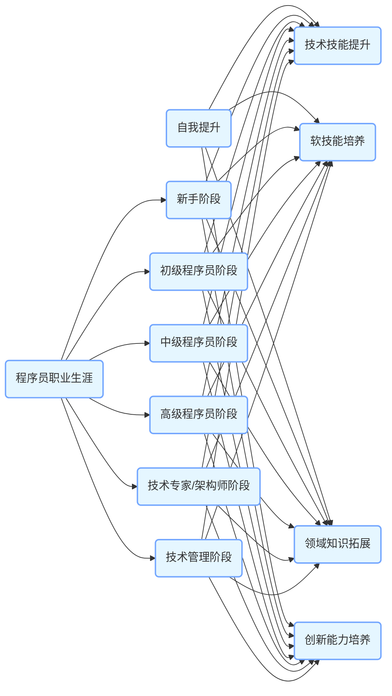

# 程序员的职业生涯与自我提升

> 关键词：程序员、职业生涯、自我提升、技术成长、职业规划

> 摘要：本文旨在全面探讨程序员的职业生涯与自我提升相关问题。首先介绍了程序员职业生涯的背景信息，包括目的、预期读者、文档结构等内容。接着阐述了程序员职业发展中的核心概念及联系，深入剖析了相关算法原理与操作步骤，借助数学模型和公式进一步加深理解。通过项目实战案例展示了实际操作过程及代码分析。详细探讨了程序员职业的实际应用场景，推荐了一系列学习、开发工具和相关论文著作。最后总结了未来发展趋势与挑战，解答常见问题，并提供扩展阅读和参考资料，助力程序员更好地规划职业生涯并实现自我提升。

## 1. 背景介绍 
### 1.1 目的和范围
随着信息技术的飞速发展，程序员作为推动科技进步的重要力量，其职业生涯的发展和自我提升备受关注。本文的目的在于为程序员提供全面、系统的职业生涯规划和自我提升指导，涵盖从初入职场的新手到经验丰富的资深开发者的各个阶段。范围涉及技术技能提升、软技能培养、职业发展路径规划等多个方面，旨在帮助程序员更好地适应行业变化，实现个人价值和职业目标。

### 1.2 预期读者
本文主要面向广大程序员群体，包括在校计算机相关专业的学生、初入职场的新手程序员、有一定工作经验的中级程序员以及寻求职业转型或进一步提升的资深程序员。同时，对于关注软件开发行业的人力资源从业者、技术管理者等也具有一定的参考价值。

### 1.3 文档结构概述
本文将按照以下结构展开：首先介绍背景信息，让读者对文章的目的和范围有清晰的了解；接着阐述核心概念与联系，帮助读者建立起对程序员职业生涯和自我提升的整体认知；然后详细讲解核心算法原理和具体操作步骤，为读者提供实用的方法和技巧；通过数学模型和公式进一步深入分析相关问题；以项目实战案例展示实际应用过程和代码实现；探讨实际应用场景，让读者了解不同领域的需求和挑战；推荐学习、开发工具和相关论文著作，为读者提供丰富的资源；最后总结未来发展趋势与挑战，解答常见问题，并提供扩展阅读和参考资料，方便读者进一步深入学习。

### 1.4 术语表
#### 1.4.1 核心术语定义
- **程序员**：指从事程序开发、维护的专业人员，通过编写代码实现各种软件系统和应用程序的功能。
- **职业生涯**：指一个人在其职业发展过程中所经历的一系列阶段和角色的总和，包括职业选择、职业发展、职业转型等。
- **自我提升**：指个人通过不断学习、实践和反思，提高自身的知识、技能、能力和素质，以实现个人成长和职业发展的过程。
- **技术栈**：指程序员在开发过程中所使用的一系列技术、工具和框架的组合。
- **软技能**：指除专业技术技能之外的其他技能，如沟通能力、团队协作能力、领导力、问题解决能力等。

#### 1.4.2 相关概念解释
- **职业规划**：是个人根据自身的兴趣、能力和职业目标，制定的一系列职业发展计划和策略，旨在帮助个人更好地实现职业目标。
- **技术成长**：指程序员在技术领域不断学习和积累经验，提高自己的技术水平和能力的过程。
- **职业转型**：指程序员在职业生涯中从一个领域或角色转换到另一个领域或角色的过程，通常需要重新学习和适应新的技术和工作环境。

#### 1.4.3 缩略词列表
- **IDE**：Integrated Development Environment，集成开发环境
- **API**：Application Programming Interface，应用程序编程接口
- **AI**：Artificial Intelligence，人工智能
- **ML**：Machine Learning，机器学习
- **DL**：Deep Learning，深度学习

## 2. 核心概念与联系 

### 程序员职业生涯阶段
程序员的职业生涯通常可以分为以下几个阶段：
1. **新手阶段**：刚从学校毕业或刚刚进入编程领域的程序员，主要学习基础知识和基本技能，熟悉开发环境和工具。
2. **初级程序员阶段**：能够独立完成一些简单的任务，对编程语言和开发流程有一定的了解，但在解决复杂问题和优化代码方面还需要进一步提高。
3. **中级程序员阶段**：具备较强的技术能力，能够独立完成复杂的项目任务，对软件设计和架构有一定的理解，能够指导新手程序员。
4. **高级程序员阶段**：在技术领域有深入的研究和丰富的经验，能够解决各种复杂的技术问题，参与软件系统的架构设计和优化，对行业发展趋势有一定的洞察力。
5. **技术专家/架构师阶段**：在特定技术领域具有深厚的专业知识和丰富的实践经验，能够设计和实现复杂的软件系统架构，引领技术团队的发展方向。
6. **技术管理阶段**：除了具备技术能力外，还需要具备管理能力，负责团队的管理、项目的规划和协调，推动技术团队的发展和业务的增长。

### 自我提升的维度
程序员的自我提升主要包括以下几个维度：
1. **技术技能提升**：不断学习和掌握新的编程语言、开发工具、框架和算法，提高自己的编程能力和解决问题的能力。
2. **软技能培养**：注重沟通能力、团队协作能力、领导力、问题解决能力等软技能的培养，提高自己的综合素质和职业竞争力。
3. **领域知识拓展**：了解所在行业的业务知识和发展趋势，将技术与业务相结合，为业务发展提供更有价值的解决方案。
4. **创新能力培养**：培养创新思维和创新能力，能够提出新的想法和解决方案，推动技术和业务的创新发展。

### 核心概念联系示意图

这个示意图展示了程序员职业生涯的不同阶段与自我提升各个维度之间的联系。在职业生涯的每个阶段，都需要不断进行自我提升，包括技术技能提升、软技能培养、领域知识拓展和创新能力培养。而自我提升的各个维度也会反过来促进程序员在职业生涯中的发展，帮助他们顺利过渡到下一个阶段。

## 3. 核心算法原理 & 具体操作步骤 

### 技术技能提升算法原理
技术技能提升可以看作是一个不断学习和实践的过程，类似于机器学习中的迭代优化过程。我们可以将其抽象为以下算法：

```python
# 初始化技能水平
skill_level = 0
# 学习资源列表
learning_resources = ["书籍", "在线课程", "开源项目"]
# 实践项目列表
practice_projects = ["小型项目", "中型项目", "大型项目"]
# 迭代次数
iterations = 10

for i in range(iterations):
    # 选择学习资源
    resource = learning_resources[i % len(learning_resources)]
    # 学习新知识
    new_knowledge = learn(resource)
    # 技能水平提升
    skill_level += new_knowledge
    # 选择实践项目
    project = practice_projects[i % len(practice_projects)]
    # 实践应用新知识
    apply_knowledge(project, new_knowledge)
    # 根据实践反馈调整技能水平
    feedback = get_feedback(project)
    if feedback > 0:
        skill_level += feedback
    else:
        skill_level -= abs(feedback)

    print(f"第 {i+1} 次迭代后技能水平: {skill_level}")

def learn(resource):
    # 模拟学习过程，返回学习到的新知识量
    if resource == "书籍":
        return 10
    elif resource == "在线课程":
        return 15
    elif resource == "开源项目":
        return 20
    else:
        return 0

def apply_knowledge(project, knowledge):
    # 模拟实践应用过程
    print(f"在 {project} 中应用 {knowledge} 知识")

def get_feedback(project):
    # 模拟获取实践反馈
    if project == "小型项目":
        return 5
    elif project == "中型项目":
        return 8
    elif project == "大型项目":
        return 12
    else:
        return 0
```

### 具体操作步骤
1. **确定学习目标**：根据自己的职业规划和发展方向，确定需要学习的技术领域和技能点。
2. **选择学习资源**：根据学习目标，选择适合自己的学习资源，如书籍、在线课程、开源项目等。
3. **制定学习计划**：合理安排学习时间和进度，确保能够系统地学习和掌握新知识。
4. **实践应用**：将学习到的知识应用到实际项目中，通过实践加深对知识的理解和掌握。
5. **获取反馈**：在实践过程中，及时获取反馈，发现问题并进行调整和改进。
6. **持续迭代**：不断重复学习、实践、反馈的过程，持续提升自己的技术技能水平。

### 软技能培养算法原理
软技能培养可以看作是一个社交学习和自我反思的过程。以下是一个简单的软技能培养算法示例：

```python
# 初始化软技能水平
soft_skill_level = 0
# 社交活动列表
social_activities = ["团队会议", "技术分享会", "行业研讨会"]
# 自我反思次数
reflection_times = 5

for i in range(len(social_activities)):
    # 参加社交活动
    activity = social_activities[i]
    experience = participate(activity)
    # 软技能水平提升
    soft_skill_level += experience
    # 进行自我反思
    for j in range(reflection_times):
        improvement = self_reflection(activity)
        soft_skill_level += improvement

    print(f"参加 {activity} 后软技能水平: {soft_skill_level}")

def participate(activity):
    # 模拟参加社交活动的体验，返回获得的软技能提升量
    if activity == "团队会议":
        return 5
    elif activity == "技术分享会":
        return 8
    elif activity == "行业研讨会":
        return 12
    else:
        return 0

def self_reflection(activity):
    # 模拟自我反思过程，返回通过反思获得的软技能提升量
    if activity == "团队会议":
        return 2
    elif activity == "技术分享会":
        return 3
    elif activity == "行业研讨会":
        return 4
    else:
        return 0
```

### 具体操作步骤
1. **明确软技能需求**：根据自己的职业目标和工作环境，明确需要培养的软技能，如沟通能力、团队协作能力、领导力等。
2. **参加社交活动**：积极参加各种社交活动，如团队会议、技术分享会、行业研讨会等，通过与他人的交流和合作，锻炼自己的软技能。
3. **进行自我反思**：在参加社交活动后，及时进行自我反思，总结经验教训，发现自己的不足之处，并制定改进计划。
4. **持续实践和改进**：将改进计划应用到实际工作和生活中，不断实践和改进，逐步提升自己的软技能水平。

## 4. 数学模型和公式 & 详细讲解 & 举例说明 

### 技术技能提升数学模型
我们可以用以下数学模型来描述技术技能提升的过程：

设 $S(t)$ 表示在时间 $t$ 时的技术技能水平，$L(t)$ 表示在时间 $t$ 学习到的新知识量，$P(t)$ 表示在时间 $t$ 实践应用新知识所获得的技能提升量，$F(t)$ 表示在时间 $t$ 实践反馈所导致的技能调整量。则有：

$$S(t + 1) = S(t) + L(t) + P(t) + F(t)$$

其中，$L(t)$ 取决于学习资源的质量和学习效率，$P(t)$ 取决于实践项目的难度和复杂度，$F(t)$ 取决于实践反馈的质量和调整效果。

举例说明：假设初始技术技能水平 $S(0) = 50$，在第一个时间周期内，通过学习一本优质书籍学习到新知识量 $L(0) = 10$，在一个小型项目中实践应用新知识获得技能提升量 $P(0) = 5$，实践反馈导致技能调整量 $F(0) = 2$。则在第一个时间周期结束后，技术技能水平为：

$$S(1) = S(0) + L(0) + P(0) + F(0) = 50 + 10 + 5 + 2 = 67$$

### 软技能培养数学模型
设 $SS(t)$ 表示在时间 $t$ 时的软技能水平，$E(t)$ 表示在时间 $t$ 参加社交活动所获得的软技能提升量，$R(t)$ 表示在时间 $t$ 进行自我反思所获得的软技能提升量。则有：

$$SS(t + 1) = SS(t) + E(t) + \sum_{i = 1}^{n} R_i(t)$$

其中，$n$ 表示自我反思的次数。

举例说明：假设初始软技能水平 $SS(0) = 40$，在第一个时间周期内，参加一次团队会议获得软技能提升量 $E(0) = 5$，进行 3 次自我反思，每次获得软技能提升量分别为 $R_1(0) = 2$，$R_2(0) = 2$，$R_3(0) = 2$。则在第一个时间周期结束后，软技能水平为：

$$SS(1) = SS(0) + E(0) + \sum_{i = 1}^{3} R_i(0) = 40 + 5 + 2 + 2 + 2 = 51$$

## 5. 项目实战：代码实际案例和详细解释说明 

### 5.1  开发环境搭建
假设我们要开发一个简单的 Web 应用程序，使用 Python 的 Flask 框架。以下是开发环境搭建的步骤：

1. **安装 Python**：从 Python 官方网站（https://www.python.org/downloads/）下载并安装 Python 3.x 版本。
2. **创建虚拟环境**：打开命令行工具，进入项目目录，执行以下命令创建虚拟环境：
```bash
python -m venv myenv
```
3. **激活虚拟环境**：在 Windows 系统中，执行以下命令激活虚拟环境：
```bash
myenv\Scripts\activate
```
在 Linux 或 macOS 系统中，执行以下命令激活虚拟环境：
```bash
source myenv/bin/activate
```
4. **安装 Flask**：在激活的虚拟环境中，执行以下命令安装 Flask：
```bash
pip install flask
```

### 5.2  源代码详细实现和代码解读
以下是一个简单的 Flask Web 应用程序的源代码：

```python
from flask import Flask

# 创建 Flask 应用实例
app = Flask(__name__)

# 定义路由和视图函数
@app.route('/')
def index():
    return 'Hello, World!'

# 启动应用程序
if __name__ == '__main__':
    app.run(debug=True)
```

### 代码解读
1. **导入 Flask 模块**：`from flask import Flask` 导入 Flask 类，用于创建 Flask 应用实例。
2. **创建 Flask 应用实例**：`app = Flask(__name__)` 创建一个 Flask 应用实例，`__name__` 是 Python 中的一个内置变量，表示当前模块的名称。
3. **定义路由和视图函数**：`@app.route('/')` 是一个装饰器，用于定义路由，`/` 表示根路径。`def index():` 定义了一个视图函数，当用户访问根路径时，会执行该函数并返回 `Hello, World!` 字符串。
4. **启动应用程序**：`if __name__ == '__main__':` 确保应用程序在直接运行时才会启动。`app.run(debug=True)` 启动 Flask 应用程序，并开启调试模式。

### 5.3  代码解读与分析
这个简单的 Flask Web 应用程序展示了如何使用 Flask 框架创建一个基本的 Web 应用。通过定义路由和视图函数，我们可以处理不同的请求并返回相应的响应。调试模式的开启可以帮助我们在开发过程中及时发现和解决问题。

在实际项目中，我们可以根据需求扩展这个应用，例如添加更多的路由和视图函数，处理不同类型的请求（如 POST 请求），与数据库进行交互等。通过这个项目实战，我们可以加深对 Flask 框架的理解和掌握，提高自己的编程技能。

## 6. 实际应用场景 
### 互联网行业
在互联网行业，程序员的应用场景非常广泛。例如，开发网站、移动应用、电子商务平台等。程序员需要掌握多种技术，如前端开发技术（HTML、CSS、JavaScript）、后端开发技术（Python、Java、Node.js 等）、数据库技术（MySQL、MongoDB 等），以实现各种复杂的业务功能。同时，还需要关注用户体验和性能优化，确保应用程序的稳定性和流畅性。

### 金融行业
金融行业对数据的安全性和准确性要求极高。程序员在金融行业主要负责开发金融交易系统、风险管理系统、数据分析系统等。需要掌握金融业务知识，熟悉相关的金融法规和标准，运用先进的技术手段保障金融系统的安全运行。例如，使用区块链技术实现金融交易的去中心化和不可篡改，使用机器学习算法进行风险评估和预测。

### 医疗行业
在医疗行业，程序员可以开发医疗信息系统、电子病历系统、医学影像处理系统等。这些系统可以提高医疗工作的效率和质量，帮助医生更好地诊断和治疗疾病。同时，程序员还需要关注数据的隐私和安全，确保患者的个人信息不被泄露。例如，使用人工智能技术辅助医学影像诊断，提高诊断的准确性和效率。

### 制造业
制造业中，程序员可以参与智能制造系统的开发，实现生产过程的自动化和智能化。例如，开发工业机器人控制程序、生产调度系统、质量检测系统等。通过物联网技术，将生产设备连接起来，实现数据的实时采集和分析，提高生产效率和产品质量。

## 7. 工具和资源推荐
### 7.1 学习资源推荐
#### 7.1.1 书籍推荐
- 《Python 编程：从入门到实践》：适合初学者学习 Python 编程语言，通过丰富的实例和项目，帮助读者快速掌握 Python 的基础知识和应用。
- 《代码大全》：软件开发的经典著作，涵盖了软件开发的各个方面，包括代码设计、编程实践、测试、调试等，对提高编程水平和软件质量有很大帮助。
- 《Effective Java》：Java 程序员的必读书籍，深入讲解了 Java 语言的特性和编程技巧，帮助读者写出高效、健壮的 Java 代码。

#### 7.1.2 在线课程
- Coursera：提供了众多计算机科学和编程相关的在线课程，由全球知名高校和机构的教授授课，课程质量高。
- edX：与 Coursera 类似，也是一个优秀的在线学习平台，提供丰富的编程课程和专业认证。
- 慕课网：国内知名的在线编程学习平台，提供了大量的实战课程和项目案例，适合不同水平的程序员学习。

#### 7.1.3 技术博客和网站
- 博客园：国内知名的技术博客平台，汇聚了众多程序员的技术分享和经验交流，内容涵盖各种编程语言和技术领域。
- 开源中国：关注开源技术和开源项目，提供最新的开源资讯、技术文章和开源项目推荐。
- Stack Overflow：全球最大的程序员问答社区，当遇到编程问题时，可以在这里找到很多有用的解决方案和建议。

### 7.2 开发工具框架推荐
#### 7.2.1 IDE和编辑器
- PyCharm：专门为 Python 开发设计的集成开发环境，功能强大，提供代码自动补全、调试、版本控制等丰富的功能。
- Visual Studio Code：一款轻量级的代码编辑器，支持多种编程语言，拥有丰富的插件生态系统，可以根据需要进行扩展。
- IntelliJ IDEA：Java 开发的首选 IDE，具有智能代码提示、重构、调试等功能，提高开发效率。

#### 7.2.2 调试和性能分析工具
- GDB：GNU 调试器，可用于调试多种编程语言的程序，帮助开发者定位和解决程序中的错误。
- Profiler：性能分析工具，如 Python 的 cProfile 模块，可以帮助开发者找出程序中的性能瓶颈，进行优化。
- New Relic：一款应用性能管理工具，可实时监控应用程序的性能，提供详细的性能分析报告。

#### 7.2.3 相关框架和库
- Flask：轻量级的 Python Web 框架，易于学习和使用，适合快速开发小型 Web 应用。
- Django：功能强大的 Python Web 框架，提供了丰富的功能和组件，适合开发大型 Web 应用。
- React：用于构建用户界面的 JavaScript 库，具有高效、灵活的特点，广泛应用于前端开发。

### 7.3 相关论文著作推荐
#### 7.3.1 经典论文
- 《MapReduce: Simplified Data Processing on Large Clusters》：介绍了 MapReduce 编程模型，为大规模数据处理提供了一种简单而有效的方法。
- 《The Art of Computer Programming》：计算机科学领域的经典著作，作者是 Donald E. Knuth，涵盖了算法、数据结构、编程语言等多个方面的内容。

#### 7.3.2 最新研究成果
- 关注顶级学术会议和期刊，如 ACM SIGPLAN、IEEE Transactions on Software Engineering 等，及时了解编程语言、软件开发、人工智能等领域的最新研究成果。

#### 7.3.3 应用案例分析
- 阅读一些优秀的开源项目和商业应用的案例分析，了解实际项目中的技术选型、架构设计、开发流程等方面的经验和教训。

## 8. 总结：未来发展趋势与挑战
### 未来发展趋势
1. **人工智能与机器学习的融合**：随着人工智能和机器学习技术的不断发展，程序员需要掌握相关的算法和技术，将其应用到各个领域，实现智能化的软件系统。
2. **云计算和大数据的普及**：云计算和大数据技术为软件开发提供了更强大的计算和存储能力，程序员需要了解相关的技术和平台，开发出高效、可扩展的云应用和大数据处理系统。
3. **物联网的兴起**：物联网将物理世界与数字世界连接起来，程序员需要开发出适用于物联网设备的软件系统，实现设备之间的互联互通和数据交互。
4. **低代码/无代码开发的发展**：低代码/无代码开发平台的出现，降低了软件开发的门槛，使得非专业程序员也能够参与到软件开发中来。程序员需要适应这种变化，掌握相关的平台和工具，提高开发效率。

### 挑战
1. **技术更新换代快**：信息技术领域的技术更新换代非常快，程序员需要不断学习和掌握新的技术，否则很容易被淘汰。
2. **竞争压力大**：随着程序员数量的不断增加，行业竞争也越来越激烈。程序员需要不断提升自己的技术水平和综合素质，才能在竞争中脱颖而出。
3. **安全和隐私问题**：随着软件系统的广泛应用，安全和隐私问题日益突出。程序员需要重视安全和隐私保护，采取有效的措施确保软件系统的安全性和用户数据的隐私。
4. **跨领域知识需求**：未来的软件开发需要涉及多个领域的知识，如金融、医疗、制造等。程序员需要具备跨领域的知识和能力，才能更好地满足不同领域的需求。

## 9. 附录：常见问题与解答
### 1. 如何选择适合自己的技术方向？
答：选择适合自己的技术方向需要考虑以下几个因素：个人兴趣、职业规划、市场需求、行业发展趋势等。可以先了解各个技术方向的特点和应用场景，结合自己的兴趣和优势进行选择。同时，也要关注市场需求和行业发展趋势，选择有发展前景的技术方向。

### 2. 如何平衡工作和学习？
答：平衡工作和学习需要合理安排时间，制定明确的学习计划。可以利用业余时间进行学习，如晚上和周末。同时，也要注重学习效率，选择适合自己的学习方法和资源。在工作中，要善于总结经验，将学习到的知识应用到实际工作中，实现工作和学习的相互促进。

### 3. 如何提高自己的编程能力？
答：提高编程能力需要不断学习和实践。可以通过阅读优秀的代码、参加开源项目、做练习题等方式来提高自己的编程水平。同时，也要注重代码质量和编程规范，养成良好的编程习惯。此外，还可以参加技术交流活动，与其他程序员交流经验和心得，不断拓宽自己的视野。

### 4. 如何进行职业转型？
答：进行职业转型需要做好充分的准备。首先，要明确自己的转型目标和方向，了解目标领域的知识和技能要求。然后，制定学习计划，系统地学习相关的知识和技能。可以通过参加培训课程、在线学习、实践项目等方式来提升自己的能力。在转型过程中，要积极寻找机会，积累相关的工作经验，逐步实现职业转型。

## 10. 扩展阅读 & 参考资料
- 《程序员修炼之道：从小工到专家》
- 《软技能：代码之外的生存指南》
- ACM 官方网站（https://www.acm.org/）
- IEEE 官方网站（https://www.ieee.org/）
- 各大技术社区和论坛，如 GitHub、Reddit 等。

以上就是关于程序员的职业生涯与自我提升的详细内容，希望对广大程序员有所帮助，祝大家在职业生涯中取得更好的发展！