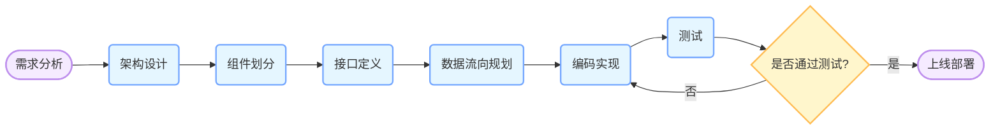

# 程序员职业转型：从编码到架构设计

> 关键词：程序员、职业转型、编码、架构设计、技术成长

> 摘要：在软件开发领域，许多程序员在积累了一定的编码经验后，希望能够实现职业的进一步发展，从单纯的编码工作转向架构设计。本文旨在全面探讨程序员从编码到架构设计的职业转型过程。首先介绍转型的背景，包括目的、预期读者等内容；接着阐述架构设计的核心概念与联系，通过文本示意图和 Mermaid 流程图进行展示；然后详细讲解核心算法原理、数学模型和公式，并结合 Python 代码进行说明；通过项目实战案例展示转型过程中的实际操作；分析架构设计的实际应用场景；推荐相关的工具和资源，助力转型学习；最后总结未来发展趋势与挑战，解答常见问题并提供扩展阅读和参考资料，为有转型需求的程序员提供全面而深入的指导。

## 1. 背景介绍 
### 1.1 目的和范围
程序员从编码到架构设计的职业转型是一个具有重要意义的发展方向。本文的目的在于为广大有转型意愿的程序员提供一份全面、系统且实用的指导手册。范围涵盖了从理解架构设计的基本概念，到掌握相关的核心算法、数学模型，再到通过实际项目案例进行实践，以及了解实际应用场景和获取相关学习资源等多个方面，帮助程序员逐步实现从编码者到架构师的角色转变。

### 1.2 预期读者
本文的预期读者主要是那些已经在编程领域有一定工作经验，熟悉常见编程语言和开发流程，渴望在职业上进一步发展，希望能够承担更具挑战性和战略性工作的程序员。同时，对于对软件架构设计感兴趣的相关专业学生和技术爱好者也具有一定的参考价值。

### 1.3 文档结构概述
本文按照逻辑顺序依次展开。首先介绍背景信息，让读者了解转型的目的和适用对象。接着阐述架构设计的核心概念与联系，为后续的学习打下理论基础。然后深入讲解核心算法原理、数学模型和公式，通过 Python 代码进行具体实现和说明。通过项目实战案例详细展示转型过程中的实际操作和代码解读。分析架构设计的实际应用场景，让读者了解其在不同领域的作用。推荐相关的工具和资源，帮助读者更好地进行学习和实践。最后总结未来发展趋势与挑战，解答常见问题并提供扩展阅读和参考资料，为读者提供一个完整的学习和转型指导体系。

### 1.4 术语表
#### 1.4.1 核心术语定义
- **程序员**：从事程序开发、维护的专业人员，主要负责编写代码来实现具体的软件功能。
- **架构设计**：对软件系统的整体结构、组件关系、数据流向等进行规划和设计的过程，旨在确保软件系统具有良好的性能、可扩展性、可维护性等特性。
- **架构师**：负责软件架构设计的专业人员，需要具备深厚的技术背景、丰富的项目经验和良好的系统思维能力。
- **编码**：使用编程语言将需求转化为计算机可以执行的代码的过程。

#### 1.4.2 相关概念解释
- **软件系统**：由多个软件组件和硬件资源组成的、能够完成特定功能的整体。
- **组件**：软件系统中具有独立功能的部分，可以是一个模块、一个服务或一个子系统。
- **可扩展性**：软件系统能够方便地添加新功能、处理更大规模数据或用户量的能力。
- **可维护性**：软件系统易于理解、修改和扩展的特性，以便在后续的开发和维护过程中降低成本和风险。

#### 1.4.3 缩略词列表
- **API**：Application Programming Interface，应用程序编程接口，用于不同软件组件之间的交互。
- **MVC**：Model-View-Controller，模型 - 视图 - 控制器，一种常见的软件架构模式。
- **SOA**：Service-Oriented Architecture，面向服务的架构，将软件系统划分为多个服务进行开发和管理。

## 2. 核心概念与联系 
### 2.1 架构设计的核心概念
架构设计是软件系统开发过程中的关键环节，它决定了软件系统的整体框架和结构。架构设计需要考虑多个方面的因素，包括系统的功能需求、性能要求、可扩展性、可维护性等。一个好的架构设计能够提高软件系统的开发效率、降低开发成本、提高系统的质量和可靠性。

架构设计的核心要素包括：
- **组件**：组件是软件系统中具有独立功能的部分，可以是一个模块、一个服务或一个子系统。组件之间通过接口进行交互，实现系统的整体功能。
- **接口**：接口定义了组件之间的交互方式和协议，是组件之间进行通信的桥梁。接口的设计需要遵循一定的规范和标准，以确保组件之间的兼容性和互操作性。
- **数据流向**：数据流向描述了数据在系统中的流动过程，包括数据的输入、处理和输出。合理的数据流向设计能够提高系统的性能和效率。
- **架构模式**：架构模式是一种通用的架构设计方案，用于解决特定类型的软件系统问题。常见的架构模式包括 MVC、SOA、微服务架构等。

### 2.2 编码与架构设计的联系
编码是实现架构设计的具体手段，而架构设计则为编码提供了指导和框架。在软件开发过程中，架构设计先于编码进行，架构师根据系统的需求和目标，设计出系统的整体架构，包括组件的划分、接口的定义、数据流向的规划等。程序员则根据架构设计的要求，使用具体的编程语言和开发工具，实现各个组件的功能。

编码和架构设计是相辅相成的关系。一个好的架构设计能够使编码工作更加高效和有序，提高代码的质量和可维护性；而优秀的编码实现也能够体现架构设计的思想和价值，确保系统的性能和功能达到预期目标。

### 2.3 文本示意图
以下是一个简单的软件架构设计的文本示意图：

```plaintext
+----------------------+
| 软件系统             |
+----------------------+
| 组件 1               |
|  - 功能 1            |
|  - 接口 1            |
| 组件 2               |
|  - 功能 2            |
|  - 接口 2            |
| 数据存储             |
|  - 数据库 1          |
|  - 数据库 2          |
+----------------------+
| 外部系统             |
|  - 系统 A            |
|  - 系统 B            |
+----------------------+
```

### 2.4 Mermaid 流程图


## 3. 核心算法原理 & 具体操作步骤 
### 3.1 核心算法原理
在架构设计中，涉及到多种核心算法，例如负载均衡算法、缓存算法、分布式系统中的一致性算法等。这里以负载均衡算法中的轮询算法为例进行讲解。

轮询算法是一种简单而常用的负载均衡算法，其基本思想是按照顺序依次将请求分配到各个服务器上，当所有服务器都分配过一次后，再从头开始分配。这种算法的优点是实现简单，能够均匀地分配请求；缺点是没有考虑服务器的实际负载情况，可能会导致某些服务器负载过高，而某些服务器负载过低。

### 3.2 Python 代码实现
```python
class RoundRobinLoadBalancer:
    def __init__(self, servers):
        self.servers = servers
        self.index = 0

    def get_server(self):
        server = self.servers[self.index]
        self.index = (self.index + 1) % len(self.servers)
        return server

# 示例使用
servers = ["server1", "server2", "server3"]
lb = RoundRobinLoadBalancer(servers)

# 模拟 5 次请求
for _ in range(5):
    print(lb.get_server())
```

### 3.3 具体操作步骤
1. **定义服务器列表**：首先需要定义一个包含所有服务器信息的列表。
2. **初始化负载均衡器**：创建一个 `RoundRobinLoadBalancer` 类的实例，并将服务器列表作为参数传入。
3. **处理请求**：在处理每个请求时，调用 `get_server` 方法获取要分配的服务器。
4. **更新索引**：每次分配服务器后，更新索引，以便下一次请求分配到下一个服务器。

## 4. 数学模型和公式 & 详细讲解 & 举例说明 
### 4.1 数学模型
轮询算法的数学模型可以用以下公式表示：

设服务器列表为 $S = \{s_1, s_2, \cdots, s_n\}$，其中 $n$ 为服务器的数量。当前请求的索引为 $i$，初始值为 $0$。每次处理请求后，索引更新为：

$$i = (i + 1) \bmod n$$

其中 $\bmod$ 表示取模运算。

### 4.2 详细讲解
这个公式的含义是，当处理一个请求时，首先根据当前索引 $i$ 从服务器列表 $S$ 中选择一个服务器 $s_i$ 进行请求分配。然后将索引 $i$ 加 $1$，并对服务器数量 $n$ 取模，得到下一次请求的索引。这样就可以实现依次循环分配请求的功能。

### 4.3 举例说明
假设服务器列表为 $S = \{s_1, s_2, s_3\}$，即有 3 个服务器。初始索引 $i = 0$。

- 第一次请求：$i = 0$，选择服务器 $s_0$。
- 第二次请求：$i = (0 + 1) \bmod 3 = 1$，选择服务器 $s_1$。
- 第三次请求：$i = (1 + 1) \bmod 3 = 2$，选择服务器 $s_2$。
- 第四次请求：$i = (2 + 1) \bmod 3 = 0$，选择服务器 $s_0$。
- 第五次请求：$i = (0 + 1) \bmod 3 = 1$，选择服务器 $s_1$。

以此类推，不断循环分配请求。

## 5. 项目实战：代码实际案例和详细解释说明 
### 5.1 开发环境搭建
#### 5.1.1 操作系统
选择适合开发的操作系统，如 Windows、Linux 或 macOS。这里以 Ubuntu 18.04 为例进行说明。

#### 5.1.2 编程语言和开发工具
选择 Python 作为开发语言，版本为 3.7 及以上。安装 Python 开发环境：
```bash
sudo apt update
sudo apt install python3 python3-pip
```

安装代码编辑器，如 Visual Studio Code 或 PyCharm。以 Visual Studio Code 为例，可从官网下载安装包进行安装。

#### 5.1.3 相关库和框架
安装 Flask 框架，用于快速搭建 Web 应用：
```bash
pip3 install flask
```

### 5.2 源代码详细实现和代码解读
#### 5.2.1 项目需求
实现一个简单的 Web 应用，使用轮询算法进行负载均衡，将请求分配到多个后端服务器上。

#### 5.2.2 代码实现
```python
from flask import Flask
import requests

# 后端服务器列表
servers = ["http://server1.example.com", "http://server2.example.com", "http://server3.example.com"]
index = 0

app = Flask(__name__)

@app.route('/')
def load_balancer():
    global index
    server = servers[index]
    index = (index + 1) % len(servers)

    try:
        response = requests.get(server)
        return response.text
    except Exception as e:
        return f"Error: {str(e)}"

if __name__ == '__main__':
    app.run(debug=True)
```

#### 5.2.3 代码解读
1. **导入必要的库**：导入 `Flask` 库用于创建 Web 应用，导入 `requests` 库用于发送 HTTP 请求。
2. **定义后端服务器列表**：定义一个包含多个后端服务器地址的列表。
3. **初始化索引**：初始化索引变量 `index`，用于记录当前要分配的服务器的索引。
4. **创建 Flask 应用**：创建一个 `Flask` 应用实例。
5. **定义路由**：定义一个根路由 `/`，当客户端访问该路由时，执行 `load_balancer` 函数。
6. **负载均衡逻辑**：在 `load_balancer` 函数中，根据当前索引选择一个后端服务器，更新索引，然后使用 `requests` 库向该服务器发送 HTTP 请求，并返回响应内容。
7. **异常处理**：如果请求过程中出现异常，捕获异常并返回错误信息。
8. **运行应用**：使用 `app.run` 方法启动 Flask 应用。

### 5.3 代码解读与分析
#### 5.3.1 优点
- **实现简单**：轮询算法的实现非常简单，只需要维护一个索引变量，每次请求时更新索引即可。
- **均匀分配**：能够均匀地将请求分配到各个后端服务器上，避免某个服务器负载过高。

#### 5.3.2 缺点
- **不考虑服务器负载**：轮询算法没有考虑服务器的实际负载情况，可能会导致某些服务器负载过高，而某些服务器负载过低。
- **缺乏容错机制**：当某个后端服务器出现故障时，轮询算法仍然会将请求分配到该服务器上，导致请求失败。

#### 5.3.3 改进建议
- **动态负载均衡**：可以结合服务器的实际负载情况，如 CPU 使用率、内存使用率等，动态调整请求的分配策略。
- **容错机制**：增加容错机制，当某个后端服务器出现故障时，自动将请求分配到其他正常的服务器上。

## 6. 实际应用场景 
### 6.1 Web 应用
在 Web 应用中，架构设计起着至关重要的作用。随着用户数量的增加和业务功能的不断扩展，需要设计一个高效、可扩展的架构来支持应用的运行。例如，采用微服务架构可以将一个大型的 Web 应用拆分成多个小型的、独立的服务，每个服务可以独立开发、部署和扩展，提高开发效率和系统的可维护性。同时，使用负载均衡算法可以将用户请求均匀地分配到多个服务器上，提高系统的性能和可用性。

### 6.2 大数据处理
在大数据处理领域，架构设计需要考虑数据的存储、处理和分析等多个方面。例如，采用分布式文件系统（如 Hadoop Distributed File System，HDFS）可以实现大数据的分布式存储，提高数据的可靠性和可扩展性。使用分布式计算框架（如 Apache Spark）可以实现大数据的并行处理，提高数据处理的效率。同时，架构设计还需要考虑数据的安全性和隐私保护等问题。

### 6.3 人工智能应用
在人工智能应用中，架构设计需要考虑模型的训练、推理和部署等多个环节。例如，采用深度学习框架（如 TensorFlow、PyTorch）可以实现人工智能模型的训练和推理。使用分布式训练技术可以加速模型的训练过程。同时，架构设计还需要考虑模型的部署和优化，以提高模型的性能和效率。

### 6.4 企业级应用
在企业级应用中，架构设计需要考虑企业的业务流程、数据管理和安全等多个方面。例如，采用面向服务的架构（SOA）可以将企业的业务功能封装成多个服务，实现服务的复用和集成。使用企业服务总线（ESB）可以实现服务之间的通信和协调。同时，架构设计还需要考虑数据的一致性和安全性，以确保企业数据的可靠性和保密性。

## 7. 工具和资源推荐
### 7.1 学习资源推荐
#### 7.1.1 书籍推荐
- 《软件架构设计：大型网站技术架构与业务架构融合之道》：本书详细介绍了软件架构设计的相关知识和实践经验，结合大型网站的案例，讲解了技术架构和业务架构的融合方法。
- 《架构探险：从零开始写分布式服务框架》：通过实际项目案例，带领读者从零开始实现一个分布式服务框架，深入讲解了分布式系统的架构设计和实现原理。
- 《深入理解计算机系统》：虽然不是专门的架构设计书籍，但它提供了计算机系统的底层原理和基础知识，对于理解架构设计的原理和实现有很大的帮助。

#### 7.1.2 在线课程
- Coursera 上的“Software Architecture and Design”课程：由知名教授授课，系统地讲解了软件架构设计的理论和实践知识。
- edX 上的“Distributed Systems”课程：介绍了分布式系统的架构设计和实现技术，包括分布式算法、分布式存储等内容。
- 慕课网上的“软件架构设计实战”课程：结合实际项目案例，讲解了软件架构设计的方法和技巧。

#### 7.1.3 技术博客和网站
- InfoQ：提供了丰富的技术文章和资讯，涵盖了软件架构设计、分布式系统、大数据等多个领域。
- 开源中国：关注开源技术和软件架构设计，有很多技术文章和案例分享。
- 架构师之路：专注于软件架构设计领域，提供了很多架构设计的实践经验和技术分享。

### 7.2 开发工具框架推荐
#### 7.2.1 IDE和编辑器
- Visual Studio Code：一款轻量级的代码编辑器，支持多种编程语言和开发框架，具有丰富的插件生态系统。
- PyCharm：专门为 Python 开发设计的集成开发环境，提供了代码编辑、调试、测试等多种功能。
- IntelliJ IDEA：一款功能强大的 Java 集成开发环境，也支持其他编程语言和开发框架。

#### 7.2.2 调试和性能分析工具
- GDB：一款强大的调试工具，支持多种编程语言，可用于调试程序的运行过程。
- VisualVM：一款可视化的性能分析工具，可用于分析 Java 应用的性能瓶颈和内存泄漏问题。
- New Relic：一款应用性能管理工具，可用于监控和分析 Web 应用的性能和可用性。

#### 7.2.3 相关框架和库
- Flask：一个轻量级的 Python Web 框架，适合快速搭建 Web 应用。
- Django：一个功能强大的 Python Web 框架，提供了丰富的功能和工具，适合开发大型 Web 应用。
- Spring Boot：一个用于快速开发 Java Web 应用的框架，简化了 Spring 框架的配置和开发过程。

### 7.3 相关论文著作推荐
#### 7.3.1 经典论文
- “A Note on Distributed Computing” by Leslie Lamport：这篇论文介绍了分布式系统中的基本概念和问题，对分布式系统的发展产生了深远的影响。
- “The CAP Theorem” by Eric Brewer：阐述了分布式系统中一致性（Consistency）、可用性（Availability）和分区容错性（Partition tolerance）之间的关系，即 CAP 定理。
- “MapReduce: Simplified Data Processing on Large Clusters” by Jeffrey Dean and Sanjay Ghemawat：介绍了 MapReduce 编程模型，为大数据处理提供了一种简单而高效的方法。

#### 7.3.2 最新研究成果
- 关注顶级学术会议（如 ACM SIGOPS、ACM SIGMOD、IEEE INFOCOM 等）上的最新研究论文，了解软件架构设计领域的最新技术和研究成果。
- 关注知名学术期刊（如 ACM Transactions on Software Engineering and Methodology、IEEE Transactions on Software Engineering 等）上的相关研究论文。

#### 7.3.3 应用案例分析
- 阅读大型互联网公司（如 Google、Amazon、Facebook 等）的技术博客和公开论文，了解他们在软件架构设计方面的实践经验和应用案例。
- 分析开源项目（如 Apache Hadoop、Apache Spark、Kubernetes 等）的架构设计和实现原理，学习优秀的架构设计思路和方法。

## 8. 总结：未来发展趋势与挑战
### 8.1 未来发展趋势
#### 8.1.1 云原生架构
随着云计算技术的发展，云原生架构将成为未来软件架构设计的主流趋势。云原生架构包括容器化、微服务、DevOps 等技术，能够实现软件的快速部署、弹性伸缩和高效运维。

#### 8.1.2 人工智能与架构融合
人工智能技术的应用越来越广泛，将人工智能与软件架构设计相结合，能够实现智能化的架构决策和优化。例如，使用机器学习算法自动调整负载均衡策略，提高系统的性能和效率。

#### 8.1.3 区块链架构
区块链技术具有去中心化、不可篡改、安全可靠等特点，将区块链架构应用于软件系统中，能够实现数据的安全共享和可信交互。例如，在金融、医疗等领域，区块链架构可以解决数据隐私和信任问题。

#### 8.1.4 边缘计算架构
随着物联网设备的不断增加，边缘计算架构将成为未来的重要发展方向。边缘计算将计算和数据存储靠近数据源，减少数据传输延迟，提高系统的响应速度和性能。

### 8.2 挑战
#### 8.2.1 技术复杂性
随着软件系统的不断发展和演进，架构设计的技术复杂性也在不断增加。架构师需要掌握多种技术和工具，了解不同领域的业务需求，才能设计出高效、可扩展、安全可靠的架构。

#### 8.2.2 人才短缺
目前，软件架构设计领域的专业人才相对短缺。培养一名优秀的架构师需要长期的实践经验和技术积累，因此如何吸引和培养更多的架构设计人才是一个亟待解决的问题。

#### 8.2.3 安全和隐私问题
随着信息技术的发展，安全和隐私问题越来越受到关注。在架构设计中，需要考虑如何保护用户数据的安全和隐私，防止数据泄露和攻击。

#### 8.2.4 兼容性和互操作性
在现代软件系统中，不同的组件和系统之间需要进行交互和集成。因此，架构设计需要考虑兼容性和互操作性问题，确保不同的组件和系统能够协同工作。

## 9. 附录：常见问题与解答
### 9.1 转型过程中需要具备哪些技能？
转型过程中需要具备以下技能：
- **技术基础**：掌握多种编程语言和开发框架，了解计算机系统的底层原理和基础知识。
- **架构设计知识**：熟悉常见的架构模式和设计原则，如 MVC、SOA、微服务架构等。
- **系统思维能力**：能够从整体上考虑软件系统的结构和性能，解决复杂的系统问题。
- **沟通和协作能力**：与不同团队和角色进行有效的沟通和协作，确保架构设计能够满足业务需求。

### 9.2 如何积累架构设计经验？
可以通过以下方式积累架构设计经验：
- **参与实际项目**：在实际项目中承担架构设计的任务，通过实践不断积累经验。
- **阅读优秀的架构设计案例**：学习大型互联网公司和开源项目的架构设计思路和方法。
- **参加技术交流活动**：与其他架构师和技术专家交流经验，了解最新的技术动态和发展趋势。

### 9.3 转型过程中可能会遇到哪些困难？
转型过程中可能会遇到以下困难：
- **技术难题**：架构设计涉及到多种技术和领域，可能会遇到一些技术难题需要解决。
- **思维转变**：从编码思维转变为架构设计思维需要一定的时间和过程，需要不断学习和实践。
- **团队协作问题**：架构设计需要与不同团队和角色进行协作，可能会遇到沟通不畅、协作困难等问题。

### 9.4 如何衡量架构设计的好坏？
可以从以下几个方面衡量架构设计的好坏：
- **性能**：系统的响应速度、吞吐量等性能指标是否满足业务需求。
- **可扩展性**：系统是否能够方便地添加新功能、处理更大规模的数据或用户量。
- **可维护性**：系统是否易于理解、修改和扩展，降低后续的维护成本和风险。
- **安全性**：系统是否能够保护用户数据的安全和隐私，防止数据泄露和攻击。

## 10. 扩展阅读 & 参考资料
### 10.1 扩展阅读
- 《设计模式：可复用面向对象软件的基础》：介绍了常见的设计模式，对于提高软件的可维护性和可扩展性有很大的帮助。
- 《重构：改善既有代码的设计》：讲解了如何对现有代码进行重构，提高代码的质量和可维护性。
- 《领域驱动设计：软件核心复杂性应对之道》：介绍了领域驱动设计的方法和实践，帮助开发人员更好地理解业务需求，设计出高质量的软件架构。

### 10.2 参考资料
- 各编程语言和开发框架的官方文档，如 Python 官方文档、Flask 官方文档、Spring Boot 官方文档等。
- 相关技术标准和规范，如 ISO/IEC 42010 软件架构描述标准。
- 互联网上的技术文章和博客，如 Medium 上的技术文章、Stack Overflow 上的技术问答等。