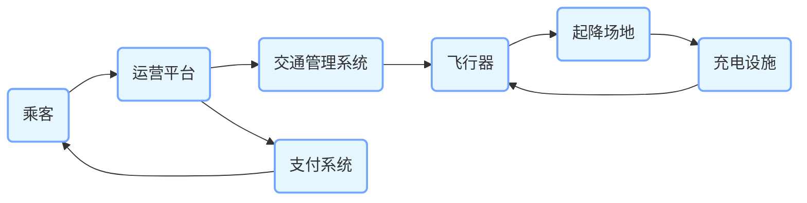

# 空中出租车服务的发展前景与投资机会

> 关键词：空中出租车、发展前景、投资机会、城市空中交通、电动垂直起降飞行器、共享出行

> 摘要：本文旨在全面剖析空中出租车服务的发展前景与投资机会。随着城市化进程的加速和交通拥堵问题的日益严重，空中出租车作为一种新兴的交通方式正逐渐崭露头角。文章首先介绍了空中出租车服务的背景，包括其目的、预期读者等内容。接着阐述了核心概念与联系，详细讲解了相关的技术原理和架构。通过核心算法原理及具体操作步骤的分析，展示了其技术实现的逻辑。从数学模型和公式的角度，深入探究了其运行的内在规律。通过项目实战案例，展示了空中出租车服务在实际开发中的实现过程。探讨了其实际应用场景，分析了其在不同领域的潜在价值。推荐了相关的工具和资源，为从业者和投资者提供学习和研究的方向。最后总结了未来发展趋势与挑战，以及常见问题与解答，为关注空中出租车服务的各方提供全面而深入的参考。

## 1. 背景介绍 
### 1.1 目的和范围
空中出租车服务作为一种创新的交通模式，其目的在于缓解城市地面交通拥堵，提供更高效、快捷的出行选择。本文章的范围涵盖了空中出租车服务的技术原理、发展现状、市场前景、投资机会等多个方面，旨在为读者全面呈现空中出租车服务的全貌，帮助读者深入了解这一新兴领域的发展趋势和潜在价值。

### 1.2 预期读者
本文预期读者包括对交通领域创新发展感兴趣的研究人员、投资者、交通行业从业者、政策制定者以及关注未来出行方式的普通大众。希望通过本文的介绍，能够为不同背景的读者提供有价值的信息和思考方向。

### 1.3 文档结构概述
本文将按照以下结构进行阐述：首先介绍空中出租车服务的背景信息，包括目的、预期读者和文档结构概述等内容。接着深入探讨其核心概念与联系，包括技术原理和架构。然后详细讲解核心算法原理及具体操作步骤，通过数学模型和公式进一步剖析其运行机制。通过项目实战案例，展示其在实际开发中的实现过程。分析其实际应用场景，探讨其潜在价值。推荐相关的工具和资源，为读者提供学习和研究的方向。最后总结未来发展趋势与挑战，解答常见问题，并提供扩展阅读和参考资料。

### 1.4 术语表
#### 1.4.1 核心术语定义
- **空中出租车（Air Taxi）**：一种提供短途客运服务的飞行器，通常采用电动垂直起降（eVTOL）技术，可在城市或区域内快速运输乘客。
- **电动垂直起降飞行器（eVTOL）**：利用电力驱动的、能够垂直起飞和降落的飞行器，具有噪音低、能耗小等特点。
- **城市空中交通（UAM）**：指在城市及其周边区域内，利用飞行器提供的空中运输服务，包括空中出租车、货运无人机等多种应用。
- **共享出行（Shared Mobility）**：一种通过共享交通工具来提高资源利用率的出行模式，空中出租车服务可作为共享出行的一种新形式。

#### 1.4.2 相关概念解释
- **飞行管理系统（FMS）**：用于管理飞行器的飞行计划、导航、飞行控制等功能的系统，确保飞行器的安全、高效飞行。
- **交通管理系统（UTM）**：针对城市空中交通的管理系统，负责协调飞行器的飞行路径、避免碰撞等任务，保障空中交通的有序运行。
- **电池技术**：空中出租车通常采用电池作为动力源，电池的能量密度、充电速度等性能指标对其飞行性能和运营效率具有重要影响。

#### 1.4.3 缩略词列表
- **eVTOL**：电动垂直起降（Electric Vertical Takeoff and Landing）
- **UAM**：城市空中交通（Urban Air Mobility）
- **FMS**：飞行管理系统（Flight Management System）
- **UTM**：交通管理系统（Unmanned Traffic Management）

## 2. 核心概念与联系 
空中出租车服务的核心概念主要围绕电动垂直起降飞行器、城市空中交通管理系统和共享出行模式展开。

### 核心概念原理和架构的文本示意图
空中出租车服务的架构主要包括飞行器、地面基础设施、交通管理系统和运营平台四个部分。飞行器是提供运输服务的载体，采用电动垂直起降技术，能够在城市中灵活起降。地面基础设施包括起降场地、充电设施等，为飞行器的运行提供支持。交通管理系统负责管理空中交通，确保飞行器的安全飞行。运营平台则负责乘客的预订、调度等服务，实现共享出行的模式。

### Mermaid 流程图


在这个流程图中，乘客通过运营平台进行预订服务，运营平台将请求发送给交通管理系统，交通管理系统调度飞行器前往指定的起降场地接载乘客。飞行器在飞行过程中遵循交通管理系统的指令，确保安全飞行。起降场地和充电设施为飞行器提供支持，保障其持续运行。支付系统则完成乘客的费用支付。

## 3. 核心算法原理 & 具体操作步骤 
### 飞行器路径规划算法原理
飞行器路径规划是空中出租车服务中的关键环节，其目的是在满足安全、效率等约束条件下，为飞行器规划最优的飞行路径。这里我们采用 A* 算法来实现飞行器的路径规划。

A* 算法是一种启发式搜索算法，通过综合考虑起点到当前节点的实际代价 $g(n)$ 和当前节点到目标节点的估计代价 $h(n)$ 来选择最优路径。其代价函数为：

$f(n) = g(n) + h(n)$

其中，$f(n)$ 表示从起点经过节点 $n$ 到目标节点的总估计代价，$g(n)$ 表示从起点到节点 $n$ 的实际代价，$h(n)$ 表示从节点 $n$ 到目标节点的估计代价。

### Python 源代码实现
```python
import heapq

# 定义节点类
class Node:
    def __init__(self, position, g=0, h=0, parent=None):
        self.position = position
        self.g = g
        self.h = h
        self.f = g + h
        self.parent = parent

    def __lt__(self, other):
        return self.f < other.f

# 定义 A* 算法
def a_star(start, goal, obstacles):
    open_list = []
    closed_set = set()

    start_node = Node(start)
    goal_node = Node(goal)

    heapq.heappush(open_list, start_node)

    while open_list:
        current_node = heapq.heappop(open_list)

        if current_node.position == goal_node.position:
            path = []
            while current_node:
                path.append(current_node.position)
                current_node = current_node.parent
            return path[::-1]

        closed_set.add(current_node.position)

        # 定义相邻节点的偏移量
        neighbors = [(0, 1), (0, -1), (1, 0), (-1, 0)]

        for neighbor_offset in neighbors:
            neighbor_position = (current_node.position[0] + neighbor_offset[0], current_node.position[1] + neighbor_offset[1])

            if neighbor_position in obstacles or neighbor_position in closed_set:
                continue

            tentative_g = current_node.g + 1
            neighbor_node = Node(neighbor_position, tentative_g, heuristic(neighbor_position, goal), current_node)

            # 检查邻居节点是否已经在开放列表中
            found = False
            for index, node in enumerate(open_list):
                if node.position == neighbor_position:
                    if tentative_g < node.g:
                        open_list[index] = neighbor_node
                        heapq.heapify(open_list)
                    found = True
                    break

            if not found:
                heapq.heappush(open_list, neighbor_node)

    return None

# 定义启发式函数
def heuristic(position, goal):
    return abs(position[0] - goal[0]) + abs(position[1] - goal[1])

# 示例使用
start = (0, 0)
goal = (5, 5)
obstacles = [(2, 2), (3, 3)]

path = a_star(start, goal, obstacles)
print("规划路径:", path)
```
### 具体操作步骤
1. **初始化**：将起点节点加入开放列表，初始化关闭列表为空。
2. **选择节点**：从开放列表中选择 $f(n)$ 值最小的节点作为当前节点。
3. **判断终止条件**：如果当前节点是目标节点，则路径规划完成，回溯生成路径。
4. **扩展节点**：生成当前节点的相邻节点，计算其 $g(n)$、$h(n)$ 和 $f(n)$ 值。
5. **更新开放列表**：将未在开放列表和关闭列表中的相邻节点加入开放列表，更新已在开放列表中且 $g(n)$ 值更小的节点。
6. **更新关闭列表**：将当前节点加入关闭列表。
7. **重复步骤 2 - 6**，直到开放列表为空或找到目标节点。

## 4. 数学模型和公式 & 详细讲解 & 举例说明 
### 飞行器动力学模型
飞行器的动力学模型描述了其在飞行过程中的运动规律，通常可以用牛顿第二定律来表示。对于一个在三维空间中运动的飞行器，其动力学方程可以表示为：

$$
\begin{cases}
m\ddot{x} = F_x \\
m\ddot{y} = F_y \\
m\ddot{z} = F_z - mg
\end{cases}
$$

其中，$m$ 是飞行器的质量，$x$、$y$、$z$ 分别是飞行器在三个坐标轴上的位置，$\ddot{x}$、$\ddot{y}$、$\ddot{z}$ 分别是飞行器在三个坐标轴上的加速度，$F_x$、$F_y$、$F_z$ 分别是飞行器在三个坐标轴上受到的外力，$g$ 是重力加速度。

### 详细讲解
上述动力学方程描述了飞行器在三个坐标轴上的受力与加速度之间的关系。在实际应用中，飞行器受到的外力包括升力、推力、阻力等。升力是由飞行器的机翼或螺旋桨产生的，用于克服重力；推力是由发动机产生的，用于推动飞行器前进；阻力是由空气阻力产生的，阻碍飞行器的运动。

### 举例说明
假设一个质量为 $m = 1000$ kg 的飞行器，在水平方向上受到的推力为 $F_x = 5000$ N，在垂直方向上受到的升力为 $F_z = 10000$ N，重力加速度 $g = 9.8$ m/s²。则根据动力学方程可以计算出飞行器在水平方向上的加速度为：

$$
\ddot{x} = \frac{F_x}{m} = \frac{5000}{1000} = 5 \text{ m/s}^2
$$

在垂直方向上的加速度为：

$$
\ddot{z} = \frac{F_z - mg}{m} = \frac{10000 - 1000 \times 9.8}{1000} = 0.2 \text{ m/s}^2
$$

这表明飞行器在水平方向上有一个 $5$ m/s² 的加速度，在垂直方向上有一个 $0.2$ m/s² 的加速度。

### 电池能量模型
空中出租车通常采用电池作为动力源，电池的能量模型描述了电池的能量存储和消耗情况。电池的能量消耗可以表示为：

$$
E_{consumed} = P \times t
$$

其中，$E_{consumed}$ 是电池消耗的能量，$P$ 是飞行器的功率，$t$ 是飞行时间。

电池的剩余能量可以表示为：

$$
E_{remaining} = E_{initial} - E_{consumed}
$$

其中，$E_{initial}$ 是电池的初始能量。

### 详细讲解
电池能量模型描述了电池的能量在飞行过程中的变化情况。飞行器的功率取决于其飞行状态，如起飞、巡航、降落等。在起飞阶段，飞行器需要较大的功率来克服重力；在巡航阶段，飞行器的功率相对较小；在降落阶段，飞行器的功率也会有所变化。

### 举例说明
假设一个电池的初始能量为 $E_{initial} = 100$ kWh，飞行器的功率为 $P = 50$ kW，飞行时间为 $t = 1$ h。则电池消耗的能量为：

$$
E_{consumed} = P \times t = 50 \times 1 = 50 \text{ kWh}
$$

电池的剩余能量为：

$$
E_{remaining} = E_{initial} - E_{consumed} = 100 - 50 = 50 \text{ kWh}
$$

这表明经过 $1$ h 的飞行，电池的剩余能量为 $50$ kWh。

## 5. 项目实战：代码实际案例和详细解释说明 
### 5.1  开发环境搭建
#### 硬件环境
- **计算机**：推荐使用配置较高的笔记本电脑或台式机，如 Intel Core i7 及以上处理器，16GB 及以上内存。
- **开发板**：如果需要进行飞行器的硬件开发，可以选择合适的开发板，如 Raspberry Pi、Arduino 等。

#### 软件环境
- **操作系统**：推荐使用 Linux 或 macOS 操作系统，也可以使用 Windows 操作系统。
- **编程语言**：Python，版本 3.6 及以上。
- **开发工具**：推荐使用 PyCharm 作为 Python 开发工具，也可以使用 Visual Studio Code 等。
- **相关库**：安装 `numpy`、`matplotlib` 等库，用于数值计算和数据可视化。

### 5.2  源代码详细实现和代码解读
#### 飞行器模拟类
```python
import numpy as np

class Aircraft:
    def __init__(self, mass, initial_position, initial_velocity):
        self.mass = mass
        self.position = np.array(initial_position, dtype=float)
        self.velocity = np.array(initial_velocity, dtype=float)
        self.acceleration = np.zeros(3)

    def update(self, forces, dt):
        # 计算加速度
        self.acceleration = np.array(forces) / self.mass
        # 更新速度
        self.velocity += self.acceleration * dt
        # 更新位置
        self.position += self.velocity * dt

    def get_position(self):
        return self.position

    def get_velocity(self):
        return self.velocity
```
#### 代码解读
- `__init__` 方法：初始化飞行器的质量、初始位置和初始速度。
- `update` 方法：根据受力情况更新飞行器的加速度、速度和位置。
- `get_position` 方法：返回飞行器的当前位置。
- `get_velocity` 方法：返回飞行器的当前速度。

#### 主程序
```python
# 初始化飞行器
aircraft = Aircraft(mass=1000, initial_position=[0, 0, 0], initial_velocity=[0, 0, 0])

# 定义受力情况
forces = [5000, 0, 10000 - 1000 * 9.8]  # 水平推力 5000 N，垂直升力 10000 N

# 模拟时间步长
dt = 0.1

# 模拟飞行 10 秒
for _ in range(int(10 / dt)):
    aircraft.update(forces, dt)

# 输出最终位置和速度
print("最终位置:", aircraft.get_position())
print("最终速度:", aircraft.get_velocity())
```
#### 代码解读
- 首先初始化一个飞行器对象，设置其质量、初始位置和初始速度。
- 定义飞行器受到的外力，包括水平推力和垂直升力。
- 设置模拟时间步长为 $0.1$ s。
- 进行 $10$ s 的飞行模拟，每次更新飞行器的状态。
- 最后输出飞行器的最终位置和速度。

### 5.3  代码解读与分析
通过上述代码，我们实现了一个简单的飞行器模拟程序。该程序通过更新飞行器的加速度、速度和位置，模拟了飞行器在受力情况下的运动过程。在实际应用中，我们可以根据需要扩展该程序，如添加更多的受力情况、考虑空气阻力等因素。

## 6. 实际应用场景 
### 城市通勤
空中出租车服务可以为城市居民提供快速、便捷的通勤方式，缓解地面交通拥堵。例如，在大城市中，上班族可以通过空中出租车快速到达工作地点，节省大量的通勤时间。

### 旅游观光
空中出租车可以搭载游客进行城市或景区的观光游览，提供独特的视角和体验。游客可以在空中俯瞰城市的美景或自然景观，增加旅游的趣味性和吸引力。

### 紧急救援
在紧急情况下，如医疗急救、火灾救援等，空中出租车可以快速运输救援人员和物资，提高救援效率，减少伤亡和损失。

### 物流配送
空中出租车还可以用于物流配送，特别是对于一些紧急、高价值的货物，如药品、电子产品等，可以实现快速、安全的运输。

## 7. 工具和资源推荐
### 7.1 学习资源推荐
#### 7.1.1 书籍推荐
- 《飞行器设计》：介绍了飞行器的设计原理和方法，包括空气动力学、结构设计等方面的内容。
- 《城市空中交通：概念、技术与应用》：全面介绍了城市空中交通的相关概念、技术和应用案例，对空中出租车服务有深入的探讨。
- 《无人驾驶飞行器系统》：讲解了无人驾驶飞行器的系统组成、控制技术和应用领域，对于理解空中出租车的技术原理有很大帮助。

#### 7.1.2 在线课程
- Coursera 上的“Aircraft Design”课程：由知名大学教授授课，系统介绍了飞行器设计的理论和实践知识。
- edX 上的“Urban Air Mobility: Technology and Applications”课程：专注于城市空中交通的技术和应用，提供了丰富的案例分析和研究成果。
- Udemy 上的“Introduction to Drone Technology”课程：适合初学者，介绍了无人机技术的基础知识和应用场景。

#### 7.1.3 技术博客和网站
- IEEE Spectrum：提供了关于航空航天、机器人等领域的最新技术资讯和研究成果。
- Aviation Week Network：专注于航空航天行业的新闻、分析和评论，对空中出租车服务的发展动态有及时的报道。
- Vertical Flight Society：致力于垂直飞行技术的研究和推广，发布了大量关于电动垂直起降飞行器的技术报告和研究论文。

### 7.2 开发工具框架推荐
#### 7.2.1 IDE和编辑器
- PyCharm：功能强大的 Python 集成开发环境，提供了代码编辑、调试、版本控制等一系列功能。
- Visual Studio Code：轻量级的代码编辑器，支持多种编程语言，通过安装插件可以方便地进行 Python 开发。
- JetBrains CLion：适用于 C/C++ 开发的集成开发环境，对于需要进行底层开发的飞行器项目有很好的支持。

#### 7.2.2 调试和性能分析工具
- GDB：强大的调试工具，支持多种编程语言，可用于调试飞行器控制程序。
- Valgrind：内存调试和性能分析工具，可帮助检测内存泄漏和性能瓶颈。
- Profiler 工具：如 Python 的 `cProfile` 模块，可用于分析 Python 代码的性能，找出性能瓶颈。

#### 7.2.3 相关框架和库
- ROS（Robot Operating System）：广泛应用于机器人和自动驾驶领域的开源框架，可用于开发飞行器的控制系统。
- PX4：开源的无人机飞行控制软件，提供了丰富的飞行控制算法和功能模块。
- OpenCV：计算机视觉库，可用于飞行器的视觉导航和目标识别等任务。

### 7.3 相关论文著作推荐
#### 7.3.1 经典论文
- “Concept of Operations for Low Altitude Urban Airspace”：提出了城市低空空域的运行概念和管理策略，为空中出租车服务的空域管理提供了理论基础。
- “Electric Vertical Takeoff and Landing (eVTOL) Aircraft: A Review of Recent Developments”：对电动垂直起降飞行器的发展现状和技术趋势进行了全面的综述。
- “Autonomous Flight Control Systems for Unmanned Aerial Vehicles”：介绍了无人机自主飞行控制系统的设计原理和方法，对空中出租车的自动驾驶技术有重要参考价值。

#### 7.3.2 最新研究成果
- 关注 IEEE International Conference on Robotics and Automation (ICRA)、AIAA Aviation Forum 等学术会议的最新论文，了解空中出租车领域的最新研究进展。
- 查阅 Science、Nature 等顶级学术期刊上关于航空航天、能源等领域的研究成果，获取前沿的技术信息。

#### 7.3.3 应用案例分析
- Uber Elevate 的相关报告：Uber 曾致力于空中出租车服务的研究和开发，其发布的报告详细介绍了空中出租车服务的商业模式、运营策略和技术需求等方面的内容。
- Volocopter、Joby Aviation 等公司的案例分析：这些公司是空中出租车领域的领先企业，通过分析它们的产品和发展路径，可以了解空中出租车服务的实际应用情况和发展趋势。

## 8. 总结：未来发展趋势与挑战
### 未来发展趋势
- **技术创新**：随着电池技术、材料科学、人工智能等领域的不断发展，空中出租车的性能将不断提升，飞行效率更高、安全性更强、成本更低。
- **市场增长**：随着人们对出行效率和品质的要求不断提高，空中出租车服务的市场需求将逐渐增加，预计未来几年将迎来快速增长。
- **政策支持**：政府将出台更多的政策支持城市空中交通的发展，包括空域管理、安全监管等方面的政策，为空中出租车服务的商业化运营创造良好的政策环境。
- **产业融合**：空中出租车服务将与共享出行、物流配送、旅游等行业深度融合，形成新的产业生态，推动相关产业的发展。

### 挑战
- **技术难题**：虽然空中出租车的技术已经取得了一定的进展，但仍面临一些技术难题，如电池续航能力、飞行器的可靠性和安全性等。
- **法规和监管**：目前空中出租车的法规和监管体系还不完善，需要建立一套适应城市空中交通的法规和监管制度，确保其安全、有序运行。
- **公众接受度**：空中出租车作为一种新兴的交通方式，公众对其安全性和噪音等问题存在疑虑，需要加强宣传和教育，提高公众的接受度。
- **基础设施建设**：空中出租车的运营需要相应的基础设施支持，如起降场地、充电设施等，基础设施建设的滞后将影响其商业化进程。

## 9. 附录：常见问题与解答
### 空中出租车安全吗？
空中出租车的安全性是其发展的关键因素之一。目前，各相关企业和研究机构都在致力于提高飞行器的安全性，采用了多重冗余设计、先进的飞行控制系统和安全监测系统等技术手段。同时，政府也将加强对空中出租车的安全监管，制定严格的安全标准和规范，确保其安全运行。

### 空中出租车的成本高吗？
空中出租车的成本包括飞行器的研发、制造、运营等多个方面。目前，由于技术和市场规模的限制，其成本相对较高。但随着技术的不断进步和市场规模的扩大，成本有望逐渐降低。此外，空中出租车作为一种共享出行方式，可以通过提高资源利用率来降低单个乘客的出行成本。

### 空中出租车会产生很大的噪音吗？
电动垂直起降飞行器具有噪音低的特点，相比传统的直升机，其噪音水平有了显著降低。同时，相关企业也在不断研发和应用降噪技术，进一步减少飞行器的噪音影响。未来，随着技术的发展，空中出租车的噪音问题将得到更好的解决。

### 空中出租车的空域如何管理？
空中出租车的空域管理是一个复杂的问题，需要建立一套完善的交通管理系统。目前，国际上正在研究和制定城市空中交通的空域管理方案，采用先进的通信、导航和监视技术，实现对飞行器的实时监控和调度，确保空中交通的安全、有序运行。

## 10. 扩展阅读 & 参考资料
### 扩展阅读
- 《未来交通：从自动驾驶到空中出行》：探讨了未来交通的发展趋势和创新模式，对空中出租车服务有深入的思考和分析。
- 《科技浪潮下的交通革命》：介绍了科技进步对交通领域的影响，包括空中出租车、无人驾驶汽车等新兴交通方式的发展前景。

### 参考资料
- 各空中出租车企业的官方网站和技术报告，如 Volocopter、Joby Aviation、Ehang 等。
- 相关学术期刊和会议论文，如 IEEE Transactions on Aerospace and Electronic Systems、AIAA Journal 等。
- 政府部门发布的关于城市空中交通的政策文件和研究报告。