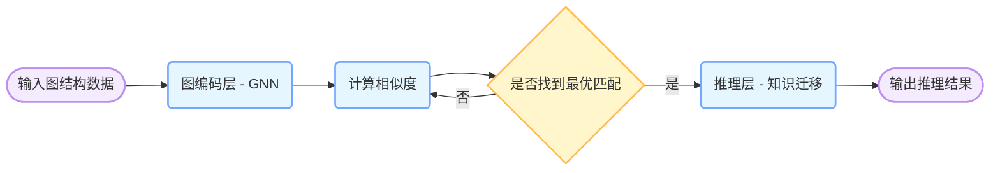

# 类比推理增强系统中神经图匹配的优化技术

> 关键词：类比推理增强系统、神经图匹配、优化技术、图神经网络、匹配算法

> 摘要：本文聚焦于类比推理增强系统中神经图匹配的优化技术。在类比推理过程中，神经图匹配起着关键作用，其效率和准确性直接影响系统的性能。文章首先介绍了相关背景，包括目的、预期读者等内容。接着深入阐述了神经图匹配的核心概念与联系，通过文本示意图和 Mermaid 流程图进行直观展示。详细讲解了核心算法原理及具体操作步骤，结合 Python 源代码进行说明。同时给出了相关的数学模型和公式，并举例解释。通过项目实战，展示了代码的实际案例及详细解释。探讨了神经图匹配在不同实际应用场景中的表现。推荐了相关的工具和资源，包括学习资源、开发工具框架以及论文著作等。最后总结了未来发展趋势与挑战，并提供了常见问题的解答和扩展阅读参考资料，旨在为该领域的研究和实践提供全面而深入的指导。

## 1. 背景介绍 
### 1.1 目的和范围
在当今的人工智能和知识推理领域，类比推理增强系统具有重要的应用价值。类比推理是一种基于相似性的推理方式，能够帮助系统从已有的知识和经验中迁移信息，解决新的问题。神经图匹配作为类比推理增强系统的核心组件之一，其主要目的是在不同的图结构之间找到最优的匹配关系，从而实现知识的迁移和推理。

本文章的范围主要涵盖类比推理增强系统中神经图匹配的优化技术。具体包括神经图匹配的核心概念、算法原理、数学模型、实际应用场景以及相关的工具和资源等方面。通过对这些内容的详细阐述，旨在为研究人员和开发者提供全面而深入的技术指导，帮助他们更好地理解和应用神经图匹配优化技术，提高类比推理增强系统的性能和效率。

### 1.2 预期读者
本文的预期读者主要包括以下几类人群：
- **人工智能研究人员**：对类比推理、图神经网络等领域感兴趣，希望深入了解神经图匹配优化技术，为其研究工作提供新的思路和方法。
- **软件开发者**：正在从事类比推理增强系统或相关图处理系统的开发工作，需要掌握神经图匹配的具体实现和优化技巧，以提高系统的性能和稳定性。
- **计算机科学专业的学生**：学习人工智能、机器学习、图论等相关课程，希望通过阅读本文加深对神经图匹配技术的理解，拓宽知识面。
- **对技术有深入兴趣的爱好者**：对前沿的人工智能技术充满好奇，希望了解神经图匹配在类比推理增强系统中的应用和优化过程。

### 1.3 文档结构概述
本文将按照以下结构进行组织：
- **核心概念与联系**：介绍神经图匹配的基本概念、相关原理以及其在类比推理增强系统中的架构，通过文本示意图和 Mermaid 流程图进行直观展示。
- **核心算法原理 & 具体操作步骤**：详细讲解神经图匹配的核心算法原理，结合 Python 源代码阐述具体的操作步骤。
- **数学模型和公式 & 详细讲解 & 举例说明**：给出神经图匹配的数学模型和相关公式，并通过具体的例子进行详细解释。
- **项目实战：代码实际案例和详细解释说明**：通过一个实际的项目案例，展示神经图匹配优化技术的具体实现过程，包括开发环境搭建、源代码详细实现和代码解读。
- **实际应用场景**：探讨神经图匹配在不同领域的实际应用场景，分析其在各个场景中的优势和挑战。
- **工具和资源推荐**：推荐相关的学习资源、开发工具框架以及论文著作，帮助读者进一步深入学习和研究神经图匹配优化技术。
- **总结：未来发展趋势与挑战**：总结神经图匹配优化技术的发展趋势，分析其面临的挑战和问题。
- **附录：常见问题与解答**：提供常见问题的解答，帮助读者解决在学习和实践过程中遇到的问题。
- **扩展阅读 & 参考资料**：列出相关的扩展阅读材料和参考资料，方便读者进一步查阅和学习。

### 1.4 术语表
#### 1.4.1 核心术语定义
- **类比推理增强系统**：一种基于类比推理的人工智能系统，通过利用已有的知识和经验，对新的问题进行推理和解决，以提高系统的智能水平和性能。
- **神经图匹配**：在图结构数据中，寻找两个或多个图之间的最优匹配关系的过程。图可以表示为节点和边的集合，神经图匹配旨在找到节点和边之间的对应关系，使得匹配的图在某种度量下最为相似。
- **图神经网络（GNN）**：一类专门用于处理图结构数据的神经网络模型。它通过节点和边的信息传递机制，学习图的结构和节点特征，从而实现图的分类、节点预测等任务。
- **匹配算法**：用于解决图匹配问题的算法，包括精确匹配算法和近似匹配算法。精确匹配算法能够找到最优的匹配结果，但计算复杂度较高；近似匹配算法则通过牺牲一定的匹配精度来提高计算效率。

#### 1.4.2 相关概念解释
- **图结构数据**：由节点和边组成的数据结构，用于表示对象之间的关系。例如，社交网络可以用图结构数据表示，其中节点表示用户，边表示用户之间的关系（如好友关系）。
- **节点特征**：每个节点所具有的属性或特征，用于描述节点的性质。例如，在社交网络中，节点特征可以包括用户的年龄、性别、兴趣爱好等。
- **边特征**：每条边所具有的属性或特征，用于描述边的性质。例如，在社交网络中，边特征可以包括好友关系的亲密度、相识时间等。
- **相似度度量**：用于衡量两个图或节点之间相似程度的指标。常见的相似度度量包括欧几里得距离、余弦相似度等。

#### 1.4.3 缩略词列表
- **GNN**：Graph Neural Network（图神经网络）
- **CNN**：Convolutional Neural Network（卷积神经网络）
- **RNN**：Recurrent Neural Network（循环神经网络）
- **MLP**：Multi - Layer Perceptron（多层感知机）

## 2. 核心概念与联系 

### 神经图匹配的基本概念
神经图匹配是在图结构数据中寻找最优匹配关系的过程。在类比推理增强系统中，图可以表示不同的知识结构或问题场景，神经图匹配的目标是找到这些图之间的相似性，从而实现知识的迁移和推理。

例如，在一个知识图谱中，不同的实体可以用节点表示，实体之间的关系可以用边表示。神经图匹配可以帮助我们找到不同知识图谱中相似的实体和关系，从而将一个知识图谱中的知识应用到另一个知识图谱中。

### 神经图匹配的原理
神经图匹配的原理主要基于图神经网络（GNN）。GNN 通过节点和边的信息传递机制，学习图的结构和节点特征。在神经图匹配中，我们首先将两个或多个图输入到 GNN 中，GNN 会对图进行编码，将图的结构和节点特征转化为低维向量表示。然后，我们可以通过计算这些向量之间的相似度，找到最优的匹配关系。

### 神经图匹配在类比推理增强系统中的架构
在类比推理增强系统中，神经图匹配通常作为一个核心模块存在。其架构可以分为以下几个部分：
- **图输入层**：接收不同的图结构数据作为输入。
- **图编码层**：使用 GNN 对输入的图进行编码，将图的结构和节点特征转化为低维向量表示。
- **匹配层**：计算编码后的向量之间的相似度，找到最优的匹配关系。
- **推理层**：根据匹配结果进行类比推理，将一个图中的知识迁移到另一个图中。

### 文本示意图
```plaintext
类比推理增强系统
|
|-- 图输入层
|       |-- 图 1
|       |-- 图 2
|       |-- ...
|
|-- 图编码层 (GNN)
|       |-- 图 1 编码向量
|       |-- 图 2 编码向量
|       |-- ...
|
|-- 匹配层
|       |-- 计算相似度
|       |-- 找到最优匹配
|
|-- 推理层
|       |-- 知识迁移
|       |-- 类比推理
```

### Mermaid 流程图


## 3. 核心算法原理 & 具体操作步骤 

### 核心算法原理
神经图匹配的核心算法主要基于图神经网络（GNN）和相似度计算。下面我们将详细介绍这些算法的原理。

#### 图神经网络（GNN）
GNN 是一类专门用于处理图结构数据的神经网络模型。其基本思想是通过节点和边的信息传递机制，学习图的结构和节点特征。常见的 GNN 模型包括图卷积网络（GCN）、图注意力网络（GAT）等。

以图卷积网络（GCN）为例，其节点特征更新公式如下：
$$H^{(l + 1)} = \sigma(\tilde{D}^{-\frac{1}{2}}\tilde{A}\tilde{D}^{-\frac{1}{2}}H^{(l)}W^{(l)})$$
其中，$H^{(l)}$ 是第 $l$ 层的节点特征矩阵，$\tilde{A} = A + I$ 是邻接矩阵 $A$ 加上自环的矩阵，$\tilde{D}$ 是 $\tilde{A}$ 的度矩阵，$W^{(l)}$ 是第 $l$ 层的可学习权重矩阵，$\sigma$ 是激活函数。

#### 相似度计算
在得到图的编码向量后，我们需要计算这些向量之间的相似度，以找到最优的匹配关系。常见的相似度度量包括欧几里得距离、余弦相似度等。

- **欧几里得距离**：
$$d(x, y) = \sqrt{\sum_{i = 1}^{n}(x_i - y_i)^2}$$
其中，$x$ 和 $y$ 是两个向量，$n$ 是向量的维度。

- **余弦相似度**：
$$\text{cosine}(x, y) = \frac{x \cdot y}{\|x\| \|y\|}$$
其中，$x \cdot y$ 是向量 $x$ 和 $y$ 的点积，$\|x\|$ 和 $\|y\|$ 分别是向量 $x$ 和 $y$ 的模。

### 具体操作步骤

#### 步骤 1：数据预处理
首先，我们需要对输入的图结构数据进行预处理，包括节点特征的提取和图的表示。以下是一个简单的 Python 代码示例：
```python
import networkx as nx
import numpy as np

# 创建一个简单的图
G = nx.karate_club_graph()

# 提取节点特征
node_features = np.random.rand(G.number_of_nodes(), 10)

# 图的邻接矩阵
adj_matrix = nx.adjacency_matrix(G).toarray()
```

#### 步骤 2：图编码
接下来，我们使用 GNN 对图进行编码，将图的结构和节点特征转化为低维向量表示。以下是一个使用 PyTorch Geometric 库实现的 GCN 编码示例：
```python
import torch
import torch.nn.functional as F
from torch_geometric.nn import GCNConv
from torch_geometric.data import Data

# 将图数据转换为 PyTorch Geometric 格式
edge_index = torch.tensor(np.nonzero(adj_matrix), dtype=torch.long)
x = torch.tensor(node_features, dtype=torch.float)
data = Data(x=x, edge_index=edge_index)

# 定义 GCN 模型
class GCN(torch.nn.Module):
    def __init__(self, in_channels, hidden_channels, out_channels):
        super(GCN, self).__init__()
        self.conv1 = GCNConv(in_channels, hidden_channels)
        self.conv2 = GCNConv(hidden_channels, out_channels)

    def forward(self, x, edge_index):
        x = self.conv1(x, edge_index)
        x = F.relu(x)
        x = self.conv2(x, edge_index)
        return x

# 初始化模型
model = GCN(in_channels=10, hidden_channels=16, out_channels=8)

# 进行图编码
encoded_features = model(data.x, data.edge_index)
```

#### 步骤 3：相似度计算
在得到图的编码向量后，我们可以计算这些向量之间的相似度，以找到最优的匹配关系。以下是一个计算余弦相似度的示例：
```python
from sklearn.metrics.pairwise import cosine_similarity

# 假设有两个图的编码向量
encoded_features_1 = encoded_features
encoded_features_2 = torch.randn(encoded_features.shape)

# 计算余弦相似度
similarity_matrix = cosine_similarity(encoded_features_1.detach().numpy(), encoded_features_2.detach().numpy())
```

#### 步骤 4：找到最优匹配
最后，我们可以根据相似度矩阵找到最优的匹配关系。以下是一个简单的贪心匹配算法示例：
```python
import numpy as np

def greedy_matching(similarity_matrix):
    num_nodes_1, num_nodes_2 = similarity_matrix.shape
    matched_nodes = []
    available_nodes_2 = set(range(num_nodes_2))

    for i in range(num_nodes_1):
        max_similarity = -np.inf
        max_index = -1
        for j in available_nodes_2:
            if similarity_matrix[i, j] > max_similarity:
                max_similarity = similarity_matrix[i, j]
                max_index = j
        if max_index != -1:
            matched_nodes.append((i, max_index))
            available_nodes_2.remove(max_index)

    return matched_nodes

# 进行贪心匹配
matched_nodes = greedy_matching(similarity_matrix)
print("Matched nodes:", matched_nodes)
```

## 4. 数学模型和公式 & 详细讲解 & 举例说明 

### 图的表示
在神经图匹配中，我们通常将图表示为一个三元组 $G=(V, E, X)$，其中：
- $V = \{v_1, v_2, \cdots, v_n\}$ 是节点的集合，$n$ 是节点的数量。
- $E \subseteq V \times V$ 是边的集合，表示节点之间的连接关系。
- $X = [x_1, x_2, \cdots, x_n]^T$ 是节点特征矩阵，其中 $x_i$ 是节点 $v_i$ 的特征向量。

### 图神经网络（GNN）的数学模型
如前所述，图卷积网络（GCN）的节点特征更新公式为：
$$H^{(l + 1)} = \sigma(\tilde{D}^{-\frac{1}{2}}\tilde{A}\tilde{D}^{-\frac{1}{2}}H^{(l)}W^{(l)})$$
其中：
- $H^{(l)}$ 是第 $l$ 层的节点特征矩阵，初始时 $H^{(0)} = X$。
- $\tilde{A} = A + I$ 是邻接矩阵 $A$ 加上自环的矩阵，$I$ 是单位矩阵。
- $\tilde{D}$ 是 $\tilde{A}$ 的度矩阵，即 $\tilde{D}_{ii} = \sum_{j = 1}^{n}\tilde{A}_{ij}$。
- $W^{(l)}$ 是第 $l$ 层的可学习权重矩阵。
- $\sigma$ 是激活函数，常用的激活函数包括 ReLU、Sigmoid 等。

### 详细讲解
GCN 的核心思想是通过节点的邻居信息来更新节点的特征。具体来说，$\tilde{D}^{-\frac{1}{2}}\tilde{A}\tilde{D}^{-\frac{1}{2}}$ 是一个归一化的邻接矩阵，它将节点的邻居信息进行加权求和。$H^{(l)}W^{(l)}$ 是对节点特征进行线性变换，$\sigma$ 是为了引入非线性。

### 举例说明
假设我们有一个简单的图，包含 3 个节点，其邻接矩阵 $A$ 为：
$$A = \begin{bmatrix}
0 & 1 & 1 \\
1 & 0 & 1 \\
1 & 1 & 0
\end{bmatrix}$$
加上自环后，$\tilde{A}$ 为：
$$\tilde{A} = \begin{bmatrix}
1 & 1 & 1 \\
1 & 1 & 1 \\
1 & 1 & 1
\end{bmatrix}$$
$\tilde{A}$ 的度矩阵 $\tilde{D}$ 为：
$$\tilde{D} = \begin{bmatrix}
3 & 0 & 0 \\
0 & 3 & 0 \\
0 & 0 & 3
\end{bmatrix}$$
$\tilde{D}^{-\frac{1}{2}}$ 为：
$$\tilde{D}^{-\frac{1}{2}} = \begin{bmatrix}
\frac{1}{\sqrt{3}} & 0 & 0 \\
0 & \frac{1}{\sqrt{3}} & 0 \\
0 & 0 & \frac{1}{\sqrt{3}}
\end{bmatrix}$$
则 $\tilde{D}^{-\frac{1}{2}}\tilde{A}\tilde{D}^{-\frac{1}{2}}$ 为：
$$\tilde{D}^{-\frac{1}{2}}\tilde{A}\tilde{D}^{-\frac{1}{2}} = \begin{bmatrix}
\frac{1}{3} & \frac{1}{3} & \frac{1}{3} \\
\frac{1}{3} & \frac{1}{3} & \frac{1}{3} \\
\frac{1}{3} & \frac{1}{3} & \frac{1}{3}
\end{bmatrix}$$
假设初始节点特征矩阵 $H^{(0)}$ 为：
$$H^{(0)} = \begin{bmatrix}
1 & 2 \\
3 & 4 \\
5 & 6
\end{bmatrix}$$
可学习权重矩阵 $W^{(0)}$ 为：
$$W^{(0)} = \begin{bmatrix}
1 & 0 \\
0 & 1
\end{bmatrix}$$
则 $H^{(1)}$ 为：
$$H^{(1)} = \sigma(\tilde{D}^{-\frac{1}{2}}\tilde{A}\tilde{D}^{-\frac{1}{2}}H^{(0)}W^{(0)}) = \sigma\left(\begin{bmatrix}
\frac{1}{3} & \frac{1}{3} & \frac{1}{3} \\
\frac{1}{3} & \frac{1}{3} & \frac{1}{3} \\
\frac{1}{3} & \frac{1}{3} & \frac{1}{3}
\end{bmatrix}\begin{bmatrix}
1 & 2 \\
3 & 4 \\
5 & 6
\end{bmatrix}\begin{bmatrix}
1 & 0 \\
0 & 1
\end{bmatrix}\right) = \sigma\left(\begin{bmatrix}
3 & 4 \\
3 & 4 \\
3 & 4
\end{bmatrix}\right)$$
如果使用 ReLU 激活函数，则：
$$H^{(1)} = \begin{bmatrix}
3 & 4 \\
3 & 4 \\
3 & 4
\end{bmatrix}$$

### 相似度度量的数学模型
#### 欧几里得距离
欧几里得距离的公式为：
$$d(x, y) = \sqrt{\sum_{i = 1}^{n}(x_i - y_i)^2}$$
其中，$x = [x_1, x_2, \cdots, x_n]$ 和 $y = [y_1, y_2, \cdots, y_n]$ 是两个向量，$n$ 是向量的维度。

#### 余弦相似度
余弦相似度的公式为：
$$\text{cosine}(x, y) = \frac{x \cdot y}{\|x\| \|y\|}$$
其中，$x \cdot y = \sum_{i = 1}^{n}x_iy_i$ 是向量 $x$ 和 $y$ 的点积，$\|x\| = \sqrt{\sum_{i = 1}^{n}x_i^2}$ 和 $\|y\| = \sqrt{\sum_{i = 1}^{n}y_i^2}$ 分别是向量 $x$ 和 $y$ 的模。

### 详细讲解
欧几里得距离衡量的是两个向量在空间中的绝对距离，距离越小表示两个向量越相似。余弦相似度衡量的是两个向量的方向相似度，取值范围在 $[-1, 1]$ 之间，值越接近 1 表示两个向量越相似。

### 举例说明
假设我们有两个向量 $x = [1, 2, 3]$ 和 $y = [4, 5, 6]$。

- **欧几里得距离**：
$$d(x, y) = \sqrt{(1 - 4)^2 + (2 - 5)^2 + (3 - 6)^2} = \sqrt{9 + 9 + 9} = \sqrt{27} \approx 5.2$$

- **余弦相似度**：
$$x \cdot y = 1 \times 4 + 2 \times 5 + 3 \times 6 = 4 + 10 + 18 = 32$$
$$\|x\| = \sqrt{1^2 + 2^2 + 3^2} = \sqrt{1 + 4 + 9} = \sqrt{14}$$
$$\|y\| = \sqrt{4^2 + 5^2 + 6^2} = \sqrt{16 + 25 + 36} = \sqrt{77}$$
$$\text{cosine}(x, y) = \frac{32}{\sqrt{14} \sqrt{77}} \approx 0.97$$

## 5. 项目实战：代码实际案例和详细解释说明 

### 5.1  开发环境搭建
在进行神经图匹配的项目实战之前，我们需要搭建相应的开发环境。以下是具体的步骤：

#### 安装 Python
首先，确保你已经安装了 Python 3.6 或更高版本。你可以从 Python 官方网站（https://www.python.org/downloads/） 下载并安装 Python。

#### 创建虚拟环境
为了避免不同项目之间的依赖冲突，建议使用虚拟环境。你可以使用 `venv` 或 `conda` 来创建虚拟环境。

- **使用 `venv` 创建虚拟环境**：
```bash
python -m venv myenv
source myenv/bin/activate  # 对于 Linux/Mac
myenv\Scripts\activate  # 对于 Windows
```

- **使用 `conda` 创建虚拟环境**：
```bash
conda create -n myenv python=3.8
conda activate myenv
```

#### 安装必要的库
在虚拟环境中，安装以下必要的库：
```bash
pip install torch torchvision torchaudio  # 安装 PyTorch
pip install torch_geometric  # 安装 PyTorch Geometric
pip install networkx  # 安装 NetworkX
pip install numpy  # 安装 NumPy
pip install scikit-learn  # 安装 scikit-learn
```

### 5.2  源代码详细实现和代码解读
以下是一个完整的神经图匹配项目实战代码示例，包括数据预处理、图编码、相似度计算和匹配过程：

```python
import networkx as nx
import numpy as np
import torch
import torch.nn.functional as F
from torch_geometric.nn import GCNConv
from torch_geometric.data import Data
from sklearn.metrics.pairwise import cosine_similarity

# 步骤 1：数据预处理
# 创建两个简单的图
G1 = nx.karate_club_graph()
G2 = nx.karate_club_graph()

# 提取节点特征
node_features_1 = np.random.rand(G1.number_of_nodes(), 10)
node_features_2 = np.random.rand(G2.number_of_nodes(), 10)

# 图的邻接矩阵
adj_matrix_1 = nx.adjacency_matrix(G1).toarray()
adj_matrix_2 = nx.adjacency_matrix(G2).toarray()

# 将图数据转换为 PyTorch Geometric 格式
edge_index_1 = torch.tensor(np.nonzero(adj_matrix_1), dtype=torch.long)
x_1 = torch.tensor(node_features_1, dtype=torch.float)
data_1 = Data(x=x_1, edge_index=edge_index_1)

edge_index_2 = torch.tensor(np.nonzero(adj_matrix_2), dtype=torch.long)
x_2 = torch.tensor(node_features_2, dtype=torch.float)
data_2 = Data(x=x_2, edge_index=edge_index_2)

# 步骤 2：图编码
# 定义 GCN 模型
class GCN(torch.nn.Module):
    def __init__(self, in_channels, hidden_channels, out_channels):
        super(GCN, self).__init__()
        self.conv1 = GCNConv(in_channels, hidden_channels)
        self.conv2 = GCNConv(hidden_channels, out_channels)

    def forward(self, x, edge_index):
        x = self.conv1(x, edge_index)
        x = F.relu(x)
        x = self.conv2(x, edge_index)
        return x

# 初始化模型
model = GCN(in_channels=10, hidden_channels=16, out_channels=8)

# 进行图编码
encoded_features_1 = model(data_1.x, data_1.edge_index)
encoded_features_2 = model(data_2.x, data_2.edge_index)

# 步骤 3：相似度计算
# 计算余弦相似度
similarity_matrix = cosine_similarity(encoded_features_1.detach().numpy(), encoded_features_2.detach().numpy())

# 步骤 4：找到最优匹配
def greedy_matching(similarity_matrix):
    num_nodes_1, num_nodes_2 = similarity_matrix.shape
    matched_nodes = []
    available_nodes_2 = set(range(num_nodes_2))

    for i in range(num_nodes_1):
        max_similarity = -np.inf
        max_index = -1
        for j in available_nodes_2:
            if similarity_matrix[i, j] > max_similarity:
                max_similarity = similarity_matrix[i, j]
                max_index = j
        if max_index != -1:
            matched_nodes.append((i, max_index))
            available_nodes_2.remove(max_index)

    return matched_nodes

# 进行贪心匹配
matched_nodes = greedy_matching(similarity_matrix)
print("Matched nodes:", matched_nodes)
```

### 5.3  代码解读与分析
#### 数据预处理部分
- `nx.karate_club_graph()`：使用 NetworkX 库创建两个简单的图，这里使用的是空手道俱乐部图。
- `np.random.rand()`：随机生成节点特征。
- `nx.adjacency_matrix()`：获取图的邻接矩阵。
- `torch.tensor()`：将数据转换为 PyTorch 张量。
- `Data()`：将节点特征和邻接矩阵转换为 PyTorch Geometric 的数据格式。

#### 图编码部分
- `GCN` 类：定义了一个简单的 GCN 模型，包含两个图卷积层。
- `model()`：调用 GCN 模型对图进行编码，得到节点的编码向量。

#### 相似度计算部分
- `cosine_similarity()`：使用 scikit-learn 库中的 `cosine_similarity` 函数计算两个图节点编码向量之间的余弦相似度。

#### 匹配部分
- `greedy_matching` 函数：实现了一个简单的贪心匹配算法，根据相似度矩阵找到最优的匹配关系。

## 6. 实际应用场景 
神经图匹配在多个领域都有广泛的应用，以下是一些具体的实际应用场景：

### 知识图谱融合
在知识图谱领域，不同的知识图谱可能包含相似的知识和实体。神经图匹配可以帮助我们找到这些知识图谱中相似的实体和关系，从而将不同的知识图谱进行融合，构建一个更加完整和丰富的知识图谱。例如，在语义网中，不同的数据源可能使用不同的本体和词汇来表示相同的概念，神经图匹配可以帮助我们解决这些语义冲突，实现知识的整合和共享。

### 药物研发
在药物研发过程中，需要对大量的化学分子进行分析和筛选。化学分子可以用图结构数据表示，其中节点表示原子，边表示化学键。神经图匹配可以帮助我们找到相似的化学分子，从而预测药物的活性和副作用。例如，通过比较已知药物分子和待筛选分子的图结构，我们可以找到具有相似活性的分子，加速药物研发的进程。

### 社交网络分析
在社交网络中，用户之间的关系可以用图结构数据表示。神经图匹配可以帮助我们找到相似的用户群体和社交模式，从而进行用户推荐、社区发现等任务。例如，通过比较不同用户的社交关系图，我们可以找到具有相似兴趣和行为的用户，为用户推荐合适的好友和内容。

### 计算机视觉
在计算机视觉领域，图像可以用图结构数据表示，其中节点表示图像的局部特征，边表示特征之间的关系。神经图匹配可以帮助我们进行图像匹配、目标识别等任务。例如，在图像检索中，通过比较查询图像和数据库中图像的图结构，我们可以找到相似的图像，提高图像检索的准确性和效率。

### 自然语言处理
在自然语言处理中，文本可以用图结构数据表示，其中节点表示单词或短语，边表示它们之间的语义关系。神经图匹配可以帮助我们进行文本匹配、语义相似度计算等任务。例如，在问答系统中，通过比较问题和答案的图结构，我们可以找到最相关的答案，提高问答系统的性能。

## 7. 工具和资源推荐
### 7.1 学习资源推荐
#### 7.1.1 书籍推荐
- 《图神经网络：基础、前沿与应用》：本书全面介绍了图神经网络的基本原理、算法和应用，是学习图神经网络的经典教材。
- 《深度学习》：由 Ian Goodfellow、Yoshua Bengio 和 Aaron Courville 合著，是深度学习领域的权威著作，对理解神经图匹配的相关理论有很大帮助。
- 《人工智能：一种现代的方法》：这本书涵盖了人工智能的各个方面，包括知识表示、推理、机器学习等，为学习类比推理增强系统提供了全面的理论基础。

#### 7.1.2 在线课程
- Coursera 上的 “Graph Neural Networks” 课程：由斯坦福大学的教授授课，系统地介绍了图神经网络的理论和实践。
- edX 上的 “Deep Learning Specialization” 课程：由 Andrew Ng 教授授课，是深度学习领域的经典课程，对理解神经图匹配的深度学习基础有很大帮助。
- B 站上的一些图神经网络相关的教程：这些教程通常由国内的专家和学者制作，内容生动易懂，适合初学者学习。

#### 7.1.3 技术博客和网站
- Medium 上的图神经网络相关博客：Medium 上有很多图神经网络领域的专家和研究者分享他们的最新研究成果和实践经验。
- 机器之心：专注于人工智能领域的资讯和技术分享，经常发布图神经网络和类比推理等相关的文章。
- 智源社区：国内的人工智能技术交流社区，有很多关于图神经网络和神经图匹配的讨论和分享。

### 7.2 开发工具框架推荐
#### 7.2.1 IDE和编辑器
- PyCharm：是一款专门用于 Python 开发的集成开发环境（IDE），具有强大的代码编辑、调试和项目管理功能，非常适合进行神经图匹配项目的开发。
- Jupyter Notebook：是一个交互式的开发环境，支持 Python 代码的实时运行和可视化，适合进行数据探索和模型实验。
- Visual Studio Code：是一款轻量级的代码编辑器，支持多种编程语言和插件，具有丰富的扩展功能，可用于神经图匹配项目的开发。

#### 7.2.2 调试和性能分析工具
- PyTorch Profiler：是 PyTorch 官方提供的性能分析工具，可以帮助我们分析模型的计算效率和内存使用情况，优化模型的性能。
- TensorBoard：是 TensorFlow 官方提供的可视化工具，也可以与 PyTorch 结合使用，用于可视化模型的训练过程和性能指标。
- cProfile：是 Python 内置的性能分析工具，可以帮助我们分析代码的执行时间和函数调用关系，找出性能瓶颈。

#### 7.2.3 相关框架和库
- PyTorch Geometric：是一个基于 PyTorch 的图神经网络框架，提供了丰富的图神经网络模型和工具，方便我们进行图数据的处理和模型的实现。
- DGL（Deep Graph Library）：是一个开源的图神经网络框架，支持多种深度学习框架，具有高效的图计算和分布式训练功能。
- NetworkX：是一个用于创建、操作和研究复杂网络结构的 Python 库，提供了丰富的图算法和数据结构，方便我们进行图数据的处理和分析。

### 7.3 相关论文著作推荐
#### 7.3.1 经典论文
- “Semi - Supervised Classification with Graph Convolutional Networks”：这篇论文提出了图卷积网络（GCN）的基本思想，是图神经网络领域的经典论文之一。
- “Graph Attention Networks”：这篇论文提出了图注意力网络（GAT），通过引入注意力机制，提高了图神经网络的性能。
- “Neural Graph Matching Networks for Few - Shot Learning”：这篇论文提出了神经图匹配网络，用于解决少样本学习问题，为神经图匹配的研究提供了新的思路。

#### 7.3.2 最新研究成果
- 关注顶级人工智能会议（如 NeurIPS、ICML、CVPR 等）上的相关论文，这些论文通常代表了该领域的最新研究成果和发展趋势。
- 关注图神经网络领域的预印本平台（如 arXiv）上的最新论文，及时了解该领域的前沿研究动态。

#### 7.3.3 应用案例分析
- 查阅相关的学术期刊和会议论文，了解神经图匹配在不同领域的应用案例和实践经验，从中学习和借鉴他人的成功经验。
- 关注一些开源项目和实际应用案例，了解神经图匹配技术在实际项目中的具体实现和优化方法。

## 8. 总结：未来发展趋势与挑战
### 未来发展趋势
#### 更强的表达能力
未来的神经图匹配技术将不断提高图神经网络的表达能力，能够更好地捕捉图的结构和节点特征信息。例如，通过引入更复杂的注意力机制、图同构网络等，提高神经图匹配的准确性和效率。

#### 多模态融合
随着人工智能技术的发展，多模态数据（如图像、文本、音频等）的处理变得越来越重要。未来的神经图匹配技术将与多模态数据处理相结合，实现更加强大的类比推理能力。例如，将图像的图结构和文本的语义信息进行融合，提高图像理解和文本生成的性能。

#### 可解释性增强
目前的神经图匹配技术大多是基于深度学习的黑盒模型，缺乏可解释性。未来的研究将更加关注神经图匹配模型的可解释性，使得模型的决策过程更加透明和可理解。例如，通过引入知识图谱和逻辑推理，为神经图匹配模型提供可解释的依据。

#### 应用领域拓展
神经图匹配技术将在更多的领域得到应用，如医疗保健、金融、交通等。例如，在医疗保健领域，神经图匹配可以帮助医生进行疾病诊断和治疗方案推荐；在金融领域，神经图匹配可以用于风险评估和欺诈检测。

### 挑战
#### 计算复杂度
神经图匹配通常需要处理大规模的图结构数据，计算复杂度较高。如何提高神经图匹配的计算效率，降低计算成本，是当前面临的一个重要挑战。

#### 数据质量和标注
神经图匹配的性能很大程度上依赖于数据的质量和标注的准确性。在实际应用中，获取高质量的图数据和准确的标注信息往往比较困难。如何处理噪声数据和缺失数据，提高数据的质量和可用性，是需要解决的问题。

#### 模型泛化能力
由于图数据的多样性和复杂性，神经图匹配模型的泛化能力往往较差。如何提高模型的泛化能力，使其能够在不同的图数据集和应用场景中都能取得良好的性能，是一个具有挑战性的问题。

#### 伦理和安全问题
随着神经图匹配技术的广泛应用，伦理和安全问题也日益凸显。例如，在隐私保护方面，如何确保图数据中的个人信息不被泄露；在安全方面，如何防止神经图匹配模型被恶意攻击和利用。

## 9. 附录：常见问题与解答
### 问题 1：神经图匹配和传统图匹配算法有什么区别？
神经图匹配是基于图神经网络的方法，通过学习图的结构和节点特征，能够自动捕捉图的复杂信息，具有较强的表达能力和适应性。传统图匹配算法通常基于图的拓扑结构和节点属性，计算复杂度较高，对于复杂的图结构和大规模数据处理能力有限。

### 问题 2：如何选择合适的相似度度量方法？
选择合适的相似度度量方法需要考虑具体的应用场景和数据特点。欧几里得距离适用于衡量向量的绝对距离，对于数据的尺度和分布比较敏感；余弦相似度适用于衡量向量的方向相似度，对于数据的尺度变化不敏感。在实际应用中，可以根据具体情况选择合适的相似度度量方法，也可以尝试多种方法进行比较。

### 问题 3：如何提高神经图匹配的性能？
可以从以下几个方面提高神经图匹配的性能：
- **数据预处理**：对输入的图数据进行清洗、归一化等预处理操作，提高数据的质量。
- **模型选择和优化**：选择合适的图神经网络模型，并对模型的参数进行优化，如调整学习率、增加训练轮数等。
- **特征工程**：提取更有代表性的节点特征和边特征，提高图的表达能力。
- **多模型融合**：尝试将多个不同的神经图匹配模型进行融合，提高匹配的准确性和稳定性。

### 问题 4：神经图匹配在处理大规模图数据时会遇到什么问题？
在处理大规模图数据时，神经图匹配可能会遇到以下问题：
- **计算复杂度高**：大规模图数据的节点和边数量较多，计算量会显著增加，导致计算效率低下。
- **内存占用大**：存储大规模图数据和模型参数需要大量的内存，可能会导致内存溢出。
- **训练时间长**：由于计算复杂度高和内存占用大，训练大规模图数据的神经图匹配模型可能需要很长的时间。

### 问题 5：如何解决神经图匹配中的过拟合问题？
可以采取以下措施解决神经图匹配中的过拟合问题：
- **增加训练数据**：收集更多的图数据进行训练，提高模型的泛化能力。
- **正则化**：在模型训练过程中，添加正则化项（如 L1 或 L2 正则化），限制模型的复杂度。
- **Dropout**：在模型中添加 Dropout 层，随机丢弃一些神经元，减少模型对训练数据的依赖。
- **早停策略**：在模型训练过程中，设置早停策略，当验证集的性能不再提升时，停止训练，避免过拟合。

## 10. 扩展阅读 & 参考资料
### 扩展阅读
- 《图论及其应用》：深入学习图论的基本理论和算法，为理解神经图匹配的图结构基础提供帮助。
- 《机器学习实战》：通过实际案例学习机器学习的基本算法和应用，加深对神经图匹配中机器学习方法的理解。
- 《深度学习实战》：结合实际项目学习深度学习的模型设计和训练技巧，提高神经图匹配模型的实现能力。

### 参考资料
- “Graph Neural Networks: A Review of Methods and Applications”：这篇综述论文全面介绍了图神经网络的方法和应用，是学习图神经网络的重要参考资料。
- “A Comprehensive Survey on Graph Neural Networks”：这篇综述论文对图神经网络的研究现状进行了全面的总结和分析，为进一步研究神经图匹配提供了理论支持。
- 相关的学术会议论文集和期刊文章，如 NeurIPS、ICML、CVPR、Journal of Artificial Intelligence Research 等，这些文献记录了神经图匹配领域的最新研究成果和发展趋势。