# 约瑟夫·皮奥特罗斯基的价值投资评分卡：系统化选股方法

> 关键词：约瑟夫·皮奥特罗斯基、价值投资评分卡、系统化选股、财务指标、投资策略

> 摘要：本文深入探讨了约瑟夫·皮奥特罗斯基的价值投资评分卡这一系统化选股方法。首先介绍了该方法提出的背景和适用范围，明确预期读者。接着阐述了核心概念及联系，详细讲解了其背后的核心算法原理和具体操作步骤，并辅以 Python 代码示例。同时给出相关的数学模型和公式，结合实例进行说明。通过项目实战展示该选股方法在实际中的应用，包括开发环境搭建、源代码实现及解读。还介绍了其实际应用场景，推荐了相关的学习资源、开发工具框架和论文著作。最后总结了该方法未来的发展趋势与挑战，并对常见问题进行解答，提供扩展阅读和参考资料，帮助读者全面深入地了解和运用这一价值投资选股方法。

## 1. 背景介绍 
### 1.1 目的和范围
在股票投资领域，投资者面临着海量的股票选择，如何筛选出具有投资价值的股票是一个关键问题。约瑟夫·皮奥特罗斯基提出的价值投资评分卡为投资者提供了一种系统化的选股方法。其目的在于通过对公司财务指标的量化分析，筛选出被市场低估但具有良好财务状况和成长潜力的股票，帮助投资者做出更明智的投资决策。

该方法的范围主要适用于公开上市交易的股票市场，尤其是在价值投资领域。它可以作为投资者筛选股票的一种有效工具，辅助投资者在众多股票中缩小投资范围，聚焦于那些可能具有较高投资回报的股票。

### 1.2 预期读者
本文的预期读者包括对价值投资感兴趣的个人投资者、专业投资机构的分析师和投资经理、金融专业的学生以及从事金融研究的学者等。无论是希望通过学习价值投资方法提升投资技能的新手投资者，还是寻求更科学选股策略的专业人士，都可以从本文中获得关于约瑟夫·皮奥特罗斯基价值投资评分卡的深入理解和应用指导。

### 1.3 文档结构概述
本文将按照以下结构进行阐述：首先介绍约瑟夫·皮奥特罗斯基价值投资评分卡的背景信息，包括目的、预期读者和文档结构概述等。接着详细讲解该方法的核心概念与联系，通过文本示意图和 Mermaid 流程图展示其原理和架构。然后阐述核心算法原理及具体操作步骤，并使用 Python 源代码进行详细说明。之后给出相关的数学模型和公式，并结合实例进行详细讲解。通过项目实战展示该选股方法在实际中的应用，包括开发环境搭建、源代码实现及解读。介绍其实际应用场景，推荐相关的学习资源、开发工具框架和论文著作。最后总结该方法未来的发展趋势与挑战，解答常见问题，并提供扩展阅读和参考资料。

### 1.4 术语表
#### 1.4.1 核心术语定义
- **价值投资评分卡**：约瑟夫·皮奥特罗斯基提出的一种通过对公司多个财务指标进行量化评分，以评估公司投资价值的工具。
- **财务指标**：反映公司财务状况和经营成果的各种数据，如净利润、资产负债率、现金流等。
- **选股**：从众多股票中筛选出具有投资价值的股票的过程。
- **价值投资**：一种投资策略，强调寻找被市场低估的股票，通过长期持有来获得投资回报。

#### 1.4.2 相关概念解释
- **基本面分析**：通过对公司财务报表、行业前景、宏观经济环境等基本面因素的分析，评估公司的内在价值和投资价值。约瑟夫·皮奥特罗斯基的价值投资评分卡就是基于基本面分析的一种方法，通过对公司财务指标的分析来评估其投资价值。
- **量化投资**：利用数学模型和计算机技术，对投资决策进行量化分析和优化的投资方法。价值投资评分卡可以看作是一种量化投资的工具，通过对财务指标的量化评分来筛选股票。

#### 1.4.3 缩略词列表
- **ROA**：Return on Assets，资产回报率，反映公司资产运营效率的指标。
- **ROE**：Return on Equity，净资产收益率，反映公司股东权益的收益水平的指标。
- **CFO**：Cash Flow from Operations，经营活动现金流量，反映公司经营活动产生现金的能力。

## 2. 核心概念与联系 

### 核心概念原理
约瑟夫·皮奥特罗斯基的价值投资评分卡基于这样一个核心原理：市场有时会错误地定价股票，一些具有良好财务状况和成长潜力的公司可能被市场低估。通过对公司多个关键财务指标的分析和评分，可以筛选出这些被低估的股票。

该评分卡主要关注公司的盈利能力、财务杠杆、流动性和运营效率等方面的财务指标。具体来说，它通过对 9 个财务指标进行评估，每个指标符合一定条件则得 1 分，不符合则得 0 分，总分为 9 分。得分越高，说明公司的财务状况越好，投资价值越高。

### 架构的文本示意图
以下是对价值投资评分卡架构的文本描述：

- **输入**：公司的财务报表数据，包括利润表、资产负债表和现金流量表中的相关数据。
- **处理**：对输入的财务数据进行分析和计算，根据 9 个财务指标的评估标准进行评分。
- **输出**：公司的价值投资评分，得分范围为 0 - 9 分。

### Mermaid 流程图

```mermaid
graph TD;
    A[获取公司财务报表数据] --> B[计算财务指标];
    B --> C{评估指标 1 是否符合条件};
    C -- 是 --> D[指标 1 得 1 分];
    C -- 否 --> E[指标 1 得 0 分];
    D --> F{评估指标 2 是否符合条件};
    E --> F;
    F -- 是 --> G[指标 2 得 1 分];
    F -- 否 --> H[指标 2 得 0 分];
    G --> I{评估指标 3 是否符合条件};
    H --> I;
    I -- 是 --> J[指标 3 得 1 分];
    I -- 否 --> K[指标 3 得 0 分];
    J --> L{评估指标 4 是否符合条件};
    K --> L;
    L -- 是 --> M[指标 4 得 1 分];
    L -- 否 --> N[指标 4 得 0 分];
    M --> O{评估指标 5 是否符合条件};
    N --> O;
    O -- 是 --> P[指标 5 得 1 分];
    O -- 否 --> Q[指标 5 得 0 分];
    P --> R{评估指标 6 是否符合条件};
    Q --> R;
    R -- 是 --> S[指标 6 得 1 分];
    R -- 否 --> T[指标 6 得 0 分];
    S --> U{评估指标 7 是否符合条件};
    T --> U;
    U -- 是 --> V[指标 7 得 1 分];
    U -- 否 --> W[指标 7 得 0 分];
    V --> X{评估指标 8 是否符合条件};
    W --> X;
    X -- 是 --> Y[指标 8 得 1 分];
    X -- 否 --> Z[指标 8 得 0 分];
    Y --> AA{评估指标 9 是否符合条件};
    Z --> AA;
    AA -- 是 --> AB[指标 9 得 1 分];
    AA -- 否 --> AC[指标 9 得 0 分];
    AB --> AD[汇总得分];
    AC --> AD;
    AD --> AE[输出价值投资评分];
```


## 3. 核心算法原理 & 具体操作步骤 

### 核心算法原理
约瑟夫·皮奥特罗斯基的价值投资评分卡通过对 9 个财务指标进行评估来确定公司的投资价值。这 9 个指标可以分为以下几类：

- **盈利能力指标**：包括净利润、资产回报率（ROA）、经营活动现金流量（CFO）等。这些指标反映了公司的盈利水平和盈利质量。
- **财务杠杆指标**：如长期负债与总资产的比率。该指标反映了公司的财务风险。
- **流动性指标**：如流动比率。该指标反映了公司的短期偿债能力。
- **运营效率指标**：如资产周转率。该指标反映了公司资产的运营效率。

具体的评估标准如下：

1. **净利润指标**：如果公司上一年度的净利润为正，则得 1 分，否则得 0 分。
2. **资产回报率（ROA）指标**：如果公司上一年度的 ROA 为正，则得 1 分，否则得 0 分。
3. **经营活动现金流量（CFO）指标**：如果公司上一年度的 CFO 为正，则得 1 分，否则得 0 分。
4. **CFO 与净利润关系指标**：如果公司上一年度的 CFO 大于净利润，则得 1 分，否则得 0 分。
5. **长期负债与总资产比率变化指标**：如果公司上一年度的长期负债与总资产比率较前一年度下降，则得 1 分，否则得 0 分。
6. **流动比率变化指标**：如果公司上一年度的流动比率较前一年度上升，则得 1 分，否则得 0 分。
7. **股权稀释指标**：如果公司上一年度没有发行新股，则得 1 分，否则得 0 分。
8. **毛利率变化指标**：如果公司上一年度的毛利率较前一年度上升，则得 1 分，否则得 0 分。
9. **资产周转率变化指标**：如果公司上一年度的资产周转率较前一年度上升，则得 1 分，否则得 0 分。

### 具体操作步骤

1. **数据收集**：收集公司的财务报表数据，包括利润表、资产负债表和现金流量表中的相关数据。
2. **指标计算**：根据收集到的财务数据，计算 9 个财务指标的值。
3. **指标评估**：根据上述评估标准，对每个指标进行评估，确定其得分。
4. **得分汇总**：将 9 个指标的得分相加，得到公司的价值投资评分。

### Python 源代码实现
```python
import pandas as pd

def calculate_score(financial_data):
    """
    计算公司的价值投资评分
    :param financial_data: 包含公司财务数据的 DataFrame
    :return: 公司的价值投资评分
    """
    score = 0

    # 净利润指标
    net_income = financial_data['Net Income'].iloc[-1]
    if net_income > 0:
        score += 1

    # 资产回报率（ROA）指标
    total_assets = financial_data['Total Assets'].iloc[-1]
    roa = net_income / total_assets
    if roa > 0:
        score += 1

    # 经营活动现金流量（CFO）指标
    cfo = financial_data['Cash Flow from Operations'].iloc[-1]
    if cfo > 0:
        score += 1

    # CFO 与净利润关系指标
    if cfo > net_income:
        score += 1

    # 长期负债与总资产比率变化指标
    long_term_debt = financial_data['Long-Term Debt'].iloc[-1]
    long_term_debt_ratio = long_term_debt / total_assets
    prev_long_term_debt = financial_data['Long-Term Debt'].iloc[-2]
    prev_total_assets = financial_data['Total Assets'].iloc[-2]
    prev_long_term_debt_ratio = prev_long_term_debt / prev_total_assets
    if long_term_debt_ratio < prev_long_term_debt_ratio:
        score += 1

    # 流动比率变化指标
    current_assets = financial_data['Current Assets'].iloc[-1]
    current_liabilities = financial_data['Current Liabilities'].iloc[-1]
    current_ratio = current_assets / current_liabilities
    prev_current_assets = financial_data['Current Assets'].iloc[-2]
    prev_current_liabilities = financial_data['Current Liabilities'].iloc[-2]
    prev_current_ratio = prev_current_assets / prev_current_liabilities
    if current_ratio > prev_current_ratio:
        score += 1

    # 股权稀释指标
    # 假设数据中包含 'Shares Outstanding' 列表示流通股数量
    shares_outstanding = financial_data['Shares Outstanding'].iloc[-1]
    prev_shares_outstanding = financial_data['Shares Outstanding'].iloc[-2]
    if shares_outstanding <= prev_shares_outstanding:
        score += 1

    # 毛利率变化指标
    gross_profit = financial_data['Gross Profit'].iloc[-1]
    revenue = financial_data['Revenue'].iloc[-1]
    gross_margin = gross_profit / revenue
    prev_gross_profit = financial_data['Gross Profit'].iloc[-2]
    prev_revenue = financial_data['Revenue'].iloc[-2]
    prev_gross_margin = prev_gross_profit / prev_revenue
    if gross_margin > prev_gross_margin:
        score += 1

    # 资产周转率变化指标
    asset_turnover = revenue / total_assets
    prev_asset_turnover = prev_revenue / prev_total_assets
    if asset_turnover > prev_asset_turnover:
        score += 1

    return score

# 示例数据
financial_data = pd.DataFrame({
    'Net Income': [100, 200],
    'Total Assets': [1000, 1200],
    'Cash Flow from Operations': [150, 250],
    'Long-Term Debt': [200, 180],
    'Current Assets': [500, 550],
    'Current Liabilities': [300, 280],
    'Shares Outstanding': [1000, 1000],
    'Gross Profit': [300, 350],
    'Revenue': [1000, 1200]
})

score = calculate_score(financial_data)
print(f"公司的价值投资评分: {score}")
```

## 4. 数学模型和公式 & 详细讲解 & 举例说明 

### 数学模型和公式

#### 1. 资产回报率（ROA）
$$ROA = \frac{Net\ Income}{Total\ Assets}$$
其中，$Net\ Income$ 表示净利润，$Total\ Assets$ 表示总资产。ROA 反映了公司运用全部资产获取利润的能力，ROA 越高，说明公司资产运营效率越高。

#### 2. 流动比率
$$Current\ Ratio = \frac{Current\ Assets}{Current\ Liabilities}$$
其中，$Current\ Assets$ 表示流动资产，$Current\ Liabilities$ 表示流动负债。流动比率反映了公司的短期偿债能力，一般认为流动比率大于 1 时，公司具有较好的短期偿债能力。

#### 3. 毛利率
$$Gross\ Margin = \frac{Gross\ Profit}{Revenue}$$
其中，$Gross\ Profit$ 表示毛利润，$Revenue$ 表示营业收入。毛利率反映了公司产品或服务的盈利能力，毛利率越高，说明公司产品或服务的盈利能力越强。

#### 4. 资产周转率
$$Asset\ Turnover = \frac{Revenue}{Total\ Assets}$$
资产周转率反映了公司资产的运营效率，资产周转率越高，说明公司资产运营效率越高。

### 详细讲解
- **资产回报率（ROA）**：ROA 是衡量公司盈利能力的重要指标之一。它考虑了公司的总资产，反映了公司运用全部资产获取利润的能力。一个高 ROA 的公司通常意味着其资产运营效率较高，能够有效地利用资产创造利润。
- **流动比率**：流动比率是衡量公司短期偿债能力的指标。流动资产是指公司在一年内可以变现的资产，流动负债是指公司在一年内需要偿还的债务。流动比率大于 1 表示公司的流动资产能够覆盖其流动负债，具有较好的短期偿债能力。
- **毛利率**：毛利率反映了公司产品或服务的盈利能力。毛利润是指营业收入减去营业成本后的余额，毛利率越高，说明公司在扣除成本后能够获得更多的利润，产品或服务的盈利能力越强。
- **资产周转率**：资产周转率反映了公司资产的运营效率。它衡量了公司在一定时期内资产的周转次数，资产周转率越高，说明公司资产的运营效率越高，能够更快地将资产转化为营业收入。

### 举例说明
假设公司 A 的财务数据如下：

| 指标 | 数值 |
| ---- | ---- |
| 净利润 | 100 万元 |
| 总资产 | 1000 万元 |
| 流动资产 | 500 万元 |
| 流动负债 | 300 万元 |
| 毛利润 | 300 万元 |
| 营业收入 | 1000 万元 |

则公司 A 的各项指标计算如下：

- **资产回报率（ROA）**：
$$ROA = \frac{100}{1000} = 0.1 = 10\%$$
- **流动比率**：
$$Current\ Ratio = \frac{500}{300} \approx 1.67$$
- **毛利率**：
$$Gross\ Margin = \frac{300}{1000} = 0.3 = 30\%$$
- **资产周转率**：
$$Asset\ Turnover = \frac{1000}{1000} = 1$$

从这些指标可以看出，公司 A 的资产回报率为 10%，说明公司运用资产获取利润的能力较好；流动比率约为 1.67，大于 1，说明公司具有较好的短期偿债能力；毛利率为 30%，说明公司产品或服务的盈利能力较强；资产周转率为 1，说明公司资产的运营效率一般。

## 5. 项目实战：代码实际案例和详细解释说明 

### 5.1  开发环境搭建
要实现约瑟夫·皮奥特罗斯基的价值投资评分卡，我们需要搭建一个 Python 开发环境。以下是具体的步骤：

1. **安装 Python**：访问 Python 官方网站（https://www.python.org/downloads/），下载并安装适合你操作系统的 Python 版本。建议安装 Python 3.6 及以上版本。
2. **安装必要的库**：我们需要安装 Pandas 库来处理财务数据。可以使用以下命令来安装 Pandas：
```sh
pip install pandas
```

### 5.2  源代码详细实现和代码解读
以下是一个完整的 Python 代码示例，用于计算公司的价值投资评分：

```python
import pandas as pd

def calculate_score(financial_data):
    """
    计算公司的价值投资评分
    :param financial_data: 包含公司财务数据的 DataFrame
    :return: 公司的价值投资评分
    """
    score = 0

    # 净利润指标
    net_income = financial_data['Net Income'].iloc[-1]
    if net_income > 0:
        score += 1

    # 资产回报率（ROA）指标
    total_assets = financial_data['Total Assets'].iloc[-1]
    roa = net_income / total_assets
    if roa > 0:
        score += 1

    # 经营活动现金流量（CFO）指标
    cfo = financial_data['Cash Flow from Operations'].iloc[-1]
    if cfo > 0:
        score += 1

    # CFO 与净利润关系指标
    if cfo > net_income:
        score += 1

    # 长期负债与总资产比率变化指标
    long_term_debt = financial_data['Long-Term Debt'].iloc[-1]
    long_term_debt_ratio = long_term_debt / total_assets
    prev_long_term_debt = financial_data['Long-Term Debt'].iloc[-2]
    prev_total_assets = financial_data['Total Assets'].iloc[-2]
    prev_long_term_debt_ratio = prev_long_term_debt / prev_total_assets
    if long_term_debt_ratio < prev_long_term_debt_ratio:
        score += 1

    # 流动比率变化指标
    current_assets = financial_data['Current Assets'].iloc[-1]
    current_liabilities = financial_data['Current Liabilities'].iloc[-1]
    current_ratio = current_assets / current_liabilities
    prev_current_assets = financial_data['Current Assets'].iloc[-2]
    prev_current_liabilities = financial_data['Current Liabilities'].iloc[-2]
    prev_current_ratio = prev_current_assets / prev_current_liabilities
    if current_ratio > prev_current_ratio:
        score += 1

    # 股权稀释指标
    # 假设数据中包含 'Shares Outstanding' 列表示流通股数量
    shares_outstanding = financial_data['Shares Outstanding'].iloc[-1]
    prev_shares_outstanding = financial_data['Shares Outstanding'].iloc[-2]
    if shares_outstanding <= prev_shares_outstanding:
        score += 1

    # 毛利率变化指标
    gross_profit = financial_data['Gross Profit'].iloc[-1]
    revenue = financial_data['Revenue'].iloc[-1]
    gross_margin = gross_profit / revenue
    prev_gross_profit = financial_data['Gross Profit'].iloc[-2]
    prev_revenue = financial_data['Revenue'].iloc[-2]
    prev_gross_margin = prev_gross_profit / prev_revenue
    if gross_margin > prev_gross_margin:
        score += 1

    # 资产周转率变化指标
    asset_turnover = revenue / total_assets
    prev_asset_turnover = prev_revenue / prev_total_assets
    if asset_turnover > prev_asset_turnover:
        score += 1

    return score

# 示例数据
financial_data = pd.DataFrame({
    'Net Income': [100, 200],
    'Total Assets': [1000, 1200],
    'Cash Flow from Operations': [150, 250],
    'Long-Term Debt': [200, 180],
    'Current Assets': [500, 550],
    'Current Liabilities': [300, 280],
    'Shares Outstanding': [1000, 1000],
    'Gross Profit': [300, 350],
    'Revenue': [1000, 1200]
})

score = calculate_score(financial_data)
print(f"公司的价值投资评分: {score}")
```

### 5.3  代码解读与分析
- **函数定义**：`calculate_score` 函数接受一个包含公司财务数据的 Pandas DataFrame 作为输入，返回公司的价值投资评分。
- **净利润指标**：通过 `financial_data['Net Income'].iloc[-1]` 获取上一年度的净利润，如果净利润大于 0，则得 1 分。
- **资产回报率（ROA）指标**：计算上一年度的 ROA，即净利润除以总资产。如果 ROA 大于 0，则得 1 分。
- **经营活动现金流量（CFO）指标**：通过 `financial_data['Cash Flow from Operations'].iloc[-1]` 获取上一年度的 CFO，如果 CFO 大于 0，则得 1 分。
- **CFO 与净利润关系指标**：比较上一年度的 CFO 和净利润，如果 CFO 大于净利润，则得 1 分。
- **长期负债与总资产比率变化指标**：计算上一年度和前一年度的长期负债与总资产比率，比较两者的大小。如果上一年度的比率较前一年度下降，则得 1 分。
- **流动比率变化指标**：计算上一年度和前一年度的流动比率，比较两者的大小。如果上一年度的流动比率较前一年度上升，则得 1 分。
- **股权稀释指标**：比较上一年度和前一年度的流通股数量，如果上一年度的流通股数量不超过前一年度，则得 1 分。
- **毛利率变化指标**：计算上一年度和前一年度的毛利率，比较两者的大小。如果上一年度的毛利率较前一年度上升，则得 1 分。
- **资产周转率变化指标**：计算上一年度和前一年度的资产周转率，比较两者的大小。如果上一年度的资产周转率较前一年度上升，则得 1 分。

最后，将 9 个指标的得分相加，得到公司的价值投资评分。

## 6. 实际应用场景 
约瑟夫·皮奥特罗斯基的价值投资评分卡可以应用于以下几个实际场景：

### 个人投资者选股
个人投资者在选择股票时，面对众多的股票往往感到困惑。价值投资评分卡可以帮助个人投资者筛选出具有投资价值的股票。投资者可以收集公司的财务报表数据，使用评分卡计算公司的价值投资评分，选择得分较高的股票进行投资。这样可以提高投资决策的科学性和准确性，降低投资风险。

### 投资机构股票筛选
投资机构在进行股票投资时，需要对大量的股票进行研究和分析。价值投资评分卡可以作为投资机构股票筛选的工具之一。投资机构可以使用评分卡对候选股票进行初步筛选，缩小投资范围，然后再对得分较高的股票进行深入研究和分析，提高投资效率和投资回报。

### 学术研究
在金融学术研究中，价值投资评分卡可以作为一种研究工具，用于研究公司的财务状况和投资价值之间的关系。学者可以使用评分卡对不同行业、不同规模的公司进行分析，探讨影响公司投资价值的因素，为投资理论和实践提供参考。

### 风险管理
价值投资评分卡可以帮助投资者和投资机构进行风险管理。通过对公司的财务状况进行评估，投资者可以了解公司的风险水平，避免投资那些财务状况较差的公司。同时，投资者可以根据公司的价值投资评分，调整投资组合，降低投资组合的风险。

## 7. 工具和资源推荐
### 7.1 学习资源推荐
#### 7.1.1 书籍推荐
- 《聪明的投资者》（The Intelligent Investor）：本杰明·格雷厄姆（Benjamin Graham）的经典著作，是价值投资领域的必读之书。书中介绍了价值投资的基本理念和方法，对理解约瑟夫·皮奥特罗斯基的价值投资评分卡有很大的帮助。
- 《财务报表分析与证券定价》（Financial Statement Analysis and Security Valuation）：斯蒂芬·彭曼（Stephen Penman）的著作，详细介绍了财务报表分析的方法和技术，对于理解价值投资评分卡中涉及的财务指标有很大的帮助。

#### 7.1.2 在线课程
- Coursera 上的“Financial Markets”课程：由耶鲁大学的罗伯特·席勒（Robert Shiller）教授讲授，介绍了金融市场的基本原理和投资策略，包括价值投资的相关内容。
- edX 上的“Introduction to Financial Accounting”课程：由麻省理工学院（MIT）的教授讲授，介绍了财务会计的基本概念和方法，对于理解财务报表数据有很大的帮助。

#### 7.1.3 技术博客和网站
- Seeking Alpha（https://seekingalpha.com/）：一个专业的金融投资网站，提供了大量的股票分析和投资研究报告，对于学习价值投资和了解市场动态有很大的帮助。
- Investing.com（https://www.investing.com/）：提供全球金融市场的实时行情、财经新闻和投资分析工具，是投资者获取信息的重要渠道。

### 7.2 开发工具框架推荐
#### 7.2.1 IDE和编辑器
- PyCharm：一款专业的 Python 集成开发环境（IDE），提供了丰富的代码编辑、调试和分析功能，适合开发 Python 程序。
- Visual Studio Code：一款轻量级的代码编辑器，支持多种编程语言，通过安装 Python 扩展可以方便地进行 Python 开发。

#### 7.2.2 调试和性能分析工具
- PDB：Python 内置的调试器，可以帮助开发者调试 Python 程序。
- cProfile：Python 内置的性能分析工具，可以帮助开发者分析 Python 程序的性能瓶颈。

#### 7.2.3 相关框架和库
- Pandas：一个强大的数据分析库，提供了丰富的数据结构和数据处理功能，适合处理财务数据。
- NumPy：一个用于科学计算的 Python 库，提供了高效的数组操作和数学函数，在数据分析和数值计算中广泛应用。

### 7.3 相关论文著作推荐
#### 7.3.1 经典论文
- Piotroski, J. D. (2000). Value investing: The use of historical financial statement information to separate winners from losers. The Journal of Accounting Research, 38(s1), 1-41. 这是约瑟夫·皮奥特罗斯基提出价值投资评分卡的经典论文，详细介绍了评分卡的原理和应用。

#### 7.3.2 最新研究成果
- 可以通过学术数据库，如 Google Scholar、Web of Science 等，搜索关于价值投资评分卡的最新研究成果，了解该领域的最新进展。

#### 7.3.3 应用案例分析
- 一些金融研究机构和投资公司会发布关于价值投资评分卡的应用案例分析报告，可以通过相关的金融网站和研究机构的官网获取这些报告，了解该方法在实际应用中的效果和经验。

## 8. 总结：未来发展趋势与挑战
### 未来发展趋势
- **与大数据和人工智能的结合**：随着大数据和人工智能技术的发展，价值投资评分卡可以与这些技术相结合，实现更高效、更准确的选股。例如，可以利用大数据技术收集更多的公司信息和市场数据，利用人工智能算法对这些数据进行分析和挖掘，提高评分卡的准确性和有效性。
- **国际化应用**：随着全球金融市场的一体化，价值投资评分卡有望在国际市场上得到更广泛的应用。不同国家和地区的投资者可以使用该方法筛选具有投资价值的股票，促进国际资本的流动和配置。
- **行业细分和个性化应用**：未来，价值投资评分卡可能会根据不同行业的特点和投资者的个性化需求进行细分和优化。例如，针对不同行业的财务指标特点，制定更适合该行业的评分标准；根据投资者的风险偏好和投资目标，提供个性化的选股建议。

### 挑战
- **数据质量和可靠性**：价值投资评分卡的准确性和有效性依赖于高质量、可靠的财务数据。然而，财务数据可能存在造假、误差等问题，这会影响评分卡的评估结果。因此，如何获取高质量、可靠的财务数据是一个重要的挑战。
- **市场环境变化**：市场环境是不断变化的，公司的财务状况和经营业绩也会受到市场环境的影响。价值投资评分卡是基于历史财务数据进行评估的，可能无法及时反映市场环境的变化。因此，如何在市场环境变化的情况下，保证评分卡的有效性是一个挑战。
- **模型的局限性**：价值投资评分卡只是一种基于财务指标的选股方法，它没有考虑到公司的非财务因素，如管理团队的能力、品牌价值、技术创新能力等。这些非财务因素也会对公司的投资价值产生重要影响。因此，如何在评分卡中纳入非财务因素，提高模型的全面性和准确性是一个挑战。

## 9. 附录：常见问题与解答
### 1. 价值投资评分卡的得分越高，股票就一定越好吗？
不一定。价值投资评分卡的得分只是一个参考，它反映了公司的财务状况和投资价值的相对水平。得分高的公司通常具有较好的财务状况和成长潜力，但并不意味着这些公司的股票一定会有良好的表现。股票的价格还受到市场环境、行业竞争、宏观经济等多种因素的影响。因此，在使用价值投资评分卡选股时，还需要结合其他因素进行综合分析。

### 2. 如何获取公司的财务报表数据？
可以通过以下途径获取公司的财务报表数据：
- **公司官网**：大多数上市公司会在其官方网站上公布公司的财务报表。
- **证券交易所网站**：证券交易所会要求上市公司定期披露财务报表，投资者可以在证券交易所的官方网站上查询相关信息。
- **金融数据提供商**：如 Bloomberg、Wind 等金融数据提供商提供了丰富的公司财务数据和金融信息。

### 3. 价值投资评分卡适用于所有类型的股票吗？
价值投资评分卡主要适用于具有一定规模和财务透明度的上市公司。对于一些新兴的、财务数据不完整或不透明的公司，该方法可能不太适用。此外，对于一些特殊行业的公司，如金融行业、房地产行业等，可能需要对评分卡的指标和标准进行适当的调整。

### 4. 如何提高价值投资评分卡的准确性？
可以从以下几个方面提高价值投资评分卡的准确性：
- **提高数据质量**：确保获取的财务数据准确、可靠，避免使用有误差或造假的数据。
- **调整指标和标准**：根据不同行业的特点和市场环境的变化，对评分卡的指标和标准进行适当的调整。
- **结合其他分析方法**：将价值投资评分卡与其他分析方法，如技术分析、基本面分析等相结合，进行综合分析。

## 10. 扩展阅读 & 参考资料
### 扩展阅读
- 《怎样选择成长股》（Common Stocks and Uncommon Profits）：菲利普·费雪（Philip Fisher）的著作，介绍了成长股投资的方法和策略，与价值投资有一定的互补性。
- 《战胜华尔街》（One Up On Wall Street）：彼得·林奇（Peter Lynch）的著作，分享了他的投资经验和选股方法，对于投资者有很大的启发。

### 参考资料
- Piotroski, J. D. (2000). Value investing: The use of historical financial statement information to separate winners from losers. The Journal of Accounting Research, 38(s1), 1-41.
- Graham, B., & Dodd, D. L. (1934). Security Analysis. McGraw-Hill.
- Penman, S. H. (2013). Financial Statement Analysis and Security Valuation. McGraw-Hill.