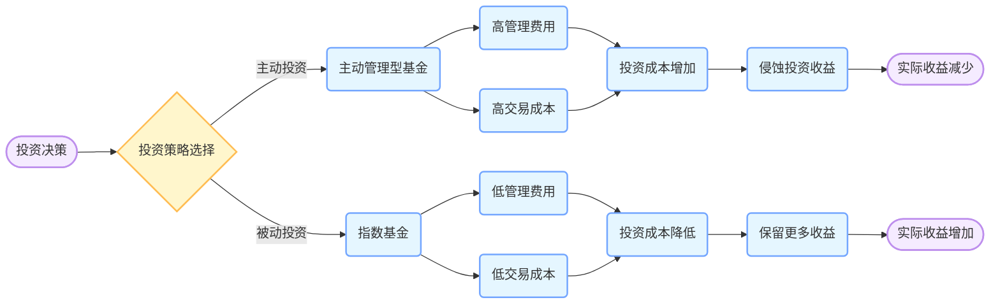

# 约翰·伯格的投资成本意识

> 关键词：约翰·伯格、投资成本意识、指数基金、低成本投资、长期投资、投资理念、金融市场

> 摘要：本文深入探讨了约翰·伯格的投资成本意识，介绍了其投资理念产生的背景和核心思想。详细阐述了投资成本的构成及对投资收益的影响，分析了约翰·伯格所倡导的指数基金这一低成本投资工具的原理和优势。通过数学模型和公式展示了投资成本在长期投资中的累积效应，并结合实际案例进行说明。同时探讨了其投资成本意识在不同金融市场环境下的应用场景，推荐了相关的学习资源、开发工具和研究论文。最后总结了其投资理念的未来发展趋势与挑战，为投资者在控制投资成本、实现长期稳健收益方面提供全面而深入的参考。

## 1. 背景介绍 
### 1.1 目的和范围
本文旨在全面解读约翰·伯格的投资成本意识，深入分析其投资理念的内涵、原理和实际应用。范围涵盖了约翰·伯格投资思想的起源、投资成本的各个方面、相关投资工具和策略，以及该理念在不同金融市场环境下的实践与影响。通过对这些内容的研究，帮助投资者更好地理解投资成本的重要性，并学会运用相关策略来优化投资组合，实现长期的投资目标。

### 1.2 预期读者
本文预期读者包括对投资领域感兴趣的普通投资者、金融从业者、投资研究人员以及对约翰·伯格投资思想有深入了解需求的人群。无论是初学者希望建立正确的投资观念，还是专业人士寻求更深入的理论和实践指导，都能从本文中获得有价值的信息。

### 1.3 文档结构概述
本文首先介绍约翰·伯格投资成本意识产生的背景和相关术语，让读者对基本概念有清晰的认识。接着阐述核心概念与联系，包括投资成本的构成和约翰·伯格倡导的指数基金等核心思想。然后详细讲解核心算法原理和具体操作步骤，通过数学模型和公式分析投资成本对收益的影响，并结合实际案例进行说明。之后探讨其在实际应用场景中的表现，推荐相关的学习资源、开发工具和研究论文。最后总结未来发展趋势与挑战，并提供常见问题解答和扩展阅读参考资料。

### 1.4 术语表
#### 1.4.1 核心术语定义
- **投资成本**：投资者在进行投资活动过程中所发生的各项费用，包括交易成本、管理费用、税收等，这些成本会直接或间接影响投资收益。
- **指数基金**：一种按照特定指数（如沪深 300 指数、标普 500 指数等）的成分股构成及其权重来构建投资组合，以追踪指数表现为目标的基金产品。
- **主动投资**：投资者或基金经理通过积极的研究、分析和决策，试图选择表现优于市场平均水平的投资标的，以获取超额收益的投资策略。
- **被动投资**：通过复制市场指数的成分股和权重，不进行主动的选股和择时，以获取市场平均收益为目标的投资策略。

#### 1.4.2 相关概念解释
- **费用率**：基金管理公司每年从基金资产中扣除的用于支付管理费用、托管费用等的比例，通常以百分比表示。费用率的高低直接影响投资者的实际收益。
- **跟踪误差**：指数基金的收益率与所追踪指数收益率之间的差异，反映了指数基金复制指数表现的准确程度。跟踪误差越小，说明指数基金的表现越接近所追踪的指数。
- **复利效应**：在投资中，将投资收益再投资，使得本金不断增加，从而在未来获得更多的收益。复利效应在长期投资中具有显著的放大作用，但投资成本会对复利效应产生负面影响。

#### 1.4.3 缩略词列表
- **ETF**：交易型开放式指数基金（Exchange - Traded Fund），是一种在证券交易所上市交易的、基金份额可变的开放式指数基金。
- **FOF**：基金中的基金（Fund of Funds），是一种专门投资于其他基金的基金，通过投资多只基金来分散风险。

## 2. 核心概念与联系 
### 2.1 约翰·伯格投资理念的核心
约翰·伯格是现代指数基金的创始人，他的投资理念核心在于强调投资成本对长期投资收益的重要影响。他认为，在金融市场中，投资者很难持续战胜市场，而过高的投资成本会进一步侵蚀投资收益。因此，他倡导低成本的被动投资策略，尤其是通过投资指数基金来获取市场平均收益。

### 2.2 投资成本的构成
投资成本主要包括以下几个方面：
- **交易成本**：投资者在买卖证券时支付的佣金、印花税等费用。这些费用会直接减少投资者的投资本金。
- **管理费用**：基金管理公司为管理基金资产而收取的费用。对于主动管理型基金，管理费用通常较高，因为基金经理需要进行大量的研究和决策工作。
- **税收**：投资者在投资过程中可能需要缴纳的资本利得税、股息税等。不同的投资产品和投资期限可能会导致不同的税收负担。

### 2.3 指数基金与投资成本的关系
指数基金是约翰·伯格投资理念的重要实践工具。由于指数基金采用被动投资策略，不需要进行大量的研究和选股工作，因此其管理费用相对较低。同时，指数基金的交易频率较低，也减少了交易成本。与主动管理型基金相比，指数基金能够以更低的成本追踪市场指数，从而为投资者提供更接近市场平均收益的回报。

### 2.4 核心概念原理和架构的文本示意图
```plaintext
投资收益
|
|-- 市场收益
|   |-- 市场整体表现
|
|-- 投资成本
|   |-- 交易成本
|   |   |-- 佣金
|   |   |-- 印花税
|   |
|   |-- 管理费用
|   |   |-- 主动管理型基金费用
|   |   |-- 指数基金费用
|   |
|   |-- 税收
|       |-- 资本利得税
|       |-- 股息税
|
|-- 实际收益
```

### 2.5 Mermaid 流程图


## 3. 核心算法原理 & 具体操作步骤 
### 3.1 投资成本对收益影响的算法原理
投资成本对收益的影响可以通过简单的数学模型来分析。假设初始投资金额为 $P$，投资期限为 $n$ 年，每年的投资收益率为 $r$，每年的投资成本率为 $c$。则经过 $n$ 年后的投资收益 $A$ 可以通过以下公式计算：

$A = P(1 + r - c)^n$

从这个公式可以看出，投资成本率 $c$ 越高，最终的投资收益 $A$ 就越低。

### 3.2 Python 源代码实现
```python
def investment_return(principal, annual_return, cost_rate, years):
    """
    计算考虑投资成本后的最终投资收益
    :param principal: 初始投资金额
    :param annual_return: 每年的投资收益率
    :param cost_rate: 每年的投资成本率
    :param years: 投资期限（年）
    :return: 最终投资收益
    """
    return principal * (1 + annual_return - cost_rate) ** years

# 示例
initial_investment = 10000
annual_return_rate = 0.08
cost_rate_1 = 0.01  # 低投资成本率
cost_rate_2 = 0.03  # 高投资成本率
investment_years = 30

# 计算低投资成本下的最终收益
final_return_1 = investment_return(initial_investment, annual_return_rate, cost_rate_1, investment_years)
# 计算高投资成本下的最终收益
final_return_2 = investment_return(initial_investment, annual_return_rate, cost_rate_2, investment_years)

print(f"低投资成本（{cost_rate_1 * 100}%）下，30 年后的最终收益为：{final_return_1:.2f} 元")
print(f"高投资成本（{cost_rate_2 * 100}%）下，30 年后的最终收益为：{final_return_2:.2f} 元")
```

### 3.3 具体操作步骤
1. **确定初始投资金额**：投资者首先需要确定自己的初始投资本金，这是投资的基础。
2. **估计投资收益率**：根据市场情况和历史数据，对投资产品的预期收益率进行合理估计。可以参考相关指数的历史表现、宏观经济数据等。
3. **计算投资成本率**：仔细分析投资过程中涉及的各项成本，包括交易成本、管理费用、税收等，并计算出总的投资成本率。
4. **设定投资期限**：根据自己的投资目标和财务规划，确定投资的期限。
5. **使用公式或代码计算收益**：将上述数据代入投资收益计算公式或使用 Python 代码进行计算，以了解不同投资成本下的最终收益情况。

## 4. 数学模型和公式 & 详细讲解 & 举例说明 
### 4.1 复利模型下的投资成本影响
在复利模型下，投资成本的影响更加显著。假设每年的投资收益率为 $r$，每年的投资成本率为 $c$，初始投资金额为 $P$，投资期限为 $n$ 年。则经过 $n$ 年后的投资终值 $A$ 为：

$A = P\prod_{i = 1}^{n}(1 + r_i - c_i)$

在实际应用中，如果每年的收益率 $r$ 和成本率 $c$ 保持不变，则公式可以简化为：

$A = P(1 + r - c)^n$

### 4.2 详细讲解
从上述公式可以看出，投资成本率 $c$ 对最终投资终值 $A$ 有着重要的影响。在长期投资中，即使投资成本率的微小差异，也会随着时间的推移产生巨大的影响。这是因为复利的作用会使得投资收益不断累积，而投资成本也会不断侵蚀这些收益。

例如，假设初始投资金额 $P = 10000$ 元，每年的投资收益率 $r = 0.08$，投资期限 $n = 30$ 年。当投资成本率 $c_1 = 0.01$ 时，最终投资终值为：

$A_1 = 10000\times(1 + 0.08 - 0.01)^{30} \approx 76122.55$（元）

当投资成本率 $c_2 = 0.03$ 时，最终投资终值为：

$A_2 = 10000\times(1 + 0.08 - 0.03)^{30} \approx 43219.42$（元）

可以看到，仅仅投资成本率相差 $2\%$，30 年后的投资终值就相差了 $76122.55 - 43219.42 = 32903.13$ 元。

### 4.3 举例说明
我们再来看一个更详细的例子，假设有两位投资者，投资者 A 和投资者 B，他们都有 10000 元的初始投资，预期每年的投资收益率为 8%，投资期限为 40 年。

投资者 A 选择了一只主动管理型基金，每年的管理费用和交易成本等投资成本率为 2.5%。投资者 B 选择了一只指数基金，每年的投资成本率为 0.5%。

根据公式 $A = P(1 + r - c)^n$，计算两位投资者 40 年后的投资终值：

投资者 A 的投资终值：

$A_A = 10000\times(1 + 0.08 - 0.025)^{40} \approx 89543.02$（元）

投资者 B 的投资终值：

$A_B = 10000\times(1 + 0.08 - 0.005)^{40} \approx 271484.56$（元）

可以看出，由于投资成本的差异，投资者 B 的最终收益远远高于投资者 A。这充分说明了投资成本在长期投资中的重要性。

## 5. 项目实战：代码实际案例和详细解释说明 
### 5.1 开发环境搭建
为了运行上述 Python 代码，我们需要搭建一个基本的 Python 开发环境。以下是具体步骤：

1. **安装 Python**：访问 Python 官方网站（https://www.python.org/downloads/），根据自己的操作系统选择合适的 Python 版本进行下载和安装。建议安装 Python 3.6 及以上版本。
2. **安装开发工具**：可以选择安装集成开发环境（IDE），如 PyCharm、VS Code 等，也可以使用简单的文本编辑器，如 Sublime Text 等。这里以 VS Code 为例，访问 VS Code 官方网站（https://code.visualstudio.com/）下载并安装。
3. **安装 Python 扩展**：打开 VS Code，在扩展市场中搜索并安装 Python 扩展，以支持 Python 代码的编写和调试。

### 5.2 源代码详细实现和代码解读
以下是上述计算投资收益的 Python 代码的详细实现和解读：

```python
def investment_return(principal, annual_return, cost_rate, years):
    """
    计算考虑投资成本后的最终投资收益
    :param principal: 初始投资金额
    :param annual_return: 每年的投资收益率
    :param cost_rate: 每年的投资成本率
    :param years: 投资期限（年）
    :return: 最终投资收益
    """
    return principal * (1 + annual_return - cost_rate) ** years

# 示例
initial_investment = 10000
annual_return_rate = 0.08
cost_rate_1 = 0.01  # 低投资成本率
cost_rate_2 = 0.03  # 高投资成本率
investment_years = 30

# 计算低投资成本下的最终收益
final_return_1 = investment_return(initial_investment, annual_return_rate, cost_rate_1, investment_years)
# 计算高投资成本下的最终收益
final_return_2 = investment_return(initial_investment, annual_return_rate, cost_rate_2, investment_years)

print(f"低投资成本（{cost_rate_1 * 100}%）下，30 年后的最终收益为：{final_return_1:.2f} 元")
print(f"高投资成本（{cost_rate_2 * 100}%）下，30 年后的最终收益为：{final_return_2:.2f} 元")
```

**代码解读**：
1. **函数定义**：`investment_return` 函数接受四个参数：`principal`（初始投资金额）、`annual_return`（每年的投资收益率）、`cost_rate`（每年的投资成本率）和 `years`（投资期限）。函数内部使用公式 $A = P(1 + r - c)^n$ 计算最终投资收益，并返回该值。
2. **示例数据设置**：设置了初始投资金额为 10000 元，每年的投资收益率为 8%，投资期限为 30 年。同时设置了两个不同的投资成本率：0.01 和 0.03。
3. **收益计算**：分别调用 `investment_return` 函数计算低投资成本和高投资成本下的最终收益。
4. **结果输出**：使用 `print` 函数输出不同投资成本下的最终收益，结果保留两位小数。

### 5.3 代码解读与分析
通过上述代码，我们可以清晰地看到投资成本对最终投资收益的影响。在实际应用中，投资者可以根据自己的情况修改示例数据，计算不同投资方案下的最终收益，从而做出更合理的投资决策。

同时，我们还可以对代码进行扩展，例如添加更多的投资方案比较、绘制收益曲线等，以更直观地展示投资成本的影响。以下是一个简单的扩展代码示例，用于绘制不同投资成本率下的收益曲线：

```python
import matplotlib.pyplot as plt
import numpy as np

def investment_return(principal, annual_return, cost_rate, years):
    """
    计算考虑投资成本后的最终投资收益
    :param principal: 初始投资金额
    :param annual_return: 每年的投资收益率
    :param cost_rate: 每年的投资成本率
    :param years: 投资期限（年）
    :return: 最终投资收益
    """
    return principal * (1 + annual_return - cost_rate) ** years

# 示例数据
initial_investment = 10000
annual_return_rate = 0.08
investment_years = np.arange(1, 41)  # 投资期限从 1 年到 40 年

# 不同投资成本率
cost_rates = [0.005, 0.01, 0.015, 0.02, 0.025]

# 计算不同投资成本率下的收益
for cost_rate in cost_rates:
    returns = [investment_return(initial_investment, annual_return_rate, cost_rate, year) for year in investment_years]
    plt.plot(investment_years, returns, label=f"Cost Rate: {cost_rate * 100}%")

# 设置图表属性
plt.xlabel('Investment Years')
plt.ylabel('Final Investment Return')
plt.title('Effect of Investment Cost on Returns')
plt.legend()
plt.grid(True)

# 显示图表
plt.show()
```

这段代码使用 `matplotlib` 库绘制了不同投资成本率下的收益曲线，投资者可以更直观地看到投资成本对收益的长期影响。

## 6. 实际应用场景 
### 6.1 个人投资者的长期投资规划
对于个人投资者来说，约翰·伯格的投资成本意识在长期投资规划中具有重要的指导意义。个人投资者通常没有专业的投资知识和丰富的投资经验，很难通过主动投资持续战胜市场。而且，个人投资者的投资金额相对较小，过高的投资成本会对其收益产生较大的影响。

因此，个人投资者可以选择投资低成本的指数基金，以获取市场平均收益。例如，一位年轻的上班族每月拿出一部分工资进行基金定投，选择指数基金作为投资标的，长期坚持下去，可以在较低的成本下实现资产的稳健增长。

### 6.2 养老金和社保基金的投资管理
养老金和社保基金是广大民众的养老保障资金，其投资管理需要注重安全性和稳定性。由于资金规模较大，投资成本的微小差异都会对最终的收益产生巨大的影响。

采用约翰·伯格倡导的低成本投资策略，投资指数基金等低成本产品，可以有效降低投资成本，提高资金的使用效率。同时，指数基金的分散投资特性也可以降低投资风险，保障养老金和社保基金的安全。

### 6.3 机构投资者的资产配置
机构投资者，如保险公司、基金公司等，在进行资产配置时也需要考虑投资成本。在构建投资组合时，合理配置一定比例的低成本指数基金，可以降低整个投资组合的成本，提高组合的收益风险比。

例如，一家基金公司在构建一只混合型基金时，可以将一部分资金投资于指数基金，以获取市场平均收益，同时将另一部分资金投资于主动管理型基金，以追求超额收益。通过这种方式，可以在控制成本的同时，实现资产的多元化配置。

### 6.4 金融市场环境变化下的应用
在不同的金融市场环境下，约翰·伯格的投资成本意识也具有重要的应用价值。在牛市中，市场整体上涨，指数基金可以较好地追踪市场表现，获取市场收益。而且，由于其低成本的优势，投资者可以保留更多的收益。

在熊市或震荡市中，主动投资很难获得超额收益，而指数基金的分散投资特性可以降低风险。同时，低成本的指数基金可以减少投资成本的侵蚀，为投资者在市场低迷时提供一定的保护。

## 7. 工具和资源推荐
### 7.1 学习资源推荐
#### 7.1.1 书籍推荐
- 《共同基金常识》（约翰·伯格著）：这是约翰·伯格的经典著作，全面阐述了他的投资理念和对基金行业的深刻见解，是投资者了解投资成本意识和指数基金的必读之书。
- 《聪明的投资者》（本杰明·格雷厄姆著）：价值投资的经典之作，书中强调了投资者应注重投资成本和风险控制，对投资者树立正确的投资观念具有重要的指导意义。
- 《漫步华尔街》（伯顿·马尔基尔著）：介绍了各种投资策略和市场理论，通过大量的实证研究证明了指数基金的优势，是一本通俗易懂的投资入门书籍。

#### 7.1.2 在线课程
- Coursera 平台上的“投资学原理”课程：由知名大学的教授授课，系统地介绍了投资学的基本原理和方法，包括投资成本的分析和控制。
- 中国大学 MOOC 上的“金融市场与金融机构”课程：讲解了金融市场的运行机制和金融机构的投资策略，对理解投资成本在金融市场中的作用有很大帮助。

#### 7.1.3 技术博客和网站
- 雪球网：国内知名的投资交流社区，有大量的投资者分享投资经验和研究成果，其中不乏关于投资成本和指数基金的讨论。
- 晨星网：提供基金评级、分析和研究报告，投资者可以通过该网站了解不同基金的费用情况和业绩表现，为投资决策提供参考。

### 7.2 开发工具框架推荐
#### 7.2.1 IDE和编辑器
- PyCharm：功能强大的 Python 集成开发环境，提供代码编辑、调试、自动补全、版本控制等功能，适合专业的 Python 开发者使用。
- VS Code：轻量级的代码编辑器，支持多种编程语言，通过安装 Python 扩展可以方便地进行 Python 代码的开发和调试。

#### 7.2.2 调试和性能分析工具
- pdb：Python 内置的调试工具，可以帮助开发者在代码中设置断点、查看变量值、单步执行代码等，方便调试代码。
- cProfile：Python 标准库中的性能分析工具，可以分析代码的执行时间和函数调用次数，帮助开发者优化代码性能。

#### 7.2.3 相关框架和库
- Pandas：用于数据处理和分析的 Python 库，提供了高效的数据结构和数据操作方法，在处理投资数据时非常有用。
- Matplotlib：Python 的绘图库，可以绘制各种类型的图表，如折线图、柱状图、散点图等，帮助投资者直观地展示投资数据和分析结果。

### 7.3 相关论文著作推荐
#### 7.3.1 经典论文
- “The Arithmetic of Active Management”（William F. Sharpe 著）：该论文通过数学模型证明了在市场中主动管理型基金的平均收益必然低于被动管理型基金，强调了投资成本对投资收益的重要影响。
- “Random Walks in Stock Market Prices”（Paul Samuelson 著）：提出了股票市场价格的随机游走理论，为指数基金的发展提供了理论基础。

#### 7.3.2 最新研究成果
- 关注顶级金融学术期刊，如《Journal of Finance》《Review of Financial Studies》等，这些期刊上发表的最新研究成果可以帮助投资者了解投资成本领域的前沿动态。

#### 7.3.3 应用案例分析
- 各大金融机构和研究机构发布的关于指数基金和投资成本的研究报告和案例分析，如贝莱德、先锋集团等机构的相关报告，可以为投资者提供实际应用的参考。

## 8. 总结：未来发展趋势与挑战
### 8.1 未来发展趋势
- **指数基金市场的持续增长**：随着投资者对投资成本意识的不断提高，指数基金作为一种低成本、高效的投资工具，其市场规模有望继续扩大。越来越多的投资者将选择指数基金作为长期投资的主要标的。
- **智能化投资服务的兴起**：随着人工智能和大数据技术的发展，智能化投资服务将逐渐普及。智能投顾可以根据投资者的风险偏好、投资目标等因素，为投资者提供个性化的投资组合建议，其中可能会更多地推荐低成本的指数基金。
- **全球投资市场的一体化**：随着全球经济的一体化和金融市场的互联互通，投资者的投资范围将更加广泛。指数基金可以方便地投资于全球不同市场的指数，满足投资者多元化的投资需求。

### 8.2 挑战
- **市场竞争加剧**：随着指数基金市场的发展，竞争将日益激烈。基金公司可能会通过降低费用、推出创新产品等方式来争夺市场份额，这可能会导致行业利润率下降，同时也可能会出现一些低质量的指数基金产品。
- **投资者教育不足**：虽然投资成本意识逐渐受到关注，但仍有很多投资者对投资成本的重要性认识不足。投资者可能会被一些高收益的宣传所吸引，而忽视了投资成本对收益的影响。因此，加强投资者教育是一个长期而艰巨的任务。
- **金融市场的不确定性**：金融市场受到多种因素的影响，如宏观经济形势、政策变化、地缘政治等，具有很大的不确定性。指数基金虽然可以分散风险，但在市场大幅波动时，也可能会面临较大的损失。投资者需要具备一定的风险承受能力和投资经验。

## 9. 附录：常见问题与解答
### 9.1 指数基金一定能获得市场平均收益吗？
指数基金的目标是追踪指数表现，以获取市场平均收益。但由于存在跟踪误差等因素，指数基金的实际收益率可能会与所追踪指数的收益率存在一定的差异。不过，优秀的指数基金通常能够将跟踪误差控制在较小的范围内，其表现基本接近市场平均水平。

### 9.2 主动管理型基金就一定不好吗？
主动管理型基金并不一定不好。在某些市场环境下，优秀的基金经理可以通过深入的研究和分析，选择表现优于市场的投资标的，从而获得超额收益。但主动管理型基金的管理费用较高，而且能够持续战胜市场的基金经理是少数。因此，对于大多数投资者来说，选择低成本的指数基金可能是更明智的选择。

### 9.3 如何选择合适的指数基金？
选择合适的指数基金可以从以下几个方面考虑：
- **跟踪误差**：选择跟踪误差较小的指数基金，说明其能够更好地追踪指数表现。
- **费用率**：尽量选择费用率较低的指数基金，以降低投资成本。
- **基金规模**：一般来说，基金规模较大的指数基金流动性较好，运作相对稳定。
- **基金公司实力**：选择实力较强、信誉良好的基金公司管理的指数基金。

### 9.4 投资成本除了费用率还有哪些方面需要考虑？
投资成本除了费用率外，还需要考虑交易成本、税收等方面。交易成本包括佣金、印花税等，频繁的交易可能会导致较高的交易成本。税收方面，不同的投资产品和投资期限可能会有不同的税收政策，投资者需要了解相关规定，合理规划投资，以降低税收负担。

## 10. 扩展阅读 & 参考资料
### 10.1 扩展阅读
- 《金融炼金术》（乔治·索罗斯著）：介绍了索罗斯的投资哲学和交易策略，对投资者理解金融市场的运行机制和投资决策有一定的启发。
- 《非理性繁荣》（罗伯特·席勒著）：探讨了金融市场中的非理性行为和泡沫现象，提醒投资者要保持理性，避免盲目跟风。

### 10.2 参考资料
- 约翰·伯格相关官方网站和演讲资料。
- 各大金融机构发布的研究报告和市场分析。
- 相关学术期刊和论文数据库中的研究成果。