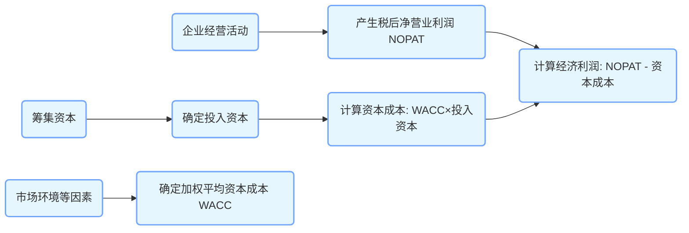

# 经济利润模型：衡量真实价值创造的工具

> 关键词：经济利润模型、价值创造、资本成本、企业估值、财务分析、股东价值、绩效评估

> 摘要：本文围绕经济利润模型展开，深入探讨其作为衡量真实价值创造工具的原理、应用及意义。首先介绍经济利润模型的背景，包括目的、预期读者、文档结构和相关术语。接着阐述核心概念与联系，通过文本示意图和 Mermaid 流程图展示其架构。详细讲解核心算法原理，并用 Python 代码实现。分析相关数学模型和公式，并举例说明。通过项目实战给出代码实际案例及详细解释。探讨该模型的实际应用场景，推荐相关学习资源、开发工具框架和论文著作。最后总结其未来发展趋势与挑战，提供常见问题解答和扩展阅读参考资料，旨在帮助读者全面理解和运用经济利润模型来评估企业的真实价值创造能力。

## 1. 背景介绍 
### 1.1 目的和范围
经济利润模型的主要目的在于为企业和投资者提供一种更准确、全面的衡量企业真实价值创造的方法。传统的会计利润指标往往只关注企业的收入和成本，而忽略了资本成本的因素。经济利润模型则考虑了企业使用的所有资本的成本，能够更真实地反映企业为股东创造的价值。

本文章的范围涵盖了经济利润模型的基本概念、原理、算法、数学模型、实际应用以及相关的工具和资源推荐。通过对这些内容的详细阐述，帮助读者深入理解经济利润模型，并能够将其应用于实际的企业分析和决策中。

### 1.2 预期读者
本文的预期读者包括企业管理者、财务分析师、投资者、金融专业学生以及对企业价值评估和财务分析感兴趣的人士。对于企业管理者来说，经济利润模型可以帮助他们更好地评估企业的经营绩效，制定合理的战略决策；财务分析师可以利用该模型对企业进行更准确的估值和分析；投资者可以借助经济利润模型筛选出具有真正价值创造能力的企业；金融专业学生可以通过学习本文深入了解企业价值评估的理论和方法；而对企业价值评估和财务分析感兴趣的人士可以通过本文获得相关的知识和技能。

### 1.3 文档结构概述
本文的结构如下：首先介绍经济利润模型的背景，包括目的、预期读者、文档结构和相关术语。接着阐述核心概念与联系，通过文本示意图和 Mermaid 流程图展示其架构。详细讲解核心算法原理，并用 Python 代码实现。分析相关数学模型和公式，并举例说明。通过项目实战给出代码实际案例及详细解释。探讨该模型的实际应用场景，推荐相关学习资源、开发工具框架和论文著作。最后总结其未来发展趋势与挑战，提供常见问题解答和扩展阅读参考资料。

### 1.4 术语表
#### 1.4.1 核心术语定义
- **经济利润**：是指企业的税后净营业利润减去全部资本成本后的余额。它反映了企业在扣除所有成本（包括资本成本）后为股东创造的价值。
- **税后净营业利润（NOPAT）**：是指企业在不考虑资本结构的情况下，通过经营活动所获得的税后利润。它是计算经济利润的重要指标之一。
- **资本成本**：是指企业为筹集和使用资金而付出的代价，包括债务成本和股权成本。资本成本是经济利润模型中一个关键的概念，它反映了企业使用资本的机会成本。
- **加权平均资本成本（WACC）**：是指企业以各种资本在企业全部资本中所占的比重为权数，对各种长期资金的资本成本加权平均计算出来的资本总成本。它是计算经济利润时用于衡量资本成本的指标。
- **投入资本**：是指企业在经营活动中所投入的全部资本，包括债务资本和股权资本。它是计算经济利润的另一个重要指标。

#### 1.4.2 相关概念解释
- **会计利润**：是指企业在一定会计期间的经营成果，通常是指企业的净利润。会计利润只考虑了企业的收入和成本，而没有考虑资本成本的因素。
- **股东价值**：是指企业为股东创造的价值，通常用股东权益的增加来衡量。经济利润模型的目标就是通过准确衡量企业的价值创造能力，为股东创造更大的价值。
- **企业估值**：是指对企业的价值进行评估的过程。经济利润模型可以作为一种企业估值的方法，通过计算企业的经济利润来评估企业的内在价值。

#### 1.4.3 缩略词列表
- **NOPAT**：税后净营业利润（Net Operating Profit After Tax）
- **WACC**：加权平均资本成本（Weighted Average Cost of Capital）

## 2. 核心概念与联系 
经济利润模型的核心概念包括税后净营业利润（NOPAT）、资本成本和投入资本。这些概念之间的关系可以用以下公式表示：

经济利润 = 税后净营业利润 - 资本成本×投入资本

下面是经济利润模型的文本示意图：

```plaintext
         经济利润
           |
           |
  税后净营业利润 - 资本成本×投入资本
```

下面是 Mermaid 流程图：



从流程图可以看出，企业的经营活动产生税后净营业利润，同时企业需要筹集资本并确定投入资本的规模。市场环境等因素会影响加权平均资本成本的确定。通过投入资本和加权平均资本成本可以计算出资本成本，最后用税后净营业利润减去资本成本就得到了经济利润。

## 3. 核心算法原理 & 具体操作步骤 
### 核心算法原理
经济利润的计算主要基于以下步骤：
1. **计算税后净营业利润（NOPAT）**：通常可以通过调整企业的净利润来得到。具体的调整方法可能因企业的具体情况而异，但一般需要考虑非经常性损益、利息费用等因素。
2. **确定投入资本**：投入资本包括债务资本和股权资本。可以通过企业的资产负债表来计算投入资本，一般是总资产减去无息流动负债。
3. **计算加权平均资本成本（WACC）**：WACC 的计算需要考虑债务成本和股权成本，以及它们在企业资本结构中所占的比重。计算公式为：

$WACC = w_d \times r_d \times (1 - T) + w_e \times r_e$

其中，$w_d$ 是债务资本的权重，$r_d$ 是债务成本，$T$ 是企业所得税税率，$w_e$ 是股权资本的权重，$r_e$ 是股权成本。

4. **计算资本成本**：资本成本等于加权平均资本成本乘以投入资本。
5. **计算经济利润**：经济利润等于税后净营业利润减去资本成本。

### 具体操作步骤及 Python 代码实现

```python
# 步骤 1: 计算税后净营业利润（NOPAT）
def calculate_nopat(net_income, interest_expense, tax_rate, non_recurring_income):
    """
    计算税后净营业利润
    :param net_income: 净利润
    :param interest_expense: 利息费用
    :param tax_rate: 企业所得税税率
    :param non_recurring_income: 非经常性损益
    :return: 税后净营业利润
    """
    nopat = net_income + interest_expense * (1 - tax_rate) - non_recurring_income
    return nopat

# 步骤 2: 确定投入资本
def calculate_invested_capital(total_assets, non_interest_bearing_current_liabilities):
    """
    计算投入资本
    :param total_assets: 总资产
    :param non_interest_bearing_current_liabilities: 无息流动负债
    :return: 投入资本
    """
    invested_capital = total_assets - non_interest_bearing_current_liabilities
    return invested_capital

# 步骤 3: 计算加权平均资本成本（WACC）
def calculate_wacc(debt_weight, debt_cost, equity_weight, equity_cost, tax_rate):
    """
    计算加权平均资本成本
    :param debt_weight: 债务资本权重
    :param debt_cost: 债务成本
    :param equity_weight: 股权资本权重
    :param equity_cost: 股权成本
    :param tax_rate: 企业所得税税率
    :return: 加权平均资本成本
    """
    wacc = debt_weight * debt_cost * (1 - tax_rate) + equity_weight * equity_cost
    return wacc

# 步骤 4: 计算资本成本
def calculate_capital_cost(wacc, invested_capital):
    """
    计算资本成本
    :param wacc: 加权平均资本成本
    :param invested_capital: 投入资本
    :return: 资本成本
    """
    capital_cost = wacc * invested_capital
    return capital_cost

# 步骤 5: 计算经济利润
def calculate_economic_profit(nopat, capital_cost):
    """
    计算经济利润
    :param nopat: 税后净营业利润
    :param capital_cost: 资本成本
    :return: 经济利润
    """
    economic_profit = nopat - capital_cost
    return economic_profit

# 示例数据
net_income = 1000000
interest_expense = 100000
tax_rate = 0.25
non_recurring_income = 50000
total_assets = 5000000
non_interest_bearing_current_liabilities = 500000
debt_weight = 0.4
debt_cost = 0.05
equity_weight = 0.6
equity_cost = 0.1

# 计算过程
nopat = calculate_nopat(net_income, interest_expense, tax_rate, non_recurring_income)
invested_capital = calculate_invested_capital(total_assets, non_interest_bearing_current_liabilities)
wacc = calculate_wacc(debt_weight, debt_cost, equity_weight, equity_cost, tax_rate)
capital_cost = calculate_capital_cost(wacc, invested_capital)
economic_profit = calculate_economic_profit(nopat, capital_cost)

print(f"税后净营业利润 (NOPAT): {nopat}")
print(f"投入资本: {invested_capital}")
print(f"加权平均资本成本 (WACC): {wacc}")
print(f"资本成本: {capital_cost}")
print(f"经济利润: {economic_profit}")
```

### 代码解释
- `calculate_nopat` 函数：通过净利润、利息费用、企业所得税税率和非经常性损益来计算税后净营业利润。
- `calculate_invested_capital` 函数：通过总资产和无息流动负债来计算投入资本。
- `calculate_wacc` 函数：根据债务资本权重、债务成本、股权资本权重、股权成本和企业所得税税率来计算加权平均资本成本。
- `calculate_capital_cost` 函数：用加权平均资本成本乘以投入资本得到资本成本。
- `calculate_economic_profit` 函数：用税后净营业利润减去资本成本得到经济利润。

最后，我们使用示例数据调用这些函数进行计算，并打印出各个指标的结果。

## 4. 数学模型和公式 & 详细讲解 & 举例说明 
### 数学模型和公式
#### 税后净营业利润（NOPAT）
$NOPAT = 净利润 + 利息费用×(1 - 企业所得税税率) - 非经常性损益$

详细讲解：净利润是企业在一定会计期间的经营成果。利息费用是企业为债务融资所支付的成本，由于利息费用可以在税前扣除，所以在计算税后净营业利润时需要将其加回并考虑所得税的影响。非经常性损益是指企业发生的与经营业务无直接关系，以及虽与经营业务相关，但由于其性质、金额或发生频率，影响了真实、公允地反映企业正常盈利能力的各项收入、支出，在计算税后净营业利润时需要将其扣除。

举例说明：假设某企业的净利润为 500 万元，利息费用为 100 万元，企业所得税税率为 25%，非经常性损益为 50 万元。则该企业的税后净营业利润为：

$NOPAT = 500 + 100×(1 - 0.25) - 50 = 500 + 75 - 50 = 525$（万元）

#### 加权平均资本成本（WACC）
$WACC = w_d \times r_d \times (1 - T) + w_e \times r_e$

其中，$w_d$ 是债务资本的权重，$r_d$ 是债务成本，$T$ 是企业所得税税率，$w_e$ 是股权资本的权重，$r_e$ 是股权成本。

详细讲解：债务资本权重和股权资本权重分别表示债务资本和股权资本在企业总资本中所占的比例。债务成本是企业为债务融资所支付的成本，由于利息费用可以在税前扣除，所以在计算加权平均资本成本时需要考虑所得税的影响。股权成本是企业为股权融资所支付的成本，通常可以通过资本资产定价模型（CAPM）等方法来计算。

举例说明：假设某企业的债务资本权重为 0.4，债务成本为 5%，企业所得税税率为 25%，股权资本权重为 0.6，股权成本为 10%。则该企业的加权平均资本成本为：

$WACC = 0.4×0.05×(1 - 0.25) + 0.6×0.1 = 0.015 + 0.06 = 0.075 = 7.5\%$

#### 经济利润
$经济利润 = NOPAT - WACC×投入资本$

详细讲解：经济利润反映了企业在扣除所有成本（包括资本成本）后为股东创造的价值。税后净营业利润是企业通过经营活动所获得的利润，而资本成本是企业使用资本的机会成本。当经济利润大于 0 时，说明企业为股东创造了价值；当经济利润小于 0 时，说明企业的经营活动没有为股东创造价值，甚至可能在消耗股东的财富。

举例说明：假设某企业的税后净营业利润为 525 万元，加权平均资本成本为 7.5%，投入资本为 5000 万元。则该企业的经济利润为：

$经济利润 = 525 - 0.075×5000 = 525 - 375 = 150$（万元）

这表明该企业在扣除所有成本后为股东创造了 150 万元的价值。

## 5. 项目实战：代码实际案例和详细解释说明 
### 5.1  开发环境搭建
为了运行上述经济利润计算的 Python 代码，我们需要搭建一个基本的 Python 开发环境。以下是具体的步骤：

#### 安装 Python
首先，你需要从 Python 官方网站（https://www.python.org/downloads/） 下载并安装 Python。建议安装 Python 3.x 版本，因为它具有更多的新特性和更好的兼容性。

#### 安装集成开发环境（IDE）或文本编辑器
你可以选择安装一个集成开发环境（IDE），如 PyCharm（https://www.jetbrains.com/pycharm/） 或 Visual Studio Code（https://code.visualstudio.com/），也可以使用简单的文本编辑器，如 Sublime Text 或 Notepad++。

#### 安装必要的库
在本项目中，我们只使用了 Python 的内置函数，不需要安装额外的库。但如果你想对数据进行更复杂的处理和分析，可能需要安装一些第三方库，如 Pandas、NumPy 等。你可以使用以下命令来安装这些库：

```sh
pip install pandas numpy
```

### 5.2  源代码详细实现和代码解读
以下是完整的经济利润计算的 Python 代码：

```python
# 步骤 1: 计算税后净营业利润（NOPAT）
def calculate_nopat(net_income, interest_expense, tax_rate, non_recurring_income):
    """
    计算税后净营业利润
    :param net_income: 净利润
    :param interest_expense: 利息费用
    :param tax_rate: 企业所得税税率
    :param non_recurring_income: 非经常性损益
    :return: 税后净营业利润
    """
    nopat = net_income + interest_expense * (1 - tax_rate) - non_recurring_income
    return nopat

# 步骤 2: 确定投入资本
def calculate_invested_capital(total_assets, non_interest_bearing_current_liabilities):
    """
    计算投入资本
    :param total_assets: 总资产
    :param non_interest_bearing_current_liabilities: 无息流动负债
    :return: 投入资本
    """
    invested_capital = total_assets - non_interest_bearing_current_liabilities
    return invested_capital

# 步骤 3: 计算加权平均资本成本（WACC）
def calculate_wacc(debt_weight, debt_cost, equity_weight, equity_cost, tax_rate):
    """
    计算加权平均资本成本
    :param debt_weight: 债务资本权重
    :param debt_cost: 债务成本
    :param equity_weight: 股权资本权重
    :param equity_cost: 股权成本
    :param tax_rate: 企业所得税税率
    :return: 加权平均资本成本
    """
    wacc = debt_weight * debt_cost * (1 - tax_rate) + equity_weight * equity_cost
    return wacc

# 步骤 4: 计算资本成本
def calculate_capital_cost(wacc, invested_capital):
    """
    计算资本成本
    :param wacc: 加权平均资本成本
    :param invested_capital: 投入资本
    :return: 资本成本
    """
    capital_cost = wacc * invested_capital
    return capital_cost

# 步骤 5: 计算经济利润
def calculate_economic_profit(nopat, capital_cost):
    """
    计算经济利润
    :param nopat: 税后净营业利润
    :param capital_cost: 资本成本
    :return: 经济利润
    """
    economic_profit = nopat - capital_cost
    return economic_profit

# 示例数据
net_income = 1000000
interest_expense = 100000
tax_rate = 0.25
non_recurring_income = 50000
total_assets = 5000000
non_interest_bearing_current_liabilities = 500000
debt_weight = 0.4
debt_cost = 0.05
equity_weight = 0.6
equity_cost = 0.1

# 计算过程
nopat = calculate_nopat(net_income, interest_expense, tax_rate, non_recurring_income)
invested_capital = calculate_invested_capital(total_assets, non_interest_bearing_current_liabilities)
wacc = calculate_wacc(debt_weight, debt_cost, equity_weight, equity_cost, tax_rate)
capital_cost = calculate_capital_cost(wacc, invested_capital)
economic_profit = calculate_economic_profit(nopat, capital_cost)

print(f"税后净营业利润 (NOPAT): {nopat}")
print(f"投入资本: {invested_capital}")
print(f"加权平均资本成本 (WACC): {wacc}")
print(f"资本成本: {capital_cost}")
print(f"经济利润: {economic_profit}")
```

### 5.3  代码解读与分析
#### 函数部分
- `calculate_nopat` 函数：该函数接受净利润、利息费用、企业所得税税率和非经常性损益作为参数，根据公式计算税后净营业利润。
- `calculate_invested_capital` 函数：该函数接受总资产和无息流动负债作为参数，通过相减计算投入资本。
- `calculate_wacc` 函数：该函数接受债务资本权重、债务成本、股权资本权重、股权成本和企业所得税税率作为参数，根据加权平均资本成本的公式进行计算。
- `calculate_capital_cost` 函数：该函数接受加权平均资本成本和投入资本作为参数，通过相乘计算资本成本。
- `calculate_economic_profit` 函数：该函数接受税后净营业利润和资本成本作为参数，通过相减计算经济利润。

#### 数据部分
示例数据部分定义了一系列的变量，包括净利润、利息费用、企业所得税税率等，用于后续的计算。

#### 计算过程
通过依次调用上述函数，完成税后净营业利润、投入资本、加权平均资本成本、资本成本和经济利润的计算，并将结果打印输出。

通过这个项目实战，我们可以清晰地看到如何使用 Python 代码实现经济利润的计算，并且可以根据不同的企业数据进行灵活的调整和计算。

## 6. 实际应用场景 
### 企业内部管理
- **战略决策**：经济利润模型可以帮助企业管理者评估不同战略方案的价值创造能力。例如，在考虑新的投资项目时，通过计算该项目的经济利润，可以判断该项目是否能够为企业创造价值，从而决定是否进行投资。
- **绩效评估**：传统的会计利润指标可能无法准确反映企业各部门或各业务单元的真实绩效。经济利润模型考虑了资本成本，能够更客观地评估各部门或各业务单元为企业创造的价值，从而为绩效评估和激励机制提供更合理的依据。
- **资源分配**：企业在资源分配时，往往需要优先考虑那些能够为企业创造最大价值的业务或项目。经济利润模型可以帮助企业管理者识别出具有较高价值创造能力的业务或项目，从而将资源向这些领域倾斜，提高企业的整体价值创造能力。

### 投资者决策
- **股票投资**：投资者在选择股票时，通常会关注企业的盈利能力和价值创造能力。经济利润模型可以帮助投资者更准确地评估企业的真实价值，从而筛选出具有投资价值的股票。例如，当一个企业的经济利润持续为正且呈增长趋势时，说明该企业具有较强的价值创造能力，可能是一个较好的投资对象。
- **并购决策**：在企业并购过程中，收购方需要评估被收购企业的价值。经济利润模型可以为并购决策提供更全面的信息，帮助收购方判断被收购企业是否能够为其带来协同效应和价值创造。例如，通过计算被收购企业的经济利润，可以评估其在新的管理和运营模式下的价值创造潜力，从而决定是否进行并购以及确定合理的收购价格。

### 金融机构信贷评估
- **信用评级**：金融机构在对企业进行信用评级时，除了考虑企业的财务状况和偿债能力外，还需要关注企业的价值创造能力。经济利润模型可以作为一个重要的参考指标，帮助金融机构更准确地评估企业的信用风险。例如，一个经济利润持续为负的企业，其信用风险可能相对较高，金融机构在提供信贷时可能会更加谨慎。
- **贷款决策**：在决定是否向企业提供贷款时，金融机构需要评估企业的还款能力和价值创造能力。经济利润模型可以帮助金融机构判断企业是否有足够的盈利能力来偿还贷款，以及贷款是否能够为企业带来价值创造，从而做出更合理的贷款决策。

## 7. 工具和资源推荐
### 7.1 学习资源推荐
#### 7.1.1 书籍推荐
- 《价值评估：公司价值的衡量与管理》（Valuation: Measuring and Managing the Value of Companies）：这本书是企业价值评估领域的经典著作，详细介绍了各种价值评估方法，包括经济利润模型，对于深入理解企业价值评估的理论和实践具有重要的参考价值。
- 《财务报表分析与证券定价》（Financial Statement Analysis and Security Valuation）：该书结合财务报表分析和证券定价的理论与方法，讲解了如何通过财务报表数据评估企业的价值，其中也涉及到经济利润模型的应用，有助于读者掌握从财务报表角度分析企业价值的方法。
- 《公司理财》（Corporate Finance）：这是一本全面介绍公司理财知识的教材，涵盖了资本成本、投资决策、融资决策等内容，对于理解经济利润模型中的相关概念和原理具有重要的帮助。

#### 7.1.2 在线课程
- Coursera 平台上的“Financial Markets”（金融市场）课程：由耶鲁大学的 Robert Shiller 教授授课，课程内容涵盖了金融市场的基本原理、投资决策、风险管理等方面的知识，对于理解经济利润模型在金融市场中的应用具有一定的帮助。
- edX 平台上的“Introduction to Corporate Finance”（公司金融导论）课程：该课程系统地介绍了公司金融的基本概念和方法，包括资本预算、资本结构、股利政策等，有助于学习者掌握经济利润模型相关的公司金融知识。
- 中国大学 MOOC 平台上的“财务管理”课程：由国内知名高校的教授授课，课程内容丰富，涵盖了财务管理的各个方面，包括财务分析、投资决策、融资决策等，对于学习经济利润模型具有一定的参考价值。

#### 7.1.3 技术博客和网站
- Seeking Alpha（https://seekingalpha.com/）：这是一个专注于金融市场和投资分析的网站，提供了大量的股票分析、公司研究报告等内容，其中也有关于企业价值评估和经济利润模型的相关文章，对于投资者和财务分析师来说是一个很好的学习和参考资源。
- Investopedia（https://www.investopedia.com/）：该网站是一个专业的金融知识学习平台，提供了丰富的金融术语解释、投资策略分析、市场动态等内容，对于理解经济利润模型中的相关概念和应用具有很大的帮助。
- 雪球（https://xueqiu.com/）：这是一个国内知名的投资社区，聚集了大量的投资者和财务专家，用户可以在上面交流投资经验、分享研究报告等，对于学习经济利润模型在国内市场的应用具有一定的参考价值。

### 7.2 开发工具框架推荐
#### 7.2.1 IDE和编辑器
- PyCharm：这是一款专业的 Python 集成开发环境，具有代码自动补全、语法检查、调试等功能，对于开发经济利润计算的 Python 代码非常方便。
- Visual Studio Code：这是一款轻量级的代码编辑器，支持多种编程语言，通过安装相关的插件可以实现 Python 代码的开发和调试，具有良好的扩展性和用户体验。
- Jupyter Notebook：这是一个交互式的开发环境，适合进行数据探索、分析和可视化。在学习和实践经济利润模型时，可以使用 Jupyter Notebook 进行代码的编写、运行和结果展示，方便对数据和计算过程进行分析和解释。

#### 7.2.2 调试和性能分析工具
- PDB（Python Debugger）：这是 Python 的内置调试工具，可以帮助开发者在代码运行过程中进行调试，查看变量的值、执行流程等，对于排查代码中的错误非常有用。
- cProfile：这是 Python 的性能分析工具，可以帮助开发者分析代码的性能瓶颈，找出执行时间较长的函数和代码段，从而进行优化。
- Py-Spy：这是一个跨平台的 Python 性能分析工具，可以在不修改代码的情况下对 Python 程序进行性能分析，实时查看函数的调用栈和执行时间，方便开发者快速定位性能问题。

#### 7.2.3 相关框架和库
- Pandas：这是一个强大的数据分析库，提供了高效的数据结构和数据处理功能，在处理企业财务数据时非常有用。例如，可以使用 Pandas 读取和处理企业的财务报表数据，进行数据清洗、分析和计算。
- NumPy：这是一个 Python 的科学计算库，提供了高效的数组操作和数学函数，对于进行经济利润模型中的数值计算非常有帮助。
- Matplotlib：这是一个 Python 的绘图库，可以用于绘制各种类型的图表，如折线图、柱状图、饼图等。在分析经济利润数据时，可以使用 Matplotlib 绘制图表，直观地展示数据的变化趋势和分布情况。

### 7.3 相关论文著作推荐
#### 7.3.1 经典论文
- “The Theory of Economic Profit”（经济利润理论）：这篇论文系统地阐述了经济利润的概念、原理和计算方法，对于理解经济利润模型的理论基础具有重要的参考价值。
- “Value-Based Management: The Corporate Response to the Shareholder Revolution”（基于价值的管理：企业对股东革命的回应）：该论文探讨了基于价值的管理理念和方法，强调了经济利润在企业管理中的重要性，对于企业管理者理解如何通过经济利润模型实现企业价值最大化具有一定的启示作用。
- “Economic Value Added: A New Paradigm”（经济增加值：一种新范式）：这篇论文介绍了经济增加值（EVA）的概念和应用，EVA 是经济利润模型的一种具体形式，该论文对于深入理解经济利润模型的应用和发展具有重要的参考意义。

#### 7.3.2 最新研究成果
- 关注《Journal of Financial Economics》（金融经济学杂志）、《The Journal of Finance》（金融杂志）等国际知名金融学术期刊，这些期刊会发表关于企业价值评估、资本成本、经济利润等方面的最新研究成果。
- 国内的《管理世界》、《金融研究》等学术期刊也会发表相关的研究论文，可以关注这些期刊获取国内关于经济利润模型的最新研究动态。

#### 7.3.3 应用案例分析
- 一些咨询公司和研究机构会发布关于企业价值评估和经济利润模型应用的案例分析报告，例如麦肯锡公司的相关报告、波士顿咨询公司的研究成果等。这些案例分析报告可以帮助读者了解经济利润模型在实际企业中的应用方法和效果，从中获取实践经验和启示。

## 8. 总结：未来发展趋势与挑战
### 未来发展趋势
#### 与大数据和人工智能的结合
随着大数据和人工智能技术的不断发展，经济利润模型将与这些技术更加紧密地结合。大数据可以提供更丰富、更准确的企业财务和经营数据，人工智能可以通过机器学习和深度学习算法对这些数据进行分析和挖掘，从而更准确地计算经济利润和评估企业的价值创造能力。例如，通过对大量企业的财务数据和市场数据进行分析，人工智能可以发现影响经济利润的潜在因素和规律，为企业的战略决策和投资者的投资决策提供更有价值的参考。

#### 拓展应用领域
经济利润模型将不仅仅局限于企业内部管理、投资者决策和金融机构信贷评估等传统领域，还将拓展到更多的领域。例如，在公共部门管理中，可以使用经济利润模型评估公共项目的价值创造能力，提高公共资源的配置效率；在社会责任投资领域，可以使用经济利润模型评估企业的社会价值创造能力，引导投资者进行更具社会责任感的投资。

#### 国际化应用
随着经济全球化的发展，企业的跨国经营和投资活动越来越频繁。经济利润模型将在国际化应用中发挥越来越重要的作用。不同国家和地区的会计制度、税收政策和市场环境存在差异，需要对经济利润模型进行相应的调整和优化，以适应国际化应用的需求。同时，国际间的经济合作和交流也需要统一的价值评估标准，经济利润模型有望成为国际通用的企业价值评估方法之一。

### 挑战
#### 数据质量和获取难度
经济利润模型的计算需要准确、全面的企业财务和经营数据。然而，在实际应用中，数据质量和获取难度是一个重要的挑战。一方面，企业的财务数据可能存在不准确、不完整或虚假的情况，这会影响经济利润计算的准确性；另一方面，一些关键数据，如股权成本、非经常性损益等，可能难以准确获取，需要进行合理的估计和判断。

#### 资本成本的计算复杂性
资本成本的计算是经济利润模型中的一个关键环节，然而资本成本的计算非常复杂。债务成本和股权成本的确定需要考虑多种因素，如市场利率、企业信用风险、股权市场波动等。不同的计算方法和假设可能会导致资本成本的计算结果存在较大差异，从而影响经济利润的计算和评估结果。

#### 模型的局限性
经济利润模型虽然考虑了资本成本，能够更真实地反映企业的价值创造能力，但它也存在一定的局限性。例如，经济利润模型主要关注企业的财务指标，而忽略了企业的非财务因素，如品牌价值、技术创新能力、人力资源等，这些非财务因素对企业的长期发展和价值创造也具有重要的影响。此外，经济利润模型的计算结果受到会计政策和估计方法的影响，不同的会计政策和估计方法可能会导致计算结果的差异。

## 9. 附录：常见问题与解答
### 问题 1：经济利润和会计利润有什么区别？
解答：会计利润是指企业在一定会计期间的经营成果，通常是指企业的净利润。会计利润只考虑了企业的收入和成本，而没有考虑资本成本的因素。经济利润则是指企业的税后净营业利润减去全部资本成本后的余额，它考虑了企业使用的所有资本的成本，能够更真实地反映企业为股东创造的价值。

### 问题 2：如何确定加权平均资本成本（WACC）中的债务成本和股权成本？
解答：债务成本通常可以根据企业的债务利率来确定，但需要考虑所得税的影响，因为利息费用可以在税前扣除。股权成本的确定相对复杂，可以使用资本资产定价模型（CAPM）等方法来计算。资本资产定价模型的公式为：$r_e = r_f + \beta \times (r_m - r_f)$，其中 $r_e$ 是股权成本，$r_f$ 是无风险利率，$\beta$ 是企业股票的贝塔系数，$r_m$ 是市场组合的预期收益率。

### 问题 3：经济利润模型在实际应用中存在哪些局限性？
解答：经济利润模型的局限性主要包括：一是主要关注企业的财务指标，忽略了非财务因素对企业价值创造的影响；二是计算结果受到会计政策和估计方法的影响，不同的会计政策和估计方法可能会导致计算结果的差异；三是资本成本的计算复杂，不同的计算方法和假设可能会导致资本成本的计算结果存在较大差异，从而影响经济利润的计算和评估结果。

### 问题 4：经济利润模型适用于所有类型的企业吗？
解答：经济利润模型适用于大多数类型的企业，但对于一些特殊类型的企业，如初创企业、高新技术企业等，可能存在一定的局限性。初创企业可能尚未实现盈利，或者盈利不稳定，此时经济利润模型的计算结果可能无法准确反映企业的价值创造能力。高新技术企业的价值往往更多地取决于其技术创新能力和未来发展潜力，而经济利润模型主要关注企业的历史财务数据，可能无法充分反映这些企业的价值。

## 10. 扩展阅读 & 参考资料
### 扩展阅读
- 《竞争战略》（Competitive Strategy）：这本书由迈克尔·波特（Michael Porter）所著，介绍了企业竞争战略的理论和方法，对于理解企业的战略决策和价值创造具有重要的参考价值。
- 《创新者的窘境》（The Innovator's Dilemma）：该书由克莱顿·克里斯坦森（Clayton Christensen）所著，探讨了企业在面对技术创新和市场变化时所面临的挑战和机遇，对于企业管理者和投资者理解企业的创新能力和价值创造具有一定的启示作用。
- 《财务自由之路》（Rich Dad Poor Dad）：这是一本关于个人理财和投资的书籍，通过讲述作者的亲身经历，介绍了一些基本的理财和投资理念，对于普通读者了解财务知识和投资方法具有一定的帮助。

### 参考资料
- 企业财务报表和相关财务报告
- 金融数据库，如 Bloomberg、Wind 等
- 相关学术期刊和研究报告，如《Journal of Financial Economics》、《The Journal of Finance》、《管理世界》、《金融研究》等
- 咨询公司和研究机构的报告，如麦肯锡公司、波士顿咨询公司等发布的相关报告