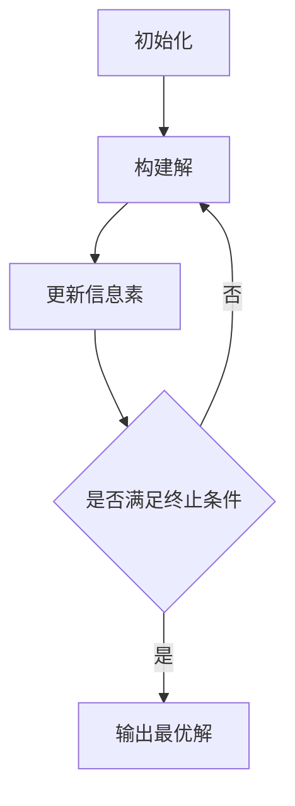

# 群体智能算法在智慧城市交通优化中的应用

> 关键词：群体智能算法、智慧城市、交通优化、蚁群算法、粒子群算法

> 摘要：本文围绕群体智能算法在智慧城市交通优化中的应用展开深入探讨。首先介绍了研究的背景、目的、预期读者等内容，阐述了群体智能算法及相关概念。接着详细讲解了核心算法原理，结合 Python 代码进行说明，同时给出了相关数学模型和公式并举例。通过项目实战展示了群体智能算法在交通优化中的具体实现过程，分析了代码的实现和解读。之后探讨了其实际应用场景，推荐了学习、开发工具及相关论文著作。最后总结了未来发展趋势与挑战，并对常见问题进行了解答，还提供了扩展阅读和参考资料，旨在为群体智能算法在智慧城市交通优化领域的研究和应用提供全面且深入的参考。

## 1. 背景介绍 
### 1.1 目的和范围
随着城市化进程的加速，城市交通问题日益突出，如交通拥堵、交通事故频发、交通环境污染等。智慧城市交通优化旨在通过先进的信息技术和智能算法，提高交通系统的运行效率、安全性和可持续性。群体智能算法作为一种模拟生物群体行为的智能优化算法，具有自组织、自适应、分布式等特点，为解决复杂的交通优化问题提供了新的思路和方法。

本文的研究范围主要聚焦于群体智能算法在智慧城市交通优化中的应用，包括交通流量分配、路径规划、信号控制等方面。通过对群体智能算法的原理、实现和应用案例的研究，探讨其在交通优化中的有效性和可行性。

### 1.2 预期读者
本文的预期读者包括交通工程领域的研究人员、智能交通系统的开发者、城市规划师以及对群体智能算法和智慧城市交通优化感兴趣的技术爱好者。希望本文能够为他们提供有关群体智能算法在交通优化中应用的理论知识和实践经验，促进相关领域的研究和发展。

### 1.3 文档结构概述
本文共分为十个部分，具体结构如下：
1. **背景介绍**：阐述研究的目的、范围、预期读者和文档结构概述，同时给出相关术语的定义和解释。
2. **核心概念与联系**：介绍群体智能算法、智慧城市交通优化的核心概念，以及它们之间的联系，并通过文本示意图和 Mermaid 流程图进行说明。
3. **核心算法原理 & 具体操作步骤**：详细讲解蚁群算法、粒子群算法等群体智能算法的原理，并给出 Python 源代码实现。
4. **数学模型和公式 & 详细讲解 & 举例说明**：建立群体智能算法在交通优化中的数学模型，给出相关公式，并通过具体例子进行说明。
5. **项目实战：代码实际案例和详细解释说明**：通过一个具体的交通优化项目，展示群体智能算法的实际应用过程，包括开发环境搭建、源代码实现和代码解读。
6. **实际应用场景**：探讨群体智能算法在智慧城市交通优化中的实际应用场景，如交通流量分配、路径规划、信号控制等。
7. **工具和资源推荐**：推荐学习群体智能算法和智慧城市交通优化的相关书籍、在线课程、技术博客和网站，以及开发工具、框架和相关论文著作。
8. **总结：未来发展趋势与挑战**：总结群体智能算法在智慧城市交通优化中的应用现状，分析未来发展趋势和面临的挑战。
9. **附录：常见问题与解答**：对读者可能关心的常见问题进行解答。
10. **扩展阅读 & 参考资料**：提供与群体智能算法和智慧城市交通优化相关的扩展阅读材料和参考资料。

### 1.4 术语表
#### 1.4.1 核心术语定义
- **群体智能算法**：是一种模拟生物群体行为的智能优化算法，通过个体之间的协作和信息共享来寻找最优解。常见的群体智能算法包括蚁群算法、粒子群算法、蜂群算法等。
- **智慧城市交通优化**：是指利用先进的信息技术和智能算法，对城市交通系统进行全面、深入的优化，以提高交通系统的运行效率、安全性和可持续性。
- **交通流量分配**：是指将交通需求合理地分配到不同的交通路径上，以达到交通系统的最优运行状态。
- **路径规划**：是指在给定起点和终点的情况下，寻找一条最优的交通路径，以满足用户的需求。
- **信号控制**：是指通过对交通信号灯的控制，优化交通流的运行，提高路口的通行能力。

#### 1.4.2 相关概念解释
- **自组织**：是指群体智能系统在没有外部控制的情况下，通过个体之间的相互作用和协作，自发地形成一种有序的结构和行为模式。
- **自适应**：是指群体智能系统能够根据环境的变化和问题的特点，自动调整自身的行为和策略，以适应不同的情况。
- **分布式**：是指群体智能系统中的个体在空间上是分散的，通过局部的信息交互和协作来完成全局的优化任务。

#### 1.4.3 缩略词列表
- **ACO**：Ant Colony Optimization，蚁群算法
- **PSO**：Particle Swarm Optimization，粒子群算法

## 2. 核心概念与联系 
### 2.1 群体智能算法
群体智能算法是一种基于生物群体行为的智能优化算法，它模拟了自然界中蚂蚁、蜜蜂、鸟群等生物群体的行为特点，通过个体之间的协作和信息共享来寻找最优解。群体智能算法具有以下特点：
- **自组织**：群体智能系统在没有外部控制的情况下，通过个体之间的相互作用和协作，自发地形成一种有序的结构和行为模式。
- **自适应**：群体智能系统能够根据环境的变化和问题的特点，自动调整自身的行为和策略，以适应不同的情况。
- **分布式**：群体智能系统中的个体在空间上是分散的，通过局部的信息交互和协作来完成全局的优化任务。

常见的群体智能算法包括蚁群算法、粒子群算法、蜂群算法等。下面以蚁群算法和粒子群算法为例，介绍群体智能算法的基本原理。

#### 2.1.1 蚁群算法
蚁群算法是由意大利学者 Dorigo 等人于 1991 年提出的一种模拟蚂蚁觅食行为的智能优化算法。蚂蚁在觅食过程中，会在路径上留下一种称为信息素的化学物质，其他蚂蚁可以通过感知信息素的浓度来选择路径。信息素浓度越高的路径，被蚂蚁选择的概率越大。随着时间的推移，蚂蚁会逐渐找到从蚁巢到食物源的最短路径。

蚁群算法的基本思想是通过模拟蚂蚁的觅食行为，在问题的解空间中寻找最优解。算法的主要步骤如下：
1. **初始化**：随机初始化蚂蚁的位置和信息素矩阵。
2. **构建解**：每只蚂蚁根据信息素浓度和启发式信息，选择下一个节点，直到构建出一个完整的解。
3. **更新信息素**：根据蚂蚁构建的解的质量，更新信息素矩阵。
4. **终止条件判断**：如果满足终止条件（如达到最大迭代次数），则算法结束，否则返回步骤 2。

#### 2.1.2 粒子群算法
粒子群算法是由美国学者 Kennedy 和 Eberhart 于 1995 年提出的一种模拟鸟群觅食行为的智能优化算法。鸟群在觅食过程中，每只鸟会根据自己的经验和其他鸟的信息，调整自己的飞行方向和速度，以寻找食物源。粒子群算法将问题的解看作是搜索空间中的一个粒子，每个粒子具有位置和速度两个属性。粒子通过跟踪自己的历史最优位置和群体的历史最优位置，不断更新自己的位置和速度，以寻找最优解。

粒子群算法的基本思想是通过模拟鸟群的觅食行为，在问题的解空间中寻找最优解。算法的主要步骤如下：
1. **初始化**：随机初始化粒子的位置和速度。
2. **计算适应度值**：计算每个粒子的适应度值，评估其解的质量。
3. **更新个体最优位置和全局最优位置**：根据粒子的适应度值，更新每个粒子的个体最优位置和群体的全局最优位置。
4. **更新粒子的速度和位置**：根据个体最优位置和全局最优位置，更新粒子的速度和位置。
5. **终止条件判断**：如果满足终止条件（如达到最大迭代次数），则算法结束，否则返回步骤 2。

### 2.2 智慧城市交通优化
智慧城市交通优化是指利用先进的信息技术和智能算法，对城市交通系统进行全面、深入的优化，以提高交通系统的运行效率、安全性和可持续性。智慧城市交通优化的主要目标包括：
- **提高交通流量**：通过合理的交通流量分配和路径规划，提高道路的通行能力，减少交通拥堵。
- **降低交通事故率**：通过智能的交通信号控制和交通管理，提高交通安全性，减少交通事故的发生。
- **减少交通环境污染**：通过优化交通流量和路径规划，减少车辆的行驶里程和怠速时间，降低交通环境污染。

智慧城市交通优化涉及到多个方面的内容，包括交通流量分配、路径规划、信号控制等。下面分别介绍这些方面的基本概念和方法。

#### 2.2.1 交通流量分配
交通流量分配是指将交通需求合理地分配到不同的交通路径上，以达到交通系统的最优运行状态。交通流量分配的主要方法包括用户均衡分配法、系统最优分配法等。用户均衡分配法是指在交通网络中，每个用户都选择自己的最短路径，以达到个体的最优。系统最优分配法是指在交通网络中，通过优化交通流量的分配，使整个交通系统的总运行时间最短，以达到系统的最优。

#### 2.2.2 路径规划
路径规划是指在给定起点和终点的情况下，寻找一条最优的交通路径，以满足用户的需求。路径规划的主要方法包括 Dijkstra 算法、A* 算法等。Dijkstra 算法是一种经典的最短路径算法，它通过不断扩展节点，寻找从起点到终点的最短路径。A* 算法是一种启发式搜索算法，它在 Dijkstra 算法的基础上，引入了启发式函数，以提高搜索效率。

#### 2.2.3 信号控制
信号控制是指通过对交通信号灯的控制，优化交通流的运行，提高路口的通行能力。信号控制的主要方法包括定时控制、感应控制、自适应控制等。定时控制是指根据交通流量的统计数据，预先设置信号灯的配时方案。感应控制是指根据路口的实时交通流量，动态调整信号灯的配时方案。自适应控制是指根据交通系统的实时状态，自动调整信号灯的配时方案，以达到最优的控制效果。

### 2.3 群体智能算法与智慧城市交通优化的联系
群体智能算法与智慧城市交通优化之间存在着密切的联系。群体智能算法的自组织、自适应、分布式等特点，使其非常适合解决复杂的交通优化问题。例如，蚁群算法可以用于交通流量分配和路径规划，通过模拟蚂蚁的觅食行为，寻找最优的交通路径和流量分配方案。粒子群算法可以用于信号控制，通过模拟鸟群的觅食行为，优化信号灯的配时方案，提高路口的通行能力。

群体智能算法在智慧城市交通优化中的应用，可以提高交通系统的运行效率、安全性和可持续性。同时，交通优化问题的复杂性和动态性，也为群体智能算法的研究和发展提供了新的挑战和机遇。

### 2.4 文本示意图和 Mermaid 流程图
#### 2.4.1 文本示意图
群体智能算法与智慧城市交通优化的关系可以用以下文本示意图表示：

```plaintext
群体智能算法
├── 蚁群算法
│   └── 应用于交通流量分配、路径规划
├── 粒子群算法
│   └── 应用于信号控制
└── 其他群体智能算法

智慧城市交通优化
├── 交通流量分配
├── 路径规划
└── 信号控制
```

#### 2.4.2 Mermaid 流程图
下面是一个简单的蚁群算法在交通路径规划中的应用流程图：



## 3. 核心算法原理 & 具体操作步骤 
### 3.1 蚁群算法原理及 Python 实现
#### 3.1.1 蚁群算法原理
蚁群算法的基本原理是模拟蚂蚁的觅食行为。蚂蚁在觅食过程中，会在路径上留下信息素，其他蚂蚁可以通过感知信息素的浓度来选择路径。信息素浓度越高的路径，被蚂蚁选择的概率越大。随着时间的推移，蚂蚁会逐渐找到从蚁巢到食物源的最短路径。

蚁群算法的数学模型可以用以下公式表示：

- **状态转移概率**：蚂蚁 $k$ 在节点 $i$ 选择节点 $j$ 作为下一个节点的概率为：
$$
p_{ij}^k(t)=\begin{cases}
\frac{[\tau_{ij}(t)]^\alpha[\eta_{ij}]^\beta}{\sum_{s\in allowed_k}[\tau_{is}(t)]^\alpha[\eta_{is}]^\beta}, & j\in allowed_k \\
0, & j\notin allowed_k
\end{cases}
$$
其中，$\tau_{ij}(t)$ 表示 $t$ 时刻路径 $(i,j)$ 上的信息素浓度，$\eta_{ij}$ 表示启发式信息，通常取为 $\frac{1}{d_{ij}}$，$d_{ij}$ 表示节点 $i$ 到节点 $j$ 的距离，$\alpha$ 和 $\beta$ 是控制信息素和启发式信息相对重要性的参数，$allowed_k$ 表示蚂蚁 $k$ 还未访问过的节点集合。

- **信息素更新**：信息素的更新公式为：
$$
\tau_{ij}(t+1)=(1-\rho)\tau_{ij}(t)+\Delta\tau_{ij}(t)
$$
其中，$\rho$ 是信息素挥发系数，$0\leq\rho\leq1$，$\Delta\tau_{ij}(t)$ 表示 $t$ 时刻路径 $(i,j)$ 上信息素的增量，通常取为：
$$
\Delta\tau_{ij}(t)=\sum_{k=1}^{m}\Delta\tau_{ij}^k(t)
$$
其中，$m$ 是蚂蚁的数量，$\Delta\tau_{ij}^k(t)$ 表示第 $k$ 只蚂蚁在 $t$ 时刻对路径 $(i,j)$ 上信息素的贡献，通常取为：
$$
\Delta\tau_{ij}^k(t)=\begin{cases}
\frac{Q}{L_k}, & \text{如果蚂蚁 } k \text{ 经过路径 } (i,j) \\
0, & \text{否则}
\end{cases}
$$
其中，$Q$ 是信息素强度，$L_k$ 是第 $k$ 只蚂蚁的路径长度。

#### 3.1.2 Python 实现
以下是一个简单的蚁群算法在交通路径规划中的 Python 实现：

```python
import numpy as np
import random

# 定义蚁群算法类
class AntColonyOptimization:
    def __init__(self, num_ants, num_iterations, alpha, beta, rho, Q, distance_matrix):
        self.num_ants = num_ants  # 蚂蚁数量
        self.num_iterations = num_iterations  # 迭代次数
        self.alpha = alpha  # 信息素重要程度因子
        self.beta = beta  # 启发式信息重要程度因子
        self.rho = rho  # 信息素挥发系数
        self.Q = Q  # 信息素强度
        self.distance_matrix = distance_matrix  # 距离矩阵
        self.num_cities = len(distance_matrix)  # 城市数量
        self.pheromone_matrix = np.ones((self.num_cities, self.num_cities))  # 信息素矩阵

    # 计算启发式信息
    def heuristic_info(self, i, j):
        return 1 / self.distance_matrix[i][j]

    # 选择下一个城市
    def select_next_city(self, ant_path, current_city):
        unvisited_cities = [city for city in range(self.num_cities) if city not in ant_path]
        probabilities = []
        for city in unvisited_cities:
            pheromone = self.pheromone_matrix[current_city][city]
            heuristic = self.heuristic_info(current_city, city)
            probability = (pheromone ** self.alpha) * (heuristic ** self.beta)
            probabilities.append(probability)
        total_probability = sum(probabilities)
        probabilities = [p / total_probability for p in probabilities]
        next_city_index = np.random.choice(len(unvisited_cities), p=probabilities)
        next_city = unvisited_cities[next_city_index]
        return next_city

    # 构建蚂蚁路径
    def construct_ant_path(self):
        ant_path = [random.randint(0, self.num_cities - 1)]
        while len(ant_path) < self.num_cities:
            current_city = ant_path[-1]
            next_city = self.select_next_city(ant_path, current_city)
            ant_path.append(next_city)
        ant_path.append(ant_path[0])  # 回到起点
        return ant_path

    # 计算路径长度
    def calculate_path_length(self, path):
        length = 0
        for i in range(len(path) - 1):
            length += self.distance_matrix[path[i]][path[i + 1]]
        return length

    # 更新信息素
    def update_pheromone(self, ant_paths):
        self.pheromone_matrix *= (1 - self.rho)
        for path in ant_paths:
            length = self.calculate_path_length(path)
            for i in range(len(path) - 1):
                self.pheromone_matrix[path[i]][path[i + 1]] += self.Q / length
                self.pheromone_matrix[path[i + 1]][path[i]] += self.Q / length

    # 运行蚁群算法
    def run(self):
        best_path = None
        best_length = float('inf')
        for _ in range(self.num_iterations):
            ant_paths = []
            for _ in range(self.num_ants):
                path = self.construct_ant_path()
                ant_paths.append(path)
            self.update_pheromone(ant_paths)
            for path in ant_paths:
                length = self.calculate_path_length(path)
                if length < best_length:
                    best_length = length
                    best_path = path
        return best_path, best_length
```

### 3.2 粒子群算法原理及 Python 实现
#### 3.2.1 粒子群算法原理
粒子群算法的基本原理是模拟鸟群的觅食行为。每个粒子代表一个潜在的解，具有位置和速度两个属性。粒子通过跟踪自己的历史最优位置和群体的历史最优位置，不断更新自己的位置和速度，以寻找最优解。

粒子群算法的数学模型可以用以下公式表示：

- **速度更新公式**：
$$
v_{i}^{t + 1}=w v_{i}^{t}+c_1 r_1(p_{best_i}-x_{i}^{t})+c_2 r_2(g_{best}-x_{i}^{t})
$$
其中，$v_{i}^{t}$ 表示粒子 $i$ 在 $t$ 时刻的速度，$w$ 是惯性权重，$c_1$ 和 $c_2$ 是加速常数，$r_1$ 和 $r_2$ 是 $[0,1]$ 之间的随机数，$p_{best_i}$ 表示粒子 $i$ 的历史最优位置，$g_{best}$ 表示群体的历史最优位置，$x_{i}^{t}$ 表示粒子 $i$ 在 $t$ 时刻的位置。

- **位置更新公式**：
$$
x_{i}^{t + 1}=x_{i}^{t}+v_{i}^{t + 1}
$$

#### 3.2.2 Python 实现
以下是一个简单的粒子群算法在交通信号控制中的 Python 实现：

```python
import numpy as np

# 定义粒子群算法类
class ParticleSwarmOptimization:
    def __init__(self, num_particles, num_iterations, dimensions, w, c1, c2, fitness_function):
        self.num_particles = num_particles  # 粒子数量
        self.num_iterations = num_iterations  # 迭代次数
        self.dimensions = dimensions  # 解的维度
        self.w = w  # 惯性权重
        self.c1 = c1  # 个体学习因子
        self.c2 = c2  # 社会学习因子
        self.fitness_function = fitness_function  # 适应度函数
        self.particles = np.random.uniform(0, 1, (num_particles, dimensions))  # 粒子位置
        self.velocities = np.random.uniform(-1, 1, (num_particles, dimensions))  # 粒子速度
        self.pbest_positions = self.particles.copy()  # 个体最优位置
        self.pbest_fitness = np.array([self.fitness_function(p) for p in self.particles])  # 个体最优适应度
        self.gbest_index = np.argmin(self.pbest_fitness)  # 全局最优粒子索引
        self.gbest_position = self.pbest_positions[self.gbest_index]  # 全局最优位置
        self.gbest_fitness = self.pbest_fitness[self.gbest_index]  # 全局最优适应度

    # 更新粒子速度和位置
    def update_particles(self):
        r1 = np.random.uniform(0, 1, (self.num_particles, self.dimensions))
        r2 = np.random.uniform(0, 1, (self.num_particles, self.dimensions))
        self.velocities = self.w * self.velocities + \
                          self.c1 * r1 * (self.pbest_positions - self.particles) + \
                          self.c2 * r2 * (self.gbest_position - self.particles)
        self.particles += self.velocities

    # 更新个体最优和全局最优
    def update_best_positions(self):
        for i in range(self.num_particles):
            fitness = self.fitness_function(self.particles[i])
            if fitness < self.pbest_fitness[i]:
                self.pbest_fitness[i] = fitness
                self.pbest_positions[i] = self.particles[i]
                if fitness < self.gbest_fitness:
                    self.gbest_fitness = fitness
                    self.gbest_index = i
                    self.gbest_position = self.pbest_positions[self.gbest_index]

    # 运行粒子群算法
    def run(self):
        for _ in range(self.num_iterations):
            self.update_particles()
            self.update_best_positions()
        return self.gbest_position, self.gbest_fitness
```

## 4. 数学模型和公式 & 详细讲解 & 举例说明 
### 4.1 蚁群算法数学模型和公式
#### 4.1.1 状态转移概率公式
蚁群算法中，蚂蚁 $k$ 在节点 $i$ 选择节点 $j$ 作为下一个节点的概率公式为：
$$
p_{ij}^k(t)=\begin{cases}
\frac{[\tau_{ij}(t)]^\alpha[\eta_{ij}]^\beta}{\sum_{s\in allowed_k}[\tau_{is}(t)]^\alpha[\eta_{is}]^\beta}, & j\in allowed_k \\
0, & j\notin allowed_k
\end{cases}
$$

- **详细讲解**：
  - $\tau_{ij}(t)$ 表示 $t$ 时刻路径 $(i,j)$ 上的信息素浓度，信息素浓度越高，蚂蚁选择该路径的概率越大。
  - $\eta_{ij}$ 表示启发式信息，通常取为 $\frac{1}{d_{ij}}$，其中 $d_{ij}$ 表示节点 $i$ 到节点 $j$ 的距离，距离越短，启发式信息越大，蚂蚁选择该路径的概率也越大。
  - $\alpha$ 和 $\beta$ 是控制信息素和启发式信息相对重要性的参数。$\alpha$ 越大，信息素的影响越大；$\beta$ 越大，启发式信息的影响越大。
  - $allowed_k$ 表示蚂蚁 $k$ 还未访问过的节点集合，蚂蚁只能在未访问过的节点中选择下一个节点。

- **举例说明**：
假设有一个包含 3 个节点的交通网络，节点之间的距离矩阵为：
$$
D=\begin{bmatrix}
0 & 10 & 15 \\
10 & 0 & 20 \\
15 & 20 & 0
\end{bmatrix}
$$
初始信息素矩阵为：
$$
\tau=\begin{bmatrix}
0 & 1 & 1 \\
1 & 0 & 1 \\
1 & 1 & 0
\end{bmatrix}
$$
设 $\alpha = 1$，$\beta = 2$，蚂蚁 $k$ 当前位于节点 1，还未访问过的节点集合为 $\{2, 3\}$。

计算启发式信息：
$$
\eta_{12}=\frac{1}{d_{12}}=\frac{1}{10}=0.1
$$
$$
\eta_{13}=\frac{1}{d_{13}}=\frac{1}{15}\approx0.067
$$

计算状态转移概率：
$$
p_{12}^k=\frac{[\tau_{12}]^\alpha[\eta_{12}]^\beta}{[\tau_{12}]^\alpha[\eta_{12}]^\beta+[\tau_{13}]^\alpha[\eta_{13}]^\beta}=\frac{1^1\times0.1^2}{1^1\times0.1^2+1^1\times0.067^2}\approx0.7
$$
$$
p_{13}^k=\frac{[\tau_{13}]^\alpha[\eta_{13}]^\beta}{[\tau_{12}]^\alpha[\eta_{12}]^\beta+[\tau_{13}]^\alpha[\eta_{13}]^\beta}=\frac{1^1\times0.067^2}{1^1\times0.1^2+1^1\times0.067^2}\approx0.3
$$

因此，蚂蚁 $k$ 选择节点 2 的概率约为 0.7，选择节点 3 的概率约为 0.3。

#### 4.1.2 信息素更新公式
信息素的更新公式为：
$$
\tau_{ij}(t+1)=(1-\rho)\tau_{ij}(t)+\Delta\tau_{ij}(t)
$$
其中，$\Delta\tau_{ij}(t)=\sum_{k=1}^{m}\Delta\tau_{ij}^k(t)$，$\Delta\tau_{ij}^k(t)=\begin{cases}
\frac{Q}{L_k}, & \text{如果蚂蚁 } k \text{ 经过路径 } (i,j) \\
0, & \text{否则}
\end{cases}$

- **详细讲解**：
  - $\rho$ 是信息素挥发系数，$0\leq\rho\leq1$，表示信息素随时间的挥发程度。$\rho$ 越大，信息素挥发越快。
  - $(1 - \rho)\tau_{ij}(t)$ 表示信息素挥发后剩余的部分。
  - $\Delta\tau_{ij}(t)$ 表示 $t$ 时刻路径 $(i,j)$ 上信息素的增量，是所有经过该路径的蚂蚁对信息素的贡献之和。
  - $\Delta\tau_{ij}^k(t)$ 表示第 $k$ 只蚂蚁在 $t$ 时刻对路径 $(i,j)$ 上信息素的贡献，与蚂蚁的路径长度 $L_k$ 成反比，路径越短，贡献越大。

- **举例说明**：
假设有 2 只蚂蚁，它们的路径分别为 $1\rightarrow2\rightarrow3\rightarrow1$ 和 $1\rightarrow3\rightarrow2\rightarrow1$，路径长度分别为 $L_1 = 10 + 20 + 15 = 45$ 和 $L_2 = 15 + 20 + 10 = 45$，设 $Q = 100$，$\rho = 0.1$，初始信息素矩阵为：
$$
\tau=\begin{bmatrix}
0 & 1 & 1 \\
1 & 0 & 1 \\
1 & 1 & 0
\end{bmatrix}
$$

计算信息素增量：
对于路径 $(1, 2)$，蚂蚁 1 经过该路径，蚂蚁 2 也经过该路径，所以：
$$
\Delta\tau_{12}=\Delta\tau_{12}^1+\Delta\tau_{12}^2=\frac{Q}{L_1}+\frac{Q}{L_2}=\frac{100}{45}+\frac{100}{45}\approx4.44
$$

更新信息素：
$$
\tau_{12}(t + 1)=(1 - \rho)\tau_{12}(t)+\Delta\tau_{12}=(1 - 0.1)\times1 + 4.44 = 5.34
$$

### 4.2 粒子群算法数学模型和公式
#### 4.2.1 速度更新公式
粒子群算法中，粒子 $i$ 在 $t$ 时刻的速度更新公式为：
$$
v_{i}^{t + 1}=w v_{i}^{t}+c_1 r_1(p_{best_i}-x_{i}^{t})+c_2 r_2(g_{best}-x_{i}^{t})
$$

- **详细讲解**：
  - $w$ 是惯性权重，控制粒子对当前速度的继承程度。$w$ 越大，粒子越倾向于保持当前的速度；$w$ 越小，粒子越容易受到个体最优和全局最优的影响。
  - $c_1$ 和 $c_2$ 是加速常数，分别控制粒子向个体最优位置和全局最优位置飞行的步长。
  - $r_1$ 和 $r_2$ 是 $[0,1]$ 之间的随机数，增加了粒子搜索的随机性。
  - $p_{best_i}$ 表示粒子 $i$ 的历史最优位置，$g_{best}$ 表示群体的历史最优位置，$x_{i}^{t}$ 表示粒子 $i$ 在 $t$ 时刻的位置。

- **举例说明**：
假设有一个二维的粒子群优化问题，粒子 $i$ 在 $t$ 时刻的位置为 $x_{i}^{t}=(2, 3)$，速度为 $v_{i}^{t}=(1, 2)$，个体最优位置为 $p_{best_i}=(5, 6)$，全局最优位置为 $g_{best}=(4, 5)$，设 $w = 0.8$，$c_1 = 1.5$，$c_2 = 1.5$，$r_1 = 0.6$，$r_2 = 0.7$。

计算速度更新：
$$
v_{i1}^{t + 1}=w v_{i1}^{t}+c_1 r_1(p_{best_i1}-x_{i1}^{t})+c_2 r_2(g_{best1}-x_{i1}^{t})
$$
$$
=0.8\times1 + 1.5\times0.6\times(5 - 2)+1.5\times0.7\times(4 - 2)
$$
$$
=0.8 + 2.7 + 2.1 = 5.6
$$

$$
v_{i2}^{t + 1}=w v_{i2}^{t}+c_1 r_1(p_{best_i2}-x_{i2}^{t})+c_2 r_2(g_{best2}-x_{i2}^{t})
$$
$$
=0.8\times2 + 1.5\times0.6\times(6 - 3)+1.5\times0.7\times(5 - 3)
$$
$$
=1.6 + 2.7 + 2.1 = 6.4
$$

因此，粒子 $i$ 在 $t + 1$ 时刻的速度为 $v_{i}^{t + 1}=(5.6, 6.4)$。

#### 4.2.2 位置更新公式
粒子群算法中，粒子 $i$ 在 $t$ 时刻的位置更新公式为：
$$
x_{i}^{t + 1}=x_{i}^{t}+v_{i}^{t + 1}
$$

- **详细讲解**：
粒子的位置更新是在当前位置的基础上，加上更新后的速度。

- **举例说明**：
继续上面的例子，粒子 $i$ 在 $t$ 时刻的位置为 $x_{i}^{t}=(2, 3)$，在 $t + 1$ 时刻的速度为 $v_{i}^{t + 1}=(5.6, 6.4)$。

计算位置更新：
$$
x_{i1}^{t + 1}=x_{i1}^{t}+v_{i1}^{t + 1}=2 + 5.6 = 7.6
$$
$$
x_{i2}^{t + 1}=x_{i2}^{t}+v_{i2}^{t + 1}=3 + 6.4 = 9.4
$$

因此，粒子 $i$ 在 $t + 1$ 时刻的位置为 $x_{i}^{t + 1}=(7.6, 9.4)$。

## 5. 项目实战：代码实际案例和详细解释说明 
### 5.1  开发环境搭建
本项目的开发环境主要包括以下几个部分：
- **操作系统**：可以选择 Windows、Linux 或 macOS 等主流操作系统。
- **编程语言**：使用 Python 作为开发语言，Python 具有丰富的科学计算库和易于学习的特点。
- **开发工具**：推荐使用 PyCharm 作为集成开发环境（IDE），它提供了代码编辑、调试、运行等功能，方便开发和调试代码。
- **依赖库**：需要安装 numpy 库，用于进行数值计算。可以使用以下命令安装：
```sh
pip install numpy
```

### 5.2  源代码详细实现和代码解读
#### 5.2.1 蚁群算法在交通路径规划中的应用
以下是一个完整的蚁群算法在交通路径规划中的应用代码示例：

```python
import numpy as np
import random

# 定义蚁群算法类
class AntColonyOptimization:
    def __init__(self, num_ants, num_iterations, alpha, beta, rho, Q, distance_matrix):
        self.num_ants = num_ants  # 蚂蚁数量
        self.num_iterations = num_iterations  # 迭代次数
        self.alpha = alpha  # 信息素重要程度因子
        self.beta = beta  # 启发式信息重要程度因子
        self.rho = rho  # 信息素挥发系数
        self.Q = Q  # 信息素强度
        self.distance_matrix = distance_matrix  # 距离矩阵
        self.num_cities = len(distance_matrix)  # 城市数量
        self.pheromone_matrix = np.ones((self.num_cities, self.num_cities))  # 信息素矩阵

    # 计算启发式信息
    def heuristic_info(self, i, j):
        return 1 / self.distance_matrix[i][j]

    # 选择下一个城市
    def select_next_city(self, ant_path, current_city):
        unvisited_cities = [city for city in range(self.num_cities) if city not in ant_path]
        probabilities = []
        for city in unvisited_cities:
            pheromone = self.pheromone_matrix[current_city][city]
            heuristic = self.heuristic_info(current_city, city)
            probability = (pheromone ** self.alpha) * (heuristic ** self.beta)
            probabilities.append(probability)
        total_probability = sum(probabilities)
        probabilities = [p / total_probability for p in probabilities]
        next_city_index = np.random.choice(len(unvisited_cities), p=probabilities)
        next_city = unvisited_cities[next_city_index]
        return next_city

    # 构建蚂蚁路径
    def construct_ant_path(self):
        ant_path = [random.randint(0, self.num_cities - 1)]
        while len(ant_path) < self.num_cities:
            current_city = ant_path[-1]
            next_city = self.select_next_city(ant_path, current_city)
            ant_path.append(next_city)
        ant_path.append(ant_path[0])  # 回到起点
        return ant_path

    # 计算路径长度
    def calculate_path_length(self, path):
        length = 0
        for i in range(len(path) - 1):
            length += self.distance_matrix[path[i]][path[i + 1]]
        return length

    # 更新信息素
    def update_pheromone(self, ant_paths):
        self.pheromone_matrix *= (1 - self.rho)
        for path in ant_paths:
            length = self.calculate_path_length(path)
            for i in range(len(path) - 1):
                self.pheromone_matrix[path[i]][path[i + 1]] += self.Q / length
                self.pheromone_matrix[path[i + 1]][path[i]] += self.Q / length

    # 运行蚁群算法
    def run(self):
        best_path = None
        best_length = float('inf')
        for _ in range(self.num_iterations):
            ant_paths = []
            for _ in range(self.num_ants):
                path = self.construct_ant_path()
                ant_paths.append(path)
            self.update_pheromone(ant_paths)
            for path in ant_paths:
                length = self.calculate_path_length(path)
                if length < best_length:
                    best_length = length
                    best_path = path
        return best_path, best_length

# 示例距离矩阵
distance_matrix = np.array([
    [0, 10, 15, 20],
    [10, 0, 35, 25],
    [15, 35, 0, 30],
    [20, 25, 30, 0]
])

# 初始化蚁群算法
aco = AntColonyOptimization(num_ants=10, num_iterations=100, alpha=1, beta=2, rho=0.1, Q=100, distance_matrix=distance_matrix)

# 运行算法
best_path, best_length = aco.run()

print("最优路径:", best_path)
print("最优路径长度:", best_length)
```

#### 5.2.2 代码解读
- **`__init__` 方法**：初始化蚁群算法的参数，包括蚂蚁数量、迭代次数、信息素重要程度因子、启发式信息重要程度因子、信息素挥发系数、信息素强度、距离矩阵等，并初始化信息素矩阵。
- **`heuristic_info` 方法**：计算启发式信息，即节点之间距离的倒数。
- **`select_next_city` 方法**：根据信息素浓度和启发式信息，计算每个未访问节点的选择概率，并随机选择下一个节点。
- **`construct_ant_path` 方法**：构建蚂蚁的路径，从随机选择的节点开始，依次选择下一个节点，直到访问完所有节点，最后回到起点。
- **`calculate_path_length` 方法**：计算蚂蚁路径的长度。
- **`update_pheromone` 方法**：根据蚂蚁的路径长度，更新信息素矩阵。信息素挥发一部分，然后增加经过该路径的蚂蚁留下的信息素。
- **`run` 方法**：运行蚁群算法，迭代多次，每次构建所有蚂蚁的路径，更新信息素矩阵，并记录最优路径和最优路径长度。

#### 5.2.3 粒子群算法在交通信号控制中的应用
以下是一个完整的粒子群算法在交通信号控制中的应用代码示例：

```python
import numpy as np

# 定义适应度函数（示例）
def fitness_function(x):
    # 这里简单地将解的平方和作为适应度值，实际应用中需要根据具体问题定义
    return np.sum(x ** 2)

# 定义粒子群算法类
class ParticleSwarmOptimization:
    def __init__(self, num_particles, num_iterations, dimensions, w, c1, c2, fitness_function):
        self.num_particles = num_particles  # 粒子数量
        self.num_iterations = num_iterations  # 迭代次数
        self.dimensions = dimensions  # 解的维度
        self.w = w  # 惯性权重
        self.c1 = c1  # 个体学习因子
        self.c2 = c2  # 社会学习因子
        self.fitness_function = fitness_function  # 适应度函数
        self.particles = np.random.uniform(0, 1, (num_particles, dimensions))  # 粒子位置
        self.velocities = np.random.uniform(-1, 1, (num_particles, dimensions))  # 粒子速度
        self.pbest_positions = self.particles.copy()  # 个体最优位置
        self.pbest_fitness = np.array([self.fitness_function(p) for p in self.particles])  # 个体最优适应度
        self.gbest_index = np.argmin(self.pbest_fitness)  # 全局最优粒子索引
        self.gbest_position = self.pbest_positions[self.gbest_index]  # 全局最优位置
        self.gbest_fitness = self.pbest_fitness[self.gbest_index]  # 全局最优适应度

    # 更新粒子速度和位置
    def update_particles(self):
        r1 = np.random.uniform(0, 1, (self.num_particles, self.dimensions))
        r2 = np.random.uniform(0, 1, (self.num_particles, self.dimensions))
        self.velocities = self.w * self.velocities + \
                          self.c1 * r1 * (self.pbest_positions - self.particles) + \
                          self.c2 * r2 * (self.gbest_position - self.particles)
        self.particles += self.velocities

    # 更新个体最优和全局最优
    def update_best_positions(self):
        for i in range(self.num_particles):
            fitness = self.fitness_function(self.particles[i])
            if fitness < self.pbest_fitness[i]:
                self.pbest_fitness[i] = fitness
                self.pbest_positions[i] = self.particles[i]
                if fitness < self.gbest_fitness:
                    self.gbest_fitness = fitness
                    self.gbest_index = i
                    self.gbest_position = self.pbest_positions[self.gbest_index]

    # 运行粒子群算法
    def run(self):
        for _ in range(self.num_iterations):
            self.update_particles()
            self.update_best_positions()
        return self.gbest_position, self.gbest_fitness

# 初始化粒子群算法
pso = ParticleSwarmOptimization(num_particles=20, num_iterations=100, dimensions=5, w=0.8, c1=1.5, c2=1.5, fitness_function=fitness_function)

# 运行算法
best_position, best_fitness = pso.run()

print("最优位置:", best_position)
print("最优适应度:", best_fitness)
```

#### 5.2.4 代码解读
- **`__init__` 方法**：初始化粒子群算法的参数，包括粒子数量、迭代次数、解的维度、惯性权重、个体学习因子、社会学习因子、适应度函数等，并初始化粒子的位置、速度、个体最优位置和全局最优位置。
- **`update_particles