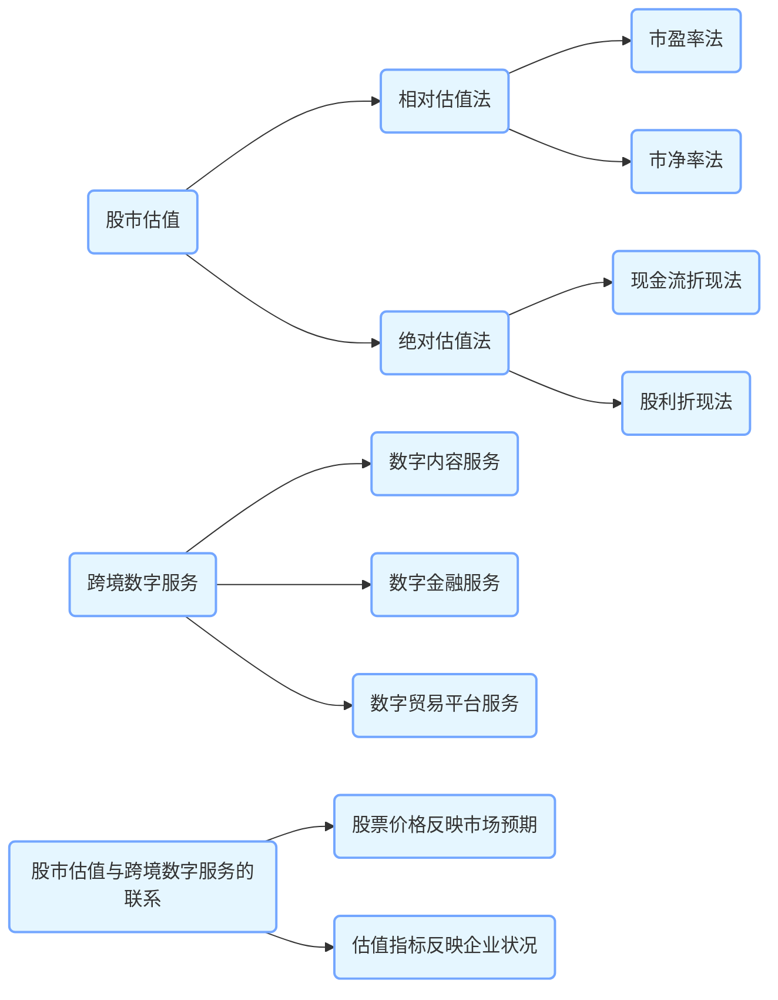

# 股市估值在跨境数字服务价值评估中的应用

> 关键词：股市估值、跨境数字服务、价值评估、金融模型、市场分析

> 摘要：本文聚焦于股市估值在跨境数字服务价值评估中的应用。随着数字经济的蓬勃发展，跨境数字服务在全球经济中占据愈发重要的地位，准确评估其价值具有关键意义。股市估值作为一种成熟且广泛应用的金融评估方法，为跨境数字服务价值评估提供了新的视角和途径。文章深入探讨股市估值的核心概念、相关算法原理，结合数学模型详细阐述其在跨境数字服务价值评估中的应用，通过项目实战案例展示具体操作和分析过程，同时介绍了实际应用场景、相关工具和资源，最后对未来发展趋势与挑战进行总结，旨在为相关领域的研究和实践提供全面且深入的参考。

## 1. 背景介绍 
### 1.1 目的和范围
本研究的目的在于深入探究股市估值在跨境数字服务价值评估中的具体应用方式和效果。随着全球化和数字化的加速推进，跨境数字服务行业呈现出快速增长的态势。然而，由于跨境数字服务的特殊性，如无形性、高创新性、跨越不同法律和市场环境等，其价值评估面临诸多挑战。股市估值方法经过长期发展和实践检验，具有一定的科学性和可靠性，将其应用于跨境数字服务价值评估，有助于更准确地衡量该类服务的价值，为投资者、企业管理者和监管机构提供决策依据。

本研究的范围涵盖了股市估值的主要方法，如市盈率法、市净率法、现金流折现法等，以及跨境数字服务的主要类型，包括数字内容服务、数字金融服务、数字贸易平台服务等。同时，研究将结合实际案例，分析不同股市估值方法在跨境数字服务价值评估中的适用性和局限性。

### 1.2 预期读者
本文的预期读者包括金融领域的专业人士，如投资分析师、基金经理、风险投资家等，他们可以从中获取关于跨境数字服务投资价值评估的新方法和思路；跨境数字服务企业的管理者，有助于他们更好地理解自身企业的价值，制定合理的发展战略和融资策略；学术界的研究人员，为相关领域的学术研究提供参考和借鉴；以及对数字经济和金融投资感兴趣的一般读者，帮助他们了解跨境数字服务价值评估的相关知识和方法。

### 1.3 文档结构概述
本文共分为十个部分。第一部分为背景介绍，阐述研究的目的、范围、预期读者和文档结构概述，并对相关术语进行解释。第二部分介绍股市估值和跨境数字服务的核心概念与联系，通过文本示意图和 Mermaid 流程图展示其关系。第三部分详细讲解股市估值的核心算法原理，并给出具体操作步骤，同时用 Python 源代码进行阐述。第四部分介绍相关的数学模型和公式，进行详细讲解并举例说明。第五部分通过项目实战，展示代码实际案例并进行详细解释说明，包括开发环境搭建、源代码实现和代码解读。第六部分介绍股市估值在跨境数字服务价值评估中的实际应用场景。第七部分推荐相关的工具和资源，包括学习资源、开发工具框架和相关论文著作。第八部分总结未来发展趋势与挑战。第九部分为附录，解答常见问题。第十部分提供扩展阅读和参考资料。

### 1.4 术语表
#### 1.4.1 核心术语定义
- **股市估值**：是指对股票的价值进行评估的过程和方法，通过分析公司的财务状况、经营业绩、市场前景等因素，确定股票的合理价格。
- **跨境数字服务**：指通过互联网等数字技术，跨越国界提供的各类服务，包括但不限于软件服务、在线教育、远程医疗、数字媒体等。
- **价值评估**：是指对资产、企业或项目的经济价值进行估算和判断的过程，以确定其在特定时间和市场条件下的价值。

#### 1.4.2 相关概念解释
- **市盈率（P/E）**：是指股票价格与每股收益的比率，反映了投资者为获取公司每一元盈利所愿意支付的价格。
- **市净率（P/B）**：是指股票价格与每股净资产的比率，用于衡量股票的市场价值相对于其账面价值的高低。
- **现金流折现法（DCF）**：是一种通过预测资产未来的现金流，并将其折现到当前时刻来计算资产价值的方法。

#### 1.4.3 缩略词列表
- **P/E**：Price-to-Earnings Ratio（市盈率）
- **P/B**：Price-to-Book Ratio（市净率）
- **DCF**：Discounted Cash Flow（现金流折现法）

## 2. 核心概念与联系 
### 2.1 股市估值核心概念
股市估值是金融领域的重要概念，其目的是确定股票的内在价值，从而为投资者提供投资决策依据。常见的股市估值方法包括相对估值法和绝对估值法。

相对估值法是通过比较同行业或类似公司的相关指标来评估股票的价值，如市盈率法、市净率法等。市盈率法是将股票价格与每股收益进行比较，市盈率越高，表明市场对该公司的预期越高，但也可能意味着股票被高估。市净率法是将股票价格与每股净资产进行比较，市净率较低的股票可能被低估。

绝对估值法是通过预测公司未来的现金流或股利，并将其折现到当前时刻来计算股票的价值，如现金流折现法、股利折现法等。现金流折现法是最常用的绝对估值方法，它假设公司的价值等于其未来自由现金流的现值之和。

### 2.2 跨境数字服务核心概念
跨境数字服务是数字经济时代的产物，具有无形性、高创新性、跨越国界等特点。跨境数字服务的类型繁多，包括数字内容服务，如在线音乐、视频、游戏等；数字金融服务，如跨境支付、数字货币交易等；数字贸易平台服务，如跨境电商平台等。

跨境数字服务的价值受到多种因素的影响，如技术创新能力、用户规模、市场份额、品牌影响力等。由于跨境数字服务的特殊性，其价值评估需要考虑更多的因素，如不同国家和地区的法律、政策、文化差异等。

### 2.3 股市估值与跨境数字服务的联系
股市估值方法可以应用于跨境数字服务价值评估，为评估跨境数字服务企业的价值提供参考。一方面，跨境数字服务企业的股票价格反映了市场对其未来发展前景的预期，通过股市估值方法可以分析股票价格是否合理，从而评估企业的价值。另一方面，股市估值方法中的一些指标，如市盈率、市净率等，可以反映跨境数字服务企业的盈利能力、资产质量等，有助于评估企业的价值。

例如，对于一家跨境数字服务企业，如果其市盈率远高于同行业平均水平，可能意味着市场对该企业的未来发展前景非常乐观，但也可能存在股票被高估的风险。通过进一步分析企业的财务报表、市场份额、技术创新能力等因素，可以更准确地评估企业的价值。

### 2.4 文本示意图
```plaintext
股市估值
|-- 相对估值法
|   |-- 市盈率法
|   |-- 市净率法
|-- 绝对估值法
|   |-- 现金流折现法
|   |-- 股利折现法

跨境数字服务
|-- 数字内容服务
|-- 数字金融服务
|-- 数字贸易平台服务

股市估值与跨境数字服务的联系
|-- 股票价格反映市场预期
|-- 估值指标反映企业状况
```

### 2.5 Mermaid 流程图


## 3. 核心算法原理 & 具体操作步骤 
### 3.1 市盈率法
#### 3.1.1 算法原理
市盈率法是一种相对估值方法，其基本原理是通过比较同行业或类似公司的市盈率，来评估目标公司的股票价值。市盈率的计算公式为：

$$P/E = \frac{股票价格}{每股收益}$$

其中，$P/E$ 表示市盈率，股票价格是指股票在市场上的交易价格，每股收益是指公司每股股票的盈利。

通过计算目标公司的市盈率，并与同行业或类似公司的平均市盈率进行比较，如果目标公司的市盈率低于平均市盈率，则可能意味着目标公司的股票被低估，具有投资价值；反之，如果目标公司的市盈率高于平均市盈率，则可能意味着目标公司的股票被高估，存在投资风险。

#### 3.1.2 具体操作步骤
1. **选择可比公司**：选择与目标公司处于同一行业或具有相似业务模式的公司作为可比公司。
2. **计算可比公司的平均市盈率**：收集可比公司的股票价格和每股收益数据，计算其平均市盈率。
3. **计算目标公司的每股收益**：收集目标公司的财务报表数据，计算其每股收益。
4. **计算目标公司的股票价值**：将目标公司的每股收益乘以可比公司的平均市盈率，得到目标公司的股票价值。

#### 3.1.3 Python 源代码实现
```python
# 可比公司的股票价格和每股收益数据
comparable_companies = [
    {"stock_price": 50, "eps": 2},
    {"stock_price": 60, "eps": 2.5},
    {"stock_price": 45, "eps": 1.8}
]

# 计算可比公司的平均市盈率
total_pe = 0
for company in comparable_companies:
    pe = company["stock_price"] / company["eps"]
    total_pe += pe

average_pe = total_pe / len(comparable_companies)

# 目标公司的每股收益
target_eps = 2.2

# 计算目标公司的股票价值
target_stock_value = target_eps * average_pe

print(f"可比公司的平均市盈率: {average_pe}")
print(f"目标公司的股票价值: {target_stock_value}")
```

### 3.2 市净率法
#### 3.2.1 算法原理
市净率法也是一种相对估值方法，其基本原理是通过比较同行业或类似公司的市净率，来评估目标公司的股票价值。市净率的计算公式为：

$$P/B = \frac{股票价格}{每股净资产}$$

其中，$P/B$ 表示市净率，股票价格是指股票在市场上的交易价格，每股净资产是指公司每股股票的净资产。

通过计算目标公司的市净率，并与同行业或类似公司的平均市净率进行比较，如果目标公司的市净率低于平均市净率，则可能意味着目标公司的股票被低估，具有投资价值；反之，如果目标公司的市净率高于平均市净率，则可能意味着目标公司的股票被高估，存在投资风险。

#### 3.2.2 具体操作步骤
1. **选择可比公司**：选择与目标公司处于同一行业或具有相似业务模式的公司作为可比公司。
2. **计算可比公司的平均市净率**：收集可比公司的股票价格和每股净资产数据，计算其平均市净率。
3. **计算目标公司的每股净资产**：收集目标公司的财务报表数据，计算其每股净资产。
4. **计算目标公司的股票价值**：将目标公司的每股净资产乘以可比公司的平均市净率，得到目标公司的股票价值。

#### 3.2.3 Python 源代码实现
```python
# 可比公司的股票价格和每股净资产数据
comparable_companies = [
    {"stock_price": 50, "book_value_per_share": 10},
    {"stock_price": 60, "book_value_per_share": 12},
    {"stock_price": 45, "book_value_per_share": 9}
]

# 计算可比公司的平均市净率
total_pb = 0
for company in comparable_companies:
    pb = company["stock_price"] / company["book_value_per_share"]
    total_pb += pb

average_pb = total_pb / len(comparable_companies)

# 目标公司的每股净资产
target_book_value_per_share = 11

# 计算目标公司的股票价值
target_stock_value = target_book_value_per_share * average_pb

print(f"可比公司的平均市净率: {average_pb}")
print(f"目标公司的股票价值: {target_stock_value}")
```

### 3.3 现金流折现法
#### 3.3.1 算法原理
现金流折现法是一种绝对估值方法，其基本原理是通过预测公司未来的自由现金流，并将其折现到当前时刻来计算公司的价值。自由现金流是指公司在满足了所有运营成本和资本支出后剩余的现金流量。

现金流折现法的计算公式为：

$$V = \sum_{t=1}^{n} \frac{FCF_t}{(1 + r)^t} + \frac{TV}{(1 + r)^n}$$

其中，$V$ 表示公司的价值，$FCF_t$ 表示第 $t$ 期的自由现金流，$r$ 表示折现率，$n$ 表示预测期数，$TV$ 表示终值。

终值的计算方法有多种，常见的是使用永续增长模型，其计算公式为：

$$TV = \frac{FCF_{n+1}}{r - g}$$

其中，$FCF_{n+1}$ 表示预测期最后一期的下一期自由现金流，$g$ 表示永续增长率。

#### 3.3.2 具体操作步骤
1. **预测未来自由现金流**：根据公司的历史财务数据和市场前景，预测公司未来若干年的自由现金流。
2. **确定折现率**：折现率反映了投资者对投资风险的预期，通常可以使用加权平均资本成本（WACC）作为折现率。
3. **确定预测期数**：预测期数一般为 5 - 10 年。
4. **计算终值**：使用永续增长模型计算预测期结束后的终值。
5. **计算公司价值**：将预测期内的自由现金流和终值折现到当前时刻，得到公司的价值。

#### 3.3.3 Python 源代码实现
```python
import numpy as np

# 预测期内的自由现金流
fcfs = [100, 120, 140, 160, 180]

# 折现率
r = 0.1

# 永续增长率
g = 0.03

# 预测期数
n = len(fcfs)

# 计算终值
fcfs_last = fcfs[-1]
tv = (fcfs_last * (1 + g)) / (r - g)

# 计算公司价值
discounted_fcfs = []
for i, fcf in enumerate(fcfs):
    discounted_fcf = fcf / (1 + r) ** (i + 1)
    discounted_fcfs.append(discounted_fcf)

discounted_tv = tv / (1 + r) ** n

company_value = np.sum(discounted_fcfs) + discounted_tv

print(f"公司价值: {company_value}")
```

## 4. 数学模型和公式 & 详细讲解 & 举例说明 
### 4.1 市盈率法数学模型和公式
#### 4.1.1 数学模型
市盈率法的数学模型基于以下假设：同行业或类似公司具有相似的盈利增长前景和风险水平，因此其市盈率应该大致相同。通过比较目标公司的市盈率与可比公司的平均市盈率，可以评估目标公司的股票价值是否合理。

#### 4.1.2 公式讲解
市盈率的计算公式为：

$$P/E = \frac{股票价格}{每股收益}$$

其中，股票价格是指股票在市场上的交易价格，每股收益是指公司每股股票的盈利。市盈率反映了投资者为获取公司每一元盈利所愿意支付的价格。

例如，某公司的股票价格为 50 元，每股收益为 2 元，则该公司的市盈率为：

$$P/E = \frac{50}{2} = 25$$

这意味着投资者为获取该公司每一元盈利愿意支付 25 元。

#### 4.1.3 举例说明
假设可比公司的平均市盈率为 20，目标公司的每股收益为 2.5 元，则目标公司的股票价值为：

$$股票价值 = 每股收益 \times 平均市盈率 = 2.5 \times 20 = 50$$

如果目标公司的股票价格低于 50 元，则可能意味着目标公司的股票被低估，具有投资价值；反之，如果目标公司的股票价格高于 50 元，则可能意味着目标公司的股票被高估，存在投资风险。

### 4.2 市净率法数学模型和公式
#### 4.2.1 数学模型
市净率法的数学模型基于以下假设：同行业或类似公司具有相似的资产质量和盈利能力，因此其市净率应该大致相同。通过比较目标公司的市净率与可比公司的平均市净率，可以评估目标公司的股票价值是否合理。

#### 4.2.2 公式讲解
市净率的计算公式为：

$$P/B = \frac{股票价格}{每股净资产}$$

其中，股票价格是指股票在市场上的交易价格，每股净资产是指公司每股股票的净资产。市净率反映了股票的市场价值相对于其账面价值的高低。

例如，某公司的股票价格为 60 元，每股净资产为 12 元，则该公司的市净率为：

$$P/B = \frac{60}{12} = 5$$

这意味着该公司的股票市场价值是其账面价值的 5 倍。

#### 4.2.3 举例说明
假设可比公司的平均市净率为 4，目标公司的每股净资产为 10 元，则目标公司的股票价值为：

$$股票价值 = 每股净资产 \times 平均市净率 = 10 \times 4 = 40$$

如果目标公司的股票价格低于 40 元，则可能意味着目标公司的股票被低估，具有投资价值；反之，如果目标公司的股票价格高于 40 元，则可能意味着目标公司的股票被高估，存在投资风险。

### 4.3 现金流折现法数学模型和公式
#### 4.3.1 数学模型
现金流折现法的数学模型基于以下假设：公司的价值等于其未来自由现金流的现值之和。通过预测公司未来的自由现金流，并将其折现到当前时刻，可以计算出公司的价值。

#### 4.3.2 公式讲解
现金流折现法的计算公式为：

$$V = \sum_{t=1}^{n} \frac{FCF_t}{(1 + r)^t} + \frac{TV}{(1 + r)^n}$$

其中，$V$ 表示公司的价值，$FCF_t$ 表示第 $t$ 期的自由现金流，$r$ 表示折现率，$n$ 表示预测期数，$TV$ 表示终值。

终值的计算方法有多种，常见的是使用永续增长模型，其计算公式为：

$$TV = \frac{FCF_{n+1}}{r - g}$$

其中，$FCF_{n+1}$ 表示预测期最后一期的下一期自由现金流，$g$ 表示永续增长率。

#### 4.3.3 举例说明
假设某公司未来 5 年的自由现金流分别为 100 万元、120 万元、140 万元、160 万元、180 万元，折现率为 10%，永续增长率为 3%。

首先，计算终值：

$$FCF_{n+1} = 180 \times (1 + 0.03) = 185.4$$

$$TV = \frac{185.4}{0.1 - 0.03} = 2648.57$$

然后，计算公司价值：

$$V = \frac{100}{(1 + 0.1)^1} + \frac{120}{(1 + 0.1)^2} + \frac{140}{(1 + 0.1)^3} + \frac{160}{(1 + 0.1)^4} + \frac{180}{(1 + 0.1)^5} + \frac{2648.57}{(1 + 0.1)^5}$$

$$V \approx 90.91 + 99.17 + 105.18 + 109.28 + 111.77 + 1647.07 = 2163.38$$

因此，该公司的价值约为 2163.38 万元。

## 5. 项目实战：代码实际案例和详细解释说明 
### 5.1  开发环境搭建
#### 5.1.1 安装 Python
首先，需要安装 Python 编程语言。可以从 Python 官方网站（https://www.python.org/downloads/） 下载适合自己操作系统的 Python 安装包，并按照安装向导进行安装。

#### 5.1.2 安装必要的库
在进行股市估值和跨境数字服务价值评估的项目实战中，需要安装一些必要的 Python 库，如 `pandas`、`numpy` 等。可以使用以下命令进行安装：

```sh
pip install pandas numpy
```

### 5.2  源代码详细实现和代码解读
#### 5.2.1 数据准备
首先，需要准备相关的数据，包括可比公司的股票价格、每股收益、每股净资产等数据，以及目标公司的财务数据。以下是一个示例数据：

```python
import pandas as pd

# 可比公司数据
comparable_companies_data = {
    "company_name": ["Company A", "Company B", "Company C"],
    "stock_price": [50, 60, 45],
    "eps": [2, 2.5, 1.8],
    "book_value_per_share": [10, 12, 9]
}

comparable_companies_df = pd.DataFrame(comparable_companies_data)

# 目标公司数据
target_company_data = {
    "eps": [2.2],
    "book_value_per_share": [11]
}

target_company_df = pd.DataFrame(target_company_data)
```

#### 5.2.2 市盈率法实现
```python
# 计算可比公司的平均市盈率
comparable_companies_df["pe"] = comparable_companies_df["stock_price"] / comparable_companies_df["eps"]
average_pe = comparable_companies_df["pe"].mean()

# 计算目标公司的股票价值
target_stock_value_pe = target_company_df["eps"][0] * average_pe

print(f"可比公司的平均市盈率: {average_pe}")
print(f"目标公司的股票价值（市盈率法）: {target_stock_value_pe}")
```

代码解读：
- 首先，计算可比公司的市盈率，即股票价格除以每股收益。
- 然后，计算可比公司的平均市盈率。
- 最后，将目标公司的每股收益乘以可比公司的平均市盈率，得到目标公司的股票价值。

#### 5.2.3 市净率法实现
```python
# 计算可比公司的平均市净率
comparable_companies_df["pb"] = comparable_companies_df["stock_price"] / comparable_companies_df["book_value_per_share"]
average_pb = comparable_companies_df["pb"].mean()

# 计算目标公司的股票价值
target_stock_value_pb = target_company_df["book_value_per_share"][0] * average_pb

print(f"可比公司的平均市净率: {average_pb}")
print(f"目标公司的股票价值（市净率法）: {target_stock_value_pb}")
```

代码解读：
- 首先，计算可比公司的市净率，即股票价格除以每股净资产。
- 然后，计算可比公司的平均市净率。
- 最后，将目标公司的每股净资产乘以可比公司的平均市净率，得到目标公司的股票价值。

#### 5.2.4 现金流折现法实现
```python
import numpy as np

# 预测期内的自由现金流
fcfs = [100, 120, 140, 160, 180]

# 折现率
r = 0.1

# 永续增长率
g = 0.03

# 预测期数
n = len(fcfs)

# 计算终值
fcfs_last = fcfs[-1]
tv = (fcfs_last * (1 + g)) / (r - g)

# 计算公司价值
discounted_fcfs = []
for i, fcf in enumerate(fcfs):
    discounted_fcf = fcf / (1 + r) ** (i + 1)
    discounted_fcfs.append(discounted_fcf)

discounted_tv = tv / (1 + r) ** n

company_value = np.sum(discounted_fcfs) + discounted_tv

print(f"公司价值（现金流折现法）: {company_value}")
```

代码解读：
- 首先，定义预测期内的自由现金流、折现率和永续增长率。
- 然后，计算终值，使用永续增长模型。
- 接着，将预测期内的自由现金流和终值折现到当前时刻。
- 最后，将折现后的自由现金流和终值相加，得到公司的价值。

### 5.3  代码解读与分析
#### 5.3.1 市盈率法分析
市盈率法的优点是简单易懂，易于计算，并且可以反映市场对公司未来盈利的预期。然而，市盈率法也存在一些局限性，如不同行业的市盈率水平可能差异较大，不能准确反映公司的真实价值；市盈率受市场情绪的影响较大，可能导致估值结果不准确。

#### 5.3.2 市净率法分析
市净率法的优点是可以反映公司的资产质量和账面价值，对于一些资产密集型企业或业绩波动较大的企业，市净率法可能更具参考价值。然而，市净率法也存在一些局限性，如不能反映公司的未来盈利潜力；对于一些轻资产型企业，市净率可能不能准确反映其价值。

#### 5.3.3 现金流折现法分析
现金流折现法的优点是考虑了公司未来的现金流和时间价值，能够更准确地反映公司的内在价值。然而，现金流折现法也存在一些局限性，如需要对未来的现金流进行预测，预测结果的准确性对估值结果影响较大；折现率的选择也比较主观，不同的折现率可能导致不同的估值结果。

## 6. 实际应用场景 
### 6.1 投资决策
在投资跨境数字服务企业时，股市估值方法可以帮助投资者评估企业的价值，从而做出投资决策。例如，通过市盈率法和市净率法比较不同跨境数字服务企业的估值水平，选择被低估的企业进行投资；通过现金流折现法评估企业的内在价值，判断企业是否具有投资价值。

### 6.2 企业并购
在跨境数字服务企业的并购活动中，股市估值方法可以帮助并购方评估被并购企业的价值，确定合理的并购价格。例如，使用现金流折现法预测被并购企业未来的现金流，计算其内在价值，作为并购价格的参考依据。

### 6.3 企业融资
跨境数字服务企业在进行融资时，股市估值方法可以帮助企业确定合理的融资价格和融资规模。例如，通过市盈率法和市净率法评估企业的价值，向投资者展示企业的估值水平，吸引投资者进行投资。

### 6.4 企业战略规划
股市估值方法可以帮助跨境数字服务企业管理者了解企业的价值和市场地位，制定合理的企业战略规划。例如，通过比较企业的估值水平与同行业竞争对手的估值水平，找出企业的优势和劣势，制定相应的发展战略。

## 7. 工具和资源推荐
### 7.1 学习资源推荐
#### 7.1.1 书籍推荐
- 《投资学》（原书第 10 版），作者：滋维·博迪、亚历克斯·凯恩、艾伦·马库斯。本书是投资学领域的经典教材，全面介绍了投资学的基本理论和方法，包括股票估值、债券估值、资产组合管理等内容。
- 《财务报表分析与股票估值》，作者：斯蒂芬·H·佩因曼。本书详细介绍了如何通过分析财务报表来评估企业的价值，以及如何运用股票估值方法进行投资决策。
- 《数字经济：智能时代的创新与变革》，作者：黄奇帆、朱嘉明。本书探讨了数字经济的发展趋势和应用场景，对于了解跨境数字服务行业具有重要的参考价值。

#### 7.1.2 在线课程
- Coursera 平台上的“投资学原理”课程，由知名大学的教授授课，系统介绍投资学的基本原理和方法。
- edX 平台上的“财务报表分析”课程，帮助学习者掌握财务报表分析的技巧和方法，提高企业价值评估的能力。
- 中国大学 MOOC 平台上的“数字经济概论”课程，介绍数字经济的基本概念、发展趋势和应用案例，加深对跨境数字服务行业的理解。

#### 7.1.3 技术博客和网站
- 雪球网：是一个财经社区，提供股票估值、投资分析、企业研究等方面的内容，投资者可以在上面交流投资经验和分享观点。
- 东方财富网：是国内知名的财经网站，提供丰富的金融资讯和数据，包括股票行情、财务报表、行业分析等，有助于了解跨境数字服务企业的市场动态和财务状况。
- 艾瑞咨询：专注于互联网和数字经济领域的研究，发布了大量关于跨境数字服务行业的研究报告和分析文章，为行业从业者和投资者提供参考。

### 7.2 开发工具框架推荐
#### 7.2.1 IDE和编辑器
- PyCharm：是一款专业的 Python 集成开发环境，具有强大的代码编辑、调试、自动完成等功能，适合开发股市估值和跨境数字服务价值评估相关的 Python 程序。
- Jupyter Notebook：是一个交互式的开发环境，支持多种编程语言，包括 Python。它可以方便地进行数据探索、分析和可视化，适合进行数据分析和模型验证。

#### 7.2.2 调试和性能分析工具
- PDB：是 Python 自带的调试工具，可以帮助开发者在代码中设置断点、单步执行、查看变量值等，方便调试程序。
- cProfile：是 Python 自带的性能分析工具，可以统计程序中各个函数的执行时间和调用次数，帮助开发者找出程序的性能瓶颈。

#### 7.2.3 相关框架和库
- Pandas：是一个强大的数据处理和分析库，提供了丰富的数据结构和函数，方便进行数据清洗、整理和分析。
- NumPy：是 Python 科学计算的基础库，提供了高效的多维数组对象和数学函数，用于数值计算和数据处理。
- Scikit-learn：是一个机器学习库，提供了丰富的机器学习算法和工具，可用于构建预测模型和进行数据分析。

### 7.3 相关论文著作推荐
#### 7.3.1 经典论文
- “The Capital Asset Pricing Model: Theory and Evidence”，作者：Fischer Black、Michael C. Jensen、Myron S. Scholes。该论文是资本资产定价模型（CAPM）的经典文献，对于理解股票估值和投资风险具有重要意义。
- “Valuation of High - Tech Firms”，作者：Tim Koller、Marc Goedhart、David Wessels。该论文探讨了高科技企业的估值方法，对于跨境数字服务企业的价值评估具有一定的参考价值。

#### 7.3.2 最新研究成果
- 关注顶级金融期刊，如《Journal of Finance》、《Review of Financial Studies》等，这些期刊发表了许多关于股票估值和企业价值评估的最新研究成果。
- 关注数字经济领域的学术会议，如 ACM SIGKDD、IEEE ICDM 等，这些会议上的研究成果反映了数字经济领域的最新发展动态。

#### 7.3.3 应用案例分析
- 一些咨询公司和研究机构发布的关于跨境数字服务企业的案例分析报告，如麦肯锡、波士顿咨询等公司的报告，通过实际案例分析了股市估值方法在跨境数字服务价值评估中的应用和效果。

## 8. 总结：未来发展趋势与挑战
### 8.1 未来发展趋势
#### 8.1.1 数字化程度加深
随着数字技术的不断发展，跨境数字服务的数字化程度将不断加深。这将使得跨境数字服务的交易更加便捷、高效，同时也将产生更多的数据。股市估值方法可以结合大数据分析和人工智能技术，更准确地评估跨境数字服务企业的价值。

#### 8.1.2 全球化趋势加强
全球化趋势将继续推动跨境数字服务的发展，跨境数字服务企业的市场范围将不断扩大。股市估值方法需要考虑不同国家和地区的市场差异、法律政策差异等因素，以更准确地评估跨境数字服务企业的价值。

#### 8.1.3 多方法融合
单一的股市估值方法可能存在局限性，未来将更多地采用多方法融合的方式进行跨境数字服务价值评估。例如，将市盈率法、市净率法和现金流折现法相结合，综合考虑企业的盈利能力、资产质量和未来现金流等因素，提高估值的准确性。

### 8.2 挑战
#### 8.2.1 数据质量和可得性
跨境数字服务企业的业务复杂，数据来源广泛，数据质量和可得性是一个挑战。不准确或不完整的数据可能导致估值结果不准确。此外，由于跨境数字服务涉及不同国家和地区，数据的获取可能受到法律、政策等因素的限制。

#### 8.2.2 技术创新快速变化
跨境数字服务行业技术创新快速变化，新的业务模式和技术不断涌现。这使得传统的股市估值方法可能无法准确评估跨境数字服务企业的价值。需要不断探索和创新估值方法，以适应技术创新的变化。

#### 8.2.3 国际政策和监管差异
不同国家和地区的政策和监管差异较大，这给跨境数字服务企业的价值评估带来了挑战。例如，不同国家的税收政策、数据隐私政策等可能影响企业的盈利能力和发展前景，需要在估值过程中充分考虑这些因素。

## 9. 附录：常见问题与解答
### 9.1 股市估值方法在跨境数字服务价值评估中的准确性如何？
股市估值方法在跨境数字服务价值评估中具有一定的参考价值，但由于跨境数字服务的特殊性，其准确性可能受到多种因素的影响。例如，不同国家和地区的市场差异、法律政策差异、技术创新快速变化等因素都可能导致估值结果存在一定的误差。因此，在使用股市估值方法进行跨境数字服务价值评估时，需要综合考虑多种因素，并结合其他估值方法进行分析。

### 9.2 如何选择合适的可比公司进行市盈率法和市净率法估值？
选择合适的可比公司是市盈率法和市净率法估值的关键。一般来说，可比公司应该与目标公司处于同一行业或具有相似的业务模式、市场地位、盈利能力等。此外，可比公司的财务数据应该具有可比性，如会计政策、财务报表格式等应该一致。可以通过行业研究报告、证券分析师的研究报告等渠道获取可比公司的信息。

### 9.3 现金流折现法中如何确定折现率和永续增长率？
折现率反映了投资者对投资风险的预期，通常可以使用加权平均资本成本（WACC）作为折现率。WACC 的计算需要考虑公司的股权成本和债务成本，以及股权和债务的比例。永续增长率是指公司在预测期结束后长期保持的增长率，通常可以参考行业的平均增长率或公司的历史增长率来确定。然而，折现率和永续增长率的选择都比较主观，需要根据具体情况进行合理估计。

### 9.4 跨境数字服务企业的价值评估与传统企业的价值评估有哪些不同？
跨境数字服务企业的价值评估与传统企业的价值评估存在一些不同。跨境数字服务企业具有无形性、高创新性、跨越国界等特点，其价值受到技术创新能力、用户规模、市场份额、品牌影响力等因素的影响较大。而传统企业的价值评估更注重企业的资产规模、盈利能力、现金流等因素。此外，跨境数字服务企业的价值评估还需要考虑不同国家和地区的法律、政策、文化差异等因素。

## 10. 扩展阅读 & 参考资料
### 10.1 扩展阅读
- 《金融市场与金融机构》（原书第 11 版），作者：弗雷德里克·S·米什金、斯坦利·G·埃金斯。本书全面介绍了金融市场和金融机构的基本原理和运作机制，对于深入理解股市估值和金融投资具有重要的参考价值。
- 《创新者的窘境》，作者：克莱顿·克里斯坦森。本书探讨了创新对于企业发展的重要性，以及企业如何应对创新带来的挑战，对于跨境数字服务企业的发展和价值评估具有一定的启示意义。

### 10.2 参考资料
- 各证券交易所发布的上市公司财务报表和相关公告。
- 国际货币基金组织（IMF）、世界银行等国际组织发布的经济数据和研究报告。
- 行业协会和研究机构发布的行业研究报告和市场分析报告。