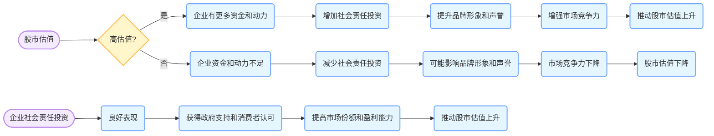

# 股市估值对企业社会责任投资的影响

> 关键词：股市估值、企业社会责任投资、市场机制、财务绩效、可持续发展

> 摘要：本文旨在深入探讨股市估值对企业社会责任投资的影响。通过对相关核心概念的阐述、算法原理的分析、数学模型的构建以及项目实战案例的研究，全面剖析了两者之间的内在联系和作用机制。同时，结合实际应用场景，探讨了股市估值与企业社会责任投资在不同领域的表现。最后，对未来发展趋势与挑战进行了总结，并提供了常见问题解答和扩展阅读参考资料，以期为企业决策和投资者提供有价值的参考依据。

## 1. 背景介绍 
### 1.1 目的和范围
本研究的目的在于系统地分析股市估值与企业社会责任投资之间的关系，探究股市估值如何影响企业在社会责任投资方面的决策和行为，以及这种影响对企业和市场的长期影响。研究范围涵盖了不同行业、不同规模的企业，以及国内外的股票市场，旨在全面、客观地揭示两者之间的普遍规律和特殊情况。

### 1.2 预期读者
本文预期读者包括企业管理者、投资者、金融分析师、学者以及对企业社会责任和金融市场感兴趣的相关人士。对于企业管理者，可通过本文了解股市估值对企业社会责任投资的影响，从而更好地制定企业战略；投资者可据此优化投资决策，寻找更具价值的投资标的；金融分析师可将其作为分析市场趋势和企业价值的参考；学者可在相关研究领域进行进一步的探讨和拓展。

### 1.3 文档结构概述
本文首先介绍了研究的背景、目的、预期读者和文档结构，以及相关的术语和概念。接着阐述了股市估值和企业社会责任投资的核心概念及其联系，并通过 Mermaid 流程图展示其架构。然后详细讲解了核心算法原理和具体操作步骤，同时给出了数学模型和公式，并举例说明。随后通过项目实战案例，包括开发环境搭建、源代码实现和代码解读，深入分析两者之间的关系。之后探讨了实际应用场景，推荐了相关的工具和资源。最后总结了未来发展趋势与挑战，提供了常见问题解答和扩展阅读参考资料。

### 1.4 术语表
#### 1.4.1 核心术语定义
- **股市估值**：是指对上市公司的股票价值进行评估的过程和结果。它是基于公司的财务状况、盈利能力、市场竞争力等多种因素，通过一定的估值方法来确定股票的合理价格范围。
- **企业社会责任投资**：是指投资者在进行投资决策时，不仅考虑财务回报，还考虑企业在社会责任方面的表现，如环境保护、社会公益、员工权益等。企业通过履行社会责任来实现可持续发展，并获得投资者的认可。

#### 1.4.2 相关概念解释
- **市场机制**：是指在市场经济中，通过价格、供求和竞争等因素的相互作用，实现资源的优化配置和经济的有效运行。在股市中，市场机制影响着股票的价格和企业的估值。
- **财务绩效**：是指企业在一定时期内的经营成果，通常通过营业收入、净利润、资产回报率等指标来衡量。财务绩效是企业股市估值的重要依据之一。
- **可持续发展**：是指既满足当代人的需求，又不损害后代人满足其需求的能力的发展模式。企业社会责任投资与可持续发展密切相关，企业通过履行社会责任来实现长期的可持续发展。

#### 1.4.3 缩略词列表
- **ESG**：Environmental, Social and Governance，即环境、社会和公司治理，是企业社会责任投资中常用的评估指标体系。

## 2. 核心概念与联系 

### 股市估值的核心概念
股市估值是金融领域的重要概念，它反映了市场对上市公司价值的预期。常见的估值方法包括市盈率法（P/E）、市净率法（P/B）、现金流折现法（DCF）等。市盈率法是通过将公司的股票价格除以每股收益来计算，反映了投资者为获取公司每一元盈利所愿意支付的价格。市净率法是将股票价格除以每股净资产，衡量了股票价格相对于公司净资产的倍数。现金流折现法是通过预测公司未来的现金流，并将其折现到当前时刻，来确定公司的内在价值。

### 企业社会责任投资的核心概念
企业社会责任投资强调企业在追求经济利益的同时，也要关注社会和环境问题。企业社会责任投资的领域包括环境保护、员工权益、社区发展、产品质量等。投资者在进行投资决策时，会考虑企业在这些方面的表现，认为具有良好社会责任表现的企业更具长期投资价值。

### 两者的联系
股市估值与企业社会责任投资之间存在着相互影响的关系。一方面，企业积极履行社会责任可以提升其品牌形象和声誉，增强市场竞争力，从而对股市估值产生积极影响。例如，一家注重环境保护的企业，可能会获得政府的支持和消费者的认可，进而提高其市场份额和盈利能力，推动股票价格上涨。另一方面，股市估值也会影响企业的社会责任投资决策。当股市估值较高时，企业可能有更多的资金和动力去进行社会责任投资，以维持良好的市场形象和投资者关系；而当股市估值较低时，企业可能会减少社会责任投资，优先考虑财务绩效的提升。

### 文本示意图
股市估值和企业社会责任投资的关系可以用以下示意图表示：

股市估值 <----> 企业社会责任投资
|                     |
|                     |
| 市场机制、财务绩效 |
|                     |
|                     |
V                     V
可持续发展

### Mermaid 流程图


## 3. 核心算法原理 & 具体操作步骤 

### 股市估值算法原理
以现金流折现法为例，其核心原理是将企业未来的现金流折现到当前时刻，以确定企业的内在价值。假设企业未来 $n$ 年的自由现金流分别为 $FCF_1, FCF_2, \cdots, FCF_n$，折现率为 $r$，则企业的内在价值 $V$ 可以通过以下公式计算：

$$V = \sum_{i=1}^{n} \frac{FCF_i}{(1 + r)^i} + \frac{TV}{(1 + r)^n}$$

其中，$TV$ 为企业的终值，通常采用永续增长模型计算：

$$TV = \frac{FCF_n(1 + g)}{r - g}$$

其中，$g$ 为企业的永续增长率。

### Python 代码实现
```python
def dcf_valuation(fcf_list, r, g):
    """
    现金流折现法计算企业内在价值
    :param fcf_list: 未来各年的自由现金流列表
    :param r: 折现率
    :param g: 永续增长率
    :return: 企业内在价值
    """
    n = len(fcf_list)
    present_value = 0
    # 计算前 n 年现金流的现值
    for i in range(n):
        present_value += fcf_list[i] / (1 + r) ** (i + 1)
    # 计算终值的现值
    fcf_n = fcf_list[-1]
    tv = fcf_n * (1 + g) / (r - g)
    present_value += tv / (1 + r) ** n
    return present_value

# 示例数据
fcf_list = [100, 120, 140, 160, 180]
r = 0.1
g = 0.05

# 计算企业内在价值
intrinsic_value = dcf_valuation(fcf_list, r, g)
print(f"企业内在价值: {intrinsic_value}")
```

### 具体操作步骤
1. **预测未来现金流**：通过对企业的历史财务数据、市场趋势和行业前景的分析，预测企业未来各年的自由现金流。
2. **确定折现率**：折现率反映了投资者对投资风险的预期，通常可以采用资本资产定价模型（CAPM）来确定。
3. **确定永续增长率**：永续增长率是指企业在长期内的增长率，通常根据行业的平均增长率和企业的竞争优势来确定。
4. **计算企业内在价值**：将预测的未来现金流和终值按照折现率折现到当前时刻，得到企业的内在价值。

### 企业社会责任投资评估算法原理
企业社会责任投资评估通常采用 ESG 指标体系，通过对企业在环境、社会和公司治理方面的表现进行评估，来确定企业的社会责任投资价值。常见的评估方法包括打分法、评级法等。以打分法为例，为每个 ESG 指标设定相应的权重和评分标准，对企业的各项指标进行打分，然后将各项得分加权求和，得到企业的 ESG 综合得分。

### Python 代码实现
```python
def esg_evaluation(esg_scores, weights):
    """
    ESG 指标体系评估企业社会责任投资价值
    :param esg_scores: 企业在环境、社会、公司治理方面的得分列表
    :param weights: 各项指标的权重列表
    :return: 企业的 ESG 综合得分
    """
    if len(esg_scores) != len(weights):
        raise ValueError("得分列表和权重列表长度必须一致")
    total_score = 0
    for i in range(len(esg_scores)):
        total_score += esg_scores[i] * weights[i]
    return total_score

# 示例数据
esg_scores = [80, 75, 85]  # 环境、社会、公司治理得分
weights = [0.3, 0.3, 0.4]  # 各项指标权重

# 计算 ESG 综合得分
esg_score = esg_evaluation(esg_scores, weights)
print(f"企业 ESG 综合得分: {esg_score}")
```

### 具体操作步骤
1. **确定 ESG 指标体系**：根据企业的行业特点和社会责任重点，确定适合的 ESG 指标体系。
2. **收集数据**：通过企业年报、社会责任报告、第三方评级机构等渠道，收集企业在各项 ESG 指标上的数据。
3. **打分**：根据评分标准，对企业的各项 ESG 指标进行打分。
4. **计算综合得分**：将各项得分按照权重加权求和，得到企业的 ESG 综合得分。

## 4. 数学模型和公式 & 详细讲解 & 举例说明 

### 股市估值数学模型
除了现金流折现法，市盈率法和市净率法也是常用的股市估值方法。

#### 市盈率法
市盈率（P/E）是指股票价格与每股收益的比率，计算公式为：

$$P/E = \frac{P}{EPS}$$

其中，$P$ 为股票价格，$EPS$ 为每股收益。通过已知的行业平均市盈率和企业的每股收益，可以估算企业的股票价格：

$$P = P/E_{avg} \times EPS$$

例如，某行业的平均市盈率为 20，企业的每股收益为 2 元，则该企业的股票价格估算为：

$$P = 20 \times 2 = 40 \text{ 元}$$

#### 市净率法
市净率（P/B）是指股票价格与每股净资产的比率，计算公式为：

$$P/B = \frac{P}{BVPS}$$

其中，$P$ 为股票价格，$BVPS$ 为每股净资产。通过已知的行业平均市净率和企业的每股净资产，可以估算企业的股票价格：

$$P = P/B_{avg} \times BVPS$$

例如，某行业的平均市净率为 3，企业的每股净资产为 10 元，则该企业的股票价格估算为：

$$P = 3 \times 10 = 30 \text{ 元}$$

### 企业社会责任投资与股市估值的关系模型
为了量化企业社会责任投资对股市估值的影响，可以建立线性回归模型：

$$V = \beta_0 + \beta_1ESG + \beta_2X_1 + \cdots + \beta_nX_n + \epsilon$$

其中，$V$ 为股市估值，$ESG$ 为企业的 ESG 综合得分，$X_1, \cdots, X_n$ 为其他影响股市估值的因素，如财务指标、行业因素等，$\beta_0, \beta_1, \cdots, \beta_n$ 为回归系数，$\epsilon$ 为误差项。

### 举例说明
假设我们收集了 100 家企业的数据，包括股市估值、ESG 综合得分、净利润增长率、资产负债率等。通过线性回归分析，得到回归方程：

$$V = 10 + 0.5ESG + 2G - 0.3D + \epsilon$$

其中，$G$ 为净利润增长率，$D$ 为资产负债率。这表明，在其他因素不变的情况下，企业的 ESG 综合得分每增加 1 分，股市估值将增加 0.5 个单位；净利润增长率每增加 1%，股市估值将增加 2 个单位；资产负债率每增加 1%，股市估值将减少 0.3 个单位。

## 5. 项目实战：代码实际案例和详细解释说明 

### 5.1  开发环境搭建
- **操作系统**：Windows、Linux 或 macOS 均可。
- **编程语言**：Python 3.x。
- **开发工具**：推荐使用 PyCharm 或 Jupyter Notebook。
- **相关库**：需要安装 pandas、numpy、scikit-learn 等库，可使用以下命令进行安装：
```sh
pip install pandas numpy scikit-learn
```

### 5.2  源代码详细实现和代码解读
#### 数据准备
首先，我们需要准备相关的数据，包括企业的财务数据、ESG 评分数据和股市估值数据。假设我们已经将数据存储在 CSV 文件中，以下是读取数据的代码：
```python
import pandas as pd

# 读取数据
data = pd.read_csv('stock_valuation_data.csv')

# 查看数据基本信息
print('数据基本信息：')
data.info()

# 查看数据集行数和列数
rows, columns = data.shape

if rows < 10:
    # 样本数量少于 10，则查看全量数据信息
    print('数据全部内容信息：')
    print(data.to_csv(sep='\t', na_rep='nan'))
else:
    # 样本数量多于 10，则查看数据前几行信息
    print('数据前几行内容信息：')
    print(data.head().to_csv(sep='\t', na_rep='nan'))
```
**代码解读**：这段代码使用 pandas 库读取 CSV 文件中的数据，并查看数据的基本信息和前几行内容。

#### 数据预处理
接下来，我们需要对数据进行预处理，包括处理缺失值、划分特征和标签等。
```python
from sklearn.model_selection import train_test_split
from sklearn.impute import SimpleImputer

# 提取特征和标签
X = data.drop('StockValuation', axis=1)
y = data['StockValuation']

# 处理缺失值
imputer = SimpleImputer(strategy='mean')
X = imputer.fit_transform(X)

# 划分训练集和测试集
X_train, X_test, y_train, y_test = train_test_split(X, y, test_size=0.2, random_state=42)
```
**代码解读**：这段代码使用 SimpleImputer 类处理缺失值，将缺失值用均值填充。然后使用 train_test_split 函数将数据划分为训练集和测试集，测试集占比为 20%。

#### 模型训练
我们使用线性回归模型来预测股市估值。
```python
from sklearn.linear_model import LinearRegression

# 创建线性回归模型
model = LinearRegression()

# 训练模型
model.fit(X_train, y_train)
```
**代码解读**：这段代码创建了一个线性回归模型，并使用训练集数据对模型进行训练。

#### 模型评估
最后，我们使用测试集数据对模型进行评估。
```python
from sklearn.metrics import mean_squared_error, r2_score

# 预测测试集数据
y_pred = model.predict(X_test)

# 计算均方误差和决定系数
mse = mean_squared_error(y_test, y_pred)
r2 = r2_score(y_test, y_pred)

print(f"均方误差: {mse}")
print(f"决定系数: {r2}")
```
**代码解读**：这段代码使用 mean_squared_error 函数计算均方误差，使用 r2_score 函数计算决定系数，评估模型的性能。

### 5.3  代码解读与分析
- **数据准备**：读取 CSV 文件中的数据是进行数据分析和建模的基础，通过查看数据的基本信息和前几行内容，可以快速了解数据的结构和特点。
- **数据预处理**：处理缺失值是数据预处理的重要步骤，使用均值填充缺失值是一种简单有效的方法。划分训练集和测试集可以帮助我们评估模型的泛化能力。
- **模型训练**：线性回归模型是一种简单而有效的预测模型，通过训练模型可以学习到特征和标签之间的关系。
- **模型评估**：均方误差和决定系数是常用的模型评估指标，均方误差越小，说明模型的预测误差越小；决定系数越接近 1，说明模型的拟合效果越好。

## 6. 实际应用场景 

### 企业决策
企业管理者可以根据股市估值和企业社会责任投资的关系，制定合理的企业战略。当股市估值较高时，企业可以加大在社会责任投资方面的投入，提升企业的品牌形象和声誉，进一步推动股市估值的上升；当股市估值较低时，企业可以优化社会责任投资的结构，提高投资效率，同时注重提升财务绩效，以改善股市估值。

### 投资者决策
投资者在进行投资决策时，可以将企业的社会责任表现纳入考虑范围。具有良好社会责任表现的企业，往往具有更高的可持续发展能力和市场竞争力，其股票可能具有更高的投资价值。投资者可以通过分析企业的 ESG 评分和股市估值，选择更具潜力的投资标的。

### 政策制定
政府和监管机构可以根据股市估值和企业社会责任投资的关系，制定相关的政策和法规，引导企业积极履行社会责任。例如，对社会责任表现优秀的企业给予税收优惠、财政补贴等支持，对社会责任表现较差的企业进行处罚和监管。

### 行业发展
股市估值和企业社会责任投资的关系也会影响行业的发展。在一个注重社会责任的行业中，企业之间的竞争将不仅仅局限于财务绩效，还包括社会责任表现。这将促使企业不断提升自身的社会责任水平，推动整个行业的可持续发展。

## 7. 工具和资源推荐
### 7.1 学习资源推荐
#### 7.1.1 书籍推荐
- 《金融市场与金融机构基础》：全面介绍了金融市场和金融机构的基本概念、理论和实践，对理解股市估值有很大帮助。
- 《企业社会责任：理论与实践》：系统阐述了企业社会责任的理论和实践，包括企业社会责任的概念、内涵、实施方法和评估体系等。
- 《投资学》：深入讲解了投资的基本原理、方法和策略，对投资者决策具有重要的指导意义。

#### 7.1.2 在线课程
- Coursera 上的“Financial Markets”课程：由耶鲁大学教授罗伯特·席勒（Robert Shiller）主讲，介绍了金融市场的基本原理和运行机制。
- edX 上的“Corporate Social Responsibility”课程：讲解了企业社会责任的理论和实践，以及如何将社会责任融入企业战略。
- 中国大学 MOOC 上的“投资学原理”课程：系统介绍了投资学的基本原理和方法，包括股票投资、债券投资、基金投资等。

#### 7.1.3 技术博客和网站
- 雪球网：提供了丰富的股票市场资讯和投资者交流平台，有助于了解股市动态和投资者观点。
- 新浪财经：是国内知名的财经媒体网站，提供了全面的金融市场信息和分析报告。
- 可持续发展投资联盟（USSIF）官网：专注于可持续发展投资领域，提供了大量的企业社会责任投资研究报告和案例分析。

### 7.2 开发工具框架推荐
#### 7.2.1 IDE和编辑器
- PyCharm：是一款专业的 Python 集成开发环境，具有强大的代码编辑、调试和分析功能。
- Jupyter Notebook：是一个交互式的开发环境，适合进行数据分析和模型开发，支持多种编程语言。

#### 7.2.2 调试和性能分析工具
- pdb：Python 内置的调试工具，可以帮助开发者定位和解决代码中的问题。
- cProfile：Python 内置的性能分析工具，可以分析代码的运行时间和资源消耗情况。

#### 7.2.3 相关框架和库
- pandas：是一个强大的数据分析库，提供了高效的数据结构和数据处理功能。
- numpy：是 Python 中用于科学计算的基础库，提供了高效的数组操作和数学函数。
- scikit-learn：是一个常用的机器学习库，提供了丰富的机器学习算法和工具。

### 7.3 相关论文著作推荐
#### 7.3.1 经典论文
- “The Social Responsibility of Business Is to Increase Its Profits” by Milton Friedman：这篇论文提出了企业的唯一社会责任是增加利润的观点，引发了广泛的讨论。
- “Stakeholder Theory of the Corporation” by R. Edward Freeman：阐述了利益相关者理论，强调企业应该考虑所有利益相关者的利益。

#### 7.3.2 最新研究成果
- 近年来，关于股市估值和企业社会责任投资的研究不断涌现，可通过学术数据库如 Web of Science、EBSCOhost 等查询相关的最新研究论文。

#### 7.3.3 应用案例分析
- 《企业社会责任投资案例集》：收集了国内外企业在社会责任投资方面的成功案例，对企业和投资者具有重要的参考价值。

## 8. 总结：未来发展趋势与挑战

### 未来发展趋势
- **社会责任投资市场规模不断扩大**：随着投资者对社会责任的关注度不断提高，企业社会责任投资市场将呈现出快速发展的趋势，市场规模将不断扩大。
- **ESG 指标体系不断完善**：ESG 指标体系将不断完善和标准化，为投资者提供更加准确、全面的企业社会责任评估信息。
- **科技赋能社会责任投资**：人工智能、大数据、区块链等技术将在社会责任投资领域得到广泛应用，提高投资决策的效率和准确性。
- **企业社会责任与股市估值的联系更加紧密**：企业积极履行社会责任将成为提升股市估值的重要因素，两者之间的联系将更加紧密。

### 挑战
- **数据质量和透明度问题**：企业社会责任数据的质量和透明度存在差异，投资者难以获取准确、全面的信息，影响了投资决策的准确性。
- **评估标准的一致性问题**：目前，不同的评估机构和投资者对企业社会责任的评估标准存在差异，缺乏统一的评估标准，导致评估结果的可比性较差。
- **短期利益与长期利益的平衡问题**：企业在进行社会责任投资时，可能面临短期利益与长期利益的平衡问题。一些社会责任投资项目可能在短期内无法带来明显的经济效益，但从长期来看，对企业的可持续发展具有重要意义。
- **法律法规和政策的不完善**：目前，关于企业社会责任投资的法律法规和政策还不够完善，缺乏有效的激励和约束机制，影响了企业和投资者的积极性。

## 9. 附录：常见问题与解答

### 1. 什么是股市估值？
股市估值是指对上市公司的股票价值进行评估的过程和结果。它是基于公司的财务状况、盈利能力、市场竞争力等多种因素，通过一定的估值方法来确定股票的合理价格范围。

### 2. 什么是企业社会责任投资？
企业社会责任投资是指投资者在进行投资决策时，不仅考虑财务回报，还考虑企业在社会责任方面的表现，如环境保护、社会公益、员工权益等。企业通过履行社会责任来实现可持续发展，并获得投资者的认可。

### 3. 股市估值与企业社会责任投资有什么关系？
股市估值与企业社会责任投资之间存在着相互影响的关系。一方面，企业积极履行社会责任可以提升其品牌形象和声誉，增强市场竞争力，从而对股市估值产生积极影响；另一方面，股市估值也会影响企业的社会责任投资决策。

### 4. 如何评估企业的社会责任表现？
通常采用 ESG 指标体系来评估企业的社会责任表现，包括环境、社会和公司治理三个方面。通过对企业在各项 ESG 指标上的表现进行打分和评级，来确定企业的社会责任投资价值。

### 5. 企业进行社会责任投资是否会影响其财务绩效？
从短期来看，企业进行社会责任投资可能会增加成本，对财务绩效产生一定的影响；但从长期来看，企业积极履行社会责任可以提升其品牌形象和声誉，增强市场竞争力，从而为企业带来更多的商业机会和经济效益，对财务绩效产生积极影响。

## 10. 扩展阅读 & 参考资料
- [1] 弗兰克·J·法博齐. 金融市场与金融机构基础[M]. 机械工业出版社, 2010.
- [2] 卡罗尔·A·阿切尔. 企业社会责任：理论与实践[M]. 机械工业出版社, 2015.
- [3] 滋维·博迪. 投资学[M]. 机械工业出版社, 2017.
- [4] Friedman, M. (1970). The Social Responsibility of Business Is to Increase Its Profits. The New York Times Magazine.
- [5] Freeman, R. E. (1984). Strategic Management: A Stakeholder Approach. Pitman Publishing.
- [6] 雪球网：https://xueqiu.com/
- [7] 新浪财经：https://finance.sina.com.cn/
- [8] 可持续发展投资联盟（USSIF）官网：https://www.ussif.org/